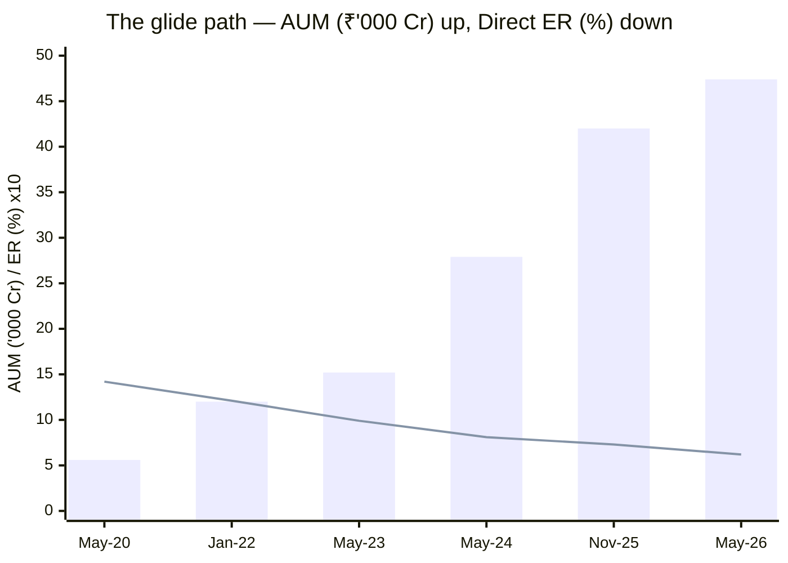
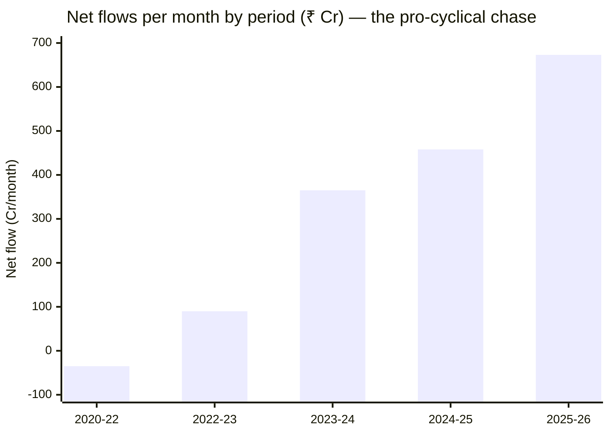
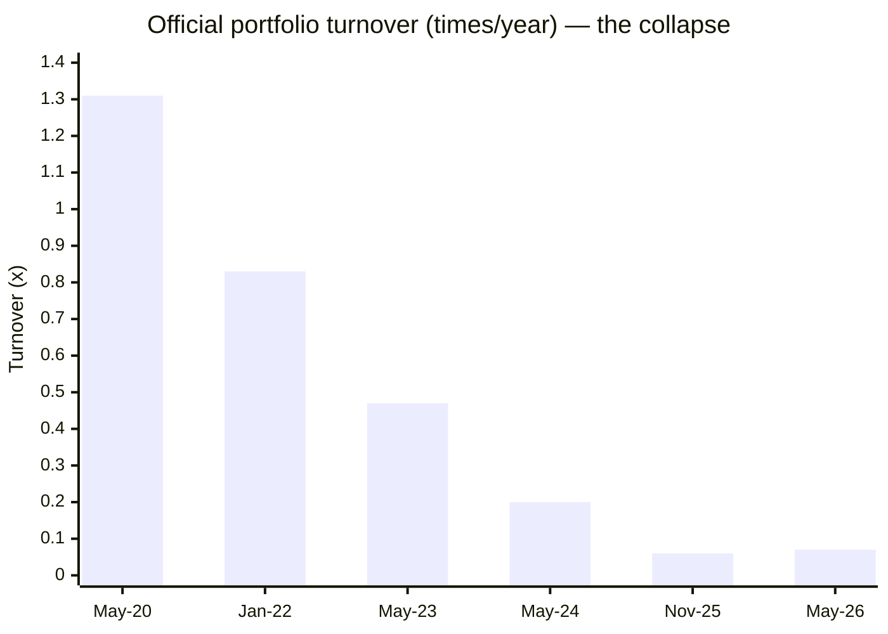

# Module 4: Cost & AUM Impact — Nippon India Growth Mid Cap Fund

## Module 4 Score: ~3.6 / 5 (provisional)

---

## Raw Data (Official AMC Factsheets + Computed, as of 03-Jul-2026)

| Metric | Value | Source |
|--------|-------|--------|
| **ER (Direct, official)** | **0.62%** (May-2026 factsheet) | AMC ⭐ |
| ER (Regular, official) | 1.25% | AMC |
| ER (Tickertape / Groww) | 0.73% / 0.82% | Stale — see reconciliation |
| **ER glide (Direct)** | **1.42% (2020) → 0.62% (2026), −56%** | AMC factsheet series |
| **AUM** | **₹47,415 Cr** (May-2026 month-end) | AMC = TT = VRO ✅ |
| **AUM trajectory** | ₹5,592 Cr (Jun-2020) → ₹47,415 Cr — **8.5× in 6 years** | AMC series |
| **Net flows (latest 6 months)** | **≈ +₹673 Cr/month, accelerating** | Computed (AUM − NAV decomposition) |
| **Official portfolio turnover** | **0.07× (7%)** — down from 1.31× in 2020 | AMC |
| **Exit load** | **1% within 1 MONTH; nil after** — lightest studied | AMC (corrects the 12-month assumption) |
| Fee premium vs index fund | 0.62 − 0.20 = **0.42%/yr** | Computed |
| Verified net alpha (M1) | **+2.0–2.1%/yr over 13.4y** | Computed (two proxies) |
| **Fee-for-alpha margin of safety** | **≈ 5×** | Computed |
| Gating history | None (AMC gated the Small Cap sibling, Jul-2023) | News-verified |
| Min investment | ₹100 lumpsum / ₹100 SIP — fully open | AMC |

**Data provenance (a module-level breakthrough):** the AMC's monthly factsheet innerpages, though blocked to standard fetchers, opened to a direct browser-headers request — so this module runs on **official Nippon factsheets for Jun-2020, Jan-2022, Jun-2023, Jun-2024, Dec-2025 and Jun-2026**, not aggregator approximations. Bonus validation: the Jun-2026 factsheet's own risk ratios (SD 18.10, beta 0.94, Sharpe 0.97, 36-month MIBOR basis) independently corroborate Module 2's computed 17.67 / 0.96 / 0.94.

---

## What Module 4 Is Really Asking

For this fund the module collapses into two questions with opposite answers:

1. **Is the fee justified?** Emphatically yes — the strongest fee-for-alpha case in any of the four studies (§ Fee-for-Alpha).
2. **Is the size sustainable?** The most troubling capacity trajectory in the shortlist — accelerating pro-cyclical flows carrying the fund past the study's own AUM ceiling within months (§ The 2027 Elimination Problem).

The final score is the collision of a 5 and a 2.5.

---

## ⭐ The Official Glide Path — ER, AUM and Turnover, 2020 → 2026 *(new section — the factsheet triptych)*

| Factsheet | AUM (Cr, month-end) | ER Regular | **ER Direct** | **Official turnover** | Managers listed |
|-----------|--------------------:|-----------:|--------------:|----------------------:|-----------------|
| May-2020 | 5,592 | 2.03% | 1.42% | **1.31×** | Gunwani, Shah, Sheth |
| Jan-2022 | 12,045 | 1.89% | 1.21% | 0.83× | Gunwani, Shah, Sheth |
| May-2023 | 15,165 | 1.74% | 0.99% | 0.47× | Shah, Sheth (post-Gunwani) |
| May-2024 | 27,931 | 1.62% | 0.81% | 0.20× | **Patel** + Doshi (asst.) |
| Nov-2025 | 42,042 | 1.53% | 0.73% | 0.06× | Patel |
| **May-2026** | **47,415** | **1.25%** | **0.62%** | **0.07×** | Patel |

> Bars = AUM in ₹'000 Cr; line = Direct ER ×10 (1.42% plots as 14.2). The scissors pattern — AUM 8.5×, fee −56% — is the cleanest economies-of-scale pass-through documented in any of the four studies.

Three stories live in this one table, developed in the sections below: the **fee glide** (investor-friendly), the **AUM explosion** (the capacity problem), and the **turnover collapse** (size becoming visible in behavior).

---

## Expense Ratio — Cross-Source Reconciliation

| Source | ER (Direct) | Explanation |
|--------|-------------|-------------|
| **AMC factsheet, May-2026** | **0.62%** | The current official number ⭐ |
| Tickertape (Jul-2026 screener) | 0.73% | Matches the Nov-2025 factsheet — a stale feed |
| Groww | 0.82% | Staler still (mid-2024 era) |
| VRO (Regular) | 1.24% | Matches official 1.25% ✅ |

Every aggregator was quoting a different month of a *continuously falling* series — the screening-era "0.73%" already overstates today's cost by 11bps. Note the sharpness of the latest step: Regular 1.53% → 1.25% and Direct 0.73% → 0.62% in six months. **Peer caveat:** the shortlist peers' ERs (Mahindra 0.42, Edelweiss 0.48, Invesco 0.49 per Tickertape) carry the same staleness risk in unknown directions — at 0.62% official, Nippon is **mid-pack-to-cheap, not the discount leader**, and per-fund verification happens in each peer's own study.

---

## SEBI TER Positioning — At the Regulatory Floor

At ₹47,415 Cr, the SEBI TER slab structure puts an equity scheme's maximum Regular TER near its **~1.05% + increments floor** — Nippon's 1.25% (incl. applicable additions) sits close to the regulated minimum for its size. Two implications: (1) the scale benefit has genuinely been passed through, not pocketed; (2) **the fee-glide story is over** — there is no meaningful headroom left, so future ER improvement cannot keep compensating for capacity strain the way it has since 2020. The Direct-Regular gap (0.63%) is a standard distribution load.

---

## ⭐ The Fee-for-Alpha Test — The Strongest Case in the Four Studies *(the module's critical row)*

The study plan's central M4 question: does verified alpha exceed the fee premium over the investable 0.20% index fund?

| Component | Value |
|-----------|-------|
| Fee premium over index fund | 0.62% − 0.20% = **0.42%/yr** |
| Verified **net** alpha (M1: 13.4y, two proxies) | **+2.0–2.1%/yr** (already after fees) |
| Implied gross value-add | ≈ +2.5%/yr |
| **Margin of safety** | **≈ 5×** — alpha could decay ~80% before the fee stopped paying |

### The 10-Year SIP in Rupees (₹20K/month, 18% gross market assumption)

| Scenario | Net return | Corpus | vs index fund |
|----------|-----------|--------|---------------|
| Index fund (0.20%) | 17.80% | ₹61.2L | — |
| **Nippon, alpha dies completely** | 17.38% | ₹59.8L | **−₹1.37L** (the worst case) |
| **Nippon, historical +2% alpha persists** | 19.38% | **≈ ₹66L** | **≈ +₹4.7L** |
| Nippon Regular (1.25%) | 16.75% | ₹57.8L | −₹3.36L |
| Sundaram-priced active (0.88%), no alpha | 17.12% | ₹59.0L | −₹2.20L |

**The asymmetry is the decision:** risk ~₹1.4L (if alpha vanishes) to win ~₹4.7L (if 13 years of evidence persists). Compare Franklin US — the anti-case — which charges a 1.15% premium over its index alternative for *negative* alpha. Nippon is the only fund in the four studies where the active fee is a **statistically evidenced positive-expected-value purchase**.

---

## Direct vs Regular — The 0.63% Gap

₹59.8L vs ₹57.8L over the 10-year SIP: **≈ ₹2L of corpus for a form-filling choice.** The gap equals roughly half the value of the fund's entire selection alpha — the same sermon as every prior study, still the highest-ROI decision available.

---

## Exit Load — The Lightest Lock Studied *(corrects Module 1)*

**Official: 1% only if redeemed within 1 MONTH of allotment; nil thereafter.** (Module 1's identity table assumed the standard 12-month load — corrected there.)

| Fund | Exit load |
|------|-----------|
| **Nippon Growth** | **1% / 1 month** ⭐ |
| DSP Small Cap | 1% / 12 months |
| Franklin US | 1% / 12 months |
| PP FlexiCap | 2% <1yr, 1% <2yr — the strictest |

For a SIP investor every instalment is free to exit 30 days after purchase — maximum flexibility, zero lock friction. The flip side is structural: **the door is wide open for hot money**, and §Flows shows the hot money is arriving. (PP's punitive load is a deliberate behavioral filter; Nippon runs no such filter.)

---

## ⭐ The AUM Story — 8.5× in Six Years, and the Flows Are Accelerating

### Flow Decomposition (market vs money, computed AUM − NAV)

| Period | AUM growth | NAV growth | **Implied net flows** | Monthly rate |
|--------|-----------:|-----------:|----------------------:|-------------:|
| Jun-2020 → Jan-2022 | 2.15× | 2.28× | **−₹698 Cr — outflows!** | ~−₹35 Cr/mo |
| Jan-2022 → May-2023 | 1.26× | 1.14× | +₹1,431 Cr | ~+₹90 Cr/mo |
| May-2023 → May-2024 | 1.84× | 1.55× | +₹4,389 Cr | ~+₹365 Cr/mo |
| May-2024 → Nov-2025 | 1.51× | 1.21× | +₹8,240 Cr | ~+₹458 Cr/mo |
| **Nov-2025 → May-2026** | 1.13× | 1.03× | **+₹4,023 Cr** | **~+₹673 Cr/mo** |
| *Cumulative* | *8.5×* | *5.0×* | *≈ +₹19,241 Cr* | |

**Read the first bar twice.** During the fund's single best performance stretch (NAV 2.28× in 20 months), investors *withdrew* ₹698 Cr. The money only arrived after the 2023 rally made the trailing CAGRs shiny, and it is arriving fastest **right now** — ₹673 Cr/month, pro-cyclically, at all-time-high NAV. This is textbook retail flow-chasing, now at a scale that binds the manager. (It also quietly flatters the fund's investor base quality question: today's inflows are largely SIP-driven and sticky, but they were *not there* through the hard years.)

### The Forced-Deployment Arithmetic — Why the Deep Band Died

- ₹673 Cr/month × 65% mandate ≈ **₹440 Cr/month must enter mid-cap stocks** — the fund must add the equivalent of **one median position (₹412 Cr, Module 3) every month**, at whatever prices prevail.
- **The ownership ceiling:** a 2% conviction position = ₹950 Cr = **9.5% of a ₹10,000 Cr deep-mid** — brushing SEBI's 10% cap. The bottom of the band is *arithmetically* closed to this fund. Module 3's 40/20/8 liquid-end tilt is not a preference; it is this equation.
- Mitigants, honestly weighed: the Midcap-150 band is liquid (this is not the SmallCap study's spiral risk); the graduation escalator's large-cap anchors (ICICI, PFC) can absorb any ticket; and Modules 1–3 prove the machine still performs *at this very size* (#1 Sharpe of the shortlist).

---

## ⭐ The Turnover Collapse — Size in Motion *(new section; nuances Module 3)*

Official portfolio turnover: **1.31× (2020) → 0.83 (2022) → 0.47 (2023) → 0.20 (2024) → 0.06–0.07 (2025–26).**

Three forces, all real:
1. **Mechanical:** SEBI's PTR = lower of purchases/sales ÷ avg AUM — huge net inflows mean fresh cash does the rebalancing (buys don't count against sales), deflating the ratio.
2. **Structural:** a ₹47K Cr fund physically cannot trade a mid-cap book at 131%/yr without destroying its own prices; low churn is the only viable mode.
3. **Stylistic:** the Patel-era buy-and-hold is consistent with the escalator strategy.

**Module 3 correction (honest revision):** M3 framed the low churn as a long-standing house trait that helped strategy survive manager changes. The factsheet series shows the truth is more interesting — **under Gunwani in 2020 this fund turned over 131%/yr; the ultra-low churn is recent, size-forced, and Patel-coincident.** What *did* persist across manager eras is the defensive alpha fingerprint (M1), not the trading tempo. The cost implication stands regardless: at today's ~7%, hidden transaction drag is minimal — one genuine advantage of the current mode. Module 5 must now ask whether Patel *chose* buy-and-hold or was *cornered* into it.

---

## ⭐ The 2027 Elimination Problem — The Fund Will Soon Fail Its Own Screen *(new section — the trajectory red flag)*

The study's Stage-1 screening cap was **AUM ≤ ₹50,000 Cr** (HDFC and Kotak were eliminated above it). Now:

| Input | Value |
|-------|-------|
| Current AUM | ₹47,415 Cr (May-2026) |
| Current net flows | ≈ +₹673 Cr/month, accelerating |
| Distance to the cap | ₹2,585 Cr ≈ **~4 months of flows alone**, before any market gain |
| At flows + 12% NAV growth | **crosses ₹50K Cr around late-2026; ~₹60K Cr within ~18 months** |

**Re-run this study's own screen in 2027 and its reference-frame fund is eliminated alongside HDFC and Kotak.** That is the single most important forward-looking fact in this module. The countervailing evidence: the liquid band, the escalator, the fee pass-through, and — decisively — Modules 1–3 showing *no performance decay yet* at a size where the screen presumes decay. The screen's cap is a heuristic; the fund is currently beating the heuristic. But every input (flows, NAV, the deep-band closure, the turnover floor) points one direction, and the tripwires (active share < ~45%, band split degrading from 40/20/8) now have a *timeline* attached: **the next 12–24 months are the test window.**

### The Gating Asymmetry

The AMC has the industry's cleanest capacity precedent: it **gated Nippon India Small Cap in Jul-2023** (lumpsum halt; SIPs capped ₹5L/day/PAN) — genuinely investor-first. Yet **this fund remains fully open at ₹100 minimums** while absorbing the fastest flows of its life. The generous reading: midcap liquidity genuinely supports more AUM than smallcap. The skeptical reading: Growth Mid Cap is now the AMC's flow-gathering flagship and gating it costs real revenue. Module 6 inherits this question; for M4 it scores as "no gating signal despite a live precedent."

---

## Peer Cost & AUM Matrix (7 Shortlisted)

| Fund | ER% (TT-dated ⚠) | AUM (Cr) | AUM ladder position | Fee-for-alpha status |
|------|------------------|----------|--------------------|--------------------|
| Mahindra Manulife | 0.42 | 4,866 | Small-agile | untested (their study) |
| Edelweiss | 0.48 | 16,849 | Sweet spot | untested |
| Invesco | 0.49 | 12,397 | Sweet spot | untested |
| HSBC | 0.56 | 14,249 | Sweet spot | untested |
| **Nippon (official)** | **0.62** | **47,415** | **⚠ Top of "approaching constraint"** | **✅ proven (5× margin)** |
| ICICI Pru | 0.87 | 7,789 | Sweet spot, pricey | untested |
| Sundaram | 0.88 | 13,687 | Sweet spot, priciest | untested |

Nippon is the **only shortlist fund outside the AUM sweet spot — and the only one with a proven fee-for-alpha case.** The study's eventual head-to-heads (esp. vs Invesco) will weigh a proven-but-constrained giant against unproven-but-unconstrained mid-sizers.

---

## Comparison with Studied Funds

| Dimension | **Nippon (MidCap)** | DSP Small Cap | PP FlexiCap | Franklin US |
|-----------|--------------------|--------------|--------------|-------------|
| Direct ER (official) | **0.62%** | 0.64% | ~0.53–0.63% | ~1.35% true all-in |
| Fee vs investable index | **+0.42% for +2.0% alpha** ✅ | no clean index alt | positive alpha ✅ | +1.15% for *negative* alpha ❌ |
| AUM | ₹47.4K Cr, **8.5× in 6y** | ₹17.9K Cr | ₹1.41L Cr | ₹5.9K Cr |
| Current flows | +₹673 Cr/mo accelerating | gated/managed | large but large-cap-absorbable | growing |
| Gating record | none (AMC gated SC sibling) | **3 voluntary restrictions** ⭐ | none | n/a (SEBI cap risk instead) |
| Exit load | **1%/1mo** ⭐ lightest | 1%/12mo | 2%/1yr-1%/2yr strictest | 1%/12mo |
| Scale benefit shared | **ER −56% in 6y** ⭐ | partial | yes | no |
| Capacity verdict | Best deal, worst trajectory | managed | segment-shielded (63% large/foreign) | unconstrained |

**Placement:** PP's AUM story (₹1.41L Cr) remains the family's biggest headline, but its assets sit largely in infinitely-liquid large caps and foreign equity — size is diluted by mandate. Nippon is the only studied fund whose entire mandate sits in a **fixed 150-stock pond** while growing at this rate: its capacity question is sharper than PP's despite being a third the size. DSP's three voluntary gates remain the stewardship gold standard Nippon hasn't matched.

---

## Points For / Points Against — Cost & AUM

### ✅ Points For

- **The strongest fee-for-alpha case of the four studies** — 0.42% premium vs +2.0% verified net alpha; ~5× margin of safety; asymmetric SIP payoff (−₹1.4L worst vs +₹4.7L base)
- **Official Direct ER 0.62%** — cheaper than every aggregator shows; near the regulatory floor
- **A −56% fee glide passed to investors** as AUM grew 8.5× — documented economies-of-scale sharing
- **Lightest exit load studied** (1%/1 month) — every SIP instalment unlocked in 30 days
- **~7% turnover minimizes hidden transaction drag** exactly where size makes trading expensive
- Flow base is now SIP-heavy and sticky; midcap band liquidity makes redemption-spiral risk minor

### ❌ Points Against

- **The worst capacity trajectory in the shortlist** — ₹47,415 Cr, +₹673 Cr/month, accelerating and pro-cyclical; **crosses the study's own ₹50K Cr screening cap within months** (the 2027 elimination problem)
- **Only shortlist fund outside the AUM sweet spot** — and the deep band (ranks ~200–250) already arithmetically closed (10%-ownership math)
- **No gating signal despite the AMC's own Small-Cap precedent** — fully open at ₹100 minimums while swelling; flag-ship-revenue skepticism warranted
- **The fee-glide compensation is exhausted** — at the TER floor, there is no further ER give-back to offset future capacity strain
- The turnover collapse (1.31×→0.07×) is size-in-motion — the fund's trading flexibility is a fraction of what built the pre-2022 record
- Flow history shows the investor base chased returns (outflows 2020–22, floods 2024–26) — the money is stickier now but arrived at the top
- Light exit load = no behavioral filter against hot money (PP's strictness looks wise in contrast)

---

## Module 4 Scorecard

| Sub-dimension | Weight | Score | Reasoning |
|---------------|--------|-------|-----------|
| Expense Ratio (Direct) | High | **4.0** | 0.62% official — 0.45–0.65 band; −56% glide; at regulatory floor (no further headroom) |
| **ER vs verified alpha (the index-fund test)** | **Critical** | **5.0** | +2.0% net alpha vs 0.42% premium = ~5× margin — the strongest case in any study; Franklin's exact inverse |
| AUM position on the ladder | High | **2.5** | ₹47,415 Cr — top of "approaching constraint"; months from the study's own cap; only fund outside the sweet spot |
| Active-share trend as AUM grew | High | **3.0** | Single AS reading (54.1%) — but turnover collapse, deep-band closure and accelerating flows are all decay-side evidence; the 12–24-month test window is now defined |
| Forced deployment | Medium | **3.0** | ₹440 Cr/month into the band = one median position monthly; absorbable in a liquid band but binding at the deep end |
| Exit load | Low | **5.0** | 1%/1 month — lightest studied |
| AUM trajectory | Low (plan) / elevated here | **2.0** | Fastest-growing giant in the study; pro-cyclical; no gating despite precedent |

**Module 4 Score: ~3.6 / 5** — the fund's first sub-4 module, and correctly so: M4 is where the giant pays. In one line: **the best fee-for-alpha deal in the four studies, attached to the worst capacity trajectory in the shortlist.**

---

## Comparative Module 4 Scores

| Fund | Category | M4 Score | Cost/AUM character |
|------|----------|----------|--------------------|
| PP FlexiCap | FlexiCap | ~3.8 | Cheap, giant but segment-shielded |
| **Nippon Growth Mid Cap** | MidCap | **~3.6** | Proven fee-for-alpha; unmanaged capacity trajectory |
| DSP Small Cap | SmallCap | ~3.9 | Mid-priced, gold-standard gating |
| Franklin US Opp | International | 2.8 | Double-layer 1.35% for negative alpha |

---

## SIP Implication

1. **Use the Direct plan, obviously** — the 0.63% Regular gap costs ≈ ₹2L per ₹24L invested over 10 years.
2. **The fee is not a reason to hesitate** — at 0.62% vs a 0.20% index fund, you are paying 0.42%/yr for an engine with a 13-year, +2%/yr, two-proxy track record; the downside of being wrong is ~₹1.4L, the upside of being right ~₹4.7L on a 10-year ₹20K SIP.
3. **The size is the reason to monitor** — put a *calendar date* on the tripwires: check active share, the 40/20/8 band split, and AUM vs ₹50K/₹60K Cr **every ~6 months for the next 2 years**. This fund's risk isn't hidden in the fee table; it's in the flow line.
4. **Watch for a gating announcement as the bullish signal** — if the AMC ever restricts this fund the way it restricted Small Cap in 2023, that is capacity stewardship *arriving*; its absence while flows accelerate is the thing to hold against them.

---

## One-Line Verdict

> **Nippon Growth's Module 4 is a collision: on cost, the best deal in the four studies — an official 0.62% Direct ER (cut 56% as AUM grew 8.5×, now at the regulatory floor), a 0.42% premium over the index fund covered five times over by verified +2%/yr alpha, and the lightest exit load studied — but on capacity, the shortlist's worst trajectory: ₹47,415 Cr swelling at an accelerating, pro-cyclical ₹673 Cr/month that closed the deep band (10%-ownership arithmetic), collapsed official turnover from 1.31× to 0.07×, and will carry the fund past this study's own ₹50,000 Cr screening cap within months — with no gating signal despite the AMC's own Small-Cap precedent. The best fee-for-alpha purchase in the study, on a clock. Provisional: ~3.6/5.**

---

*Module 4 completed: July 3, 2026 | Cost & AUM Impact | Primary source: official AMC factsheet innerpages (Jun-2020, Jan-2022, Jun-2023, Jun-2024, Dec-2025, Jun-2026) fetched directly — ER glide 1.42→0.62 Direct, AUM 5,592→47,415 Cr, turnover 1.31×→0.07× all official | Flow decomposition computed (factsheet AUM − MFAPI NAV growth): −₹35 → +₹673 Cr/month | Factsheet 36-mo ratios (SD 18.10, β 0.94, Sharpe 0.97) validate Module 2's computations | Exit load corrected to 1%/1-month (Module 1 patched) | Gating: Nippon SC gated Jul-2023 (news-verified); this fund fully open | SIP simulations: ₹20K/mo, 10y, 18% gross | Provisional M4 Score: ~3.6/5 (tripwires now time-boxed: AS/band-split/AUM checks each ~6 months; expect ₹50K Cr breach ~late-2026)*
