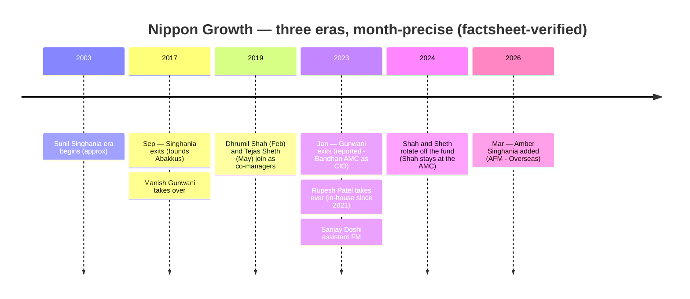
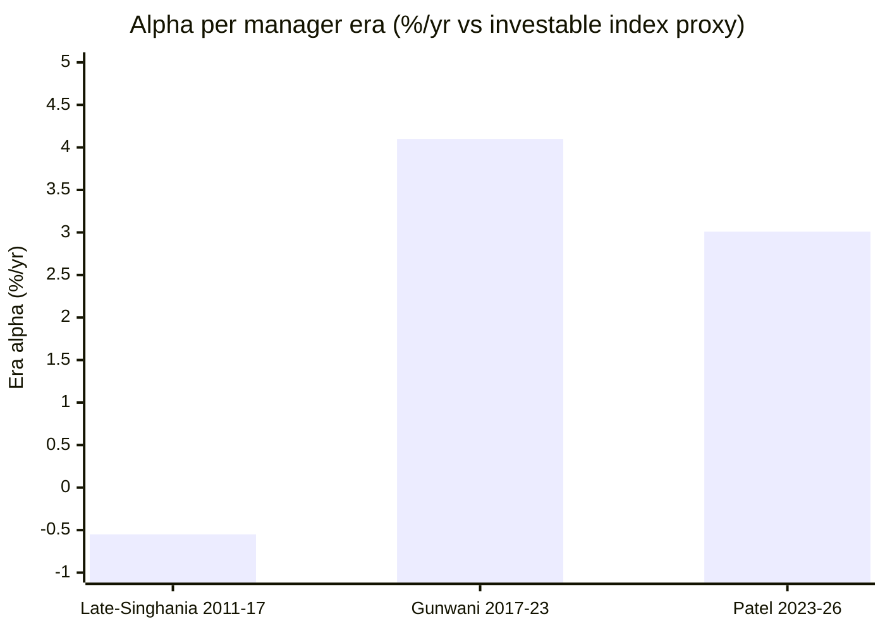

# Module 5: Fund Manager Quality — Nippon India Growth Mid Cap Fund

## Module 5 Score: ~3.5 / 5 (provisional) — The Instability Paradox

---

## Raw Data (Cross-Source Verified, as of 03-Jul-2026)

| Field | Value | Source |
|-------|-------|--------|
| **Current lead manager** | **Rupesh Patel, since January 2023 (~3.5 years)** | AMC factsheets, VRO, Groww ✅ |
| Patel's experience | ~26 years (equity, PE real estate, credit, infrastructure) | AMC team page |
| Patel at Nippon since | 2021 (Senior Fund Manager — **1.5 years inside before inheriting the fund**) | AMC / news |
| Prior house | Tata Asset Management, 2008–2021 (incl. **Tata Midcap Growth**) | AMC bio, news |
| Overseas sleeve | Kinjal Desai (since May-2018 — spans all three eras) | Groww / AMC |
| Newest addition | **Amber Singhania, Mar-2026** (AMC title: Assistant FM – Overseas; 22y sell-side research) | Groww + AMC team page |
| Predecessors | Sunil Singhania (~2003 → Sep-2017) · **Manish Gunwani (Sep-2017 → Jan-2023)** | Factsheets, VRO |
| Co-manager history | Dhrumil Shah (Feb-2019 → ~2024; **still at Nippon AMC**), Tejas Sheth (May-2019 → ~2024; off the AMC team page), Sanjay Doshi (asst., 2023 → ~2025) | Factsheet series + AMC team page |
| Stated philosophy | **GARP — Growth At a Reasonable Price** | AMC factsheets (stated since at least 2022) |
| Individual SEBI record | Clean — all three eras | Search-verified (nil adverse) |
| Skin in the game | **Not publicly disclosed** (SAI bot-blocked) | Documented gap |

**Method note:** the manager timeline is reconstructed month-precise from the official factsheet series fetched in Module 4 (Jun-2020, Jan-2022, Jun-2023, Jun-2024, Dec-2025, Jun-2026) — each sheet names its managers, giving hard dates that aggregators blur. Era performance below is computed from MFAPI NAVs against the Module 1 index proxies.

---

## ⭐ The Instability Paradox — Franklin's Exact Mirror *(the framing section)*

The International study's Franklin module coined the **stability paradox**: the best manager continuity of any studied fund (Grant Bowers, 19 years) producing index-*lagging* output. Nippon Growth is the mirror image:

> **The worst lead-manager continuity of any top-scoring studied fund — three lead changes in nine years, plus co-manager churn beneath — and the alpha survived every single transition.**

| | Franklin US | **Nippon Growth** |
|---|---|---|
| Lead continuity | 19 years, one manager ⭐ | 3 leads in 9 years ❌ |
| Output vs own index | **Negative alpha** ❌ | **+2.1%/yr × 13.4y** ⭐ |
| What you're buying | A person (inaccessible) | **A machine (person-independent, empirically)** |

The module's task is to decide whether person-independence is a durable strength (a *process* asset) or survivorship luck. The era-attribution table is the evidence.

---

## What Module 5 Is Really Asking

For most funds: *is the manager good, and will they stay?* For this fund, after M1–M4, the sharper questions:

1. **Whose alpha is the record?** (three eras claim pieces of it)
2. **Is Patel's 3.5-year sample good enough** to trust the next decade?
3. **Does the process actually outrank the person** — or did the fund get lucky twice?
4. **Is anyone defending capacity?** (M4's open wound, manager-side)

---

## The Complete Management Timeline

| Period | Lead | Co / assistant | Exit destination |
|--------|------|----------------|------------------|
| ~2003 → Sep-2017 | Sunil Singhania | — | Founded Abakkus Asset Manager |
| Sep-2017 → Jan-2023 | **Manish Gunwani** | Shah (Feb-2019→), Sheth (May-2019→) | Reported: Bandhan AMC (CIO) |
| Jan-2023 → now | **Rupesh Patel** | Doshi (2023→~2025), Amber Singhania (Mar-2026→), Desai (overseas, May-2018→) | — |

Beneath the three lead eras sits real co-manager rotation (Shah, Sheth, Doshi all on-and-off within ~5 years). This is emphatically **not** PP's grown-inside-the-culture continuity — the only continuity threads are Kinjal Desai's minor overseas sleeve and *the book itself* (96 stocks, ~7% turnover — physically slow to change hands).

---

## ⭐ The Era-Attribution Table — The Module's Centerpiece *(computed)*

Each era's alpha, computed from NAVs against the investable index proxies (Module 1 method):

| Era | Window | Fund CAGR | Index proxy CAGR | **Era alpha** | What it contains |
|-----|--------|-----------|------------------|---------------|------------------|
| Late-Singhania | Feb-2011 → Sep-2017 (Regular NAV) | 14.01% | 14.56% (M100 ETF) | **≈ −0.55** (≈ +0.7 direct-basis) | Two full cycles — index-ish |
| **Gunwani** | Sep-2017 → Jan-2023 | 14.31% | 10.21% (M100 ETF) | **+4.10** | The winter (+5.0/+10.9 alpha years), COVID, 2022 (+3.1) |
| **Patel** | Jan-2023 → Jul-2026 | 25.42% | 22.41% (M150 index fund) | **+3.01** | 2023 best-of-peers, 2024 worst-of-peers (but +3.7 vs index), the 2024–25 correction beaten on depth and recovery |

**Three readings:**

1. **The alpha barely flinched at the 2023 handover** — +4.10 → +3.01, with the newer number earned in a window (2023–26) far less friendly to a defensive style than Gunwani's stress-rich era.
2. **⭐ The Legend-vs-Ledger sidebar:** the fund's fame rests on the Singhania brand (2009 +97%, 2014 +56%) — but the *measured* late-Singhania period (2011–2017) was approximately index-level. The fund's best institutional-grade alpha was produced by its two *least famous* managers. The brand and the alpha live in different eras — strong evidence that the machine outranks the star.
3. **Patel's own stress test is passed.** He fails the rubric's "was the manager there in 2018?" test (that's Gunwani's) — but the 2024–25 correction (−19.9% vs index −21.0%, recovered a month faster, repeated in the Feb-2026 dip) is a genuine, no-excuses test *under his name*, and Module 2 showed it was the best-in-shortlist navigation.

---

## Manager Profile: Rupesh Patel — The Valuation-Formed Inheritor

### Career Timeline

| Period | Role | Relevance |
|--------|------|-----------|
| ~2001–2008 | CARE Ratings (credit analysis); Indiareit Fund Advisors (PE real estate) | **Valuation/credit formation** — downside-first thinking |
| 2008–2012 | Tata AMC — DGM (Investments) | |
| 2012–2013 | Tata AMC — Principal Officer, PMS | Portfolio accountability |
| ~2013–2021 | Tata AMC — Fund Manager: **Tata Midcap Growth**, Large Cap, Tax Saving (ELSS), Focused Equity, Infrastructure | **Direct midcap fund experience** + breadth |
| 2021–2023 | Nippon — Senior Fund Manager | **The grooming period: 1.5 years inside before inheriting** |
| Jan-2023 → | **Lead, Nippon Growth Mid Cap** | +3.01%/yr era alpha |

Education: civil engineering + MBA (Finance), Sardar Patel University. ~26 years total experience.

### Credentials in Context

Patel's formation is unusual for an equity lead — **credit ratings and private-equity real estate before public equity**. That background reads directly onto this fund's observable fingerprint: the PE discount (29.3 vs category 33.8), the BSE underweight (refusing the band's hottest name), the GARP label, full-investment-no-heroics. Where DSP's Sambre is a bottom-up small-cap romantic and PP's Thakkar a Buffett-school allocator, Patel profiles as a **downside-first valuation engineer** — arguably the right temperament for a ₹47,415 Cr defensive breadth machine.

### ⭐ Chose-or-Cornered — Patel × the Turnover Collapse *(closing Module 4's open question)*

Module 4 showed official turnover collapsing 1.31× (2020) → 0.07× (2026), largely across Patel's arrival. Did he choose buy-and-hold or was he cornered by size? **Both — and the combination is favorable.** The collapse was underway pre-Patel (0.83 by 2022, 0.47 by 2023) — size was cornering the fund regardless. What the AMC then did was appoint a manager whose valuation-led, low-churn temperament *suits* being cornered. A momentum manager at this size would be a catastrophe; a GARP engineer is the right jockey for a heavy horse. The concern isn't the style-size fit (excellent) — it's that no jockey can make the horse lighter (M4's trajectory problem stands).

---

## Investment Philosophy — GARP, Stated and Behavior-Verified

- **Stated:** the AMC factsheets explicitly describe a **GARP (Growth At a Reasonable Price)** style — documented since at least the Jan-2022 sheet, i.e., *predating* Patel.
- **Behavior-verified across eras:** the fingerprint — index-level participation in manias, protection in stress (99%/90% capture), froth underweights, PE discipline, the graduation escalator — is visible in the NAV under Gunwani *and* Patel, and structurally embedded in a 96-stock, ~7%-turnover book that no new arrival can whipsaw quickly.
- **The caveat:** there is no manifesto-grade public articulation (no PPFAS-style unitholder meetings, no DSP-style investor letters). The philosophy is factsheet-stated and behavior-proven, not evangelized. Score high as a *house process*, modest as *communication*.

### Philosophy Under Real Market Pressure

| Test | Behavior | Verdict |
|------|----------|---------|
| 2018 LTCG + reclassification winter | −10.3%/+7.4% vs peers' −15/+1; +5.0/+10.9 index alpha | ✅ (Gunwani) |
| COVID crash | Fell with the band (−35.3%), recovered in 7 months, no panic restructuring | ✅ (Gunwani) |
| 2021 froth | Matched index (+0.7 alpha), didn't chase | ✅ (Gunwani) |
| 2023 rally | Best of all 7 peers (+49.8%) | ✅ (Patel) |
| 2024 narrow momentum market | Worst of peers (+27.9%) — refused the momentum trade, still +3.7 vs index | ✅ discipline, ❌ peer optics (Patel) |
| 2024–25 correction + 2026 dip | Beat index on depth and recovery, twice | ✅ (Patel) |

The 2024 row is the philosophy's price tag: GARP discipline *will* lag narrow momentum rallies (Invesco +45.0% that year). The style's integrity is proven precisely by its willingness to look bad in that specific regime.

---

## The Bench — Deep House, Thin Fund

| Person | Role | Profile |
|--------|------|---------|
| **Kinjal Desai** | Overseas sleeve, since May-2018 | Warwick MSc (Econ); 10+y at Nippon; **the only continuity thread across all three eras** (minor sleeve) |
| **Amber Singhania** | Added Mar-2026; AMC title: Assistant FM – Overseas | 22y sell-side research (Asian Markets, Quant Broking, Sunidhi, Span); sector specialist: consumer durables, EMS, cement, capital goods — a research-heavy junior addition, not an heir apparent |
| Sanjay Doshi | Assistant FM ~2023–2025 | Came and went with the transition |
| (ex) Dhrumil Shah | Co-manager Feb-2019 → ~2024 | CA; ex-Birla Sun Life Insurance midcaps, ex-ASK PMS; **still at Nippon AMC on other funds** |
| (ex) Tejas Sheth | Co-manager May-2019 → ~2024 | Off the AMC team page (exited; destination unverified) |

The pattern: **the AMC's equity floor is deep (a dozen-plus managers), but this specific fund has no groomed successor** — Patel runs it with junior/overseas support. The bench is a *house* asset, not a *fund* asset.

---

## ⭐ Key-Person Risk — The Only Fund With Empirical Proof *(the module's unique asset)*

Every prior study assessed key-person risk *theoretically* (bench depth, documented process). Nippon is the only fund with **experimental evidence**: it lost two celebrated lead managers — Singhania (2017, to found Abakkus) and Gunwani (2023, reported to Bandhan as CIO) — and the NAV shows **no scar at either transition** (era alphas +4.10 → +3.01 across the second; the first transition *improved* measured alpha).

Structural reasons the fund is departure-resistant:
1. A 96-stock, 23%-top-10 book has no single-manager conviction spine to unwind
2. ~7% turnover means the portfolio changes hands over ~a decade — a new manager inherits a supertanker's heading
3. The GARP process is house-owned (stated in factsheets across eras)

**Assessment: key-person risk LOW — the lowest of any domestic fund studied, and the only one proven rather than presumed.** The corollary risk is subtler: if the *house* deprioritized the strategy (a CIO-level style shift), no individual would be there to resist it. That risk lives in Module 6.

---

## Capacity Stewardship — The Weak Row *(M4's wound, manager-side)*

The SmallCap study's gold standard: DSP gated three times; Nippon AMC itself gated Small Cap (Jul-2023). This fund: **no gate, no lumpsum cap, ₹100 minimums, while absorbing an accelerating ₹673 Cr/month at all-time-high NAV.** Evidence of stewardship *inside the book* is real (the escalator, liquid-end discipline, 54.1% AS defended so far) — but the front door stands wide open despite the in-house precedent, and every month of open-door flows makes the strategy harder to run. Until a restriction arrives, this row scores 2.5 and is the single most actionable thing to watch (a gating announcement would be the *bullish* stewardship signal).

---

## Skin in the Game & Alignment

**Not publicly determinable** — scheme-level manager investment is disclosed in the SAI/annual disclosures, which sit behind the AMC's bot-block. No public interview claims found either way. Scored neutral (3.0), same treatment as prior studies when undisclosed. (Alignment-adjacent positives that *are* verifiable: the fee glide passed scale benefits to investors; the GARP style was maintained through a momentum market at real peer-optics cost.)

---

## Investor Communication — Adequate, Not a Differentiator

- Monthly factsheets: detailed, ratio-rich, GARP-stated — above-average raw disclosure
- Manager visibility: occasional interviews (a Sep-2025 Business Standard fund profile; paywalled) — moderate
- No PPFAS-style unitholder meetings, no DSP-style letters, no annual strategy memos
- **Rank among studied funds:** well above Franklin (twice-removed, inaccessible), below PP and DSP. Score 3.5.

---

## Regulatory Record — Clean at the Individual Level

No SEBI action, penalty, or adverse order associated with Patel, Gunwani, or Singhania during their tenures on this fund surfaced in any search — across three eras and ~23 years. (AMC-level history — the Reliance-Capital-era legacy, ownership transition to Nippon Life — is Module 6's file.) Score 4.5.

---

## Peer Manager Comparison (Cross-Study)

| | **Patel (Nippon)** | Sambre (DSP SC) | Thakkar (PP) | Bowers (Franklin) |
|---|---|---|---|---|
| Tenure on fund | **3.5y** ❌ shortest | 14y | 13y | 19y ⭐ |
| Groomed handover | ✅ 1.5y inside | founder-era | founder-era | n/a |
| 2018 on own record | ❌ predecessor's | ✅ | ✅ | n/a |
| Own stress test | ✅ 2024–25, beat index twice | ✅ multiple | ✅ COVID (5-wk recovery) | ❌ 3rd quartile |
| Era alpha | **+3.0%/yr** | positive | positive | negative |
| Philosophy documentation | factsheet-stated GARP | strong | ⭐ manifesto-grade | strong but unrewarded |
| Key-person risk | ⭐ **LOW — proven twice** | medium-high | medium (bench built) | low engine / thin wrapper |
| Capacity stewardship | ❌ no gate | ⭐ 3 gates | n/a | n/a |
| Communication | 3.5 | 4+ | ⭐ best studied | ❌ worst studied |

**The unique cell:** no other studied fund can *prove* it survives its manager leaving. Nippon proves it twice — which reframes the short tenure: you are not buying Patel's 3.5 years; you are buying a machine that has already outlived two stars.

---

## Points For / Points Against — Fund Manager Quality

### ✅ Points For

- **⭐ Empirically proven manager-independence** — two celebrated exits (2017, 2023), zero NAV scar; era alpha +4.10 → +3.01 across the latest handover; the only *proven* low key-person risk in the four studies
- **Patel's era alpha is real and stress-tested** — +3.01%/yr vs the index fund over 3.4 years, including best-in-shortlist navigation of the 2024–25 correction and the 2026 dip
- **The right jockey for the heavy horse** — credit/valuation formation (CARE, PE-RE, Tata Midcap Growth) matches the GARP book; a groomed 1.5-year internal handover, not a parachute
- **House-owned GARP process, stated in factsheets across eras** — the style survived three managers because it belongs to the machine
- Clean individual regulatory record across ~23 years and three eras
- Deep AMC equity bench (a dozen-plus managers) behind the fund

### ❌ Points Against

- **Shortest lead tenure of any top-scoring studied fund (3.5y)** — and the celebrated 2018-winter navigation belongs to a departed manager (Gunwani); the rubric's critical 2018 test is a flat "no" for the incumbent
- **Co-manager churn beneath the lead changes** — Shah, Sheth, Doshi all on-and-off within ~5 years; no groomed successor visible on *this* fund (Amber Singhania is a junior overseas AFM)
- **Capacity stewardship absent at the front door** — no gate/cap at ₹673 Cr/month of pro-cyclical inflows, despite the AMC's own Small-Cap precedent
- **Skin in the game undisclosed** (SAI blocked) — cannot verify alignment
- Communication is adequate-not-excellent — no investor-education culture like PP/DSP
- The instability paradox's dark reading: three lead changes in nine years is *AMC talent-retention failure*, however well the fund absorbed it — the two stars left for competitor CIO/founder roles (M6 question)

---

## Module 5 Scorecard

| Sub-dimension | Weight | Score | Reasoning |
|---------------|--------|-------|-----------|
| Manager tenure on this fund | High | **3.0** | 3.5 years — shortest among top-scoring studied funds; softened by the groomed handover and machine-first structure |
| 2018–19 winter — was the manager there? | Critical | **3.0** | No (prominent flag) — the *fund* has the data, the *incumbent* doesn't; era-alpha continuity and his own 2024–25 pass partially substitute |
| 2024–25 correction navigation | High | **4.5** | −19.9% vs index −21.0%, recovered a month faster, repeated in Feb-2026 — best-in-shortlist, under his name |
| Sell/graduation discipline | High | **4.0** | The escalator visible in book + turnover; policy-grade consistency, though not formally documented |
| Philosophy clarity (incl. 35% policy) | High | **4.0** | GARP stated in factsheets across eras, behavior-verified; no manifesto-grade articulation |
| Capacity stewardship / AS defence | Medium | **2.5** | In-book discipline real, but no gate at ₹673 Cr/month despite the in-house SC precedent — the weak row |
| Skin in the game | Low | **3.0** | Undisclosed (SAI bot-blocked) — neutral by convention |
| Investor communication | Medium | **3.5** | Rich factsheets, GARP articulation, occasional interviews; no PP/DSP-grade investor culture |
| SEBI/regulatory record (individual) | High | **4.5** | Clean across three eras, ~23 years |

**Module 5 Score: ~3.5 / 5** — dragged by tenure and the open front door, lifted by the era-attribution evidence and the only *empirically proven* key-person resilience in the four studies. The score's true meaning: **you are not buying Patel; you are buying a machine Patel currently operates** — the manager-side restatement of Module 3's process-run book.

---

## Comparative Module 5 Scores

| Fund | Category | M5 Score | Manager character |
|------|----------|----------|--------------------|
| PP FlexiCap | FlexiCap | ~4.5 | Manifesto-grade philosophy, 13y continuity |
| DSP Small Cap | SmallCap | ~4.3 | 14y single-fund craftsman + gating stewardship |
| **Nippon Growth Mid Cap** | MidCap | **~3.5** | **The instability paradox — machine outranks person, proven twice** |
| Franklin US Opp | International | 3.4 | The stability paradox — 19y continuity, lagging output |

> The Nippon–Franklin pairing is the study family's best natural experiment: continuity without alpha (Franklin) scored 3.4; alpha without continuity (Nippon) scores 3.5. The lesson both ways: **tenure is not the variable that pays — process is.**

---

## SIP Implication

1. **Do not anchor the 10-year decision on Patel personally** — the evidence says the strategy is house-owned and has outlived two stars; a Patel exit would be a monitoring event, not an automatic sell.
2. **What a manager exit *should* trigger:** a 2-quarter watch on the three machine-metrics (active share ~54%, band split 40/20/8, turnover ≤~15%) — if the machine's fingerprint holds, the process held.
3. **The 2024-style lag year will recur** — GARP discipline lags narrow momentum rallies by construction; treat the *next* worst-of-peers year as the style working, provided the index-relative number stays positive.
4. **The bullish signal to watch for is a gate** — if this AMC ever restricts inflows the way it restricted Small Cap in 2023, stewardship has arrived; its continued absence is the manager-side risk that compounds monthly.

---

## One-Line Verdict

> **Nippon Growth's Module 5 is the instability paradox — the mirror of Franklin's stability paradox: three lead managers in nine years (the celebrated 2018 winter belongs to the departed Gunwani, and incumbent Rupesh Patel has only 3.5 years), yet the era-computed alpha barely flinched at any handover (+4.1%/yr Gunwani → +3.0%/yr Patel, with late-Singhania ≈ index) — proving, uniquely among all studied funds, that this machine outlives its operators; scored down for the shortest top-fund tenure, an unfilled successor seat, undisclosed skin-in-the-game, and a front door left wide open to ₹673 Cr/month despite the AMC's own gating precedent. You are buying the machine, not the man. Provisional: ~3.5/5.**

---

*Module 5 completed: July 3, 2026 | Fund Manager Quality | Manager timeline reconstructed month-precise from official AMC factsheets (Jun-2020 → Jun-2026, fetched in Module 4) + AMC equity-team page (fetched with browser headers) + VRO/Groww/news cross-checks | Era alphas computed from MFAPI NAVs vs Module 1's index proxies (M100 ETF 114456, M150 index fund 147622): late-Singhania ≈ −0.55 (Reg basis), Gunwani +4.10, Patel +3.01 | Patel bio: AMC team page + appointment news (ex-Tata AMC 2008–21 incl. Tata Midcap Growth; CARE/Indiareit before) | Bench: Desai (May-2018→), Amber Singhania (Mar-2026, AFM-Overseas), ex-co-managers Shah (still at AMC)/Sheth (exited)/Doshi | Skin-in-game undisclosed (SAI blocked) | Provisional M5 Score: ~3.5/5 (stewardship row 2.5 pending any gating signal — M6 inherits the AMC-level questions)*
