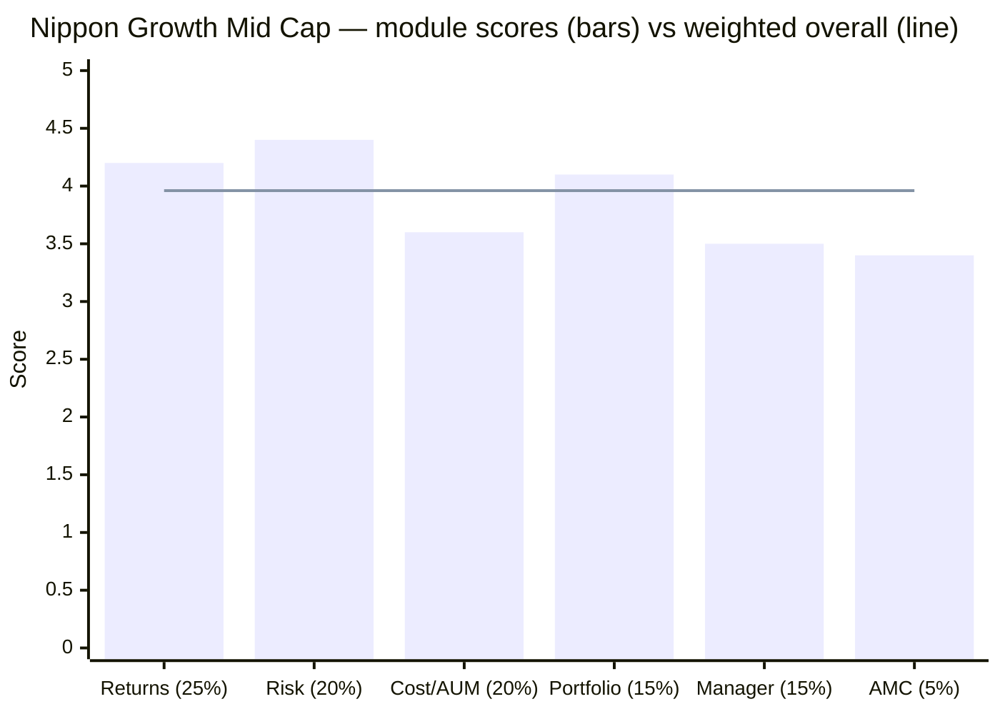

# Module 6: AMC Trustworthiness — Nippon India Growth Mid Cap Fund

## Module 6 Score: ~3.4 / 5 — A Smaller-but-Uglier Scar, a Stronger-but-Incomplete Cleansing

---

## Raw Data (Cross-Source Verified, as of 03-Jul-2026)

| Field | Value |
|-------|-------|
| **AMC** | Nippon Life India Asset Management Ltd (**NAM-India** — listed, NSE/BSE, since 2017) |
| **Owner** | **Nippon Life Insurance, Japan** (~73–75%) — Japan's largest private life insurer, founded 1889 |
| **Total AUM** | **₹7,73,481 Cr** (Mar-2026) — top-4 Indian AMC; one of the largest retail bases; the biggest ETF platform |
| **FY26 financials** | Revenue ₹2,933 Cr; **profit ₹1,528 Cr** |
| This fund's share | ₹47,415 Cr ≈ **6%** of AMC assets — a flagship, not existential |
| Founded | 1995, as **Reliance Mutual Fund** (Anil Ambani / ADAG group) |
| Ownership change | Oct-2019 — Nippon Life completed a **75% buyout** from debt-distressed Reliance Capital; rebranded |
| **Defining scar** | **Yes Bank AT1 quid-pro-quo case** (2016–19, ~₹2,500–2,850 Cr; SEBI settlement **live**, CEO personally named) |
| Gating precedent | Nippon India **Small Cap gated** (Jul-2023: lumpsum halt, ₹5L/day SIP cap) — this midcap fund never restricted |
| CEO | Sundeep Sikka — **continuous across both eras** (see the Sikka Continuity Problem) |

**Note:** Nippon is a **new AMC for the study family** — no carry-forward verdict exists (unlike Edelweiss/HSBC/Invesco/Sundaram); this module is ground-up, at 5%-weight-proportionate depth.

---

## What Module 6 Is Really Asking

After M1–M5 established a strong fund on a worrying trajectory, the AMC module asks: **can you trust the institution holding the money for ten years?** Specifically here: (1) how bad is the Yes Bank AT1 scandal, really; (2) does the 2019 ownership change actually cleanse the Reliance-era conduct; (3) is the equity side insulated; and (4) does the AMC behave investor-first when fees are at stake?

---

## The Heritage Arc — Three Companies in One

1. **1995–2019: Reliance Mutual Fund** (Anil Ambani's ADAG). The Growth Fund's first 24 years — including the entire Singhania legend era — happened under a promoter whose financial empire later collapsed under debt.
2. **2012:** Nippon Life buys 26% — the quiet entry of a conservative Japanese partner.
3. **October 2019:** Nippon Life completes a **75% takeover**, buying out a Reliance Capital that *had* to sell to cut debt. Rebrand to Nippon India MF; management retained.

**The structural point:** this is the **only studied AMC where the scarred promoter exited ownership entirely.** Franklin's 2020 debacle happened and was remediated under the *same* parent; Nippon's misconduct-era owner is simply gone. That is a genuinely stronger cleansing mechanism — with one large asterisk (below).

---

## ⭐ The Yes Bank AT1 Quid-Pro-Quo Case — The Defining Scar *(the deep-dive)*

Assembled from SEBI/press coverage (settlement reporting as of April-2026):

| Element | Fact |
|---------|------|
| The investment | **~₹2,500–2,850 Cr** of debt-scheme investor money into Yes Bank **Additional Tier-1 perpetual bonds**, 2016–2019 (Reliance era) |
| **SEBI's allegation** | A **quid pro quo**: in return, Yes Bank extended loans/investments to Anil Ambani group companies — investor money allegedly deployed to service the promoter's empire |
| The loss event | March-2020: Yes Bank collapsed; RBI's rescue **wrote the AT1 bonds to zero**; debt-scheme investors bore the loss |
| The legal twist | The Bombay High Court later held the AT1 write-off improper — partial-recovery hopes persist in litigation limbo |
| **The live settlement** | SEBI reportedly sought **₹150 Cr from the AMC + ~₹10 Cr each from CEO Sundeep Sikka, fund manager Amit Tripathi, and the ex-CRO**; the AMC counter-offered ₹52 Cr. Unresolved as of Apr-2026 — the FY26 results carry a fresh "SEBI notice" line |

### How It Compares to Franklin's 2020 Debacle — the Study Family's Benchmark Scar

| Dimension | Franklin 2020 | **Nippon/Reliance AT1** |
|-----------|--------------|--------------------------|
| Scale | ₹25,000 Cr frozen; 300k investors | ~₹2,850 Cr written off — **~9× smaller** |
| **Nature** | Liquidity/design failure — *incompetence* | **Alleged quid pro quo — *conflict of interest*: worse in kind** |
| Investor outcome | Made whole by 2021–23 | AT1 losses stand (recovery in litigation) |
| Individual accountability | SEBI penalties levied, closed | **Settlement still open; sitting CEO personally named** |
| Structural remedy | Same parent before and after | **Misconduct-era promoter exited ownership entirely** ⭐ |

The honest summary: **smaller than Franklin's scar, uglier than Franklin's scar.** Incompetence loses money; conflict of interest *diverts* it. The offsetting facts: the conduct is Reliance-era, debt-side, and the alleged beneficiary (the promoter) no longer exists in the structure.

---

## ⭐ The Sikka Continuity Problem — The Asterisk on the Cleansing

The takeover narrative ("new Japanese owner, clean slate") meets one hard counter-fact:

> **Sundeep Sikka — CEO through the 2016–19 AT1 investment period — is still the CEO today, and is personally named in the live SEBI settlement.**

Nippon Life retained the management team it bought. So the ownership cleansing is real, but **executive continuity is unbroken across the misconduct era** — a materially weaker "house cleaned" claim than the takeover suggests. The generous reading: SEBI's own theory locates the influence with the Ambanis (the AMC as instrument, not author); a settlement rather than prosecution is the chosen route; and Nippon Life has kept Sikka through seven subsequent scar-free years, implying the owner's own diligence cleared him. The skeptical reading: the man who signed off the era's investments still signs everything. **This is the single fact weighted most heavily against the AMC in the scorecard.**

---

## The 2019 Debt-Cluster Context — Industry-Typical, Handled by Mechanism

Reliance MF also carried the era's standard toxic-debt cluster (DHFL/Essel-adjacent exposures; the industry total across fund houses exceeded ₹16,000 Cr) and **did create segregated portfolios** — a still-listed *"Reliance MF Equity Hybrid Fund – Segregated Portfolio 1"* is the visible fossil. Verdict: typical of every large debt franchise in 2019, processed through SEBI's side-pocketing mechanism, and not a differentiating scar beyond the AT1 case. Noted, not further penalized.

---

## The Equity-Insulation Question — Franklin's Template, Applied

Every scar above is **debt-side and Reliance-era**. On the equity side, across both eras:

- No equity scheme ever froze, gated redemptions, or held related-party paper
- This fund specifically: 30 years of daily-NAV liquidity, 96 liquid listed stocks, no operational incident — spotless
- The insulation argument is *stronger* than Franklin's: the conflicted party was the *promoter*, and the promoter is gone; Franklin's insulating wall was merely departmental

Residual firm-level risk is cultural — a house that once let promoter interests reach investor money — mitigated by the Japanese parent's conservatism, listed-company scrutiny (NAM-India reports quarterly to public shareholders), and seven scar-free years since.

---

## AMC Scale, Financial Health & Structure

| Metric | Value | Reading |
|--------|-------|---------|
| Total AUM | ₹7,73,481 Cr | Top-4 AMC; deepest retail reach; largest ETF franchise |
| FY26 profit | ₹1,528 Cr (revenue ₹2,933 Cr) | Massively profitable — zero viability risk |
| Listed | NAM-India (NSE/BSE, 2017) | **The only listed AMC in the study family** — quarterly public scrutiny |
| Parent | Nippon Life (1889; Japan's largest private life insurer) | Conservative, long-horizon, deep pockets |
| Scheme suite | Large (60+ incl. the ETF platform) | This fund = 1995 flagship, not a fad launch |

Contrast with prior studies' weak spots: BOI's AMC was clean but subscale; Franklin's local entity was scarred *and* shrinking. Nippon is scarred but an operational and financial fortress.

---

## Investor-First Signals — Genuinely Mixed

**For:**
- **The Small-Cap gate (Jul-2023):** lumpsum halt + ₹5L/day SIP cap at the AUM peak — a real, revenue-sacrificing act; the study family's second-best stewardship precedent after DSP's three gates
- **The fee glide on this fund:** Direct ER 1.42% → 0.62% as AUM grew 8.5× (Module 4) — scale economics passed through, verified from their own factsheets
- Rich factsheet disclosure; GARP articulation; listed-company transparency

**Against:**
- **The midcap open door:** the same house that gated Small Cap keeps this fund fully open at ₹100 minimums while it absorbs an accelerating ₹673 Cr/month — the precedent exists and is not being applied (M4/M5's standing complaint, now located at AMC level)
- **The talent-retention pattern:** Singhania (2017) and Gunwani (2023) both left for competitor founder/CIO roles — the AMC develops stars and loses them; the machine (M5) has absorbed it, but it is a pattern, not an accident

---

## Peer AMC Comparison — All Studied AMCs

| AMC | Character | M6-equivalent standing |
|-----|-----------|------------------------|
| PPFAS | Spotless; investor-first culture as identity | ~4.5+ |
| DSP | Clean ~30y; gating gold standard; employee skin-in-game | ~4.3 |
| **Nippon (NAM-India)** | **AT1 quid-pro-quo scar (live settlement, CEO named) vs promoter-exit cleansing, giant scale, listed transparency, clean equity side, one real gating precedent** | **~3.4** |
| BOI | Clean but subscale, PSU parent | 3.2 |
| Franklin India | ₹25,000 Cr debt debacle (investors made whole); same parent throughout | 2.8 |
| Invesco (SC study) | Governance concerns; AMC-sale uncertainty | ~2.3 |

Why Nippon lands above Franklin: a ~9× smaller scar, the guilty-era promoter excised from ownership, a spotless equity record, vastly stronger financials, and a live investor-first precedent. Why it lands far below the clean houses: the scar's *kind* (conflict of interest), the *live* settlement, and the CEO continuity asterisk.

---

## Points For / Points Against — AMC Quality

### ✅ Points For

- **The promoter-exit cleansing** — the only studied AMC where the misconduct-era owner fully exited; the alleged beneficiary of the AT1 arrangement no longer exists in the structure
- **World-class parent + listed transparency** — Japan's largest life insurer at 75%; NAM-India's quarterly public reporting; the most scrutinized structure in the study family
- **Financial fortress** — ₹7.73L Cr AUM, ₹1,528 Cr FY26 profit; zero viability risk over a 10-year SIP horizon
- **Equity side spotless across both eras** — this fund operationally untouched by every debt-side event
- **Real stewardship precedent** — the 2023 Small-Cap gate; plus this fund's own −56% fee glide
- 30-year flagship franchise (suite coherence — the anti-fad)

### ❌ Points Against

- **The Yes Bank AT1 quid-pro-quo case** — conflict-of-interest in kind (worse than incompetence), ~₹2,850 Cr of investor money, losses standing, **settlement unresolved as of Apr-2026**
- **The Sikka continuity problem** — the CEO of the misconduct era still runs the AMC and is personally named in the live settlement; the cleansing narrative is incomplete
- **The gating asymmetry** — the stewardship precedent exists and is not applied to this fund's ₹673 Cr/month open door (flagship-revenue skepticism warranted)
- **Talent-retention pattern** — two star managers lost to competitor leadership roles in six years
- Cultural residue risk: a house that once let promoter interests reach investor money, however remediated
- Fresh SEBI-notice line in the FY26 results — the file is not closed

---

## Module 6 Scorecard

| Sub-dimension | Score | Reasoning |
|---------------|-------|-----------|
| Regulatory record | **2.5** | The AT1 case: conflict-of-interest in kind, live settlement, CEO named — though Reliance-era, debt-side, promoter gone |
| Ownership & structure | **4.5** | Japan's largest insurer at 75%; listed; the unique promoter-exit remedy |
| Equity-side insulation | **4.0** | No equity scheme touched in either era; this fund spotless for 30 years |
| Investor-first conduct | **3.5** | SC gate + fee glide vs the midcap open door |
| Talent retention | **3.0** | Two stars lost; the bench held (M5-proven) |
| Financial health & scale | **5.0** | ₹7.73L Cr AUM; ₹1,528 Cr profit; listed |
| Fund-suite coherence | **4.0** | 1995 flagship; serious 30-year mid-cap franchise |

**Module 6 Score: ~3.4 / 5** — scarred but structurally cleansed, financially unassailable, transparently governed, and investor-first when it chooses to be; capped well below the clean houses by a live settlement whose named CEO still signs the letters.

---

## Comparative Module 6 Scores

| Fund | AMC | M6 Score |
|------|-----|----------|
| PP FlexiCap | PPFAS | ~4.5+ |
| DSP Small Cap | DSP | ~4.3 |
| **Nippon Growth Mid Cap** | **NAM-India** | **~3.4** |
| BOI funds | BOI AMC | 3.2 |
| Franklin US | Franklin India | 2.8 |
| Invesco Smallcap | Invesco India | ~2.3 |

---

## Nippon India Growth Mid Cap — Complete Final Score (All 6 Modules)

| Module | Weight | Score | Weighted |
|--------|--------|-------|----------|
| 1 — Returns Consistency | 25% | **~4.2** | 1.050 |
| 2 — Risk Profile | 20% | **~4.4** | 0.880 |
| 4 — Cost & AUM Impact | 20% | **~3.6** | 0.720 |
| 3 — Portfolio DNA | 15% | **~4.1** | 0.615 |
| 5 — Fund Manager Quality | 15% | **~3.5** | 0.525 |
| 6 — AMC Trustworthiness | 5% | **~3.4** | 0.170 |
| **Overall** | **100%** | | **≈ 3.96 / 5** |

### The Coherent Verdict Across Six Modules

The six scores tell one connected story. The fund's **engine** (M1 returns, M2 risk, M3 portfolio — all ≥4.1) is the best-functioning midcap machine measurable: +2.1%/yr defensive alpha over 13.4 years, #1 risk-adjusted metrics of the shortlist, a 54.1% active share that killed the closet-index concern. The fund's **institution** (M4 cost/AUM 3.6, M5 manager 3.5, M6 AMC 3.4 — all mid-3s) is where every discount lives: an AUM trajectory that breaches this study's own screening cap within months, a 3.5-year manager atop a thrice-changed seat, and an AMC with a live conflict-of-interest settlement. **You are buying a superb machine housed in a merely adequate institution** — at ≈3.96, provisionally the #2 fund across all four studies (PP 4.20, DSP 4.00), pending the README's final assembly and cross-checks.

### Reference Frame — What #1-of-the-Shortlist Must Now Beat

Nippon sets the bar the remaining six midcap funds must clear: beat ≈3.96 while carrying a fraction of its AUM problem (Invesco, the screening leader, gets the first shot). The study's decision tree inherits three Nippon-specific tripwires: **active share < ~45%**, **the 40/20/8 band split degrading**, and **AUM crossing ₹50–60K Cr without a gate**.

---

## SIP Implication

1. **The AMC is not a reason to avoid the fund** — the scar is real but debt-side, Reliance-era, and structurally remediated; the equity vehicle you'd own has 30 spotless years.
2. **Watch the settlement close** — an adverse escalation naming current conduct (not 2016–19 conduct) would be a genuine exit trigger; a routine settlement close is a non-event.
3. **The institutional watch-list for a 10-year SIP:** the settlement outcome, any Sikka exit (mildly positive for governance, test of process continuity), and — still — a gating announcement as the bullish stewardship signal.
4. At 5% weight, M6 moves the needle ~0.05 points either way — the decision still lives in M1–M4.

---

## One-Line Verdict

> **NAM-India is a scarred fortress: a top-4, listed, Japanese-owned AMC of unassailable financial strength and a spotless 30-year equity record, carrying the study family's ugliest-in-kind scar — the Reliance-era Yes Bank AT1 quid-pro-quo case (~₹2,850 Cr, SEBI settlement live, the still-serving CEO personally named) — remediated by the unique promoter-exit cleansing but incompletely, and investor-first exactly when it chooses to be (Small Cap gated, this flagship's door wide open). Scarred but bankable; watch the settlement, not the brand. Module 6: ~3.4/5 — completing Nippon Growth Mid Cap at ≈3.96/5, provisionally the #2 fund across all four studies.**

---

*Module 6 completed: July 3, 2026 | AMC Trustworthiness | Ground-up study (no carry-forward — first NAM-India fund in the family) | Sources: SEBI settlement reporting (Apr-2026: ₹150 Cr sought from AMC, ~₹10 Cr each CEO Sikka/FM Tripathi/ex-CRO; AMC offered ₹52 Cr), takeover coverage (Oct-2019, 75% Nippon Life), NAM-India FY26 results (AUM ₹7,73,481 Cr, profit ₹1,528 Cr, SEBI-notice line), Bombay HC AT1 write-off ruling coverage, segregated-portfolio listing (Yahoo/BSE fossil), SC gating news (Jul-2023) | Franklin comparison per that study's M6 | Provisional M6 Score: ~3.4/5 | FUND COMPLETE: ≈3.96/5 pending README assembly*
