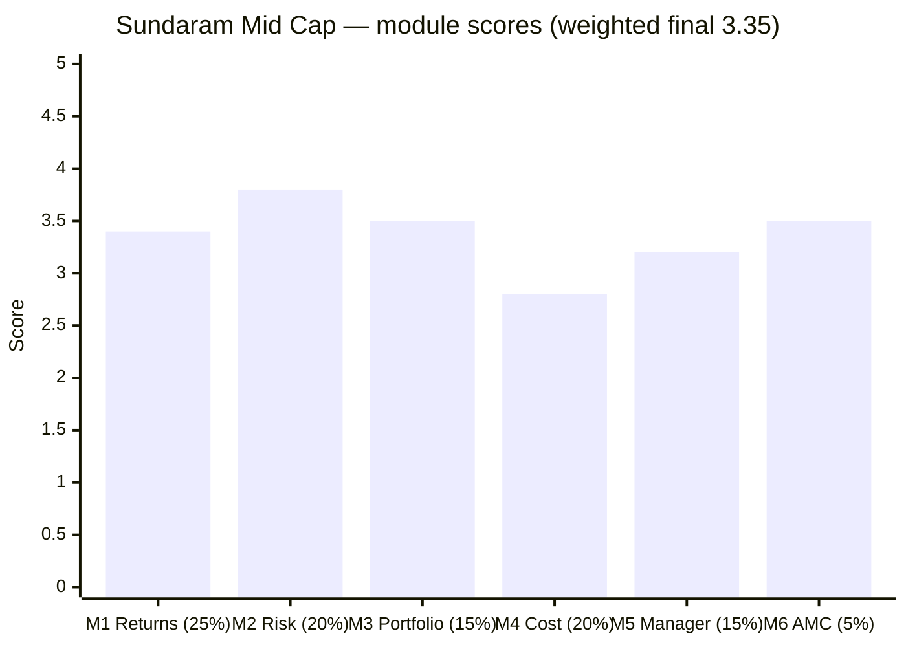
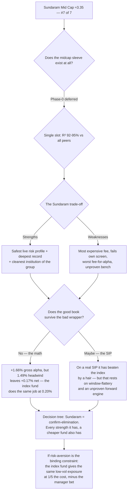

# Sundaram Mid Cap Fund — Deep Study

## Fund Identity

| Field | Value |
|-------|-------|
| **Full Name** | Sundaram Mid Cap Fund — Direct Plan — Growth (ex- *Sundaram Select Midcap*) |
| **AMC** | Sundaram Asset Management (100% of **Sundaram Finance**, AAA/TVS lineage) — **first study of this house across all four categories; ranked 21st, sub-scale** |
| **Inception** | **30-Jul-2002** — the **oldest fund of the shortlist by ~6 years**; MFAPI Regular from 03-Apr-2006 (20.3y), Direct from 02-Jan-2013 |
| **SEBI Category** | Equity — Mid Cap (min 65% in ranks 101–250) |
| **Benchmark** | Nifty Midcap 150 TRI |
| **AUM** | **₹14,026 Cr** (official, 30-Jun-2026); ~₹29 Cr/mo net flows (84% of growth is NAV — the market isn't voting) |
| **Expense Ratio** | **1.06% Direct (official SEBI TER, 14-07-2026 — the most expensive of the study)**; Regular 1.87% |
| **Exit Load** | 25% of units free within 365d; else 1%; nil after 365d (investor-friendly) |
| **Managers** | **Bharath S** (24-Feb-2021 — **longest lead tenure of the seven, 5.4y**) + **Shalav Saket** (09-Dec-2025 — **zero prior fund-management record**, 12 funds) |
| **Departed / rotated** | **Ratish Varier** (co-managed Feb-2021 → rotated off ~09-Dec-2025); **S. Krishnakumar** (legend-era author, left the firm Feb-2021) |
| **Data** | MFAPI 119581 (Direct) / 101539 (Regular); proxies 147622 (Midcap-150 fund) + 114456 (Midcap-100 ETF); TT holdings M_SUNIU |

---

## The One-Line Context

Sundaram Mid Cap is the study's **"good book, good house, bad price"** fund — and the mirror-image of Mahindra Manulife. It has the **deepest, most credible record of the seven** (20.3 years of NAV, the only genuine fully-invested 2008 GFC test in the repo at −68.7%, a clean 2018 winter, a real non-inception-biased +8.5% worst-rolling-10Y floor), the **safest live risk profile** (lowest volatility of the seven at 15.7%, sitting at its all-time high, an 8-month recovery from the last correction — and unlike Mahindra's, that defensiveness is *real and fully-invested*, not a cash-era artifact), a **genuinely active book** (55.2% active share) whose stock selection actually works (**+1.66%/yr gross**), and the **most stable institution of the group** (a AAA Sundaram Finance parent with no regulatory scar). But the wrapper confiscates almost everything the book earns: the **study's most expensive fee (1.06%) plus a 0.63% cash drag** leave the investor **+0.17%/yr net**, and the fund **fails the study's own ER screen**. Its forward engine is unproven (a rookie co-manager with no track record beside a retained-but-stretched lead), and its 10Y CAGR is the lowest of the seven. Final: **≈3.35/5 — #7 of 7**, the confirm-elimination the screening predicted — a good fund and a good house sold at the wrong price.

---

## Module Status

| Module | Weight | Status | Score |
|--------|--------|--------|-------|
| [Module 1 — Returns Consistency](module1_returns.md) | 25% | ✅ Complete | **3.4** |
| [Module 2 — Risk Profile](module2_risk.md) | 20% | ✅ Complete | **3.8** |
| [Module 3 — Portfolio DNA](module3_portfolio.md) | 15% | ✅ Complete | **3.5** |
| [Module 4 — Cost & AUM Impact](module4_cost.md) | 20% | ✅ Complete | **2.8** |
| [Module 5 — Fund Manager Quality](module5_manager.md) | 15% | ✅ Complete | **3.2** |
| [Module 6 — AMC Trustworthiness](module6_amc.md) | 5% | ✅ Complete | **3.5** |

---

## Final Scorecard

**Weighted Score: ≈ 3.35 / 5** — #7 of 7 studied midcaps (last, narrowly below HSBC 3.49)

| Module | Weight | Score | Weighted |
|--------|--------|-------|----------|
| M1 Returns | 25% | 3.4 | 0.850 |
| M2 Risk | 20% | 3.8 | 0.760 |
| M3 Portfolio | 15% | 3.5 | 0.525 |
| M4 Cost & AUM | 20% | 2.8 | 0.560 |
| M5 Manager | 15% | 3.2 | 0.480 |
| M6 AMC | 5% | 3.5 | 0.175 |
| **Total** | 100% | | **≈3.35** |

**The shape is the story:** the **record-and-institution modules are strong** (M2 Risk 3.8, M6 AMC 3.5) while the **price-and-bench modules sag** (M4 Cost 2.8 — the study's worst, M5 Manager 3.2). This is the **exact inverse of Mahindra's ascending ladder**: Mahindra's *structure* is better than its *record*; Sundaram's *record and institution* are better than its *price and bench*. The good news is durable (a 24-year franchise, a AAA parent, genuine defensiveness); the bad news is fixable in principle (a fee could be cut) but isn't (a sub-scale house has no economics to cut it with).

---

## The Category Standings — COMPLETE (all 7 studied)

| Rank | Fund | Final | Character |
|------|------|-------|-----------|
| 1 | Edelweiss | ≈4.05 | Consistency leader — no weak high-weight module |
| 2 | Invesco | ≈3.97 | Best fund-level numbers; institution-weak |
| 3 | Nippon | ≈3.96 | Best institution; capacity clock running |
| 4 | Mahindra Manulife | ≈3.83 | Best structure (cost+capacity); weakest warranty |
| 5 | ICICI Pru | ≈3.55 | Turnaround ship; fails canonical alpha at highest true cost |
| 6 | HSBC | ≈3.49 | Recency ramp; fails the matched-index test |
| **7** | **Sundaram** | **≈3.35** | **Good book, good house, bad price — the wrapper eats the alpha** |

> **Sundaram finishes last** — the "confirm-elimination" profile the screening assigned it, confirmed. But it is a *coherent* last, not a broken one: it lands **only ~0.14 below HSBC**, and it does so with genuine strengths (the safest live risk profile and the cleanest institution of the group) that HSBC and ICICI lack — dragged down by a single decisive weakness (the wrapper) that its rivals mostly avoid. **With all seven studied, the top trio (Edelweiss/Invesco/Nippon) separates cleanly from the back four (Mahindra/ICICI/HSBC/Sundaram).**

---

## Key Performance Metrics

| Metric | Value | Context |
|--------|-------|---------|
| 3Y / 5Y CAGR | 22.19% / 18.92% | ~6th of 7 on both |
| **10Y CAGR** | **15.82%** | **lowest of the seven** — a mediocre middle-late decade |
| Record length | **20.3y (Regular)** ⭐ | the only two-decade record in the study |
| **Matched-index alpha** | **−1.77%/yr full idx-life / +0.17%/yr new-team** ❌ | fails on the honest (lumpsum) test — but see the SIP inversion |
| **Real ₹20K/mo SIP vs index** | **+₹0.17L (full idx life), +₹0.91L (new-team era)** ✅ | the failure is a *lumpsum* fact, not a *SIP* fact |
| 2008 GFC test | **−68.7%** (only real one in the repo) ⭐ | recovered 17.4mo; a genuine fully-invested top-of-cycle stress |
| Volatility (5Y) | **15.7%** ⭐ | **lowest of the seven** — genuine, fully-invested defensiveness |
| Sharpe / Sortino (5Y common) | 0.810 / 1.412 | 5th of 7 — the safety buys the least reward |
| Down-capture (5Y) | 86 | 3rd of 7; forensic cushions the two worst correction months |
| ATH distance | **−0.2%** ⭐ | best of the group — 2024–25 fully repaired (8.0mo recovery) |
| Worst rolling 10Y | **+8.5%/yr** ⭐ | real, cycle-tested floor (NOT inception-biased like Mahindra's) |
| Active share | **55.2%** (computed) | 2nd-lowest studied; active but breadth-based, not conviction |
| **Implied gross selection alpha** | **+1.66%/yr** | the pickers can pick — the wrapper takes ~90% |
| **Expense ratio (Direct)** | **1.06%** (official) ❌ | **most expensive of the study; fails the ER ≤ 1.0% screen** |
| Cash drag | **~4.50% non-equity → ~0.63%/yr** | a cost no sibling carries |
| Cross-sleeve R² | 92–95% vs studied midcaps | single-slot decision stands |

---

## ⚠️ The Five Critical Lenses — Read Before the Numbers

### Lens 1 — The Record Is the Best of the Seven … at the Long End Only
Sundaram has what no other studied midcap has: a **real, fully-invested 2008 GFC test (−68.7%)**, a **clean 2018 winter (−45.3%, not an NFO-cash artifact)**, and a genuine **+8.5% worst-rolling-10Y floor** across two full bear markets. But its **trailing 10Y CAGR (15.82%) is the lowest of the seven** — the strong long-run mean is front-loaded into the Krishnakumar legend decade (2006–2016). The record is deep and credible; the *recent* decade was ordinary.

### Lens 2 — The Index Failure Is a Lumpsum Fact, Not a SIP Fact
On the study's canonical time-weighted test, Sundaram **fails** the "why not the index fund?" question — matched-index alpha is −1.77%/yr over the full window, and only +0.17%/yr even measured from the true Feb-2021 handover. **But on a real ₹20K/month SIP it has *beaten* the index in every Direct window tested** (+₹0.17L over the full index-fund life, +₹0.91L over the new-team era) — because the 2020–21 COVID-recovery disaster landed when almost no capital was invested. The edge is a hair (~+0.15%/yr) and rests on the same window-flattery the study discounts elsewhere — but for the actual decision (a SIP), it materially softens the verdict.

### Lens 3 — The Defensiveness Is Real, and It Cost the Alpha
The incoming Bharath+Varier team **deliberately de-risked the book** — volatility 21.2% → 15.4%, down-capture 88 → 82, beta 0.92 → 0.86 — producing the safest live risk profile of the seven (lowest vol, at ATH, fast recovery). Unlike Mahindra's artifact and HSBC's mirage, **this defensiveness is genuine and fully-invested**. But it was bought with the alpha: Krishnakumar's aggressive book earned +0.45 IR at high vol; the calm new book earns −0.15. **The safety and the missing outperformance are the same decision.**

### Lens 4 — The Book Is Good; the Wrapper Is Bad
Active share is 55.2% (decisively not a closet indexer), the sector book is the most granular of the group (max 8.02% across 56 sectors), turnover is patient (~2.5-year holds), and the **implied gross stock-selection alpha is +1.66%/yr** — genuinely competitive. Then the wrapper confiscates it: a **1.06% fee (the study's highest) + a 0.63% cash drag** (from a persistent ~4.5% non-equity sleeve) = a **1.49%/yr headwind** that leaves +0.17% net. The fund also runs its **mid-cap weight at 66.81% — just 1.8 points above the SEBI floor** — so a third of your money is largecap/smallcap/cash at a midcap fee.

### Lens 5 — The Author Is Retained; the Bench Is Unproven
The single fact holding the fee case up: **Bharath S has run this fund 5.4 years — the longest lead tenure of any studied midcap — he authored the de-risking and the gross alpha, and he stays.** But his co-author Varier was rotated off Dec-2025 for **Shalav Saket, an analyst with *zero* prior fund-management record handed 12 funds on day one**, and in the identical 7-month window Mahindra's new team beat the index by +5.6 points while Sundaram's managed +0.08. Beneath sits a **house-wide reshuffle** (managers on 9–19 funds each) and an incomplete **Principal-merger integration** (Jan-2022) — a stable house, mid-reorganization. This fund is now **explicitly a bet on one man.**

---

## Portfolio DNA (Snapshot, Jun 2026)

| Dimension | Value | Group context |
|-----------|-------|---------------|
| Stocks | **85** | above the 40–70 sweet spot — over-diversified |
| Top-10 | **24.8%** | low edge; largest position Cummins 3.03% (off-index) |
| **Active share** | **55.2%** | 2nd-lowest studied (ICICI 73.9 > MM 66.6 > **Sundaram 55.2** > Nippon 54.1) |
| Max sector | **8.02%** across **56 sectors** | most granular book of the studied midcaps |
| Signature | **Diversification as philosophy** — nothing >3.1%, financials 21.6% across 9 sub-sectors | a house process, not a conviction thesis |
| Anti-signature | **Exchanges −2.93 UW** (BSE −1.16, MCX omitted) | a third position on the study's signature axis — closer to MM (omits both) than ICICI (+9.5%) |
| Cap posture | **66.81% mid — 1.8 pts above the SEBI floor** | the thinnest mandate of the seven; WAMC drifting up (₹67.6K → ₹73.0K Cr) |
| Non-equity | **~4.50%** (own-AMC liquid fund) | a persistent cash drag the index fund never carries |
| Turnover | **36.9%** | patient (~2.5-yr holds), 2nd-lowest of the group |

---

## Strengths vs Concerns

### ✅ Key Strengths
1. **The safest live risk profile of the seven** — lowest volatility (15.7%), at its all-time high (−0.2%), 8.0-month 2024–25 recovery; genuine, fully-invested (not artifact) defensiveness
2. **The deepest, most credible record** — the only real 2008 GFC test in the repo (−68.7%), a clean 2018 winter, a real +8.5% worst-rolling-10Y floor
3. **Genuinely active** (55.2% AS) with the most granular sector book (max 8.02%) and patient turnover
4. **A real +1.66%/yr gross stock-selection alpha** — the pickers can pick
5. **On a real SIP, it has beaten the index** in every Direct window (the use case that matters here)
6. **The retained senior author** — Bharath S, 5.4y, the longest lead tenure of the seven
7. **The most stable institution of the group** — AAA Sundaram Finance parent, no regulatory scar, 28-year track record

### ⚠️ Key Concerns
1. **The study's most expensive fee (1.06%) — fails the study's own ER screen** — and a 0.63% cash drag on top; together they confiscate ~90% of the gross alpha
2. **Worst fee-for-alpha of the study (0.20×)** — pay 0.86% to receive +0.17%; the most negative canonical alpha (−1.77%)
3. **Lowest 10Y CAGR of the seven (15.82%)** — a mediocre recent decade
4. **The forward engine is unproven** — a rookie co-manager (Saket, zero prior record, 12 funds); +0.08 vs Mahindra's +5.6 in the identical transition window
5. **Runs the mandate at the SEBI floor (66.81%)** — two-thirds of a midcap fund at a midcap fee
6. **A house mid-reorganization** — 9–19 manager loads, house-wide reshuffle, incomplete Principal integration
7. **The market isn't voting** — ₹29 Cr/mo net flows on a 24-year-old fund; sub-scale AMC with a modest ~22% margin

---

## Comparison vs Studied Funds (All Four Categories)

| Dimension | **Sundaram** | Edelweiss | Invesco | Nippon | Mahindra | ICICI | HSBC |
|-----------|--------------|-----------|---------|--------|----------|-------|------|
| Final score | **≈3.35** | ≈4.05 | ≈3.97 | ≈3.96 | ≈3.83 | ≈3.55 | ≈3.49 |
| Matched-index alpha | **−1.77 / +0.17** ❌ | +2.87 | +2.88 | +1.97 | +2.06 ↗ | −0.35 | −0.22 ❌ |
| 10Y CAGR | **15.82 (lowest)** | 19.89 | 20.34 | 19.33 | none | 17.78 | 18.47 |
| Vol (5Y) | **15.7 (lowest)** ⭐ | 16.1 | 17.4 | 16.3 | 16.3 | 16.6 | 17.1 |
| ER (true, Direct) | **1.06 (highest)** ❌ | ~0.49 | ~0.63 | ~0.64 | ~0.57 | ~1.08* | ~0.76 |
| Manager | ⚠ author retained 5.4y / rookie co-mgr | ✅ sitting 4.8y | ❌ new | ✅ house | ❌ departed | current | ❌ 5 teams |
| Capacity runway | ample (no clock) | ~1.2y ⚠ | ~3y | past ⚠ | decades ⭐ | good | good |
| Active share | 55.2% | ~55% | **79.5%** | 54.1% | 66.6% | 73.9% | 69.5% |
| AMC | **3.5 clean/sub-scale** | 3.4 | 2.3 sold | 3.4 scarred | 3.3 loss-leader | 3.4 profit-machine | 3.3 |

*\*ICICI's ~1.08% true cost may be an artifact of the double-counting retrofit M4 flagged; Sundaram's 1.06% is officially measured.*

---

## ₹20K/Month SIP Projections (10 Years, 18% gross midcap)

| Scenario | Net return | Corpus | vs index fund |
|----------|-----------|--------|---------------|
| Index fund (0.20%, 0% cash) | 17.80% | ₹61.15L | — |
| **Sundaram BASE** (gross sel +1.66%, −1.06 ER, −0.63 cash) | 17.97% | **₹61.72L** | **+₹0.56L** |
| Sundaram BULL (gross sel holds, cash cut to 1%) | 18.46% | ₹63.37L | +₹2.22L |
| **Sundaram BEAR** (canonical −1.77% repeats) | 16.23% | ₹56.20L | **−₹4.96L** |

**Read:** the base case is **+₹0.56L on ₹24L invested over a decade — 2.3% of capital for taking manager risk — with a downside (−₹4.96L) that is ~9× the base-case upside.** That asymmetry is the whole problem: a good gross alpha, a bad wrapper, and a fat left tail if the unproven bench can't hold the selection. The honest expected anchor is the **BASE scenario** — better than the index by a hair on the money-weighted math, but only if Bharath's alpha persists at a sub-scale house's premium fee.

---

## Investment Decision Framework

---

## The Critical Facts — In 10 Sentences

1. Sundaram Mid Cap is the **oldest fund of the shortlist (inception 30-Jul-2002)** with the **deepest record of the seven** — 20.3 years of NAV, the **only genuine fully-invested 2008 GFC test in the repo (−68.7%)**, a clean 2018 winter, and a real **+8.5% worst-rolling-10Y floor** across two bear markets.
2. But its **trailing 10Y CAGR (15.82%) is the lowest of the seven**, and it **fails the matched-index test** on the honest time-weighted basis (−1.77%/yr full, +0.17%/yr from the true handover).
3. On a **real ₹20K/month SIP**, however, it has **beaten the index fund in every Direct window** — the 2020–21 disaster hit when almost no capital was invested, so the failure is a *lumpsum* fact, not a *SIP* fact.
4. It has the **safest live risk profile of the seven** — lowest volatility (15.7%), sitting at its all-time high (−0.2%), an 8.0-month recovery from 2024–25 — and unlike Mahindra's artifact or HSBC's mirage, **that defensiveness is real and fully-invested**.
5. The incoming team **deliberately de-risked the book** (vol 21.2% → 15.4%) — but the trade was the alpha: the calm new book earns −0.15 IR where Krishnakumar's aggressive one earned +0.45.
6. The book is **genuinely active (55.2% AS)** with the most granular sector spread of the group and a real **+1.66%/yr gross stock-selection alpha** — the pickers can pick.
7. Then the wrapper takes ~90% of it: the **study's most expensive fee (1.06%, official — which fails the study's own ER ≤ 1.0% screen)** plus a **0.63% cash drag** leave the investor **+0.17%/yr net**, the **worst fee-for-alpha of the study (0.20×)**.
8. The fund runs its **mid-cap weight at 66.81% — just 1.8 points above the SEBI floor** — so a third of the money is largecap/smallcap/cash, at a midcap fee.
9. Its forward engine is unproven: **Bharath S (retained, 5.4y, the longest lead tenure of the seven) authored the alpha and stays**, but his co-author was rotated off Dec-2025 for **Shalav Saket, an analyst with zero prior fund-management record handed 12 funds at once** — and in the identical 7-month transition window Sundaram's new team managed +0.08 vs Mahindra's +5.6.
10. The institution is the quiet redemption — **a AAA Sundaram Finance parent (TVS lineage) with no regulatory scar, the cleanest of the institution-owned AMCs studied** — but it is sub-scale (21st, ~22% margin), which is *why* it charges the highest fee; final **≈3.35/5, #7 of 7**: a good book and a good house, sold at the wrong price.

---

## Quick Verdict

**For a ₹20K/month, 10-year SIP:** Sundaram Mid Cap is a **confirm-elimination — a genuinely good fund with no path to selection.** Its real strengths (the safest low-vol profile of the seven, the deepest cycle-tested record, the cleanest institution, a working +1.66%/yr gross stock-selection alpha) are undermined by the one thing an investor cannot escape: **a 1.06% fee plus a 0.63% cash drag that hand the outperformance back, leaving +0.17%/yr net — and the fund fails the study's own cost screen.** For the risk-averse investor drawn to its low volatility, the honest answer is the **0.20% Nifty Midcap 150 index fund**, which delivers nearly the same defensive exposure at one-fifth the cost, minus the bet on a rookie co-manager holding a departed co-author's alpha. The rational stances are two: **(a) if a midcap sleeve is warranted, pick from the top trio** (Edelweiss/Invesco/Nippon) — every strength Sundaram offers, one of them offers cheaper; or **(b) if defensiveness is the goal, buy the index fund** — the active fee here purchases essentially nothing. The decision tree should treat Sundaram as **the fund whose book deserved a better wrapper.**

---

## One-Line Verdict

> **Sundaram Mid Cap finishes at ≈3.35/5 — #7 of 7 studied midcaps — as the study's "good book, good house, bad price" fund and the mirror-image of Mahindra: it holds the deepest, most credible record of the seven (20.3 years, the only real 2008 GFC test at −68.7%, a clean 2018 winter, a genuine +8.5% worst-rolling-10Y floor), the safest live risk profile (lowest volatility at 15.7%, sitting at its all-time high, an 8-month recovery — defensiveness that is real and fully-invested, not Mahindra's cash artifact or HSBC's mirage), a genuinely active book (55.2% AS) whose stock selection actually works (+1.66%/yr gross), and the most stable institution of the group (a AAA Sundaram Finance parent, TVS lineage, no regulatory scar) — yet the wrapper confiscates almost everything the book earns: the study's most expensive fee (1.06%, which fails the study's own ER screen) plus a 0.63% cash drag leave +0.17%/yr net, the worst fee-for-alpha of the study (0.20×) on the most negative canonical alpha (−1.77%), with the lowest 10Y CAGR of the seven, a mandate run 1.8 points above the SEBI floor, and a forward engine that rests on one retained author (Bharath S, 5.4y, the longest lead tenure of the seven) beside a rookie co-manager with zero prior record on 12 funds who managed +0.08 vs Mahindra's +5.6 in the identical transition window. On a real SIP the index failure softens to a coin-flip (it beats the index by a hair, money-weighted) — but for the risk-averse investor its low volatility draws, the 0.20% index fund delivers nearly the same defensive exposure at one-fifth the cost, minus the manager bet. A confirm-elimination: the fund whose good book and good house deserved a better price.**

---

*Study completed: July 16, 2026 | All 6 modules + README | Weighted final ≈3.35/5 (M1 3.4×25% + M2 3.8×20% + M3 3.5×15% + M4 2.8×20% + M5 3.2×15% + M6 3.5×5%) | Standings COMPLETE (7 of 7): Edelweiss 4.05 > Invesco 3.97 ≈ Nippon 3.96 > Mahindra 3.83 > ICICI 3.55 > HSBC 3.49 > Sundaram 3.35 | Data: MFAPI 119581/101539 + proxies 147622/114456 + cross-sleeve series; TT holdings M_SUNIU (85 names, AS 55.2% computed); AMC official SEBI TER disclosure (Direct 1.06% NAV-validated), 24-page Corporate Presentation Dec-2025 + live digital factsheet (Highcharts extraction); Groww `__NEXT_DATA__` for manager dates; ICRA rating rationale | Signature findings: two-decade survivor + only real 2008 test + SIP-vs-lumpsum inversion (M1/M4) · the great de-risking (M2) · cash drag + gross-alpha decomposition + mandate-at-floor + Varier→Saket (M3) · fails-own-screen + worst fee-for-alpha + study-wide TER retrofit flagged (M4) · retained author + rookie co-manager + house-wide reshuffle + Principal-merger discovery (M5) · clean-sheet AAA parent + ex-Franklin CEO + Principal economics (M6) | Tripwires: Bharath S leaving or spread further · Direct TER failing to fall as AUM grows · cash drag returning to 6.5% · new-team alpha flat through 2027 · mid-cap weight breaching 65% · net flows turning negative | STUDY-WIDE RETROFIT PENDING: re-pull all 6 official SEBI TER pages (true-cost method double-counts + aggregator ERs under-base ~0.2); run SIP-inversion test on ICICI + HSBC | Next: MidCap category decision_tree.md (single-slot R²~91%; Phase-0 portfolio-fit still deferred by user)*
