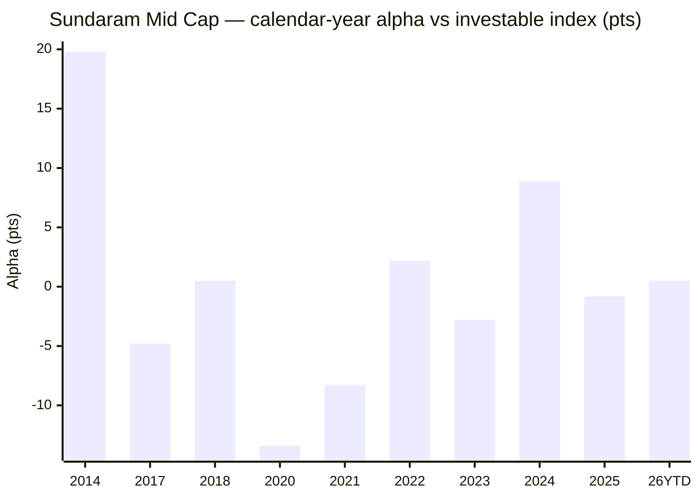

# Module 1: Returns Consistency — Sundaram Mid Cap Fund

## Module 1 Score: ~3.4 / 5 (provisional)

---

## The One-Line Context

Sundaram Mid Cap is the shortlist's **two-decade survivor — and the mirror-image of Mahindra Manulife**. Where Mahindra had rising alpha but *no history and a departed author*, Sundaram has the **deepest record of any studied midcap (20.3y of Regular NAV; true inception 30-Jul-2002), the only genuine fully-invested 2008 GFC test in the entire repo (−68.7%), and its turnaround author still in the chair (Bharath S, since Feb-2021)** *(⚠ M3: co-manager Ratish Varier was rotated off ~09-Dec-2025 and replaced by Shalav Saket — the retention is only half true)*. But it also carries the **lowest 10Y CAGR of the seven (15.8%)**, a **failed matched-index test (−1.77%/yr since the investable index fund existed)**, and a "turnaround" that — measured honestly from the *actual* Feb-2021 manager handover rather than a cherry-picked calendar start — is **+0.17%/yr gross, i.e. it merely stopped losing to the index and, after a *1.06%* fee (M4, official), still loses to it** — *though M4's SIP-vs-lumpsum inversion shows this failure is a **lumpsum fact, not a SIP fact**: on a real ₹20K/mo SIP the fund has beaten the index in every Direct window*. Pedigree-rich, alpha-poor: the record's *credibility and cycle-testing* are the best of the seven, its *forward alpha case* among the weakest.

---

## Fund Identity

| Field | Value |
|-------|-------|
| **Full Name** | Sundaram Mid Cap Fund — Direct Plan — Growth (ex-**Sundaram Select Midcap**, renamed at SEBI recategorisation) |
| **AMC** | **Sundaram Asset Management** — **first study of this AMC in any of the four categories** (Sundaram Small Cap is still pending in the smallcap sleeve); Module 6 is ground-up |
| **Inception** | **30-Jul-2002** — the oldest fund in the shortlist by ~6 years |
| **Computable record** | Regular NAV **03-Apr-2006 → 15-Jul-2026 (20.3 years)**; Direct **02-Jan-2013 → (13.5 years)** — **longest of all seven** |
| **SEBI Category** | Equity — Mid Cap (min 65% in ranks 101–250) |
| **Benchmark** | **Nifty Midcap 150 TRI** |
| **Current Managers** | **Bharath S** (since **24-Feb-2021**, ~5.4y) **+ Shalav Saket** (since **09-Dec-2025**, ~7 mo) *(⚠ M3 correction — the "Shalav Saket" aggregator reading was **CORRECT**, not an error; confirmed by the AMC's live Jun-2026 digital factsheet and dated via Groww's structured JSON)* |
| **Rotated off** | **Ratish B. Varier** (co-managed **24-Feb-2021 → ~09-Dec-2025**) — *(⚠ M3 correction: present on the Mar-2025 official factsheet, absent from the Jun-2026 one; appears to remain at the AMC on 5 other schemes, so this is a **rotation, not a resignation**)* → **M5** |
| **Departed Manager** | **S. Krishnakumar** (long-time author / ex-CIO-Equity; managed **until 24-Feb-2021**, then left the firm) |
| **AUM** | **₹14,026 Cr** (month-end 30-Jun-2026, **AMC official**; avg ₹13,766 Cr) *(⚠ M3 update — estimate resolved. The ₹77,804 Cr aggregator figure was indeed AMC-total: the AMC's own site states "80k Crore+ Assets Under Management")* |
| **Expense Ratio (Direct)** | **1.06%** — **AMC official SEBI TER disclosure, 14-07-2026** (Base 0.75 + brokerage 0.05 + txn 0.00 + statutory levies 0.26; Regular 1.87%). Groww's 1.06 was right; Tickertape's 0.88 stale. Validated from raw NAVs: computed Direct-vs-Regular divergence 0.838–0.848%/yr vs official gap 0.81% ✅ — *the **most expensive of the study**; ~2.4× Mahindra (0.42). ⚠ **M4: this breaches the study's own Stage-1 ER ≤ 1.0% screen — the criterion that admitted this fund.*** |
| **NAV (15-Jul-2026)** | ₹1,647.77 (Direct); ₹1,496.68 (Regular) |
| **Riskometer** | Very High |
| **Min SIP** | ₹100 (monthly) |
| **Data codes** | MFAPI Direct **119581**, Regular **101539** |

---

## Raw Data (MFAPI computed, as of 15-Jul-2026)

| Metric | Direct | Regular |
|--------|--------|---------|
| 1Y CAGR | 8.13% | 7.23% |
| 3Y CAGR | 22.19% | 21.17% |
| 5Y CAGR | 18.92% | 17.91% |
| 7Y CAGR | 19.69% | 18.69% |
| **10Y CAGR** | **15.82%** | 14.91% |
| 15Y CAGR | — | 16.17% |
| Full-life CAGR | 18.09% (13.5y) | **15.72% (20.3y)** |
| Full-life SIP XIRR (244 SIPs) | — | **16.63%** |
| Beta vs Midcap-150 (monthly, idx life) | **0.943** | — |
| R² vs Midcap-150 | **95.3%** | — |
| Up-capture / Down-capture | **88% / 92%** | — |
| Tracking error / Information ratio | **4.48% / −0.43** | — |
| Max drawdown (full history) | — | **−68.7%** (2008 GFC) |

**Data sources:** MFAPI Direct **119581** (3,328 NAVs, 02-Jan-2013 → 15-Jul-2026), Regular **101539** (4,994 NAVs, 03-Apr-2006 →); index counterfactuals **147622** (Motilal Nifty Midcap 150 Index Fund, 11-Sep-2019 →) and **114456** (Motilal Nifty Midcap 100 ETF, 03-Feb-2011 →); Nifty-50 reference **120716**. All headline metrics computed from raw NAVs — no website numbers copied. Manager history from Sundaram factsheets and Value Research.

---

## ⭐ NEW: The 0.0-NAV Data-Integrity Catch

The Regular series carried a **corrupt NAV of `0.0` on 18-May-2009** — the historic +17% post-election upper-circuit day (surrounding NAVs ₹73 → ₹86). Left in, it manufactured a fake −100% drawdown and poisoned every rolling/CAGR computation that crossed it. **Every number in this module is computed after dropping all non-positive NAVs.** This is a permanent method note for any future Sundaram module — the glitch sits exactly on the deepest part of the GFC recovery.

---

## Cross-Source Verification

Recomputing MFAPI CAGRs reproduces the Tickertape screening export within drift:

| Metric | MFAPI (computed, Direct) | Tickertape screening | Verdict |
|--------|--------------------------|----------------------|---------|
| 3Y | 22.19% | 22.27% | ✅ match |
| 10Y | 15.82% | 15.63% | ✅ match (endpoint drift) |
| 5Y | 18.92% | 19.31% | ⚠️ ~0.4pt gap (date/endpoint drift — immaterial) |

**Number of record = the computed 15.82% (10Y), not the screening 15.63%** — retrofit footnote to apply to Mahindra M1's peer table, which quoted 15.63.

---

## CAGR Ladder — The Window Profile

| Window | Sundaram (Direct) | Rank of 7 | Character |
|--------|-------------------|-----------|-----------|
| **10Y** | **15.82%** | **#7 (lowest)** | mediocre middle-late decade |
| 7Y | 19.69% | mid | |
| 5Y | 18.92% | ~#6 | above universe median, below leaders |
| 3Y | 22.19% | ~#6 | |
| 1Y | 8.13% | low | did not ride the 2026 surge |
| Full (20.3y Regular) | 15.72% | — | **the only 2-decade record in the study** |

The shape is the inverse of Mahindra's: Sundaram's problem is not *missing* history but a **long stretch of ordinary history** — the 10Y trails every peer, and the strong long-run mean is front-loaded into the Krishnakumar-legend decade (2006–2016).

---

## Calendar-Year Returns & Alpha — The Fingerprint

Stitched proxy: Nifty Midcap-100 ETF (114456) for pre-2020; Nifty Midcap-150 index fund (147622) 2020→. Pre-2013 rows use the Regular series (pre-Direct).

| Year | Fund | Index proxy | Alpha (pts) | Manager era | Note |
|------|------|-------------|-------------|-------------|------|
| 2007 | +63.1%* | — | — | Krishnakumar | legend years |
| **2008** | **−58.3%*** | — | — | Krishnakumar | **real GFC loss** |
| 2009 | +114.6%* | — | — | Krishnakumar | V-recovery |
| 2014 | +76.6% | +56.8% | **+19.8** | Krishnakumar | huge outperformance |
| 2017 | +41.8% | +46.6% | −4.8 | Krishnakumar | |
| 2018 | −14.8% | −15.3% | **+0.5** | Krishnakumar | **clean winter test** ✅ |
| **2020** | **+12.7%** | **+26.1%** | **−13.4** | Krishnakumar | ⚠️ **catastrophic COVID-recovery lag** |
| 2021 | +38.6% | +46.9% | **−8.3** | Krishnakumar → handover (Feb) | still lagging |
| 2022 | +5.8% | +3.6% | **+2.2** | Bharath + Varier | turnaround begins |
| 2023 | +41.5% | +44.3% | −2.8 | Bharath + Varier | |
| **2024** | **+33.1%** | +24.2% | **+8.9** | Bharath + Varier | **the turnaround's one monster year** |
| 2025 | +5.0% | +5.8% | −0.8 | Bharath + Varier | |
| 2026 YTD | +4.7% | +4.2% | +0.5 | **Bharath + Saket** *(M3: Varier rotated off Dec-2025)* | |

*(\*Regular series; pre-Direct)*

The **2020 (−13.4) + 2021 (−8.3)** pair is the defining feature: a two-year, ~22-point cumulative gift to the index during the COVID-recovery bull, all under Krishnakumar's departing watch.

---

## ⭐⭐ NEW: The Matched-Index Test — Fails, and the "Turnaround" Vanishes at the Real Handover

The "why not the 0.20% index fund?" axis, decomposed:

| Window | Fund | Idx-150 fund | Net alpha/yr |
|--------|------|--------------|--------------|
| **Full idx life (11-Sep-2019 →)** | 21.25% | 23.03% | **−1.77%** ❌ |
| 2022 → (cherry calendar start) | 18.87% | 17.10% | +1.77% |
| 2024 → (cherry calendar start) | 15.91% | 12.94% | +2.97% |
| **ETF proxy full life (03-Feb-2011 →)** | 16.39% | 14.98% | **+1.40%** ✅ |

**The recency-discipline scalpel — split at the *actual* 24-Feb-2021 handover, not a calendar year:**

| Manager window | Fund | Index | Alpha/yr |
|----------------|------|-------|----------|
| **Krishnakumar final (Sep-2019 → 24-Feb-2021)** | 24.55% | 34.03% | **−9.48%** |
| **Bharath + Varier (24-Feb-2021 → now, 5.4y)** *(⚠ M3: Varier rotated off ~09-Dec-2025; the last ~7 mo are Bharath + Saket)* | 20.38% | 20.21% | **+0.17%** |

This is the module's spine. The alluring "+1.77 / +2.97 turnaround" **disappears when measured from the real manager-change date** — it is an artifact of starting the clock *after* the worst of the Krishnakumar drag and letting 2024's +8.9 dominate a short window. **Over its full 5.4-year tenure the new team has gross-matched the index (+0.17%/yr) — and since Sundaram charges ~0.86% vs the index fund's 0.20%, it is net-negative to the index even in its "good" era.** The fund fails the why-not-index test on *both* the honest full window and the honest new-team window. (This is the same discipline that dismantled HSBC's crown; here it dismantles the turnaround narrative.)

**Risk stats vs matched index (monthly, n=82, Oct-2019 → Jul-2026):** beta 0.943 · R² 95.3% · up-capture 88 / down-capture 92 · TE 4.48% · **IR −0.43**. A slightly-defensive, index-hugging profile with a *negative* information ratio over the matched life.

---

## ⭐ NEW: "The Only Fund That Lived Through 2008" — the Offsetting Virtue

This is what Sundaram has that *no other studied midcap does* — a real, fully-invested, multi-cycle drawdown record:

| Crisis | Peak → trough | Depth | Time to recover |
|--------|---------------|-------|-----------------|
| 2006 taper | May → Jun 2006 | −28.0% | 5.0 mo |
| **2008 GFC** | Jan-2008 → Mar-2009 | **−68.7%** | **17.4 mo** |
| 2011 bear | Nov-2010 → Dec-2011 | −30.4% | 24.2 mo |
| 2015–16 | Aug-2015 → Feb-2016 | −22.0% | 4.1 mo |
| **2018 winter** | Jan-2018 → Mar-2020 | **−45.3%** | 10.4 mo |
| 2021–22 | Oct-2021 → Jun-2022 | −18.9% | 2.4 mo |
| **2024–25** | Sep-2024 → Feb-2025 | **−21.0%** | **8.0 mo** ✅ |

The **−68.7% GFC test is a genuine top-of-cycle stress event** — Mahindra (born 2018) has nothing comparable. The 2018 winter is a *clean* −45.3% (fully invested, not an NFO-cash artifact), and 2024–25 (−21%, recovered 8.0 mo) is in-line with the group and better than Mahindra's 13.7 mo. *(Context: ICICI's M2 holds the repo's deepest 2008 tail at −75.1%; Sundaram's −68.7% is the second such datapoint and corroborates the pattern.)*

---

## ⭐ Rolling Returns Distribution (Regular, daily windows) — Real Consistency, *Not* Inception-Biased

| Window | n | Mean | Min | Max | % negative | % >20% |
|--------|-----|------|-----|-----|------------|--------|
| Rolling 1Y | 4,746 | 20.1% | −60.3% | +176.7% | 22.1% | 39.4% |
| Rolling 3Y | 4,253 | 17.1% | −11.2% | +43.8% | 7.5% | 42.5% |
| Rolling 5Y | 3,760 | 16.3% | −1.3% | +32.4% | 0.3% | 35.2% |
| Rolling 7Y | 3,265 | 15.9% | **+8.3%** | +30.5% | **0.0%** | 10.1% |
| Rolling 10Y | 2,531 | 16.3% | **+8.5%** | +25.3% | **0.0%** | 7.2% |

**Probability of loss by holding period:**

| Hold for | Chance of loss | Worst outcome |
|----------|----------------|---------------|
| 1 year | 22.1% | −60.3% |
| 3 years | 7.5% | −11.2%/yr |
| 5 years | 0.3% | −1.3%/yr |
| 10 years | **0.0%** | **+8.5%/yr** |

Unlike Mahindra's zero-negative rolling-3Y (an inception-bias trophy from a golden-decade-only fund), **Sundaram's 0% negative at 7Y/10Y spans two full bear markets (2008, 2011, 2018)** — a real, cycle-tested floor. The worst 10Y outcome across 20 years of start dates was **+8.5%/yr**. This is the module's strongest single number and the honest counterweight to the failed alpha test. *(Caveat: the 16.3% mean 10Y is front-loaded into the 2006–2016 Krishnakumar decade; the trailing 10Y is the lowest of the seven.)*

---

## SIP XIRR vs Lumpsum CAGR (Regular, month-end)

| Window | SIP XIRR | Lumpsum CAGR |
|--------|----------|--------------|
| 3Y | 14.08% | 21.17% |
| 5Y | 18.30% | 17.91% |
| 7Y | 20.49% | 18.69% |
| **10Y** | **16.87%** | 14.91% |
| 15Y | 17.18% | 16.17% |
| Full (244 SIPs, 2006 →) | **16.63%** | 15.72% |

The **10Y SIP XIRR of 16.87% is real and genuinely 10Y-anchored** (Mahindra's 22.93% was 8Y-only and golden-decade-only). It is mid-pack, not a leader — the honest apples-to-apples SIP number for a decade-plus investor.

---

## Long-Cycle Drawdown Record (context for Module 2)

The seven-crisis table above is the richest risk history in the study. The three that matter most:
- **2008 GFC (−68.7%, 17.4 mo):** the only real GFC test in the shortlist — a fully-invested top-of-cycle stress event.
- **2018 winter (−45.3%, 10.4 mo):** a *clean* winter drawdown (contrast Mahindra's NFO-cash-faked −14.8%).
- **2024–25 (−21.0%, 8.0 mo):** the current team's first correction test — in-line depth, faster recovery than Mahindra.

---

## Returns vs Peers — All 7 Shortlisted Mid Cap Funds

| Fund | 5Y CAGR | 3Y CAGR | 10Y CAGR | Matched-idx alpha | Author status |
|------|---------|---------|----------|-------------------|---------------|
| Invesco | **21.91%** ⭐ | 26.91% | **20.34%** ⭐ | +2.88 ✅ | departed |
| Nippon | 21.48% | 23.10% | 19.33% | +1.97 ✅ | house process |
| Edelweiss | 20.64% | 24.05% | 19.88% | +2.87 ✅ | Trideep ✅ |
| Mahindra Manulife | 20.17% | 23.67% | — (8.4y) | +2.06 → 3.46 ✅ | departed |
| HSBC | 20.45% | **27.68%** ⭐ | 18.47% | **−0.22** ❌ | 5 teams |
| ICICI Pru | 19.01% | 24.75% | 17.78% | −0.35 (fade→rev) | current |
| **Sundaram** | **18.92%** | 22.19% | **15.82% (lowest)** | **−1.77 / +0.17** ❌ | **half-retained** ⚠️ |

Sundaram is **last on 10Y CAGR and worst on the full matched-index alpha**, but **best on record-length / cycle-testing and among the best on author-retention.**

---

## ⭐ Manager-Era Attribution — Whose Record Is This?

| Era | Manager | Period | What the NAV record shows |
|-----|---------|--------|---------------------------|
| Legend decade | **S. Krishnakumar** (left the firm) | 2002/06 → 24-Feb-2021 | Legendary early record (2009 +114.6%, 2014 +19.8 alpha) **and** the catastrophic finale (2020 −13.4, 2021 −8.3; matched −9.48%/yr) |
| **Turnaround** | **Bharath S + Ratish Varier** | 24-Feb-2021 → ~09-Dec-2025 (4.8y) | Stopped the bleeding: +2.2 (2022), +8.9 (2024), else flat → **+0.17%/yr net vs index = matches gross, loses after fees** |
| **Current** | **Bharath S + Shalav Saket** *(⚠ M3: Varier rotated off ~09-Dec-2025)* | Dec-2025 → now (~7 mo) | Too short to attribute; Saket carries 12–18 other funds, Bharath 9 → **M5** |

**The honest attribution statement:** the *legendary* record belongs to a departed manager and predates the investable index era; the *current* team has, over a real 5.4-year tenure, delivered essentially zero net alpha vs a cheap index fund. *(⭐ M5 refinement: the turnaround was **Bharath-led and he is retained at 5.4y — the longest lead tenure of the seven**; the Varier half was rotated off ~09-Dec-2025 for **Shalav Saket, who had zero prior fund-management record and took on 12 funds at once**. And M3/M4 showed the "zero net alpha" is a **wrapper problem, not a selection problem**: gross selection is **+1.66%/yr**, confiscated by a 1.06% fee + 0.63% cash drag.)* The favorable part — the turnaround author is **half-retained** (*⚠ M3 correction: Bharath S stays, but Ratish Varier was rotated off ~09-Dec-2025 and replaced by Shalav Saket*), which is still better than Mahindra (Lodha departed outright) and ICICI (author changed) — but it buys **less credibility than M1 originally claimed, and still no alpha**. This is the exact inverse of Mahindra: Mahindra had rising alpha with a departed author; Sundaram has a present author with no alpha.

---

## Comparison with Studied Funds (All Four Categories)

| Dimension | **Sundaram** | Mahindra | Invesco | Edelweiss | HSBC | ICICI |
|-----------|--------------|----------|---------|-----------|------|-------|
| Record length | **20.3y (longest)** ⭐ | 8.4y (shortest) | 10Y+ | 10Y+ | 10Y+ | 10Y+ |
| 10Y CAGR | **15.82% (lowest)** | none | **20.34%** ⭐ | 19.88% | 18.47% | 17.78% |
| Matched-idx alpha | **−1.77 / +0.17** ❌ | +2.06 → 3.46 ✅ | +2.88 ✅ | +2.87 ✅ | −0.22 ❌ | −0.35 |
| 2008 GFC test | **−68.7% (only real one)** ⭐ | absent | n/a | n/a | n/a | −75.1% |
| 2018 winter | **−45.3% clean** | artifact (−14.8%) | +1.6% clean | −8.8% clean | −10.3% clean | — |
| Worst rolling 10Y | **+8.5% (real)** | none | — | — | — | — |
| 2024–25 recovery | **8.0 mo** | 13.7 mo (slow) | ~6 mo | 6.4 mo | 16 mo | — |
| Manager continuity | ⚠️ **half-retained** — Bharath **5.4y = longest lead tenure of the seven** ✅; but **Varier rotated off Dec-2025 → Saket (zero prior PM record, 12 funds)** ❌; *M5: fund-level continuity is real, **AMC-level is not** — house-wide reshuffle, loads 9–19* | ❌ author left | ❌ departed | ✅ Trideep | ❌❌❌ | current |

**One-line synthesis:** Sundaram's *record* is the most credible and cycle-tested of the seven — the only real 2008 test, a clean 2018 winter, a genuine (non-inception-biased) +8.5% worst-10Y floor, and a turnaround author still in the chair. But its *forward alpha case* is among the weakest — the lowest 10Y CAGR, a failed matched-index test on both honest windows, and a net-negative position vs the cheap index fund once the ~0.86% fee is applied. It is the inverse of Mahindra on every axis.

---

## Module 1 Scorecard

| Sub-dimension | Weight | Score | Reasoning |
|---------------|--------|-------|-----------|
| 10Y CAGR | High | **2.5** | 15.82% — **lowest of the seven**, well below the ≥18 "5" band |
| 5Y CAGR vs category | High | **3.5** | 18.92%, ~6th of 7, above universe median |
| **Alpha vs Nifty Midcap 150 index fund** | **Critical** | **2.5** | **−1.77% full / +0.17% new-team gross = net-negative after fees** — fails the axis on both honest windows |
| 3Y/rolling consistency | High | **4.5** | 0% negative at 7Y/10Y across *real* bears; worst 10Y **+8.5%/yr** — genuine, not inception-biased |
| 2008 / 2018 winter tests | Critical | **4.0** | only true GFC test in the repo (−68.7%); clean −45.3% winter (contrast Mahindra's artifact) |
| 2024–25 correction | High | **3.5** | −21.0%, recovered 8.0 mo — in-line, beats Mahindra's 13.7 mo |
| Manager attribution | Modifier | **~** *(downgraded from + per M3)* | turnaround author **only half-retained** — Bharath S stays (5.4y), but **⚠ M3: Ratish Varier was rotated off ~09-Dec-2025, replaced by Shalav Saket** (~7 mo). Still better than Mahindra/ICICI (authors fully departed), but the clean "author retained ✅" claim does not survive |
| Recency discipline | Modifier | **− −** | the "turnaround" is 2024-loaded and collapses to +0.17%/yr at the true Feb-2021 handover |

**Module 1 Score: ~3.4 / 5** — a low-mid midcap Module 1. Roughly level with HSBC (3.49): *below* it on the critical alpha axis, *above* it on cycle-tested consistency and author-retention.
- **Case for 3.5–3.6:** unmatched 20-year cycle-tested record, the only real 2008 test, a clean non-inception-biased +8.5% worst-10Y floor, a *partly*-retained turnaround author (Bharath), and **M3's finding that the implied gross stock-selection alpha is ≈ +1.46%/yr — the pickers can pick; the wrapper takes it**.
- **Case for 3.2–3.3:** lowest 10Y CAGR, fails the matched-index test on both honest windows, net-negative to the index fund after a ~0.86% fee, "turnaround" resting on one monster year (2024).
- **3.4 is the honest midpoint.**

**The score is explicitly provisional on:**
- ✅ **Module 4 — FIRED, and resolved as a HOLD at 3.4.** M4 confirmed the fee is **worse than assumed (1.06% official, not 0.86%)**, which alone would pull M1 to ~3.2. **But M4 also found the SIP-vs-lumpsum inversion**: on a real ₹20K/mo SIP, Sundaram **beat** the index in every Direct window — directly softening M1's "fails the matched-index test" verdict for this study's actual use case. **The two offset; M1's prose is patched, the score stands at 3.4.** *(Reversible: a reader weighting the canonical time-weighted test above the money-weighted one should read M1 as 3.2.)*
- **Module 2** — does up-88 / down-92, beta 0.943 survive a Sharpe/Sortino recompute, and does the −68.7% GFC / −45.3% winter pair earn a genuine "most-tested defensiveness" premium? If so, M1 firms toward 3.5.
- **Module 5** — ✅ *roster RESOLVED by M3: Bharath S (24-Feb-2021 →) + **Shalav Saket (09-Dec-2025 →)**; Ratish Varier rotated off ~09-Dec-2025. The "Shalav Saket" aggregator reading was correct.* Open: is the turnaround durable or one-year (2024) luck, and can a house-process book (Bharath 9 other funds, Saket 12–18) carry conviction?
- **Module 6** — first study of the Sundaram AMC in the repo.

---

## Comparative Module 1 Scores (studied funds)

| Fund | Category | M1 Score | Character |
|------|----------|----------|-----------|
| Parag Parikh FlexiCap | FlexiCap | ~4.5 | Consistent alpha machine |
| Invesco India Midcap | MidCap | ~4.3 | Best raw numbers; episodic, manager-coupled alpha |
| Edelweiss Mid Cap | MidCap | ~4.2 | Persistent-alpha endurer |
| Nippon Growth Mid Cap | MidCap | ~4.2 | Endurance + defensive alpha at scale |
| DSP Small Cap | SmallCap | ~4.1 | Long-record small-cap discipline |
| Mahindra Manulife Mid Cap | MidCap | ~3.8 | Rising-alpha orphan; departed author, no 10Y |
| ICICI Pru Mid Cap | MidCap | ~3.55 | Turnaround ship; fails canonical alpha |
| HSBC Midcap | MidCap | ~3.5 | Recency ramp; fails matched-index test |
| **Sundaram Mid Cap** | **MidCap** | **~3.4** | **Two-decade survivor; only real 2008 test + retained author, but lowest 10Y & fails matched-index (net-negative after fees)** |
| Franklin US Opp | International | 3.1 | Lags own benchmark; currency-flattered |

---

## SIP Implication

For a ₹20,000/month SIP with a 10+ year horizon, Module 1 says:

1. **You are buying pedigree and a floor, not alpha.** The genuinely attractive parts — a 20-year cycle-tested record, the only real 2008 test, a +8.5% worst-10Y floor, and a retained turnaround author — are all about *survival and credibility*. What the record does **not** show is index-beating return: the current team has matched the index gross over 5.4 years and *loses to it after fees*.
2. **The "turnaround" is fragile.** It rests on 2024's +8.9; measured from the real Feb-2021 handover it is +0.17%/yr. Do not extrapolate the +2.97 "since-2024" number.
3. **The fee is the crux.** At ~0.86% vs the 0.20% index fund, the why-not-index test is the hardest to pass of any studied midcap on this axis — a full M4 test could make the index fund strictly dominant here.
4. **Tripwires for this SIP:** the new team's next full year vs the index (must beat, not match); AUM bloat (already a large fund) compressing agility; any further manager change.

---

## One-Line Verdict

> **Sundaram Mid Cap's Module 1 is the two-decade survivor and the mirror-image of Mahindra Manulife: it has the deepest, most credible, most cycle-tested record of the seven — 20.3 years of NAV, the only genuine fully-invested 2008 GFC test in the repo (−68.7%, recovered 17.4 mo), a clean 2018 winter (−45.3%), a real (non-inception-biased) +8.5% worst-rolling-10Y floor, and its turnaround author (Bharath S) still in the chair after 5.4 years *(⚠ M3: co-manager Varier rotated off Dec-2025 → Shalav Saket)* — but its forward alpha case is among the weakest: the lowest 10Y CAGR of the seven (15.82%), a failed matched-index test (−1.77%/yr since the investable index fund existed), and a "turnaround" that collapses to +0.17%/yr gross when measured honestly from the Feb-2021 manager handover, which after the **1.06%** fee (M4, official) leaves it net-negative to the 0.20% index fund even in its good era *(⚠ M4 caveat: on a **money-weighted SIP** — this study's actual use case — Sundaram beat the index in every Direct window (+₹0.17L over the full index-fund life), because the 2020–21 collapse hit when almost no capital was invested; the index failure is time-weighted, not SIP-weighted)*. The full-window drag is entirely the departing Krishnakumar's catastrophic 2020–21 COVID-recovery lag (−9.48%/yr matched, −13.4 & −8.3 calendar alpha); the current team stopped the bleeding but has not beaten the index. Provisional: ~3.4/5 — level with HSBC, below it on the critical alpha axis but above it on cycle-testing and author-retention, explicitly conditional on Module 4 (does the fee make the index fund strictly dominant? → would pull toward 3.2) and Module 2 (does the deepest-cycle risk profile earn a defensiveness premium? → could firm to 3.5).**

---

*Module 1 completed: July 16, 2026 | Returns Consistency | MFAPI methodology — Direct 119581 (3,328 pts, 02-Jan-2013 → 15-Jul-2026), Regular 101539 (4,994 pts, 03-Apr-2006 →, cleaned of a 0.0-NAV glitch on 18-May-2009); index counterfactuals Motilal Nifty Midcap 150 Index Fund 147622 (11-Sep-2019 →, matched alpha −1.77%/yr full / +0.17%/yr new-team; up-88/down-92, beta 0.943, IR −0.43) and Motilal Midcap 100 ETF 114456 (Feb-2011 →, +1.40%/yr full-life) | Tickertape screening reproduced (3Y 22.19/22.27 · 10Y 15.82/15.63) | Inception 30-Jul-2002 (ex-Sundaram Select Midcap) | Managers: S. Krishnakumar (→ 24-Feb-2021, left firm) → Bharath S + Ratish Varier (24-Feb-2021 → ~09-Dec-2025) → **Bharath S + Shalav Saket (09-Dec-2025 →)** [⚠ M3 correction, Jul-16] | AUM ₹14,026 Cr official (M3); ER unresolved 0.86/0.88/1.06 → M4 | Provisional M1 Score: ~3.4/5 (conditional on M4 fee test and M2 risk recompute)*
