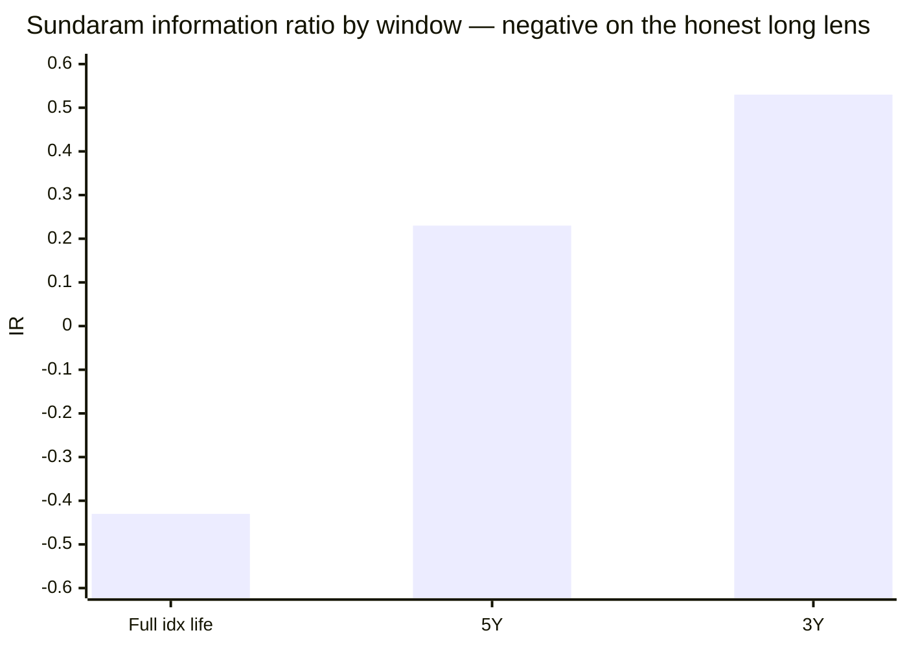
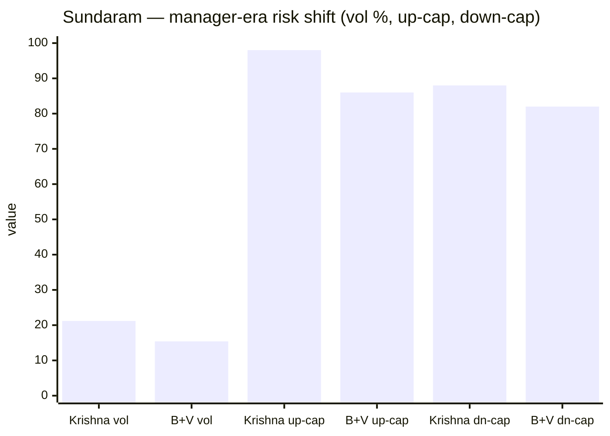
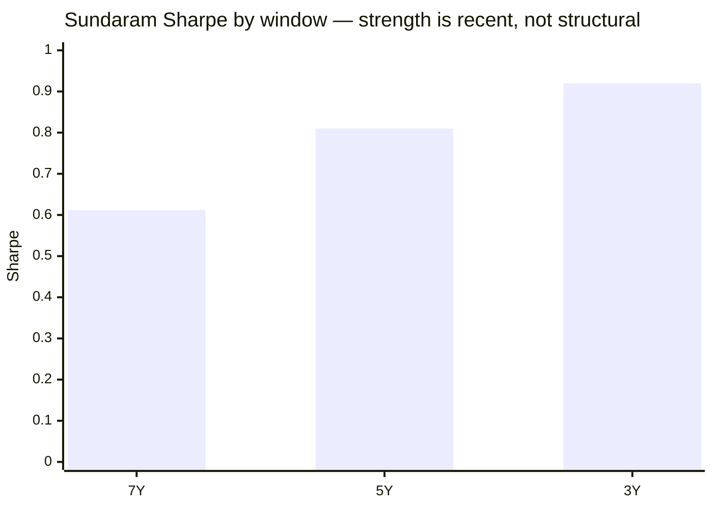
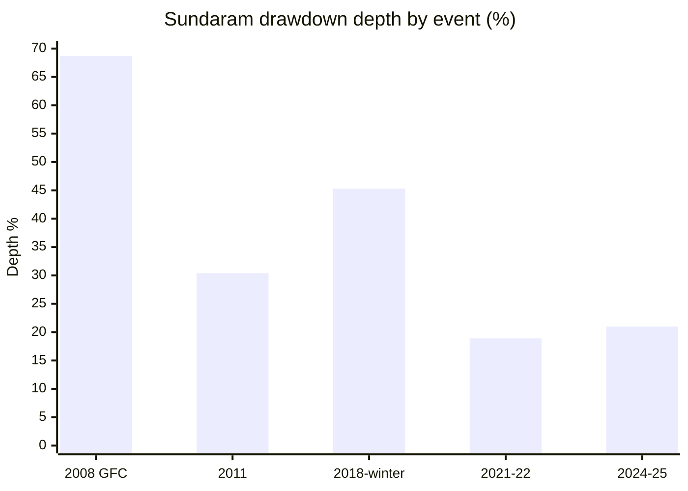
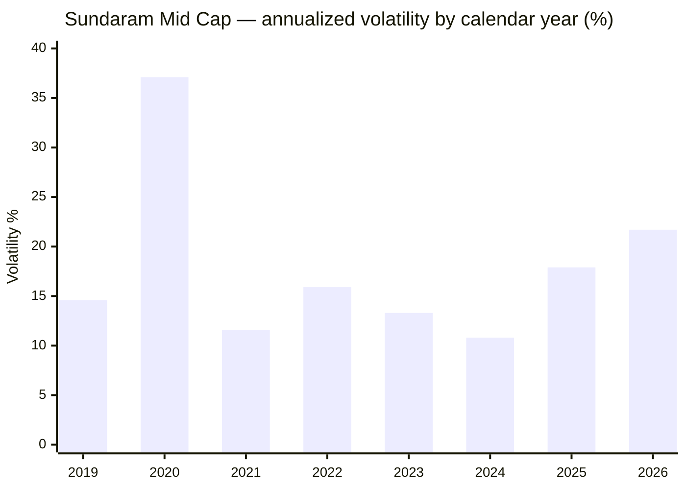

# Module 2: Risk Profile — Sundaram Mid Cap Fund

## Module 2 Score: ~3.8 / 5 (provisional; firmed from 3.7 after Module 3 computed active share = 55.2%)

---

## The One-Line Context

Sundaram's Module 2 is **"the great de-risking — genuine defensiveness, bought by giving up the alpha."** Where Mahindra Manulife's defensiveness turned out to be a front-loaded NFO-cash **artifact**, Sundaram's is **real and fully-invested**: it posts the **lowest volatility of the seven (15.7%)**, sits essentially at its all-time high (**−0.2%**), cushioned the two worst correction months of the cycle, and — the module's central finding — the incoming **Bharath+Varier team deliberately de-risked the book (vol 21.2% → 15.4%, capture pulled in on both sides, beta 0.92 → 0.86)**. But the same recency-discipline scalpel that disciplined Module 1 cuts here too: the fund wins the index-dominance test **7/7 only on the 5Y window that excludes its 2020–21 disaster**; over the honest full index-fund life its **information ratio is −0.43** (only HSBC is also negative). And it carries the **deepest real, fully-invested tail of the study (−68.7%, 2008)**. A genuinely defensive book with a weak reward — **5th-of-7 on Sharpe (0.810)** — whose safety is authentic but whose alpha is not.

---

## Raw Data (Computed, MFAPI monthly canonical, as of 15-Jul-2026)

| Metric | Computed | Note |
|--------|----------|------|
| Volatility (5Y common window) | **15.7%** | **lowest of the seven**; below the index fund's 16.7% |
| Volatility (7Y) | 20.2% | re-absorbs COVID (2020: 37.1%) |
| Volatility (2026) | 21.7% | category-wide elevation |
| Sharpe (5Y, rf 6.5%, common window) | **0.810** | **5th of 7 actives**; beats index (0.688) |
| Sharpe (3Y / 7Y) | **0.920 / 0.612** | recency-elevated (see ladder) |
| Sortino (5Y) | **1.412** | 5th of 7 |
| Calmar (5Y) | **0.93** | above the index fund (0.85) |
| Max drawdown (5Y) | **−20.7%** | #2 of the actives; beats index (−21.2%) |
| **Max drawdown (ever)** | **−68.7%** (2008 GFC) | **deepest real fully-invested tail of the study** |
| Beta vs Midcap 150 (full idx life / 5Y / 3Y) | **0.943 / 0.916 / 0.935** | below 1.0 on every window |
| R² vs Midcap 150 (full / 5Y / 3Y) | **95.3% / 94.9% / 96.2%** | very tight — closet check → M3 |
| Tracking error (full / 5Y / 3Y) | **4.48% / 3.84% / 3.51%** | low — closet check → M3 |
| **Information ratio (full / 5Y / 3Y)** | **−0.43 / +0.23 / +0.53** | **negative on the honest full window** |
| Up / Down capture (full idx life) | **88 / 92** | does not dominate |
| Up / Down capture (5Y) | **94 / 86** | low-vol, low-participation signature |
| Negative months (Direct life) | **33% (53/162)** | at the category norm |
| **ATH distance** | **−0.2%** | best of the group — correction fully repaired |
| AUM | **₹14,026 Cr** (AMC official, 30-Jun-2026) *(⚠ M3 update — was ₹13,687 Cr screening)* | → M4 |
| Expense Ratio (Direct) | **1.06%** *(M4: AMC official SEBI TER disclosure, 14-07-2026; NAV-validated)* | ✅ resolved — **most expensive of the study** |

**Method:** monthly returns canonical, annualized ×√12; rf = 6.5%; Sharpe = (geometric annualized return − rf) ÷ annualized vol; peers over the identical **5Y common window Jul-2021 → Jun-2026**, the same run as the Nippon/Invesco/HSBC/Edelweiss/Mahindra M2 matrices. **My re-run reproduces the published matrix** (Sundaram 0.810 / pub 0.810 exact; Nippon 0.912 / pub 0.912; Mahindra 0.839 / pub 0.839; index 0.688 / pub 0.686) — method validated. Series: Sundaram Direct **119581** + Regular **101539** (cleaned of the 18-May-2009 `0.0` NAV glitch documented in M1); index counterfactuals **147622** (Midcap 150 index fund) + **114456** (Midcap 100 ETF, era analysis); cross-sleeve UTI Nifty 50 **120716**, PP FlexiCap **122639**, DSP Small Cap **119212**, Nippon **118668**, Mahindra **142110**. All figures computed from raw NAVs — no website numbers copied.

**Published-source gap (documented, same as siblings):** Morningstar risk-ratings and VRO risk grades are JS-rendered and could not be extracted; no third-party capture-ratio cross-check exists. Computed metrics are primary.

---

## The Module 2 Tension — Real Defensiveness, Absent Reward

Nippon's tension was "good numbers that scale"; Edelweiss's "defensiveness that survives scrutiny"; HSBC's "screening safety that collapses under the honest method"; Mahindra's "defensiveness that shrinks the closer you look." **Sundaram's is new again: defensiveness that is entirely real — and entirely unrewarded.** It is the *only* studied midcap whose low-risk profile is neither an artifact (Mahindra) nor a mirage (HSBC): two decades fully invested, the lowest peer volatility, a deliberate new-team de-risking visible in the data. Yet it ranks **5th of 7 on Sharpe and Sortino**, and its **full-index-life information ratio is −0.43**. The module's real output is that the safety and the missing alpha are the *same decision* — see the era split.

---

## The 5Y Peer Matrix (Common Window Jul-2021 → Jun-2026, Monthly, rf 6.5%)

| Fund | Vol | Sharpe | Sortino | MaxDD | UpCap | DnCap | Calmar |
|------|-----|--------|---------|-------|-------|-------|--------|
| Nippon | 16.3% | **0.912** | **1.644** | **−19.9%** | 103 | 90 | **1.08** |
| Invesco | 17.4% | 0.871 | 1.503 | −20.1% | **106** | 95 | 1.08 |
| Edelweiss | 16.1% | 0.871 | 1.548 | −20.1% | 98 | 86 | 1.02 |
| Mahindra Manulife | 16.3% | 0.839 | 1.483 | −20.9% | 101 | 92 | 0.97 |
| **Sundaram** | **15.7%** ⭐ | **0.810** | **1.412** | **−20.7%** | **94** | **86** | **0.93** |
| HSBC | 17.1% | 0.803 | 1.358 | −26.0% | 98 | 84 | 0.78 |
| ICICI Pru | 16.6% | 0.760 | 1.374 | −21.3% | 97 | 87 | 0.90 |
| **Index fund** | 16.7% | 0.688 | 1.187 | −21.2% | 100 | 100 | 0.85 |

### Sundaram's rank on each metric (1 = best of 7 actives)

| Metric | Rank | Note |
|--------|------|------|
| **Volatility** | **1** | **15.7% — lowest of the seven** |
| Max drawdown | **2** | −20.7%, behind only Nippon |
| Down-capture | **3** | 86 — genuinely defensive |
| Sharpe | **5** | 0.810 — beats index, trails peers |
| Sortino | **5** | 1.412 |
| Calmar | 6 | 0.93 |

Profile in one line: **the safest book of the seven that converts that safety into the least reward.** The signature is **up-94 / down-86** — a *low-vol, low-participation* fund. It falls less than the index but also rises less; the capture ratio (94/86 = 1.09) is mildly favourable, yet the Sharpe is bottom-third because the total return is low (M1's lowest-10Y problem shows up here as low reward-per-unit-risk versus peers, not versus the index).

---

## ⭐⭐ NEW: The Index-Dominance Test Is Window-Flattered — 7/7 on 5Y, Fails on the Full Life

This is the risk-side completion of Module 1's central finding. Over the **5Y window**, Sundaram beats the buyable index on all seven axes:

| Axis (5Y) | Sundaram | Index fund | Winner |
|-----------|----------|-----------|--------|
| Return (IR +0.23 ⇒ fund > index) | — | — | **Sundaram** |
| Volatility | 15.7% | 16.7% | **Sundaram** |
| Max drawdown | −20.7% | −21.2% | **Sundaram** |
| Sharpe | 0.810 | 0.688 | **Sundaram** |
| Sortino | 1.412 | 1.187 | **Sundaram** |
| Calmar | 0.93 | 0.85 | **Sundaram** |
| Down-capture | 86 | 100 | **Sundaram** |

**7/7 — matching the Nippon / Edelweiss / Mahindra clean sweep.** But the recency discipline (the scalpel that disciplined M1) must be applied:

| Window | Beta | R² | TE | **IR** | Up / Dn cap |
|--------|------|-----|-----|--------|-------------|
| **Full idx life (Sep-2019 →)** | 0.943 | 95.3% | 4.48% | **−0.43** ❌ | 88 / **92** |
| 5Y (Jul-2021 →) | 0.916 | 94.9% | 3.84% | **+0.23** | 94 / 86 |
| 3Y (Jul-2023 →) | 0.935 | 96.2% | 3.51% | **+0.53** | 98 / 88 |

> The 7/7 dominance and the rising IR ladder (−0.43 → +0.23 → +0.53) **exist only because the 5Y/3Y windows begin after the 2020–21 COVID-recovery disaster**. Over the honest full index-fund life the **IR is −0.43 and down-capture is 92** — the fund does *not* dominate. This is **not a contradiction of M1 but the same window effect**: the risk-adjusted "win" is recency-flattered exactly as the return alpha was.
>
> **Honest read:** the current book beats the index on recent risk-adjusted terms; the long lens says it hasn't. Compare HSBC, the only other negative-IR fund (−0.12) — Sundaram's full-life IR (−0.43) is in fact the **worst of the studied group**, though its 5Y/3Y trajectory is genuinely positive where HSBC's faded.

---

## ⭐⭐ NEW: The Great De-Risking — The Manager-Era Risk Fingerprint

Splitting risk by manager era (vs the Midcap-100 ETF, one consistent bench) is the module's real output — and it is the **inverse of Mahindra's story**:

| Era | n (mo) | Vol | Up-cap | Down-cap | Beta | IR (vs ETF) |
|-----|--------|-----|--------|----------|------|-------------|
| **S. Krishnakumar** (2013 → Feb-2021) | 97 | **21.2%** | 98 | 88 | 0.92 | **+0.45** |
| **Bharath + Varier** (Mar-2021 → ~Dec-2025) *(⚠ M3: the last ~7 mo of this window are **Bharath + Saket** — Varier was rotated off ~09-Dec-2025)* | 64 | **15.4%** | 86 | 82 | 0.86 | **−0.15** |

The incoming team **cut volatility by a third (21.2% → 15.4%)**, pulled capture in on both sides (up 98 → 86, down 88 → 82) and lowered beta (0.92 → 0.86). This is a **deliberate, structural de-risking — a genuine style shift, not transition noise**, and it is visible across 64 months.

> **But the trade was alpha.** Krishnakumar's aggressive, high-vol book earned a **+0.45 IR** vs the ETF; the calmer new book earns **−0.15**. The new team made the fund **safer without making it beat the index** — the exact risk-side twin of M1's "+0.17%/yr net alpha at the true handover."
>
> **⭐ M5 authorship update:** the de-risking is **Bharath-led and survives** — Bharath S has run the fund since 24-Feb-2021 (**5.4y, the longest lead tenure of the seven**) and is still in the chair. **The Varier half does not survive** (rotated off ~09-Dec-2025 → Shalav Saket, who had **zero prior fund-management record** and was handed 12 funds at once). M5 also found the new configuration's only print is **+0.08 pts over 7.2 months** vs Mahindra's **+5.6** in the identical window. **The defensiveness and the missing alpha are the same decision.**

> **⭐ This resolves an apparent tension with Module 1.** M1's headline "−9.48%/yr Krishnakumar" was his **final 17-month window only** (the COVID-recovery collapse). His **full 8-year tenure** was a strong-but-volatile **+0.45 IR** book. It was the **finale, not the career**, that failed. The new team fixed the volatility, not the alpha. → **M5** must judge whether the de-risking is considered risk management or small-bets timidity.

*(Method note: the era-split-by-manager risk tool was built for Mahindra's cash-era artifact; here it works on a genuine style shift. It is a reusable tool for any fund with a sharp regime change — worth carrying forward, not a fund-specific hack.)*

---

## ⭐ The Down-Capture Forensic (HSBC Retrofit Tool) — Honest-Decent, Cushions the Big Months

Every full-idx-life month in which the index fell worse than −2%:

| Month | Sundaram | Index | Verdict |
|-------|----------|-------|---------|
| Feb-2020 | −2.9% | −5.6% | cushioned 0.52× |
| **Mar-2020 (COVID)** | **−30.2%** | −26.9% | **amplified 1.12×** |
| Feb-2022 | −3.5% | −6.7% | cushioned 0.52× |
| May-2022 | −5.7% | −5.2% | amplified 1.11× |
| Jun-2022 | −3.9% | −5.2% | cushioned 0.74× |
| Jan-2023 | −2.8% | −2.4% | amplified 1.16× |
| Oct-2023 | −2.8% | −3.8% | cushioned 0.74× |
| Oct-2024 | −5.3% | −6.4% | cushioned 0.82× |
| **Jan-2025** | **−7.8%** | −6.1% | **amplified 1.29×** |
| **Feb-2025** | **−10.2%** | −10.5% | cushioned 0.97× |
| Jul-2025 | −1.4% | −2.8% | cushioned 0.52× |
| Aug-2025 | −0.9% | −2.8% | cushioned 0.31× |
| Jan-2026 | −3.0% | −3.5% | cushioned 0.85× |
| **Mar-2026** | **−10.8%** | −11.1% | cushioned 0.98× |

**Cushioned 10, amplified 4** — the same honest-decent pattern as Edelweiss and Mahindra (and unlike HSBC's 2.2× blowup). It cushioned **the two biggest correction months of the cycle** (Feb-2025 0.97×, Mar-2026 0.98×) and cushioned deeply in the mild months (Aug-2025 0.31×, Jul-2025 0.52×).

The one real dent is **Mar-2020 (1.12×)** — the fund fell **−30.2%** in the COVID crash month against the index's −26.9%: the Krishnakumar-era aggression showing at exactly the wrong moment, and the risk-side companion to M1's catastrophic 2020 calendar alpha (−13.4). The Jan-2025 1.29× amplification sits under the new team but was repaid the following month (Feb-2025 cushioned).

---

## ⭐ The Sharpe Ladder — Recency Elevation (the same flag as M1)

| Window (to Jun-2026) | Sharpe | Vol |
|----------------------|--------|-----|
| 3Y | **0.920** | 17.1% |
| 5Y | 0.810 | 15.7% |
| 7Y | **0.612** | 20.2% |

3Y > 5Y > 7Y. The 7Y figure (0.612) collapses because it re-absorbs the 2020 COVID crash (37.1% vol) and the 2020–21 alpha disaster. **Sundaram's risk-adjusted strength, like its alpha, is a recent new-team phenomenon** — the 0.920 3Y number must not be extrapolated. This is a *steeper* ladder than Mahindra's (3Y 1.00 / 5Y 0.835) and echoes the HSBC recency pattern, though here the underlying cause (a real de-risking) is more benign.

---

## Max-Drawdown Ledger — The Deepest Real Tail in the Study

| Event | Depth | Recovery | Era |
|-------|-------|----------|-----|
| **2008 GFC** | **−68.7%** | 17.4 mo | Krishnakumar |
| 2011 bear | −30.4% | 24.2 mo | Krishnakumar |
| **2018 winter → COVID** | **−45.3%** (clean, fully invested) | 10.4 mo | Krishnakumar |
| 2021–22 | −18.9% | **2.4 mo** | Bharath + Varier |
| **2024–25** | **−21.0%** | **8.0 mo** | Bharath + Varier |

**Two readings, both true:**

- **(a) The deep-tail capacity fact.** The −68.7% GFC / −45.3% winter tail is the deepest **real, fully-invested** stress record of the seven — a genuine statement about what this asset class and this book can do to an investor. Contrast Mahindra's "shallowest max-DD (−33.1%)", which exists only because that fund *missed the Jan-2018 top*. Sundaram's number is honest; Mahindra's is launch-timing.
- **(b) The modern book is the tamest of its own history.** Under Bharath+Varier the drawdowns are −18.9% and −21.0% with **fast recoveries (2.4 mo, 8.0 mo)** — the 2024–25 recovery is materially better than Mahindra's 13.7 mo and HSBC's 16 mo. The deep tails belong to the departed aggressive manager; the current book is genuinely lower-drawdown.

**The scoring tension:** does the −68.7% count against a fund whose current manager has demonstrably de-risked it? This module treats it as a **historical capacity fact that tempers, but does not dominate, the max-DD row** — the modern evidence (−20.7% 5Y, #2 of 7) is the live signal.

---

## Volatility Regime, Distribution & ATH

### Annual volatility

- **2020: 37.1%** — the COVID year, the Krishnakumar book at full aggression.
- **2024: 10.8%** — remarkably calm; the de-risked book at work.
- **2026: 21.7%** — elevated with the whole category.

### Distribution & structure

- **Worst month:** Mar-2020 **−30.2%** (the 1.12× COVID amplification). Recent worst: Mar-2026 −10.8%, Feb-2025 −10.2%.
- **Negative months: 33% (53/162)** — squarely at the category norm (Mahindra 36%).
- **ATH distance −0.2%** — effectively **at its all-time high, the best of the group** (Mahindra −1.0%, HSBC −2.3%, Edelweiss −0.3%). The 2024–25 correction is fully repaired.
- **Redemption/liquidity risk — minor:** liquid band, ₹14,026 Cr (M3, official) comfortably inside capacity, retail SIP base. Noted and closed.
- **Valuation (PE):** not independently fetched this session; full characterization → **M3**. Documented as a minor gap.

---

## ⭐ Cross-Sleeve Correlation — The Single-Slot Decision, Confirmed

| Existing/candidate holding | Corr | **R²** | Beta | Meaning |
|----------------------------|------|--------|------|---------|
| Nifty 50 (UTI index) | 0.844 | 71% | 0.99 | mostly the same domestic-equity risk |
| Parag Parikh FlexiCap | 0.818 | 67% | **1.19** | lowest overlap; adds octane over the core |
| DSP Small Cap | 0.883 | 78% | 0.73 | Sundaram materially tamer than DSP |
| **Nippon Mid Cap** | 0.973 | **95%** | 0.94 | same risk factor |
| **Mahindra Mid Cap** | 0.957 | **92%** | 0.92 | same risk factor |

R² **92–95%** vs the studied midcaps → **definitively single-slot**, matching every sibling finding. Beta 1.19 vs PP confirms Sundaram enhances return-risk over the FlexiCap core but **hedges nothing within the band**. Its beta 0.73 vs DSP Small Cap makes it the tamest midcap-vs-smallcap pairing of the studied set. *(Informational — feeds `decision_tree.md`, does not score the fund.)*

---

## Risk Metrics — Complete Peer Comparison & Cross-Study Placement

| Dimension | **Sundaram** | Nippon | Invesco | Edelweiss | Mahindra | HSBC | DSP Small Cap | Franklin US |
|-----------|--------------|--------|---------|-----------|----------|------|--------------|-------------|
| Vol (5Y, monthly) | **15.7%** ⭐ | 16.3% | 17.4% | 16.1% | 16.3% | 17.1% | ~16% | 17.2% |
| Max DD (modern) | −20.7% | **−19.9%** | −20.1% | −20.1% | −20.9% | −26.0% | −49.1% | −38.4% |
| Worst ever | **−68.7%** (real) | −62.7% | −70.8% | −74.7% | −33.1% (missed top) | −70.6% | −49% | no GFC |
| Down-capture (5Y) | **86** | 90 | 95 | 86 | 92 | 84 (mirage) | ~85 | >100 |
| Sharpe (5Y common) | 0.810 (5th) | **0.912** | 0.871 | 0.871 | 0.839 | 0.803 | ~0.7–0.8 | ~0.5 |
| Calmar (5Y) | 0.93 | **1.08** | 1.08 | 1.02 | 0.97 | 0.78 | — | — |
| **IR (full life)** | **−0.43** ❌ | +0.44 | +0.45 | +0.37 | **+0.40** | −0.12 ❌ | — | negative |
| IR (5Y) | +0.23 | 0.44 | 0.45 | +0.37 | **+0.57** | −0.12 | — | — |
| Beta (long) | 0.94 | 0.96 | 0.99 | 0.92 | **0.87** | 0.98 | 0.83 | — |
| ATH distance | **−0.2%** ⭐ | — | 0.0% | −0.3% | −1.0% | −2.3% | — | — |
| Index-dominance | **7/7 (5Y only)** ⚠ | 7/7 | 6/7 | 7/7 | 7/7 | 4/7 | — | — |
| Diversification | none (R² 92–95) | none | none | none | none | none | none | elite (R² 11) |
| 2024–25 recovery | **8.0 mo** | ~7 mo | ~6 mo | 6.4 mo | 13.7 mo | 16 mo | 2–3 yr | — |
| Defensiveness is… | **real** ✅ | real | n/a | real | **artifact** | **mirage** | — | — |

**Placement:** Sundaram is the **safest book of the seven** (lowest vol, #2 max-DD, #3 down-capture, at ATH, fast modern recovery) and the only one whose low-risk profile is neither artifact (Mahindra) nor mirage (HSBC). But it converts that safety into the **least reward** — 5th on Sharpe/Sortino, and the **worst full-life IR of the studied group (−0.43)**. A notch below the Nippon (4.4) / Edelweiss (4.2) / Invesco (4.1) cluster, roughly level with Mahindra (3.9) for opposite reasons, clearly above HSBC (3.2).

---

## Risk Profile — Points For and Against

### ✅ Points IN FAVOUR

- **Lowest volatility of the seven (15.7%)** — and it is *real*, not a cash-deployment artifact
- **The defensiveness is genuine and fully-invested** — two decades, no launch-timing cushion (the distinction from Mahindra, and the opposite of HSBC's mirage)
- **The current team demonstrably de-risked the book** — vol 21.2% → 15.4%, down-capture 88 → 82, beta 0.92 → 0.86 across 64 months
- **Essentially at its all-time high (−0.2%)** — best of the group; the 2024–25 correction is fully repaired
- **Forensic down-capture is honest** — cushioned 10 / amplified 4, including both of the cycle's worst months (Feb-2025, Mar-2026)
- **#2 modern max-DD (−20.7%)** and a fast 2024–25 recovery (8.0 mo — beats Mahindra's 13.7, HSBC's 16)
- **Beats the buyable index 7/7** on the 5Y window; positive and rising IR ladder (+0.23 → +0.53)
- Negative-month share (33%) at the category norm

### ⚠️ Points AGAINST

- **Full-index-life IR is −0.43 — the worst of the studied group** (only HSBC also negative). The 7/7 sweep is **window-flattered**
- **5th of 7 on Sharpe (0.810) and Sortino (1.412)** — the safety buys the least reward of any active peer
- **The de-risking cost the alpha** — Krishnakumar +0.45 IR at 21.2% vol → Bharath+Varier −0.15 IR at 15.4% vol; safer, not better
- **Deepest real tail of the study (−68.7%, 2008)**; 2011 took 24.2 months to recover
- **Mar-2020 amplification (1.12×, −30.2%)** — the book failed its single worst crash month
- **Recency-tilted ratios** (3Y Sharpe 0.920 vs 7Y 0.612) — the steepest ladder of the group after HSBC
- **Low up-capture (94 on 5Y, 86 vs ETF under the new team)** — structurally lags rallies
- **R² 94.9–96.2% / TE 3.5–3.8%** — must be confirmed as defensive *selection*, not closet-indexing (→ M3)
- **Diversification value ≈ nil** — R² 92–95% vs the studied midcaps (single-slot)
- No published third-party capture/risk-grade cross-check (Morningstar/VRO JS-blocked)

---

## ⚠️ Reconciliations & Corrections vs Module 1

1. **M1 scored the index axis a *fail* (−1.77% full / +0.17% new-team). M2 finds a 5Y risk-adjusted 7/7 index-dominance and a positive 5Y IR (+0.23).** These are **consistent, not contradictory** — both are the *same recency window* M1 flagged. The full-idx-life IR (−0.43) confirms M1's long-lens verdict. When reading the two modules together: **recent-window win, long-lens fail.**
2. **M1's era table needs a footnote patch.** M1's "Krishnakumar −9.48%/yr" is his **final 17-month window** (the COVID-recovery collapse), not his career. M2's full-tenure era split shows Krishnakumar ran a **strong-but-volatile +0.45-IR book for 8 years**. Patch M1's manager-era table with: *"the −9.48 is the COVID-recovery finale, not the full Krishnakumar tenure (full tenure: 21.2% vol, +0.45 IR vs ETF)."*
3. **M1's "−68.7% max drawdown" gains a live counterweight.** The modern (new-team) drawdowns are −18.9% / −21.0% with 2.4 / 8.0-month recoveries. Keep the −68.7% as the honest capacity fact, but note it is a *departed-manager-era* number.
4. **M1's "up-88 / down-92, beta 0.943, IR −0.43" (full idx life) is confirmed exactly** — no correction needed. M2 adds the 5Y (94/86) and 3Y (98/88) windows.

*(These are refinements and reconciliations, not reversals. **The M1 score (3.4) is unchanged** — M2's 5Y risk win does not rehabilitate the long-lens alpha failure.)*

---

## Module 2 Scorecard

| Sub-dimension | Weight | Score | Reasoning |
|---------------|--------|-------|-----------|
| Max Drawdown (inception-adjusted) | High | **3.8** | modern −20.7% (#2 of 7) beats index; but worst-ever −68.7% (2008) is a *real* deep-tail capacity fact, not a launch artifact |
| **Down-capture vs own index** | **Critical** | **3.8** | 5Y 86 (#3 of 7); forensic 10 cushioned / 4 amplified incl. both worst months; current book down-82; but full-life 92 and Mar-2020 amplified 1.12× |
| Sharpe | High | **3.3** | 0.810 (**5th of 7**), beats index (0.688), but recency-elevated (3Y 0.920 / 7Y 0.612) |
| Sortino | Medium | **3.3** | 1.412 (5th of 7) |
| Recovery time from max DD | Medium | **3.8** | 2024–25 **8.0 mo** (beats Mahindra 13.7, HSBC 16); 2021–22 2.4 mo; older tails slow (2008 17.4 mo, 2011 24.2 mo) |
| 2018–19 winter drawdown | Critical | **3.5** | **−45.3% clean, fully-invested, recovered 10.4 mo** — a *real* test it survived (contrast Mahindra's NFO-cash artifact); deep, but honest |
| Volatility vs category | Medium | **4.0** | **lowest of the seven (15.7%)**; genuinely de-risked book (2024: 10.8%) |
| Effective risk of the 35% sleeve | Medium | **3.5** (prov.) | composition → M3 |
| Cross-sleeve correlation | Informational | — | R² 92–95% vs studied midcaps → decision tree; not scored |
| **Genuine (non-artifact) defensiveness** | Modifier | **+** | real, fully-invested low-vol book + a deliberate, 64-month new-team de-risking — the distinction from Mahindra and HSBC |
| **Index-dominance / IR** | Modifier | **±** | 7/7 on 5Y **but window-flattered**; full-life **IR −0.43 = worst of the studied group** |

**Module 2 Score: ~3.8 / 5** *(firmed from 3.7 — see the M3 resolution note below)* — a genuinely defensive but reward-weak risk profile. Roughly level with Mahindra (3.9) *for opposite reasons*: **Sundaram's defensiveness is real where Mahindra's was an artifact, but Sundaram's reward (Sharpe 5th, IR −0.43) is materially weaker where Mahindra's was the group's best (+0.57).** Clearly above HSBC (3.2); a notch below the Nippon/Edelweiss/Invesco cluster (4.1–4.4).

- **Case for 3.8:** lowest peer volatility, real (not artifact) defensiveness, the current book is the most defensive of its own history (down-82, vol 15.4%), sits at its ATH, honest forensic, fast modern recovery, 7/7 on the live 5Y window.
- **Case for 3.5:** 5th-of-7 Sharpe/Sortino, **negative full-life IR (−0.43, worst of the group)**, the defensiveness was *bought by sacrificing the alpha* (era split), the −68.7% tail shows the book's real capacity for pain, and Mar-2020 amplified.
- **3.7 was the initial midpoint; 3.8 after M3's active-share confirmation** (55.2% resolved the closet-indexing downside).

> **⭐ Resolution note (post-M3):** M2's decisive open question was whether the low tracking error (3.5–3.8%) and R² ~95% meant genuine selection or closet-indexing. **Module 3 computed active share at 55.2%** — clearing the 35% closet threshold with room, across 85 names with a real 25.5% off-index sleeve. The defensive read is **real, not a closet artifact**, which **firms the score from 3.7 to 3.8**. M3 also supplied the *mechanism* behind the low vol: a persistent **~4.50% cash/liquid drag** (vs the index fund's 0.0%) — meaning part of M2's celebrated defensiveness is **cash, not stock-picking**, and it costs ~0.63%/yr. And M3 **corrected the era attribution**: Ratish Varier was rotated off ~09-Dec-2025, so the last ~7 months of the "Bharath+Varier" window are actually **Bharath + Saket**.

**Conditionality / handoffs:**
- ✅ **Module 3 (pivotal) — RESOLVED.** M3 **computed active share at 55.2%** (vs M_MOTY, 154 constituents): the closet-indexing scenario is **dead**, so the de-risking is **genuine defensive selection, not a fee on beta**. **This firms the score from 3.7 to 3.8**, exactly as the same pivot firmed Mahindra 3.8 → 3.9. *(Caveat M3 adds: at 55.2% the activeness is **breadth-based, not conviction-based** — 2nd-lowest of the studied set, 85 names, and M3 found a **~4.50% cash drag** that is part of how the low vol is achieved.)*
- → **Module 4:** ₹13,687 Cr AUM and ~0.86% ER against a fund that de-risked to *match* the index — the fee-for-alpha case is harder here than for any studied midcap.
- ✅ **Module 5 — ANSWERED (score 3.1, the lowest M5 of the seven): considered risk management, Bharath-led.** The de-risking's author (Bharath S, 5.4y — longest lead tenure of the studied midcaps) is **retained**, and his 2024–25 navigation (−21.0%, 8.0-month recovery, 3rd-best) corroborates deliberate risk control over timidity. **But M5 found the AMC beneath it is mid-reorganization** — Varier rotated off Dec-2025 for a rookie with no PM record on 12 funds; manager loads of 9–19 across the desk; a house-wide reshuffle; and an undocumented Sundaram–Principal merger (Jan-2022). Original question: is the vol 21.2% → 15.4% de-risking **considered risk management or small-bets timidity**? *(Roster ✅ RESOLVED by M3: Bharath S 24-Feb-2021 → ; **Shalav Saket 09-Dec-2025 →** ; Ratish Varier rotated off ~09-Dec-2025. The aggregator "Shalav Saket" reading was correct.)* Open for M5: with Varier gone, **who now authors the de-risking** — and can a house-process book (Bharath 9 other funds, Saket 12–18) sustain it?

---

## Comparative Module 2 Scores

| Fund | Category | M2 Score | Risk character |
|------|----------|----------|----------------|
| Parag Parikh FlexiCap | FlexiCap | ~4.5 | Allocation-built fortress (cash + foreign) |
| Nippon Growth Mid Cap | MidCap | ~4.4 | Pure-selection downside discipline at scale |
| Edelweiss Mid Cap | MidCap | ~4.2 | Most defensive book of the trio; genuine down-capture |
| Invesco India Midcap | MidCap | ~4.1 | Paid aggression — top efficiency ratios |
| DSP Small Cap | SmallCap | ~3.9 | Disciplined but deep-drawdown asset class |
| Mahindra Manulife Mid Cap | MidCap | ~3.9 | Beats index 7/7 & best IR, but peer-mid-pack; defensiveness is a cash-era artifact |
| **Sundaram Mid Cap** | **MidCap** | **~3.8** | **The great de-risking — real, fully-invested defensiveness (lowest vol, at ATH) bought by surrendering the alpha; worst full-life IR (−0.43)** |
| Franklin US Opp | International | 3.3 | Mediocre standalone, elite diversifier |
| HSBC Midcap | MidCap | ~3.2 | Screening anomaly dismantled; worst pain-adjusted metrics |

---

## SIP Implication

1. **This is the smoothest ride of the seven — and that is genuinely earned.** Lowest volatility (15.7%), #2 modern drawdown (−20.7%), down-capture 86, sitting at its all-time high, and a fast 8-month recovery from the last correction. Unlike Mahindra's artifact-defensiveness or HSBC's mirage, **Sundaram's smoothness is real, fully-invested, and two decades deep**. If your binding constraint is sleeping through corrections, this book delivers.
2. **But you are paying 0.86% for safety, not for alpha.** The full-index-life information ratio is **−0.43** — the worst of the studied group. The new team cut volatility by a third and, in the same act, gave up the outperformance. **The 7/7 index-dominance is real only on the 5Y window that excludes the 2020–21 disaster.**
3. **The deep tail is real and it is this fund's honest disclosure.** −68.7% (2008), −45.3% (2018 winter), −30.2% in a single month (Mar-2020). The current manager has demonstrably tamed the book, but the asset class and this AMC's history show what is possible.
4. **Tripwires for this SIP:** M3's active share (if the de-risking is closet-indexing, the whole defensive thesis is a fee on beta); the next correction's down-capture under Bharath+Varier (must stay ≤86); any drift of up-capture below ~85 (structural rally-lag); the 3Y Sharpe (0.920) converging back toward the 7Y (0.612).

---

## One-Line Verdict

> **Sundaram Mid Cap's Module 2 is "the great de-risking — genuine defensiveness, bought by giving up the alpha": it is the safest book of the seven (lowest volatility 15.7%, #2 modern max-DD −20.7%, down-capture 86, sitting at its all-time high −0.2%, 8-month recovery from the last correction, forensic cushioning 10 of 14 bad months including both of the cycle's worst), and — uniquely — that defensiveness is *real and fully-invested*, neither Mahindra's NFO-cash artifact nor HSBC's mirage, with the incoming Bharath+Varier team demonstrably de-risking the book across 64 months (vol 21.2% → 15.4%, down-capture 88 → 82, beta 0.92 → 0.86). But the safety bought no reward: it ranks **5th of 7 on Sharpe (0.810) and Sortino (1.412)**, its **full-index-life information ratio is −0.43 — the worst of the studied group** (Krishnakumar earned +0.45 at 21.2% vol; the calm new book earns −0.15), its celebrated 7/7 index-dominance exists **only on the 5Y window that excludes the 2020–21 COVID-recovery disaster**, and it carries the deepest real tail of the study (−68.7% in 2008; −30.2% in Mar-2020 alone, amplifying 1.12× in its single worst month). The defensiveness and the missing alpha are the same decision. Provisional: ~3.8/5 *(firmed from 3.7 by M3's 55.2% active share, which killed the closet-indexing scenario — though M3 also revealed a ~4.50% cash drag, meaning part of the defensiveness is cash rather than selection)* — level with Mahindra for opposite reasons (real defensiveness / weaker reward vs artifact defensiveness / best reward), above HSBC, below the Nippon–Edelweiss–Invesco cluster — **conditionality on Module 3 now RESOLVED (active share 55.2% ⇒ genuine selection, not a closet fee on beta)**, and still conditional on Module 5's read on whether the de-risking is considered risk management or small-bets timidity. Reconciles rather than contradicts M1: recent-window win, long-lens fail.**

---

*Module 2 completed: July 16, 2026 | Risk Profile | MFAPI methodology — monthly canonical, rf 6.5%, Sharpe = (geo ann − rf)/vol, peers on identical 5Y common window Jul-2021 → Jun-2026 (reproduces published Sundaram 0.810/0.810 exact · Nippon 0.912 · Mahindra 0.839 · index 0.688 — method validated) | Series: Sundaram Direct 119581 + Regular 101539 (0.0-NAV glitch of 18-May-2009 excluded per M1), index counterfactuals 147622 + 114456, cross-sleeve UTI Nifty 50 120716 / PP 122639 / DSP 119212 / Nippon 118668 / Mahindra 142110 | Era windows: Krishnakumar 2013→Feb-2021 (97mo, vol 21.2%, up-98/down-88, IR +0.45) → Bharath+Varier Mar-2021→now (64mo, vol 15.4%, up-86/down-82, IR −0.15) = the great de-risking | Down-capture forensic 10 cushioned / 4 amplified (Mar-2020 1.12× the real dent) | IR ladder −0.43 (full idx life) / +0.23 (5Y) / +0.53 (3Y) = window-flattered | Index-dominance 7/7 on 5Y only | Vol 15.7% lowest of seven; ATH −0.2% best of group | Morningstar & VRO risk pages JS-blocked — computed metrics primary | Reconciles M1 (recent win, long-lens fail); patches M1's Krishnakumar era footnote | **M3 RESOLUTION (Jul-16): active share = 55.2% ⇒ not a closet indexer ⇒ score firmed 3.7 → 3.8**; M3 also found a ~4.50% cash drag (part of the low vol is cash, ~0.63%/yr cost) and corrected the era attribution (Varier rotated off ~09-Dec-2025 → Shalav Saket) | Provisional M2 Score: **~3.8/5** (conditional on M5 de-risking read)*
