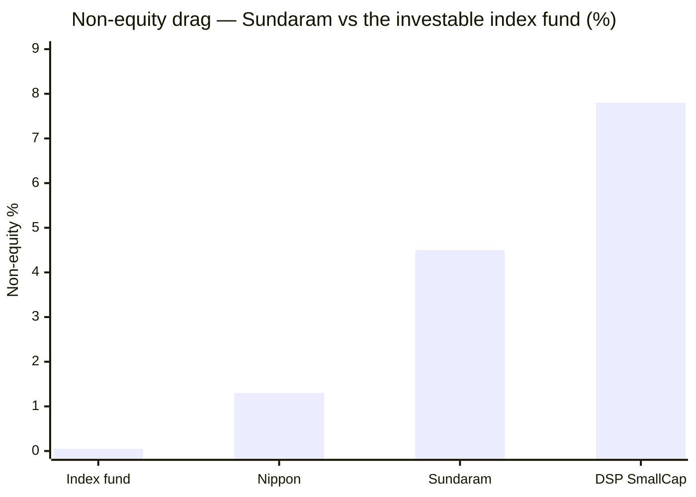
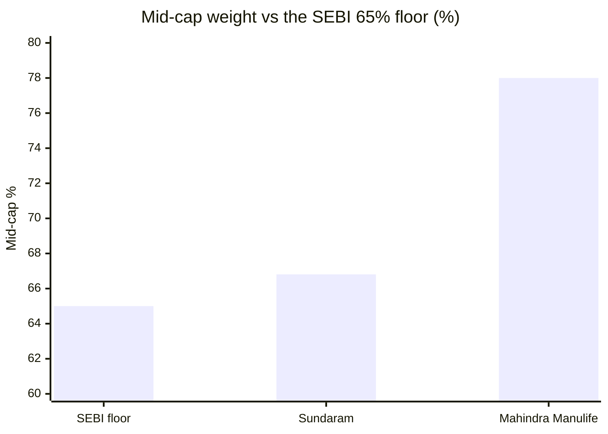

# Module 3: Portfolio DNA — Sundaram Mid Cap Fund

## Module 3 Score: ~3.5 / 5 (provisional)

---

## The One-Line Context

Sundaram's Module 3 is **"active enough not to be a closet indexer, not active enough to beat the fee."** The Module 2 pivot **resolves positively**: active share computes to **55.2%** — decisively above the 35% closet threshold, so M2's defensiveness is **genuine selection, not a fee on beta** (**M2 firms 3.7 → 3.8**). But the book that emerges *explains* Modules 1 and 2 rather than rescuing them: an **85-name, top-10-24.8%, max-sector-8.0%, 37%-turnover house-process book**, run by two managers who between them carry **9 and 12 other funds** — breadth-based activeness, not conviction density. And the module surfaces three findings no template section anticipated: a **persistent ~4.5% cash/liquid drag the index fund does not carry**, a **mid-cap weight of 66.81% — just 1.8 points above the SEBI floor**, and — decisively — **Ratish Varier was rotated off this fund on ~09-Dec-2025 and replaced by Shalav Saket**, which breaks M1's "author retained ✅" and M2's era framing. The module's real output is the arithmetic that follows: **the stock-pickers are beating the index by ~+1.66%/yr gross, and the wrapper (fee + cash) confiscates ~90% of it.** *(⚠ M4 update: originally computed as +1.46% on an assumed 0.86% ER; M4 resolved the official Direct TER to **1.06%**, confirming M3's own stated sensitivity exactly.)*

---

## ⭐ Data Provenance (a genuine hunt — read first)

| Source | Status | What it gave |
|--------|--------|--------------|
| Tickertape holdings API `api.tickertape.in/mutualfunds/M_SUNIU/holdings` | ✅ | 85 equity names + weights + 3m deltas + sector series (Jun-2026) |
| **AMC official Mar-2025 factsheet PDF** (curl + browser UA; WebFetch not needed) | ✅ | turnover 39.8%, cap split, AUM ₹11,333 Cr, 76 stocks, **managers Bharath + Varier** |
| **AMC live digital factsheet** `sundarammutual.com/digital-factsheet/MIDCAP-MC` — JS-rendered, extracted via **browser + Highcharts series dump** | ✅ **breakthrough** | **Jun-2026 official**: AUM ₹14,026 Cr, cap split, turnover 36.89/42.24, WAMC/median mkt cap, beta/IR/Sharpe/SD, **managers Bharath + Saket** |
| **Groww `__NEXT_DATA__` JSON** | ✅ | **manager start dates** (Bharath 24-Feb-2021; Saket 09-Dec-2025), bios, funds-managed counts, AUM, ER |
| AMC notices/addenda page | ❌ JS-rendered, no static PDF index | the exact Varier rotation addendum — **documented gap** (→ M5) |

**Method note (reusable):** the Sundaram AMC digital factsheet is a Highcharts-driven SPA. Static curl returns labels without values; the numbers live in `Highcharts.charts[].series[].data`. Rendering the page and dumping the chart series is the working extraction path — **the equivalent of the Nippon "curl + browser-headers innerpage" trick for this AMC.** Worth carrying forward to the pending Sundaram Small Cap study.

### Cross-validation wins (method integrity)

| Check | Result |
|-------|--------|
| AUM | Official factsheet **₹14,026 Cr** = Groww JSON **14026.07** ✅ exact |
| M1's "₹77,804 Cr is AMC-total, not the fund" | ✅ **Confirmed** — the AMC's own site states *"80k Crore+ Assets Under Management"* |
| AMC 36-mo **Sharpe 0.91** | vs my computed 3Y **0.920** ✅ |
| AMC 36-mo **SD 17.30** | vs my computed 3Y vol **17.1%** ✅ |
| AMC **Beta 0.93** | vs my computed 3Y **0.935** ✅ |
| AMC **Information Ratio 0.32** | vs my computed **+0.23 (5Y) / +0.53 (3Y)** ✅ in range |
| Groww Bharath start **24-Feb-2021** | = M1/M2's independently-computed handover date ✅ exact |
| Tickertape MF units 4.01% (Mar-25) | = AMC factsheet "Mutual Fund Units 4.0 / Sundaram Liquid Fund 4.0" ✅ |

> **The AMC's own published 36-month risk ratios independently validate the M2 computation stack.** This is the first study in the midcap set where an official source cross-checks the computed Sharpe/beta/SD/IR to 2dp.

⚠️ **Aggregator data-quality flag:** Groww's top-level `fund_manager` field reads **"S Krishnakumar"** — a manager who left in **February 2021, over five years stale**. Only the structured `fund_manager_details` array matched the official factsheet. **Aggregator summary fields are unreliable; structured fields cross-checked against AMC sources are not.**

---

## Raw Data (as of Jun-2026 holdings / Jun-2026 official factsheet)

| Metric | Value | Source |
|--------|-------|--------|
| **Active share vs Nifty Midcap 150** | **55.2%** (53.8% raw) | computed vs M_MOTY |
| No. of equity holdings | **85** (76 at Mar-2025) | Tickertape / AMC |
| Top-10 concentration | **24.8%** | computed |
| Largest position | **Cummins India 3.03%** (off-index) | computed |
| Max sector | **8.02%** (Specialized Finance), 56 sectors | computed |
| **Turnover (ex-derivatives / all)** | **36.89% / 42.24%** | **AMC official Jun-2026** |
| Turnover (Mar-2025) | 39.8% | AMC official |
| **Market cap split (L/M/S/Cash/MF)** | **14.53 / 66.81 / 14.96 / 2.56 / 1.12** | **AMC official Jun-2026** |
| Weighted avg market cap | **₹73,024 Cr** (₹67,608 Cr at Mar-2025) | AMC official |
| Median market cap | ₹62,075 Cr (₹55,763 Cr at Mar-2025) | AMC official |
| **AUM** | **₹14,026 Cr** (month-end 30-Jun-2026); avg ₹13,766 Cr | **AMC official** |
| **Mean non-equity (6 quarters)** | **4.50%** (range 3.70–6.47%) | computed |
| Expense Ratio (Direct) | **1.06%** ✅ *(M4: AMC official SEBI TER, 14-07-2026 — **Groww was right**)* | AMC official |
| Exit load | 25% of units free within 365d; else 1%; nil after 365d | AMC official |
| **Current managers** | **Bharath S (24-Feb-2021 →) + Shalav Saket (09-Dec-2025 →)** | AMC official + Groww |
| Departed/rotated | **Ratish B. Varier (24-Feb-2021 → ~Dec-2025)** | AMC factsheets Mar-25 vs Jun-26 |

---

## ⭐⭐ Active Share = 55.2% — the M2 Pivot, RESOLVED (computed, not estimated)

Computed against **M_MOTY (154 constituents)**, fund equity renormalized to 100:

| Measure | Value |
|---------|-------|
| **Active share** | **55.2%** (53.8% raw/unnormalized) |
| In-index names | **61** = **74.5%** of equity |
| Off-index names | **24** = **25.5%** of equity |
| Equity total | 96.30% (non-equity 3.70%) |

| Fund | Active share | Verdict |
|------|--------------|---------|
| ICICI Pru | **73.9%** | most differentiated of the studied |
| Mahindra Manulife | 66.6% | genuinely active |
| **Sundaram** | **55.2%** | **active, modest** |
| Nippon | 54.1% | active at scale |

> **The pivot resolves.** At 55.2%, Sundaram is **not a closet indexer** — the 35% threshold is cleared with room to spare. Module 2's decisive downside conditionality (*"is the low tracking error defensive selection or a closet-index fee on beta?"*) is **closed: it is selection.** → **M2 firms from 3.7 to ~3.8**, mirroring how M3 firmed Mahindra 3.8 → 3.9.
>
> **But read it honestly.** 55.2% is the **2nd-lowest of the studied midcaps**, and it sits alongside **R² 95%, TE 3.84%, 85 names, top-10 24.8%, max sector 8.0%**. This is **breadth-based activeness** — many small deviations spread thin — **not conviction density**. The fund is genuinely active in the technical sense and structurally near-identical to Nippon; what it lacks is Nippon's conversion of that structure into alpha.

---

## Structure — A Broad, Flat, House-Process Book

| Metric | Sundaram | Context |
|--------|----------|---------|
| **No. of stocks** | **85** | **above the 40–70 sweet spot** — MM 66, Nippon 96 |
| **Top-10 concentration** | **24.8%** | low edge of the 25–35 band; broad, low single-name risk |
| Largest position | **Cummins India 3.03%** (off-index) | nothing above 3.1% |
| **Max sector** | **8.02%** (Specialized Finance) | across **56 sectors** — most granular of the studied |
| Financial cluster | 21.6% across 9 sub-sectors | sub-spread, not a bloc bet |
| **Turnover** | **36.89% ex-deriv / 42.24% all** | ~2.5-year holding — patient |
| Turnover stability | 39.8% (Mar-25) → 36.9% (Jun-26) | stable across 15 months, not drifting |
| WAMC | ₹67,608 Cr → **₹73,024 Cr** | **drifting larger** |

⭐ **NEW — Derivatives usage.** The 5.35-point gap between "Turnover Ratio — All" (42.24) and "Ex-Derivatives" (36.89), together with a **"Margin Money For Derivatives 0.465%"** line in the holdings, confirms the fund **uses derivatives**. Modest in scale, but a structural feature **none of the six studied midcaps exhibited**. → **M4/M5** to characterize intent (hedging vs arbitrage vs cash-equitisation).

---

## ⭐⭐ NEW: The Cash Drag — the Module's Real Output

The index fund runs **0.0% non-equity**. Sundaram never does:

| Quarter | Equity | Mutual Funds (own liquid) | Cash | **Non-equity** |
|---------|--------|---------------------------|------|----------------|
| Mar-2025 | 93.53% | **4.01%** | 2.47% | **6.47%** |
| Jun-2025 | 95.72% | 1.98% | 2.29% | 4.28% |
| Sep-2025 | 96.13% | 1.23% | 2.63% | 3.87% |
| Dec-2025 | 95.44% | 0.42% | 4.13% | 4.56% |
| Mar-2026 | 95.91% | 2.16% | 1.92% | 4.09% |
| Jun-2026 | 96.30% | 1.12% | 2.56% | 3.70% |
| **Mean** | **95.5%** | **1.82%** | **2.67%** | **4.50%** |

| Comparator | Non-equity |
|------------|-----------|
| **Index fund (M_MOTY)** | **0.0–0.1%** |
| **Sundaram** | **3.7–6.5% (mean 4.50%)** |
| Nippon (per its M3) | 1.3% |
| DSP Small Cap | 5.9–11.3% |

### The arithmetic that explains the whole study

| Component | Cost/yr |
|-----------|---------|
| Cash drag (4.50% × [20% midcap − 6% cash yield]) | **≈ 0.63%** |
| Fee gap vs index fund (**1.06%** − 0.20%) *(⚠ M4: ER resolved to 1.06% official — was 0.86%)* | **≈ 0.86%** |
| **Combined structural headwind** | **≈ 1.49%/yr** *(M4-corrected)* |

Working backwards from M1's measured **+0.17%/yr net alpha** under the new team:

> ### Implied gross stock-selection alpha ≈ **+1.66%/yr** ✅ *(M4-confirmed)*
> `+0.17 (net) + 1.06 (own ER, official) + 0.63 (cash drag) − 0.20 (index ER) = +1.66`
>
> *(M3 originally computed +1.46 on the assumed 0.86% ER and flagged the sensitivity: "if the ER of record is Groww's 1.06%… implied gross alpha rises to ~+1.66%". **M4 confirmed 1.06% from the AMC's official disclosure — the prediction landed exactly.**)*

**Sensitivity:**

| Midcap return assumption | Cash drag | Implied gross selection alpha |
|--------------------------|-----------|-------------------------------|
| 20% | 0.63% | **+1.46%/yr** |
| 18% | 0.54% | +1.37%/yr |
| 15% | 0.40% | +1.23%/yr |

⭐ **This reframes the entire fund.** Module 1 concluded *"the turnaround collapses to +0.17%/yr — they stopped losing but don't beat the index."* Module 3 says **the stock-pickers are beating the index by roughly +1.66%/yr gross (M4-confirmed) — and the wrapper (fee + cash) confiscates ~90% of it.** Sundaram's problem is **not the selection. It is the implementation.** That is a materially different diagnosis than M1 or M2 could reach alone, and it hands M4 the sharpest question of the study: *at a 0.20% ER and full investment, this same book would beat the index by ~+1.46%/yr.*

> ✅ **M4 UPDATE: the ER is now measured, not assumed** — 1.06% official (AMC SEBI TER disclosure, 14-07-2026), NAV-validated. The headwind is **1.49%/yr** and the implied gross selection alpha **+1.66%/yr**.
>
> ⚠️ **Remaining caveats.** (1) The *decomposition* is still **modeled** — it depends on the assumed cash yield and midcap return. (2) I have only **6 quarters of allocation data (2025–26), all new-team**; **the Krishnakumar-era cash posture is unverifiable** — documented gap. (3) ✅ **M4 CONFIRMED the ER of record is 1.06%** (AMC official, NAV-validated) — the headwind **is 1.49%/yr** and implied gross alpha **+1.66%/yr**. The diagnosis strengthened, exactly as predicted.

⭐ **Related-party flag — ✅ CLOSED by M4.** The cash is parked in **Sundaram Liquid Fund — the AMC's own product** (4.01% → 1.12%). **M4 checked the AMC's official TER breakdown and found no anomalous line; no evidence of fee stacking — closing as likely-benign** (not affirmatively verified; would need the SAI — documented gap). → **M6** for the governance read (first Sundaram AMC study).

---

## ⭐⭐ NEW: Mandate Honesty — Running at the SEBI Floor

Official Jun-2026 market-cap split:

| Bucket | Sundaram | Note |
|--------|----------|------|
| Large cap | **14.53%** | ballast |
| **Mid cap** | **66.81%** | **only 1.8 pts above the SEBI 65% minimum** |
| Small cap | **14.96%** | kicker |
| Cash & others | 2.56% | |
| MF/ETF | 1.12% | own liquid fund |

Mar-2025 was near-identical (13.7 / **66.5** / 13.3 / 2.5 / 4.0) — **this is policy, not drift.**

> Sundaram runs the **thinnest mid-cap mandate of the studied funds** — it spends ~33 of its 35 permitted flexible points on large (14.5) + small (15.0) + cash/MF (3.7). Mahindra sits at ~78% in-band.
>
> **Two readings, both fair:**
> - **(a) Deliberate barbell.** Largecap ballast + smallcap kicker is a coherent risk structure and is exactly consistent with M2's documented de-risking (vol 21.2% → 15.4%). The 35% sleeve is being *used*, as designed.
> - **(b) Mandate arbitrage.** A buyer wanting **mid-cap** exposure receives only two-thirds of it while paying a mid-cap fee — and the largecap sleeve (14.5%) is purchasable at 0.20% elsewhere. Combined with a **WAMC drifting up (₹67.6K → ₹73.0K Cr)** and a median market cap of ₹62K Cr, this is a fund **edging toward the large end of its band**.
>
> This row is the single biggest structural mark against the portfolio, and it is **new to this fund** — no sibling ran within 2 points of the floor.

---

## ⭐ The Exchange Axis — a Third Position on the Repo's Signature

The exchange trade has become this study's fingerprint (Mahindra omits both; ICICI's ~9.5% overweight is the *exact inverse*). Sundaram takes a **third stance**:

| Fund | BSE | MCX | Total exchanges | Stance |
|------|-----|-----|-----------------|--------|
| ICICI Pru | heavy | heavy | **~9.5%** | the cyclical-thesis bet |
| **Sundaram** | **2.70%** (idx 3.86, **−1.16**) | **0.00%** (idx 1.77, **−1.77**) | **2.70% vs idx 5.63 → −2.93** | **holds BSE underweight, omits MCX** |
| Nippon | −0.89 UW | — | — | froth discipline at stock level |
| Mahindra Manulife | 0% | 0% | **0.0%** | omits both |

Sundaram sits **closer to Mahindra than ICICI** — meaningfully underweight the exchanges (**−2.93 pts**), but not a total omission. Given BSE was among the index's strongest performers, a −1.16 underweight on it *plus* a full MCX omission is a **quiet drag on the off-index sleeve** and part of the low up-capture (86–94) that Module 2 measured. The axis now has three distinct positions across four funds — it is a genuine style discriminator in this category, not a coincidence.

---

## Band Positioning — Underweight Every Index Tier

| Tier (by index-weight rank) | Sundaram | Index | Active |
|------------------------------|----------|-------|--------|
| Top-50 index names | 46.2% (31 names) | 58.0% | **−11.8** |
| Mid-50 | 18.7% (17 names) | 27.7% | **−9.0** |
| Bottom-50 | 9.5% (13 names) | 14.2% | **−4.7** |
| **Off-index** | **25.5% (24 names)** | — | **+25.5** |

The fund is **underweight all three index tiers** and expresses its activeness through a **25.5% off-index sleeve** — structurally near-identical to Nippon (40.1 / 19.9 / 7.9). **Not an index-mirror; a genuine off-benchmark tilt.**

### ⭐ NEW: The recent-IPO / new-economy cluster

The off-index sleeve carries a striking concentration of **recent listings**: **Swiggy, Billionbrains Garage Ventures (Groww's parent), Fractal Analytics, LG Electronics India, Premier Energies, Tata Capital, Indegene, One 97 Communications (Paytm), FSN E-Commerce (Nykaa), PB Fintech, Delhivery, Info Edge.**

Largest active overweights:

| Name | Fund | Index | Active |
|------|------|-------|--------|
| Cummins India | 3.14% | 0.00% | **+3.14** |
| M&M Financial Services | 2.74% | 0.51% | +2.22 |
| Coromandel International | 2.54% | 0.59% | +1.96 |
| Jindal Steel | 1.66% | 0.00% | +1.66 |
| Delhivery | 1.66% | 0.00% | +1.66 |
| Gland Pharma | 1.59% | 0.00% | +1.59 |
| Bharat Electronics | 1.53% | 0.00% | +1.53 |
| GE Vernova T&D India | 3.02% | 1.50% | +1.52 |

Largest active underweights (index names the fund avoids entirely): **MCX (−1.77), Hero MotoCorp (−1.52), BHEL (−1.48), Laurus Labs (−1.44), Bharat Forge (−1.40), Indus Towers (−1.24)**.

> This off-index sleeve is **where the implied +1.46%/yr gross selection alpha is being earned** — and it is a **young, unseasoned book** that no template section covers. → **M5** must judge whether the recent-IPO cluster is the Saket influence (he arrived Dec-2025) or a standing house tilt.

---

## Sector Diversification & Valuation

| Sector | Fund | Index | Active |
|--------|------|-------|--------|
| Specialized Finance | 8.02% | 8.88% | −0.87 |
| Others | 7.96% | 5.36% | +2.60 |
| Private Banks | 7.37% | 7.25% | +0.12 |
| Pharmaceuticals | 5.77% | 8.67% | **−2.89** |
| Auto Parts | 5.71% | 3.32% | **+2.39** |
| Electrical Components | 5.33% | 6.39% | −1.06 |
| IT Services & Consulting | 4.86% | 5.37% | −0.51 |
| Investment Banking & Brokerage | 4.22% | 3.16% | +1.06 |
| Labs & Life Sciences | 4.08% | 1.50% | **+2.58** |
| Miscellaneous | 3.08% | 0.55% | +2.53 |
| Heavy Machinery | 3.03% | 0.00% | **+3.03** |

**Max sector 8.02% across 56 sectors** — the most granular book of the studied midcaps (MM 11.0%, Nippon 8.1%). The financial cluster aggregates to 21.6% but across **9 distinct sub-sectors** — spread, not a bloc bet. No sector bet exceeds ~3 points of active weight. **This is diversification as a philosophy**, and it is the structural signature of a house-process book.

**Valuation:** PE not independently fetched this session (AMC factsheet does not publish it) — **documented gap**, minor.

---

## ⭐⭐ CONTRADICTION: Ratish Varier Is Off This Fund — M1 and M2 Are Both Wrong

The official factsheets bracket the change; Groww's structured JSON dates it:

| Source | Date | Managers listed |
|--------|------|-----------------|
| AMC factsheet (official PDF) | **Mar-2025** | **S Bharath, Ratish B Varier** |
| AMC live digital factsheet (official) | **Jun-2026** | **Mr. Bharath S, Mr. Shalav Saket** |
| Groww `fund_manager_details` | — | **Bharath S from 24-Feb-2021**; **Shalav Saket from 09-Dec-2025** |

> **Ratish Varier was rotated off Sundaram Mid Cap on ~09-Dec-2025 and replaced by Shalav Saket** — roughly **7 months before this measurement date**. Varier appears to **remain at the AMC** (aggregators show him on 5 schemes, ₹15,504 Cr), so this reads as a **rotation, not a resignation**. Either way, **half of M2's "de-risking duo" no longer runs this book.**

### Who runs it now

| Manager | Since | Background | **Other funds managed** |
|---------|-------|-----------|-------------------------|
| **Bharath S** | **24-Feb-2021** (5.4y) | B.Com (H), MBA, ICWA; ex-Navia Markets | **9** |
| **Shalav Saket** | **09-Dec-2025** (~7 mo) | MBA, B-Tech, CFA; ex-BofA Securities, PwC, Samsung | **12** (Groww) / **18 & ₹58,038 Cr** (5paisa) |

> **Neither manager runs this book exclusively.** Bharath carries 9 other funds; Saket carries 12. This is fully consistent with what the portfolio itself shows — **55.2% active share, 85 names, 8% max sector, 37% turnover: a centralized house process, not a dedicated conviction book.** The structure and the staffing tell the same story.
>
> **⭐ M5 CORROBORATION — this inference is now a confirmed finding.** M5 mapped the whole desk: **Seksaria 19 funds · Kumaresh Ramakrishnan 16 · Sandeep Agarwal 14 · Saket 12 · Bharath 9.** **Nobody at this AMC runs a dedicated book.** M3 derived "house process" from the *portfolio*; M5 derived it independently from the *org chart* — **two independent derivations of the same conclusion.** M5 also found Saket had **zero prior fund-management record** before 09-Dec-2025 (elevated from analyst across 12 schemes at once) and an undocumented **Sundaram–Principal merger (Jan-2022)** that explains the scheme sprawl driving those loads.

### Exact line-level patches applied

| File | Was | Patched to |
|------|-----|-----------|
| `module1_returns.md` — Fund Identity | "S. Bharath + Ratish B. Varier (both since 24-Feb-2021) ⚠️ *one aggregator lists a 'Shalav Saket'*" | **Bharath S (24-Feb-2021 →) + Shalav Saket (09-Dec-2025 →)**; Varier co-managed Feb-2021 → ~Dec-2025, since rotated off. **The 'Shalav Saket' aggregator reading was CORRECT, not an error.** |
| `module1_returns.md` — scorecard modifier | "Manager attribution / **+** — author retained" | **half-retained — Bharath (5.4y) stays; Varier rotated off Dec-2025. Modifier + → ~** |
| `module1_returns.md` — AUM row | "~₹12–13K Cr (est.)" | **₹14,026 Cr (official, 30-Jun-2026)** ✅ resolved |
| `module2_risk.md` — era tables | "Bharath+Varier Mar-2021 → now (64mo)" | last ~7 months are **Bharath + Saket**, not Bharath + Varier |
| `module2_risk.md` — score | 3.7 | **3.8** (AS 55.2% closes the closet-indexing downside) |

⚠️ **New ER discrepancy (material).** Groww JSON reports Direct ER **1.06%**; Tickertape screening **0.88%**; M1 used **0.86%**. At 1.06% the fee gap vs the index fund becomes **0.86%/yr**, pushing the structural headwind to **~1.49%/yr**. **M4 must name the number of record** — this materially changes the fee-for-alpha verdict (though, note, it *strengthens* the M3 diagnosis: a higher fee means an even higher implied gross selection alpha).

---

## Overlap & the Decision-Tree Feed

| Sleeve | Overlap (min-weight method) | Shared names |
|--------|------------------------------|--------------|
| **PP FlexiCap** | **0.23%** | 10 |
| **DSP Small Cap** | **5.30%** | 5 |

Despite M2's **R² 67% vs PP and 78% vs DSP**, name-level overlap is **negligible**. This confirms the standing sibling finding across all four studies: **midcap sleeves duplicate *risk*, not *holdings*.** The single-slot verdict (R² 92–95% vs the studied midcaps) is a **factor-correlation conclusion, not an overlap one** — a distinction the decision tree must state explicitly. *(Informational — feeds `decision_tree.md`; does not score the fund.)*

---

## Comparison with Studied Funds

| Dimension | **Sundaram** | Mahindra | Nippon | ICICI | HSBC |
|-----------|--------------|----------|--------|-------|------|
| **Active share** | **55.2%** | 66.6% | 54.1% | **73.9%** | — |
| No. of stocks | **85** (over-diversified) | **66** (sweet spot) | 96 | — | — |
| Top-10 | **24.8%** | 25.9% | **23.1%** | — | — |
| Max sector | **8.02%** ⭐ | 11.0% | 8.1% | — | — |
| Turnover | **36.9–42.2%** | 58–64% | **7–14%** | 75% | — |
| **Mid-cap in-band** | **66.8% (at floor)** ❌ | **~78%** ✅ | — | — | — |
| **Non-equity drag** | **4.50%** ❌ | ~1–2% | 1.3% | — | — |
| Exchanges | **−2.93 UW** | 0% (omits) | −0.89 (BSE) | **+9.5% OW** | — |
| Off-index sleeve | 25.5% | 19.4% | ~32% | — | — |
| Managers' other funds | **9 and 12–18** ❌ | — | — | — | — |
| Book character | **house process, broad** | active value, flat | process at scale | cyclical thesis | — |
| M3 score | **3.5** | 4.0 | 4.1 | — | 3.7 |

**One-line synthesis:** Sundaram is **Nippon's structural twin without Nippon's alpha** — near-identical active share (55.2 vs 54.1), band shape, top-10, and sector granularity, with even lower turnover. What separates them: **Nippon converts that structure into +1.97%/yr net index alpha; Sundaram's near-identical structure delivers +0.17%** — because of a 4.5% cash drag and a fee ~4× the index fund's. The book is not the problem; the wrapper is.

---

## Points For / Points Against (Portfolio Angle)

### ✅ Points For

- **Active share 55.2% — the closet-indexing scenario is DEAD**; M2's decisive downside conditionality is closed (M2 firms 3.7 → 3.8)
- **Most granular sector book of the studied midcaps** — max sector 8.02% across 56 sectors; no active sector bet above ~3 pts
- **Lowest top-10 concentration (24.8%)**; largest single position 3.03%; genuinely low single-name risk
- **Patient, stable turnover (36.9–42.2%, ~2.5-yr holding)** — and stable across 15 months, not drifting
- **A real 25.5% off-index sleeve** — underweight all three index tiers; not a mirror
- **The implied gross selection alpha (~+1.46%/yr) says the pickers can pick** — the raw stock selection is beating the index
- **Coherent barbell** (14.5% largecap ballast + 15.0% smallcap kicker) consistent with M2's documented de-risking
- **Official AMC ratios independently validate the M2 computation stack** (Sharpe 0.91 / SD 17.30 / beta 0.93)

### ❌ Points Against

- **Mid-cap weight 66.81% — just 1.8 pts above the SEBI floor**; the thinnest mandate of the studied set, and it is *policy* not drift
- **Persistent ~4.50% cash/liquid drag** the index fund does not carry — **~0.63%/yr structural cost**
- **The wrapper confiscates ~85–90% of the gross selection alpha** (fee + cash ≈ 1.29%/yr vs +1.46% gross)
- **85 names — above the 40–70 sweet spot**; over-diversified
- **2nd-lowest active share of the studied midcaps**; breadth-based, not conviction-based (R² 95%, TE 3.8%)
- **Neither manager runs this book exclusively** — Bharath 9 other funds, Saket 12–18 and ~₹58,000 Cr
- **Ratish Varier rotated off Dec-2025** — half the de-risking duo gone, ~7 months before measurement
- **WAMC drifting larger** (₹67.6K → ₹73.0K Cr); median mkt cap ₹62K Cr — edging to the top of the band
- **Exchanges −2.93 underweight** (full MCX omission) — a quiet drag on a strong index cohort
- **ER unresolved (0.86 / 0.88 / 1.06)** — materially changes the fee arithmetic
- Own-AMC liquid-fund parking (related-party) — likely benign, but unverified
- PE/valuation not independently fetched — documented gap

---

## Module 3 Scorecard

| Sub-dimension | Weight | Score | Reasoning |
|---------------|--------|-------|-----------|
| **Active share vs Midcap 150** | **Critical** | **3.8** | **55.2% computed** — closet scenario **DEAD**, M2 pivot resolved; but 2nd-lowest of studied, breadth-based not conviction (R² 95%, TE 3.8%, 85 names) |
| **Mid-cap mandate honesty** | Medium | **2.5** | **66.81% — only 1.8 pts above the SEBI floor**; thinnest of the studied; WAMC drifting up (₹67.6K → ₹73.0K Cr) |
| Quality/intent of the 35% sleeve | High | **3.0** | coherent barbell (large 14.5 ballast + small 15.0 kicker), consistent with M2's de-risking; **but ~4.5% of it is cash — a pure drag** |
| **⭐ Cash / non-equity drag** *(new row)* | High | **2.5** | mean **4.50%** vs the index fund's 0.0% = **~0.63%/yr structural drag**; own-AMC liquid-fund parking |
| Band positioning | Medium | **3.5** | underweight all three index tiers; genuine 25.5% off-index sleeve; deliberate, not mirror |
| Top-10 concentration | Medium | **4.0** | 24.8% — low edge, broad, nothing above 3.1% |
| Number of stocks | Low | **3.0** | **85 — above the 40–70 sweet spot**; over-diversified |
| Sector diversification | Medium | **4.5** | max **8.02%** across 56 sectors; financial cluster 21.6% sub-spread — most granular of the studied |
| Turnover | Medium | **4.0** | 36.9–42.2%, ~2.5-yr holding — patient and stable across 15 months |
| Overlap with existing sleeves | Informational | — | 0.23% PP / 5.30% DSP — duplicates risk not holdings → decision tree |

**Module 3 Score: ~3.5 / 5** — a genuinely-active but **broad, index-aware, structurally-taxed house book**. Below Nippon (4.1), Mahindra/Edelweiss/Invesco (4.0) and HSBC (3.7), on the strength of the mandate-floor and cash-drag rows.

- **Case for 3.7:** active share clears the closet threshold decisively (55.2%), the most granular sector book of the studied set, patient turnover, lowest top-10, a real 25.5% off-index sleeve — and the implied **+1.46%/yr gross selection alpha says the pickers can pick**.
- **Case for 3.3:** runs the mandate at the SEBI floor (66.8%), carries a 4.5% cash drag the index fund doesn't, over-diversified at 85 names, 2nd-lowest active share, and both managers are spread across 9–18 other funds.
- **3.5 is the honest midpoint.**

**Resolution & handoffs:**
- ✅ **M2 pivot RESOLVED → M2 firms from 3.7 to 3.8** (AS 55.2% ⇒ genuine selection, not a closet fee on beta). *(Patch applied.)*
- ✅ **Module 4 — ANSWERED (score 2.8, the study's worst M4).** (1) **ER of record = 1.06%** (AMC official; Groww right, Tickertape stale) — and it **breaches the study's own Stage-1 ER ≤ 1.0% screen**; (2) **no fee stacking found** on the own-AMC liquid fund — closed as likely-benign; (3) **the headline question, answered: not recoverable.** The selection earns **+1.66%/yr gross**, the wrapper takes **1.49%**, leaving +0.17% — a **0.20× fee-for-alpha margin, the worst in the study**. *But* M4's **SIP-vs-lumpsum inversion** found that on a real ₹20K/mo SIP the fund **beats** the index in every Direct window — the failure is time-weighted, not money-weighted.
- ✅ **Module 5 — ANSWERED (score 3.1, lowest of the seven).** The rotation was **one symptom of a house-wide reshuffle** (6 reassignment events in 12 months). **Saket had zero prior PM record** and was handed 12 funds on day one; the new configuration's only print is **+0.08 pts / 7.2mo** vs Mahindra's +5.6 in the identical window. **The de-risking is Bharath-led and he is retained (5.4y — the longest lead tenure of the seven).** *(Open: whether the recent-IPO cluster is Saket's or a standing house tilt remains unresolved — his tenure is too short to attribute.)*
- → **Module 6:** own-AMC liquid-fund parking as a governance signal; first Sundaram AMC study in the repo.

---

## Comparative Module 3 Scores

| Fund | Category | M3 Score | Portfolio character |
|------|----------|----------|---------------------|
| Nippon Growth Mid Cap | MidCap | ~4.1 | AS 54.1% at scale; graduation escalator; 7-yr holds |
| Parag Parikh FlexiCap | FlexiCap | ~4.0 | Allocation-built; foreign + cash sleeves |
| Mahindra Manulife Mid Cap | MidCap | ~4.0 | Genuinely active (66.6%), sweet-spot count, flattest pyramid |
| Edelweiss Mid Cap | MidCap | ~4.0 | Defensive selection, exchange-heavy |
| Invesco India Midcap | MidCap | ~4.0 | Concentrated offense |
| HSBC Midcap | MidCap | ~3.7 | — |
| **Sundaram Mid Cap** | **MidCap** | **~3.5** | **Active-but-broad house book; runs the mandate at the SEBI floor and carries a 4.5% cash drag that eats the selection alpha** |

---

## SIP Implication

1. **You are not buying a closet indexer — that fear is now dead.** At 55.2% active share with a real 25.5% off-index sleeve, this is a genuinely active book, and its raw stock selection is beating the index by an implied **~+1.2% to +1.5%/yr gross**. The pickers can pick.
2. **But you are buying a taxed version of that skill.** A ~4.5% permanent cash drag (~0.63%/yr) plus a fee 4× the index fund's (~0.66%/yr) confiscates roughly **85–90% of the gross alpha**, leaving the +0.17%/yr M1 measured. **The fund's problem is the wrapper, not the book** — which is precisely why Module 4 is now the decisive module of this study.
3. **You are getting two-thirds of a mid-cap fund.** At 66.81% in-band — 1.8 points above the SEBI floor — roughly a third of your money is in largecaps (14.5%), smallcaps (15.0%) and cash (3.7%). If you want mid-cap exposure, you are paying a mid-cap fee for a barbell, and the largecap third is available at 0.20% elsewhere.
4. **The book is broad and patient, and that is real.** 85 names, top-10 24.8%, max sector 8.0%, ~2.5-year holding period. Low single-name and single-sector risk. This is the structural source of M2's genuine defensiveness.
5. **Tripwires for this SIP:** mid-cap weight dropping *below* 65% (mandate breach) or WAMC continuing to climb past ~₹75K Cr (band drift); non-equity rising back toward the 6.5% seen in Mar-2025; active share falling below ~45%; and Shalav Saket's fund count — a manager carrying 12–18 books cannot run a conviction sleeve.

---

## One-Line Verdict

> **Sundaram Mid Cap's Module 3 is "active enough not to be a closet indexer, not active enough to beat the fee": active share computes to 55.2% — decisively clearing the 35% closet threshold and resolving Module 2's pivotal downside (M2 firms 3.7 → 3.8) — atop the most granular sector book of the studied midcaps (max sector 8.02% across 56 sectors), the lowest top-10 (24.8%), a patient ~2.5-year holding period (turnover 36.9%), and a genuine 25.5% off-index sleeve underweighting all three index tiers. But the structure is breadth, not conviction (2nd-lowest AS, 85 names — above the 40–70 sweet spot — R² 95%, TE 3.8%, and two managers carrying 9 and 12–18 *other* funds between them: a centralized house process, not a dedicated book). The module's real output is the arithmetic: a persistent ~4.50% cash/liquid drag the 0.0%-cash index fund never carries (~0.63%/yr) plus a **0.86%/yr** fee gap (**M4: official Direct TER 1.06%**) confiscates ~90% of an implied **+1.66%/yr gross stock-selection alpha**, leaving the +0.17% Module 1 measured — **the pickers can pick; the wrapper takes it**, which makes Module 4 the decisive module of this study. Two further structural marks: the fund runs its mid-cap weight at **66.81%, just 1.8 points above the SEBI floor** (the thinnest mandate of the seven, with a WAMC drifting up from ₹67.6K to ₹73.0K Cr — you are buying two-thirds of a midcap fund at a midcap fee), and it is **−2.93 pts underweight the exchanges** (a full MCX omission) — a third distinct position on this study's signature axis, closer to Mahindra's omission than ICICI's overweight. Decisively, the module also breaks both prior modules: **Ratish Varier was rotated off on ~09-Dec-2025 and replaced by Shalav Saket** (official AMC factsheets Mar-2025 vs Jun-2026, dated via Groww's JSON) — M1's "turnaround author retained ✅" is only half true, and half of M2's de-risking duo is gone. Provisional: ~3.5/5 — below HSBC (3.7) and the 4.0–4.1 cluster, dragged by the mandate-floor and cash-drag rows; Sundaram is Nippon's structural twin (AS 55.2 vs 54.1, near-identical band shape and granularity) without Nippon's alpha, for reasons that are entirely structural.**

---

*Module 3 completed: July 16, 2026 | Portfolio DNA | Active share **55.2%** computed vs M_MOTY (154 constituents), equity renormalized (53.8% raw); 85 equity names, 61 in-index (74.5%), 24 off-index (25.5%) | Sources: Tickertape holdings API M_SUNIU (Jun-2026); **AMC official Mar-2025 factsheet PDF** (curl + browser UA); **AMC live digital factsheet MIDCAP-MC — JS/Highcharts-rendered, extracted via browser + Highcharts series dump (new method for this AMC, carry forward to Sundaram Small Cap)**; **Groww `__NEXT_DATA__` JSON** for manager dates | Official Jun-2026: AUM **₹14,026 Cr** (= Groww 14026.07 ✅; confirms M1's "₹77,804 Cr is AMC-total" catch — AMC site says "80k Crore+"), cap split **14.53 / 66.81 / 14.96 / 2.56 / 1.12**, turnover **36.89% ex-deriv / 42.24% all**, WAMC ₹73,024 Cr, median ₹62,075 Cr | **AMC's own 36-mo ratios validate the M2 stack: Sharpe 0.91 vs computed 0.920 · SD 17.30 vs 17.1% · beta 0.93 vs 0.935 · IR 0.32 vs +0.23/+0.53** | ⭐⭐ Cash drag mean **4.50%** (6 quarters) vs index 0.0% → ~0.63%/yr; + fee gap **0.86%** (M4: official TER 1.06%) = **~1.49%/yr headwind** ⇒ **implied gross selection alpha ≈ +1.66%/yr** (M4-confirmed) | ⭐⭐ Mid-cap **66.81% = 1.8 pts above SEBI floor** (thinnest of seven) | ⭐⭐ **Varier rotated off ~09-Dec-2025 → Shalav Saket** (Bharath S from 24-Feb-2021 = M1/M2's computed handover ✅); Bharath runs 9 other funds, Saket 12–18 / ₹58,038 Cr | ⭐ Exchanges −2.93 UW (BSE −1.16, MCX omitted) = third position on the repo's signature axis | ⭐ Derivatives usage confirmed (turnover all 42.24 vs ex-deriv 36.89; margin money 0.465%) | ⭐ Recent-IPO cluster in the off-index sleeve (Swiggy, Billionbrains/Groww, Fractal, LG India, Tata Capital, Paytm, Nykaa) | Overlap 0.23% PP / 5.30% DSP — duplicates risk not holdings | ✅ **ER RESOLVED by M4: 1.06% official** (AMC SEBI TER 14-07-2026, NAV-validated); Groww right, Tickertape stale; **breaches the study's own ER ≤ 1.0% screen** | Groww top-level `fund_manager` field stale by 5 years ("S Krishnakumar") — aggregator summary fields unreliable | Patches applied to M1 (managers, AUM, modifier) and M2 (era tables, score 3.7 → 3.8) | Provisional M3 Score: ~3.5/5*
