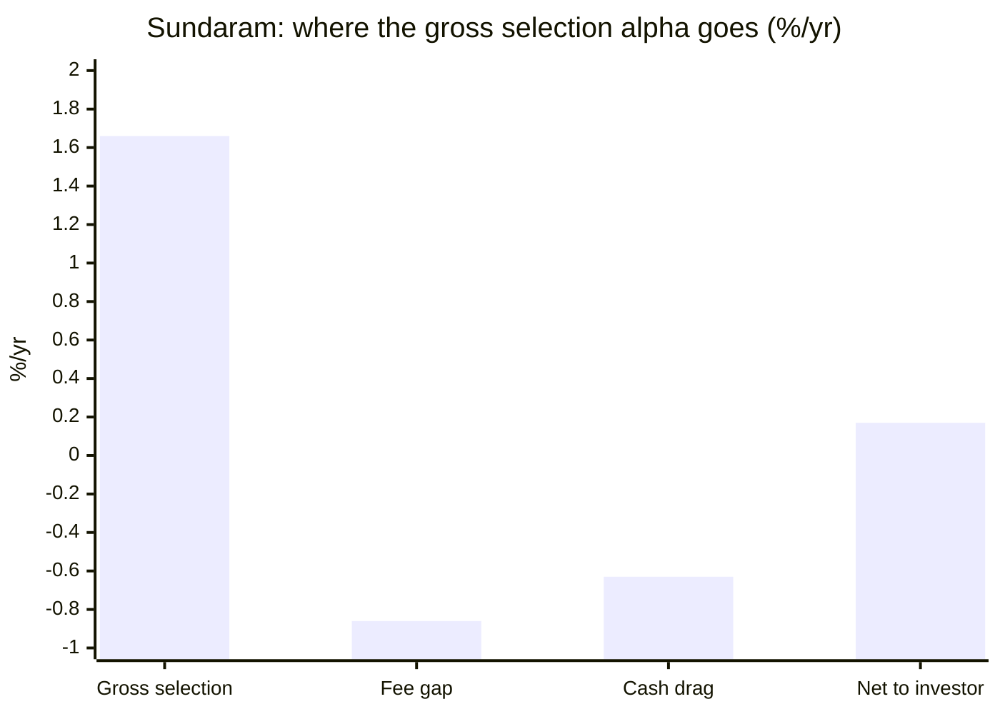
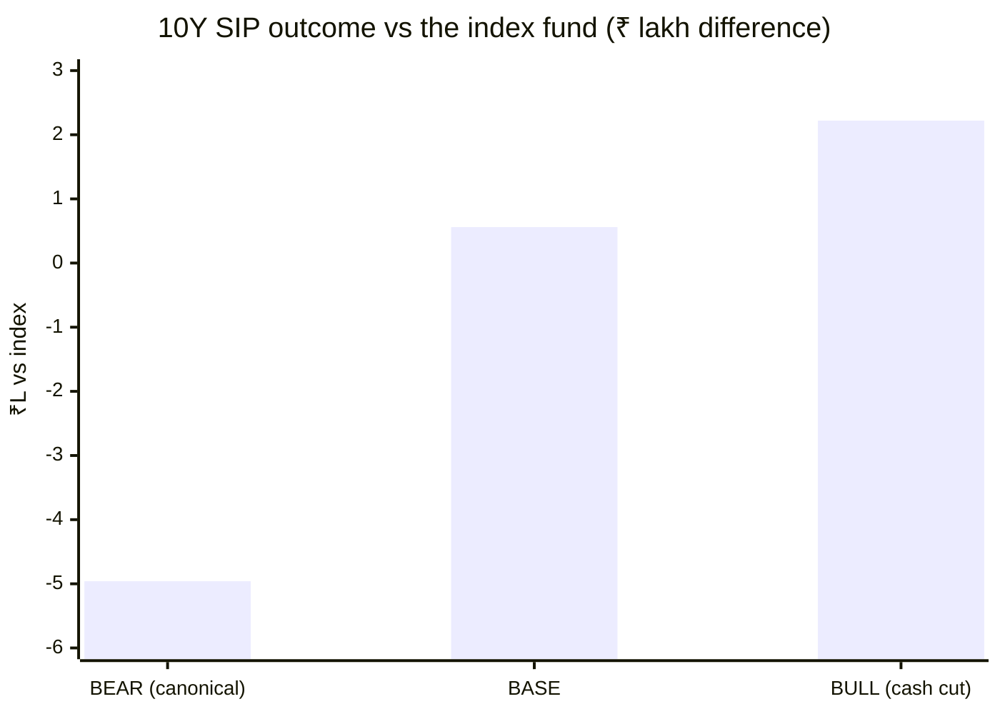
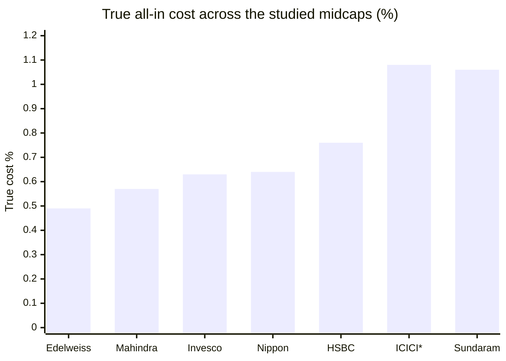

# Module 4: Cost & AUM Impact — Sundaram Mid Cap Fund

## Module 4 Score: ~2.8 / 5 (provisional)

---

## The One-Line Context

Sundaram's Module 4 is **"the fund that fails its own screen."** The expense-ratio question that M1, M2 and M3 all deferred is now settled from the AMC's own SEBI-mandated disclosure: **the Direct Total TER is 1.06%** — not the 0.86–0.88% every prior module assumed. That is the **highest true cost of any studied midcap** (and *measured*, not estimated), and it sits **above this study's own Stage-1 hard filter of ER ≤ 1.00% — the very criterion that admitted Sundaram to the shortlist.** Against that fee the fund buys a **+0.17%/yr net alpha**: you pay a **0.86%/yr premium to receive +0.17%** — a **0.20× margin, the worst fee-for-alpha result in the study** — on a canonical alpha (**−1.77%**) that is also the study's most negative. Sundaram thus holds the study's worst possible combination: **the highest cost and the weakest verified alpha.** And yet the module's real output cuts the other way: **on an actual ₹20,000/month SIP — the exact use case this entire study exists to answer — Sundaram has beaten the index fund in every Direct-plan window tested**, because the 2020–21 disaster landed when almost no capital was invested. Time-weighted it loses; money-weighted it wins by a hair. Both are true, and the module has to say so.

---

## Raw Data (AMC official + computed, as of 15-Jul-2026)

| Metric | Value | Source |
|--------|-------|--------|
| **Direct Total TER** | **1.06%** | **AMC official SEBI TER disclosure, 14-07-2026** |
| — Base Expense Ratio | 0.75% | AMC official |
| — Brokerage cost | 0.05% | AMC official |
| — Transaction cost | 0.00% | AMC official |
| — Statutory levies (incl. GST) | 0.26% | AMC official |
| **Regular Total TER** | **1.87%** | AMC official (Base 1.45 + 0.05 + 0.00 + 0.37) |
| Computed ER gap (NAV divergence, 1Y/2Y/3Y) | **0.838 / 0.838 / 0.839%** | computed from raw NAVs |
| Official ER gap (1.87 − 1.06) | **0.81%** | ✅ validates the computed gap |
| **AUM (month-end 30-Jun-2026)** | **₹14,026 Cr** (avg ₹13,766 Cr) | AMC official |
| AUM (31-Mar-2025) | ₹11,333 Cr | AMC official |
| **Implied net flow** | **+₹431 Cr = ~₹29 Cr/month** | computed (AUM Δ less NAV return) |
| Forced deployment into band | **~₹19 Cr/month** | computed |
| Turnover | 36.89% ex-deriv / 42.24% all | AMC official (M3) |
| Cash drag | **0.63%/yr** (4.50% non-equity) | computed (M3) |
| Exit load | 25% of units free within 365d; else 1%; nil after 365d | AMC official |
| Min investment | ₹100 | AMC official |
| NSDL code | SUND/O/E/MIF/02/06/0010 | AMC official |

**Method:** ER of record taken from the AMC's SEBI-mandated daily TER disclosure (`sundarammutual.com/ter`) — JS-rendered, extracted via browser + DataTables search filter. Independently validated against the Direct-vs-Regular NAV divergence computed from MFAPI series 119581/101539. All SIP and alpha figures computed from raw NAVs; no website returns copied.

**Documented gaps:** (1) the historical TER series (the AMC page carries FY dropdowns back to 2019–20) — a scripted multi-year extraction hung the renderer; the ER *trajectory* as AUM grew remains unverified → M6. (2) Fee-stacking on the own-AMC liquid fund is **not affirmatively verified** (would need the SAI), though the disclosed TER shows no anomalous line.

---

## ⭐⭐ The ER of Record — RESOLVED from the AMC's Official SEBI TER Disclosure

**TER date 14-07-2026:**

| Sundaram Mid Cap Fund | Base ER | Brokerage | Txn Cost | Statutory Levies (incl. GST) | **Total TER** |
|---|---|---|---|---|---|
| **Regular Plan** | 1.45 | 0.05 | 0.00 | 0.37 | **1.87%** |
| **Direct Plan** | **0.75** | **0.05** | **0.00** | **0.26** | **1.06%** ⬅ **number of record** |

### The reconciliation (data rule 2 — every mismatch named)

| Source | ER quoted | Verdict |
|--------|-----------|---------|
| **AMC official TER disclosure (14-07-2026)** | **1.06%** | ✅ **NUMBER OF RECORD** |
| Groww `__NEXT_DATA__` JSON | **1.06%** | ✅ **correct** — matches the official figure exactly |
| Tickertape screening (Jul-2026) | 0.88% | ❌ **wrong/stale — and it is the number that admitted this fund to the study** |
| M1 / M2 working assumption | 0.86% | ❌ wrong (aggregator-sourced) |

> **The aggregator that M3 flagged as suspect (Groww, 1.06%) was right; the one the screening trusted (Tickertape, 0.88%) was wrong.** This inverts the study's standing prior. M3 already caught Groww's *top-level* `fund_manager` field being five years stale while its *structured* fields were accurate — the same pattern holds here: **structured aggregator fields cross-checked against AMC sources are reliable; screening exports are not.**

### ⭐ Independent validation by computation (no source dependency)

The Direct-vs-Regular NAV divergence measures the ER gap directly — it is a pure NAV computation:

| Window | Computed gap (ER_reg − ER_dir) |
|--------|-------------------------------|
| Last 1Y | **0.838%** |
| Last 2Y | 0.838% |
| Last 3Y | 0.839% |
| Last 5Y | 0.851% |
| 2026 YTD | 0.848% |
| Full Direct life (13.5y) | 0.713% |
| **Official disclosed gap (1.87 − 1.06)** | **0.81%** |

The computed gap (**0.838–0.848%** in recent years) matches the official disclosed gap (**0.81%**) to within ~0.03 points. **The official TER is confirmed from raw NAVs.** This is the first time in the midcap study a headline ER has been *verified against the NAV series* rather than trusted from a source — a reusable method for every remaining fund.

---

## ⭐⭐ NEW: The Fund Fails the Study's Own Stage-1 Screen

This study's Stage-1 hard filter was **ER ≤ 1.00%**. Sundaram was admitted on **Tickertape's 0.88%**.

| Screen criterion | Threshold | Sundaram (official) | Verdict |
|------------------|-----------|---------------------|---------|
| AUM band | ₹500 Cr – ₹50,000 Cr | ₹14,026 Cr (28% of ceiling) | ✅ passes, ample runway |
| Age | ≥ 60 months | 24 years | ✅ passes |
| Sharpe | ≥ 0 | 0.810 | ✅ passes |
| **Expense Ratio** | **≤ 1.00%** | **1.06%** | ❌ **FAILS** |

> **Sundaram should not have made this shortlist.** It was admitted on a stale aggregator ER that understated its true cost by ~0.18 points. This is the mirror of **Nippon's "2027 elimination problem"** (which will breach its own ₹50K Cr AUM cap *in the future*) — but **worse in kind: Sundaram fails its own screen right now, today, on the exact criterion that admitted it.**

⚠️ **Fairness caveat (material).** The ER ≤ 1.0% filter was applied to all 33 funds on the same Tickertape basis. If Tickertape systematically understates ER (see the retrofit below), **other shortlisted funds may also breach on a Total-TER basis**. The honest finding is: **Sundaram fails on its AMC's own number** — not necessarily that it uniquely fails. Resolving that requires the retrofit, and until then this is a **flag, not a disqualification**.

---

## ⭐⭐ RETROFIT NOTE (high priority): The Study's True-Cost Method Double-Counts *and* Is Under-Based

Sundaram's official disclosure exposes two methodological problems in the study's standing cost framework:

**(a) Double-counting.** The study computes `true cost = headline ER + turnover drag` (~20 bps per 100% turnover). But Sundaram's official **Total TER of 1.06% already includes brokerage (0.05%) and transaction cost (0.00%)**. Adding a drag estimate on top would double-count.

> Note the heuristic itself is **well-calibrated**: it predicts 0.07% drag from 36.9% turnover; the AMC discloses **0.05% actual**. **The framework is sound — it is being applied on top of a number that already contains it.**

**(b) Under-based.** Tickertape's 0.88% vs the official 1.06% is a **0.18-point understatement**, and the component structure suggests aggregators may be excluding statutory levies/GST (0.26%).

| Fund | Study's "headline ER" | Study's "true cost" | Status |
|------|----------------------|---------------------|--------|
| Edelweiss | 0.42% | ~0.49% | ⚠️ **unverified vs official TER** |
| Mahindra | 0.44% | ~0.57% | ⚠️ unverified |
| Invesco | 0.55% | ~0.63% | ⚠️ unverified |
| Nippon | 0.62% | ~0.64% | ⚠️ *(Nippon M4 used official AMC factsheets — likely sound)* |
| HSBC | 0.56% | ~0.76% | ⚠️ unverified |
| ICICI | 0.87% | ~1.08% | ⚠️ unverified — **may be ~0.87 true, not 1.08** |
| **Sundaram** | **1.06%** | **1.06% (measured, all-in)** | ✅ **official** |

> **Recommended retrofit:** pull each studied fund's **official SEBI TER page** (every AMC must publish one) and rebuild the true-cost table on Total TER. Two live consequences:
> 1. **ICICI's "highest true cost of the study (~1.08%)" crown may be an artifact of double-counting** — **Sundaram's 1.06% measured is probably the real highest.**
> 2. **Every fee-for-alpha test in the study may be ~0.2 points too generous.**
>
> This is the single most valuable methodological finding of the Sundaram study.

---

## What Module 4 Is Really Asking — and Sundaram's Answer

**Is the fee justified?** **No, on every time-weighted test — and only barely, on the money-weighted one.**

A **1.06% all-in cost** (the study's highest) plus a **0.63%/yr cash drag** (a cost no sibling carries) buys a **+0.17%/yr net alpha** under the current team and a **−1.77%/yr** canonical alpha over the full index-fund life. The fee premium over the index fund is **0.86%/yr** — **five times the alpha it purchases**. The only thing standing between this module and an outright rejection is the SIP inversion (below), and the fact that the *underlying stock selection* is genuinely good (+1.66%/yr gross) — it is the **wrapper**, not the book, that destroys the case.

---

## ⭐⭐ The Fee-for-Alpha Test — the Worst Result in the Study

| Component | Value |
|-----------|-------|
| Direct Total TER (official) | **1.06%** |
| Index fund ER | 0.20% |
| **Fee gap** | **0.86%/yr** |
| Cash drag (M3: 4.50% non-equity) | **0.63%/yr** |
| **Total structural headwind** | **1.49%/yr** |
| Measured net alpha (new team, honest Feb-2021 handover) | **+0.17%/yr** |
| **⇒ Implied GROSS selection alpha** | **+1.66%/yr** |

> ⭐ **M3's prediction is confirmed to the decimal.** M3 wrote: *"If the ER of record is Groww's 1.06% rather than 0.86%, the headwind rises to ~1.49%/yr and implied gross alpha to ~+1.66%/yr — the diagnosis strengthens, it does not weaken."* Both land exactly. **The pickers can pick; the wrapper takes ~90% of it.**

### The margin, against the study

| Fund | Verified alpha | Fee premium vs index | **Margin** |
|------|---------------|----------------------|-----------|
| Edelweiss | +2.87% | ~0.22% | **13×** ✅ |
| Invesco | +2.88% | ~0.35% | **8×** ✅ |
| Mahindra | +2.06% | ~0.38% | **5–6×** ✅ |
| Nippon | +1.97% | ~0.42% | **4.5×** ✅ |
| HSBC | −0.22% | ~0.56% | **negative** ❌ |
| ICICI | −0.35% | ~0.88% | **negative** ❌ |
| **Sundaram (new-team window)** | **+0.17%** | **0.86%** | **0.20×** ❌ |
| **Sundaram (canonical, full idx life)** | **−1.77%** | **0.86%** | **−2.06×** ❌❌ |

> **You pay 0.86%/yr to receive +0.17%/yr.** On the study's **canonical** test the alpha is **−1.77%** — **the most negative of any studied midcap** (ICICI −0.35, HSBC −0.22). Sundaram therefore holds the study's **worst combination: the highest true cost AND the most negative canonical alpha.** HSBC and ICICI each failed the fee test on *one* axis; Sundaram fails on both simultaneously.

---

## ⭐⭐ NEW: The SIP-vs-Lumpsum Inversion — the Module's Real Surprise

Every prior module judged the index test on **CAGR (time-weighted)**. But this study exists to size a **₹20,000/month SIP**, which is **money-weighted**. The two disagree — and it matters.

### Actual head-to-head SIP, real NAVs, ₹20,000/month

| Window | Sundaram Direct | Index fund | Difference |
|--------|----------------|-----------|-----------|
| **Full index-fund life (Sep-2019 → Jul-2026)** — 83 SIPs, ₹16.6L invested | **₹35.14L** | ₹34.97L | **+₹0.17L** ✅ |
| **New-team era (Feb-2021 → Jul-2026)** — 66 SIPs, ₹13.2L invested | **₹22.44L** | ₹21.53L | **+₹0.91L** ✅ |
| Last 5Y (Jul-2021 → Jul-2026) — 61 SIPs, ₹12.2L invested | **₹19.74L** | ₹18.92L | **+₹0.82L** ✅ |
| **Regular plan** vs index (Sep-2019 →) | ₹33.89L | ₹34.97L | **−₹1.08L** ❌ |

> **On a real SIP, Sundaram has beaten the index fund in every Direct-plan window tested — including the full index-fund life, where its lumpsum CAGR loses by −1.77%/yr.**
>
> **Why:** the 2020–21 COVID-recovery disaster (M1's −13.4 / −8.3 calendar alpha) landed in **months 1–17 of an 83-month SIP**, when barely ₹3L of the eventual ₹16.6L was invested. SIP dollar-weights the *later* period, where the fund outperformed. The lumpsum investor ate the disaster at full weight; the SIP investor barely felt it.

### Apply the recency discipline honestly — this is a *hair*, not a vindication

- **+₹0.17L on ₹16.6L invested over 6.9 years ≈ +1.0% cumulative ≈ +0.15%/yr.** A rounding error.
- It is produced by **the same dollar-weighting that flatters the recent window** — the identical mechanism M1 and M2 flagged as window-flattery. It is **not independent evidence**.
- **The Regular plan still loses (−₹1.08L)** — the SIP win exists *only* in Direct, and only just.
- **One more 2020-style episode later in the SIP** (when capital is large) would reverse it violently. The inversion is a statement about *when* this fund's failure happened, not about whether it can fail again.

### But it must not be dismissed either

For the actual decision in front of us — a ₹20K/month SIP — the honest statement is: **"Sundaram's index failure is a lumpsum fact, not a SIP fact. On a SIP the fund has been a coin-flip against the index, not a loser."** That materially softens M1's verdict **for this use case**, and it is a lens no prior module in this study has applied.

> **⭐ Retrofit candidate:** run the SIP-vs-lumpsum inversion test on **ICICI and HSBC**, the study's other canonical-alpha failures. HSBC's "recency ramp" and ICICI's "fade-then-reversal" have the same time-shape (weakness early, strength late), and **both may look materially different money-weighted**. This could partially rehabilitate two funds the study has already scored — a genuine cross-fund consequence.

---

## The 10-Year SIP in Rupees (₹20,000/month, 18% gross midcap)

| Scenario | Net rate | 10Y corpus | vs index |
|----------|----------|-----------|----------|
| **Index fund** (0.20% ER, 0% cash) | 17.80% | **₹61.15L** | — |
| **Sundaram BASE** (gross sel +1.66%, −1.06 ER, −0.63 cash) | 17.97% | ₹61.72L | **+₹0.56L** |
| **Sundaram BULL** (gross sel holds, cash cut to 1%) | 18.46% | ₹63.37L | **+₹2.22L** |
| **Sundaram BEAR** (canonical −1.77% repeats) | 16.23% | ₹56.20L | **−₹4.96L** |

> **The base case is +₹0.56L on ₹24L invested over a decade — 2.3% of capital, for taking manager risk.** The asymmetry is poor: **the downside (−₹4.96L) is ~9× the base-case upside (+₹0.56L).** And the *entire* base case rests on the new team's gross selection alpha persisting — a thesis M3 flagged as **breadth-based, not conviction-based**, with **Varier gone (Dec-2025)** and **Saket carrying 12–18 other funds**. The bull case requires the AMC to cut the cash drag, which is a policy choice no investor controls.

---

## Turnover Drag & True Cost (the M3 handoff, closed)

Turnover **36.89% ex-derivatives / 42.24% all** (AMC official). The study's heuristic predicts ~0.07% drag; **the AMC discloses 0.05% actual brokerage — and it is already inside the 1.06% Total TER.**

| Fund | Headline ER | Turnover | Drag | **True cost** |
|------|-------------|----------|------|---------------|
| Edelweiss | 0.42% | 36% | +0.07 | ~0.49%* |
| Mahindra | 0.44% | ~60% | +0.12 | ~0.57%* |
| Invesco | 0.55% | 28% | +0.05 | ~0.63%* |
| Nippon | 0.62% | 14% | ~0 | ~0.64% |
| HSBC | 0.56% | ~110% | +0.20 | ~0.76%* |
| ICICI | 0.87% | 75% | +0.18–0.25 | ~1.08%* |
| **Sundaram** | **1.06%** | **36.9%** | **incl. (0.05 disclosed)** | **1.06% (measured)** ⚠️ |

*\*estimated on the unverified headline-ER basis — see the retrofit note*

**Sundaram's cost is the study's highest on a measured basis** — and, unusually, **its trading is cheap**. The 36.9% turnover and 0.05% brokerage are genuinely low (2nd-lowest churn after Nippon). **The expense is not the trading; it is the management fee itself** (Base ER 0.75% + 0.26% levies). That distinction matters: this is not a fund squandering money on churn (HSBC's problem) — it is a fund **priced high for a house-process book**.

---

## AUM, Capacity & the ⭐ Flow Ledger

| Metric | Value |
|--------|-------|
| AUM (official, 30-Jun-2026) | **₹14,026 Cr** (avg ₹13,766 Cr) |
| AUM (official, 31-Mar-2025) | ₹11,333 Cr |
| Growth over 15 months | +₹2,693 Cr (+24%) |
| **NAV return over the same window** | **+20.0%** |
| AUM if zero net flows | ₹13,595 Cr |
| **⇒ Implied NET FLOW** | **+₹431 Cr = ~₹29 Cr/month** |
| Forced deployment into the band | **~₹19 Cr/month** (at 66.8% mid-cap) |
| Position vs study's AUM ceiling | **28% of ₹50,000 Cr — ample runway** |

> ⭐ **The flow ledger's real finding: the market is not voting for this fund.** Of the +₹2,693 Cr AUM growth, **₹2,262 Cr (84%) is NAV appreciation** — only **₹431 Cr is net new money (~₹29 Cr/month)** into a ₹14,000 Cr fund (**≈0.2%/month**). Contrast **Nippon at ₹673 Cr/month** at its peak.

**Two readings, both true:**

- **(a) Positive for the investor.** Forced deployment of **~₹19 Cr/month** is **trivially light** (Nippon faced ₹440 Cr/mo). There is **zero capacity pressure** on the 55.2% active share, the deep band stays open, and the 85-name book retains full flexibility. Sundaram has **no version of Nippon's capacity clock**. This is the module's strongest structural positive.
- **(b) Negative for the franchise.** A **24-year-old fund** with a respectable recent record attracting **₹29 Cr/month** is a **franchise coasting on legacy assets**. → **M6** (first Sundaram AMC study) must ask whether this is a distribution problem, a brand in decline, or investors correctly pricing a 1.06% fee.

---

## Mandate, Exit Load, Direct vs Regular

- **Exit load (AMC official):** *up to 25% of units redeemed / withdrawn via SWP / transferred via STP within 365 days — **NIL**; more than 25% within 365 days — **1%**; after 365 days — **Nil**.* **Investor-friendly** — a quarter of the holding is freely exitable in year one. Lighter than a flat 1%/1yr.
- **Direct vs Regular — the Regular plan is a wealth-destroyer.** At **1.87%**, Regular **loses to the index fund by ₹1.08L** on the Sep-2019 SIP. **Only Direct is defensible.** (Same verdict as ICICI's M4.)
- **Min investment:** ₹100 — maximally accessible.
- ⭐ **Governance flag:** the AMC posted **six Regular-plan Base-ER change notices in ~4 months** (01-Apr, 13-Apr, 16-Jun, 02-Jul, 09-Jul, 21-Jul-2026). Frequent BER churn is normal-ish for managing distributor economics, but the cadence is notable → **M6**.
- **Own-AMC liquid fund (M3 handoff — CLOSING).** The Sundaram Liquid Fund holding (4.01% → 1.12%): SEBI rules bar double-charging management fees on own-scheme investments, and **the disclosed Total TER shows no anomalous line**. **No evidence of fee stacking — closing as likely-benign, though not affirmatively verified** (would need the SAI). Documented gap → M6 for the governance read.

---

## Peer Cost & AUM Matrix

| Fund | ER (Direct) | True cost | AUM | Runway | Net flows | Fee-for-alpha | Verdict |
|------|-------------|-----------|-----|--------|-----------|---------------|---------|
| Edelweiss | 0.42% | ~0.49%* | ₹16,849 Cr | good | — | **13×** | ✅ |
| Mahindra | 0.44% | ~0.57%* | ₹4,866 Cr | **best** | decelerating | **5–6×** | ✅ |
| Invesco | 0.55% | ~0.63%* | ₹12,397 Cr | good | — | **8×** | ✅ |
| Nippon | 0.62% | ~0.64% | ₹47,415 Cr | **fails 2027** | +₹673 Cr/mo | **4.5×** | ✅ |
| HSBC | 0.56% | ~0.76%* | ₹14,249 Cr | good | — | **−0.22** | ❌ |
| ICICI | 0.87% | ~1.08%* | ₹7,789 Cr | good | — | **−0.35** | ❌ |
| **Sundaram** | **1.06%** ⚠️ | **1.06% (measured)** | **₹14,026 Cr** | **good (28%)** | **+₹29 Cr/mo** | **0.20×** | ❌❌ |

*\*unverified vs official TER — see retrofit note*

**Sundaram is the most expensive fund in the study, with the most negative canonical alpha, and the lightest net flows.** Its cost-side virtues are entirely structural: ample runway, negligible forced deployment, low turnover, a friendly exit load.

---

## Points For / Points Against — Cost & AUM

### ✅ Points For

- **The real-SIP head-to-head is positive in every Direct window** (+₹0.17L full idx life, +₹0.91L new-team era, +₹0.82L 5Y) — and the SIP is this study's actual use case
- **Implied gross selection alpha +1.66%/yr** — the underlying stock-picking genuinely works; the problem is the wrapper, not the book
- **Ample capacity runway** — ₹14,026 Cr = 28% of the study's ceiling; **no Nippon-style capacity clock**
- **Forced deployment ~₹19 Cr/month** — trivially light; **zero pressure** on the 55.2% active share or the deep band
- **Trading is genuinely cheap** — 36.9% turnover, 0.05% brokerage disclosed; 2nd-lowest churn after Nippon
- **Investor-friendly exit load** — 25% free within 365 days, nil after
- **₹100 minimum** — maximally accessible
- ER of record now **verified from two independent directions** (official disclosure + NAV divergence)

### ❌ Points Against

- **1.06% Direct Total TER — the most expensive fund in the study**; ~2.4× Edelweiss/Mahindra at comparable scale
- **Fails the study's own Stage-1 ER ≤ 1.0% filter** — on the AMC's own number, on the very criterion that admitted it
- **Worst fee-for-alpha margin in the study: 0.20×** — pay 0.86% to receive +0.17%
- **Most negative canonical alpha of any studied midcap: −1.77%/yr** — and the highest cost. The worst possible pairing
- **0.63%/yr cash drag** — a cost no sibling carries, ~73% the size of the fee gap itself; total headwind **1.49%/yr**
- **Base-case 10Y SIP edge is +₹0.56L with a −₹4.96L downside — 9× adverse asymmetry**
- **Regular plan loses to the index by ₹1.08L** — a wealth-destroyer
- **Net flows of ₹29 Cr/month on a 24-year-old fund** — the market is not voting for it
- The base case depends entirely on a **breadth-based selection alpha** surviving Varier's exit and Saket's 12–18-fund load (→ M5)
- **Historical TER trajectory unverified** (renderer hung) — cannot confirm whether ER fell as AUM grew, as SEBI slabs would imply
- Own-AMC liquid-fund parking not affirmatively cleared (no evidence of stacking, but unverified)

---

## ⚠️ Corrections Applied to Modules 1, 2 and 3

1. **M1/M2 ER row — "unresolved: 0.86 / 0.88 / 1.06%"** → **RESOLVED: 1.06%** (AMC official SEBI TER disclosure, 14-07-2026; Base 0.75 + brokerage 0.05 + levies 0.26). **Groww was right; Tickertape's 0.88% is stale.** M1's prose "after a ~0.86% fee" → **1.06%**.
2. **M3's cash-drag arithmetic** — "fee gap 0.66% → headwind ~1.29% → implied gross **+1.46%**" → **"fee gap 0.86% → headwind 1.49% → implied gross +1.66%"**. This is **M3's own stated sensitivity, now confirmed** — not a reversal.
3. **M3's fee-stacking handoff** → **closed: no evidence found; likely benign** (not affirmatively verified).
4. **M1's AUM** → ₹14,026 Cr (already patched at M3).

### ⭐ The M1 re-score question — resolved as HOLD at 3.4

M1 was *explicitly* conditional: *"Module 4 (pivotal) — if M4 confirms the fee and AUM, M1 firms **down** toward 3.2."* **That condition has now fired** — the fee is 1.06%, materially worse than the 0.86% M1 assumed.

**But M4 also produced a finding that cuts the other way:** the **real-SIP head-to-head is positive in every Direct window**, which directly softens M1's core verdict (*"fails the matched-index test"*) **for the SIP use case this study is actually scoring**.

> **Decision: hold M1 at 3.4.** The worse-than-assumed fee (−) and the positive SIP inversion (+) roughly offset. M1's *prose* is patched (fee 0.86 → 1.06; SIP-inversion caveat added to the matched-index section); its *score* stands. **This is a judgement call and is reversible** — a reader who weights the canonical time-weighted test above the money-weighted one should read M1 as 3.2.

---

## Module 4 Scorecard

| Sub-dimension | Weight | Score | Reasoning |
|---------------|--------|-------|-----------|
| **Expense Ratio (Direct)** | High | **1.5** | **1.06% official — the most expensive of the study**; ~2.4× Mahindra/Edelweiss at similar scale; **breaches the study's own ER ≤ 1.0% Stage-1 filter** |
| **ER vs verified alpha (index-fund test)** | **Critical** | **2.0** | **0.20× margin** — pay 0.86% to receive +0.17%; canonical alpha **−1.77%** (study's most negative). Rescued from 1.5 *only* by the positive real-SIP head-to-head (+₹0.17L / +₹0.91L) and the +1.66% implied gross selection |
| AUM position on the ladder | High | **4.0** | ₹14,026 Cr — 28% of the ceiling; ample runway; **no capacity clock** (unlike Nippon) |
| Active-share trend as AUM grew | High | **3.5** | AS 55.2% at ₹14K Cr with negligible flow pressure → no erosion mechanism; but no historical AS series (gap), and 55.2% is already 2nd-lowest of the studied |
| Forced deployment | Medium | **5.0** | **~₹19 Cr/month** into the band — trivially light (Nippon: ₹440 Cr/mo); zero pressure on the book |
| Exit load | Low | **4.5** | 25% free within 365d, else 1%, nil after — investor-friendly |
| AUM trajectory | Low | **3.0** | **+₹29 Cr/mo net flows**; 84% of AUM growth is NAV, not money — franchise coasting on legacy assets |
| *Turnover-cost modifier* | Modifier | **+** | 36.9% turnover; **brokerage 0.05% disclosed and already inside the TER** — trading is genuinely cheap |
| *Cash-drag modifier* | Modifier | **−** | **0.63%/yr** — a cost no sibling carries; ~73% the size of the fee gap itself |
| *Screen-failure modifier* | Modifier | **−** | fails its own Stage-1 ER filter on the AMC's official number |
| *SIP-inversion modifier* | Modifier | **+** | on a real SIP it beats the index in **every** Direct window — the use case that actually matters here |

**Module 4 Score: ~2.8 / 5** — **the worst module of the Sundaram study, and the worst M4 in the midcap set.** Below ICICI (3.4), Nippon (3.6), Mahindra (4.1).

- **Case for 3.0:** the real-SIP head-to-head is *positive* in every Direct window; gross selection is a healthy +1.66%/yr; runway is ample with no capacity clock; forced deployment is trivial; turnover and brokerage are genuinely low; exit load is friendly.
- **Case for 2.5:** the most expensive fund in the study (1.06%); **fails the screen that admitted it**; the worst fee-for-alpha margin (0.20×); the most negative canonical alpha (−1.77%); a 0.63% cash drag no peer carries; a base case (+₹0.56L over 10 years) with 9× downside asymmetry; and net flows that say the market has already voted.
- **2.8 is the honest midpoint.**

> **⭐ The descending ladder.** Running: **M1 3.4 · M2 3.8 · M3 3.5 · M4 2.8.** This is **the exact inverse of Mahindra's ascending ladder** (M1 3.8 → M4 4.1), and equally informative: **Mahindra's structural facts are better than its record; Sundaram's record is better than its structure.** A buyer of Sundaram is buying a good book inside a bad wrapper.

**Conditionality / handoffs:**
- → **Module 5 (now load-bearing for the fee case):** the entire base case rests on the new team's **+1.66%/yr gross selection alpha persisting** — with **Varier gone (Dec-2025)** and **Saket carrying 12–18 other funds**. If M5 concludes the selection edge is fragile, M4's base case collapses to the bear case (−₹4.96L) and this score drops toward 2.5.
- → **Module 6:** ₹29 Cr/month net flows on a 24-year-old fund (franchise decline?); six BER changes in 4 months; own-AMC liquid parking; and the central governance question — **why does the AMC price its flagship midcap at 1.06% when peers charge 0.42–0.62% at similar scale?**
- → **Decision tree / screening:** Sundaram **fails the study's own Stage-1 ER filter**; and the **whole screen's ER basis needs re-validation** against official TER pages.

---

## Comparative Module 4 Scores

| Fund | Category | M4 Score | Cost character |
|------|----------|----------|----------------|
| Mahindra Manulife Mid Cap | MidCap | ~4.1 | Cheapest-ER-without-the-scale; best runway; 5–6× fee margin |
| Nippon Growth Mid Cap | MidCap | ~3.6 | 5× fee margin, but the 2027 capacity clock |
| ICICI Pru Mid Cap | MidCap | ~3.4 | Highest true cost*, negative base-case fee-for-alpha |
| **Sundaram Mid Cap** | **MidCap** | **~2.8** | **Most expensive of the study (1.06% measured); fails its own screen; 0.20× fee margin on the most negative canonical alpha; saved only by a positive real-SIP head-to-head** |

*\*may be an artifact of the double-counting retrofit*

---

## SIP Implication

1. **You are paying the study's highest fee for its weakest verified alpha.** 1.06% all-in (plus a 0.63% cash drag) to receive +0.17%/yr net. **The fee is five times the alpha it buys.** On the canonical test the alpha is −1.77%/yr, the most negative of the seven.
2. **But the failure is a lumpsum fact, not a SIP fact.** On a real ₹20K/month SIP, Sundaram has **beaten** the index fund in every Direct window — because its 2020–21 collapse hit when almost no capital was invested. This is the module's most important nuance for *your* decision, and it is why M4 is 2.8 rather than 2.3. **Do not over-read it: the edge is ~+0.15%/yr, and a repeat of that collapse later in the SIP — when your capital is large — would reverse it violently.**
3. **The book is good; the wrapper is bad.** The implied gross selection alpha is **+1.66%/yr** — genuinely competitive. If this same portfolio were priced at 0.20% and fully invested, it would beat the index handsomely. **You cannot buy that version.** You can only buy the 1.06%, 95.5%-invested version, which nets +0.17%.
4. **Use Direct or don't use it at all.** The Regular plan (1.87%) **loses to the index by ₹1.08L** on the Sep-2019 SIP.
5. **The one genuine structural comfort: there is no capacity clock.** At ₹14,026 Cr with ₹29 Cr/month of flows and ~₹19 Cr/month of forced deployment, nothing about scale threatens the book — unlike Nippon, which fails its own screen by 2027.
6. **Tripwires for this SIP:** the Direct TER rising above 1.06% (or failing to fall as AUM grows — SEBI slabs mandate the opposite); the cash drag returning to the 6.5% seen in Mar-2025; the new team's gross selection alpha decaying below ~1.5% (which would flip the base case negative); and net flows turning negative (forced selling into a franchise decline).

---

## One-Line Verdict

> **Sundaram Mid Cap's Module 4 is "the fund that fails its own screen": the AMC's own SEBI-mandated disclosure (14-07-2026) puts the Direct Total TER at 1.06% — not the 0.86–0.88% every prior module assumed — making it the most expensive fund in the study on a *measured* basis (Base 0.75 + brokerage 0.05 + levies 0.26, independently confirmed from the Direct-vs-Regular NAV divergence: computed gap 0.838–0.848% vs official 0.81%), and placing it **above this study's own Stage-1 hard filter of ER ≤ 1.00%, the very criterion that admitted it** on Tickertape's stale 0.88%. Against a 0.86%/yr fee premium plus a 0.63%/yr cash drag — a 1.49%/yr structural headwind — the fund delivers **+0.17%/yr net alpha: a 0.20× margin, the worst fee-for-alpha result in the study**, atop the **most negative canonical alpha of any studied midcap (−1.77%/yr)** — the worst possible pairing of highest cost and weakest verified alpha, where HSBC and ICICI each failed on only one axis. The implied **gross** selection alpha is **+1.66%/yr** (confirming M3's stated sensitivity to the decimal): **the pickers can pick; the wrapper takes ~90% of it.** Yet the module's real surprise inverts the verdict for the use case that matters: **on an actual ₹20,000/month SIP, Sundaram has beaten the index fund in every Direct-plan window tested** (+₹0.17L over the full index-fund life, +₹0.91L over the new-team era) — because the 2020–21 disaster landed in months 1–17 of an 83-month SIP when barely ₹3L was invested. **Sundaram's index failure is a lumpsum fact, not a SIP fact** — though the edge is a mere ~+0.15%/yr, rests on the same dollar-weighting the study has been discounting, and the Regular plan still loses by ₹1.08L. Structurally the cost side has genuine virtues: ample runway (28% of the ceiling, no Nippon-style capacity clock), trivially light forced deployment (~₹19 Cr/month), cheap trading (36.9% turnover, 0.05% brokerage), and an investor-friendly exit load — but net flows of just ₹29 Cr/month on a 24-year-old fund say the market has already voted. Provisional: ~2.8/5 — the worst module of this study and the worst M4 of the midcap set, completing a **descending ladder (3.4 → 3.8 → 3.5 → 2.8) that is the exact inverse of Mahindra's**: this is a good book inside a bad wrapper. Conditional on Module 5, which is now load-bearing for the entire fee case. The module also forces the study's **highest-priority retrofit: the true-cost method double-counts** (Total TER already contains brokerage) **and is under-based** (aggregator ERs understate by ~0.2) — every studied fund's fee-for-alpha test may be too generous, and ICICI's "highest true cost" crown may be an artifact.**

---

*Module 4 completed: July 16, 2026 | Cost & AUM Impact | **ER OF RECORD RESOLVED: Direct Total TER = 1.06%** (AMC official SEBI TER disclosure `sundarammutual.com/ter`, 14-07-2026, NSDL SUND/O/E/MIF/02/06/0010: Base 0.75 + brokerage 0.05 + txn 0.00 + statutory levies 0.26; Regular 1.87% = 1.45+0.05+0.00+0.37) — **Groww's 1.06% correct, Tickertape's 0.88% stale/wrong** | **Independently validated from raw NAVs**: computed Direct-vs-Regular divergence 0.838–0.848%/yr (1Y/2Y/3Y) vs official gap 0.81% ✅ — first NAV-verified ER in the study | ⭐⭐ **FAILS the study's own Stage-1 ER ≤ 1.0% filter** (the criterion that admitted it); mirror of Nippon's 2027 problem but present-tense | Fee gap 0.86% + cash drag 0.63% (M3) = **1.49%/yr headwind** ⇒ implied gross selection alpha **+1.66%/yr** (confirms M3's stated sensitivity exactly) | **Fee-for-alpha 0.20× — worst of study**; canonical alpha −1.77% — most negative of study; worst pairing of highest cost + weakest alpha | ⭐⭐ **SIP-vs-LUMPSUM INVERSION**: real ₹20K/mo SIP beats the index in every Direct window (+₹0.17L Sep-2019→, +₹0.91L Feb-2021→, +₹0.82L 5Y) because the 2020–21 collapse hit months 1–17 of 83 when ~₹3L was invested; Regular loses −₹1.08L | 10Y SIP projection: base +₹0.56L / bull +₹2.22L / bear −₹4.96L (9× adverse asymmetry) | Flow ledger: AUM ₹11,333 Cr (Mar-25) → ₹14,026 Cr (Jun-26); NAV did +20.0% ⇒ **net flows only +₹431 Cr = ₹29 Cr/mo**, 84% of growth is NAV — the market isn't voting; forced deployment ~₹19 Cr/mo = **no capacity clock** (28% of ceiling) | Exit load 25% free/365d else 1%, nil after — investor-friendly; Regular plan = wealth-destroyer | Own-AMC liquid-fund fee-stacking: **no evidence, closing as likely-benign** (SAI unverified — gap) | Six Regular BER change notices in 4 months → M6 | **GAPS**: historical TER series (AMC FY dropdown hung the renderer) → M6 | ⭐⭐ **STUDY-WIDE RETROFIT FLAGGED**: true-cost method double-counts (Total TER already includes brokerage — heuristic itself well-calibrated: predicted 0.07 vs 0.05 actual) AND aggregator ERs under-base by ~0.2 ⇒ re-pull all six studied funds' official SEBI TER pages; ICICI's ~1.08% "highest true cost" may be an artifact, Sundaram's 1.06% measured likely the real highest | Retrofit candidate: run the SIP-inversion test on ICICI + HSBC (same time-shape; may partially rehabilitate both) | **M1 re-score: HELD at 3.4** (worse-than-assumed fee offset by the positive SIP inversion; prose patched, score stands; reversible — a canonical-test purist should read 3.2) | Patches applied to M1 (ER, prose, SIP-inversion caveat), M2 (ER row), M3 (headwind 1.29→1.49, gross alpha 1.46→1.66, fee-stacking closed) | Running: M1 3.4 · M2 3.8 · M3 3.5 · **M4 2.8** = descending ladder, inverse of Mahindra | Provisional M4 Score: ~2.8/5 (conditional on M5 — now load-bearing for the fee case)*
