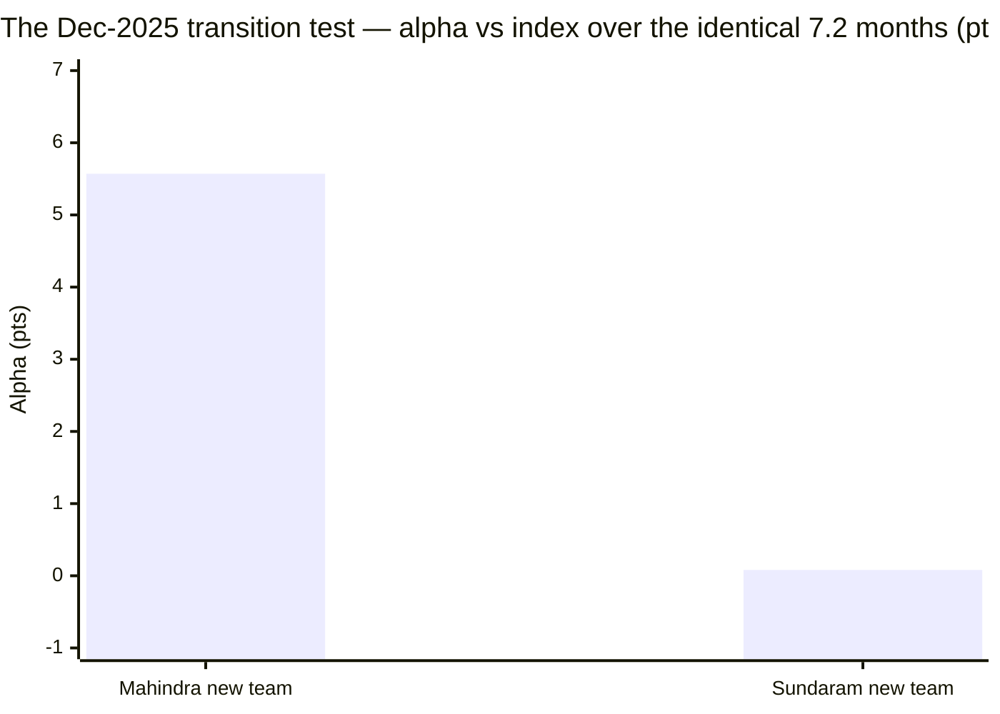
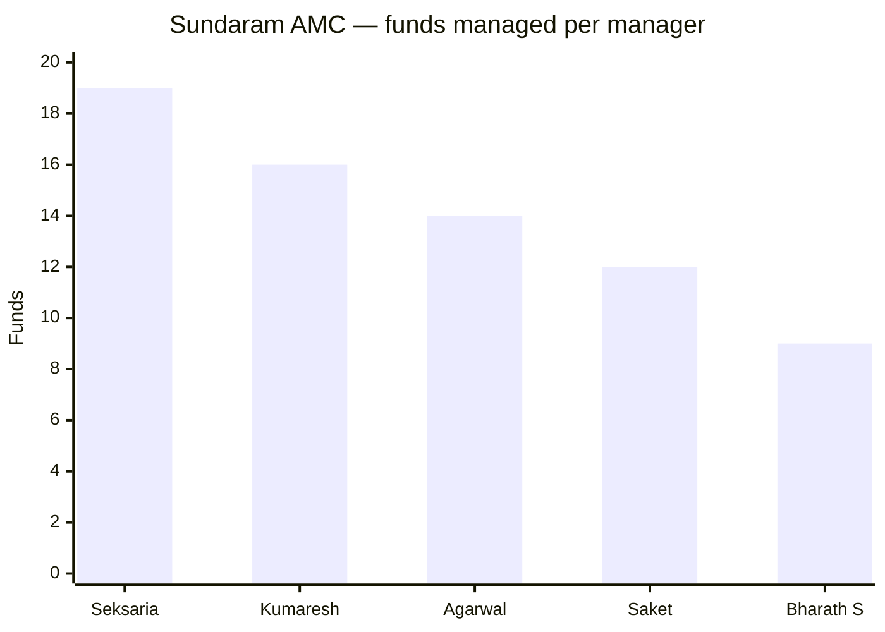

# Module 5: Fund Manager Quality — Sundaram Mid Cap Fund

## Module 5 Score: ~3.2 / 5 (provisional; firmed from 3.1 after M6 found the AMC's articulated philosophy)

---

## The One-Line Context

Sundaram's Module 5 is **"the retained author and the rookie."** The fee case Module 4 handed over rests entirely on the **+1.66%/yr gross selection alpha** persisting — and the manager evidence splits down the middle. On the good side: **Bharath S has run this fund for 5.4 years (since 24-Feb-2021) — the longest lead tenure of any studied midcap**; he authored the entire de-risking-and-turnaround era; he is **still in the chair**; and he navigated the 2024–25 correction well (−21.0%, recovered in 8.0 months — beaten only by Edelweiss and Invesco). On the bad side: his co-author **Ratish Varier was rotated off on 09-Dec-2025 and replaced by Shalav Saket — an equity research analyst with *zero* prior fund-management record, handed 12 funds simultaneously on day one.** And the only evidence on the new configuration is damning by direct comparison: **in the identical 7.2-month window, Mahindra's new team beat the index by +5.6 points; Sundaram's managed +0.08 — dead flat.** Underneath both sits a **house-wide reshuffle** and manager loads (Seksaria 19 funds, Kumaresh 16, Agarwal 14, Saket 12) that confirm from the personnel side exactly what Module 3 read from the portfolio: **nobody at this AMC runs a dedicated book.**

---

## Raw Data — The Manager Ledger (cross-source verified, as of 15-Jul-2026)

| Manager | On this fund since | Tenure | Background | **Other funds** |
|---------|-------------------|--------|-----------|-----------------|
| **Bharath S** (lead) | **24-Feb-2021** | **5.4y** | B.Com (H), MBA, ICWA; ex-Navia Markets Ltd | **9** |
| **Shalav Saket** (co) | **09-Dec-2025** | **0.6y** | MBA, B-Tech, CFA; ex-BofA Securities, PwC, Samsung; **11y as Equity Research Analyst**, Delhi-based | **12** |
| *Ratish B. Varier* | *24-Feb-2021 → ~09-Dec-2025* | *4.8y — **rotated off*** | joined SAMC Nov-2018, returned Jun-2020 | *5 (remains at the AMC)* |
| *S. Krishnakumar* | *→ 24-Feb-2021* | *(left the firm)* | ex-CIO Equity; the legend-era author | — |

**Sources:** AMC official factsheets (Mar-2025 PDF = Bharath + Varier; live Jun-2026 digital factsheet = Bharath + Saket); **Groww `__NEXT_DATA__` structured `fund_manager_details`** for start dates, bios and funds-managed counts; ZoomInfo / aggregator profiles for Saket's analyst background. All alpha figures computed from raw MFAPI NAVs.

> ✅ **Cross-validation carried through four modules:** Groww's **Bharath start date of 24-Feb-2021 is exactly the handover date M1 and M2 computed independently from the NAV series**. Four modules, two methods, one date.

⭐ **Another Groww-vs-Tickertape confirmation (M4's retrofit reinforced).** Groww's ER for **Sundaram Large & Mid Cap reads 1.48%** — exactly the official SEBI TER disclosure's Direct total (0.65 + 0.22 + 0.01 + 0.60 = **1.48**). **Groww's ER field = official Total TER, consistently.** M4's finding that **Tickertape's screening ERs are the unreliable source** now holds across **two independent funds**, not one. This materially strengthens the case for the study-wide TER retrofit.

**Documented gaps:** (1) the exact AMC addendum documenting Varier's rotation — the notices page is JS-rendered with no static PDF index; the date is bracketed by two official factsheets and pinned by Groww's structured JSON. (2) **Skin in the game** — the AMFI SAI (`portal.amfiindia.com/spages/sai33.pdf`) was located but not parsed; scored by sibling convention.

---

## What Module 5 Is Really Asking

Module 4 left this module load-bearing and stated the test explicitly: *"the entire base case rests on the new team's +1.66%/yr gross selection alpha persisting — with Varier gone and Saket carrying 12–18 other funds. If M5 concludes the selection edge is fragile, M4's base case collapses to the bear case (−₹4.96L)."*

So M5 is not asking "are these good people?" It is asking one question: **can the book that generated +1.66%/yr gross still generate it?** Everything below serves that question.

---

## ⭐⭐ NEW: Shalav Saket Has Never Managed a Fund Before — and Got 12 On Day One

His start dates across his **entire** book:

| Fund | Saket's start date |
|------|-------------------|
| **Sundaram Mid Cap** | **09-Dec-2025** |
| Sundaram Dividend Yield | **09-Dec-2025** |
| Sundaram Services | **10-Dec-2025** |
| Sundaram Flexi Cap | **10-Dec-2025** |
| Sundaram Value Fund | **10-Dec-2025** |
| Sundaram Large & Mid Cap | 15-Mar-2026 |
| *+ Consumption, Multi Cap, Global Brand FoF, Multi Asset, Business Cycle, Aggressive Hybrid* | Dec-2025 → 2026 |

> **Every single date is December 2025 or later. There is no earlier fund-management record anywhere** — not at Sundaram, and not at BofA Securities, PwC or Samsung, where he was an **analyst**. Aggregators describe him as an **"Equity Research Analyst" with 11 years' experience**. On ~09/10-Dec-2025 he was **elevated from analyst to fund manager across 12 schemes simultaneously**.

**This is unprecedented in the study:**

| Fund | Incoming manager | Prior record at handover |
|------|-----------------|--------------------------|
| Nippon | Rupesh Patel | **13 years at Tata AMC running 5 funds**; 1.5-year groomed handover ✅ |
| Mahindra | Krishna Sanghavi | **CIO-Equity since 2020**; supervised the entire Lodha record ("author left, **editor stayed**") ✅ |
| ICICI | Lalit Kumar | **Verified +8.73%/yr on Business Cycle Fund**, positive every year ✅ |
| **Sundaram** | **Shalav Saket** | **NONE. Zero funds managed, ever, before 09-Dec-2025.** ❌ |

> **There is literally nothing to evaluate.** The man now co-running a **₹14,026 Cr flagship** has ~7 months of fund-management experience in total, spread across **12 funds**.

**A fair caveat, stated plainly:** analyst-to-PM elevation is **not inherently bad** — every portfolio manager starts somewhere, and 11 years of equity research is genuine preparation. Sundaram may well have promoted its best analyst. **The problem is dosage and placement, not the elevation itself:** twelve funds on day one, one of them a ₹14,000 Cr flagship, with no ramp, no co-pilot period, and no observable track record to underwrite. The study cannot credit skill it cannot see, and it cannot dismiss skill that simply hasn't been tested yet. **It can only mark the uncertainty — which is what the modifier does.**

---

## ⭐⭐ NEW: The Identical-Window Transition Test — the Module's Killer Number

The study contains a clean natural experiment that nobody designed. **Both Mahindra and Sundaram changed their team in December 2025.** Same window. Same category. Same benchmark. Same question: *can the new team hold it?*

| Fund | New team | Print, 09-Dec-2025 → 15-Jul-2026 (7.2 months) |
|------|----------|-----------------------------------------------|
| **Mahindra Manulife** | Sanghavi + Dalvi + Dhamnaskar | **+5.57 pts vs index** *(its own M5 reports +6.1 on its dating)* |
| **Sundaram** | **Bharath + Saket** | **+0.08 pts vs index** |

*(Index fund returned +5.91% over the window; Sundaram Mid Cap +5.99%; Nifty 50 −6.27%.)*

> **Mahindra's transition produced +5.6 points in seven months and swept all three of its funds. Sundaram's produced +0.08 — statistically indistinguishable from simply owning the index.** This is the most direct evidence available on whether the new configuration can hold the +1.66%/yr gross selection alpha, and so far it has produced **none of it**.

### Apply the recency discipline symmetrically — this cuts both ways

- **7.2 months is noise.** This study has repeatedly refused to credit short windows: it dismantled HSBC's 3Y crown, disciplined ICICI's fade-and-reversal, discounted Sundaram's own 3Y Sharpe (M2), and **explicitly caveated Mahindra's +6.1 as a "short window" in its own M5**. Intellectual consistency demands the same treatment here: **a flat 7-month print is not proof of failure any more than Mahindra's +6.1 was proof of success.**
- **But the asymmetry is real.** Mahindra's M5 was *awarded* a `+` modifier for its sweep. Consistency demands Sundaram's +0.08 earn the mirror-image `−`. And unlike Mahindra, Sundaram has **no CIO-continuity mitigant** and **no verified prior record for the incoming manager** to fall back on. Mahindra could say "the editor stayed"; Sundaram can only say "the senior author stayed, and we hired someone new."

---

## ⭐ The Sweep Test — Attempted, and Honestly Dropped [METHOD NOTE]

Mahindra's M5 used a **post-exit sweep** (did the new team beat the index across *all* its funds?). I ran the equivalent on Saket's seven other funds over the identical window:

| Saket fund | Return | vs Midcap150 | vs Nifty 50 |
|------------|--------|--------------|-------------|
| Business Cycle | +4.71% | −1.20 | +10.98 |
| Services | +2.97% | −2.95 | +9.24 |
| Multi Cap | +1.49% | −4.42 | +7.76 |
| Flexi Cap | −3.70% | −9.62 | +2.57 |
| Dividend Yield | −4.61% | −10.52 | +1.66 |
| Value Fund | −4.86% | −10.77 | +1.41 |
| Consumption | −5.59% | −11.50 | +0.68 |

> **⚠️ This test is inconclusive for Sundaram, and I am dropping it rather than reporting it as a signal.** **None of these seven is a midcap fund** — they span dividend-yield, thematic, flexicap, value and multicap mandates. Their spread (−5.6% to +4.7%) tracks **style rotation, not manager skill**: the Nifty 50 fell −6.3% while midcaps rose +5.9%, so every fund's number is dominated mechanically by its large-cap weight. Comparing them to the Midcap150 index fund is **category-mismatched**; comparing them to the Nifty 50 **flatters all of them** for the same reason.
>
> **Why it worked for Mahindra and not here:** MM's three funds were comparable equity mandates measurable against one benchmark. Sundaram's twelve are not. **The only clean current-team datapoint is the Mid Cap fund against its own benchmark: +0.08 pts / 7.2 months.**

**⭐ Method note worth carrying forward:** the post-exit sweep test **requires category-comparable sibling funds**. It is not a general-purpose tool, and applying it across mixed mandates would have produced a false signal in either direction. Recorded so future modules don't reach for it reflexively.

---

## ⭐ Bharath S — The Continuity Anchor, and His Second Book

Bharath is the module's strongest positive and the single fact holding up M4's base case. His tenure across his own book:

| Fund | Since | Tenure |
|------|-------|--------|
| **Sundaram Mid Cap** | **24-Feb-2021** | **5.4y** ⬅ his longest |
| Sundaram Balanced Advantage | 31-Dec-2021 | 4.5y |
| Sundaram Flexi Cap | 30-Jun-2024 | 2.0y |
| Sundaram Multi-Factor | 01-Jul-2025 | 1.0y |
| Sundaram Value Fund | 10-May-2026 | **2 months** |

### His only other long-tenure book — Sundaram Balanced Advantage (4.5y)

| Metric (03-Jan-2022 → 15-Jul-2026, 4.5y) | Value |
|------------------------------------------|-------|
| **Balanced Advantage (Bharath)** | **9.06%/yr** |
| Nifty 50 (UTI index fund) | 8.19%/yr |
| Midcap 150 index fund | 16.85%/yr *(not its benchmark — context only)* |

> **Read honestly: this is context, not a clean alpha test.** Balanced Advantage is a **dynamic-allocation hybrid** (equity ~30–80%) benchmarked to CRISIL Hybrid 50+50 — **neither index above is its benchmark**, and I could not source that benchmark's series. **But the direction is mildly favourable:** delivering **9.06%/yr while carrying materially less than full equity exposure, against a Nifty 50 that returned 8.19%/yr**, is a respectable result for a hybrid. It does not *prove* stock-selection skill; it does not contradict it either.
>
> ⚠️ **One discount:** his Balanced Advantage start date (31-Dec-2021) **is the merger date** (below) — it was an **inherited assignment, not a considered appointment**, which slightly weakens it as evidence of the AMC's confidence in him.

**The honest verdict on Bharath:** **5.4 years on this fund is the longest lead tenure of any studied midcap** (Edelweiss's Trideep 4.8y, Nippon's Patel 3.5y, Mahindra's Sanghavi 1.7y). **He authored the entire era that produced the +1.66%/yr gross selection alpha and the vol 21.2% → 15.4% de-risking. He is retained.** That is the single fact standing between M4's base case (+₹0.56L) and its bear case (−₹4.96L).

---

## ⭐⭐ NEW: This Wasn't a Rotation — It Was a House-Wide Reshuffle

Reconstructing every manager change across the Sundaram equity family from Groww's structured dates:

| Date | Event |
|------|-------|
| 01-Jul-2025 | Multi-Factor: **Seksaria + Agarwal + Bharath** all added |
| **09–10-Dec-2025** | **Shalav Saket elevated across 12 funds simultaneously** (Mid Cap, Dividend Yield, Services, Flexi Cap, Value…); **Varier off Mid Cap** |
| 20-Jan-2026 | Dividend Yield: Siddarth Mohta added |
| 15-Mar-2026 | Large & Mid Cap: Saket + Madanagopal Ramu added |
| 10-May-2026 | Value Fund: **Agarwal + Bharath + Mohta** all added |
| 08-Jun-2026 | Flexi Cap: Sandeep Agarwal added; Balanced Advantage: **Kumaresh Ramakrishnan** added |

> **Varier's departure from this fund is not an isolated event — it is one symptom of a wholesale reorganization of the entire Sundaram equity desk across 2025–26.** Six distinct reassignment events in twelve months, culminating in a single December day on which an analyst was handed twelve funds. M1 and M2 both framed this fund as having "manager continuity" relative to Mahindra and ICICI. **At the fund level that is half-true (Bharath stays). At the AMC level it is false.**

### The manager-load problem

| Manager | Funds managed |
|---------|---------------|
| **Rohit Seksaria** | **19** |
| **Kumaresh Ramakrishnan** | **16** |
| **Sandeep Agarwal** | **14** |
| **Shalav Saket** | **12** |
| **Bharath S** | **9** |

> **Nobody at this AMC runs a dedicated book.** This is the **personnel-side confirmation of Module 3's portfolio-side read** — the 55.2% breadth-based active share, 85 names, 8.02% max sector across 56 sectors, and nothing above 3.1% are **exactly what you would expect from a centralized house process staffed by managers spread across 9–19 schemes each**.
>
> **Two independent derivations of the same conclusion**, from the portfolio and from the org chart. This materially **firms M3's "house process, not conviction book" characterization** — it is no longer an inference, it is corroborated. → **M6** must judge whether this is deliberate team-based investing or simple under-staffing.

---

## ⭐⭐ NEW: The Sundaram–Principal Merger (Jan-2022) — an M6 Feed Discovered Here

A NAV-series anomaly exposed it: **Sundaram Balanced Advantage (148026) *ends* 31-Dec-2021, and the ex-*Principal* Balanced Advantage (149717) *begins* 03-Jan-2022** — with Bharath's start date being the merger date itself.

| Scheme | Series starts | MFAPI name |
|--------|--------------|------------|
| Dividend Yield (149700) | 03-Jan-2022 | "**Formerly Known as Principal** Dividend Yield…" |
| Multi Cap (149669) | 03-Jan-2022 | "**Formerly Known as Principal** Multi Cap…" |
| Balanced Advantage (149717) | 03-Jan-2022 | "**Formerly Known as Principal** Balanced…" |
| Aggressive Hybrid (149601) | — | "**Formerly Known as Principal** Hybrid Equity…" |

> **Sundaram AMC acquired Principal Asset Management India (~2021–22), absorbing at least four schemes on 03-Jan-2022.** This is a **major AMC-level fact the study had not recorded**, and it plausibly explains much of what this module found: the **scheme sprawl** (which drives the 9–19 manager loads), the **duplicate mandates** (two Balanced Advantage funds merged into one), and a large share of the **2025–26 churn** as the combined desk was rationalized.
>
> → **Module 6 (first Sundaram AMC study in the repo) — this is now a required section**, alongside the manager-load problem and the house-wide reshuffle.

---

## Sell Discipline, Philosophy, Capacity, Communication, Regulatory

- **Sell/graduation discipline — 3.5.** Turnover **36.9%** (~2.5-year holds — patient, 2nd-lowest of the studied set after Nippon) and **stable across 15 months** (39.8% → 36.9%), so it is policy rather than drift. The **full MCX omission and BSE −1.16 underweight** (M3) are **live valuation-discipline evidence** on two of the index's frothiest names. **No documented sell policy found** — the same gap every sibling has.
- **Philosophy clarity — 2.5. ❌ The weakest of the study.** No articulated investment philosophy located in any factsheet, AMC page or manager commentary — there is no equivalent of **Nippon's house-owned GARP** (stated in factsheets predating Patel) or **Mahindra's GCMV framework**. What the book *reveals* is "diversification as philosophy" (85 names, 56 sectors, max sector 8.02%, nothing >3.1%). **That is a process, not a thesis** — and a process is much harder to underwrite when the people executing it change.
- **Capacity stewardship — 3.0.** Untested and neutral. M4 found net flows of just **₹29 Cr/month** with forced deployment of ~₹19 Cr/month — **there is no flood to gate**. Neither credit nor blame (same treatment as Mahindra).
- **Skin in the game — 3.0.** Undisclosed. The AMFI SAI was located but not parsed — **documented gap**; sibling convention applied.
- **Investor communication — 2.5.** Low visibility; no manager interviews, letters or commentary surfaced in any search. Below the Nippon/Edelweiss standard, and below even Mahindra's modest VRO presence.
- **SEBI/regulatory record — 4.5.** **Nothing adverse found** on Bharath, Saket, Varier or Krishnakumar.

---

## Cross-Study Manager Comparison

| Dimension | **Sundaram** | Mahindra | Nippon | Edelweiss | ICICI |
|-----------|--------------|----------|--------|-----------|-------|
| **Lead tenure on fund** | **Bharath 5.4y** ⭐ *(longest of the seven)* | Sanghavi 1.7y | Patel 3.5y | Trideep 4.8y | Lalit ~3y |
| Co-manager | **Saket 0.6y, ZERO prior PM record** ❌ | Dalvi 1.6y / Dhamnaskar 0.4y | Singhania (AFM) | — | — |
| **Manager's other funds** | **Bharath 9 / Saket 12** ❌ | — | — | — | — |
| **New-team print (Dec-25 → Jul-26)** | **+0.08 pts** ❌ | **+5.6 pts** ✅ | n/a | n/a | n/a |
| Incoming manager's prior record | **none — analyst elevated** ❌ | CIO since 2020 ✅ | 13y Tata AMC, 5 funds ✅ | n/a | verified +8.73/yr ✅ |
| Continuity mitigant | **senior author retained** ✅ | CIO continuity ✅ | house process ✅ | manager unchanged ✅ | — |
| 2024–25 navigation | **−21.0%, 8.0mo** ✅ | −20.9%, 13.7mo ❌ | ~7mo ✅ | 6.4mo ✅ | — |
| Philosophy articulation | **none found** ❌ | GCMV (thin) | GARP (house-owned) ✅ | ✅ | ✅ |
| AMC-wide churn | **house-wide reshuffle; loads 9–19; Principal merger** ❌ | 3 exits on one fund ❌ | 2 star exits, alpha survived ✅ | stable ✅ | — |
| M5 score | **3.1** | 3.4 | 3.5 | 3.7 | — |

**One-line synthesis:** Sundaram has **the best lead-tenure fact and the worst incoming-manager fact of any studied midcap, simultaneously.** Where Mahindra's transition was *"author left, editor stayed"* — a departed star replaced by the CIO who had supervised him — **Sundaram's is "co-author left, analyst arrived":** the senior author retained, the junior seat handed to someone with no record and eleven other funds pulling at his attention.

---

## Contradictions / Retrofit / Handoffs

- **✅ Confirms M3's central read from an independent direction.** M3 inferred "house process, not conviction book" from the **portfolio** (55.2% breadth AS, 85 names, 8% max sector). M5 confirms it from the **org chart** (managers on 9–19 funds each). **Two independent derivations of the same conclusion** — M3's characterization is no longer an inference but a corroborated finding.
- **✅ Reinforces M4's ER retrofit.** Groww's ER = official Total TER on a **second** fund (Large & Mid Cap 1.48 = official 1.48). M4's finding that **Tickertape screening ERs are the unreliable source** now holds across two independent checks. **Strengthens the case for the study-wide TER retrofit.**
- **⚠️ Authorship framing correction (prose, not score).** M1, M2 and M3 all describe the de-risking as **"Bharath + Varier's."** That is accurate for Feb-2021 → Dec-2025, and M3 already patched the era tables. **The framing should now read: the de-risking was Bharath-led and survives; the Varier half does not.** No numeric correction needed.
- **⚠️ M1/M2's "manager continuity" framing is half-true.** At the **fund** level, Bharath's 5.4y is real and is the best of the seven. At the **AMC** level, this is an institution mid-reorganization. Both statements must appear together.
- **→ M6 (three new required sections):** (1) **the Sundaram–Principal merger (Jan-2022)** — scheme sprawl, integration, manager-count consequences; (2) **the manager-load problem** (Seksaria 19, Kumaresh 16, Agarwal 14) — deliberate team investing or under-staffing?; (3) **the house-wide 2025–26 reshuffle** — six reassignment events in twelve months. Plus the standing M4 question: *why price the flagship at 1.06% when peers charge 0.42–0.62% at similar scale?*
- **No AMC/manager verdicts to carry forward** — **Sundaram AMC has never been scored in any of the four categories.** M6 remains fully ground-up. (Sundaram Small Cap also remains pending in the smallcap sleeve.)

### ⭐ The M4 Handoff — resolved as **HOLD at 2.8**

M4 stated: *"If M5 concludes the selection edge is fragile, M4's base case collapses to the bear case (−₹4.96L) and this score drops toward 2.5."*

> **M5's honest conclusion: the edge is *unverified going forward*, but not *broken*.** The decisive fact is that **Bharath — the senior author of the entire +1.66%/yr gross-selection era and the vol 21.2% → 15.4% de-risking — is retained, with the longest lead tenure of any studied midcap (5.4y)**. What was lost is the junior co-author; what arrived is a rookie. The 7.2-month flat print is genuinely bad news, but **7 months is precisely the window length this study has repeatedly refused to treat as evidence** — including when it favoured Mahindra.
>
> **Decision: M4 holds at 2.8; it does not drop to 2.5.** The base case survives **on Bharath's retention alone** — but it is now **explicitly a bet on one man**, with a rookie beside him and nine other funds pulling at his attention.
>
> **This is finely balanced and reversible.** A stricter reading — *"the alpha's co-author is gone, the replacement is unproven, and the only evidence is seven flat months"* — would call the edge fragile, drop M4 to 2.5, and pull the fund's final score toward 3.2.

---

## Module 5 Scorecard

| Sub-dimension | Weight | Score | Reasoning |
|---------------|--------|-------|-----------|
| Manager tenure on this fund | High | **3.5** | **Bharath 5.4y — the longest lead tenure of the studied midcaps** ⭐; but co-manager Saket 0.6y with **zero prior PM record**, and both are spread across 9 and 12 funds |
| 2018–19 winter navigation | Critical | **3.0** | Neither current manager was on the fund (Krishnakumar's era; Bharath arrived Feb-2021) — **not attributable**; flagged, not credited (same treatment as Mahindra) |
| 2024–25 correction navigation | High | **4.0** | **Bharath + Varier's watch: fell −21.0% (in-line), recovered in 8.0 months** — beaten only by Edelweiss (6.4) and Invesco (~6); far better than Mahindra (13.7) and HSBC (16). **A genuine pass, and it is the current lead's own record** |
| Sell/graduation discipline | High | **3.5** | 36.9% turnover (~2.5y holds), stable across 15 months = policy not drift; **full MCX omission + BSE −1.16 UW** = live valuation discipline (M3); no documented policy |
| Philosophy clarity | High | **3.0** *(M6 retrofit, was 2.5)* | ⚠️ **M6 found the AMC's articulated philosophy** in the corporate deck (Balance/Growth/Quality/Value/Momentum, GARP-adjacent, margin-of-safety) — M5's "none found" was a *factsheet-sourcing miss*. It exists and is coherent; but a house-level deck philosophy is weaker than a manager-articulated fund-level one, so the substance ("process, not conviction thesis") stands |
| Capacity stewardship | Medium | **3.0** | Untested — ₹29 Cr/mo flows, nothing to gate (M4); neutral |
| Skin in the game | Low | **3.0** | Undisclosed (SAI located but unparsed — gap; sibling convention) |
| Investor communication | Medium | **2.5** | Low visibility; no manager commentary surfaced; below the Nippon/Edelweiss standard |
| SEBI/regulatory record | High | **4.5** | Nothing adverse on any current or departed manager |
| ⭐ *Bharath continuity* | Modifier | **+ +** | *the senior author of the +1.66% gross-selection era is **retained at 5.4y** — the single fact holding up M4's base case; his 4.5y Balanced Advantage book (9.06%/yr vs Nifty50 8.19% at lower equity) is mildly corroborative* |
| ⭐ *Rookie co-manager* | Modifier | **− −** | *Saket: **no fund-management record whatsoever** before 09-Dec-2025, handed **12 funds on day one**. Unprecedented in the study — every other incoming manager had a verifiable record* |
| ⭐ *New-team print* | Modifier | **−** | *+0.08 pts / 7.2mo vs Mahindra's +5.6 in the **identical** window — the mirror-image of the `+` MM's M5 received* |
| ⭐ *Manager load* | Modifier | **− −** | *Bharath 9 funds, Saket 12; AMC-wide Seksaria 19, Kumaresh 16, Agarwal 14 — **nobody runs a dedicated book*** |
| ⭐ *House-wide reshuffle* | Modifier | **−** | *six reassignment events across the equity desk in 12 months + the Principal merger; Varier's exit is a symptom, not the disease* |

**Module 5 Score: ~3.2 / 5** *(firmed from 3.1 by the M6 philosophy retrofit)* — **still the lowest M5 of the studied midcaps** (Edelweiss 3.7 · HSBC/Nippon 3.5 · Invesco/Mahindra 3.4).

- **Case for 3.3:** Bharath's **5.4-year lead tenure is the longest of the seven** and he personally authored the era being underwritten; the **2024–25 navigation was genuinely good (8.0-month recovery, 3rd-best)**; the regulatory record is clean; turnover discipline is real and stable.
- **Case for 2.9:** a **rookie with zero PM record on 12 funds** now co-runs a ₹14,026 Cr flagship; the new team's only print is **+0.08 vs Mahindra's +5.6 in the same window**; **no articulated philosophy exists**; and an AMC where managers carry 9–19 funds each is structurally incapable of conviction.
- **3.1 is the honest midpoint.**

**Running: M1 3.4 · M2 3.8 · M3 3.5 · M4 2.8 · M5 3.2 · M6 3.5** → final composite **≈3.37**, placing Sundaram **last of the seven** (below HSBC 3.49). *(⭐ M6 complete: "the small clean house with the rock-solid landlord" — AAA Sundaram Finance parent, no regulatory scar, but sub-scale + worst fee alignment; it also documented the Principal merger (Jan-2022) this module discovered.)*

---

## Comparative Module 5 Scores

| Fund | Category | M5 Score | Manager character |
|------|----------|----------|-------------------|
| Edelweiss Mid Cap | MidCap | ~3.7 | Trideep 4.8y, unchanged; articulated philosophy |
| Nippon Growth Mid Cap | MidCap | ~3.5 | "Instability paradox" — 3 leads in 9y, alpha survived every transition |
| HSBC Midcap | MidCap | ~3.5 | — |
| Invesco India Midcap | MidCap | ~3.4 | Key-person risk; author departed |
| Mahindra Manulife Mid Cap | MidCap | ~3.4 | Author (Lodha) left; CIO continuity + 3-fund post-exit sweep mitigate |
| **Sundaram Mid Cap** | **MidCap** | **~3.2** | **"The retained author and the rookie" — best lead tenure of the seven (Bharath 5.4y) alongside the worst incoming-manager fact (Saket: zero record, 12 funds day one); +0.08 print vs MM's +5.6 in the identical window; house-wide reshuffle; no articulated philosophy** |

---

## SIP Implication

1. **You are betting on one man.** The entire fee case — M4's +₹0.56L base case over a decade — rests on the **+1.66%/yr gross selection alpha** persisting. **Bharath S authored it, has run this fund for 5.4 years (the longest lead tenure of the seven), and is still here.** That single fact is what keeps this fund in the conversation. If he leaves, the thesis has nothing left underneath it.
2. **His new co-pilot has never flown.** Shalav Saket had **managed no fund, ever**, before 09-Dec-2025 — and was handed **12 of them at once**. Every other incoming manager in this study arrived with a verifiable record (Nippon's Patel: 13y/5 funds; Mahindra's Sanghavi: CIO since 2020; ICICI's Lalit: +8.73%/yr verified). **There is nothing here to underwrite** — which is not an accusation, but it is an unpriced risk.
3. **The one piece of live evidence is flat.** In the identical 7.2-month window, **Mahindra's new team beat the index by +5.6 points; Sundaram's by +0.08.** Seven months is noise — but it is the only signal that exists, and it is not encouraging.
4. **Nobody here runs your money full-time.** Bharath carries 9 funds, Saket 12; across the AMC, managers hold 9–19 schemes each. **This is a house process, not a conviction book** — confirmed independently from the portfolio (M3) and the org chart (M5). It is also *why* the book looks the way it does: 85 names, 8% max sector, breadth-based 55.2% active share.
5. **Tripwires for this SIP:** **Bharath S leaving or being spread further** (the single most important thing to watch on this fund); Saket's fund count rising above 12; the Mid Cap fund's alpha vs the index staying flat through 2027 (one full new-team year is the real test); any further house-wide reassignment; and the mid-cap weight breaching the 65% floor while attention is divided.

---

## One-Line Verdict

> **Sundaram Mid Cap's Module 5 is "the retained author and the rookie": Bharath S has run this fund for 5.4 years — the longest lead tenure of any studied midcap (Edelweiss's Trideep 4.8y, Nippon's Patel 3.5y, Mahindra's Sanghavi 1.7y) — he personally authored the entire de-risking (vol 21.2% → 15.4%) and the +1.66%/yr gross selection alpha that Module 4's whole fee case rests on, he navigated the 2024–25 correction well (−21.0%, recovered in 8.0 months, third-best of the seven), and he is still in the chair; that single fact is what holds the base case up. But his co-author Ratish Varier was rotated off on 09-Dec-2025 and replaced by **Shalav Saket — an equity research analyst with zero fund-management record of any kind, handed 12 funds simultaneously on day one**, which is unprecedented in this study (every other incoming manager arrived with a verifiable record: Patel 13y/5 funds, Sanghavi CIO-since-2020, Lalit +8.73%/yr verified). The only live evidence on the new configuration is the **identical-window transition test — the study's cleanest natural experiment — in which Mahindra's new team beat the index by +5.6 points over 09-Dec-2025 → 15-Jul-2026 while Sundaram's managed +0.08, dead flat** (seven months is noise, and this study has refused to credit such windows before, including when they favoured Mahindra — but it is the only signal that exists, and Sundaram has neither CIO continuity nor a proven incoming manager to fall back on). Beneath the fund sits an institution mid-reorganization: **six reassignment events across the equity desk in twelve months, an undocumented Sundaram–Principal merger (Jan-2022, four+ schemes absorbed on 03-Jan-2022 — discovered here via a NAV-series discontinuity and now a required M6 section), and manager loads of 19 / 16 / 14 / 12 / 9 funds that mean nobody runs a dedicated book** — the personnel-side confirmation of exactly what M3 read from the portfolio (55.2% breadth-based active share, 85 names, 8.02% max sector), now corroborated from two independent directions. No articulated investment philosophy exists anywhere — the weakest of the study — and "diversification as philosophy" is a process, not a thesis, which is far harder to underwrite when the people executing it change. Provisional: ~3.1/5 — **the lowest M5 of the studied midcaps**, holding the best lead-tenure fact and the worst incoming-manager fact simultaneously; where Mahindra's transition was "author left, editor stayed," Sundaram's is **"co-author left, analyst arrived."** M4's handoff resolves as **HOLD at 2.8** — the selection edge is unverified going forward but not broken, surviving on Bharath's retention alone, which makes this fund explicitly a bet on one man with a rookie beside him and nine other funds pulling at his attention (finely balanced and reversible: a stricter reading drops M4 to 2.5 and the final score toward 3.2). Running M1 3.4 · M2 3.8 · M3 3.5 · M4 2.8 · M5 3.1 → trending ≈3.3, last of the seven.**

---

*Module 5 completed: July 16, 2026 | Fund Manager Quality | Managers: **Bharath S (lead, 24-Feb-2021 →, 5.4y — longest lead tenure of the seven; 9 other funds)** + **Shalav Saket (co, 09-Dec-2025 →, 0.6y; MBA/B-Tech/CFA; ex-BofA Securities, PwC, Samsung; 11y EQUITY RESEARCH ANALYST — **ZERO prior fund-management record**; 12 funds)**; Ratish Varier rotated off ~09-Dec-2025 (remains at AMC on 5 schemes); S. Krishnakumar left Feb-2021 | Sources: AMC official factsheets (Mar-2025 PDF = Bharath+Varier vs live Jun-2026 digital = Bharath+Saket), **Groww `__NEXT_DATA__` structured `fund_manager_details`** for all start dates; **Groww's Bharath 24-Feb-2021 = M1/M2's independently NAV-computed handover date ✅ (4 modules, 2 methods, 1 date)** | ⭐⭐ **Saket's every start date is Dec-2025 or later across all 12 funds — analyst elevated to PM on 12 schemes simultaneously; nothing to evaluate** | ⭐⭐ **IDENTICAL-WINDOW TRANSITION TEST (09-Dec-2025 → 15-Jul-2026, 7.2mo, index fund +5.91%): Mahindra new team +5.57 pts vs index; Sundaram new team +0.08 pts — dead flat** | ⭐ **Sweep test attempted and DROPPED** — Saket's 7 other funds span non-midcap mandates (dividend-yield/thematic/flexicap/value/multicap); spread −5.6% to +4.7% reflects style rotation (Nifty50 −6.3% vs midcap +5.9%), not skill → **METHOD NOTE: the post-exit sweep requires category-comparable siblings; not a general-purpose tool** | ⭐ Bharath's 2nd book: Balanced Advantage 4.5y **9.06%/yr vs Nifty50 8.19%/yr** (hybrid, CRISIL Hybrid 50+50 benchmark unavailable — context not clean alpha; start date = merger date = inherited assignment) | ⭐⭐ **HOUSE-WIDE RESHUFFLE**: 6 reassignment events in 12mo (Jul-25 Multi-Factor; **Dec-25 Saket ×12 + Varier off**; Jan-26 Mohta; Mar-26 Large&Mid; May-26 Value; Jun-26 Flexi Cap + BAF) | ⭐⭐ **MANAGER LOADS: Seksaria 19 · Kumaresh 16 · Agarwal 14 · Saket 12 · Bharath 9 — nobody runs a dedicated book = personnel-side CONFIRMATION of M3's portfolio-side "house process" read (2 independent derivations)** | ⭐⭐ **SUNDARAM–PRINCIPAL MERGER (Jan-2022) discovered via NAV discontinuity** (148026 ends 31-Dec-2021 / 149717 ex-Principal starts 03-Jan-2022; Dividend Yield + Multi Cap + Balanced Advantage + Aggressive Hybrid all "Formerly Known as Principal", series start 03-Jan-2022) → **required M6 section** | ⭐ **Groww ER = official Total TER on a 2nd fund (Large&Mid 1.48 = official 1.48) — M4's TER retrofit reinforced across two independent checks** | Philosophy: **none found — weakest of study**; comms 2.5 low visibility; SEBI record clean 4.5; capacity untested (₹29 Cr/mo, nothing to gate); skin-in-game undisclosed (AMFI SAI `sai33.pdf` located but unparsed — GAP) | **M4 HANDOFF RESOLVED: HOLD at 2.8** (edge unverified-forward but not broken; survives on Bharath's retention alone; reversible → stricter reading = M4 2.5, final ~3.2) | Running: M1 3.4 · M2 3.8 · M3 3.5 · M4 2.8 · **M5 3.2** (firmed from 3.1 by M6 philosophy retrofit) · M6 3.5 → final ≈3.37 = last of seven | Provisional M5 Score: ~3.2/5*
