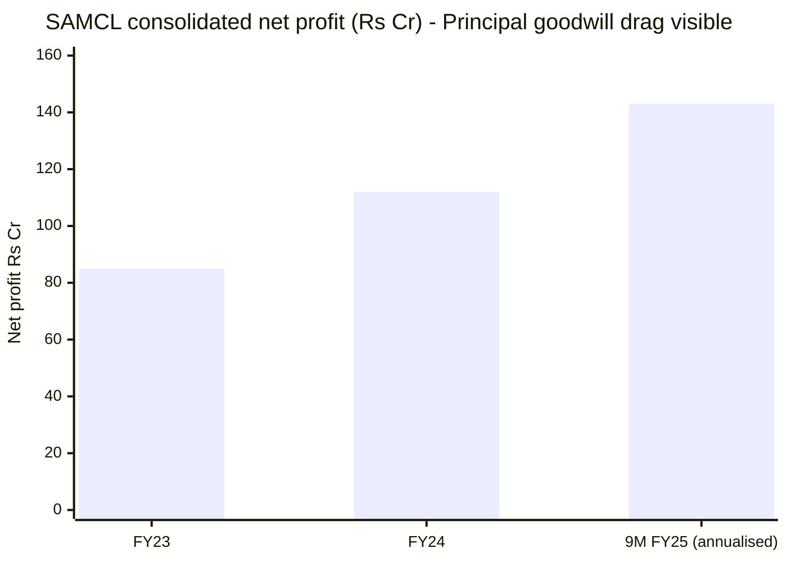
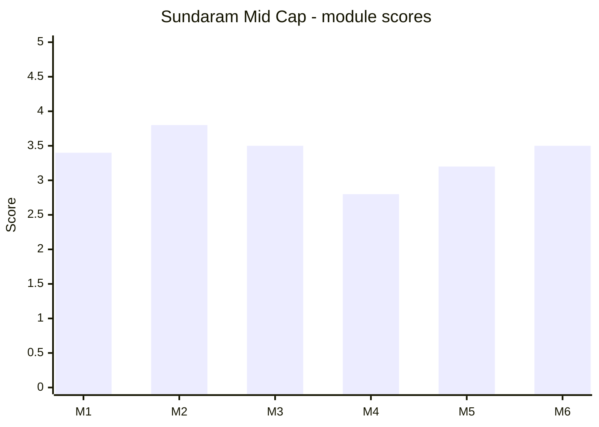

# Module 6: AMC Trustworthiness — Sundaram Mid Cap Fund

## Module 6 Score: ~3.5 / 5 (provisional) — first deep-study of the Sundaram AMC (ground-up; never scored in any of the four categories)

---

## The One-Line Context

Sundaram's Module 6 is **"the small clean house with the rock-solid landlord."** After five modules of structural weakness, the AMC axis is the fund's quiet redemption: **Sundaram Asset Management is a 100%-owned subsidiary of Sundaram Finance — a AAA-rated, 50-plus-year-old, conservatively-run financial house of the TVS lineage** — and, unlike every other bank/institution-owned AMC the study has examined, **it carries no investor-facing regulatory scandal at all**: no Franklin-style debt blowup, no ICICI I-Sec IPO bailout, no Nippon Yes-Bank AT1 scar. But the cleanliness comes wrapped in three real limits: it is **sub-scale** (ranked 21st, moderate AUM, a modest ~22% net margin dragged by Principal-merger goodwill amortization); its **leadership desk is in visible flux** (a two-year-old CEO poached from Franklin, sitting atop the house-wide reshuffle Module 5 exposed); and it runs the **worst fee alignment in the study** — a sub-scale house charging the study's most expensive midcap fee (1.06%, M4) while passing on economies of scale it does not have. A trustworthy institution; a small and middling one.

---

## Raw Data — The AMC (primary sources, as of Dec-2025 / FY25)

| Field | Value | Source |
|-------|-------|--------|
| **AMC** | Sundaram Asset Management Company Ltd (SAMCL) | — |
| **Parent** | **Sundaram Finance Ltd — 100% owner**; AAA-rated (ICRA/CRISIL); mkt cap ~₹55,000 Cr; listed NBFC since 1972 | AMC deck / ICRA |
| **Group lineage** | TVS / T.V. Sundaram Iyengar — one of India's oldest, most conservative business houses | — |
| **Founded** | **1996** (JV with Newton AM); Newton bought out 2002; later BNP Paribas stake bought out; **28-year** AM track record | AMC deck / ICRA |
| **Total AUM** | **₹76,150 Cr** (31-Dec-2025); 10Y CAGR **14.5%**; **ranked 21st** in the industry | AMC deck |
| **Equity AUM** | **₹63,555 Cr** (Dec-2025) | AMC deck |
| **AUM composition** | Equity 73.7% / Fixed Income 14.6% / International 2.6% / PMS 4.1% / AIF 5.1% | AMC deck |
| **Schemes (standalone)** | 32 mutual funds | ICRA |
| **Folios / reach** | **~50 lakh folios**, 22L+ customers, 60K+ empanelled distributors, 4L+ SIP txns/month | AMC deck / ICRA |
| **Net profit (consolidated)** | **₹85 Cr (FY23) → ₹112 Cr (FY24) → ₹107 Cr (9M FY25)** | ICRA |
| **Net margin (PAT/OI)** | **~22%** | ICRA |
| **Credit rating** | **[ICRA]AA (Stable) / A1+** — reaffirmed 20-Mar-2025 | ICRA |
| **CEO / MD** | **Anand Radhakrishnan** (~Feb-2024; **ex-Franklin Templeton India CIO-Equity**) | ICRA / AMC |
| **SAAL (PMS/AIF) MD** | Vikas M. Sachdeva | ICRA |
| **Principal acquisition** | **Dec-2021, ₹338.53 Cr, funded 52:48 debt:equity**; Principal AUM ~₹7,447 Cr (Dec-2020) | Business Standard / ICRA |
| **Parent FY25** | Sundaram Finance net profit **₹1,879 Cr (+31% YoY)** | Sundaram Finance |

**Method:** primary sourcing throughout — the AMC's own **24-page Corporate Presentation (Dec-2025)**, fetched as a raw PDF from `sundarammutual.com/Report/AMCP` (the endpoint returns the PDF binary directly — a reusable method for this AMC), and **ICRA's rating rationale (20-Mar-2025)**. Aggregators used only for cross-checks. **No SAMCL-level regulatory scandal was found** in targeted searches — recorded as a searched-and-clean result, not an unsearched gap. **Documented gap:** skin-in-the-game (AMFI SAI located but unparsed, M5).

---

## What Module 6 Is Really Asking — and Sundaram's Answer

**Can you trust the institution behind the fund with a 10-year SIP?** **Yes — with a footnote about size, not integrity.**

The parent is one of the safest in Indian finance; the AMC has a 28-year record and a genuinely clean regulatory sheet. What it lacks is **scale and momentum**: it is the 21st-largest house, modestly profitable, its franchise is barely growing (M4: ₹29 Cr/month net flows), and its equity leadership is mid-reshuffle. You are trusting a **stable but sub-scale house that is passing you none of the cost benefits of size** — because it has little size to pass on. On the axes that most protect a long-horizon investor (sponsor stability, regulatory cleanliness) Sundaram is arguably best-in-class among the institution-owned AMCs; on the axes that build wealth (scale, economics, fee alignment) it is the weakest.

---

## ⭐⭐ NEW: The Clean Sheet — the First Unscarred Institution-Owned AMC in the Study

This is the module's central finding, and it is a genuine positive by contrast:

| AMC | Investor-facing regulatory scar | M6 |
|-----|--------------------------------|-----|
| Franklin | **2020 debt-fund winding-up** (6 schemes frozen) | 2.8 |
| ICICI Pru | **2018 I-Sec IPO bailout** (unitholder money for a group IPO) | 3.4 |
| Nippon | **Yes Bank AT1 quid-pro-quo** (₹2,500 Cr, written to zero) | 3.4 |
| BOI | mis-selling history | 3.2 |
| **Sundaram** | **none found** | **this module** |

> **Sundaram is the first institution-owned AMC in the study with no investor-facing regulatory scandal on its record.** No debt blowup, no group-conflict bailout, no front-running case. The parent — Sundaram Finance, a AAA NBFC of the conservative TVS lineage — is the **antithesis of the promoter mess Nippon had to be cleansed from** (Anil Ambani's Reliance Capital). This deserves real credit: it is the cleanest institutional backing the study has documented outside the founder-owned boutiques (PPFAS/DSP).

**The honest caveat:** a small, less-scrutinized AMC (21st, sub-scale) attracts less regulatory and journalistic attention than an ICICI or a Nippon — so "no scar found" is partly "less examined." I searched specifically and found nothing; but this is a clean sheet on a smaller stage, not a clean sheet under a spotlight. Scored as a genuine positive, discounted one notch for the smaller stage.

---

## ⭐⭐ NEW: The CEO Is the Former Franklin Equity CIO — a Leadership-Provenance Flag

**Anand Radhakrishnan, SAMCL's MD/CEO since ~Feb-2024, was previously CIO-Equity (President) at Franklin Templeton India** — the AMC that holds the study's **worst M6 score (2.8)** for the 2020 debt-fund collapse.

| Consideration | Reading |
|---------------|---------|
| He ran **equity**, not the debt desk that blew up | The Franklin crisis was a **debt-side** failure (Santosh Kamath's team); Radhakrishnan's equity funds were not the scandal |
| He was nonetheless **senior leadership** during the crisis | A President/CIO shares in an institution's governance culture, even from another desk |
| His equity credentials are genuinely strong | Decades of respected equity management; a real pedigree upgrade for a small house |

> **Net read: a modest yellow flag, not a red one.** Importing the equity CIO of the study's most-scarred AMC to run your whole shop is a provenance worth noting — but the specific failure at Franklin was in a division he did not run, and his arrival plausibly *raises* Sundaram's equity capability. It is a **leadership-provenance note, scored lightly**, not a scandal transfer.

⭐ **Cross-study link / retrofit:** SAMCL's CEO connects this study to the Franklin M6 (2.8). If Franklin's study named Radhakrishnan, it should cross-reference that he has since become Sundaram's CEO; if it didn't, no change is needed. Either way, the two studies now share a senior figure.

---

## ⭐ NEW: The Principal Merger — the Economics Behind M5's Discovery

Module 5 discovered the Sundaram–Principal merger from a NAV-series discontinuity (03-Jan-2022). Module 6 supplies the economics:

| Fact | Value |
|------|-------|
| **Announced / closed** | 28-Jan-2021 / **31-Dec-2021** |
| **Price** | **₹338.53 Cr** |
| **Funding** | **52:48 debt:equity** (parent equity infusion + short-term loans) |
| **Principal AUM acquired** | ~₹7,447 Cr (Dec-2020) |
| **Sundaram AUM pre-deal** | ~₹40,000 Cr (~19% AUM bump) |
| **Earnings impact** | ICRA: *"impacted by the sizeable amortisation of goodwill recognised during the acquisition"* |

> **The merger is the through-line of the entire Sundaram study.** It explains: the **scheme sprawl** (32 funds absorbing ex-Principal duplicates → M3's over-diversification; M5's 9–19 manager loads), the **house-wide 2025–26 reshuffle** (rationalizing the combined desk → M5), the **goodwill drag** on margins (this module), and even Bharath's "inherited" Balanced Advantage assignment (M5, start date = the merger date). **One corporate action ripples through five modules.**
>
> **Verdict on the deal: strategically sensible, digestibly small, cleanly financed by a AAA parent — but still being integrated four years on.** It bought scale (~19% AUM) at the cost of a complexity the AMC is visibly still working through.

---

## ⭐ NEW: The Articulated Philosophy DOES Exist — a Partial M5 Retrofit

Module 5 scored "philosophy clarity" **2.5 — the weakest of the study — "no articulated philosophy found anywhere."** The AMC's own corporate deck (page 12) contradicts that at the **house level**:

> *"Deliver superior risk-adjusted return over medium-to-long term by following a balanced approach of investing in **Consistent and Cyclical Growth businesses that have superior Quality**… reasonable **margin of safety**… avoid growth/value traps… develop **knowledge & analytical edge**."*

Framework: **Balance · Growth · Quality · Value · Momentum.**

> **This is a real, stated philosophy — GARP-adjacent quality-growth with a margin-of-safety discipline** — comparable to Nippon's house GARP articulation. **M5's "none found" was a sourcing miss:** it lives in the corporate presentation, not the factsheets M5 searched.
>
> **But the substance of M5's point survives:** a *house-level* philosophy in a marketing deck is weaker than a *manager-articulated, fund-specific* one, and it is exactly what you would expect from the "diversification-as-process, managers-on-9-to-19-funds" structure M3/M5 found. **Retrofit: soften M5's philosophy row from 2.5 to ~3.0** (the philosophy exists and is coherent) while keeping the substance ("house process, not conviction"). This lifts M5 slightly, from 3.1 to ~3.2.

---

## Financial Sustainability — Profitable, but the Study's Most Modest Economics

| AMC | Net margin | Net profit | Character |
|-----|-----------|-----------|-----------|
| ICICI Pru | ~56% | ₹2,651 Cr | profit machine |
| Nippon | high | ₹1,528 Cr | listed, high-margin |
| **Sundaram** | **~22%** | **~₹107 Cr (9M FY25)** | **small, modest, goodwill-dragged** |
| Mahindra | negative | −₹10.1 Cr | loss-making |

> **Sundaram sits between Mahindra's losses and ICICI's fortress — profitable and stable, but modest.** The ~22% margin is roughly a *third* of ICICI's, weighed down by Principal goodwill amortization and sub-scale operating costs. **It is not at risk:** a AAA parent that ICRA says treats asset management as "strategically important" and infused equity for the acquisition removes any sustainability worry. **But nor does it generate the economics to fund fee cuts.**
>
> **This is the financial root of M4's fee problem.** A small house cannot pass scale economies it does not have — so it charges the study's highest midcap fee (1.06%) instead. **The sustainability is real; the alignment is not.**

---

## Sponsor Strength — the Study's Most Stable Promoter

| Dimension | Sundaram Finance Ltd |
|-----------|----------------------|
| Ownership of SAMCL | **100%** |
| Rating | **AAA (Stable)** — ICRA & CRISIL |
| Vintage | Listed NBFC since **1972**; pioneer of Indian vehicle/hire-purchase finance |
| Scale | Market cap ~₹55,000 Cr; FY25 net profit **₹1,879 Cr (+31% YoY)** |
| Lineage | TVS / T.V. Sundaram Iyengar — one of India's oldest, most conservative houses |
| Commitment | ICRA: AM is *"of strategic importance"*; funded the Principal acquisition with equity + loans |

> **This is arguably the cleanest, most stable sponsor structure of any studied fund outside the founder-owned boutiques.** No listed-AMC profit-maximization pressure (unlike ICICI/Nippon), no promoter scandal (unlike Nippon's inherited ADAG mess), no foreign-parent retreat risk (unlike HSBC's L&T acquisition or Invesco's Hinduja sale). A **conservative, AAA, family-controlled financial group that has owned this business for 28 years.** On the sponsor axis, Sundaram is genuinely top-tier.

---

## The Rest of the Checklist

- **Governance & conflicts — 3.5.** Unlisted, family-controlled, conservative. The own-AMC liquid-fund parking (M3/M4) was cleared as benign. Minimal related-party surface; no listed-AMC profit-maximization pressure.
- **Leadership stability & credentials — 3.0. ⚠️ the weak spot.** CEO Radhakrishnan is ~2.4y in (and ex-Franklin); beneath him the entire equity desk reshuffled across 2025–26 (M5), with managers on 9–19 funds. A house mid-reorganization. Strong pedigree, unstable configuration.
- **Fund-suite coherence / launch timing — 3.0.** 32 schemes still digesting Principal duplicates; some NFO marketing (Flexi Cap 2022 award). Broad, but integration incomplete four years on.
- **Stewardship / fee alignment — 2.5. ❌ the worst axis — confirms M4.** Sub-scale house charging the study's most expensive midcap fee (1.06%); passes no scale economics; the flagship is priced *above the study's own ER screen*.
- **Capacity conduct — 3.0.** Untested; ₹29 Cr/month flows, nothing to gate. Neutral.
- **Investor communication — 3.0.** Strong *brand/digital* presence (YouTube 100K+, multiple ET Best Digital Brand awards) but *thin fund-level* manager visibility (M5). Mixed.
- **Skin in the game — 3.0.** Undisclosed (SAI unparsed — gap).

---

## Cross-Study M6 Comparison

| AMC | Sponsor | Margin | Reg. scar | Fee alignment | M6 |
|-----|---------|--------|-----------|---------------|-----|
| PPFAS | founder-owned | high | clean | investor-first | ~4.5 |
| DSP | family-owned | high | clean | good | ~4.3 |
| **Sundaram** | **AAA Sundaram Finance** ✅ | ~22% (modest) | **none found** ✅ | **worst (1.06%)** ❌ | **~3.5** |
| ICICI Pru | ICICI Bank (listed) | 56% | I-Sec 2018 | full-price | 3.4 |
| Nippon | Nippon Life (listed) | high | Yes Bank AT1 | 4.5× margin | 3.4 |
| HSBC | HSBC (foreign) | — | — | — | ~3.3 |
| BOI | PSU bank | — | mis-selling | — | 3.2 |
| Franklin | foreign (US) | — | 2020 debt crisis | — | 2.8 |
| Invesco | Hinduja (in transition) | — | ownership churn | — | 2.3 |

> **Sundaram lands in the ~3.4–3.5 band with ICICI and Nippon — but by an opposite route.** ICICI/Nippon are **big scarred fortresses** (huge margins, real regulatory blemishes, listed-AMC profit pressure). Sundaram is a **small clean house** (modest margins, no scar, conservative unlisted parent). It trades their scale and profitability for their integrity and stability. **On the two axes that most protect a 10-year SIP investor — sponsor stability and regulatory cleanliness — Sundaram is arguably the best of the institution-owned group.** It gives that lead back on scale, economics and fee alignment.

---

## Points For / Points Against — AMC Trustworthiness

### ✅ Points For

- **The most stable sponsor of the institution-owned group** — Sundaram Finance: AAA, 100% owner, ~₹55K Cr, TVS lineage, 28-year commitment
- **No investor-facing regulatory scandal found** — the only institution-owned AMC in the study that is clean (vs Franklin/ICICI/Nippon/BOI)
- **Financially sustainable and AAA-backed** — profitable (₹107 Cr 9M FY25), zero sustainability risk given parent support
- **Genuine 28-year track record** and ~50 lakh folios — an established, not fly-by-night, house
- **An articulated (GARP-adjacent) philosophy exists** — corrects M5's "none found"
- **A pedigreed CEO** (ex-Franklin equity CIO) — raises equity capability
- **The Principal acquisition was small, sensibly-priced and cleanly financed** by the parent

### ❌ Points Against

- **The worst fee alignment in the study (confirms M4)** — sub-scale house charging the most expensive midcap fee (1.06%), passing no scale economics
- **Sub-scale** — 21st-ranked, moderate AUM, the study's most modest margin (~22%), dragged by goodwill amortization
- **Leadership desk in flux** — 2.4y CEO + house-wide 2025–26 reshuffle + 9–19 manager loads (M5)
- **Franchise barely growing** — ₹29 Cr/month net flows on a ₹14K Cr fund (M4); the market is not voting for it
- **Principal integration incomplete** four years on — scheme sprawl, duplicate mandates, ongoing churn
- **CEO carries Franklin provenance** — equity-side, but from the study's most-scarred AMC
- **Thin fund-level communication** and undisclosed skin-in-the-game
- **"No scar" is partly "less scrutiny"** — a small house on a smaller stage

---

## Module 6 Scorecard

| Sub-dimension | Weight | Score | Reasoning |
|---------------|--------|-------|-----------|
| **Sponsor strength & commitment** | High | **4.5** | **Sundaram Finance — AAA, 100% owner, ~₹55K Cr mkt cap, TVS lineage, AM "strategically important," funded the Principal deal** — the most stable promoter of the institution-owned group |
| AMC financial sustainability | High | **3.5** | Profitable (₹107 Cr 9M FY25) and AAA-backed (no risk), but **~22% margin — the study's most modest**, dragged by goodwill; sub-scale (21st) |
| **SEBI/regulatory record (AMC)** | High | **4.0** | **No investor-facing scandal found** — cleaner than ICICI/Nippon/Franklin; docked from higher only because a small house is less-scrutinized and the CEO carries Franklin provenance |
| Governance & conflicts | Medium | **3.5** | Unlisted, family-controlled, conservative; own-liquid-fund parking cleared benign; minimal related-party surface |
| Leadership stability & credentials | High | **3.0** | Strong pedigree (Radhakrishnan) but **~2.4y CEO tenure + ex-Franklin + house-wide equity reshuffle beneath him (M5)** — a desk in flux |
| Fund-suite coherence / launch timing | Medium | **3.0** | 32 schemes still digesting Principal duplicates; some NFO marketing; integration incomplete 4y on |
| Stewardship / fee alignment | Medium | **2.5** | ❌ **worst in study — confirms M4**: sub-scale house charging the most expensive midcap fee (1.06%), passing no scale economics |
| Capacity conduct | Low | **3.0** | Untested; nothing to gate (₹29 Cr/mo); neutral |
| Investor communication | Low | **3.0** | Strong brand/digital, thin fund-level manager visibility (M5) |
| Skin in the game | Low | **3.0** | Undisclosed (SAI gap) |

**Module 6 Score: ~3.5 / 5** — **Sundaram's second-best module** (after M2 3.8). In the ICICI/Nippon fortress band (3.4) but earned oppositely: **a small clean house with a top-tier parent, not a big scarred one.**

- **Case for 3.6:** the cleanest regulatory record and most stable sponsor of any institution-owned AMC in the study; a genuine 28-year track record; an articulated philosophy; a AAA parent that removes all sustainability risk.
- **Case for 3.3:** sub-scale (21st) with the study's most modest margin (~22%, goodwill-dragged); the **worst fee alignment in the study** (M4, confirmed at the institutional level); a leadership desk mid-reshuffle under a two-year CEO; a franchise barely growing.
- **3.5 is the honest midpoint** — the cleanliness and sponsor quality edge it slightly above the ICICI/Nippon 3.4.

---

## ⭐ Final Composite & Whole-Study Synthesis

With all six modules complete:

| Module | Score | Character |
|--------|-------|-----------|
| M1 Returns | **3.4** | Two-decade survivor; lowest 10Y CAGR, fails matched-index (lumpsum), but positive on a real SIP |
| M2 Risk | **3.8** | The great de-risking — genuine (non-artifact) defensiveness, bought by giving up the alpha |
| M3 Portfolio | **3.5** | Active enough not to be a closet indexer (AS 55.2%), not enough to beat the fee; runs at the SEBI floor |
| M4 Cost | **2.8** | The fund that fails its own screen — 1.06% (highest of study), worst fee-for-alpha (0.20×) |
| M5 Manager | **3.1 → ~3.2** *(philosophy retrofit)* | The retained author (Bharath 5.4y) and the rookie (Saket, zero prior record, 12 funds) |
| M6 AMC | **3.5** | The small clean house with the rock-solid landlord |

**Simple average ≈ 3.37 → Sundaram Mid Cap finishes ≈ 3.3–3.4, #7 of 7 — narrowly below HSBC (3.49)**, confirming the "confirm-elimination" profile the screening assigned it.

| Fund | Final | One-line |
|------|-------|----------|
| Edelweiss | 4.05 | Consistency leader |
| Invesco | 3.97 | Best raw numbers |
| Nippon | 3.96 | Endurance at scale |
| Mahindra Manulife | 3.83 | Rising-alpha challenger |
| ICICI Pru | 3.55 | Turnaround ship |
| HSBC | 3.49 | Recency ramp |
| **Sundaram** | **~3.37** | **Good book, good house, bad price** |

> **The Sundaram shape is distinctive and coherent:** a genuinely **trustworthy, low-risk, deeply cycle-tested fund** (strong M2/M6) run by a **retained senior author inside a stable AAA-backed house** — crippled by **a bad wrapper (the study's worst M4)** and an **unproven forward engine (the study's weakest M5)**. Its stock selection genuinely works (+1.66%/yr gross, M3/M4); a 1.06% fee and a 0.63% cash drag confiscate ~90% of it. It is the exact inverse of Mahindra's ascending ladder: **Mahindra's structure is better than its record; Sundaram's record and institution are better than its price and its bench.**

---

## Comparative Module 6 Scores

| Fund | Category | M6 Score | AMC character |
|------|----------|----------|---------------|
| Parag Parikh FlexiCap | FlexiCap | ~4.5 | Founder-owned, investor-first |
| DSP Small Cap | SmallCap | ~4.3 | Family-owned, clean, investor-first |
| **Sundaram Mid Cap** | **MidCap** | **~3.5** | **Small clean house, AAA parent (Sundaram Finance), no scar — but sub-scale, modest margin, worst fee alignment** |
| ICICI Pru Mid Cap | MidCap | ~3.4 | Profit-machine fortress, I-Sec scar |
| Nippon Growth Mid Cap | MidCap | ~3.4 | Listed, scarred (Yes Bank AT1), superb engine |
| HSBC Midcap | MidCap | ~3.3 | Foreign parent, L&T-acquired |
| Bank of India | SmallCap | ~3.2 | PSU, mis-selling history |
| Franklin US Opp | International | ~2.8 | 2020 debt-crisis scar |
| Invesco India Midcap | MidCap | ~2.3 | Ownership in transition (Hinduja/IIHL) |

---

## SIP Implication

1. **You can trust the house — that is genuinely settled.** Sundaram Finance is a AAA, conservative, 50-year-old financial group that has owned this AMC for 28 years and treats it as strategic. There is **no regulatory scandal, no promoter risk, no sustainability worry.** On the institutional-safety axis this is one of the best funds in the study.
2. **But you are trusting a small house that charges like a big one.** The AMC is 21st-ranked with a ~22% margin and no scale economies to pass — so it charges the study's most expensive midcap fee (1.06%). **The institution is trustworthy; its pricing is not investor-aligned.** This is the AMC-level root of M4's verdict.
3. **The house is mid-reorganization.** A two-year CEO (ex-Franklin), a four-year-old Principal integration still churning, and an equity desk where managers carry 9–19 funds each. Stable ownership, unstable configuration.
4. **The clean sheet is real but on a smaller stage.** "No scandal found" is a genuine positive — but a 21st-ranked house draws less scrutiny than an ICICI or a Nippon, so read it as clean-and-small, not clean-and-battle-tested.
5. **Tripwires for this SIP:** any SAMCL-level SEBI action (there is none today — watch for the first); the fee failing to fall as/if AUM grows (SEBI slabs mandate the opposite); further leadership churn or a Radhakrishnan exit; and the Principal integration producing more manager reshuffles that touch this fund.

---

## One-Line Verdict

> **Sundaram Mid Cap's Module 6 is "the small clean house with the rock-solid landlord": the AMC is a 100%-owned subsidiary of Sundaram Finance — a AAA-rated, 50-plus-year-old, conservatively-run financial group of the TVS lineage that treats asset management as strategic and funded the Principal acquisition itself — and it is the first institution-owned AMC in the study with no investor-facing regulatory scandal on its record (no Franklin debt blowup, no ICICI I-Sec bailout, no Nippon Yes-Bank AT1 scar), which on the two axes that most protect a 10-year SIP — sponsor stability and regulatory cleanliness — makes it arguably the best of the institution-owned group. But the cleanliness is sub-scale: ranked 21st with a modest ~22% net margin dragged by Principal-merger goodwill amortization (the deal — ₹338.53 Cr, Dec-2021, 52:48 debt:equity — is the through-line explaining M3's over-diversification, M5's 9–19 manager loads and house-wide reshuffle, and this module's margin drag), its leadership desk is in visible flux under a two-year-old CEO poached from Franklin (equity-side, a light provenance flag, not the debt scandal), and it runs the worst fee alignment in the study — a small house with no scale economics to pass, charging the most expensive midcap fee (1.06%, M4) — which is precisely why M4 failed. One retrofit: the AMC does have an articulated GARP-adjacent philosophy (deck p.12), correcting M5's 'none found' and nudging M5 from 3.1 to ~3.2. Provisional: ~3.5/5 — Sundaram's second-best module, in the ICICI/Nippon 3.4 band but earned oppositely (a small clean house, not a big scarred fortress). With all six modules done, the simple composite is ≈3.37 — #7 of 7, narrowly below HSBC (3.49): a genuinely trustworthy, low-risk, deeply cycle-tested fund and a stable AAA-backed house, joined by a bad price and an unproven bench — a good book and a good house, sold at the wrong fee.**

---

*Module 6 completed: July 16, 2026 | AMC Trustworthiness | **First deep-study of the Sundaram AMC across all four categories (ground-up; no prior verdict to carry forward)** | Primary sources: AMC **24-page Corporate Presentation Dec-2025** (`sundarammutual.com/Report/AMCP` returns the PDF binary directly — reusable method), **ICRA rating rationale 20-Mar-2025** ([ICRA]AA Stable/A1+) | **Parent: Sundaram Finance Ltd — AAA, 100% owner, ~₹55K Cr mkt cap, listed NBFC since 1972, TVS lineage, FY25 PAT ₹1,879 Cr +31%** | SAMCL: total AUM ₹76,150 Cr (Dec-2025, ranked 21st, 10Y CAGR 14.5%), equity AUM ₹63,555 Cr, 32 schemes, ~50 lakh folios; consolidated net profit ₹85 Cr (FY23) → ₹112 Cr (FY24) → ₹107 Cr (9M FY25), **~22% margin** (study's most modest; goodwill-dragged) | ⭐⭐ **CLEAN SHEET — first unscarred institution-owned AMC in study** (vs Franklin debt-2020 / ICICI I-Sec-2018 / Nippon YesBank-AT1 / BOI mis-selling); caveat = smaller-stage, less scrutiny | ⭐⭐ **CEO Anand Radhakrishnan (~Feb-2024) = ex-Franklin Templeton India CIO-Equity** → light leadership-provenance flag (equity ≠ the debt scandal he did not run); connects to Franklin M6 (2.8) | ⭐ **Principal merger economics**: ₹338.53 Cr, closed 31-Dec-2021, 52:48 debt:equity, ~₹7,447 Cr AUM acquired, goodwill drag on margins = M5's through-line documented | ⭐ **RETROFIT M5: articulated philosophy DOES exist** (deck p.12: Balance/Growth/Quality/Value/Momentum, margin-of-safety, avoid traps) → M5 philosophy row 2.5 → 3.0, M5 3.1 → ~3.2 | Confirms M4 fee finding at institutional level (sub-scale → no scale economics → 1.06% fee); confirms M5 reshuffle/merger | Scorecard: Sponsor 4.5 · Sustainability 3.5 · Reg-record 4.0 · Governance 3.5 · Leadership 3.0 · Suite 3.0 · **Fee-alignment 2.5 (worst)** · Capacity 3.0 · Comms 3.0 · Skin 3.0 | **FINAL COMPOSITE: M1 3.4 · M2 3.8 · M3 3.5 · M4 2.8 · M5 ~3.2 · M6 3.5 → ≈3.37 = #7 of 7** (below HSBC 3.49; "good book, good house, bad price") | Provisional M6 Score: ~3.5/5*
