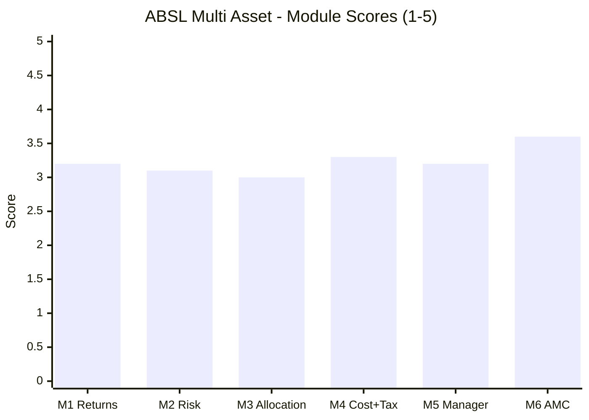

# Aditya Birla Sun Life Multi Asset Allocation Fund — Fund Summary & Verdict

**Direct Plan – Growth · MFAPI 151307 · AUM ₹6,989 Cr · ER 0.67% · launched 31-Jan-2023 · studied Aug 2026**

> **Final weighted score: ≈ 3.18 / 5 — fourth of the five studied MultiAsset funds** (Nippon ≈3.71, SBI ≈3.66, Quant ≈3.20, **ABSL ≈3.18**, UTI ≈3.03). A **well-constructed 5-asset-class portfolio** run by the study's **only fully-attributed team**, which has so far made **every gradeable allocation call correctly** — inside a credible listed house, at a fair fee, beating DIY after tax. Every one of those is a genuine positive. And almost every one comes with the same caveat: **it was earned in 3.49 years of uninterrupted bull market, and when all five funds are measured over those identical days, ABSL finishes LAST on risk-adjusted return.** A competent fund that has done nothing wrong and proved nothing yet.
>
> **⚠ Scores are NOT comparable to the four equity categories** — this fund is measured on a multi-asset re-weight (Risk 25 / Returns 20 / Allocation 20 / Cost+Tax 20 / Manager 10 / AMC 5), against a blended benchmark and a DIY basket, not against a single equity index. **Not investment advice.**

---

## The Six-Module Scorecard

| Module | Topic | Weight | Score | Weighted | One-line |
|--------|-------|--------|-------|----------|----------|
| [M1](module1_returns.md) | Returns & Allocation Alpha | 20% | 3.2 | 0.640 | Best headline numbers in the study; **last of five like-for-like** |
| [M2](module2_risk.md) | **Risk Profile** | **25%** | **3.1** | **0.775** | Best capture asymmetry; **worst like-for-like Sharpe, out-dampened by no-gold cousins** |
| [M3](module3_allocation.md) | Allocation Engine & DNA | 20% | 3.0 | 0.600 | Best-built portfolio after SBI; **no published model, most static signature** |
| [M4](module4_cost_tax.md) | Cost & Tax | 20% | 3.3 | 0.660 | Fair 0.67% ER, real rebalancing shield; **NOT equity-taxed**, 2nd-smallest DIY edge |
| [M5](module5_manager.md) | Manager / Team | 10% | 3.2 | 0.320 | **100% attribution, elite macro seat, all calls right**; no commodities specialist |
| [M6](module6_amc.md) | AMC | 5% | 3.6 | 0.180 | Strong Sun Life JV, honest launch timing; **scarred fixed-income desk** |
| **TOTAL** | | **100%** | | **≈ 3.18** | |

> **The most evenly-scored fund in the study: no module below 3.0, none above 3.6.** No disaster, no distinction — and the two heaviest-weighted modules (Risk 25%, Returns 20%) are among its weakest.

---

## What ABSL Multi Asset Actually Is

Three reframings, each from the data:

1. **Its headline numbers are the category's regime, not ABSL's skill.** The fund shows 17.87% SI CAGR, +4.95%/yr blended alpha, zero negative rolling windows at any horizon, and a comfortable DIY win. Then every studied peer is re-measured over ABSL's *exact* 3.49-year window — and ABSL finishes **last of five on CAGR-adjusted terms, last on Sharpe (1.11), last on Sortino (1.57), and deepest on drawdown (−12.83%).** SBI produced an identical return (17.75%) at **22% less volatility and a third less drawdown.** The alpha is real; it is simply what *any* gold-heavy, equity-tilted book earned in a window where gold returned 27.6%/yr.

2. **The portfolio and the team are genuinely good — better than UTI's on every comparable axis.** Five real asset classes (equity / debt / **gold + silver** / REITs), cheap in-house physical metal ETFs held directly, a real 117-name flexi-cap equity book with off-index conviction (Thermax, Bank of Maharashtra, SEDEMAC) rather than a closet index. And **all three managers have run the fund since inception — the only fund in the study where the record and the people match exactly.** Their calls have been right: they held 16.2% commodities through gold's +71.9% year, trimmed to ~12% *before* gold fell 24.7%, cushioned the 2024–25 correction (+6.7pp), and stayed +3.3% in 2026 while the Nifty fell 6.3%.

3. **It is untested in the only way that matters.** ABSL launched **31 Jan 2023**. It has **never seen 2020, never seen 2022, and never seen a bear market of any kind** — the `no-2022-data` flag at maximum severity. Its flawless "0% negative windows" spans one uninterrupted bull regime and is effectively **one observation**; SBI's identical 0% was measured across 13.4 years including COVID and the 2022 triple-decline. Four correct allocation calls in benign conditions is encouraging. It is not a track record.

---

## The Genuine Strengths

- **⭐ 100% record attribution (M5)** — all three managers since inception; unique in this study. Every other fund's headline record was substantially earned by people no longer running it (SBI ~35%, UTI ~35%, Nippon's architect *left*).
- **⭐ The best allocation-call record of the five (M5)** — every gradeable decision correct, and materially better than UTI's team, which destroyed value at the same turns.
- **⭐ The best-matched macro credential in the study** — Bhupesh Bameta (IIT-Kanpur, **GATE All-India-Rank-1**, ex-Head of Forex & Rates Research at Edelweiss). Allocation *is* a macro call.
- **Best-in-study capture asymmetry (M2)** — 91% upside / 31% downside (2.9×), with a calm worst day of only −3.90%.
- **Well-built 5-class portfolio (M3)** — gold *and* silver via cheap in-house physical ETFs, REITs, and a genuinely active flexi-cap equity book.
- **Beats DIY post-tax (M4)** — +₹1.74L to +₹2.63L on ₹10L over 3.49 years, with a **real rebalancing shield (~0.12–0.20%/yr) that beats SBI's** because the fund actually trims.
- **Honest launch timing (M6)** — NFO closed Jan-2023, ~two months **before** the March-2023 indexation change, into a market below its Dec-2022 peak. Not one of the ~27 tax-wave NFOs.
- **Credible house (M6)** — 25-year Aditya Birla + **Sun Life Financial** JV, listed, nil promoter encumbrance, and the best investment-team disclosure of any AMC studied.

## The Honest Weaknesses

- **⚠ Last of five on the like-for-like window** (M1, M2) — worst Sharpe, worst Sortino, deepest drawdown, second-highest volatility.
- **⚠ Out-dampened by cousins holding no gold** (M2) — more volatile and deeper-drawdown than an Aggressive Hybrid (−9.89%), a Balanced Advantage fund (−10.18%), **and Parag Parikh FlexiCap, a pure equity fund (−10.98%).** The gold sleeve bought no risk advantage.
- **⚠ Never experienced 2020 or 2022** — the two decisive cushioning tests are entirely unevidenced.
- **⚠ NOT equity-taxed** (M4) — middle tier (12.5% only after **24 months**, slab STCG), because net equity sits at **61.92%** with no arbitrage overlay. The gold, silver and debt it exists to hold get no equity-rate shelter.
- **⚠ No published allocation model at all** (M3) — the weakest process disclosure in the study; outcomes cannot be attributed to a method, and a successor would inherit nothing written.
- **Most static return signature of the five** (M3) — R² 0.861; 86% of returns reproducible by a fixed basket.
- **No dedicated commodities specialist** (M5) — the ~12–16% metals sleeve, the fund's whole differentiator, is covered by a *credit analyst*. SBI staffs this properly.
- **Gold-concentration risk is live** (M2) — gold fell −24.71% in 2026, cutting the cushion to just **+2.3pp** vs SBI's +6.5pp.
- **A scarred fixed-income desk** (M6) — ₹793 Cr Essel/Adilink side-pocket (3.7–7.5% of three schemes) + IL&FS downgrade; this fund's debt book holds corporate credit (Cholamandalam).
- **Equity lead is a BFSI sector specialist** (M5) — which is why the book carries **~11% in four banks**, an un-hedged sector bet inside a diversification product.

---

## The Verdict That Matters: Fund vs DIY

The study's central test (framing fact #2) — should you pay ABSL, or assemble the pieces yourself?

| | ABSL Multi Asset | DIY (index fund + debt fund + gold ETF, rebalanced annually) |
|---|---|---|
| 10L lumpsum, 3.49y, post-tax | **₹16.75L** | ₹14.15L (65/25/10) · ₹15.01L (62/10/16) |
| All-in edge to ABSL | **+₹1.74L to +₹2.63L** | — |
| Source of the edge | The **book's return in a gold-friendly regime**, plus a genuine ~0.12–0.20%/yr rebalancing shield | — |
| **NOT** the source | **Tax status** (middle tier — *worse* than DIY on the qualifying window) or allocation skill (unproven) | — |
| **vs peers, same window** | **4th of 5** (+₹2.63L, vs Quant +₹4.97L, Nippon +₹3.56L, UTI +₹3.01L, SBI +₹2.58L) | — |

**ABSL beats do-it-yourself — comfortably in absolute terms, but by less than almost every alternative on the shortlist, and without the tax structure that would make the category's case.** SBI matched ABSL's DIY edge while taking a third less drawdown, which makes SBI's near-identical win materially higher quality risk-adjusted. For an investor who will not rebalance a DIY basket with discipline, ABSL's one-fund simplicity plus a real internal shield is a fair deal. For one who will, the honest math says the gap is thinner than it looks — and was earned in conditions that flattered everyone.

> **A separate and larger decision:** anyone holding the **Regular** plan (1.50% ER) forfeits **~₹1.49 lakh over ten years** on a ₹15k SIP versus Direct (0.67%). That choice matters more than the fund choice.

---

## Where ABSL Sits in the Shortlist

**Fifth of six funds studied; fourth of five on the weighted score.**

| Fund | Score | Character |
|------|-------|-----------|
| Nippon Multi Asset | ≈3.71 | Cheapest ER, widest DIY win; bull-market artifact, architect departed |
| SBI Multi Asset | ≈3.66 | Elite cycle-proven dampener; static book, not equity-taxed |
| Quant Multi Asset | ≈3.20 | Returns leader; equity-like risk, governance cloud |
| **ABSL Multi Asset** | **≈3.18** | **Well-built and well-attributed, but last like-for-like and wholly untested** |
| UTI Multi Asset | ≈3.03 | Closet-equity, negative allocation alpha, wins only on tax |

ABSL lands essentially **tied with Quant (3.20 vs 3.18) by an entirely opposite route** — Quant is high-return / high-risk / bad-governance; ABSL is middling on everything. Against **UTI** it is clearly the better fund: better portfolio construction, better breadth, better allocation calls, cleaner attribution, and none of UTI's value-destroying gold error. Against **SBI and Nippon** it is behind on the evidence that counts — both have seen 2022, both produced better risk-adjusted outcomes over ABSL's own window.

> **⭐ A study-level finding from M2 that bears on any choice here:** ABSL correlates **0.95 with Nippon, 0.94 with SBI, 0.91 with UTI**. On this window the mainstream multi-asset funds are near-interchangeable — **holding two adds essentially nothing.** This is strictly a one-slot decision, to be made on cost, tax status and downside capture.

---

## Monitoring / Review Triggers (if held)

1. **⭐ The first real bear market — the decisive unknown.** Everything this fund claims rests on untested behaviour. Its first genuine equity-and-debt drawdown (a 2022 analogue) is the single event that will confirm or destroy the thesis. Watch it specifically.
2. **Gold sizing and the metals sleeve.** Gold fell −24.71% in 2026 and cut the cushion to +2.3pp. Watch whether the team maintains a meaningful (>12%) metals weight or lets it drift down after the drawdown — and whether it repeats the good 2025 call.
3. **Debt-book credit deterioration.** The AMC's fixed-income desk has documented form (₹793 Cr Essel side-pocket, IL&FS downgrade), and the fund holds corporate credit (Cholamandalam debenture). Any downgrade or side-pocket in the debt sleeve is a material signal.
4. **Debt sleeve vs the SEBI floor.** At **10.26%**, debt sits **26 basis points** above the ≥10%-per-class minimum — the tightest margin in the study. A further trim risks mandate breach.
5. **Tax status (which could improve).** Currently middle-tier at 61.92% net equity. If equity rises durably above 65%, the fund would gain equity taxation — a genuine upgrade. Re-check at each budget and on allocation drift.
6. **Team — especially Bameta.** With **no written allocation process**, the macro brain is the process. His departure would remove the fund's best-matched credential with nothing documented to replace it. Also watch whether a genuine commodities specialist is ever added.
7. **Fee and scale pass-through.** AUM grew 4.4× (₹1,574 Cr → ₹6,989 Cr) with **no visible ER reduction**; Nippon runs 2.3× the size for roughly half the fee.
8. **Correlation creep.** At 0.84 to PP FlexiCap, ~70% already duplicates equity owned. If equity weight rises, the diversification rationale erodes further.

---

## One-Line Verdict

**A genuinely well-built five-asset-class fund — cheap in-house gold *and* silver, a real flexi-cap equity book, the study's only fully-attributed team, and every allocation call correct so far — that nonetheless finishes LAST of five on like-for-like risk-adjusted return, was out-dampened by an Aggressive Hybrid and even a pure equity fund holding no gold, is not equity-taxed, publishes no allocation model, and has never in its 3.49-year life seen a bear market: ≈3.18/5, a competent fund whose case rests almost entirely on evidence that does not yet exist.**

---

*Fund README complete. All six modules + README done (Aug 2 2026). Final weighted score ≈ 3.18/5. Method: MFAPI self-computation (scheme 151307, 858 NAVs, 02-Feb-2023 → 31-Jul-2026) + return-based style analysis at monthly and weekly frequency + **like-for-like same-window re-computation of all four peer funds** (SBI 119843, Nippon 148457, Quant 120821, UTI 120760) + factsheet/web backfill (Groww, ValueResearch, ABSL SAI & investment-team pages, Business Standard). **Standing caveats:** `no-2022-data` at maximum severity; all metrics drawn from a single bull regime; 41 monthly observations make correlations and any dynamic path statistically thin. **Cross-module correction of note:** M3's factsheet backfill overturned M1's "under-harvested gold in 2025" finding (the blend had over-assumed gold at 21% vs an actual ~16%; true 2025 alpha was **+1.4%, not −1.8%**), raising SI alpha to ~+4.95%/yr — M1's score was unchanged because the like-for-like last-place result that drove it is benchmark-free. Fifth of six shortlist funds; feeds the decision tree (sleeve question, fund-vs-DIY, sub-type choice — ABSL is the equity-oriented sub-type's better-constructed but untested case). **Remaining: WOC (WhiteOak) Multi Asset — the conservative sub-type representative — then the decision tree.***
