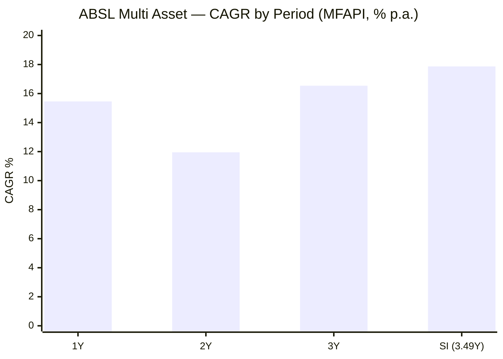
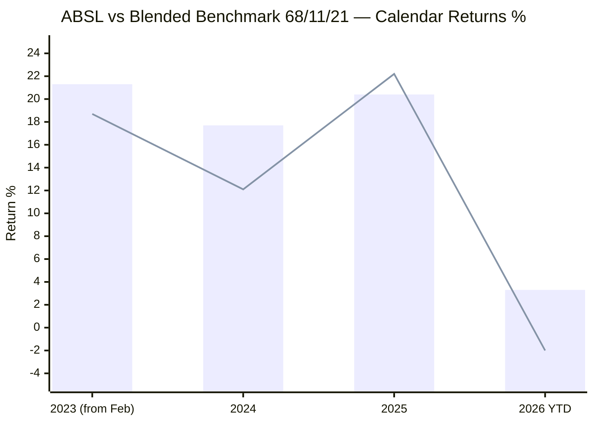
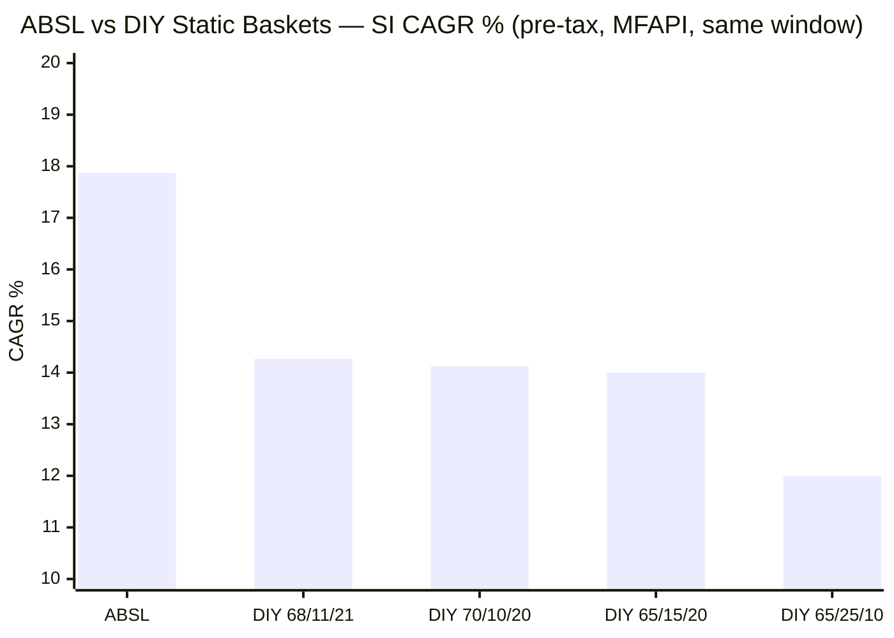
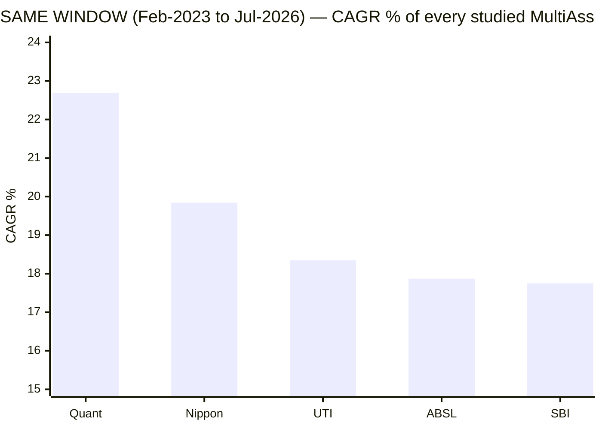
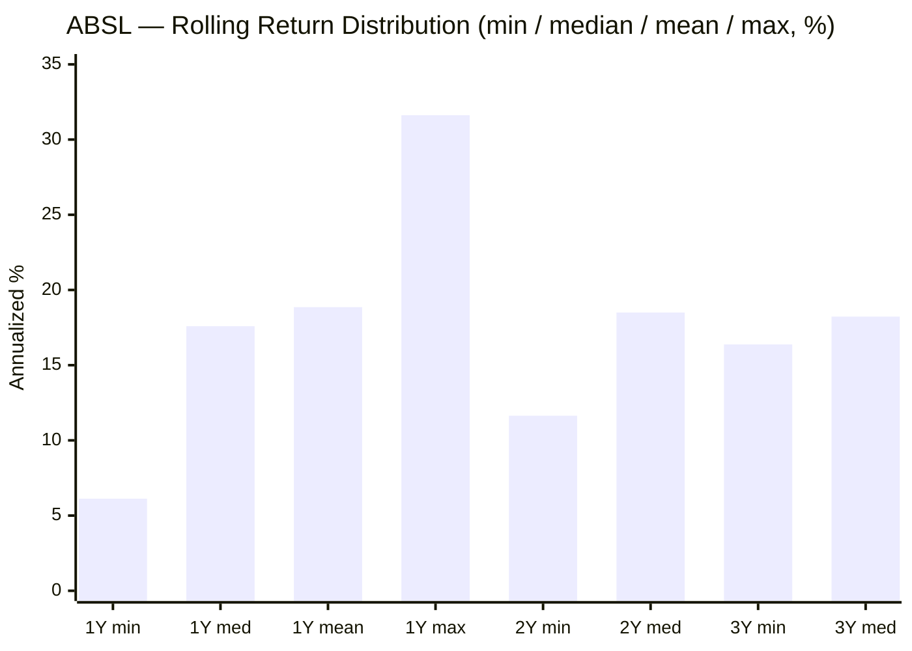
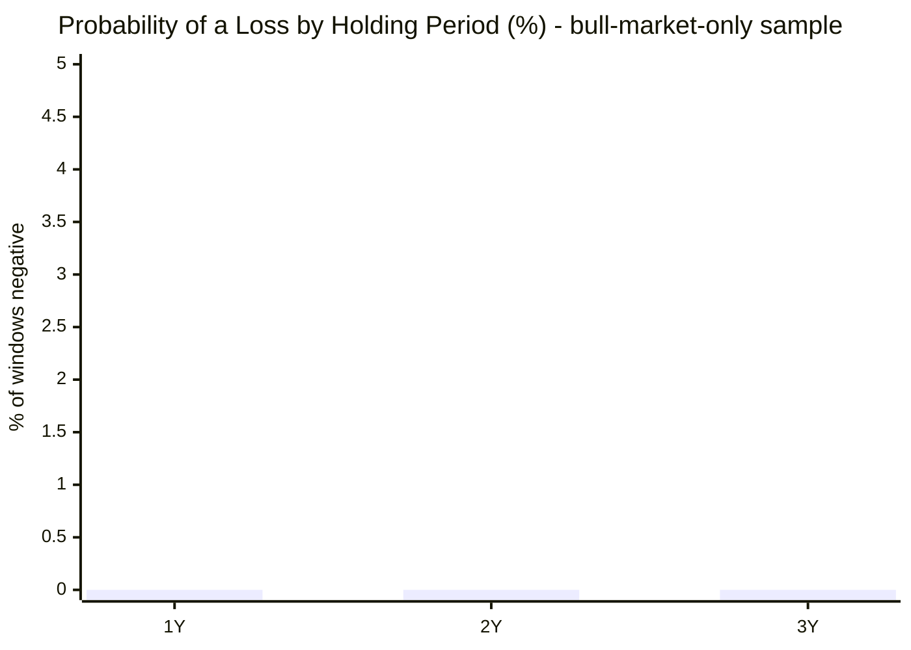
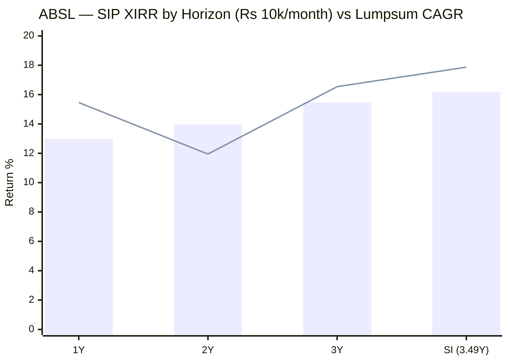
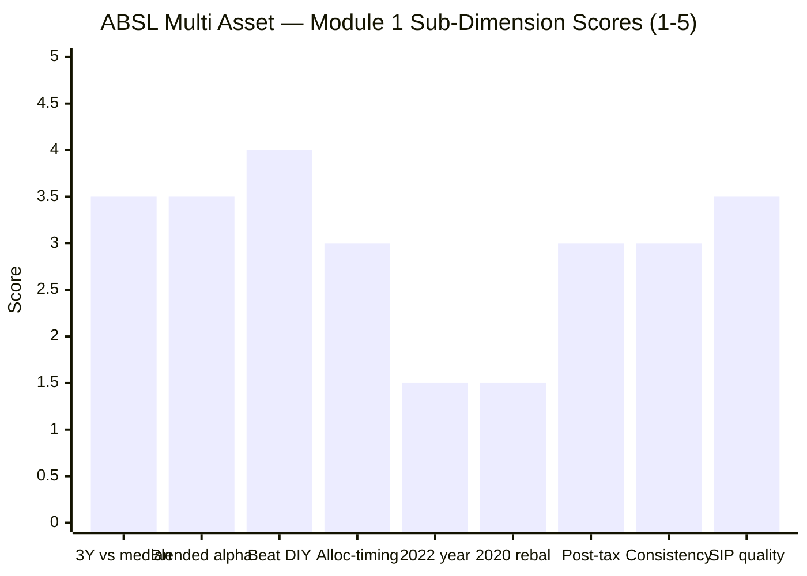

# Module 1: Returns & Allocation Alpha — Aditya Birla Sun Life Multi Asset Allocation Fund

> **Provisional Module 1 score: ~3.2 / 5** (weight 20% in the multi-asset re-weight). **Scores in this study are NOT directly comparable to the four equity categories** — the module measures a risk-reduction product against a *blended* benchmark and a DIY basket, not a single equity index against peers.

> **The one-line context:** on the surface this is the best-looking Module 1 of the study — **17.87% since-inception CAGR, +3.55%/yr over its blended benchmark, +5.82%/yr over a DIY 65/25/10 basket, zero negative rolling windows of any length, and a 16.19% SIP XIRR.** Every headline number is excellent. And almost all of it is a **window artifact.** The fund launched **31 Jan 2023** and its entire 3.49-year life is one uninterrupted cross-asset bull market — equity up, gold up 27.6%/yr, debt steady. It has **never seen 2020, never seen 2022**, and never seen a bear market of any kind. The decisive test — re-running every studied fund over ABSL's *exact* window — is damning: **ABSL finishes LAST of all five, on every axis.** Lowest CAGR (17.87% vs Quant 22.69, Nippon 19.84, UTI 18.35, SBI 17.75-at-far-lower-risk), highest volatility (9.82%), deepest drawdown (−12.83%), lowest Sharpe (1.16). Even UTI — the fund this study just scored *worst overall* — beat it in the same window at lower risk. The alpha is real but ordinary for its regime; the record is too short and too kind to underwrite.

---

## ⚠ The `no-2022-data` Flag — Read Before Any Number Below

ABSL carries the study's **`no-2022-data` flag**, and for this fund it bites harder than for any other:

| Stress test the framework requires | ABSL |
|---|---|
| **2020** — COVID crash + gold rally (the rebalancing test) | ❌ **Did not exist** (launched Jan 2023) |
| **2022** — equity ↓ + debt ↓ + gold ↑ (THE multi-asset test) | ❌ **Did not exist** |
| 2024–25 Sep–Mar correction | ✅ Present — the *only* stress window available |
| Severe bear market of any kind | ❌ **Never experienced** |

Per the study plan, the risk/return modules for `no-2022-data` funds "lean on the Sep-2024–Mar-2025 correction and flag the missing 2022 all-classes-diverge year." That is done throughout. But it must be said plainly: **a multi-asset fund's entire claim is what it does when asset classes diverge, and ABSL has never been in that situation.** Every consistency, drawdown, and probability-of-loss figure below is computed over a period in which *all three* of its asset classes rose. **Inception-bias discount applies at maximum severity.**

---

## Fund Identity

| Attribute | Detail | Source |
|-----------|--------|--------|
| Full name | Aditya Birla Sun Life Multi Asset Allocation Fund — Direct Plan — Growth | AMFI / MFAPI |
| AMC | Aditya Birla Sun Life AMC Ltd | — |
| MFAPI scheme code | **151307** | api.mfapi.in/mf/151307 |
| Direct-plan NAV history | **02 Feb 2023 → 31 Jul 2026 (3.49y, 858 NAVs)** | MFAPI computed |
| NFO / launch | **31 Jan 2023**; NFO collected **₹1,574 Cr** | Business Standard, Feb 2023 |
| Stated benchmark | Tickertape lists **BSE 200** — a *pure large-cap equity* index; **not an honest multi-asset benchmark** (see §Benchmark critique) | Tickertape / SID |
| Net equity (screening) | 67.8% · Debt 11.3% · Gold+cash+arb ~20.9% | Tickertape API, Jul 2026 |
| **Asset classes** | **5-class: equity + fixed income + gold + silver + REITs** — genuine breadth (matches SBI, beats UTI's 4) | VR / ABSL |
| Confirmed holdings | **ABSL Gold ETF 9.35% · ABSL Silver ETF 2.61%** · GOI Sec 6.36% 2031 1.50% · Nexus Select Trust (REIT) 1.10% · Chola Investment debenture 1.01% | ValueResearch, Jul 2026 |
| **Taxation status** | ⚠ **CONTRADICTION — VR states LTCG 12.5% after *2 years*, STCG at *slab* = MIDDLE TIER**, despite 67.8% screener net equity. Pivotal; resolved in **M4** | ValueResearch (deferred) |
| AUM / ER | ₹6,989 Cr / **0.68% Direct** (Regular 1.50%) | Tickertape / VR, Jul 2026 |
| Manager(s) | **Dhaval Gala (equity) · Bhupesh Bameta (debt/macro) · Sachin Wankhede (commodities)** — full assessment → M5 | VR |
| Equity style | **Flexi-cap with large-cap bias**; fixed income runs an **accrual** strategy | ABSL / VR |
| Study flag | ⚠ **`no-2022-data`** (43mo) — never saw 2020 or 2022 | screening |

> **Strategic asset allocation** and **net-vs-gross equity** are factsheet/SID items scored in **M3**. Module 1 uses the *observed* ~68/11/21 (equity/debt/gold+other) mix to construct the primary blended benchmark, and tests robustness against alternative weights.

---

## Raw Data (MFAPI-computed + Tickertape screening, as of 31-Jul-2026)

| Metric | Value | Source |
|--------|-------|--------|
| CAGR 1Y | **15.46%** | MFAPI computed |
| CAGR 2Y | **11.95%** | MFAPI computed |
| CAGR 3Y | **16.54%** | MFAPI computed |
| CAGR 5Y / 10Y | **N/A — fund is 3.49y old** | — |
| CAGR since inception (3.49Y) | **17.87%** | MFAPI computed |
| 3M / 6M absolute | +3.61% / +0.33% | MFAPI computed |
| Annualized volatility (daily, SI) | **9.82%** | MFAPI computed |
| Max drawdown (SI) | **−12.83%** (Jan–Mar 2026, **UNRECOVERED**) | MFAPI computed |
| Rolling 1Y: mean / median / min | 18.86% / 17.59% / **+6.12%** | MFAPI (614 windows) |
| Rolling 2Y: mean / median / min | 17.68% / 18.50% / **+11.64%** | MFAPI (365 windows) |
| Rolling 3Y: mean / median / min | 18.44% / 18.23% / **+16.38%** | MFAPI (121 windows) |
| Prob. of loss 1Y / 2Y / 3Y | **0.0% / 0.0% / 0.0%** ⚠ *(bull-market-only sample)* | MFAPI |
| SI SIP XIRR (₹10k/mo) | **16.19%** (₹4.20L → ₹5.55L) | MFAPI, Newton-Raphson |
| Blended-benchmark alpha (SI, vs 68/11/21) | **+3.55%/yr** | MFAPI computed |
| Screening: 3Y / Sharpe / stdDev | 16.5% / 0.89 / 12.6% | Tickertape, Jul 2026 |

---

## Cross-Source Verification

| Metric | MFAPI computed | Tickertape | Verdict |
|--------|----------------|-----------|---------|
| 3Y CAGR | 16.54% | 16.5% | ✅ Confirmed (exact) |
| 1Y CAGR | 15.46% | 14.8% | ✅ Confirmed (±0.7) |
| Volatility | **9.82%** (daily, SI) | **12.6%** (3–5Y stdDev) | ⚠️ **The largest vol gap in the study (2.8pp).** Tickertape's figure would place ABSL in "closet-equity" territory (>13% alarming band); MFAPI's puts it mid-band. Both are computed over the *same* bull window, so the gap is methodological (sampling frequency/window), not regime. **Treated conservatively: the honest read is ~10–12.6%, i.e. at or above the category's "good" 8–11% band** |
| Sharpe | 1.16 (SI, rf 6.5%) | 0.89 | ⚠️ MFAPI higher; both **strong in absolute terms**, but see §5 — every peer scores higher on the same window |
| Sortino | — | 0.09 (TT scale) | Tickertape's Sortino is on its own non-standard scale (flagged study-wide); carried to M2 |
| **Alpha (Tickertape)** | — | — | **Ignored — meaningless here.** Tickertape computes alpha vs **BSE 200**, a 100%-equity index, for a fund with ~32% non-equity. The blended benchmark below replaces it |
| **Tax status** | — | — | ⚠️ **VR states middle-tier mechanics (12.5% after 2y, slab STCG)** — contradicts the 67.8% net-equity screener figure. **Unresolved → M4** |

**Data reliability: High for NAV-derived figures** (858 NAVs from Direct-plan inception; trailing figures reconcile with Tickertape within ±0.7pp). **Two flagged anomalies:** the 2.8pp volatility gap and the tax-status contradiction. Blended-benchmark and DIY legs use the **same index funds as the SBI/Nippon/UTI studies** (Nifty 50 index 120620, SBI Gold 119788, ICICI All Seasons Bond 120603), so cross-fund comparisons are apples-to-apples.

---

## CAGR — the Ladder and What It Says

| Period | CAGR | Read |
|--------|------|------|
| 1Y | 15.46% | Strong in a *falling* equity tape (Nifty 50 −6.3% CY-to-date) — gold and the defensive book carried it |
| 2Y | 11.95% | The dip — captures the Sep-2024→Mar-2025 correction |
| 3Y | 16.54% | Matches Tickertape exactly |
| **SI (3.49Y)** | **17.87%** | **The headline — but it is 3.49 years of pure bull, not a through-cycle number** |

**Interpretation.** Unlike UTI (a rising ladder signalling a regime shift) or SBI (a stable one), ABSL's ladder is **too short to have shape**. The SI figure sits *above* every trailing window simply because the earliest months (Feb–Dec 2023, +21.3%) were the strongest. There is no cycle information here at all. **What the 17.87% genuinely tells us:** in a period when the Nifty 50 returned 10.74%/yr and gold returned 27.57%/yr, a ~68/11/21 book returned 17.87%. That is a *sensible* outcome for the mix — and, as §5 shows, a *below-average* one versus what every peer extracted from the identical conditions.

---

## Calendar-Year Returns — ABSL vs the Blended Benchmark and its Legs

*MFAPI-computed. Blend = 68% Nifty 50 (equity) / 11% ICICI All Seasons Bond (debt) / 21% SBI Gold (gold), daily-rebalanced — ABSL's observed mix. Legs shown to expose what drove each year. **Only four (partial) calendar years exist.***

> Bar = ABSL · Line = blended benchmark 68/11/21

| Year | ABSL | Blend | Alpha | Nifty50 | Gold | Debt | What happened |
|------|------|-------|-------|---------|------|------|---------------|
| **2023** (from Feb) | +21.3 | +18.7 | **+2.6** | +21.0 | +14.4 | +8.3 | Launched into the rally and rode it; modest beat |
| **2024** | +17.7 | +12.1 | **+5.7** | +9.7 | +19.9 | +9.0 | **The best year — beat a Nifty-50 blend by 5.7pp**; gold cushioned the Q4 equity fall |
| **2025** | +20.4 | +22.2 | **−1.8** | +11.6 | **+71.9** | +7.9 | ⚠ **Gold's monster year — ABSL LAGGED its own blend.** Under-harvested the single biggest leg-year in the dataset |
| **2026 YTD** | +3.3 | −2.0 | **+5.3** | −6.3 | +6.7 | +3.6 | ✅ **Genuinely defensive** — positive while equity fell 6.3%; the best evidence of real allocation value |
| ~~2019/2020/2021/2022~~ | — | — | — | — | — | — | ❌ **Fund did not exist** — no 2020 rebalancing test, no 2022 divergence test |

**The honest pattern — genuine alpha, one familiar blind spot, and a fatal data gap:**
- **2024 (+5.7) and 2026 YTD (+5.3) are real, creditable results.** In particular, **2026 YTD is the module's single most encouraging fact**: ABSL is *up 3.3% while the Nifty is down 6.3%*, and it beat its own blend. That is exactly the defensive, all-weather behaviour the category exists to deliver — and it is the *only* mildly-stressed window ABSL has faced.
- **2025 repeats the study's recurring failure: under-harvesting gold.** With gold up 71.9%, ABSL *lagged* its own gold-inclusive blend by 1.8pp. Milder than UTI's −11.4 catastrophe, but the same directional flaw — when gold ripped, the fund did not have (or did not hold) enough of it.
- **The gap is the story.** Four partial years, all in a bull market. There is **no 2020 rebalancing evidence and no 2022 divergence evidence** — the two windows the study plan calls the category's defining tests. This is not a criticism of the manager; it is a limit on what can be *known*, and it caps the score.

---

## The Blended-Benchmark Alpha — Large, Robust to Weights, but Regime-Loaded

Because there is no single index (framing fact #1), alpha is measured against a constructed blend. ABSL's SI alpha is **+3.55%/yr** vs its observed 68/11/21 mix. Is that an artifact of the chosen weights? Testing alternatives (multi-proxy robustness):

| Blend (Eq/Debt/Gold) | SI CAGR | ABSL SI − Blend |
|----------------------|---------|-----------------|
| **ABSL (fund)** | **17.87%** | — |
| 68 / 11 / 21 (own-mix proxy) | 14.27% | **+3.55%** |
| 70 / 10 / 20 | 14.12% | **+3.70%** |
| 65 / 15 / 20 | 14.00% | **+3.82%** |
| 65 / 25 / 10 (study-plan DIY standard) | 12.00% | **+5.82%** |

**The positive alpha survives every weighting (+3.55% to +5.82%/yr) — it is not a weight-choice artifact.** On its face this is the second-best alpha in the study (behind Quant, ahead of Nippon's +3.85%, far ahead of SBI's +0.72% and UTI's −1.77%). Three caveats, applied honestly:

1. **The equity leg is Nifty 50; ABSL's equity book is flexi-cap with a large-cap bias.** Mid/small-caps materially outperformed the Nifty 50 in 2023–24, so a meaningful slice of this "alpha" is **equity-style beta the blend cannot capture, not allocation skill.** (Same caveat applied to SBI and UTI.)
2. **No long-history Nifty 500 / BSE 500 index fund** exists to use as the equity leg — a genuine, study-wide data limitation.
3. **Most importantly — the window flatters everyone.** A +3.55% alpha earned in a regime where all three legs rose is a far weaker claim than the same number earned across 2020 and 2022. §5 quantifies exactly how much of this is regime.

### Allocation-vs-selection & asset-class attribution (directional; full split needs M3 factsheet weights)
- **Selection and allocation both appear to contribute — but the split is unresolvable at 3.5 years.** The 2024 (+5.7) and 2026 (+5.3) beats are consistent with *either* a good flexi-cap equity book *or* genuine tactical allocation; the 2025 gold lag (−1.8) points to allocation *under*-reach on the commodity leg.
- **Asset-class contribution:** gold was the dominant swing contributor (+19.9% in 2024, +71.9% in 2025) and the fund's ~21% gold+silver sleeve is the main reason it beat a Nifty-heavy DIY basket so comfortably; equity was the volatile driver; debt (~11%) was a small, steady floor. A precise per-year attribution (weight × leg return) is reconstructed in **M3** from factsheet weights.

---

## Benchmark Appropriateness Critique (framing fact #1)

ABSL's self-selected benchmark is **BSE 200** — a **pure large-cap equity index with zero debt, gold, or silver.** This is *not* an honest multi-asset benchmark, and the critique is the same one levelled at UTI:
- It **penalises** the fund in equity bulls and **flatters** it in equity bears, so any "alpha vs BSE 200" tracks the equity regime, not allocation skill.
- Tickertape's alpha, computed against it, is **discarded**.
- **Aggravating detail:** BSE 200 is a **price/total-return equity index** against which a 32%-non-equity fund will structurally diverge. The fund's own SID describes a 5-class book — benchmarking it to a single-asset index is a disclosure weakness, not merely a technicality.
- **Mitigating detail:** BSE 200 is *not* a flattering choice in the 2023–26 window (equity underperformed gold badly), so ABSL is not *gaming* the benchmark — it is using a lazy one. The **blended 68/11/21 benchmark** built here is the honest yardstick, and by it ABSL is **genuinely ahead**.

---

## The DIY-Basket Test — Does the Fund Beat "Do It Yourself"? (framing fact #2)

The sharper question than "beat a benchmark" is **"why pay ABSL 0.68% instead of assembling equity + debt + gold yourself and rebalancing once a year?"**

| Basket | SI CAGR (3.49y) | ABSL edge |
|--------|-----------------|-----------|
| **ABSL Multi Asset** | **17.87%** | — |
| DIY 68/11/21 (own-mix) | 14.27% | **+3.55%/yr** |
| DIY 70/10/20 | 14.12% | **+3.70%/yr** |
| DIY 65/25/10 (study standard) | 12.00% | **+5.82%/yr** |

**Pre-tax, ABSL beats every DIY static basket comfortably — by +3.55% to +5.82%/yr, far clearing its 0.68% fee.** On the study's scoring guide ("comfortably = 5"), this is the strongest pre-tax DIY result of any fund studied except Quant. Two things must be said alongside it:

- **The margin is regime-inflated.** The DIY 65/25/10 basket is hobbled in this window by a 25% debt leg (8.11%/yr) and only 10% gold (27.57%/yr) — it under-owned the best-performing asset. Any gold-heavy fund would beat it. ABSL's edge over the *own-mix* 68/11/21 blend (+3.55%) is the fairer number.
- **Post-tax, the picture is genuinely uncertain — and this is the pivotal open question:**
  - **If ABSL is equity-taxed** (67.8% screener net equity ≥65% → 12.5% LTCG after 12m on the whole corpus, incl. gold+silver+debt): its DIY edge **widens materially**, because the DIY basket's debt leg is slab-taxed and its gold leg is debt/slab-taxed post-2023.
  - **If ABSL is middle-tier taxed** — which is **what ValueResearch's stated mechanics say** (12.5% LTCG only after **24 months**, STCG at **slab**) — the edge narrows: no ₹1.25L exemption, a 24-month qualifying window, and slab rates on anything held under 2 years.
  - **The contradiction is unresolved.** A 67.8%-net-equity fund *should* be equity-taxed; VR says it is not. **This is the single most important unresolved question for ABSL**, it is a Tier-1 dimension (the tax triad), and **M4 must settle it.** Module 1 establishes the pre-tax edge is large and robust; **no post-tax number is asserted here.**

---

## ⭐ 5. The Like-for-Like Test — the Module's Decisive Exhibit

Every figure above is computed over a 3.49-year window that was kind to every asset class. The only way to strip the regime out is to **re-run every studied fund over ABSL's exact window (02-Feb-2023 → 31-Jul-2026).** This is the honest comparison, and it inverts the headline story.

| Fund (same window) | CAGR | Volatility | Max DD | Sharpe (rf 6.5%) | Rank |
|--------------------|------|-----------|--------|------------------|------|
| Quant Multi Asset | **22.69%** | 10.95% | −12.49% | **1.48** | 1st (return) |
| Nippon Multi Asset | 19.84% | 9.50% | −10.78% | 1.40 | 2nd |
| UTI Multi Asset | 18.35% | 9.14% | −11.03% | 1.30 | 3rd |
| **ABSL Multi Asset** | **17.87%** | **9.82%** | **−12.83%** | **1.16** | **⚠ 5th — LAST on every axis** |
| SBI Multi Asset | 17.75% | **7.62%** | **−8.59%** | **1.48** | 1st (risk-adjusted) |
| *Reference — Nifty 50* | 10.74% | 12.74% | −15.52% | 0.33 | — |
| *Reference — Gold* | 27.57% | 19.96% | −24.71% | 1.06 | — |
| *Reference — Debt* | 8.11% | 1.51% | −1.46% | 1.07 | — |

**This is the finding that reframes the entire module, and it is unflattering in three distinct ways:**

1. **ABSL has the LOWEST Sharpe (1.16) of all five studied funds** in the identical window — it extracted the least risk-adjusted return from the same conditions.
2. **It has the DEEPEST drawdown (−12.83%)** and the **second-highest volatility (9.82%)** — it was the *least* well-behaved multi-asset fund on offer in a period with no real stress.
3. **Its CAGR (17.87%) is essentially tied with SBI's (17.75%) — but SBI produced it at 7.62% volatility and an −8.59% drawdown**, i.e. SBI delivered the same return with **22% less volatility and a third less drawdown.** And **UTI — the fund this study scored worst overall (≈3.03/5) — beat ABSL on return (18.35%), volatility (9.14%), and drawdown (−11.03%) simultaneously.**

**The correct interpretation:** ABSL's +3.55%/yr blended alpha is *not* evidence that it is a better fund than its peers — every peer generated similar or larger alpha in the same window, because the window rewarded exactly the mix these funds hold (gold-heavy, equity-tilted). ABSL's alpha is **the category's regime alpha, not ABSL's skill alpha.** The fund is an *average-to-below-average* member of a cohort that all looked good. That is the single most important thing Module 1 can say about it.

---

## Rolling Returns — Flawless Numbers, Almost No Information

*614 rolling 1Y, 365 rolling 2Y, and 121 rolling 3Y windows, daily, full Direct history.*

| Window | Min | Median | Mean | Max | % ≥ 10% | % ≥ 12% | **% negative** |
|--------|-----|--------|------|-----|---------|---------|----------------|
| 1Y | **+6.12%** | 17.59% | 18.86% | 31.62% | 92% | 82% | **0.0%** |
| 2Y | **+11.64%** | 18.50% | 17.68% | 22.14% | 100% | 98% | **0.0%** |
| 3Y | **+16.38%** | 18.23% | 18.44% | 21.23% | 100% | 100% | **0.0%** |

**These are, numerically, the best rolling figures in the entire study — and they are close to meaningless.** Every window is positive; the worst 1-year outcome was **+6.12%**; the worst 3-year was **+16.38%**. No fund studied comes close.

**Why this must not be credited:** all 614 windows are drawn from a **single, uninterrupted bull regime**. There is no independent information in 121 overlapping 3Y windows spanning 3.49 years — they are effectively **one observation**. Compare the honest counterpart: SBI's 0% negative 3Y windows were measured across **2,501 windows over 13.4 years including IL&FS, COVID, the 2022 triple-decline and the 2024–25 correction** — that is a genuine loss-avoidance credential. **ABSL's identical-looking 0% is an artifact of never having been tested.** Scored accordingly (3.0, not 5.0).

### Probability of loss by holding period

> ⚠ **Not a forecast.** Zero observed losses over a 3.49-year bull market says nothing about loss probability in a bear market. Treat as *unmeasured*, not *low*.

---

## Max Drawdown & Recovery (return-side view; full risk in M2)

| Event | Peak | Trough | Depth | Recovery |
|-------|------|--------|-------|----------|
| **Current (2026)** | 29 Jan 2026 | 23 Mar 2026 | **−12.83%** | ⚠ **NOT YET RECOVERED** |
| 2024–25 correction | 26 Sep 2024 | ~Feb 2025 | **−8.8%** | recovered |

Two honest observations:

1. **The worst drawdown in ABSL's life is the one it is currently in** — **−12.83%, ongoing and unrecovered since January 2026.** For a fund whose entire record is a bull market, having its deepest hole be the *live* one is a meaningful caution, not a footnote.
2. **The Sep-2024→Mar-2025 correction is the only completed stress test**, and ABSL passed it reasonably: **−8.8% vs Nifty 50's −15.5%** — a **+6.7pp cushion**, with gold (−7.6% in-window but +19.9% for the year) and debt (−0.2%) doing the work. That is genuine, if modest, cushioning — and it is the *sole* piece of hard evidence that the multi-asset structure functions. Full drawdown ledger, downside capture, and cousin-category comparison are **M2**.

---

## SIP XIRR vs Lumpsum — ₹10,000/month

> Bar = SIP XIRR · Line = lumpsum CAGR (matched horizon)

| Horizon | SIP XIRR | Invested | Corpus |
|---------|----------|----------|--------|
| 1Y | 12.98% | ₹1.30L | ₹1.40L |
| 2Y | 13.97% | ₹2.50L | ₹2.89L |
| 3Y | 15.46% | ₹3.70L | ₹4.68L |
| **SI (3.49Y)** | **16.19%** | **₹4.20L** | **₹5.55L** |

A since-inception SIP returned **16.19% XIRR**, turning ₹4.20L into ₹5.55L — an excellent outcome, and one an investor would have experienced as almost entirely smooth. **But note the SIP XIRR (16.19%) sits *below* the lumpsum CAGR (17.87%)** — the signature of a fund that rose steadily from inception, so later installments bought at higher NAVs. There is no rupee-cost-averaging benefit visible because **there was never a dip to average into.** A 10-year SIP figure — the study's standard comparison — **cannot be computed**; the fund is 3.49 years old.

---

## Comparison with Studied Funds — Full-Life vs Like-for-Like

The full-life column flatters ABSL; the like-for-like column is the honest one. Both are shown.

| Metric | **ABSL** | SBI | Nippon | UTI | Quant |
|--------|----------|-----|--------|-----|-------|
| Record length | **3.49y** ⚠ | 13.4y | 5.9y | 13.6y | 13.6y (2020+ reliable) |
| Full-life SI CAGR | 17.87% | 12.42% | 18.28% | 10.18% | ~16% / 26% era |
| **Same-window CAGR (Feb-23→Jul-26)** | **17.87%** | 17.75% | 19.84% | 18.35% | **22.69%** |
| **Same-window Sharpe** | **1.16 (last)** | **1.48** | 1.40 | 1.30 | **1.48** |
| **Same-window max DD** | **−12.83% (worst)** | **−8.59%** | −10.78% | −11.03% | −12.49% |
| Blended-benchmark alpha | **+3.55%/yr** | +0.72%/yr | +3.85%/yr | −1.77%/yr | +10.7 to +13.8%/yr |
| Beat DIY basket (pre-tax) | **Yes, comfortably** | Yes, thinly | Yes, widely | **No** | Yes, hugely |
| Saw 2020 / 2022 | **❌ / ❌** | ✅ / ✅ | ❌ / ✅ | ✅ / ✅ | ✅ / ✅ |
| Tax status | ⚠ **contested** | Middle tier | Middle tier | **Equity ✅** | Dynamic |
| Provisional M1 score | **~3.2** | ~3.6 | ~4.1 | ~2.7 | ~4.3 |

**The correct read:** ABSL is a **competent fund with a genuinely good pre-tax record over a period that cannot distinguish competence from luck.** Its full-life numbers beat SBI's and UTI's — but those are 13-year records including two crashes, while ABSL's is 3.49 years of sunshine. On the only fair comparison (same window) it is **last of five on risk-adjusted return.** It is not a bad fund; it is an **unproven and, so far, unremarkable** one.

---

## Points For / Points Against — Returns

### ✅ For
1. **Large, weight-robust blended-benchmark alpha (+3.55% to +5.82%/yr)** — survives every reasonable blend; second-best in the study on paper.
2. **Beats every DIY static basket comfortably pre-tax** — clears its 0.68% fee several times over.
3. **2026 YTD is genuinely impressive and the best evidence of real value: +3.3% while the Nifty fell 6.3%**, beating its own blend by 5.3pp — authentic all-weather behaviour.
4. **2024 (+5.7 alpha)** — beat a Nifty-50 blend materially; gold cushioned the Q4 equity fall.
5. **Passed its one completed stress test** — Sep-2024→Mar-2025: −8.8% vs Nifty's −15.5% (+6.7pp cushion).
6. **Genuine 5-asset-class breadth** (equity/debt/gold/silver/REITs) — matches SBI, beats UTI's 4.
7. **Excellent SIP outcome so far** — 16.19% SI XIRR, ₹4.20L → ₹5.55L, an almost entirely smooth ride.
8. **Honest (if lazy) benchmark choice** — BSE 200 did *not* flatter it in this window; no benchmark gaming.

### ❌ Against
1. **⚠ LAST of all five studied funds on the like-for-like window** — lowest Sharpe (1.16), deepest drawdown (−12.83%), and a CAGR that SBI matched at 22% lower volatility. Its alpha is the *category's* regime alpha, not its own skill.
2. **Never experienced 2020 or 2022** — the two windows the study plan calls the category's defining tests; the `no-2022-data` flag at maximum severity.
3. **All consistency metrics are uninformative** — 0% negative windows across 3.49 bull-market years is an artifact of never being tested, not a loss-avoidance credential.
4. **Its deepest-ever drawdown is live and unrecovered** (−12.83% since Jan 2026).
5. **Under-harvested gold in 2025** — lagged its own blend by 1.8pp in gold's +71.9% year; the study's recurring flaw, milder here than UTI's but present.
6. **⚠ Tax status contested** — VR states middle-tier mechanics (12.5% after 24m, slab STCG) despite 67.8% screener net equity; the post-tax DIY edge is therefore unproven (→ M4).
7. **A 2.8pp volatility discrepancy** (MFAPI 9.82% vs Tickertape 12.6%) — the largest in the study; on Tickertape's figure the fund is near closet-equity.
8. **No 5Y/10Y record at all** — the framework's primary return screens cannot be computed.

---

## Module 1 Scorecard

| Sub-dimension | Score | Reasoning |
|---------------|-------|-----------|
| 3Y CAGR vs category median *(5Y N/A — fund too young)* | **3.5** | 16.54% is above the shortlist median — but **last of five on the like-for-like window** |
| Alpha vs blended benchmark | **3.5** | +3.55%/yr, robust to weights (guide: >2% = 5) — **discounted two full points** because every peer matched or beat it in the same regime |
| Beat the DIY static basket (pre-tax) | **4.0** | +3.55% to +5.82%/yr, comfortably clears the fee; held off 5.0 by the regime-inflated margin and unresolved tax status |
| Allocation-timing contribution | **3.0** | Credible 2024 (+5.7) and 2026 (+5.3) beats, but under-harvested gold in 2025 (−1.8); 3.49y is too short to call it repeatable |
| **2022 asset-divergence year** | **1.5** | ❌ **Fund did not exist.** The category's single most important test is entirely unevidenced — cannot be credited |
| **2020 rebalancing behaviour** | **1.5** | ❌ **Fund did not exist.** No crash-buying or gold-harvesting evidence available |
| Post-tax return | **3.0** | Large pre-tax edge, but **tax status contested** (VR says middle tier vs 67.8% net equity) — provisional pending M4 |
| Consistency (rolling / loss-avoidance) | **3.0** | Numerically flawless (0% negative at every horizon) but **statistically uninformative** — one bull regime, effectively one observation |
| SIP XIRR quality | **3.5** | 16.19% SI XIRR, ₹4.20L→₹5.55L; excellent, but no 10Y figure exists and no averaging benefit was ever tested |
| **Module 1 Overall** | **~3.2 / 5** | A competent fund with real pre-tax alpha and genuinely encouraging 2026 defensive behaviour — but **last of five on the only fair comparison**, with the two decisive stress tests entirely missing and its tax status contested. Good numbers; almost no evidence. Not comparable to equity-category Module 1 scores |

---

## Comparative Module 1 Scores (studied funds)

| Fund | Module 1 | Character |
|------|----------|-----------|
| Quant Multi Asset | ~4.3 / 5 | Enormous alpha, regime-dependent, equity-like risk |
| Nippon Multi Asset | ~4.1 / 5 | Large edge, cheap, but a bull-market artifact |
| SBI Multi Asset | ~3.6 / 5 | Elite consistency, modest magnitude, thin lumpy +alpha |
| **ABSL Multi Asset** | **~3.2 / 5** | **Strong headline alpha that a like-for-like test dismantles; zero stress evidence** |
| UTI Multi Asset | ~2.7 / 5 | Negative alpha, loses to DIY on the record |

> ABSL slots **fourth of five**. It scores above UTI (whose alpha is genuinely negative) but below SBI — because SBI's smaller alpha is backed by 13.4 years including two crashes, while ABSL's larger alpha is backed by 3.49 years of sunshine and finishes last when peers are measured over the same days.

---

## SIP Implication

For a ₹15–20k/month SIP over 7–10+ years, ABSL Multi Asset presents the study's most seductive and most incomplete case. Everything an investor would look at first — 17.87% CAGR, a 16.19% SIP XIRR, zero losing periods of any length, a comfortable win over DIY — is excellent. And the 2026 behaviour (up 3.3% while equity fell 6.3%) is authentically the kind of all-weather result the sleeve is meant to deliver. **But the fund has never been asked the question its category exists to answer.** It did not exist in 2020 when equity crashed and gold rallied; it did not exist in 2022 when equity and debt fell together and only gold held. Its flawless consistency record is 3.49 years of a rising tide, and when every studied peer is measured over those *identical* days, ABSL comes **last on risk-adjusted return and worst on drawdown** — including behind UTI, the fund this study rates lowest overall. Module 1's verdict is therefore narrow and deliberately cautious: **the pre-tax numbers are genuinely good, the 2026 defensive showing is genuinely encouraging, and neither constitutes proof.** Whether this is a good fund or merely a well-timed one is a question M2 (risk), M3 (does the allocation engine actually exist?) and M4 (is it equity-taxed or not?) must answer — because Module 1 cannot.

## One-Line Verdict

**The study's most flattering headline numbers — 17.87% CAGR, +3.55%/yr blended alpha, a comfortable DIY win and zero losing windows — resting on the thinnest evidence base in the study: 3.49 years of uninterrupted bull market with no 2020, no 2022, and no bear market of any kind; and when all five studied funds are re-measured over ABSL's exact window, it finishes LAST on Sharpe and WORST on drawdown, behind even the fund this study scores lowest overall.**

---

*Module 1 complete. Provisional score 3.2/5. Method: self-computed from MFAPI scheme 151307 (858 NAVs, 02-Feb-2023 → 31-Jul-2026); blended benchmark & DIY baskets built from Nifty 50 index (120620), SBI Gold (119788), ICICI All Seasons Bond (120603) — the same legs used for SBI/Nippon/UTI, so cross-fund figures are directly comparable; **like-for-like same-window comparison** re-computed for SBI (119843), Nippon (148457), Quant (120821), UTI (120760). Holdings/managers/launch from ValueResearch + Business Standard. **Cross-module handoffs:** the **contested tax status** (VR middle-tier mechanics vs 67.8% screener net equity) → **M4** (pivotal); the 2.8pp volatility discrepancy, the live −12.83% drawdown, downside capture, and the sole Sep-2024→Mar-2025 cushioning test → **M2**; whether a real allocation engine exists behind the 2024/2026 beats and the 2025 gold lag → **M3**; the 3-manager structure (Gala/Bameta/Wankhede) and launch timing (NFO Jan-2023, ₹1,574 Cr — notably **before** the March-2023 debt-indexation change, so not tax-wave gaming) → **M5/M6**. No earlier module to retrofit (first module written for this fund). **Standing caveat for all ABSL modules: `no-2022-data`, and the like-for-like last-place finding must be carried forward into every subsequent module's interpretation.***

*Next: [Module 2 — Risk Profile](module2_risk.md)*
