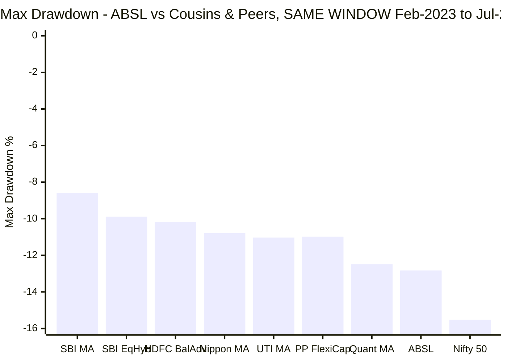
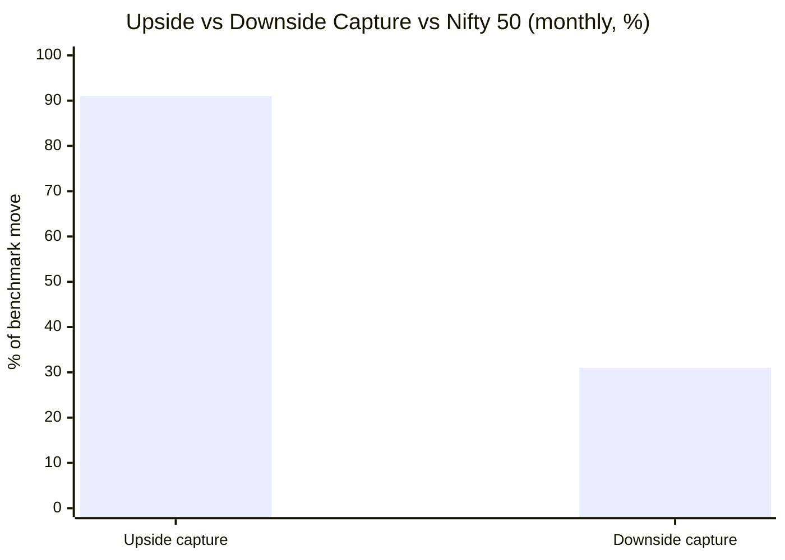
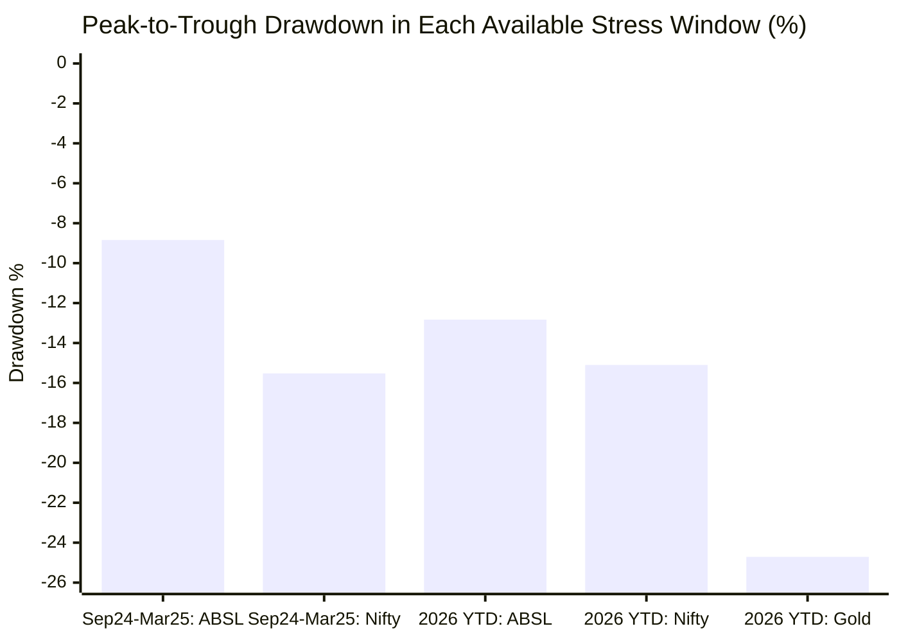
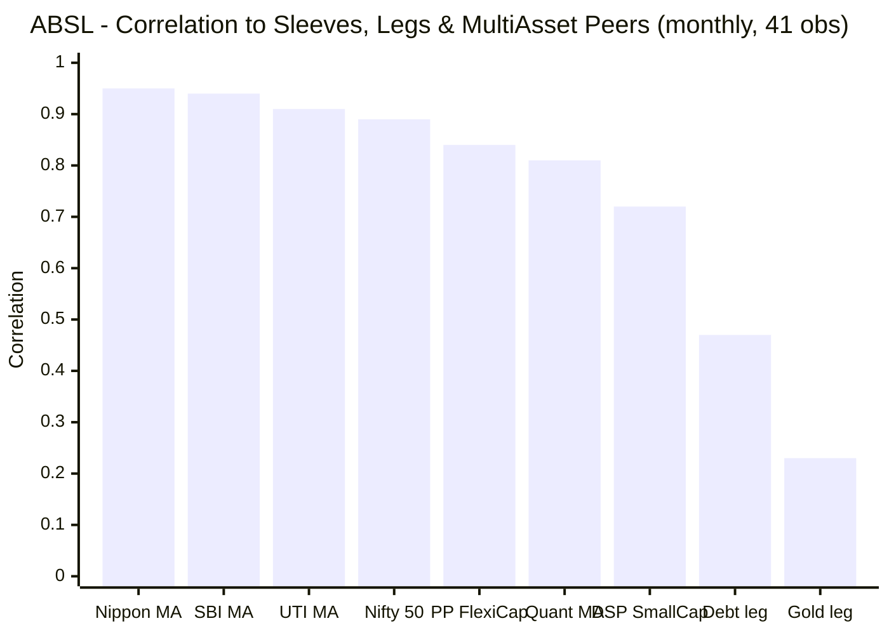
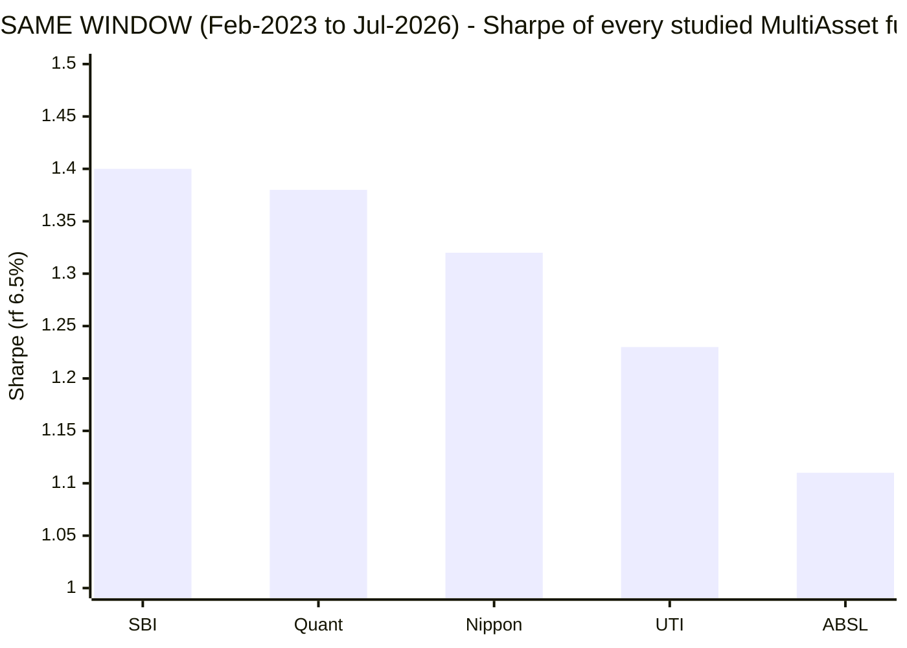
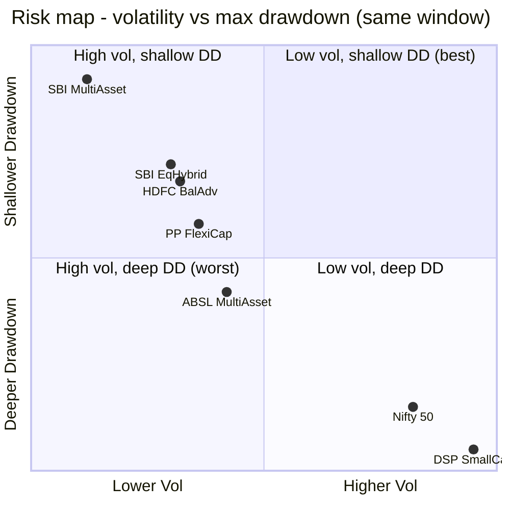
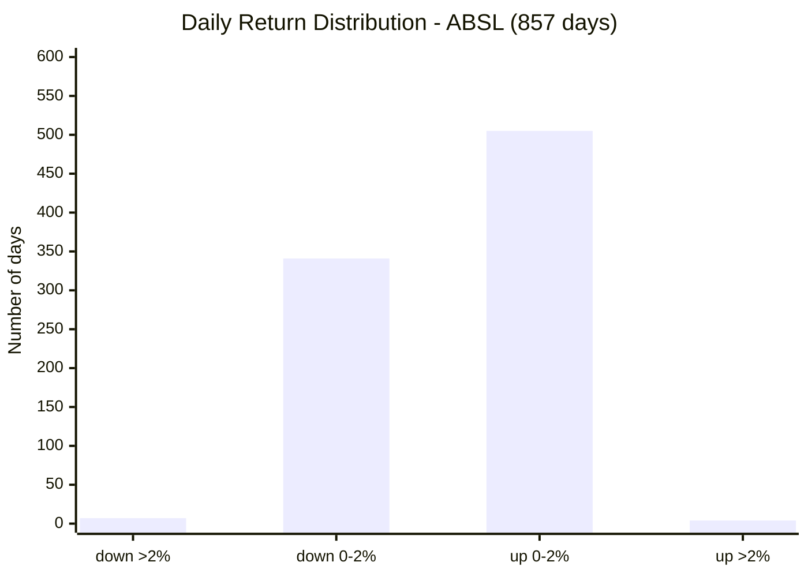
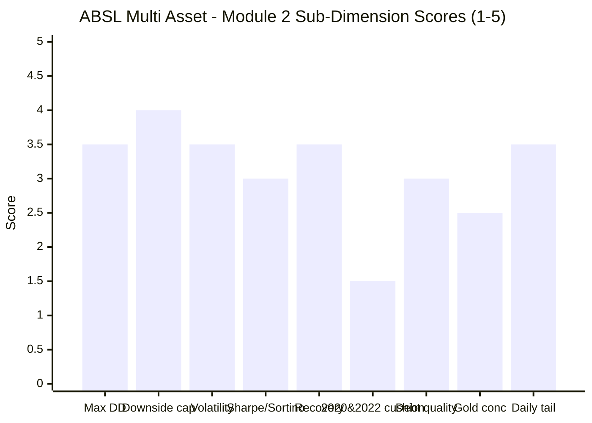

# Module 2: Risk Profile — Aditya Birla Sun Life Multi Asset Allocation Fund

> **Provisional Module 2 score: ~3.1 / 5** (weight **25%** — the top weight in the multi-asset re-weight, because a risk-reduction product lives or dies here). **Scores are NOT comparable to the four equity categories** — this fund is judged on how much it *dampens*, not how much it returns.

> **The one-line context:** in *absolute* terms ABSL's risk numbers look good — **31% downside capture, 0.67 beta, −12.83% worst drawdown, 9.82% volatility, Sortino 1.57.** Every one clears the category's stated bar. Then the two comparisons that matter demolish the case. **(1) Like-for-like:** re-measured over ABSL's exact window, it has the **worst Sharpe (1.11), worst Sortino (1.57), and deepest drawdown (−12.83%) of all five studied funds** — SBI delivered the same return at 7.62% vol and −8.59% DD. **(2) The cousin test:** ABSL is **more volatile (9.82% vs 9.63%) and draws down deeper (−12.83% vs −10.98%) than Parag Parikh FlexiCap — a *pure equity fund*** — and it is worse on both than an Aggressive Hybrid and a Balanced Advantage fund that hold **no gold at all.** A multi-asset fund whose entire structural claim is the third asset class is being out-dampened by funds that don't have one. Add the fact that it has **never seen 2020 or 2022**, and that its gold sleeve is currently a *source* of risk (gold drew −24.7% in 2026), and this is a fund whose risk credentials are unproven where they are not actively unflattering.

---

## ⚠ The `no-2022-data` Flag — What Cannot Be Measured Here

Carried forward from M1 at full severity. **Module 2 is the module this gap hurts most**, because every metric below is measured over a period with no bear market:

| The framework's decisive risk tests | ABSL |
|---|---|
| **2020 realised cushioning** (COVID crash + gold rally) | ❌ **Did not exist** |
| **2022 realised cushioning** (equity ↓ + debt ↓ + gold ↑ — THE test) | ❌ **Did not exist** |
| Sep-2024 → Mar-2025 correction | ✅ The **only completed** stress test |
| 2026 drawdown (live) | ✅ In progress — and gold *hurt* (see §7) |
| Severe bear market / joint equity-debt drawdown | ❌ **Never experienced** |

Per the study plan, `no-2022-data` funds "lean on the Sep-2024–Mar-2025 correction and flag the missing 2022 all-classes-diverge year." Both stress windows available are analysed in §3. But the honest framing: **a −12.83% max drawdown earned without ever meeting a bear market is not the same credential as SBI's −17.6% earned through COVID and 2022.** Scored accordingly.

---

## Fund Identity / Raw Data (MFAPI-computed + Tickertape, as of 31-Jul-2026)

| Metric | Value | Source |
|--------|-------|--------|
| MFAPI scheme code | 151307 (**857 daily returns**, 3.49y) | api.mfapi.in/mf/151307 |
| **Volatility (annualized, daily SI)** | **9.82%** | MFAPI computed |
| **Max drawdown (SI)** | **−12.83%** (Jan–Mar 2026, **live/unrecovered**) | MFAPI computed |
| **Downside capture vs Nifty 50** | **31%** | MFAPI (15 down-months) |
| Upside capture vs Nifty 50 | **91%** | MFAPI (26 up-months) |
| **Beta vs Nifty 50 (monthly)** | **0.67** | MFAPI computed |
| Sharpe (daily SI, rf 6.5%) | **1.11** | MFAPI computed |
| Sortino (daily SI, rf 6.5%) | **1.57** | MFAPI computed |
| Calmar (SI CAGR ÷ max DD) | **1.39** | MFAPI computed |
| Downside deviation | 6.93% | MFAPI computed |
| Correlation to Nifty 50 / PP FlexiCap / DSP SmallCap | **0.89 / 0.84 / 0.72** | MFAPI (41 months) |
| Correlation to Gold / Debt legs | **0.23 / 0.47** | MFAPI computed |
| Daily VaR (95% / 99%) | −0.87% / −1.90% | MFAPI computed |
| Worst / best day | **−3.90%** / +2.99% | MFAPI computed |
| % from all-time high | **−1.76%** | MFAPI computed |
| Screening cross-refs | Sharpe 0.89 · **stdDev 12.6%** | Tickertape, Jul 2026 |
| Debt duration/credit; net-vs-gross equity | **factsheet — deferred to M3/M4** | SID (not in API) |

---

## Cross-Source Verification

| Metric | MFAPI computed | Tickertape | Verdict |
|--------|----------------|-----------|---------|
| Sharpe | 1.11 (daily SI) | 0.89 | ⚠️ Meaningful gap; **both above the 0.86 shortlist median in absolute terms**, but §5 shows every peer beats ABSL on the same window |
| **Volatility** | **9.82%** (daily SI) | **12.6%** (3–5Y stdDev) | ⚠️ **The largest vol discrepancy in the study (2.8pp)** — carried from M1. On Tickertape's figure ABSL sits in the **11–13% "closet-equity" band**; on MFAPI's it is mid-band (9–11%). Both windows are the *same bull period*, so the gap is methodological. **Scored conservatively at the midpoint** |
| Sortino | 1.57 (daily SI) | 0.09 (TT scale) | Tickertape's Sortino uses its own non-standard scale (flagged study-wide); MFAPI value used |
| Max drawdown | −12.83% | premium-gated | Self-computed; **deepest of the five studied funds on a like-for-like window** |
| Downside capture | 31% | not published | The category's decisive metric — self-computed; genuinely good in absolute terms |

**Reliability: High for NAV-derived figures** (857 daily returns). **Moderate for correlation/capture** — only **41 monthly observations** (vs SBI's 158–162). A 41-month sample is statistically thin and drawn entirely from one regime; correlations below should be read as indicative, not settled. Same benchmark/leg/cousin codes as the SBI, Nippon and UTI modules, so all cross-fund figures are directly comparable.

---

## 1. Max Drawdown & the Drawdown Ledger — Shallow, but Untested and Currently Live

| Drawdown | Peak → Trough | Depth | Duration | Recovery |
|----------|---------------|-------|----------|----------|
| **Current (2026)** | 29 Jan 2026 | 23 Mar 2026 | **−12.83%** | ⚠ **NOT RECOVERED** (130 days; now −1.76% from ATH) |
| **2024–25 correction** | 26 Sep 2024 | 28 Feb 2025 | **−8.84%** | ✅ 73 days |
| Oct-2023 dip | 11 Sep 2023 | 26 Oct 2023 | −3.95% | 34 days |
| Jun-2024 (election day) | 3 Jun 2024 | 4 Jun 2024 | −3.90% | 3 days |
| Mar-2023 wobble | 16 Feb 2023 | 15 Mar 2023 | −3.20% | 28 days |

**Three honest readings:**
1. **In absolute terms this is a good ledger** — only two drawdowns beyond −4% in 3.49 years, and the −12.83% max is well inside the category's "< −20% good" band.
2. **But it is the deepest of the five studied funds on the identical window** (chart above), and it is **worse than a pure-equity flexi-cap fund** (PP FlexiCap, −10.98%) — see §6.
3. **The worst drawdown of its life is the one it is still in.** Peaked 29 Jan 2026, troughed −12.83% on 23 Mar 2026, and 130 days later the NAV remains **1.76% below its all-time high.** Substantially recovered, but not made whole — and worth stating plainly rather than presenting only the recovered episodes.

---

## 2. Downside Capture — Genuinely Good in Absolute Terms, Mid-Pack vs Peers

| Measure | ABSL | SBI (ref) | UTI (ref) | Read |
|---------|------|-----------|-----------|------|
| **Downside capture** | **31%** | 16% | 38% | Clears the **<65% "excellent"** bar comfortably; better than UTI, well behind SBI |
| Upside capture | **91%** | 42% | 71% | **The highest of the studied funds** — it participates almost fully in equity rallies |
| Beta vs Nifty 50 | 0.67 | 0.52 | 0.71 | Moderate market sensitivity |
| Capture asymmetry | **~2.9×** | ~2.6× | ~1.9× | 91/31 — **the best raw asymmetry of the studied set** |

**This is ABSL's single strongest risk credential, and it deserves genuine credit.** A 31% downside capture against a 91% upside capture is an excellent *shape* — it participated in 91% of equity's upside while eating only 31% of its downside, an asymmetry (2.9×) that beats SBI's, Nippon's and UTI's. That combination is exactly what an all-weather sleeve is supposed to deliver, and it explains the M1 finding that ABSL beat its blend in 2024 and 2026.

**The two caveats that stop this being a 5:**
- **41 down-months, all mild.** The deepest monthly Nifty fall in this window was modest; a 31% capture measured against gentle declines says little about a −38% COVID-style month. SBI's 8–16% capture was measured *through* COVID and 2022.
- **The 91% upside capture is itself a risk signal.** A fund capturing 91% of equity upside is, structurally, carrying a lot of equity — consistent with the 0.89 Nifty correlation, the 0.67 beta, and the M1 screener figure of 67.8% net equity. High participation cuts both ways, and the bear-market half of that trade has never been observed.

---

## 3. Realised Cushioning — One Real Pass, One Live Failure, Two Missing Tests (Tier-1)

The test the whole product exists to pass: in each stress event, did gold + debt actually cushion the equity fall?

| Event | ABSL | Nifty 50 | Cushion | SBI (ref) | What happened |
|-------|------|----------|---------|-----------|---------------|
| ❌ **2020 COVID** | — | — | — | +20.6pp | **Fund did not exist** |
| ❌ **2022 all-diverge** | — | — | — | +8.4pp | **Fund did not exist — the category's defining test, unevidenced** |
| ✅ **Sep 2024 – Mar 2025** | **−8.84%** | −15.52% | **+6.7pp** | +9.3pp | Gold (+19.9% CY) and debt (−0.17%) cushioned; **a genuine, clean pass** — recovered in 73 days |
| ⚠ **2026 (live)** | **−12.83%** | −15.10% | **+2.3pp** | +6.5pp | **The cushion nearly failed — because GOLD fell −24.71%.** The diversifier became the risk |

**Verdict: one clean pass, one worrying live episode, and the two tests that matter most are simply absent.**

- **The Sep-2024→Mar-2025 pass is real and creditable** (+6.7pp cushion, 73-day recovery). It is the single best piece of hard risk evidence ABSL has.
- **The 2026 episode is the more instructive one, and it is unflattering.** ABSL drew down −12.83% while the Nifty fell −15.10% — a cushion of only **+2.3pp**, versus SBI's +6.5pp in the same window. The reason is visible in the data: **gold itself drew down −24.71% in 2026**, so the sleeve that is supposed to absorb equity shocks was *adding* to them. This is **gold-concentration risk materialising in real time** (§7) — and it is precisely the scenario a 2022-tested fund would have been graded on.
- **What cannot be known:** whether ABSL's debt sleeve would add duration risk in a rate shock (2022's test), and whether the fund would buy equity into a crash (2020's test). **No evidence exists either way.**

---

## 4. Correlation to the Existing Sleeves — the Decisive Decision-Tree Number (Tier-1)

The portfolio is already ~100% equity (FlexiCap + MidCap + SmallCap + International). The only reason to add ABSL is *non-equity it lacks*. So: how correlated is it to what you own?

| vs | Correlation | R² | Read |
|----|-------------|----|------|
| Nifty 50 | 0.89 | 80% | High — moves closely with the index |
| **PP FlexiCap** (the core) | **0.84** | **70%** | **70% of ABSL's variance is explained by the FlexiCap core you already hold** |
| DSP SmallCap (satellite) | 0.72 | 52% | ~48% independent |
| Debt leg | 0.47 | 22% | Partially decorrelated |
| Gold leg | **0.23** | 5% | The genuine diversifier — but only ~12% of the book |
| **Nippon / SBI / UTI Multi Asset** | **0.95 / 0.94 / 0.91** | 90/89/83% | ⚠ **See below** |

**Two findings, the second of which is new to the study:**

1. **ABSL is a partial diversifier at best — 0.84 to PP FlexiCap (R² 70%).** Better than UTI's 0.92 (same window), essentially tied with SBI's 0.83 and Nippon's 0.84. Roughly **70% of what you would be buying, you already own**; the genuine decorrelation comes only from the ~12% gold sleeve (0.23) and, partially, the ~11% debt sleeve (0.47).

2. **⭐ The MultiAsset funds are near-interchangeable with each other (0.91–0.95).** ABSL correlates **0.95 with Nippon, 0.94 with SBI, 0.91 with UTI.** This is a **new, study-level finding**: on this window the four mainstream multi-asset funds are close to the same product wearing different labels. **Implication for the decision tree — holding two multi-asset funds adds essentially nothing**; the choice is a one-slot decision, and it should be made on cost, tax and downside capture rather than on any hope of diversifying between them. *(Per the checklist, correlation is informational — it feeds the decision tree, not the fund's own risk score.)*

> **Statistical caveat:** 41 monthly observations from a single regime. These correlations are indicative. The M1 finding that full-life SBI–PP correlation is 0.73 but *window* SBI–PP is 0.83 shows how much the regime inflates these numbers.

---

## 5. ⭐ The Like-for-Like Risk Test — ABSL Finishes Last (the module's decisive exhibit)

M1 established that ABSL's headline returns are a window artifact. The same test applied to *risk* is, if anything, more damning — because risk is this module's 25%-weighted thesis.

| Fund (same window) | Vol | Max DD | **Sharpe** | **Sortino** | Down-capture | Beta | Corr to PP |
|--------------------|-----|--------|-----------|------------|--------------|------|-----------|
| **SBI Multi Asset** | **7.62%** | **−8.59%** | **1.40** | **2.03** | **16%** | **0.52** | 0.83 |
| Quant Multi Asset | 10.95% | −12.49% | 1.38 | 2.03 | **13%** | 0.63 | **0.75** |
| Nippon Multi Asset | 9.50% | −10.78% | 1.32 | 1.87 | 20% | 0.61 | 0.84 |
| UTI Multi Asset | 9.14% | −11.03% | 1.23 | 1.77 | 38% | 0.71 | 0.92 |
| **ABSL Multi Asset** | **9.82%** | **−12.83%** | **1.11** ⚠ | **1.57** ⚠ | 31% | 0.67 | 0.84 |

**ABSL ranks LAST of five on Sharpe, LAST on Sortino, and LAST on max drawdown**, with the second-highest volatility. It is 4th of 5 on downside capture (ahead of only UTI). **SBI produced a virtually identical return (17.75% vs ABSL's 17.87%, per M1) with 22% less volatility, a third less drawdown, and half the downside capture.**

**The interpretation matters.** ABSL's absolute risk numbers are good — but *every* multi-asset fund's absolute risk numbers were good in this window, because nothing stressful happened. When the regime is held constant, ABSL extracted the **least risk-adjusted value of any fund in the shortlist.** Combined with the M1 finding (last on same-window CAGR-adjusted terms), the picture is consistent: **ABSL is a below-median member of a cohort that all looked good.**

---

## 6. ⭐ Cousin-Category Comparison — Out-Dampened by Funds With No Gold At All (NEW dimension)

Multi-asset's true peers are Balanced Advantage / DAAF, Aggressive Hybrid, and Equity Savings. The test: does ABSL dampen *more* than these, for the equity it holds? **This is where the gold sleeve must justify its existence — and the answer is the module's most damaging finding.**

| Fund (category) | Vol | Max DD | CAGR | Holds gold? |
|-----------------|-----|--------|------|-------------|
| SBI Multi Asset | **7.62%** | **−8.59%** | 17.75% | ✅ |
| **SBI Equity Hybrid** (Aggressive Hybrid) | **9.28%** | **−9.89%** | 14.50% | ❌ **No gold** |
| **HDFC Balanced Advantage** (BAF/DAAF) | **9.37%** | **−10.18%** | 15.79% | ❌ **No gold** |
| **PP FlexiCap** (**pure equity**) | **9.63%** | **−10.98%** | 17.15% | ❌ **No gold** |
| **ABSL Multi Asset** | **9.82%** ⚠ | **−12.83%** ⚠ | 17.87% | ✅ ~12% |
| Nifty 50 | 12.74% | −15.52% | 10.74% | — |

**The finding, stated plainly: ABSL was more volatile and drew down deeper than an Aggressive Hybrid, a Balanced Advantage fund, *and a pure-equity flexi-cap fund* — none of which hold any gold.**

- vs **SBI Equity Hybrid** (equity+debt, no gold): ABSL is **+0.54pp more volatile** and **−2.94pp deeper** in drawdown.
- vs **PP FlexiCap** (100% equity mandate): ABSL is **+0.19pp more volatile** and **−1.85pp deeper** in drawdown — while delivering only +0.72pp more CAGR.

A multi-asset fund's *entire* structural advantage over these cousins is the third asset class. ABSL holds ~12% gold+silver and delivered **worse** risk metrics than funds with none. Two caveats in fairness: PP FlexiCap holds meaningful cash and (historically) international equity, so it is not a pure-beta comparator; and this window uniquely punished gold in 2026 (−24.7%). But neither caveat rescues the conclusion — **on the only evidence available, ABSL's gold sleeve has not bought it any dampening advantage over cheaper, simpler cousins.** This is the same failure mode M1 identified on the return side (under-harvesting gold in 2025), now visible on the risk side.

---

## 7. Multi-Asset-Specific Risks (NEW dimensions)

| Risk | Assessment | Status |
|------|------------|--------|
| **Gold/metals-concentration risk** | ⚠ **Materialising now.** ~12% in ABSL Gold ETF (9.35%) + Silver ETF (2.61%). Gold drew **−24.71% in 2026**, turning the diversifier into a risk source and cutting ABSL's 2026 cushion to just +2.3pp (§3). Not over-leaned in *size* (12% is moderate), but the study's clearest live example of **commodity risk substituting for equity risk** | ⚠ **live risk** |
| **Debt-sleeve duration + credit** | ~11% of the book, running an **accrual strategy** (per SID). Holdings show **GOI Sec 6.36% 2031** (sovereign) alongside a **Cholamandalam Investment debenture** (corporate credit) — so, like SBI, it **reaches into corporate credit**, not purely sovereign/AAA. No credit event visible in NAV. **Small sleeve = low materiality**, but the 2022 duration test was never faced | ⚠ M3 (deferred) |
| **Equity-taxation continuity risk** | ⚠ **Contested and thin.** Screener net equity **67.8%** is only **2.8pp above the 65% line** — a genuinely thin buffer. And VR states **middle-tier** mechanics (12.5% after 24m, slab STCG), contradicting equity status. Either the fund is **not** equity-taxed, or it is equity-taxed **with almost no margin for error.** Both readings are adverse; **M4 must resolve** | ⚠ **M4 pivotal** |
| **Joint equity+debt (2022-style) drawdown** | ❌ **Never experienced.** The fund's debt sleeve has never been tested in a rate-shock year | ❌ **unevidenced** |
| Redemption / liquidity-spiral risk | **N/A — LOW.** Large-cap-biased equity + in-house gold/silver ETFs + high-grade debt are all liquid; ₹6,989 Cr is easily managed | ✅ N/A |
| No structural buffer | **Present but under-performing** — the gold+debt buffer exists (~23%) and worked in Sep-24→Mar-25, but failed to out-dampen no-gold cousins (§6) and turned negative in 2026 | ⚠ weak |

---

## 8. Daily Distribution — Calm in Magnitude, Not in Frequency

| Metric | ABSL | SBI (ref) | PP FlexiCap (ref) |
|--------|------|-----------|-------------------|
| Positive days | 509 (59.4%) | ~60% | — |
| Days down > 2% | **7** | 3 | 2 |
| **Down->2% days per year** | **2.01/yr** | **0.86/yr** | **0.57/yr** |
| Worst day | **−3.90%** | −3.19% | −4.19% |
| Daily VaR (95% / 99%) | −0.87% / −1.90% | — | — |

**A nuanced, two-sided read:**
- **Magnitude is genuinely calm** — the worst single day in 3.49 years was **−3.90%**, and the 95% VaR is under 1%. No fat-tail event of the kind UTI suffered (−9.76% in COVID). An investor's day-to-day experience has been comfortable.
- **But frequency is not.** Normalised per year, ABSL had **2.01 down->2% days/yr — more than twice SBI's 0.86 and nearly four times PP FlexiCap's 0.57**, and more than UTI's 1.43. Only Nippon (2.29) and Quant (2.01) match it.
- **The honest caveat cuts both ways:** ABSL's benign *worst day* is largely because it has never met a crash, not because it is structurally protected. The tail is unmeasured, not small.

---

## Comparison with Studied Funds

| Metric | **ABSL** | SBI | Nippon | UTI | Quant |
|--------|----------|-----|--------|-----|-------|
| Record length | **3.49y** ⚠ | 13.4y | 5.9y | 13.6y | 13.6y |
| Volatility (full-life) | **9.82%** | 6.59% | ~11% | 10.39% | ~15% |
| Max DD (full-life) | **−12.83%** ⚠*bull-only* | −17.6% | — | −25.0% | −32.6% |
| **Same-window Sharpe** | **1.11 (last)** | **1.40** | 1.32 | 1.23 | 1.38 |
| **Same-window max DD** | **−12.83% (worst)** | **−8.59%** | −10.78% | −11.03% | −12.49% |
| Downside capture (window) | 31% | **16%** | 20% | 38% | **13%** |
| Upside capture | **91% (highest)** | 42% | — | 71% | — |
| Correlation to PP FlexiCap | 0.84 | 0.83 | 0.84 | 0.92 | **0.75** |
| 2020 cushioning | ❌ **n/a** | ✅ +20.6pp | ❌ n/a | ✅ | ✅ |
| 2022 cushioning | ❌ **n/a** | ✅ +8.4pp | ✅ | ✅ +4.5pp | ❌ ~0 |
| **Module 2 score** | **~3.1** | **~4.5** | **~3.6** | **~3.2** | **~2.6** |

**ABSL ranks fourth of five on the risk axis.** Its excellent capture *asymmetry* (2.9×) and calm worst-day are genuine positives that keep it above Quant. But it is held below UTI — despite better absolute numbers — because UTI's weaker metrics were **earned through 2020 and 2022**, while ABSL's better-looking ones were earned in a period with no stress at all, and because ABSL finishes **last of five on the like-for-like Sharpe, Sortino and drawdown.**

---

## Points For / Points Against — Risk

### ✅ For
1. **Excellent capture asymmetry — 91% upside / 31% downside (2.9×)**, the best raw shape of the studied set; it participated in rallies while eating little downside.
2. **Downside capture 31% clears the category's "<65% excellent" bar comfortably** and beats UTI.
3. **A genuine, clean pass in its one completed stress test** — Sep-2024→Mar-2025: −8.84% vs Nifty's −15.52% (+6.7pp cushion), recovered in 73 days.
4. **Calm daily magnitude** — worst day only −3.90%, 95% VaR −0.87%; no fat-tail event.
5. **Max drawdown −12.83% is well inside the category's "good" band** in absolute terms.
6. **Sortino 1.57 > Sharpe 1.11** — volatility is upside-skewed; harmful downside is rarer than total vol implies.
7. **Lower equity correlation than UTI** (0.84 vs 0.92 to PP FlexiCap) and near-zero gold correlation (0.23) — the diversifying slice is real.
8. **Liquidity/redemption risk genuinely low** — liquid book, manageable AUM.

### ❌ Against
1. **⚠ LAST of five on the like-for-like window — worst Sharpe (1.11), worst Sortino (1.57), deepest drawdown (−12.83%).** SBI matched its return at 22% less volatility and a third less drawdown.
2. **⚠ Out-dampened by cousins holding NO gold** — more volatile and deeper-drawdown than an Aggressive Hybrid, a Balanced Advantage fund, *and a pure-equity flexi-cap fund.* The gold sleeve bought no risk advantage.
3. **Never experienced 2020 or 2022** — the two decisive cushioning tests are entirely unevidenced; every metric here comes from a no-bear-market sample.
4. **Gold-concentration risk is materialising live** — gold fell −24.71% in 2026, cutting the cushion to just +2.3pp vs SBI's +6.5pp.
5. **Its deepest-ever drawdown is live and unrecovered** (−12.83% since Jan 2026; still −1.76% from ATH after 130 days).
6. **The 2.8pp volatility discrepancy** (MFAPI 9.82% vs Tickertape 12.6%) — on the screener's figure, this is a closet-equity fund.
7. **91% upside capture is a two-sided fact** — it signals a lot of equity, and the bear-market half of that trade has never been seen.
8. **Equity-tax continuity risk is thin or moot** — 67.8% net equity is only 2.8pp above the 65% line, and VR's mechanics suggest it may not qualify at all (→ M4).
9. **More frequent >2% down days than SBI, UTI or PP FlexiCap** (2.01/yr) despite the benign worst-day.
10. **Only 41 monthly observations** — every correlation and capture figure is statistically thin.

---

## Module 2 Scorecard

| Sub-dimension | Score | Reasoning |
|---------------|-------|-----------|
| Max drawdown (inception-adjusted) | **3.5** | −12.83% is excellent absolutely (<−18% = 5) — but **deepest of five like-for-like**, worse than a pure-equity fund, bull-market-only, and currently live. Heavy inception discount |
| Downside capture vs equity | **4.0** | 31% clears the <65% "excellent" bar with a best-in-study 2.9× asymmetry; docked because it is 4th of 5 and measured against only mild declines |
| Volatility | **3.5** | MFAPI 9.82% = "good" band, but **Tickertape says 12.6%** (closet-equity band) and it is 2nd-highest like-for-like; scored at the honest midpoint |
| Sharpe / Sortino | **3.0** | 1.11 / 1.57 are above the 0.86 category median absolutely — but **LAST of all five studied funds** on the same window |
| Recovery time | **3.5** | Sep-24→Mar-25 recovered in a clean 73 days (<9mo = 5); docked because the current −12.83% is unrecovered after 130 days |
| **2020 & 2022 realised cushioning** | **1.5** | ❌ **Fund did not exist for either.** The category's decisive test is unevidenced; one good Sep-24 pass and one weak 2026 showing cannot substitute |
| Debt-sleeve quality | **3.0** | ~11% accrual book, sovereign GOI Sec **plus corporate credit** (Chola debenture); no NAV credit event, but never rate-shock tested; small sleeve limits materiality |
| Gold-concentration risk | **2.5** | ~12% is moderate in *size*, but gold's −24.71% 2026 fall **actively eroded the cushion** — the study's clearest live case of commodity risk replacing equity risk |
| Daily tail risk | **3.5** | Worst day only −3.90%, VaR95 −0.87% (calm magnitude); docked for a >2%-down-day frequency (2.01/yr) more than double SBI's, and an unmeasured true tail |
| Correlation to sleeves | *informational* | 0.84 to PP FlexiCap (R² 70%); **0.91–0.95 to the other MultiAsset funds** — feeds decision tree, not the fund score |
| **Module 2 Overall** | **~3.1 / 5** | Good absolute numbers and a genuinely best-in-study capture asymmetry — undone by finishing **last of five on the like-for-like risk metrics**, being **out-dampened by no-gold cousins including a pure equity fund**, and having **no 2020 or 2022 evidence at all.** Promising shape, unproven substance. Not comparable to equity-category Module 2 scores |

---

## Comparative Module 2 Scores (studied funds — calibration only)

| Fund | Module 2 | Character |
|------|----------|-----------|
| **SBI Multi Asset** | **~4.5 / 5** | Elite downside protection, cycle-proven; partial-diversifier caveat |
| Nippon Multi Asset | ~3.6 / 5 | Respectable equity-plus dampener; saw 2022; never severe-bear-tested |
| UTI Multi Asset | ~3.2 / 5 | Weakest dampener of the cycle-tested funds — but cushioning proven in 2020 *and* 2022 |
| **ABSL Multi Asset** | **~3.1 / 5** | **Best capture asymmetry, worst like-for-like risk-adjusted metrics, zero stress evidence** |
| Quant Multi Asset | ~2.6 / 5 | Fails the risk test — equity-level drawdown, no 2022 cushion |

> Module 2 carries 25% here (vs 20% in the equity studies) precisely because risk *is* the multi-asset thesis. ABSL's 3.1 places it fourth of five: its absolute numbers would justify more, but a risk score earned entirely in a bull market — and last-place when peers are measured over the same days — cannot be credited as a risk *credential*.

---

## SIP Implication

For a ₹15–20k/month SIP alongside a 100%-equity portfolio, ABSL's risk profile reads well on paper and thin on evidence. The shape is genuinely attractive: **91% of equity's upside for 31% of its downside** is the best asymmetry in the study, the worst day in 3.49 years was −3.90%, and the one completed correction (Sep-2024→Mar-2025) was cushioned cleanly and recovered in ten weeks. An investor would not have been frightened out of this fund. **But three facts should temper any confidence.** First, it has **never met a bear market** — no 2020, no 2022 — so the drawdown and consistency figures describe a fund that has not yet been asked the question. Second, when every studied peer is measured over ABSL's *exact* days, ABSL comes **last on Sharpe, Sortino and drawdown** — SBI produced the same return with 22% less volatility. Third, and most structurally: **it was out-dampened by an Aggressive Hybrid, a Balanced Advantage fund, and a pure-equity flexi-cap fund, none of which hold gold** — so the diversifying sleeve an investor is paying for has not, on the available evidence, delivered a risk advantage over simpler alternatives. And the diversification it *does* add is limited: 0.84 correlation to the FlexiCap core means ~70% of it duplicates equity already owned, while its 0.91–0.95 correlation to the other multi-asset funds confirms this is strictly a one-slot decision. Module 2's verdict: **a promising risk shape with no proof behind it.**

## One-Line Verdict

**The best capture asymmetry in the study (91% up / 31% down) wrapped around the weakest evidence base: ABSL finishes LAST of all five studied funds on like-for-like Sharpe, Sortino and drawdown, was out-dampened by an Aggressive Hybrid, a Balanced Advantage fund and even a pure-equity flexi-cap fund that hold no gold at all, has never experienced 2020 or 2022, and is watching its own gold sleeve turn into a risk source (−24.7% in 2026) while sitting in the deepest, still-unrecovered drawdown of its life.**

---

*Module 2 complete. Provisional score 3.1/5. Method: self-computed from MFAPI 151307 (858 NAVs / 857 daily returns / 41 monthly obs, 02-Feb-2023 → 31-Jul-2026); correlations vs Nifty 50 (120620), PP FlexiCap (122639), DSP SmallCap (119212); cousins HDFC Balanced Advantage (118968), SBI Equity Hybrid (119609); legs SBI Gold (119788), ICICI All Seasons Bond (120603); **like-for-like peer risk metrics** re-computed over ABSL's exact window for SBI (119843), Nippon (148457), Quant (120821), UTI (120760). **Cross-module handoffs:** debt-book duration/credit tiers and the exact gold/silver/REIT weights → **M3**; the **contested + thin equity-tax status** (67.8% net vs VR's middle-tier mechanics) → **M4** (pivotal, now also a *risk* finding); the 0.84 correlation-to-sleeves and the **0.91–0.95 inter-fund correlation** → decision tree. **Cross-module retrofit (Edelweiss discipline):** M2 *confirms and extends* M1's central finding — the like-for-like last-place result now holds on **risk** as well as return, so the "regime alpha, not skill alpha" verdict is reinforced from a second direction. M2 also **escalates** M1's gold observation: M1 found ABSL under-harvested gold's 2025 upside; M2 finds the same sleeve **amplified** the 2026 downside (gold −24.71%, cushion cut to +2.3pp) — the gold allocation is now flagged as a live risk, not merely a missed opportunity. No M1 score change. **Standing caveat carried forward: `no-2022-data` at maximum severity — the two decisive cushioning tests remain unevidenced and cap every risk sub-score.***

*Next: [Module 3 — Allocation Engine & Portfolio DNA](module3_allocation.md)*
