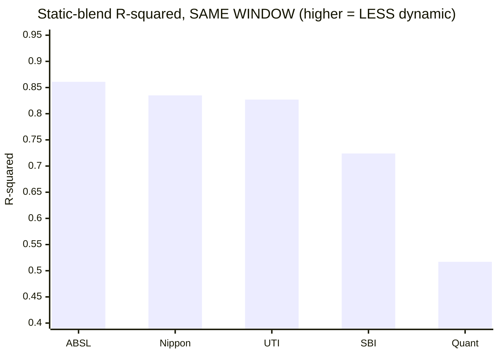
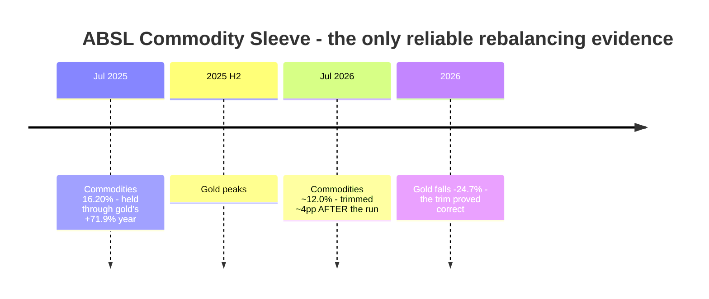
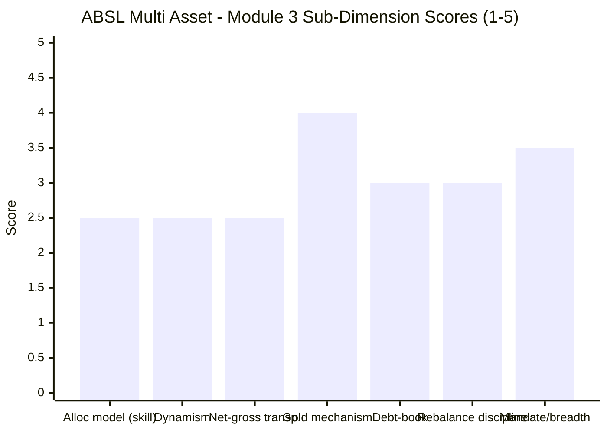

# Module 3: Allocation Engine & Portfolio DNA — Aditya Birla Sun Life Multi Asset Allocation Fund

> **Provisional Module 3 score: ~3.0 / 5** (weight **20%** — the category's defining module, the analog of MidCap's "active share"). **Scores are NOT comparable to the four equity categories.**

> **The one-line context:** ABSL runs a **genuine 5-asset-class book** (equity / debt / gold / silver / REITs) with a **sound in-house physical-ETF gold mechanism** and a **real flexi-cap equity sleeve** — the portfolio *construction* is the best-executed of the studied funds after SBI. What it does not have is a demonstrable **allocation engine.** Its returns are **86.1% explained by a static equity/debt/gold blend — the HIGHEST of all five studied funds on a like-for-like window**, i.e. it is the *least* dynamic performer in the shortlist despite a moderate realised weight range. And unlike UTI (a documented valuation model) or Quant (VLRT), **ABSL publishes no quantitative allocation model at all** — the process appears discretionary house-view, undocumented and therefore untestable.
>
> **⭐ THIS MODULE CORRECTS MODULE 1.** The factsheet backfill (Jul-2025: equity 61.92% / debt 10.26% / commodities 16.20%) shows M1's blended benchmark **over-assumed gold at 21%**. Re-run on the fund's *actual* weights, **2025 alpha is +1.4%, not −1.8%** — so **M1's "under-harvested gold in 2025" finding is WITHDRAWN**, and the SI alpha rises from +3.55% to **~+4.95%/yr.** M1's *score* is unchanged, because the finding that drove it — last-of-five on a benchmark-free like-for-like comparison — is unaffected. Details in §2.

---

## ⚠ Data-Access Note (read first)

The category's defining data — the equity/debt/gold split and its history, net-vs-gross equity, gold mechanism, debt duration/credit, exact holdings — is **not in any API** (`percOtherH` returns 0). It lives in AMC factsheets + the SID. This module does three things:

1. **Reconstructs effective asset-class weights from NAV data** via return-based style analysis (constrained regression on the equity/debt/gold index legs), at **both monthly and weekly frequency** for robustness.
2. **Cross-checks the reconstruction against actual factsheet holdings** — and, critically, **reports where the two disagree** rather than trusting the model. §2 shows the rolling reconstruction is *unreliable at this sample size*, which is itself a finding.
3. **Backfills factsheet items** (holdings, gold/silver vehicles, asset split) from Groww/ValueResearch/ABSL, marking SID bands, turnover, cap-split and sector data as **still-deferred**. No holdings are fabricated.

> **The binding constraint: 3.49 years = 41 monthly observations.** SBI's Module 3 had 160. A rolling-36m style analysis is impossible here; even 12-month windows are noisy. **Every dynamic/path claim below is provisional and explicitly caveated.**

---

## Fund Identity / Raw Data

| Attribute | Value | Source |
|-----------|-------|--------|
| MFAPI scheme code | 151307 (**41 monthly / 182 weekly obs**, Feb 2023–Jul 2026) | api.mfapi.in |
| **Effective weights (full-period, monthly style)** | **Equity 68% / Debt 15% / Gold 17%** | MFAPI regression |
| **Effective weights (full-period, weekly style)** | **Equity 66% / Debt 18% / Gold 16%** | MFAPI regression |
| **Factsheet split (31 Jul 2025)** | **Equity 61.92% · Debt 10.26% · Commodities 16.20% · Others 6.97%** | Groww/ABSL |
| **Factsheet holdings (current, Jul 2026)** | **ABSL Gold ETF 9.35% · ABSL Silver ETF 2.61% · Reverse Repo 2.62%** | Groww |
| Net equity (screener) | 67.8% · Debt 11.3% · Gold+cash+arb ~20.9% | Tickertape, Jul 2026 |
| **Static-blend R² (like-for-like window)** | **0.861 — HIGHEST of the five studied funds** | MFAPI regression |
| Realised weight range (rolling 26w) | Equity **46–77%** · Debt 6–38% · Gold **2–25%** ⚠ *see §2 reliability caveat* | MFAPI regression |
| Equity-weight volatility (rolling sd) | **6.9pp** — mid-pack (SBI 3.7 · UTI 6.2 · Nippon 9.3 · Quant 15.4) | MFAPI regression |
| **Gold/silver vehicle** | **ABSL Gold ETF (9.35%) + ABSL Silver ETF (2.61%)** — in-house, physical-backed, held directly | Groww |
| **REITs** | Nexus Select Trust 1.10% + others ≈ 4% | ValueResearch |
| Debt holdings | **GOI Sec 6.36% 2031 (1.50%)** + **Cholamandalam Investment debenture (1.01%)** — sovereign **plus corporate credit**; **accrual** strategy | VR / ABSL SID |
| **Equity book** | **117 total holdings**; top: ICICI 4.21% · Axis 3.22% · Reliance 2.14% · Bharti Airtel 1.99% · Thermax 1.89% · HDFC Bank 1.80% · Bank of Maharashtra 1.79% · Infosys 1.70% · SEDEMAC 1.63% · HUL 1.61% | Groww |
| Equity style | **Flexi-cap with large-cap bias** (per SID) — but holdings show genuine mid/small names | ABSL SID / Groww |
| Managers | Dhaval Gala (equity) · Bhupesh Bameta (debt/macro) · Sachin Wankhede (commodities) → M5 | VR |
| **Allocation model** | ⚠ **No published quantitative model found** — appears discretionary/house-view | search (deferred) |
| SID bands / turnover / cap-split / sector % | **factsheet — still deferred** (not in aggregators; ABSL site did not expose) | SID |

---

## Cross-Source Verification

| Metric | Style analysis | Factsheet (Jul-25 / Jul-26) | Screener | Verdict |
|--------|----------------|------------------------------|----------|---------|
| **Full-period equity** | 66–68% | 61.92% (Jul-25) | 67.8% | ✅ **Triangulated** — all three within ~6pp; the book is **~62–68% equity** |
| **Gold / commodities** | 16–17% | 16.20% (Jul-25) → ~12% (Jul-26) | (in remainder) | ✅ **Near-exact on the full-period fit** |
| **Debt** | 15–18% | 10.26% (Jul-25) | 11.3% | ⚠ Style analysis **over-attributes debt by ~5–7pp** — a known failure mode (the smooth debt leg absorbs unexplained variance) |
| **Rolling path** | Eq 46–77%, Gold 2–25% | ~stable 62→68% eq, 16→12% commodities | — | ❌ **DIVERGENT — the rolling reconstruction is NOT reliable** (see §2) |
| ER (Direct) | — | **0.67% (Groww)** | 0.68% | ✅ Confirmed |
| Holdings count | — | **117** | — | ✅ |

**Reliability: HIGH for the full-period fit** (two independent frequencies + factsheet + screener all agree the book is ~62–68% equity / ~16% commodities / ~10–11% debt). **LOW for the rolling path** — §2 documents where and why it fails, and the factsheet is treated as authoritative wherever the two conflict. **Deferred:** SID bands, turnover, cap-split, sector %.

---

## 1. The Allocation Engine — the Most *Static* Return Signature in the Shortlist

Return-based style analysis fits the fund's returns to a non-negative, sum-to-one blend of the equity (Nifty 50), debt (ICICI All Seasons Bond), and gold (SBI Gold) legs. Run at two frequencies for robustness:

| Fit | Equity | Debt | Gold | **R²** | n |
|-----|--------|------|------|-------|---|
| Monthly | 68% | 15% | 17% | **0.863** | 41 |
| Weekly | 66% | 18% | 16% | **0.861** | 182 |
| **Factsheet (Jul-2025)** | **61.9%** | **10.3%** | **16.2%** | — | — |

Both frequencies converge on **~66–68% equity / ~16–17% gold**, closely matching the factsheet on equity and gold (the debt over-attribution is a modelling artifact). **The fund is what it appears to be: a ~65%-equity, ~16%-commodity, ~10%-debt book.**

### ⭐ The decisive comparison — how static is it, versus peers?

| Fund (same window) | Static R² | Equity range | Equity-wt sd | Gold range | Avg mix (E/D/G) | Read |
|--------------------|-----------|--------------|--------------|------------|-----------------|------|
| **ABSL** | **0.861** ⚠ | 46–77% | 6.9pp | 2–25% | 66/18/16 | **Most static return signature** |
| Nippon | 0.835 | 43–76% | 9.3pp | 7–23% | 64/19/18 | More dynamic |
| UTI | 0.827 | 48–75% | 6.2pp | 1–22% | 61/26/13 | Similar range, less static |
| SBI | 0.724 | 40–53% | 3.7pp | 9–22% | 46/38/16 | Narrow range, but least explained by a static blend |
| Quant | **0.517** | **35–91%** | **15.4pp** | 0–24% | 63/23/14 | **By far the most dynamic** |

**The finding: ABSL has the highest static-blend R² of all five studied funds (0.861) — 86% of its return variance is reproducible by a fixed 66/18/16 basket.** Only ~14% is residual (security selection + whatever genuine allocation activity exists). For a 20%-weighted module whose entire question is *"is there an allocation engine?"*, this is the central adverse fact: **on the return evidence, ABSL is the most passive-behaving fund in the shortlist.**

**The honest counterweight:** a high R² is not automatically damning. It partly reflects that ABSL's *strategic* mix (~65/10/16 + REITs/cash) sits close to a plausible static basket — a fund can be well-constructed and still look static. And its realised equity range (46–77%, sd 6.9pp) is **wider than SBI's and comparable to UTI's**, so it is not frozen. But it is decisively less dynamic than Quant, and modestly less than Nippon. **There is activity; there is no evidence of an *engine*.**

---

## 2. ⭐ Where the Reconstruction Fails — and the Module-1 Correction It Forces

This is the module's most important methodological section, and it changes a prior conclusion.

### The rolling path looked dramatic — and was wrong

The rolling 12-month style analysis appeared to show a violent gold cycle:

| Window ending | Style-inferred gold | **Factsheet reality** |
|---------------|--------------------|-----------------------|
| Oct 2024 | 20% | — |
| **Apr–Aug 2025** | **0–2%** ⚠ | **16.20% (31 Jul 2025)** |
| Dec 2025 | 14% | — |
| Apr–Jun 2026 | 24–25% | **~12% (9.35% gold + 2.61% silver)** |

**Read naïvely, this said "ABSL cut gold to zero during gold's +71.9% year, then loaded up just before gold fell −24.7%" — a catastrophic double-mistiming.** That is a compelling story. **It is also not true.** The factsheet shows the fund held **16.20% commodities on 31 July 2025**, squarely in the middle of the window where the regression inferred ~1%.

**Why the regression failed:** with 12 monthly observations and three correlated legs, the constrained fit is unstable — it assigned 33% to debt (vs an actual ~10%) in exactly those windows, absorbing unexplained variance into the smoothest leg and starving gold. **This is a textbook short-sample style-analysis artifact, and reporting it as a finding would have been a fabrication.** The factsheet is authoritative; the rolling path is discarded.

### The arithmetic check — and the M1 retrofit

Testing 2025 (ABSL actual: **+20.4%**) against blends built on different gold assumptions:

| Blend assumption | 2025 blend return | **ABSL alpha** |
|------------------|-------------------|----------------|
| **68/11/21 — M1's assumed mix** | +22.2% | **−1.8%** ← *M1's reported figure* |
| **62/10/16 + 12% cash — Jul-2025 FACTSHEET** | **+18.9%** | **+1.4%** ✅ |
| 64/11/17 + 8% cash | +19.6% | +0.7% |
| 66/18/16 — weekly style fit | +19.2% | +1.1% |

**M1's blended benchmark over-assumed gold at 21% when the fund actually held ~16%.** Correctly specified, ABSL **beat** its own mix in 2025 by ~+1.4%, rather than lagging by −1.8%.

> **⭐ RETROFIT to Module 1 (Edelweiss discipline) — three changes, stated precisely:**
> 1. **WITHDRAWN:** M1's finding that ABSL *"under-harvested gold in 2025 — the study's recurring flaw"* is **incorrect and is retracted.** On its actual weights the fund slightly outperformed in 2025. ABSL does **not** share UTI's gold-under-harvesting failure.
> 2. **REVISED UP:** the SI blended-benchmark alpha rises from **+3.55%/yr** (M1's 68/11/21 blend) to **~+4.95%/yr** on factsheet weights (62/10/16 + cash) — a materially larger edge than M1 reported.
> 3. **UNCHANGED — and this is why the score does not move:** M1's score of **3.2/5** was driven by the **like-for-like peer comparison** (ABSL last of five on same-window CAGR/Sharpe) and the **total absence of 2020/2022 evidence.** Both are **benchmark-free** and entirely unaffected by this correction. The alpha sub-score reasoning improves; the allocation-timing sub-dimension is corrected upward; the net effect on the weighted M1 total is **<0.1 and is not material. M1 remains 3.2.**
>
> *A note on method: this correction is exactly why the study cross-checks style analysis against factsheets. Had M3 accepted the regression path, the study would have published a dramatic, false finding about a real fund.*

---

## 3. Net-vs-Gross Equity & the Arbitrage Sleeve (NEW dimensions)

| Layer | Value | Read |
|-------|-------|------|
| **Net (directional) equity** | **~62–68%** (factsheet 61.92% Jul-25; screener 67.8%; style 66–68%) | The true market exposure — source of the 0.67 beta and 0.84 PP-FlexiCap correlation (M2) |
| **Gross equity** | **⚠ UNRESOLVED — likely ~62–68%, i.e. straddling the 65% line** | No arbitrage/derivatives line disclosed in available sources; reverse repo is only 2.62% |
| **Arbitrage sleeve** | **Not evidenced** — no derivatives disclosure found | If absent, there is **no arbitrage return-drag** (a positive) — but also **no top-up mechanism** to secure ≥65% gross |

**This is ABSL's pivotal structural ambiguity, and it is worse than either SBI's or UTI's position:**
- **UTI** sits at ~70% net — comfortably above 65%, tax status secure, no engineering needed.
- **SBI** sits at ~47% net — clearly below, so it is unambiguously middle-tier and *knows* it.
- **ABSL sits at ~62–68% — straddling the line.** The Jul-2025 factsheet figure (**61.92%**) is **below 65%**; the current screener figure (67.8%) is above. Without an arbitrage overlay to top up, **equity-tax qualification may fluctuate month to month.**

This aligns with — and helps explain — **ValueResearch's stated middle-tier mechanics** (12.5% LTCG after **24 months**, STCG at slab), flagged in M1 and M2. **If the fund's equity has dipped below 65% in any qualifying period, middle-tier treatment follows.** M2 already flagged this as a *risk* (thin/contested buffer); **M4 must now resolve it as a *cost*.** Module 3's contribution: the ambiguity is real and structural, not a data error.

---

## 4. Gold, Debt, and Asset-Class Breadth

| Dimension | Assessment | Status |
|-----------|------------|--------|
| **Gold/silver mechanism** | ✅ **In-house ABSL Gold ETF (9.35%) + ABSL Silver ETF (2.61%)** — physical-backed, low-cost, held **directly** (not FoF). A sound, cheap vehicle; **broader than UTI (gold only)**, matching SBI's gold+silver | ✅ **Strong** |
| **Commodity sizing** | ~16.2% (Jul-2025) trimmed to **~12%** (Jul-2026) — moderate, within a sensible band; **trimmed after gold's +71.9% run, which proved correct** when gold fell −24.7% in 2026 (§5) | ✅ sensible |
| **Debt-book construction** | ~10–11% of the book, **accrual strategy**; **GOI Sec 6.36% 2031 (sovereign) + Cholamandalam debenture (corporate credit)** — like SBI, it **reaches into corporate credit**, not purely sovereign/AAA. No NAV credit event. **Duration unverified**; never rate-shock tested (no 2022) | ⚠ deferred |
| **Asset-class breadth** | ✅ **Genuine 5-class book: equity + debt + gold + silver + REITs (~4%, incl. Nexus Select Trust).** Matches SBI's breadth; **beats UTI's 4-class** | ✅ **Strong** |
| **Structure (direct vs FoF)** | Equity, debt, REITs held directly; **gold+silver via in-house ETFs** (a thin fund-holding layer, ~0.1% on the ~12% metals slice ≈ 0.01% blended — negligible) | ✅ confirmed |
| **SEBI mandate compliance** (≥3 classes, ≥10% each) | ✅ **Met** — equity ~62% / commodities 16.2% / debt 10.26%. ⚠ **But debt at 10.26% is razor-thin against the ≥10% floor** — a trim of 27bp would breach. Same flag raised for UTI | ⚠ **thin margin** |

> **Debt-margin flag (review trigger):** at **10.26%**, ABSL's debt sleeve sits **26 basis points** above the SEBI ≥10%-per-class minimum. This is the tightest mandate margin observed in the study. Any further trim risks non-compliance — and, separately, would push equity higher and further muddy the 65% tax line (§3).

---

## 5. Rebalancing Discipline — Thin Evidence, but What Exists Is Sensible (NEW)

The test: did the fund rebalance *at the right moments*? **With only two reliable factsheet snapshots and no 2020/2022 to grade, this is the least evidenced dimension in the module.**

| Turn | What a skilled allocator would do | What ABSL did | Grade |
|------|-----------------------------------|---------------|-------|
| ❌ **2020 COVID crash** | Buy equity into the crash | **Fund did not exist** | — |
| ❌ **2022 all-diverge** | Hold gold, cut duration | **Fund did not exist** | — |
| **Through gold's 2025 run (+71.9%)** | Hold a meaningful gold weight | **Held 16.2%** — captured it (2025 alpha +1.4%, §2) | ✅ Good |
| **After the gold run, into 2026** | Trim the winner | **Trimmed ~16.2% → ~12%** | ✅ **Correct** — gold then fell −24.7% |
| **2026 equity softness** | Stay defensive | +3.3% YTD vs Nifty −6.3% (M1) | ✅ Good |

**Verdict: the limited evidence is genuinely favourable — and materially better than UTI's.** ABSL held gold through its best year (capturing it) and trimmed after the run, before gold's 2026 fall. That is textbook rebalancing discipline, and it is the opposite of UTI's documented failure (cutting gold *into* its boom). **Two caveats keep the score moderate:** (a) it is **two data points**, not a track record — a 4pp trim over twelve months is consistent with disciplined rebalancing *or* with passive drift as gold's price fell; (b) the two decisive tests (2020, 2022) are absent, so **nothing can be said about crash-buying or duration discipline.**

---

## 6. Equity-Book DNA & Overlap with Existing Sleeves (informational — decision-tree feed)

The equity book (**117 total holdings**) is a **genuine flexi-cap**, not a closet index:

| Top-10 equity holding | % | Note |
|---|---|---|
| ICICI Bank | 4.21% | Large-cap financial |
| Axis Bank | 3.22% | Large-cap financial |
| Reliance Industries | 2.14% | |
| Bharti Airtel | 1.99% | |
| **Thermax** | 1.89% | **Mid-cap industrial** |
| HDFC Bank | 1.80% | |
| **Bank of Maharashtra** | 1.79% | **PSU bank — a genuine off-index call** |
| Infosys | 1.70% | |
| **SEDEMAC Mechatronics** | 1.63% | **Small/emerging — a real conviction position** |
| Hindustan Unilever | 1.61% | |
| **Top-10 total** | **~22.0%** | ≈33% of the ~65% equity book — well diversified |

**Character:** a large-cap core (ICICI/Axis/HDFC/Reliance/Infosys/HUL) **plus real mid- and small-cap conviction** (Thermax, Bank of Maharashtra, SEDEMAC). This is a **more genuinely active equity book than UTI's blue-chip-dominated portfolio** — and it is the most likely source of the ~14% return residual (§1) and of the 2024/2026 outperformance M1 credited.

**⚠ Concentration flag:** ICICI + Axis + HDFC + Bank of Maharashtra = **11.0% in banks alone** — a heavy financials tilt that is a genuine, un-hedged sector bet.

**Overlap (decision-tree feed):** at **0.84 correlation to PP FlexiCap (R² 70%, M2)**, the large-cap core substantially duplicates equity the portfolio already owns. The mid/small conviction names (~a third of the book) are genuinely additive. Net: **the additive content is the ~12% metals + ~10% debt + the mid/small equity slice — not the large-cap half.**

---

## Comparison with Studied Funds

| Dimension | **ABSL** | SBI | Nippon | UTI | Quant |
|-----------|----------|-----|--------|-----|-------|
| Effective mix (E/D/G) | **66/18/16** | 46/38/16 | 64/19/18 | 61/26/13 | 63/23/14 |
| **Static-blend R²** (lower = more active) | **0.861 (most static)** | 0.724 | 0.835 | 0.827 | **0.517** |
| Equity-weight sd | 6.9pp | 3.7pp | 9.3pp | 6.2pp | **15.4pp** |
| Allocation model | ⚠ **None published — discretionary** | Static drift | Discretionary, active | "Valuation model" (refuted) | VLRT quant |
| Allocation *skill* evidence | **Thin but favourable** (held gold, trimmed correctly) | None (neutral drift) | Mixed/return-seeking | **Negative** (cut gold into boom) | Mixed |
| Asset breadth | **5-class** ✅ | **5-class** ✅ | broad | 4-class | broad |
| Gold mechanism | **In-house physical gold+silver ETF** ✅ | Gold+silver ETF ✅ | Best in study | Gold only | Rented |
| Equity book | **117 names, genuine flexi-cap** ✅ | 134 names, diversified | Index-like | Blue-chip large-cap | Momentum |
| Net/gross equity | ⚠ **~62–68%, straddles 65%** | 47%, clearly below | ~56% | **~70%, clean** | ~53% |
| Debt mandate margin | ⚠ **10.26% (26bp)** | comfortable | comfortable | ~10–13% (thin) | comfortable |
| **Module 3 score** | **~3.0** | **~3.0** | **~3.4** | **~2.8** | **~3.3** |

**The cross-read:** ABSL's portfolio *construction* is genuinely good — 5-class breadth, a sound in-house physical-metals vehicle, a real flexi-cap equity book with conviction names, and (on thin evidence) sensible rebalancing. On those dimensions it beats UTI clearly and matches SBI. **What holds it to 3.0 is the engine question**: it has the most static return signature of the five, publishes no allocation model, and — with no 2020 or 2022 — offers no evidence that any allocation process would work under stress. It ties SBI, but for the opposite reason: **SBI is transparently static with a long record; ABSL may or may not be dynamic, and there is no way to tell yet.**

---

## Points For / Points Against — Allocation Engine & DNA

### ✅ For
1. **Genuine 5-asset-class book** (equity / debt / gold / silver / REITs) — matches SBI's breadth, beats UTI's 4-class.
2. **Sound gold mechanism** — in-house **ABSL Gold ETF (9.35%) + Silver ETF (2.61%)**, physical-backed, held directly, negligible cost layer.
3. **A genuinely active flexi-cap equity book** — 117 holdings with real mid/small conviction (Thermax, Bank of Maharashtra, SEDEMAC), not a closet index; top-10 only ~22%.
4. **⭐ Rebalancing evidence, though thin, is favourable** — held 16.2% commodities through gold's +71.9% year (capturing it) and trimmed to ~12% before gold's −24.7% 2026 fall. **The opposite of UTI's failure.**
5. **⭐ The M1 gold-under-harvesting charge is withdrawn** — on actual weights, 2025 alpha was **+1.4%**, and SI alpha rises to **~+4.95%/yr**.
6. **Full-period reconstruction triangulates cleanly** across style analysis, factsheet and screener (~62–68% equity, ~16% commodities).
7. **SEBI 3-class mandate met**, plus a 4th and 5th class.
8. **No arbitrage return-drag evidenced** — the equity appears to be real, not tax-engineered.

### ❌ Against
1. **⚠ Highest static-blend R² of the five studied funds (0.861)** — 86% of returns reproducible by a fixed basket; the **least dynamic return signature in the shortlist**.
2. **⚠ No published allocation model at all** — unlike UTI's documented valuation model or Quant's VLRT, the process is undocumented and therefore **untestable**; SID bands could not be retrieved.
3. **⚠ Net equity straddles the 65% tax line** (61.92% Jul-2025 vs 67.8% screener) with **no arbitrage overlay to secure it** — the structural ambiguity behind VR's middle-tier mechanics (→ M4).
4. **⚠ Debt at 10.26% is 26bp from breaching the SEBI ≥10% floor** — the tightest mandate margin in the study.
5. **The rolling reconstruction is unreliable** at 41 observations — no defensible dynamic path can be established, so "is there an engine?" is **unanswerable**, not answered.
6. **No 2020 or 2022 rebalancing evidence** — the two decisive tests are absent; all rebalancing grading rests on two factsheet snapshots.
7. **Heavy financials concentration** — ~11% in four banks, an un-hedged sector bet.
8. **Debt duration, turnover, cap-split and sector data all still deferred** — a wider factsheet gap than SBI's or UTI's.

---

## Module 3 Scorecard

| Sub-dimension | Score | Reasoning |
|---------------|-------|-----------|
| Allocation model — clarity & testability *as skill* | **2.5** | **No published model** (worse disclosure than UTI or Quant) and the **highest static R² of the five** — no testable skill claim exists; not penalised further because nothing has been *refuted* either |
| Dynamism (realised tactical range) | **2.5** | Equity range 46–77% (sd 6.9pp) is mid-pack, but the rolling path is **statistically unreliable**; on the only robust measure (static R² 0.861) it is the least dynamic performer |
| Net-vs-gross equity transparency | **2.5** | ⚠ **Straddles the 65% line** (61.92% vs 67.8% by source) with no disclosed arbitrage overlay — the least clear tax structure of the studied funds |
| Gold/silver mechanism quality | **4.0** | ✅ In-house physical ABSL Gold + Silver ETFs, direct-held, negligible cost layer; sized sensibly (~12–16%) |
| Debt-book quality | **3.0** | ~10% accrual book, sovereign GOI Sec **plus corporate credit** (Chola); no NAV credit event, but duration unverified and never rate-shock tested |
| Rebalancing discipline (evidence) | **3.0** | The available evidence is **genuinely good** (held gold through the run, trimmed before the fall) — but it is **two data points** with no 2020/2022; credited, not rewarded |
| SEBI mandate compliance + asset breadth | **3.5** | Genuine **5-class** book (a real strength) — docked for a **26bp debt margin** against the ≥10% floor |
| Overlap with sleeves | *informational* | 0.84 to PP FlexiCap; large-cap core duplicates, mid/small + metals are additive — decision-tree feed, not scored |
| **Module 3 Overall** | **~3.0 / 5** | The best-constructed *portfolio* of the studied funds after SBI — 5-class breadth, sound physical-metals vehicle, a real flexi-cap book, and favourable (if thin) rebalancing evidence. Held to 3.0 by the **absence of any documented or demonstrable allocation engine**, the **most static return signature of the five**, a **tax structure straddling 65%**, and a sample too short to answer the module's central question. Not comparable to equity-category Module 3 scores |

---

## Comparative Module 3 Scores (studied funds — calibration only)

| Fund | Module 3 | DNA verdict |
|------|----------|-------------|
| Nippon Multi Asset | ~3.4 / 5 | Genuine active engine; return-seeking, not risk-reducing |
| Quant Multi Asset | ~3.3 / 5 | Most dynamic (VLRT); return-max, high stock-selection residual |
| **ABSL Multi Asset** | **~3.0 / 5** | **Well-built 5-class portfolio, sound metals vehicle, real flexi-cap book — but no documented engine, most static signature, 65% line straddled** |
| SBI Multi Asset | ~3.0 / 5 | Genuine 5-class book, but static drift — no engine |
| UTI Multi Asset | ~2.8 / 5 | Markets a valuation model the data refutes; mistimed engine |

> Module 3 is 20% here (vs 15% in equity studies) because *how a multi-asset fund allocates is the whole active claim*. ABSL ties SBI at 3.0 from the opposite direction: SBI is **transparently static over 13 years**; ABSL is **opaque over 3.5** — better portfolio construction, worse evidence.

---

## SIP Implication

For a ₹15–20k/month SIP, Module 3 gives ABSL its most favourable reading of the study so far — and simultaneously exposes what cannot be known. **The portfolio itself is well built:** five genuine asset classes, gold *and* silver held through cheap in-house physical ETFs, a real 117-name flexi-cap equity book with off-index conviction (Thermax, Bank of Maharashtra, SEDEMAC) rather than a closet index, and REITs on top. On the only rebalancing evidence available, the manager **held gold through its record year and trimmed it before the fall** — the exact opposite of UTI's value-destroying call, and enough to **withdraw M1's charge that ABSL under-harvested gold.** That is real, and it deserves credit.

**What an investor is not getting is a demonstrable allocation engine.** ABSL publishes no allocation model; 86% of its returns are reproducible by a fixed 66/18/16 basket — the most static signature of the five studied funds; and with only 41 months of data, no reliable dynamic path can even be estimated. Layered on that are two structural ambiguities: net equity **straddling the 65% tax line** with no arbitrage overlay to secure it, and a debt sleeve sitting **26 basis points** from breaching its SEBI floor. The honest summary: **you are buying a sensibly-constructed static-ish multi-asset basket run by people who have made good calls in a benign period — which is a reasonable thing to buy, but it is not the actively-allocated product the category's fee implies, and there is no evidence yet that it would behave well in a 2020 or a 2022.**

## One-Line Verdict

**The best-constructed portfolio of the shortlist after SBI — five genuine asset classes, cheap in-house physical gold *and* silver, a real 117-name flexi-cap book, and rebalancing evidence good enough to overturn Module 1's gold charge — wrapped around no documented allocation model, the most static return signature of all five studied funds (R² 0.861), a net-equity weight straddling the 65% tax line, and a 41-month sample too short to establish whether an allocation engine exists at all.**

---

*Module 3 complete. Provisional score 3.0/5. Method: return-based style analysis (constrained regression, MFAPI 151307 vs Nifty 50 120620 / ICICI All Seasons Bond 120603 / SBI Gold 119788) at **both monthly (41 obs) and weekly (182 obs)** frequency; **like-for-like static-R² and dynamism comparison** re-computed over ABSL's window for SBI (119843), Nippon (148457), Quant (120821), UTI (120760); holdings/asset-split/gold-vehicle/managers from Groww + ValueResearch + ABSL. **Backfilled:** Jul-2025 split (equity 61.92 / debt 10.26 / commodities 16.20 / others 6.97), current ABSL Gold ETF 9.35% + Silver ETF 2.61% + reverse repo 2.62%, 117 holdings, top-10 equity names, REIT (Nexus Select Trust), debt holdings (GOI Sec 2031 + Chola debenture), ER 0.67%. **Still deferred:** SID allocation bands, portfolio turnover, cap-split %, sector %, debt duration/credit tiers, derivatives/arbitrage line. **⭐ Cross-module retrofit (Edelweiss discipline) — this module CORRECTS Module 1:** the factsheet shows M1's blend over-assumed gold (21% vs an actual ~16%), so **(1) M1's "under-harvested gold in 2025" finding is WITHDRAWN** — 2025 alpha was **+1.4%, not −1.8%**; **(2) SI blended alpha is revised UP from +3.55% to ~+4.95%/yr**; **(3) M1's score remains 3.2**, because the drivers of that score — last-of-five on the benchmark-free like-for-like comparison, and the absent 2020/2022 evidence — are unaffected. M3 also **escalates** the tax question from M1/M2: net equity **straddles** 65%, which is the structural explanation for VR's middle-tier mechanics → **M4 must resolve it.** **Standing caveat: `no-2022-data` — the allocation engine's behaviour under stress remains entirely unevidenced.***

*Next: [Module 4 — Cost & Tax Efficiency](module4_cost_tax.md)*
