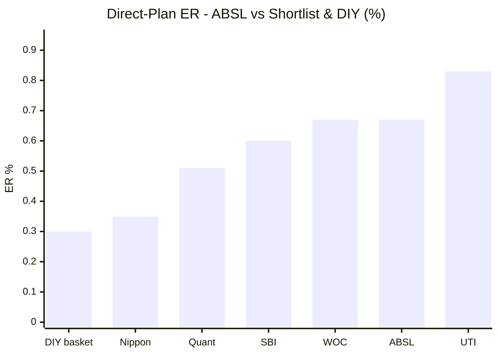
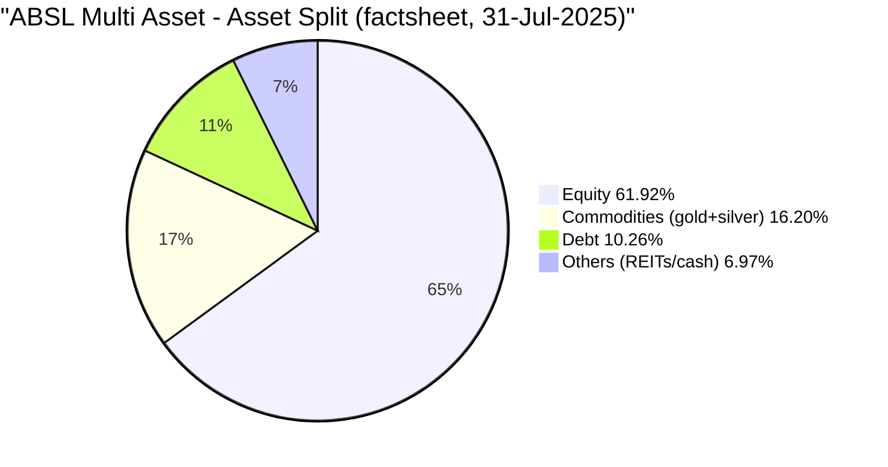
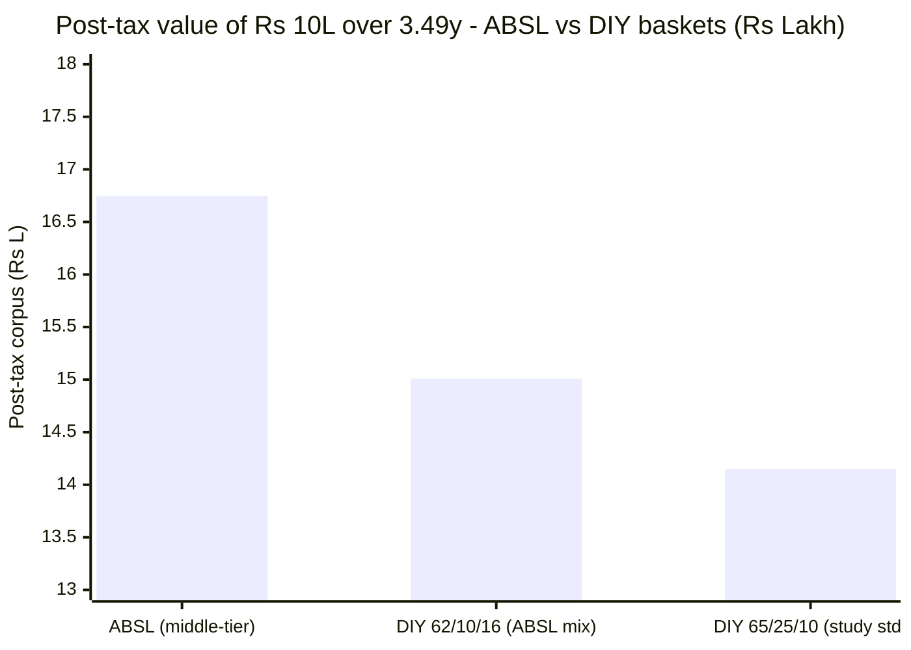
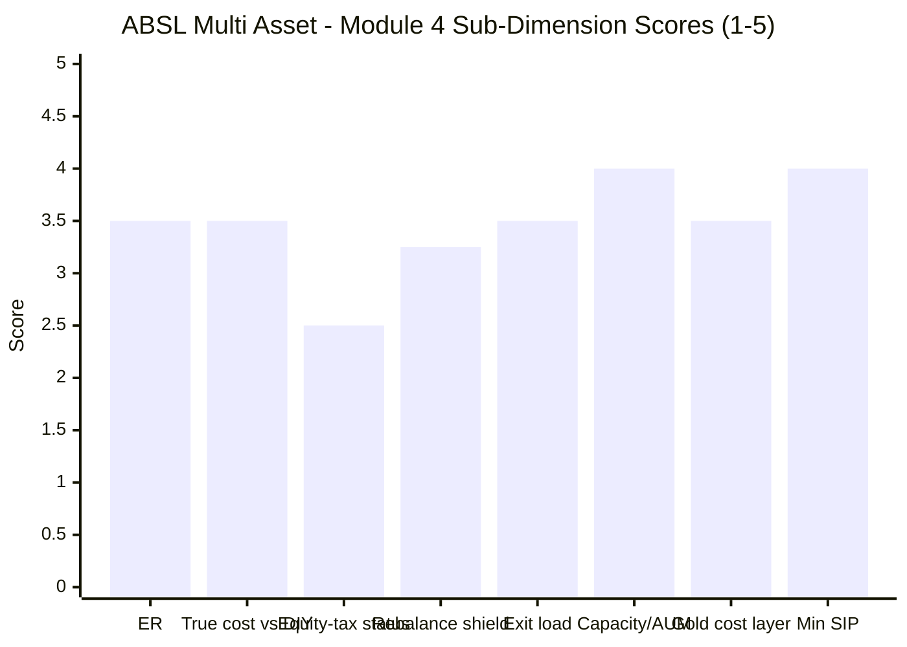

# Module 4: Cost & Tax Efficiency — Aditya Birla Sun Life Multi Asset Allocation Fund

> **Provisional Module 4 score: ~3.3 / 5** (weight **20%**). **Scores are NOT comparable to the four equity categories.**

> **The one-line context:** this module **resolves the tax question M1, M2 and M3 all deferred — and the answer is negative. ABSL is NOT equity-taxed.** It sits in the **middle tier** (12.5% LTCG only after **24 months**, STCG at **slab**), confirmed by ValueResearch's stated mechanics and explained by M3's structural finding: net equity of **61.92%** (Jul-2025 factsheet) sits **below the 65% line**, with **no arbitrage overlay** to top it up. So the category's structural trump card — equity taxation on the *whole* corpus including gold and debt — is **absent**, exactly as for SBI and Nippon, and unlike UTI. What remains is a straightforward cost story: a **mid-pack 0.67% Direct ER** (~2.2× the DIY basket), a **modest but genuine rebalancing shield** (the fund actually trims, unlike SBI), and a **comfortable post-tax win over DIY (+₹2.63L on ₹10L over 3.49 years)** — which sounds decisive until the like-for-like test shows it is **the second-smallest DIY edge of the five studied funds.** ABSL beats do-it-yourself; it does so by less than almost every peer, and on a book edge M1/M2 established is regime, not skill.

---

## Fund Identity / Raw Data (per-metric source attribution)

| Attribute | Value | Source |
|-----------|-------|--------|
| **Expense Ratio (Direct)** | **0.67%** (Groww) / 0.68% (screener) — **the two agree**, unusually for this study | Groww / Tickertape, Jul 2026 |
| **Expense Ratio (Regular)** | **1.50%** | ValueResearch, Jul 2026 |
| **Direct–Regular gap** | **0.83%** | computed |
| Exit load | ~1% within 12m (standard ABSL hybrid structure) — **confirm SID** | inferred (deferred) |
| AUM | **₹6,989 Cr** (from a **₹1,574 Cr** NFO — **4.4×** growth in 3.5y) | Tickertape / Business Standard |
| Min SIP | ~₹100–500 (ABSL standard) — **confirm SID** | inferred |
| **Taxation status** | ⚠ **MIDDLE TIER — 12.5% LTCG after 24 months, STCG at slab. NOT equity-oriented** | **ValueResearch (stated) + M3 allocation arithmetic** |
| Net / gross equity | **61.92%** (Jul-2025 factsheet) · 67.8% (screener) — **straddles 65%; no arbitrage overlay** | M3 |
| Gold/silver vehicle | **In-house ABSL Gold ETF (9.35%) + Silver ETF (2.61%)** — physical-backed; thin double layer (~0.1% on ~12% ≈ **0.01% blended**) | Groww (M3) |
| Portfolio turnover | **factsheet — deferred** (M3: does rebalance — commodities 16.2%→12%) | SID |
| ER glide over time | **factsheet — deferred** (no history available for a 3.5y fund) | SID |

---

## Cross-Source Verification

| Metric | Value | Source | Note |
|--------|-------|--------|------|
| Direct ER | **0.67% / 0.68%** | Groww / Tickertape | ✅ **Genuinely consistent** — notable, because the screener proved **stale-high** for Nippon (0.43→0.27), SBI (0.74→0.51) and Quant (1.16→0.51). ABSL's 0.67% is reliable |
| Regular ER | 1.50% | ValueResearch | ✅ Consistent with 1.51% seen elsewhere |
| **Tax status** | **Middle tier** | **VR (stated) + derived** | ⚠ **Resolved this module.** VR states the mechanics directly; M3's 61.92% net-equity figure supplies the structural reason. **High confidence** |
| AUM | ₹6,989 Cr | Tickertape / VR | ✅ Confirmed |

**Reliability: High.** ER is two-source consistent (rare in this study). The **tax determination rests on two independent legs** — VR's *stated* mechanics (12.5% after 24m, slab STCG = the textbook middle-tier signature) and M3's *observed* 61.92% equity weight — which agree. Flagged for SID confirmation, but the case is strong.

---

## 1. Expense Ratio — Mid-Pack, and Beaten by DIY on Cost Alone

| Fund | Direct ER (current best estimate) | Rank (of 6 shortlist) |
|------|-----------------------------------|------------------------|
| DIY basket (index funds, blended) | ~0.30% | — (the counterfactual) |
| Nippon India Multi Asset | ~0.27–0.43% | 1st (cheapest) |
| Quant Multi Asset | ~0.51% (VR) | 2nd |
| SBI Multi Asset | ~0.51–0.68% | 3rd |
| WOC Multi Asset | 0.67% | ~4th |
| **ABSL Multi Asset** | **0.67%** | **~4th (tied)** |
| UTI Multi Asset | ~0.78–0.88% | 6th |

**ABSL's 0.67% is respectable but unremarkable — squarely mid-pack, and ~2.2× the ~0.30% all-in cost of the DIY basket.** It is meaningfully cheaper than UTI (0.83%) and slightly dearer than SBI's midpoint, but it is **not competitive with Nippon**, which runs the same category for roughly half the fee.

**⚠ The Regular-plan trap is unusually expensive here.** At **1.50%**, ABSL's Regular plan carries a **0.83% gap** over Direct. Modelled on a 10-year ₹15k/month SIP at 11% gross:

| Plan / alternative | ER | 10Y corpus | vs DIY |
|--------------------|----|-----------|--------|
| DIY basket | 0.30% | ₹32.27L | — |
| **ABSL Direct** | **0.67%** | **₹31.58L** | **−₹0.69L** |
| **ABSL Regular** | **1.50%** | **₹30.10L** | **−₹2.18L** |

**A Regular-plan investor forfeits ~₹1.49 lakh versus Direct over ten years** on a ₹15k SIP — the single largest avoidable cost in this fund. **Always Direct.**

**A scale note:** the fund grew from a ₹1,574 Cr NFO to ₹6,989 Cr (4.4×) in 3.5 years, yet the ER has not visibly benefited. Nippon runs ₹16,000 Cr at 0.27–0.43%. **No scale pass-through is evident** — though with no ER-glide history available for a 3.5-year fund, this is a flag rather than a finding.

---

## 2. ⭐ The Tax Status — Resolved: NOT Equity-Taxed (the pivotal call)

M1 flagged a contradiction; M2 priced it as a risk; M3 found the structural cause. **M4 resolves it.**

**(1) Source confirmation.** ValueResearch states ABSL Multi Asset's mechanics directly: **LTCG 12.5% after 2 years; STCG at slab rate.** That is precisely the *middle-tier* ("other than equity-oriented") treatment. True equity taxation would give **12.5% after 12 months, a ₹1.25L annual exemption, and 20% STCG.** It does not.

**(2) Allocation arithmetic (from M3).**

| Tax tier | Rule | Applies to ABSL? |
|----------|------|------------------|
| Equity-oriented (≥65% equity) | STCG 20% (<12m); LTCG 12.5% (>12m) above ₹1.25L | ❌ **No — equity 61.92%, below the line, no arbitrage top-up** |
| **Middle (35–65% equity)** | **LTCG 12.5% after 24m; STCG at slab (<24m)** | ✅ **Yes** |
| Specified fund (>65% debt) | Slab always (Sec 50AA) | ❌ No (debt ~10%) |

**Why the screener's 67.8% misleads:** that figure likely counts **REITs (~4%)** and possibly other non-qualifying instruments inside "net equity." Stripping REITs from 67.8% lands at ~64% — consistent with the factsheet's 61.92% and **below the 65% threshold either way.** M3's finding stands: **ABSL straddles the line, and with no arbitrage overlay it lands on the wrong side of it.**

**What this costs — and the honest scale of it:**

| Scenario (₹10L lumpsum, 3.49y — the fund's full life) | Post-tax value |
|---|---|
| ABSL as-is (**middle tier**, 12.5% LTCG >24m, no exemption) | **₹16.75L** |
| ABSL *if* it were equity-taxed (12.5% >12m, ₹1.25L exempt) | ₹16.91L |
| **Cost of failing the 65% test** | **−₹0.16L** |

**The nuance that keeps this from being a disaster:** for a **long-term holder**, the middle tier is only mildly worse than equity taxation — the LTCG *rate* is the same 12.5%; what is lost is (a) the ₹1.25L annual exemption and (b) the 12→24-month qualifying window. On a 3.49-year hold that is worth ~₹16,000 per ₹10L. **But the structural point stands: one full leg of the tax triad is absent.** ABSL cannot claim the category-defining edge of taxing its gold, silver and debt sleeves at equity rates — the very thing that would justify holding those assets inside a fund rather than directly.

> **⭐ RETROFIT to M2 (Edelweiss discipline):** M2 flagged **"equity-taxation continuity risk"** — that ABSL's thin 2.8pp buffer above 65% could slip. **M4 resolves this as moot in the adverse direction: the fund is already below the line and already middle-tier**, so there is no cliff left to fall off. This *removes* a risk M2 priced but *confirms* the worse of the two readings M2 offered ("either not equity-taxed, or equity-taxed with no margin — both adverse"). **No M2 score change** — M2 explicitly scored the dimension as adverse under either branch.

---

## 3. The Internal-Rebalancing Tax Shield — Modest, and Genuinely Better Than SBI's

The second leg of the triad: the fund rebalances between equity/debt/gold **internally, tax-free**, whereas a DIY investor rebalancing annually **realises taxable gains every year**.

**ABSL's shield is real and better-evidenced than SBI's**, for the reason M3 documented: **the fund actually rebalances.** It held ~16.2% commodities through gold's +71.9% year and trimmed to ~12% before gold's −24.7% 2026 fall — roughly **4pp of cross-asset turnover in twelve months**, executed internally and tax-free. A DIY investor making the identical trim would have realised a large gain on the best-performing asset in the basket.

| DIY rebalancing assumption (65/10/16 mix, annual) | Cross-asset turnover shielded | Tax drag avoided/yr |
|---|---|---|
| ABSL-style trims (~4–6% of corpus/yr) | Moderate — **more than SBI's static drift, less than Quant's churn** | **~0.12–0.20%/yr** |

**Worth ~0.12–0.20%/yr — real, compounding, and it offsets roughly half the ER premium over DIY.** Two honest qualifications: (a) it is estimated from **two factsheet snapshots**, not a turnover series (the actual turnover ratio remains factsheet-deferred); and (b) the shield is only valuable if the rebalancing *itself* adds value — here, unusually for this study, the available evidence says it did (M3 §5), which is more than can be said for UTI, whose shield protected value-destroying trades.

---

## 4. ⭐ True Cost vs DIY — the Decisive Number (framing fact #2)

**ER premium − rebalancing shield − tax-tier difference = the true cost of the fund versus assembling it yourself.**

### The realised comparison (₹10L lumpsum over the fund's full 3.49-year life, post-tax)

| Basket | Pre-tax FV | Post-tax FV | ABSL edge |
|--------|-----------|-------------|-----------|
| **ABSL Multi Asset** (middle-tier, 12.5% >24m) | ₹17.72L | **₹16.75L** | — |
| DIY 62/10/16 — ABSL's own mix (debt @30% slab) | ₹15.80L | ₹15.01L | **+₹1.74L** |
| DIY 65/25/10 — study standard (debt @30% slab) | ₹14.90L | ₹14.15L | **+₹2.60L** |
| DIY 65/25/10 (debt @20% slab) | ₹14.90L | ₹14.23L | +₹2.53L |

**Pre-tax and post-tax, ABSL beats every DIY static basket comfortably.** The margin (+₹1.74L to +₹2.60L on ₹10L over 3.49 years) far exceeds the ~0.37%/yr ER premium. On the study's scoring guide ("net cheaper than DIY = 5"), this looks like a clear win. **Two things prevent it being scored as one.**

### ⚠ The like-for-like test — ABSL's DIY edge is the second-smallest of five

The DIY win is only meaningful if it is *distinctive*. Re-running the identical post-tax calculation for every studied fund over ABSL's exact window:

| Fund (same window, ₹10L) | CAGR | Tax tier | Post-tax FV | **vs DIY 65/25/10** |
|--------------------------|------|----------|-------------|---------------------|
| Quant Multi Asset | 22.69% | middle | ₹19.11L | **+₹4.97L** |
| Nippon Multi Asset | 19.84% | middle | ₹17.71L | **+₹3.56L** |
| UTI Multi Asset | 18.35% | **EQUITY** | ₹17.16L | **+₹3.01L** |
| **ABSL Multi Asset** | **17.87%** | middle | **₹16.78L** | **+₹2.63L** ⚠ |
| SBI Multi Asset | 17.75% | middle | ₹16.73L | +₹2.58L |

**ABSL's DIY edge ranks 4th of 5 — ahead only of SBI, and by ₹0.05L.** Every peer except SBI beat do-it-yourself by more. And **SBI achieved a near-identical edge at 7.62% volatility and an −8.59% drawdown**, versus ABSL's 9.82% and −12.83% (M2) — so on a *risk-adjusted* basis SBI's near-identical DIY win is materially higher quality.

**Net true-cost-vs-DIY verdict:** ABSL is **genuinely net cheaper than DIY all-in** — the ER premium (~0.37%/yr) is more than covered by the rebalancing shield (~0.12–0.20%/yr) plus a book edge that, in this window, was large. But **the source of the win is the book, not the structure**: the tax status is *worse* than DIY's blended treatment in one respect (24-month window, no exemption), and the fee is 2.2× DIY's. And per M1/M2, that book edge is **the category's regime alpha, not ABSL's skill** — every peer earned a bigger one. **Scored as a solid but unexceptional 3.5, not a 5.**

---

## 5. Standard Cost Dimensions

| Dimension | Assessment | Score input |
|-----------|------------|-------------|
| **Direct–Regular gap** | **0.83%** (Regular 1.50%) — a Regular investor forfeits **~₹1.49L over 10Y** on a ₹15k SIP. Large; standard for the industry but at the wide end | 3.0 |
| **SEBI TER buffer** | At ₹6,989 Cr the hybrid TER ceiling is ~1.9–2.0% blended; 0.67% Direct sits far inside — no cap pressure | ✓ |
| **Exit load** | ~1% within 12m (standard ABSL hybrid); irrelevant to a 7–10Y SIP. **Confirm SID** | 3.5 |
| **ER glide** | **Deferred** — no meaningful history for a 3.5y fund. ⚠ But AUM grew **4.4×** (₹1,574 Cr → ₹6,989 Cr) with **no visible ER reduction**; Nippon charges half at 2.3× the size | 2.5 |
| **Turnover-adjusted true cost** | M3: genuine cross-asset rebalancing (16.2%→12% commodities) plus an active 117-name flexi-cap book ⇒ **trading costs above a static basket's**; exact turnover **deferred**. Modest leakage likely atop the 0.67% | 3.0 |
| **Flow-as-signal** | ✅ **Strong** — 4.4× AUM growth since NFO; the market is buying, not leaving. Healthy and stable, though partly a hot-category effect | 4.0 |
| **Gold/silver cost layer (double-layer)** | ✅ In-house ABSL Gold + Silver ETFs, ~0.1% underlying on the ~12% metals slice ≈ **0.01% blended** — negligible; no external FoF wrapper | 3.5 |
| **AUM / capacity** | ✅ **₹6,989 Cr with no capacity constraint** — large-cap-biased equity + gold/silver ETFs + high-grade debt scale indefinitely. A genuine structural strength | 4.0 |
| **Min SIP** | ~₹100–500 — accessible | 4.0 |
| **Fund revenue / AMC economics** | ~₹47 Cr/yr gross from Direct at 0.67% on ₹6,989 Cr (blended with Regular, materially more) — a meaningful franchise for ABSL AMC → M6 | — |

---

## Comparison with Studied Funds

| Metric | **ABSL** | SBI | Nippon | UTI | Quant |
|--------|----------|-----|--------|-----|-------|
| Direct ER | **0.67%** | ~0.51–0.68% | **~0.27–0.43%** | ~0.78–0.88% | ~0.51% |
| Regular ER / gap | **1.50% / 0.83%** | ~1.5% / 0.8% | ~1.4% / 1.0% | ~1.5% / 0.8% | — |
| **Tax status** | ⚠ **Middle tier** | Middle tier | Middle tier | **EQUITY ✅** | Dynamic |
| Rebalancing shield | **Modest, real (~0.12–0.20%/yr)** | Small (barely rebalances) | Meaningful | Larger but **hollow** | Large |
| **Post-tax DIY edge (same window)** | **+₹2.63L (4th of 5)** | +₹2.58L | **+₹3.56L** | +₹3.01L | **+₹4.97L** |
| Capacity constraint | None ✅ | None | None | None | None |
| Gold cost layer | In-house ETF, negligible | In-house ETF | Best in study | In-house ETF | Rented |
| **Module 4 score** | **~3.3** | ~3.5 | **~4.1** | ~3.4 | ~3.5 |

**The cross-read:** ABSL's cost/tax profile is **competent and unexceptional.** It is cheaper than UTI, dearer than Nippon and Quant, roughly level with SBI. It shares the middle-tier tax status of SBI and Nippon (and lacks UTI's one clean structural edge). Its rebalancing shield is genuinely better than SBI's — the one dimension where it leads a peer — but its post-tax DIY margin is the second-smallest of five. **Nippon remains the module's benchmark**: roughly half the fee, the same tax tier, and a DIY edge 35% larger.

---

## Points For / Points Against — Cost & Tax

### ✅ For
1. **Beats every DIY basket comfortably post-tax** — +₹1.74L to +₹2.63L on ₹10L over 3.49 years, far exceeding the ~0.37%/yr ER premium.
2. **A genuine, better-than-SBI rebalancing shield (~0.12–0.20%/yr)** — the fund actually trims cross-asset (16.2%→12% commodities), and M3 found those trims *added* value.
3. **ER of 0.67% is reasonable and — rare in this study — two-source consistent** (Groww 0.67%, screener 0.68%); no stale-figure ambiguity.
4. **No capacity constraint** — ₹6,989 Cr in liquid large-cap equity, ETFs and high-grade debt; the strategy scales indefinitely.
5. **Negligible gold/silver cost layer** — in-house physical ETFs, ~0.01% blended, no external FoF wrapper.
6. **Strong flow signal** — 4.4× AUM growth since the ₹1,574 Cr NFO; the market is buying it.
7. **Middle tier is only mildly worse than equity taxation for a long holder** — same 12.5% LTCG rate; the loss is ~₹0.16L per ₹10L over 3.49 years.
8. **Accessible minimums** (~₹100–500) and a standard, SIP-irrelevant exit load.

### ❌ Against
1. **⚠ NOT equity-taxed — the tax triad's trump card is absent.** Middle tier (12.5% only after 24m, slab STCG), because net equity (61.92%) sits below 65% with no arbitrage overlay. The gold, silver and debt sleeves get **no** equity-rate shelter.
2. **⚠ The post-tax DIY edge is the second-smallest of the five studied funds** (+₹2.63L vs Quant's +₹4.97L, Nippon's +₹3.56L) — and SBI matched it at far lower risk.
3. **Mid-pack ER at 2.2× the DIY basket** — Nippon runs the same category for roughly half.
4. **The DIY win comes from the book, not the structure** — and M1/M2 established that book edge is the category's regime alpha, not ABSL's skill.
5. **A wide 0.83% Direct–Regular gap** — ₹1.49L forfeited over a 10Y ₹15k SIP by anyone in the Regular plan.
6. **No evident scale pass-through** — 4.4× AUM growth with no visible ER reduction.
7. **Turnover-adjusted true cost is unquantified** — an active 117-name book plus real cross-asset rebalancing implies trading costs above the headline ER; the turnover ratio remains factsheet-deferred.
8. **All cost/tax conclusions rest on a 3.49-year record** — no ER glide history, and the rebalancing shield is estimated from two snapshots.

---

## Module 4 Scorecard

| Sub-dimension | Score | Reasoning |
|---------------|-------|-----------|
| Expense Ratio (Direct) | **3.5** | 0.67% sits in the guide's 0.60–0.85% band (=4) and is two-source verified — docked to 3.5 for being ~2.2× DIY and roughly double Nippon's |
| True cost vs DIY (all-in) | **3.5** | Net cheaper than DIY by +₹1.74–2.63L/3.49y (guide: net cheaper = 5) — **docked two levels** because it is the 4th-smallest edge of five and driven by regime book edge, not structure |
| **Equity-taxation status** | **2.5** | ⚠ **Middle tier, not equity-oriented** (VR-stated + 61.92% net equity) — the structural trump card is absent; held off 2.0 because the 12.5% LTCG rate still matches equity for long holders |
| Rebalancing tax-shield | **3.25** | Real (~0.12–0.20%/yr) and **better-evidenced than SBI's** — the fund genuinely trims cross-asset, and M3 found those trims added value; capped by two-snapshot evidence |
| Exit load | **3.5** | Standard ~1%/12m; irrelevant to a long SIP (SID confirmation pending) |
| AUM / capacity | **4.0** | ₹6,989 Cr, no capacity constraint, strong 4.4× flow growth — a genuine structural strength |
| Gold/silver cost layer | **3.5** | In-house physical ABSL Gold + Silver ETFs, ~0.01% blended — negligible, no external FoF wrapper |
| Min SIP accessibility | **4.0** | ~₹100–500 — accessible |
| ER glide / flow / turnover | *informational* | ⚠ No scale pass-through despite 4.4× AUM growth; turnover deferred |
| **Module 4 Overall** | **~3.3 / 5** | A competent, unexceptional cost profile: a fair 0.67% ER, a genuine rebalancing shield that beats SBI's, and a comfortable DIY win — undercut by the **absent equity-tax status**, a **DIY margin second-smallest of five**, and a fee roughly double the category's cheapest. Not comparable to equity-category Module 4 scores |

---

## Comparative Module 4 Scores (studied funds — calibration only)

| Fund | Module 4 | Cost/tax character |
|------|----------|--------------------|
| Nippon Multi Asset | ~4.1 / 5 | Cheapest ER; wide post-tax DIY win (book + real shield); not equity-taxed |
| SBI Multi Asset | ~3.5 / 5 | Cost-competitive; not equity-taxed; thin book-driven DIY win |
| Quant Multi Asset | ~3.5 / 5 | 0.51% ER; dynamically/potentially equity-taxed |
| UTI Multi Asset | ~3.4 / 5 | The only cleanly equity-taxed fund — but dearest ER, thin tax-only edge |
| **ABSL Multi Asset** | **~3.3 / 5** | **Fair ER, best-quality rebalancing shield after Nippon — but middle-tier tax and the 2nd-smallest DIY edge of five** |

> Module 4 is 20% here and carries the tax triad. ABSL's 3.3 places it **last of the five studied funds** — narrowly, and for an accumulation of small deficits rather than one failure: it is neither the cheapest, nor equity-taxed, nor the strongest DIY-beater. Its one genuine lead — a rebalancing shield that actually shields value-adding trades — is the smallest-weighted leg of the triad.

---

## SIP Implication

For a ₹15–20k/month SIP, Module 4 delivers ABSL a verdict of *competent but not compelling.* The good news is real: **the fund beats a do-it-yourself basket after tax** — by roughly ₹2.6 lakh on ₹10 lakh over its 3.49-year life — its 0.67% fee is fair and honestly reported, its in-house gold and silver ETFs add essentially no cost layer, and it genuinely rebalances internally in a way that shelters gains a DIY investor would have to realise. On the rebalancing-shield dimension it is **better than SBI**, which barely rebalances at all.

**The bad news is structural.** ABSL is **not equity-taxed** — with net equity at 61.92% and no arbitrage overlay, it falls into the middle tier, so the gold, silver and debt sleeves an investor buys this fund *for* receive no equity-rate shelter, and gains need 24 months rather than 12 to qualify. And when the DIY comparison is run for every studied peer over identical days, ABSL's edge is the **second-smallest of five** — Quant beat DIY by nearly twice as much, Nippon by 35% more at half the fee, and SBI matched ABSL's edge while taking a third less drawdown. The honest summary: **an investor is paying a fair-but-not-cheap fee for a fund that clears the do-it-yourself bar, but clears it by less than almost every alternative on the shortlist — and without the tax structure that would make the category's case.** And anyone holding the **Regular** plan forfeits ~₹1.49 lakh over ten years for nothing; that decision matters more than the fund choice.

## One-Line Verdict

**The tax triad's first leg fails: ABSL is NOT equity-taxed (middle tier, 12.5% only after 24 months) because net equity sits at 61.92% with no arbitrage overlay — so the gold, silver and debt it exists to hold get no equity-rate shelter; what remains is a fair 0.67% fee, a genuine rebalancing shield that beats SBI's, and a comfortable post-tax DIY win that turns out to be the second-smallest of the five studied funds.**

---

*Module 4 complete. Provisional score 3.3/5. Method: tax status from **ValueResearch's stated mechanics** (12.5% LTCG >24m, slab STCG) cross-confirmed by **M3's 61.92% net-equity factsheet figure**; post-tax lumpsum and ER-drag SIP simulations self-computed from MFAPI 151307 vs DIY 65/25/10 and 62/10/16 baskets (Nifty 50 index 120620 / ICICI All Seasons Bond 120603 / SBI Gold 119788); **like-for-like post-tax DIY comparison** re-computed over ABSL's exact window for SBI (119843), Nippon (148457), Quant (120821), UTI (120760); ER/AUM/holdings from Groww, ValueResearch, Business Standard. **⭐ Cross-module resolution & retrofit (Edelweiss discipline):** M4 **RESOLVES** the tax question deferred from M1, M2 and M3 — **ABSL is middle-tier, NOT equity-taxed.** This (a) **settles M1's flagged contradiction** (VR's mechanics were right; the screener's 67.8% "net equity" over-counts, likely including REITs) and confirms M1's decision to assert no post-tax number; (b) **retrofits M2** — the "equity-taxation continuity risk" is now **moot in the adverse direction** (already below the line, no cliff left to fall off), which removes a priced risk but confirms the worse of M2's two branches; **no M2 score change**, as M2 scored the dimension adverse under either reading; (c) **confirms M3's structural finding** that straddling 65% without an arbitrage overlay has a real cost. No prior scores change. **Deferred (factsheet):** exact exit-load terms, portfolio turnover ratio, ER-glide history, SID allocation bands. Running scorecard: **M1 ~3.2 · M2 ~3.1 · M3 ~3.0 · M4 ~3.3.***

*Next: [Module 5 — Fund Manager / Team Quality](module5_manager.md)*
