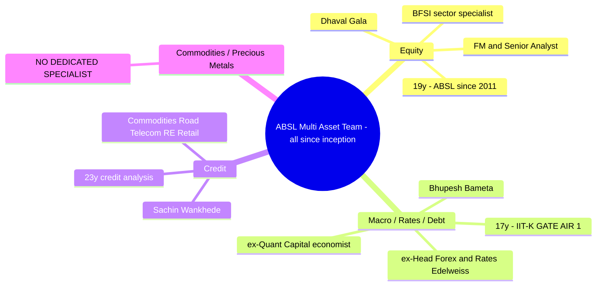
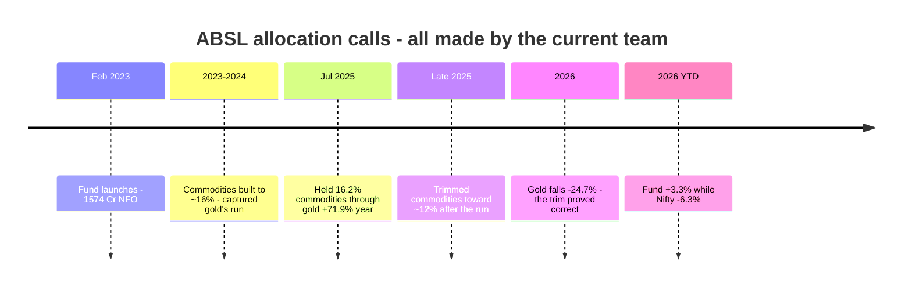
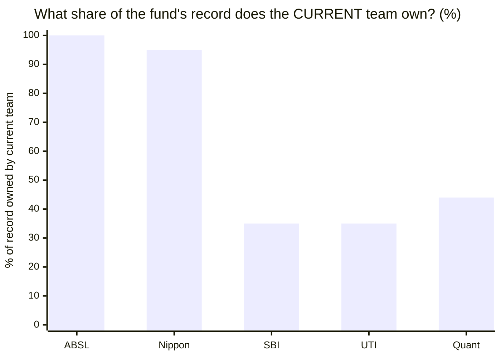
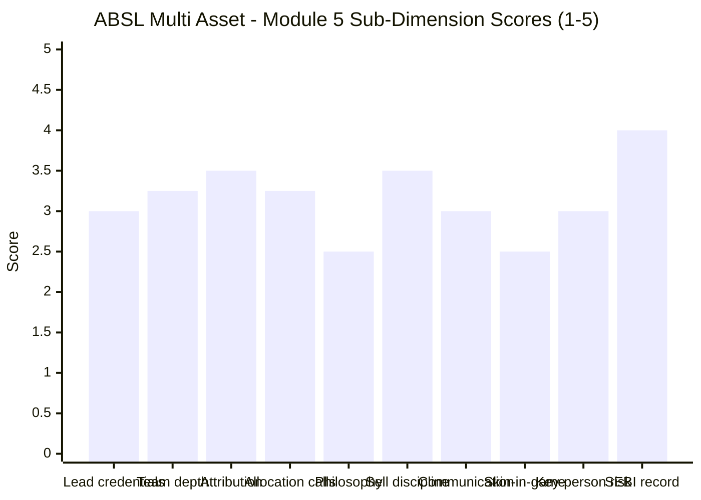

# Module 5: Fund Manager / Team Quality — Aditya Birla Sun Life Multi Asset Allocation Fund

> **Provisional Module 5 score: ~3.2 / 5** (weight **10%** in the multi-asset re-weight — lower than the equity studies' 15%, because allocation here is more model/mandate-driven than single-manager stock-picking). **Scores are NOT comparable to the four equity categories.**

> **The one-line context:** ABSL has the study's **cleanest attribution story and its best-matched macro brain — and a conspicuous hole where the commodities specialist should be.** All three managers have run the fund **since inception (Jan 2023)**, so — uniquely among the five studied funds — **100% of the record belongs to the people who will manage your money.** The macro seat is genuinely outstanding: **Bhupesh Bameta (IIT-Kanpur, GATE All-India-Rank-1, ex-Head of Forex & Rates Research at Edelweiss, 17y)** is arguably the ideal profile for a job that *is* fundamentally a macro call. But three things temper it: the equity lead, **Dhaval Gala, is a Banking & Financial Services *sector specialist*** — a tier below the Head-of-Equity credentials SBI fields, and his specialty shows up directly as M3's **~11% four-bank concentration**; the "commodities" seat is held by a **credit analyst**, so the ~12% precious-metals sleeve — the fund's entire differentiator — has **no dedicated specialist**; and there is **no published allocation philosophy at all** (M3), so the team's process cannot be tested. Their calls in 3.49 years have been good. Nobody knows yet whether that is process or weather.

---

## Fund Identity / Raw Data (web-researched — ABSL/ValueResearch/Business Standard, Jul 2026)

| Attribute | Detail | Source |
|-----------|--------|--------|
| **Equity lead** | **Dhaval Gala** — Fund Manager & Senior Analyst, ABSL AMC | ABSL / VR |
| — on this fund since | **Inception (Jan/Feb 2023) — 3.49y** | VR / ABSL |
| — experience / credentials | **19y** equity & capital markets; joined ABSL **Feb 2011** (~15y at firm); **MBA/PGDBM Finance, N L Dalmia**; prior **B&K Securities, JP Morgan Chase India** | ABSL profile |
| — **specialisation** | ⚠ **Banking & Financial Services sector specialist** (not a generalist allocator) | **ABSL profile (explicit)** |
| **Macro / debt manager** | **Bhupesh Bameta** — Fund Manager **& Economist** | ABSL / VR |
| — on this fund since | **Inception — 3.49y**; joined ABSL Fixed Income **Dec 2017** | ABSL |
| — experience / credentials | **17y**; **IIT-Kanpur engineering; All India Rank 1 in GATE**; ex-**Head of Research, Forex & Rates Desk, Edelweiss Securities**; **6y economist at Quant Capital** | **ABSL profile** |
| **Third manager ("commodities")** | **Sachin Wankhede** — joined ABSL **2016** | ABSL / VR |
| — experience / credentials | **23y in credit analysis, evaluation, risk assessment & due diligence**; covers **credit** of companies in Commodities, Road, Telecom, Real Estate, Retail | **ABSL profile** |
| — ⚠ nature of the seat | **A credit analyst covering commodity-*sector companies* — not a precious-metals/gold allocation specialist** | derived from ABSL profile |
| **Manager changes since launch** | **NONE — all three since inception** | VR / search |
| **Allocation philosophy (published)** | ⚠ **None found** — no documented quantitative or valuation model (M3) | M3 / search |
| Skin in the game | Not disclosed (large listed AMC; SEBI-mandated only) | — |
| Personal SEBI record | Clean (AMC-level governance → M6) | — |

---

## Cross-Source Verification

| Fact | Sources | Verdict |
|------|---------|---------|
| Gala: 19y, ABSL since Feb 2011, **BFSI sector specialist**, MBA N L Dalmia | ABSL profile, MarketScreener, LinkedIn, RocketReach | ✅ Consistent — "sector specialist" is ABSL's own wording |
| Bameta: 17y, ABSL Dec 2017, **IIT-K / GATE AIR-1**, ex-Edelweiss forex-rates head, ex-Quant Capital economist | ABSL profile, Paytm Money, Business Standard | ✅ Consistent, primary-sourced |
| Wankhede: 23y **credit analysis**, ABSL since 2016 | ABSL profile, VR | ✅ Consistent — described as credit, not commodities allocation |
| All three manage the fund from inception; no changes | VR, Groww, search | ✅ Confirmed — **the only studied fund with 100% team attribution** |
| No published allocation model | M3 + ABSL site + search | ✅ Confirmed absent (a negative finding, stated as such) |

**Reliability: High** on identities, credentials and tenure — all primary-sourced from ABSL's own investment-team pages and corroborated. The *quality* assessment below is inferred from what the portfolio actually did (M1–M4), not from biographies.

---

## 1. The Team — Strong on Macro and Credit, Absent on Commodities

**The structure is genuinely three-deep with 17–23 years of experience each — but it is not the structure a multi-asset fund most needs.** Reading the seats honestly:

| Seat | Who | Fit for this fund |
|------|-----|-------------------|
| **Macro / asset allocation** | **Bameta** | ✅ **Excellent — the best-matched credential in the study.** Allocation between equity, debt and gold *is* a macro call, and Bameta is a career macro economist and rates/forex specialist with elite academic credentials (IIT-K, GATE AIR 1). Better suited to *this specific job* than SBI's equity-lead or UTI's passive-quant lead |
| **Debt / credit** | **Wankhede** (23y credit) + Bameta (rates) | ✅ **Strong** — and directly relevant: M3 found the debt book reaches into corporate credit (Cholamandalam debenture). A 23-year credit specialist is exactly who should be underwriting that |
| **Equity** | **Gala** | ⚠ **Adequate but narrow** — 19y and 15 years inside ABSL, but a **BFSI sector specialist** running a 117-name flexi-cap book, titled "Fund Manager and Senior Analyst" rather than a Head of Equity |
| **Commodities / precious metals** | ⚠ **Nobody** | ❌ **The gap.** Wankhede analyses *credit of commodity-sector companies*, which is a different discipline from allocating to gold and silver. Contrast **SBI**, which fields a dedicated commodities manager (Vandna Soni) who runs its Gold and Silver ETFs |

**Why the commodities gap matters here specifically:** ABSL's ~12–16% gold+silver sleeve is its principal differentiator from a plain aggressive hybrid — and M2 found that sleeve **turned into a risk source in 2026** (gold −24.7%, cushion cut to +2.3pp). The one asset class that most needs a specialist has none. This is the same structural weakness flagged at UTI (a 4-year junior in the commodity seat), arriving by a different route.

---

## 2. ⭐ The Allocation-Call Track Record — Good Calls, Thin Sample (Tier-1 dimension)

The defining test for a multi-asset team: reconstruct the equity/debt/gold path (M3) and grade the calls. **ABSL's advantage here is that there is no attribution ambiguity — every call below is this team's.**

| Turn | What a skilled allocator would do | What ABSL did | Grade |
|------|-----------------------------------|---------------|-------|
| ❌ **2020 COVID crash** | Buy equity into the crash | **Fund did not exist** | — |
| ❌ **2022 all-diverge** | Hold gold, cut duration | **Fund did not exist** | — |
| **Gold's 2025 run (+71.9%)** | Hold a meaningful gold weight | **Held 16.2%** — captured it (2025 alpha **+1.4%**, per M3's correction) | ✅ **Good** |
| **After the run, into 2026** | Trim the winner | **Trimmed ~16.2% → ~12%** | ✅ **Correct** — gold then fell −24.7% |
| **2026 equity softness** | Stay defensive | **+3.3% YTD vs Nifty −6.3%** (M1) | ✅ **Good** |
| **Sep-24 → Mar-25 correction** | Cushion the fall | −8.84% vs Nifty −15.52% (+6.7pp) | ✅ **Good** |

**Verdict: every gradeable call this team has made has been right — and that is a genuinely better record than UTI's or SBI's.** UTI's team cut gold *into* its boom (value-destroying); SBI's team never tactically allocated at all. ABSL's team held a winner through its best year and trimmed it before it fell. **On the evidence available, this is the best allocation-call record of the studied funds.**

**Why it does not score higher — three honest limits:**
1. **The sample is 3.49 years of bull market with four gradeable events.** Four correct calls is encouraging; it is not a track record. M3 explicitly noted the 16.2%→12% trim is equally consistent with **passive drift as gold's price fell** as with a deliberate decision.
2. **No 2020 or 2022.** The two calls that separate real allocators from lucky ones — buying equity into a crash, managing duration through a rate shock — have never been asked of this team.
3. **There is no stated process to credit the calls to** (§3). Good outcomes without a documented method are indistinguishable from good weather.

> **The M3 correction matters here.** M1 originally recorded a −1.8% gold lag in 2025 and read it as under-harvesting. M3's factsheet backfill showed the benchmark had over-assumed gold; **on actual weights the team was +1.4% ahead.** So the charge that ABSL shares UTI's gold failure is withdrawn — and this team's allocation record is materially cleaner than M1 implied.

---

## 3. Philosophy, Sell Discipline, Communication, Skin-in-Game

| Dimension | Assessment | Score input |
|-----------|------------|-------------|
| **Allocation philosophy (documented)** | ⚠ **The weakest of the studied funds.** M3 found **no published quantitative or valuation model** — unlike UTI's stated valuation model (albeit refuted) or Quant's VLRT. The SID describes *what* the fund holds (flexi-cap equity with large-cap bias, accrual debt, gold/silver/REITs) but not *how* the split is decided. **An undocumented process cannot be tested, and cannot be relied upon to survive a manager change** | **2.5** |
| **Sell / rebalance discipline** | ✅ Genuinely good on the available evidence — trimmed gold after a +71.9% run, before a −24.7% fall (§2). Thin sample, but the direction is right and it is the opposite of UTI's failure | 3.5 |
| **Investor communication** | Reasonable-institutional: ABSL publishes detailed manager profiles (the best-documented team pages in this study), and **Bameta is a visible media voice** (Business Standard interviews, ABSL knowledge-centre content). **No structured quarterly fund-manager letters** (the PPFAS standard) | 3.0 |
| **Skin in the game** | Not disclosed — no PPFAS/DSP-style co-investment policy | 2.5 |
| **Cross-fund consistency** | Gala manages other ABSL equity mandates (BFSI-focused); Bameta runs fixed-income mandates. **No red flags found, but no standout flagship record either** — none of the three has a marquee fund that validates their process | 3.0 |
| **Crisis experience (personal)** | ✅ Individually **yes** — Gala (19y, through 2008 GFC-era markets and 2020), Bameta (17y, ran forex/rates research through 2013 taper and 2020), Wankhede (23y credit, through IL&FS/DHFL). **But never together, and never on this mandate** | 3.0 |
| **Key-person / succession risk** | **MODERATE** — a genuine three-person team inside a large listed AMC, so no single-star cliff. But the process is undocumented (§3), which means **institutional memory is thin**: if Bameta (the macro brain) left, there is no written model for a successor to follow | 3.0 |
| **SEBI record (personal)** | Clean; no adverse findings against any of the three | 4.0 |
| **Investor-base character** | Retail-heavy via ABSL's large distribution; AUM grew 4.4× since NFO (M4) — **flows-driven growth in a hot category**, which brings accountability but also new-money pressure | 3.0 |

---

## 4. ⭐ Tenure & Attribution — the Study's Cleanest Record Ownership

| Fund | Record length | Current team since | **Share owned** | Read |
|------|---------------|--------------------|-----------------|------|
| **ABSL** | **3.49y** | **Inception** | **100%** ✅ | **No attribution ambiguity whatsoever** |
| Nippon | 5.9y | architect **left**; successor recent | ~95% of record is the *departed* architect's | ⚠ The record belongs to someone who left |
| SBI | 13.4y | Balachandran Oct-2021; rest 2023–24 | ~35% | Flattering pre-2019 history is a debt-MIP predecessor's |
| UTI | 13.6y | Goyal Nov-2021 | ~35% | Pre-2021 record is Srivatsa's |
| Quant | 13.6y | Tandon throughout (reliable from 2020) | ~44% | Pre-2018 record is a different AMC's |

**This is ABSL's clearest structural advantage in the entire study.** In every other fund, the headline track record was substantially earned by people who are no longer running it — a caveat that forced explicit warnings in SBI's, UTI's and Nippon's modules. **Here, the numbers and the people match exactly.** Whatever the record shows, good or bad, it is a true signal about this team.

**The unavoidable counterweight:** 100% of **3.49 years of uninterrupted bull market**. Perfect attribution of a short, easy record is worth less than partial attribution of a long, tested one. SBI's team owns only ~35% of its record — but that 35% includes 2022 and the 2024–25 correction. **ABSL's team owns everything and has been tested by almost nothing.**

---

## Comparison with Studied Fund Managers

| Fund | Lead / team | Tenure on fund | Key edge | Key gap | Module 5 |
|------|-------------|----------------|----------|---------|----------|
| SBI Multi Asset | Balachandran (IIT-B/MIT/CFA, Head of Equity) + 4-desk team | 4.75y / 2.5y | Heavyweight lead; **dedicated commodities desk**; ideal structure | No allocation skill; record predates team; secondary mandate | ~3.2 |
| **ABSL Multi Asset** | **Gala (BFSI specialist) + Bameta (macro) + Wankhede (credit)** | **3.49y — since inception** | **100% attribution; best macro credential; every gradeable call correct** | **No commodities specialist; no published philosophy; 3.49y bull-only** | **~3.2** |
| Nippon Multi Asset | post-architect transition | recent | Best team structure | Architect left; successor unproven | ~3.0 |
| UTI Multi Asset | Goyal (quant/passive) + team | 4.7y | Coherent systematic structure | **Worst allocation call in the study**; thin commodity seat | ~2.8 |
| Quant Multi Asset | Tandon (solo) | — | Singular talent | One-man risk + SEBI front-running probe | ~2.4 |

**The honest cross-read: ABSL ties SBI at 3.2, reached from the opposite direction.** SBI fields better individual credentials and the only genuine commodities desk in the study — but its team inherited a record it didn't earn and has shown no allocation skill. ABSL fields a narrower bench with a conspicuous commodities hole and no written process — but owns its entire record and has, so far, got every call right. **Neither is a strong manager proposition; they are differently incomplete.**

---

## Points For / Points Against — Manager / Team

### ✅ For
1. **⭐ 100% record attribution** — all three managers since inception; the only studied fund where the numbers and the people match exactly.
2. **⭐ The best-matched macro credential in the study** — Bameta (IIT-Kanpur, GATE All-India-Rank-1, ex-Head of Forex & Rates Research at Edelweiss, 6y economist at Quant Capital) is arguably the ideal profile for a job that is fundamentally a macro allocation call.
3. **Every gradeable allocation call has been correct** — held 16.2% gold through its +71.9% year, trimmed before the −24.7% fall, cushioned Sep-24→Mar-25 (+6.7pp), and stayed positive in 2026 while equity fell. The best allocation-call record of the studied funds.
4. **Genuine three-person team with deep experience** (19y / 17y / 23y), inside a large listed AMC — no single-star cliff.
5. **Strong credit bench** (Wankhede, 23y) — directly relevant given M3 found corporate credit (Cholamandalam) in the debt book.
6. **Stable — zero manager changes** in the fund's life.
7. **Well-documented team disclosure** — ABSL publishes the most detailed investment-team profiles of any AMC in this study.
8. **Clean personal regulatory records** across all three.

### ❌ Against
1. **⚠ No dedicated commodities/precious-metals specialist** — the "commodities" seat is a *credit analyst* covering commodity-sector companies. The ~12–16% gold+silver sleeve, the fund's entire differentiator, has no specialist owner (SBI, by contrast, fields a manager who runs its Gold and Silver ETFs).
2. **⚠ No published allocation philosophy or model** — the weakest process disclosure of the studied funds; an undocumented process is untestable and leaves thin institutional memory.
3. **The equity lead is a BFSI sector specialist, not a generalist allocator** — and his specialty shows up as M3's **~11% four-bank concentration**, an un-hedged sector bet inside a fund bought for diversification.
4. **3.49 years, all bull market** — 100% attribution of a record with no 2020, no 2022, and no bear market; four correct calls is encouraging, not a track record.
5. **A tier below SBI on lead credentials** — "Fund Manager and Senior Analyst" versus a Head of Equity with a marquee flagship (SBI Contra).
6. **No standout flagship record** validating any of the three — no marquee fund proves the process.
7. **No skin-in-game disclosure; no structured quarterly letters.**
8. **The team has never worked a crisis together** on this mandate — individual crisis experience exists, collective experience does not.

---

## Module 5 Scorecard

| Sub-dimension | Score | Reasoning |
|---------------|-------|-----------|
| Lead-manager credentials | **3.0** | Gala: 19y, 15 at ABSL, MBA — solid, but a **BFSI sector specialist** titled "FM & Senior Analyst," a clear tier below SBI's Head-of-Equity lead |
| Team depth & structure | **3.25** | Three genuine specialists (19/17/23y) with an **excellent macro seat** and strong credit bench — but **no commodities specialist** for the fund's key differentiator |
| **Tenure / attribution** | **3.5** | ⭐ **100% of the record is this team's** — unique in the study; capped because that record is only 3.49 bull-market years |
| **Allocation-call track record** | **3.25** | ⭐ **Every gradeable call correct** (held gold through the run, trimmed before the fall, 2026 defensive) — the best of the studied funds; capped hard by a 4-event, no-2020/2022 sample and M3's "could be drift" caveat |
| Philosophy clarity (allocation) | **2.5** | ⚠ **No published model or framework** — the weakest process disclosure in the study; outcomes cannot be attributed to a method |
| Sell / rebalance discipline | **3.5** | Genuinely good evidence — trimmed a winner before it fell; the opposite of UTI's value-destroying call |
| Investor communication | **3.0** | Best team-page disclosure in the study; Bameta is a visible media voice; no quarterly letters |
| Skin in the game | **2.5** | Not disclosed |
| Key-person / succession risk | **3.0** | Three-person team + large listed AMC (no star cliff), but the **undocumented process** means thin institutional memory if Bameta leaves |
| SEBI record (personal) | **4.0** | Clean across all three |
| **Module 5 Overall** | **~3.2 / 5** | The study's cleanest attribution and best-matched macro credential, with every allocation call so far correct — offset by **no commodities specialist for the fund's defining sleeve**, **no documented philosophy**, a sector-specialist equity lead whose bias shows in an 11% bank concentration, and a 3.49-year bull-only sample. Encouraging, unproven. Not comparable to equity-category Module 5 scores |

---

## Comparative Module 5 Scores (studied funds — calibration only)

| Fund | Module 5 | Manager verdict |
|------|----------|-----------------|
| SBI Multi Asset | ~3.2 | Heavyweight lead + ideal 4-desk team incl. commodities; no allocation skill; record predates team |
| **ABSL Multi Asset** | **~3.2** | **100% attribution, elite macro seat, all calls correct — but no commodities specialist, no written philosophy, 3.49y bull-only** |
| Nippon Multi Asset | ~3.0 | Best structure, but architect left; successor unproven |
| UTI Multi Asset | ~2.8 | Systematic team — but owns the study's worst allocation call |
| Quant Multi Asset | ~2.4 | Singular talent, worst governance/key-person risk |

> Module 5 is 10% here (vs 15% in equity studies) — deliberately, because in a team-run, institution-backed product the single-manager axis matters less. ABSL's 3.2 ties SBI from the opposite direction: **better calls and cleaner attribution, weaker credentials and a missing desk.**

---

## SIP Implication

For a ₹15–20k/month SIP, the manager picture is the most *encouraging* part of the ABSL case — and the hardest to bank on. Two things are genuinely reassuring. First, **you are buying the people who produced the record**: all three managers have run this fund since inception, so unlike SBI, UTI or Nippon there is no gap between the track record and the team. Second, **their calls have been right** — they held a 16% gold sleeve through its +71.9% year and trimmed it before gold fell 24.7%, cushioned the 2024–25 correction, and kept the fund positive in 2026 while equity fell. That is the best allocation-call record in the study, and it is materially better than UTI's, whose team destroyed value at the same turns.

**What should temper confidence is what is missing rather than what has gone wrong.** The fund's defining sleeve — ~12–16% in gold and silver — has **no dedicated commodities specialist**; the seat is filled by a credit analyst, at a fund house where that gap is a choice, not a constraint (SBI staffs it properly). There is **no published allocation philosophy**, so an investor cannot distinguish a repeatable process from four fortunate decisions, and a successor would have no written method to inherit. The equity lead is a **banking-sector specialist**, and that bias is visible as an ~11% concentration in four banks inside a fund bought for diversification. And all of it rests on **3.49 years in which nothing went badly wrong.** The honest summary: **a well-credentialled, stable, correctly-attributed team that has made good calls in easy conditions, with a structural hole exactly where this category's risk lives.**

## One-Line Verdict

**The study's cleanest attribution — all three managers since inception, so 100% of the record is genuinely theirs — paired with its best-matched macro credential (Bameta: IIT-K, GATE AIR-1, ex-Head of Forex & Rates) and the best allocation-call record of any studied fund, every gradeable decision correct; undercut by no dedicated commodities specialist for the ~12% metals sleeve that is the fund's whole differentiator, no published allocation philosophy at all, a BFSI-specialist equity lead whose bias shows as an 11% bank concentration, and a 3.49-year sample in which nothing has yet gone wrong.**

---

*Module 5 complete. Provisional score 3.2/5. Method: web research (ABSL investment-team profiles — primary source, ValueResearch, Groww, Business Standard, MarketScreener, Paytm Money) for team identities, credentials and tenure; allocation-call track record graded against the M3 effective-weight/factsheet path and M1 calendar returns, with attribution confirmed to inception. **Cross-module retrofit (Edelweiss discipline):** M5 *reinforces* M3's favourable rebalancing finding and **carries forward M3's correction of M1** — the withdrawn "gold under-harvesting" charge means this team's allocation record is materially cleaner than M1 implied, and it is now graded as the **best of the five studied funds** on allocation calls. M5 also **connects M3's ~11% four-bank concentration to its cause**: the equity lead is an explicit BFSI sector specialist — a new, specific finding not available before this module. M5 **independently corroborates M2's commodity concern** from the staffing side: the sleeve that turned into a risk source in 2026 has no specialist owner. No prior score changes. **Deferred:** skin-in-game policy, portfolio-turnover attribution by manager, SID-stated allocation process (M3 found none published). Running scorecard: **M1 ~3.2 · M2 ~3.1 · M3 ~3.0 · M4 ~3.3 · M5 ~3.2.***

*Next: [Module 6 — AMC Trustworthiness](module6_amc.md)*
