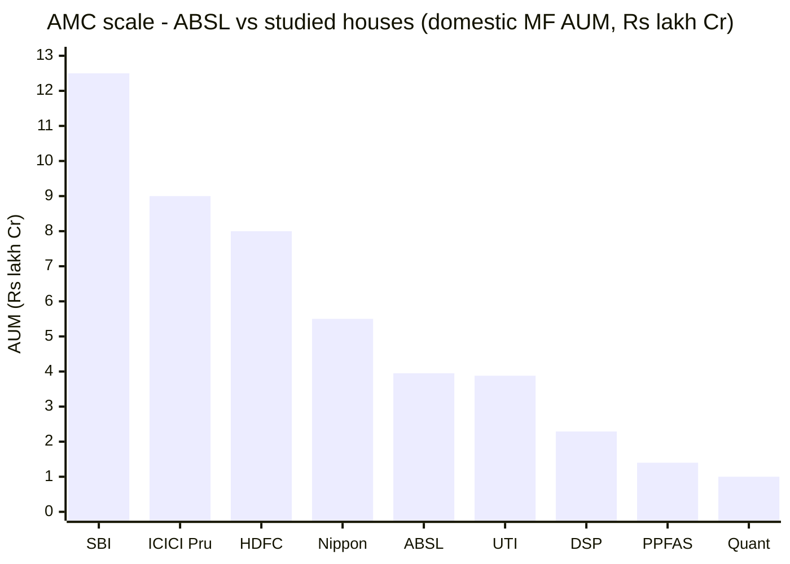
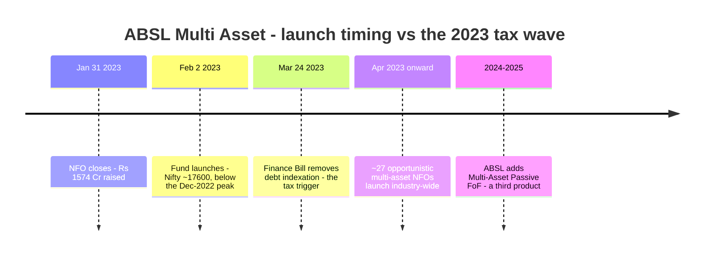
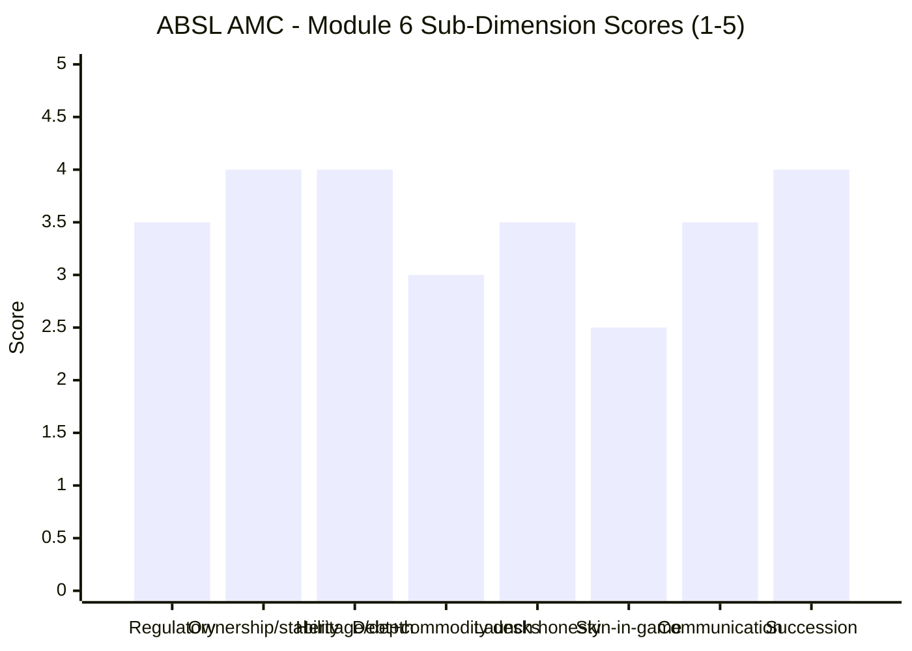

# Module 6: AMC Trustworthiness — Aditya Birla Sun Life Multi Asset Allocation Fund

> **Provisional Module 6 score: ~3.6 / 5** (weight **5%**). **Scores are NOT comparable to the four equity categories.**

> **The one-line context:** a strong, well-owned, listed house — **a 25-year JV between the Aditya Birla Group and Sun Life Financial (Canada)**, ₹4.74 lakh Cr QAAUM, listed since 2021, with the **best investment-team disclosure of any AMC in this study** (M5). It also gets the two multi-asset-specific governance questions right: **it did NOT game the 2023 tax wave** (the fund launched **Jan-2023, before** the March-2023 indexation change, and into a correction rather than a top), and it runs its gold and silver ETFs **in-house**. The debits are specific and material to *this* fund: the **fixed-income desk carries genuine credit scars** — a **₹793 Cr Essel/Adilink side-pocket across three schemes (3.7–7.5% of their AUM)** and an IL&FS-driven ICRA downgrade — which matters because M3 found this fund's debt book reaching into corporate credit; and the AMC now runs **three overlapping multi-asset products**, which raises a fund-suite-coherence question. A credible house with a blemished debt desk.
>
> **No prior study covered ABSL's AMC — this is a fresh assessment (no carry-forward).**

---

## Fund Identity / Raw Data (web-researched, Jul 2026)

| Attribute | Detail | Source |
|-----------|--------|--------|
| AMC | **Aditya Birla Sun Life AMC Ltd** | — |
| **Ownership** | **JV: Aditya Birla Capital Ltd + Sun Life (India) AMC Investments Inc.** (ultimately **Sun Life Financial Inc., Canada**) — partnership since **2001** | SAI / ABSL |
| **Listing** | **Listed 2021** (BSE/NSE) — public-market disclosure; files quarterly SEBI certificates + BRSR | ScanX / TipRanks |
| **QAAUM (incl. alternates)** | **₹4,74,002 Cr** (31 Mar 2026), **+17% YoY** | ABSL FY26 |
| Domestic MF AUM | ~₹3.9–4.0 lakh Cr (lower than the headline; roughly **5th-largest** Indian AMC) | derived |
| Heritage | Birla Sun Life MF operating since **~1994** (~32 years) — one of India's older private AMCs | ABSL |
| **Promoter encumbrance** | **Nil** for FY2026 — no pledged promoter shares | TipRanks |
| **Fixed-income desk** | ⚠ **Genuine credit scars** — **Essel/Adilink ₹793 Cr side-pocket (Nov 2019)** across ABSL Medium Term, Credit Risk & Dynamic Bond (3.7–7.5% of AUM each); **IL&FS/Jharkhand Road** exposure → ICRA cut ABSL Short Term Opportunities AA+mfs → AAmfs. **Essel fully recovered (₹840 Cr incl. interest)** after the Zee stake sale | Business Standard |
| **Commodity desk** | **In-house ABSL Gold ETF + ABSL Silver ETF** (physical-backed; the vehicles this fund holds — M3) | M3 / Groww |
| **Multi-asset product count** | ⚠ **Three overlapping products:** Multi Asset Allocation Fund (2023) · **Multi Asset Omni FoF** · **Multi-Asset Passive FoF** | MFAPI scheme registry |
| Launch timing | **NFO Jan-31-2023, ₹1,574 Cr** — **before** the Mar-2023 debt-indexation change | Business Standard |
| Skin in the game | Not disclosed (large listed AMC; SEBI-mandated only) | — |
| Major SEBI penalty / fraud | **None found** | search |

---

## Cross-Source Verification

| Fact | Sources | Verdict |
|------|---------|---------|
| ABC + Sun Life Financial JV since 2001; both SEBI-registered sponsors | ABSL SAI (primary), BofA DRHP | ✅ Consistent, primary-sourced |
| QAAUM ₹4,74,002 Cr incl. alternates, +17% YoY (Mar-2026) | ABSL FY26 disclosures | ✅ Confirmed |
| Listed; quarterly SEBI certificates + BRSR filed | ScanX, TipRanks | ✅ Confirmed |
| **Essel/Adilink ₹793 Cr side-pocket, 3.7–7.5% of three schemes; later ₹840 Cr recovered** | Business Standard (multiple) | ✅ **Confirmed — a documented credit event *and* a documented recovery** |
| IL&FS → ICRA downgrade of ABSL Short Term Opportunities | Business Standard | ✅ Confirmed |
| NFO Jan-2023, ₹1,574 Cr | Business Standard | ✅ Confirmed |
| Nil promoter encumbrance FY26 | TipRanks | ✅ Confirmed |

**Reliability: High.** Ownership and AUM are primary-sourced from ABSL's own SAI and FY26 disclosures; the credit events are documented in contemporaneous financial press with both the impairment *and* the subsequent recovery reported. No fabrication; the debt-desk assessment below is built on named, dated events.

---

## 1. Scale, Heritage & Ownership — a Strong, Stable, Listed JV

ABSL sits in the **upper-middle of the Indian AMC field** — roughly 5th by domestic MF AUM, essentially level with UTI, well behind SBI/ICICI/HDFC. What that buys a multi-asset fund:

- **Adequate cross-asset depth** — in-house equity, fixed income, and a genuine commodity-ETF franchise (gold *and* silver). All three desks a multi-asset fund needs exist internally; none is best-in-class.
- **Genuine financial stability** — a **25-year JV** between one of India's largest conglomerates (Aditya Birla Group) and **Sun Life Financial**, a major Canadian insurer/asset manager. Listed since 2021 with public-market scrutiny, and **nil promoter encumbrance**.
- **Foreign-partner governance** — Sun Life's participation brings global risk/compliance standards, the same structural positive noted for SBI (Amundi) and DSP (formerly BlackRock).

**The honest nuance:** ABSL is a **share-loser over the past decade** — historically a top-3/4 house, now ~5th, having been overtaken as SBI, ICICI and Nippon grew faster. The **+17% YoY QAAUM growth** is healthy in absolute terms, but the franchise is no longer gaining ground. That is a business fact rather than a trust concern, and it does not bear directly on this fund — but it is the context for the product-proliferation question in §3.

---

## 2. ⭐ Fixed-Income & Commodity Desk Credibility — the Multi-Asset Import (NEW)

A multi-asset fund is only as good as the *worst* of its asset-class desks. **This is where ABSL's assessment is genuinely mixed, and it matters more here than the headline scale.**

| Desk | Assessment | Relevance to this fund |
|------|------------|------------------------|
| **Fixed income (~10% of the book)** | ⚠ **Real, documented credit scars.** In the 2018–19 stress wave ABSL: (a) **side-pocketed ₹793 Cr of Essel Group (Adilink Infra) debentures** across ABSL Medium Term, Credit Risk and Dynamic Bond funds — exposures of **3.7%–7.5% of each scheme's AUM**, a substantial concentration; (b) held **IL&FS-linked Jharkhand Road Projects** paper, triggering an **ICRA downgrade** of ABSL Short Term Opportunities (AA+mfs → AAmfs). **Mitigant: the Essel position was ultimately repaid in full — ₹840 Cr including interest — after the Zee stake sale.** So: a desk that **reached for yield, got caught, and eventually recovered** | ⚠ **Directly relevant** — M3 found this fund's debt book holds a **Cholamandalam Investment debenture** (corporate credit), not a pure sovereign/AAA book. The desk underwriting that credit has a documented history of reaching too far |
| **Commodities / gold-silver (~12–16%)** | ✅ **Adequate and in-house** — ABSL runs its own **Gold ETF and Silver ETF**, physical-backed, and this fund holds them directly (M3), so there is no external FoF wrapper and a negligible cost layer (M4). Not the deepest commodity franchise in the study (Nippon's is), but a real one | ✅ Supports M3's positive gold-mechanism finding |
| **Equity** | ✅ Solid, deep bench; ABSL is an established equity house with a large analyst team and detailed public manager profiles (M5) | ✅ |

> **⭐ RETROFIT to M2/M3 (Edelweiss discipline) — this module *does not* provide the reassurance SBI's did.** M2 and M3 both flagged ABSL's debt book as "reaches into corporate credit, duration unverified, never rate-shock tested," and deferred the desk-quality question here. **M6's answer is cautionary rather than reassuring:** unlike SBI (whose conservative FI desk *supported* the high-grade presumption), ABSL's desk has a **named, dated history of concentrated credit accidents** — even though it recovered the money. **This does not change M2's or M3's scores** (both already scored the debt sub-dimension at 3.0 on unverified quality, and the sleeve is only ~10% of the fund), but it **removes any benefit of the doubt** and converts the debt book from "unverified" to "unverified, under a desk with form." It reinforces the M2 review trigger on debt-credit deterioration.

---

## 3. Launch-Timing Honesty & Franchise Commitment (NEW)

**✅ The launch-timing verdict is genuinely favourable — and better than the category norm.** The screening found ~27 multi-asset NFOs launched *after* the March-2023 debt-indexation change, harvesting tax-driven flows at a market top. **ABSL launched in January 2023 — roughly two months before the tax change was announced — and into a market that was *below* its December-2022 peak, not at a top.** There is **no tax-wave gaming here**, and the timing was, if anything, investor-favourable. This is a real governance credit, matching SBI's (which recategorised rather than launched) and UTI's (a 2008-vintage fund).

**⚠ The offsetting debit — product proliferation.** ABSL now runs **three overlapping multi-asset products**:

| Product | Structure | Note |
|---------|-----------|------|
| **Multi Asset Allocation Fund** (2023) | Direct-holding, active | **The fund studied here** |
| **Multi Asset Omni FoF** | Fund-of-funds | Pre-dates the Allocation Fund |
| **Multi-Asset Passive FoF** | Passive fund-of-funds | Added later (~2024–25) |

Running an active direct-holding fund, an active FoF, *and* a passive FoF in the same category is **product proliferation more than franchise commitment.** It gives distributors three things to sell into the same investor need, and it dilutes the claim that any one of them is the house's considered multi-asset answer. **Honest caveat:** I have not studied the two FoFs in depth — their mandates may differ meaningfully (the passive FoF in particular is a legitimately distinct, low-cost proposition). But the *pattern* — a house that lost AUM share adding overlapping products in a hot category — is a fair flag rather than a finding. Multi-asset is **not** an ABSL flagship; the house's identity is equity and fixed income.

---

## 4. Regulatory & Governance Record — Clean of Misconduct

| Item | Detail |
|------|--------|
| Major fraud / front-running | **None found** (the Quant contrast) |
| Major SEBI penalty | **None found**; files quarterly compliance certificates and BRSR as a listed entity |
| **Credit events** | ⚠ **Essel/Adilink side-pocket (2019) and IL&FS exposure** — these are **investment-judgment failures, not governance failures.** Handled through the proper SEBI side-pocketing mechanism, disclosed, and ultimately recovered in full |
| Promoter encumbrance | **Nil** (FY26) — no pledged promoter shareholding |
| Ownership stability | 25-year JV; no boardroom disputes of the kind UTI experienced |
| Verdict | **A clean governance record with a blemished investment record on the debt side** — an important distinction. Nothing here suggests the AMC mistreats investors; it suggests one desk took too much credit risk in 2018–19 |

**This is a materially better governance profile than UTI's** (fragmented four-PSU ownership, the 2018 board crisis, SEBI intervention) and vastly better than Quant's (front-running settlement). The Essel/IL&FS episodes were industry-wide phenomena in which ABSL was among the more exposed — a competence question, not an integrity one.

---

## 5. Investor Communication, Skin-in-Game, Conduct, Succession

| Dimension | Assessment | Score input |
|-----------|------------|-------------|
| **Investor communication** | ✅ **The best team-level disclosure in this study** — ABSL publishes detailed, individually-sourced investment-team profiles (credentials, prior firms, tenure) that made M5's research materially easier than for any other fund. Listed-company disclosure, BRSR, active knowledge-centre content, and a visible media presence (Bameta). **No structured quarterly fund-manager letters** (the PPFAS standard) | 3.5 |
| **Skin in the game** | Not disclosed — no PPFAS/DSP-style co-investment policy | 2.5 |
| **Investor-first conduct** | No adverse conduct; the Essel side-pocket was handled through the correct mechanism and investors were eventually made whole. No flow-gating heroics either. **Neutral-positive** | 3.5 |
| **Succession / continuity** | ✅ **High** — a large listed AMC with a deep bench across equity, FI and commodities; the loss of any single manager is absorbable (though M5 noted the *undocumented process* thins institutional memory at fund level) | 4.0 |
| **AMC financial health** | ✅ Strong — listed, profitable, +17% QAAUM growth, nil promoter encumbrance, backed by two large sponsors | 4.0 |
| **Custodian / RTA / trustee** | Standard industry infrastructure (CAMS/KFin-tier RTA, established trustee company); **no issues found** | ✓ |
| **Global-parent trust split** | Sun Life Financial is a stable, well-regulated Canadian parent; **no local-vs-global governance tension** of the kind flagged for feeder structures | ✓ |

---

## Comparison with Studied AMCs

| AMC | Module 6 | Character |
|-----|----------|-----------|
| SBI Funds Management | ~3.9 | #1 scale; **strongest debt + commodity desks**; no launch-gaming; minor SEBI deficiencies |
| Nippon | ~3.7 | ETF-leading; **best commodity desk in the study**; FI blemish; smaller scale |
| **ABSL AMC** | **~3.6** | **Strong 25-yr JV, listed, best team disclosure, honest launch timing — but a genuinely scarred FI desk and three overlapping multi-asset products** |
| UTI AMC | ~3.4 | Deepest heritage + strong passive desk; fragmented PSU governance, 2018 board crisis |
| Quant | ~1.8 | Front-running settlement; thin non-equity desks |

**ABSL lands third of five — a credible, well-governed house, held below SBI and Nippon by exactly the dimension that matters most to a multi-asset fund: the quality of its non-equity desks.** SBI's conservative FI desk and Nippon's commodity franchise are genuine competitive advantages in this category. ABSL's FI desk, by contrast, is the one with documented credit accidents — and this fund holds corporate credit.

---

## Points For / Points Against — AMC

### ✅ For
1. **Strong, stable ownership** — a **25-year JV** between the Aditya Birla Group and **Sun Life Financial (Canada)**; listed since 2021; **nil promoter encumbrance**.
2. **Substantial scale and healthy growth** — ₹4.74 lakh Cr QAAUM including alternates, **+17% YoY**; ~5th-largest Indian AMC.
3. **✅ No 2023 tax-wave launch-gaming** — the fund launched **January 2023, before** the March-2023 indexation change, and **into a correction rather than a top**. Better timing conduct than the ~27 funds that followed the tax trigger.
4. **In-house commodity franchise** — ABSL Gold ETF **and** Silver ETF, physical-backed, held directly by the fund (no external FoF wrapper, negligible cost layer).
5. **⭐ The best investment-team disclosure of any AMC in this study** — detailed, verifiable manager profiles.
6. **Clean governance record** — no fraud, no front-running, no major SEBI penalty, no boardroom instability (the UTI contrast).
7. **Foreign-partner governance** — Sun Life brings global risk/compliance standards.
8. **The Essel credit event was ultimately made whole** — ₹840 Cr recovered including interest; handled through the proper side-pocket mechanism.

### ❌ Against
1. **⚠ A genuinely scarred fixed-income desk** — the **₹793 Cr Essel/Adilink side-pocket** across three schemes (**3.7–7.5% of each scheme's AUM** — a substantial concentration) plus **IL&FS exposure and an ICRA downgrade.** This fund's debt book holds corporate credit (Cholamandalam), underwritten by that desk.
2. **⚠ Three overlapping multi-asset products** (Allocation Fund + Omni FoF + Passive FoF) — proliferation rather than a single considered franchise answer.
3. **Multi-asset is not an ABSL flagship** — the house's identity is equity and fixed income; this is a secondary franchise.
4. **A decade of AUM share loss** — historically top-3/4, now ~5th, overtaken by SBI, ICICI and Nippon.
5. **No skin-in-game disclosure**; no structured quarterly investor letters.
6. **Non-equity desks are weaker than SBI's or Nippon's** — precisely the dimension a multi-asset fund imports.

---

## Module 6 Scorecard

| Sub-dimension | Score | Reasoning |
|---------------|-------|-----------|
| Regulatory cleanliness | **3.5** | No fraud, front-running or major SEBI penalty; nil promoter encumbrance. The Essel/IL&FS episodes were **investment-judgment**, not governance, failures — and were properly disclosed and resolved |
| Ownership independence & stability | **4.0** | 25-year ABC + **Sun Life Financial** JV, listed 2021, nil encumbrance — strong and stable, with global-partner governance |
| Heritage & institutional depth | **4.0** | ~32 years, ₹4.74L Cr QAAUM, ~5th-largest; deep benches across all three asset classes — docked for a decade of share loss |
| **Fixed-income + commodity desk credibility** | **3.0** | ⚠ **The multi-asset import, and ABSL's weakest link:** a documented ₹793 Cr Essel side-pocket (3.7–7.5% of three schemes) + IL&FS downgrade. Full recovery and a solid in-house gold/silver ETF franchise keep it at 3.0, not lower |
| Launch-timing honesty / franchise | **3.5** | ✅ **No tax-wave gaming** — launched before the Mar-2023 trigger, into a correction (+); ⚠ but **three overlapping multi-asset products** and a non-flagship franchise (−) |
| Skin in the game | **2.5** | Not disclosed |
| Investor communication / conduct | **3.5** | **Best team-level disclosure in the study**, listed-company reporting, BRSR, visible manager media presence; no quarterly letters |
| Succession / continuity | **4.0** | Large listed AMC with a deep bench; any single manager exit is absorbable |
| **Module 6 Overall** | **~3.6 / 5** | A credible, well-owned, listed house with honest launch timing and the study's best team transparency — held below SBI and Nippon by the dimension that matters most here: **a fixed-income desk with documented credit accidents**, plus multi-asset product proliferation. Not comparable to equity-category Module 6 scores |

---

## Comparative Module 6 Scores (studied funds)

| AMC | Module 6 |
|-----|----------|
| SBI Funds Management | ~3.9 |
| Nippon | ~3.7 |
| **ABSL AMC** | **~3.6** |
| UTI AMC | ~3.4 |
| Quant | ~1.8 |

---

## ⭐ The Complete Six-Module Picture — M6 as the Closer

With all six modules done, the weighted verdict:

| Module | Topic | Weight | Score | Weighted |
|--------|-------|--------|-------|----------|
| M1 | Returns & Allocation Alpha | 20% | 3.2 | 0.640 |
| M2 | **Risk Profile** | **25%** | 3.1 | 0.775 |
| M3 | Allocation Engine & DNA | 20% | 3.0 | 0.600 |
| M4 | Cost & Tax | 20% | 3.3 | 0.660 |
| M5 | Manager / Team | 10% | 3.2 | 0.320 |
| **M6** | **AMC** | **5%** | **3.6** | **0.180** |
| **TOTAL** | | **100%** | | **≈ 3.18 / 5** |

**Where ABSL lands:** **fourth of five** — Nippon ≈3.71, SBI ≈3.66, Quant ≈3.20, **ABSL ≈3.18**, UTI ≈3.03.

**The coherent story across six modules — and it is unusually uniform.** ABSL is the study's most *evenly* scored fund: **no module below 3.0, none above 3.6.** There is no disaster and no distinction. It is a **well-constructed 5-asset-class portfolio** (M3) run by a **correctly-attributed team that has made every gradeable call right** (M5), inside a **credible listed house** (M6), at a **fair 0.67% fee** that **beats DIY post-tax** (M4). Those are real positives, and several are genuine firsts in this study.

**What holds it at 3.18 is that almost every strength comes with a "but," and the two heaviest modules are its weakest.** Its headline returns (M1) and risk metrics (M2) look strong in absolute terms but rank **last of five on a like-for-like window** — worst Sharpe, worst Sortino, deepest drawdown — and were earned in **3.49 years with no 2020, no 2022, and no bear market at all.** It was **out-dampened by an Aggressive Hybrid, a Balanced Advantage fund and even a pure-equity flexi-cap fund** that hold no gold (M2). It is **not equity-taxed** (M4), so the category's structural trump card is absent. It has **no published allocation model** (M3) and the **most static return signature of the five** (R² 0.861). And the desks it most depends on — commodities at the team level (M5), fixed income at the AMC level (M6) — are precisely its thinnest.

**The honest summary: a competent, well-built, honestly-run fund that has done nothing wrong and proved nothing yet.** Whether ≈3.18/5 earns a portfolio slot — against SBI's and Nippon's cycle-tested alternatives, against a DIY gold-ETF-plus-debt-fund, or against doing nothing — is the decision-tree question. Module 6 hands it over as a fund whose case rests almost entirely on **evidence that does not yet exist.**

---

## SIP Implication

For a ₹15–20k/month SIP, the AMC is not a reason to avoid this fund, nor a reason to choose it. Aditya Birla Sun Life is a credible, listed, well-capitalised house with a 25-year global JV behind it, nil promoter encumbrance, no governance scandals, and the most transparent investment-team disclosure encountered anywhere in this study — you are not taking meaningful AMC-continuity risk, and the fund was launched honestly, ahead of the tax wave rather than riding it. **But the house does not add the structural reassurance that SBI or Nippon bring to their multi-asset funds.** Its fixed-income desk — the one underwriting the corporate credit sitting in this fund's debt sleeve — has a documented history of concentrated credit accidents (₹793 Cr side-pocketed in Essel, an IL&FS-driven downgrade), even though investors were ultimately made whole. Its commodity franchise is adequate rather than deep. And it now sells three overlapping multi-asset products, which is a distributor-friendly posture more than a considered house view. A sound house cannot fix what the other five modules found: **a fund that ranks last of five on like-for-like risk-adjusted terms, isn't equity-taxed, publishes no allocation model, and has never seen a bear market.**

## One-Line Verdict

**A credible, well-owned listed JV with genuinely honest launch timing and the best team transparency in the study — undercut, exactly where a multi-asset fund is most exposed, by a fixed-income desk carrying documented credit scars (₹793 Cr Essel side-pocket, IL&FS downgrade) that underwrites this very fund's corporate-credit sleeve, and by three overlapping multi-asset products that read as proliferation rather than commitment; a sound floor under a fund that finishes fourth of five at ≈3.18/5.**

---

*Module 6 complete. Provisional score 3.6/5. Method: web research (ABSL SAI — primary source, ABSL FY26 disclosures, Business Standard for the Essel/IL&FS credit events, TipRanks, ScanX, BofA DRHP). **No prior-study carry-forward** (ABSL's AMC is new to the studies). **Cross-module retrofit (Edelweiss discipline):** M6 answers the debt-desk question deferred by **M2 and M3 — and answers it cautiously rather than reassuringly.** Unlike SBI's M6 (which *supported* the presumption of a high-grade debt book), ABSL's fixed-income desk has a **named, dated history of concentrated credit accidents**, so this fund's Cholamandalam corporate-credit holding sits under a desk with form. **No M2 or M3 score change** — both already scored debt quality at 3.0 on unverified grounds, and the sleeve is only ~10% of the fund — but the benefit of the doubt is withdrawn and the M2 review trigger on debt-credit deterioration is reinforced. M6 also **independently corroborates M5's commodity-staffing concern** at the AMC level (an adequate, not deep, commodity franchise) and **confirms M1's launch-timing finding** with primary dating (NFO Jan-2023 vs the Mar-2023 tax trigger). **Final six-module weighted score ≈ 3.18/5 — ABSL ranks fourth of the five studied MultiAsset funds** (Nippon ≈3.71, SBI ≈3.66, Quant ≈3.20, **ABSL ≈3.18**, UTI ≈3.03), and is the study's most evenly-scored fund: no module below 3.0, none above 3.6. All ABSL modules complete → next: the ABSL fund README (full scorecard, fund-vs-DIY verdict, monitoring/review triggers, and its place vs the other studied funds).*
