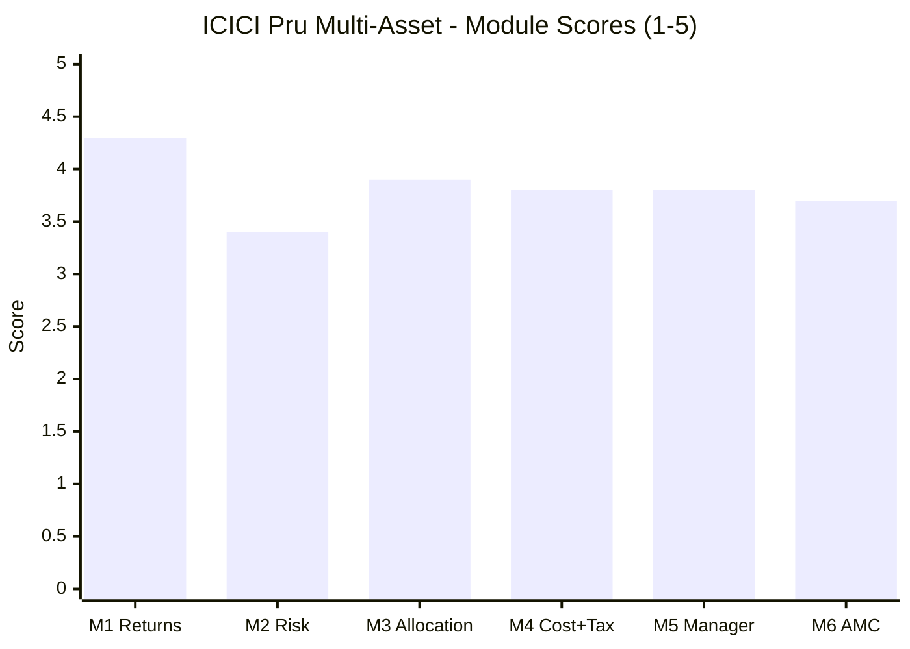

# ICICI Prudential Multi-Asset Fund — Fund Summary & Verdict

**Direct Plan – Growth · MFAPI 120334 · AUM ₹84,991 Cr · ER 0.54% · scheme allotted 31-Oct-2002 · recategorised to Multi Asset May-2018 · studied Aug 2026**

> **Final weighted score: ≈ 3.82 / 5 — first of the seven studied MultiAsset funds** (**ICICI ≈3.82**, Nippon ≈3.71, SBI ≈3.66, WOC ≈3.39, Quant ≈3.20, ABSL ≈3.18, UTI ≈3.03).
>
> **⚠ This fund was eliminated at screening, and that was a methodology error.** Stage 2 cut it for failing both the 3Y-CAGR median (15.7% vs 16.21%) and the Sharpe median (0.29 vs 0.86), and filed it as an instructive *"size ≠ quality"* case. **The 3-year window was adopted because most survivors lacked 5Y history — and was then applied to the one fund that had it.** The Sharpe input was **Tickertape's 0.29**, contradicted by the AMC's own factsheet (**1.10**), by MFAPI over 5 years (**1.32**) and by MFAPI over the 5.91 years containing 2022 (**1.51**). Over that longer window ICICI posts the **joint-best Sharpe and the best Calmar in the category.** It is now the highest-scoring fund in the study.
>
> **And the verdict is still not straightforward.** It wins Returns, Allocation Engine and Manager outright — and finishes **fourth of seven on Risk**, the module that carries 25% and the category's whole thesis, because it **fell −30.61% in COVID** and is, on the full-window evidence, **risk-adjusted indistinguishable from a pure equity fund.**
>
> **⚠ Scores are NOT comparable to the four equity categories** — measured on a multi-asset re-weight (Risk 25 / Returns 20 / Allocation 20 / Cost+Tax 20 / Manager 10 / AMC 5), against a blended benchmark and a DIY basket. **Not investment advice.**

---

## The Six-Module Scorecard

| Module | Topic | Weight | Score | Weighted | One-line |
|---|---|---|---|---|---|
| [M1](module1_returns.md) | Returns & Allocation Alpha | 20% | **4.3** | 0.860 | **Largest alpha (+4.01%/yr), best 2022, equity-taxed, biggest DIY win, 883 clean 10Y windows** |
| [M2](module2_risk.md) | **Risk Profile** | **25%** | **3.4** | **0.850** | **Won 2022 outright — but −30.61% COVID DD and a dead heat with pure equity** |
| [M3](module3_allocation.md) | Allocation Engine & DNA | 20% | **3.9** | 0.780 | **Only auditable engine in the study — and it returned −0.12%/yr** |
| [M4](module4_cost_tax.md) | Cost & Tax | 20% | **3.8** | 0.760 | Verified 0.54% ER, narrowest Direct–Regular gap — equity tax worth only ₹15,625 |
| [M5](module5_manager.md) | Manager / Team | 10% | **3.8** | 0.380 | **100% attribution, 36 years, 8 specialists — mixed calls, failing BAF sibling** |
| [M6](module6_amc.md) | AMC | 5% | **3.7** | 0.185 | Best debt + commodity desks here — 2018 group-IPO scar, 143 schemes |
| **TOTAL** | | **100%** | | **≈ 3.82** | |

> **The shape: first on three modules, fourth on the one that carries the most weight.** Its 4.3 on Returns and 3.9 on Allocation are the highest scores any fund achieved on those modules. Its 3.4 on Risk is the reason it does not run away with the study.

---

## What ICICI Pru Multi-Asset Actually Is

Three reframings, each from primary data:

1. **The record is real, long, and belongs to one person — but it was earned by a different fund.** Sankaran Naren has managed continuously since **February 2012**, so the 13.6-year record is 100% his: **883 rolling ten-year windows, not one negative, every single one above 12%**, across IL&FS, COVID and 2022. But the scheme was **ICICI Prudential Dynamic Plan — a dynamic *equity* fund — until 28 May 2018**, and M3's reconstruction shows effective equity has fallen **from ~75% (2019–20) to ~48% (2025–26)**. The −30.61% COVID drawdown and the 16.20% since-inception CAGR both belong to a materially more equity-heavy vehicle than the one an investor would buy today.

2. **⭐ It has the only genuinely active, auditable allocation engine in the study — and the engine has returned nothing.** Effective equity has traversed **39.4% to 93.7%**, seven times WOC's range; gold zero to 30%. Seven market turns can be graded: **four right** — including the decisive 2022 call that cut equity 69.2%→52.6% and rebuilt gold, producing **+17.61% while the Nifty 500 returned +3.79%** — **one clear failure** (80% equity and 1.8% gold going into COVID), two questionable. **Net allocation contribution: −0.12%/yr**, with a drawdown 7pp deeper than simply holding its own average weights. **All ₹4.01 of alpha per ₹100 came from selection (+4.13%).**

3. **It is the best *fund* in this study and among the worst *dampeners*.** M2's cousin test is unambiguous: over the 6.89-year window ICICI's Sharpe is **1.00 against Parag Parikh FlexiCap's 1.01**, its drawdown **−30.61% against PP's −31.20%.** Against the comparator that matters for an all-equity portfolio — very likely the core holding itself — **the multi-asset structure bought no risk advantage at all.** It beats Balanced Advantage and Aggressive Hybrid decisively. It does not beat pure equity on risk.

---

## The Genuine Strengths

- **⭐ Largest blended-benchmark alpha in the study — +4.01%/yr** vs its own five-leg SID benchmark, robust +3.64% to +4.86% across weights on an honest Nifty-500 leg, and corroborated by the AMC's own published +4.00pp (M1).
- **⭐ Won 2022 outright — the category's defining test.** +17.61% with a −8.65% drawdown while the Nifty 500 returned +3.79%. No fund in this study is close (M2).
- **⭐ The only complete multi-cycle record here** — traded 2020, 2022, Sep-2024 and Jan-2026 in full, under the same lead manager throughout.
- **⭐ 883 rolling 10-year windows: zero negative, 100% above 12%, minimum +14.29%** — measured across three genuine crises, not one bull regime (M1).
- **⭐ Equity-taxed** — 12.5% LTCG after **12 months** with the ₹1.25L exemption, versus a 24-month window for five of the seven funds.
- **⭐ Largest realised post-tax DIY win: +₹6.39 lakh on ₹10 lakh (+4.02pp/yr)** over 6.89 years, and **+₹7.12 lakh (2nd of 5)** over the window containing 2022 (M4).
- **⭐ The only auditable allocation record in the study** — seven gradeable turns, four called right (M3).
- **⭐ Best net-vs-gross transparency here — three layers published** (gross 68.32%, net 63.70%, beta 0.83), with the AMC stating the 65% target exists *"such that… the scheme will be treated as an equity fund"* (M3).
- **⭐ The only fund publishing its debt modified duration (2.02y)** — and it is *why* 2022 worked. 84.8% sovereign/AAA/TREPS (M3).
- **⭐ Genuinely decorrelated gold** — monthly correlation to gold **+0.02** against 0.90 to the Nifty 500, via an **in-house ETF**; captured the 2025 melt-up three peers missed (M2).
- **⭐ 100% record attribution, 36 years' experience, ED & CIO since 2011**, plus **eight managers with a named specialist for every sleeve** — including the commodity lead WhiteOak lacks entirely (M5).
- **⭐ Best AMC capability for this product** — ₹41,442 Cr of in-house gold and silver ETFs (a rival AMC buys ICICI's gold ETF), and a debt franchise that came through IL&FS and 2020 **without a wind-up, gating or side-pocket** (M6).
- **Verified 0.54% ER, narrowest Direct–Regular gap in the study (0.52pp)**, and **launch timing beyond reproach** — a 2002 scheme, 21 years before the tax wave (M4/M6).
- **Best disclosure of any fund here** — the factsheet publishes net-vs-gross equity, modified duration, YTM, rating profile, turnover, beta and the full benchmark change history.

## The Honest Weaknesses

- **⚠ −30.61% COVID drawdown** — past the framework's own *"alarming"* threshold of −28%, second-deepest of seven, and only **+8.5pp better than the Nifty 500** when SBI managed **+19.9pp** (M2).
- **⚠ The cousin test is a dead heat with a pure equity fund** — Sharpe **1.00 vs PP FlexiCap's 1.01**, drawdown **−30.61% vs −31.20%**. The multi-asset structure bought no dampening advantage (M2).
- **⚠ The allocation engine returned −0.12%/yr** across six and a half years of the most activity among investable peers — and was **risk-additive**, producing a drawdown 7pp deeper than its own average weights (M1/M3).
- **⚠ The 2020 positioning was the worst recorded in this study** — 80% effective equity and 1.8% gold going into COVID (M3).
- **⚠ Worst single day (−8.31%), highest kurtosis (14.60), most negative skew (−1.01) in the study** — by clear margins (M2).
- **⚠ The recent record is genuinely weak** — 1Y 9.01%, 2Y 8.62%, 3Y 15.53% (below the shortlist median). The screen was wrong about the fund; it was not wrong about the last three years.
- **⚠ Fifth of seven on the recent 3.19-year window** (Sharpe 1.39) and **4th of 7 on the recent DIY comparison**.
- **⚠ 11.7% of one-year windows are negative, worst −25.43%.** Not a low-volatility product.
- **⚠ The fund an investor buys today is not the fund that produced the record** — effective equity down ~27pp in six years (M3).
- **⚠ Equity taxation is worth only ₹15,625 flat** against the tier five peers occupy, and the **gross-equity buffer is 3.32pp** — now constraining how defensive the engine may become (M4).
- **⚠ 194% portfolio turnover** — highest disclosed here; priced at 0.35%/yr it flips the forward DIY verdict from +0.08 to −0.25pp/yr (M4).
- **⚠ Naren's most recent documented call is losing money** — the Oct-2025 public gold warning was acted on, and gold rose 51.85% before falling; it remains **+21.41% above the warning level** (M5).
- **⚠ His Balanced Advantage sibling underperforms a plain Nifty 500 by 2.53pp/yr** over 6.9 years — replicating WhiteOak's finding at a different AMC (M5).
- **⚠ The 2018 ICICI Securities episode** — ₹640 Cr of unitholder money across five schemes into a group-company IPO, settled with SEBI; and ICICI Bank has since raised its stake to ~53% (M6).
- **⚠ ~143 schemes, a competing Multi-Asset FoF launched Jun-2026, and no scale pass-through** — the category's largest fund by 4.4× charges more than a fifth-the-size competitor (M4/M6).
- **⚠ Key-person exposure is the largest in the study by seniority** — Naren is CIO of a ₹10-lakh-crore AMC *and* lead on four funds; five of eight managers were added in 2024, unexplained (M5).

---

## The Verdict That Matters: Fund vs DIY

| | ICICI Pru Multi-Asset | DIY (index fund + short-duration debt + gold ETF, rebalanced annually) |
|---|---|---|
| ₹10L lumpsum, 6.89y, **post-tax** | **₹29,95,713** | ₹23,56,245 (65/25/10) · ₹23,89,650 (its own 64/24/12 mix) |
| Absolute edge | **+₹6.06L to +₹6.39L (+4.02pp/yr)** | — |
| **vs peers, 5.91y window (incl. 2022)** | **+₹7.12L — 2nd of 5** (Quant +₹14.88L) | ⚠ **SBI −₹18,914 and UTI −₹1,061 both LOSE** |
| vs peers, 3.19y window | +₹1.09L — 4th of 7 | — |
| Risk-adjusted edge | +0.28 post-tax Sharpe *(WOC: +0.81)* | DIY: 11.32% vol, −24.40% DD |
| Source of the edge | ⭐ **Security selection (+4.13%/yr)** | — |
| **NOT** the source | **Allocation (−0.12%/yr)**, the tax shield (₹15,625) or the rebalancing shield (0.08pp/yr) | — |
| **10Y forward, equal gross returns** | ⚠ **+0.08pp/yr — and −0.25pp/yr once 194% turnover is priced** | — |

**ICICI beats do-it-yourself by the largest absolute margin in the study, and every rupee of it came from Naren's stock selection.** Strip the selection alpha out and the fund and a DIY basket are a dead heat that turnover tips the wrong way. **That is a perfectly good reason to buy it — it is simply a different reason than the category advertises.** The corollary matters: since the structural advantages are near zero, **this fund is worth paying for only while its manager keeps picking securities well.**

> **A separate decision:** a Regular-plan holder forfeits **₹94,940 over ten years** on a ₹15k SIP. Narrower than at any peer — but **always Direct.**

---

## Where ICICI Sits in the Shortlist

**Seventh fund studied; first of seven on the weighted score — and the fund the screen threw away.**

| Fund | Score | Net equity | Character |
|---|---|---|---|
| **ICICI Pru Multi-Asset** | **≈3.82** | **64%** | **Best alpha, best 2022, only auditable engine, equity-taxed — worst-but-two drawdown, no dampening vs pure equity** |
| Nippon Multi Asset | ≈3.71 | 56% | Cheapest verified ER, widest DIY win; bull-market artifact, architect departed |
| SBI Multi Asset | ≈3.66 | 47% | Elite cycle-proven dampener; static book, **loses to DIY over 5.91y** |
| WOC Multi Asset | ≈3.39 | 26% | Best-measured risk profile; frozen engine, arbitrage-driven, unprovable fee |
| Quant Multi Asset | ≈3.20 | 53% | Returns leader; equity-like risk, governance cloud |
| ABSL Multi Asset | ≈3.18 | 68% | Well-built and well-attributed, but last like-for-like and untested |
| UTI Multi Asset | ≈3.03 | 66% | Closet-equity, negative allocation alpha, **loses to DIY over 5.91y** |

**ICICI and WOC are the two poles of this category, and they are not competing for the same job.**

| | **ICICI Pru** | **WOC** |
|---|---|---|
| Max drawdown | −30.61% | **−6.08%** |
| Downside capture vs Nifty 500 | 43.8% | **−4.5%** |
| Beats a pure equity fund on risk? | ❌ **Dead heat** | ✅ **Decisively** |
| Blended alpha | **+4.01%/yr** | +1.92%/yr |
| 2022 evidence | ⭐ **+17.61%** | ❌ Didn't exist |
| Allocation engine | ⭐ **Active, auditable** | ❌ Frozen (7.4pp range) |
| Post-tax DIY edge | ⭐ **+₹6.39L** | +₹0.66L *(largest risk-adjusted)* |
| Record length | **13.6y, 100% attributed** | 3.2y |

**ICICI is the better fund. WOC is the better dampener.** If the multi-asset slot exists to reduce whole-portfolio volatility alongside four equity sleeves, ICICI's −30.61% and its dead heat with pure equity are disqualifying, and WOC's profile is what the job description asks for. **If the slot is a tax-efficient, cycle-tested growth engine to be held through crashes, ICICI is clearly the stronger fund.** The decision tree must choose which question is being asked.

---

## Monitoring / Review Triggers (if held)

1. **⭐ Sankaran Naren.** He is CIO of a ₹10-lakh-crore AMC *and* lead on four funds, with **no disclosed succession plan**. His departure would be a market event and would remove the +4.13%/yr selection alpha that is the entire investment case. **Watch also the unexplained 2024 expansion** — five of eight managers added in one year may be succession-building, or may be him stepping back.
2. **⭐ The 3.32pp gross-equity buffer.** Gross equity 68.32% against a 65% floor, while effective equity has fallen ~27pp in six years. **A breach costs equity taxation** (the 12-month window becomes 24). It also means the engine cannot keep de-risking without either a larger arbitrage overlay or losing the shelter.
3. **⭐ Whether the de-risking continues.** Effective equity: ~75% (2019–20) → ~48% (2025–26). If it keeps falling, the fund is drifting toward a different product than the one whose record is being bought — and toward the tax line.
4. **The next broad equity crash.** The −30.61% belongs to an ~80%-equity version of the fund; the current ~48% version has never met a real bear market. **This is the single most informative future event** — it will show whether the de-risking is real protection or just a lower starting point.
5. **194% turnover.** If it stays this high while selection alpha fades, the trading cost turns a marginal DIY win into a loss.
6. **The 2018 governance precedent and the parent's grip.** ICICI Bank raised its stake to ~53% in Dec-2025. Any repeat of scheme capital serving group interests should be treated as disqualifying.
7. **Fee.** A 56.6%-net-margin AMC running the category's largest fund by 4.4× charges 0.54% while a fifth-the-size competitor charges around a third less. Watch for a cut; its absence is informative.
8. **The Multi-Asset FoF launched Jun-2026.** If distribution effort shifts to the FoF, this fund becomes the older product in the range.
9. **Correlation creep.** At 0.79 to PP FlexiCap (0.70 recently), roughly two-thirds of the equity book duplicates a FlexiCap core. If equity weight rises, the diversification case erodes further.

---

## One-Line Verdict

**The fund this study's own screen eliminated on a three-year window and a wrong Sharpe input turns out to be its highest-scoring: the largest alpha (+4.01%/yr), the best 2022 in the category (+17.61% against the market's +3.79%), genuine equity taxation, the biggest post-tax DIY win, the only auditable allocation engine, 100% attribution to one manager across 13.6 years, and 883 rolling ten-year windows without a single negative — all of it produced by security selection (+4.13%/yr) rather than by an allocation engine that contributed minus twelve basis points, and shadowed by a −30.61% COVID drawdown that leaves it risk-adjusted indistinguishable from a pure equity fund: ≈3.82/5, the best fund here and among the worst dampeners.**

---

*Fund README complete. All six modules + README done (Aug 2026). Final weighted score ≈ 3.82/5 (M1 4.3 · M2 3.4 · M3 3.9 · M4 3.8 · M5 3.8 · M6 3.7 at 20/25/20/20/10/5). **Method:** MFAPI self-computation (scheme **120334**, 3,344 NAVs / 3,343 daily returns / 158 monthly obs, 02-Jan-2013 → 31-Jul-2026); blended benchmark taken **verbatim from the AMC factsheet** (Nifty 200 TRI 65% + Nifty Composite Debt 25% + gold 6% + silver 1% + iCOMDEX 3%) and built from Motilal Oswal Nifty 500 Index (147625), ICICI All Seasons Bond (120603) and SBI Gold (119788); asset path reconstructed by rolling 26-week constrained style analysis (331 windows) reconciling to factsheet weights within 0.5pp; post-tax models with full cost-basis tracking, ICICI taxed as equity-oriented; **like-for-like peer comparison over two windows** (Aug-2020 → Jul-2026, 5.91y; May-2023 → Jul-2026, 3.19y) for all six peers; **cross-fund manager record** computed across four ICICI funds Naren manages; the **Oct-2025 gold call tested three ways** (dated public statement, reconstructed portfolio weight, realised gold prices). Portfolio, duration, turnover, net-vs-gross equity, manager roles and benchmark lineage from the **ICICI Prudential Multi-Asset Fund monthly factsheet (30-Jun-2026)**, rendered not text-scraped. AMC assessment **carried forward from the MidCap study's ground-up ICICI Module 6 (Jul-2026, ~3.4)** and revised to 3.7 on category-critical deltas only.*

***⚠ SCREENING DOCUMENTS REQUIRE CORRECTION.*** *`screening/stage2_performance.md` and `screening/methodology.md` record this fund's elimination as merit-based — *"its prominence is AUM, not risk-adjusted quality."* **That is not supported.** The elimination rests on (a) a **3-year window** adopted *because most survivors lacked 5Y history*, applied to the one fund that had it; (b) **Tickertape's Sharpe of 0.29**, contradicted by the AMC factsheet (1.10) and MFAPI (1.32 over 5Y, 1.51 over 5.91Y); and (c) **no long-horizon override**. Both files need correcting, ICICI's status must change from "instructive case" to **studied fund**, and **Tata Multi Asset should be re-checked on identical grounds** (5.91y Sharpe 1.19, ahead of SBI and UTI).*

***⚠ FOUR STUDY-LEVEL FINDINGS this fund contributed, all flagged for the decision tree:***
*1. **No allocation alpha anywhere.** Seven of seven multi-asset funds show none — now with three distinct failure modes: **frozen dial** (WOC, −2.56%, risk-reducing), **swinging dial** (ICICI, −0.12%, risk-additive), **refuted model** (UTI). And it **replicates outside the category**: ICICI Balanced Advantage −2.53pp/yr and WhiteOak Balanced Advantage −0.91pp/yr vs a plain Nifty 500, plus HDFC BAF's Sharpe of 0.72 against pure equity's 1.01. **Three AMCs, three managers, three models, one result.***
*2. **Equity taxation is worth ₹15,625 flat** per ₹10L against the middle tier five peers occupy — the LTCG rate is 12.5% either way. Decisive only against *slab*, which nothing here faces. The study plan's "trump card" framing overstates it.*
*3. **The internal rebalancing shield is worth 0.08–0.17pp/yr**, not the decisive edge assumed. Together with (2): **the fund-vs-DIY question is decided by manager alpha, not by structure.***
*4. **The DIY counterfactual is harder over long windows.** WOC's M4 concluded all six funds beat DIY — a 3.19-year artifact. **Over 5.91 years including 2022, SBI and UTI both lose to it.** The decision tree should use the longer window.*

> ***⭐ PHASE 2 REVISED — seven funds now studied.*** *Ranking: **ICICI ≈3.82 · Nippon ≈3.71 · SBI ≈3.66 · WOC ≈3.39 · Quant ≈3.20 · ABSL ≈3.18 · UTI ≈3.03.** Next: **[decision_tree.md](../../decision_tree.md)** — the sleeve question, fund-vs-DIY, the conservative-vs-growth sub-type fork (ICICI and WOC are the two poles), sizing within the ₹65K cross-sleeve budget, and review triggers. **Settle first:** the **Nifty-500 equity-leg retrofit** across the four earlier funds' alpha figures, and **WOC's unresolved expense ratio**.*
