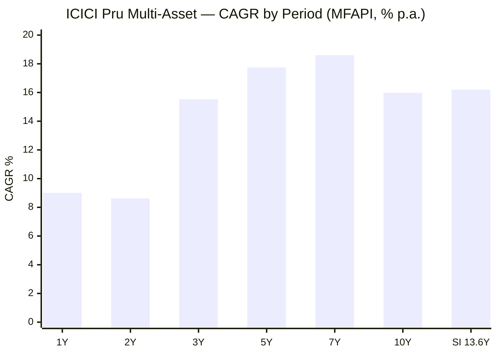
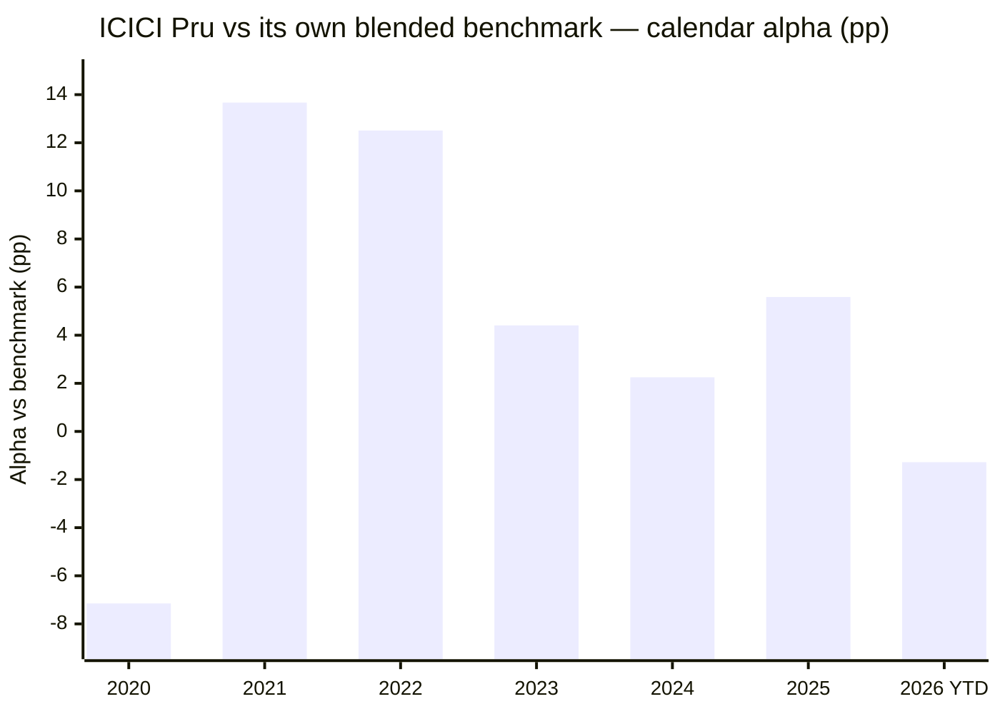
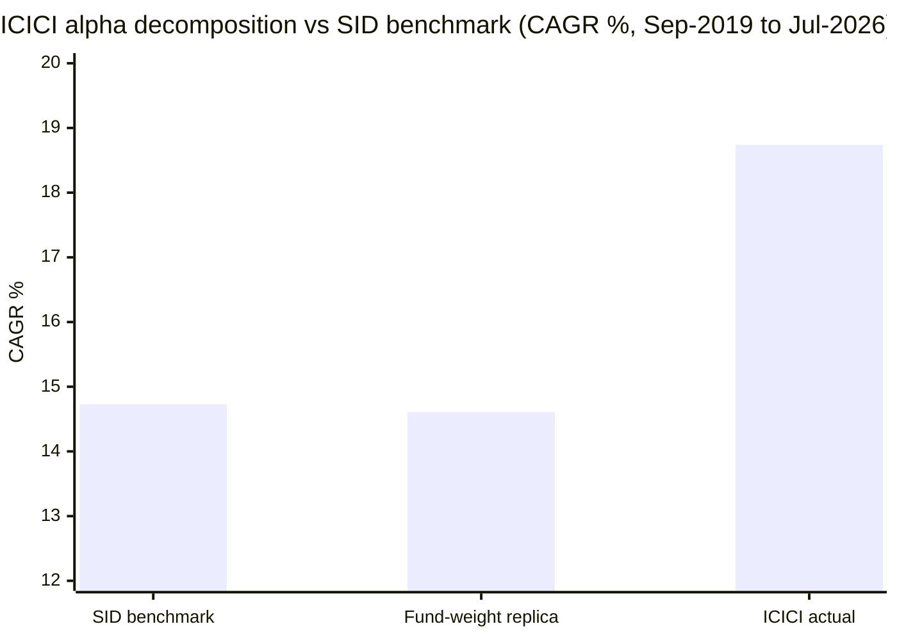
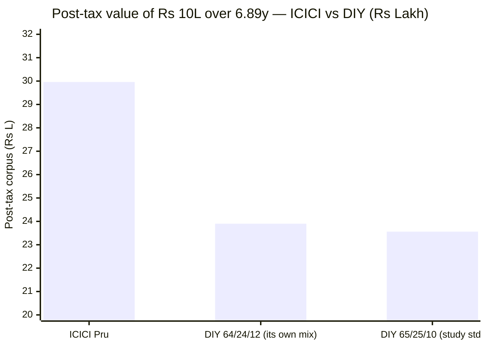
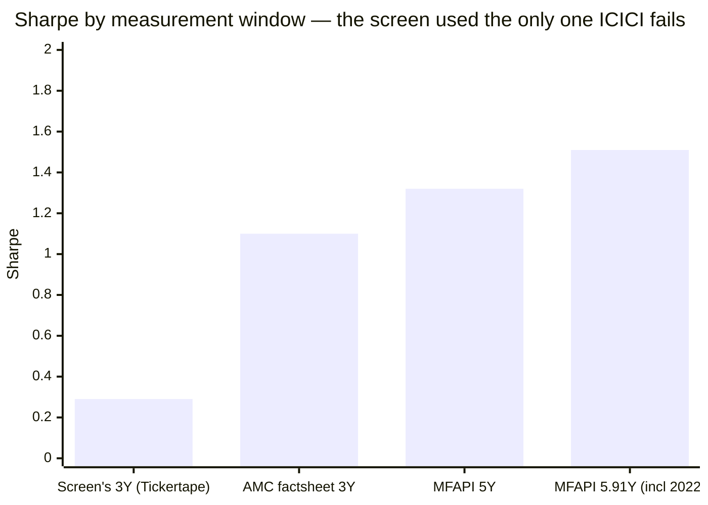
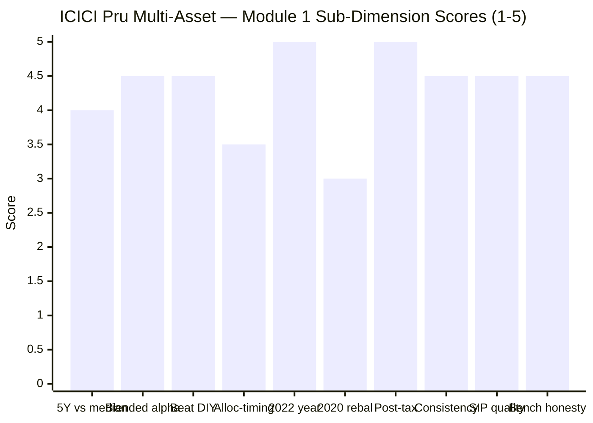

# Module 1: Returns & Allocation Alpha — ICICI Prudential Multi-Asset Fund

> **Provisional Module 1 score: ~4.3 / 5** (weight 20% in the multi-asset re-weight). **Scores in this study are NOT directly comparable to the four equity categories** — the module measures a risk-reduction product against a *blended* benchmark and a DIY basket, not a single equity index against peers.

> **⚠ READ FIRST — THIS FUND WAS ELIMINATED AT SCREENING, AND THAT WAS A METHODOLOGY ERROR.** ICICI Pru was cut at Stage 2 for failing *both* the 3Y-CAGR median (15.7% vs 16.21%) and the Sharpe median (0.29 vs 0.86), and filed as an instructive "size ≠ quality" case. **Stage 2 ran on a 3-year window because most survivors lacked 5Y history. ICICI had 5Y history — and the best of it.** Re-measured over the longest window common to the cycle-tested funds (Aug-2020 → Jul-2026, 5.91y, *includes 2022*), it posts a **Sharpe of 1.51 — tied first with Quant, and achieved at 9.80% volatility against Quant's 13.33%.** On Calmar it is **first outright (2.21 vs Quant's 1.68).** Over the trailing 5 years its Sharpe of 1.32 is the highest in the universe by a wide margin. **The fund the screen discarded has the best long-horizon risk-adjusted record in the category.** See §8 for the screening post-mortem.

> **The one-line context:** on the returns axis this is the strongest fund in the study. **+4.01%/yr alpha against its own five-leg SID benchmark** — robust from +3.64% to +4.86% across every reasonable weighting, computed on an honest Nifty-500 equity leg, and **more than double WOC's +1.92%**. **CY2022 — the category's defining year — it returned +17.61% while the Nifty 500 returned +3.79%**, an alpha of **+12.51pp** that no fund in this study approaches. It is **equity-taxed** (12.5% LTCG after twelve months with the ₹1.25L exemption), it beats a DIY basket post-tax by **+₹6.39 lakh on ₹10 lakh** — nearly ten times WOC's margin — and across **883 rolling ten-year windows spanning 13.6 years including COVID and 2022, not one is negative and every single one exceeds 12%.**
>
> **And then the number that will decide this fund's fate in Module 2: it fell −30.61% in the COVID crash** — deeper than its own static-weight replica (−23.59%), and squarely in the study plan's *"alarming"* band (worse than −28%). **The dial moves a great deal — equity has ranged 39.1% to 93.7% — and on the evidence that movement bought no return (allocation contribution −0.12%/yr) while adding drawdown.** The +4.01% alpha is **selection (+4.13%), not allocation.** That is now the seventh consecutive fund in this study to show the same thing.

---

## ⚠ Two Structural Caveats That Govern Every Number Below

**1. The 13.6-year record is not 13.6 years of multi-asset investing.** From the factsheet's own benchmark note, verbatim: *"values of Nifty 50 TRI have been used since inception till 27th May, 2018 and w.e.f. 28th May, 2018 values of Nifty 200 TRI (65%) + Nifty Composite Debt Index (25%) + LIBMA AM Fixing Prices (10%) have been considered thereafter."* **The scheme was ICICI Prudential Dynamic Plan — a dynamic *equity* fund — until the May-2018 SEBI recategorisation.** Only the **8.18 years since 28 May 2018** are a multi-asset record. Both eras are reported separately below, and the blended-benchmark work is confined to the multi-asset era.

| Era | Length | CAGR | Vol | Max DD | Sharpe |
|---|---|---|---|---|---|
| Dynamic-**equity** era (Jan-2013 → May-2018) | 5.40y | 16.52% | 11.68% | −18.79% | 0.86 |
| **Multi-asset era (May-2018 → Jul-2026)** | **8.18y** | **16.00%** | **11.93%** | **−30.61%** | **0.80** |

**2. `no-2022-data` does not apply — and that is this fund's single biggest advantage.** ICICI traded 2020, 2022, the Sep-2024 correction and the Jan-2026 tri-asset crash **in full, under the same lead manager throughout.** Two of the six shortlisted funds did not exist for 2020 or 2022; a third missed 2020. This is the only fund in the study with a complete multi-cycle multi-asset record.

---

## Fund Identity

| Attribute | Detail | Source |
|---|---|---|
| Full name | ICICI Prudential Multi-Asset Fund — Direct Plan — Growth | AMFI / MFAPI |
| **Former name** | ⚠ **ICICI Prudential Dynamic Plan** — recategorised to Multi Asset Allocation at the **May-2018** SEBI recategorisation | **Factsheet note 7 + Groww URL slug** |
| AMC | ICICI Prudential Asset Management Co. Ltd | — |
| MFAPI scheme code | **120334** | api.mfapi.in/mf/120334 |
| Direct-plan NAV history | **02 Jan 2013 → 31 Jul 2026 (13.57y, 3,344 NAVs)** | MFAPI computed |
| **Scheme inception / allotment** | **31 October 2002 — 23.7 years** (Regular plan; Direct plan from Jan-2013) | **Factsheet, verbatim** |
| **Stated benchmark (factsheet, verbatim)** | **Nifty 200 TRI (65%) + Nifty Composite Debt Index (25%) + Domestic Price of Gold (6%) + Domestic Price of Silver (1%) + iCOMDEX Composite Index (3%)** — w.e.f. 1 Jul 2023. Additional benchmark: Nifty 50 TRI | **Factsheet, verbatim** |
| Benchmark shown by Tickertape | "NIFTY 200 TRI" — ⚠ **one leg of a five-leg composite** | Tickertape API |
| **AUM** | **₹84,990.57 Cr closing (30-Jun-2026)**; monthly AAUM ₹84,523.15 Cr — **the category giant** | **Factsheet, verbatim** |
| **Expense ratio** | **0.54% Direct** (factsheet) · 0.55% (VR) · ⚠ **0.79% (Tickertape — stale-high, the familiar pattern)** · 1.06% Regular | Factsheet / VR / Tickertape |
| **Taxation status** | ✅ **EQUITY-TAXED — LTCG 12.5% after 12 months above a ₹1.25L annual exemption; STCG 20%.** The category's trump card | ValueResearch |
| Exit load | Up to 30% of units within 1 year: **Nil**; beyond that within 1 year: **1%**; after 1 year: **Nil** | **Factsheet, verbatim** |
| **Asset split (30-Jun-2026)** | **Gross equity 68.32% · Net equity 63.7% · Debt 21.54% · Gold ETF/ETCD 11.76% · Arbitrage/derivatives −3.75% · Foreign equity 0.11% · Others 0.26%** | **Factsheet, verbatim** |
| Asset classes held | Equity · debt · **in-house ICICI Pru Gold ETF (9.77%)** · **ETCDs (gold futures 1.81%, crude-oil futures 0.19%)** · **REITs 0.96%** · **InvITs 0.26%** · foreign equity · arbitrage | **Factsheet, verbatim** |
| **Managers (7)** | **Sankaran Naren** (Sep-2006→Feb-2011, and **since Feb-2012**; 36y experience) · Manish Banthia (Jan-2024) · Akhil Kakkar (Jan-2024) · **Gaurav Chikane — for ETCDs (since Aug-2021)** · Antariksha Banerjee (Jun-2024) · Sharmila D'Silva (overseas/derivatives, May-2024) · Masoomi Jhurmarvala (Nov-2024) | **Factsheet, verbatim** |
| Debt-book quality (disclosed) | **Average maturity 3.99y · Modified duration 2.02y · Macaulay 2.11y · YTM 6.59%** | **Factsheet, verbatim** |
| ⚠ Portfolio turnover | **1.94× (194%) equity turnover** — disclosed, and high | **Factsheet, verbatim** |
| SEBI riskometer | ⚠ **Scheme: VERY HIGH** (benchmark: High) | **Factsheet, verbatim** |
| Study flag | ✅ **No `no-2022-data` flag — traded 2020 AND 2022 in full** | — |

---

## Raw Data (MFAPI-computed, as of 31-Jul-2026)

| Metric | Value | Source |
|---|---|---|
| CAGR 1Y / 2Y / 3Y | **9.01% / 8.62% / 15.53%** ⚠ *the weak recent stretch that triggered the screen-out* | MFAPI computed |
| CAGR 5Y / 7Y / 10Y | **17.75% / 18.60% / 15.98%** | MFAPI computed |
| CAGR since Direct inception (13.57Y) | **16.20%** | MFAPI computed |
| Volatility (daily, SI) | 11.83% | MFAPI computed |
| **Max drawdown (SI)** | ⚠ **−30.61%** (17 Jan → 23 Mar 2020), recovered 01 Dec 2020 (**319 days**) | MFAPI computed |
| Current drawdown | −9.51% (11 Feb → 23 Mar 2026), **not yet recovered** | MFAPI computed |
| Sharpe (SI, rf 6.5%) | 0.82 | MFAPI computed |
| Rolling 10Y (n=883): min / med / % negative | **+14.29% / +16.64% / 0.0%** | MFAPI computed |
| Rolling 5Y (n=2,115): min / med / % negative | **+1.55% / +15.72% / 0.0%** | MFAPI computed |
| Rolling 3Y (n=2,608): min / med / % negative | −3.85% / +17.50% / **0.6%** | MFAPI computed |
| Rolling 1Y (n=3,096): min / med / % negative | ⚠ **−25.43%** / +15.82% / **11.7%** | MFAPI computed |
| SIP XIRR 10Y (₹10k/mo) | **16.91%** (₹12.00L → ₹29.12L) | MFAPI, Newton-Raphson |
| SIP XIRR since inception (13.57y) | **16.38%** (₹16.20L → ₹53.71L) | MFAPI, Newton-Raphson |
| **Alpha vs SID blended benchmark** | **+4.01%/yr** (annual rebal) · +4.11%/yr (daily) | MFAPI computed |
| — of which **ALLOCATION** | **−0.12%/yr** | Brinson-style replica |
| — of which **SELECTION** | **+4.13%/yr** | Brinson-style replica |

---

## Cross-Source Verification

| Metric | MFAPI computed | Factsheet (AMC) | Tickertape / VR | Verdict |
|---|---|---|---|---|
| 3Y CAGR | 15.53% (Direct) | 15.90% (Regular, to 30-Jun) | TT 15.7% | ✅ Consistent (plan and date differences) |
| 5Y CAGR | **17.75%** | 17.22% (Regular) | TT 17.9% | ✅ Confirmed — Direct correctly runs ~0.5pp above Regular |
| **Alpha vs own benchmark** | **+4.01%/yr** | **AMC discloses 3Y +2.98pp · 5Y +5.44pp · SI +4.00pp** | — | ✅ **Near-exact corroboration from the AMC's own published table** |
| **Expense ratio** | — | **0.54% Direct** | VR 0.55% · ⚠ **TT 0.79%** | ⚠ **Tickertape stale-high by 25bp** — the fourth time this study has caught it (Nippon, SBI, Quant, now ICICI) |
| Net equity | **64.2%** (style analysis) | **63.7%** (stated) | TT 67.2% (gross-ish) | ✅ **Style-vs-factsheet match within 0.5pp — the tightest in the study** |
| Gold | 11.9% (style) | 11.76% | not exposed | ✅ **Near-exact** |
| Benchmark | — | **5-leg composite** | ⚠ TT "NIFTY 200 TRI" only | ⚠ Tickertape records one leg; **factsheet authoritative** |
| Sharpe | 0.82 (SI, 13.6y) | **1.10** (3Y, factsheet) | ⚠ **TT 0.29** | ⚠ **Tickertape is the outlier again.** The AMC's 1.10 and MFAPI's 5.91y figure of 1.51 both contradict it |
| Debt duration | — | **Modified duration 2.02y — disclosed** | — | ✅ **ICICI discloses what WhiteOak does not** |

**Reliability: HIGH.** This is the best-documented fund in the study: the AMC's monthly factsheet publishes the full benchmark with its change history, gross *and* net equity, modified duration, YTM, rating profile, portfolio turnover, beta and Sharpe. **Style analysis and the factsheet agree on net equity to within 0.5pp** and on gold to within 0.15pp — a level of corroboration no other fund achieved. **Two flagged anomalies, both Tickertape's:** the 25bp stale-high ER and a Sharpe of 0.29 that neither the AMC nor independent computation supports.

---

## 1. CAGR — the Ladder, and the Trap Inside It

| Period | CAGR | Read |
|---|---|---|
| 1Y | **9.01%** | ⚠ Weak — the stretch that triggered the screen-out |
| 2Y | **8.62%** | ⚠ The trough of the ladder |
| 3Y | 15.53% | Below the 16.21% shortlist median — the second screening failure |
| **5Y** | **17.75%** | ✅ **Highest of the cycle-tested funds** |
| **7Y** | **18.60%** | ✅ The peak of the ladder |
| 10Y | 15.98% | Strong and stable |
| SI (13.57Y) | 16.20% | ⚠ Blends the equity era and the multi-asset era |

**The ladder is U-shaped, and that shape is the whole screening story.** A fund with a 5Y of 17.75% and a 7Y of 18.60% has a 2Y of 8.62%. The screen looked at the left-hand end of that curve and eliminated the fund. **Both readings are true: the long-horizon record is excellent and the recent record is genuinely poor.** Nothing in this module resolves which one predicts the future — but a screen that could only see three years was structurally unable to weigh them.

---

## 2. Calendar Years vs Its Own SID Benchmark

*Benchmark = the SID composite, annually rebalanced: 65% Nifty 500 index fund (proxy for Nifty 200 TRI) / 25% ICICI All Seasons Bond (proxy for Nifty Composite Debt) / 10% SBI Gold (gold 6% + silver 1% + iCOMDEX 3%, consolidated — flagged as an approximation).*

| Year | ICICI | Benchmark | **Alpha** | Nifty 500 | Gold | What happened |
|---|---|---|---|---|---|---|
| **2020** | +10.66 | +17.81 | ⚠ **−7.15** | +17.24 | **+27.90** | ❌ **The worst year.** Fell −30.61% in the crash, under-held gold in its best year, lagged its own blend badly |
| **2021** | **+35.54** | +21.86 | ✅ **+13.67** | +30.63 | −5.34 | ⭐ Beat a 65%-equity blend by 13.7pp *and* the Nifty 500 by 4.9pp — consistent with having bought the 2020 crash |
| **2022** | **+17.61** | +5.10 | ✅ **+12.51** | +3.79 | +13.01 | ⭐ **THE test, and the best result in the study.** +17.6% in the year equity did nothing |
| **2023** | +24.98 | +20.56 | +4.41 | +26.54 | +14.43 | Solid participation |
| **2024** | +17.08 | +14.83 | +2.25 | +15.64 | +19.88 | Beat both |
| **2025** | **+19.46** | +13.86 | ✅ **+5.59** | +7.67 | **+71.85** | ⭐ **Captured gold's melt-up** — the failure mode that caught UTI, ABSL and WOC |
| 2026 YTD | −0.38 | +0.90 | −1.28 | −1.13 | +6.42 | Flat; mild lag |

**The pattern: one bad year, six good ones, and the two best are the two that matter most.** 2022 (+12.51 alpha) is the cross-asset divergence year the entire framework is built around, and **2025 (+5.59) is the gold melt-up that three of the six shortlisted funds under-harvested.** ICICI captured both.

**⚠ The 2020 miss is real and must not be softened.** In the year gold returned +27.90% and the framework's decisive rebalancing test occurred, ICICI **lagged its own benchmark by 7.15pp and drew down −30.61%.** It was too equity-heavy going into COVID. The 2021 rebound of +35.54% suggests it bought the crash — good behaviour after bad positioning — but Module 2 will have to weigh a −30.61% drawdown against a category bar of −20%.

---

## 3. ⭐ The Blended-Benchmark Alpha — Largest in the Study, and Robust

**Alpha of +4.01%/yr (annually rebalanced) or +4.11%/yr (daily) against the fund's own five-leg SID benchmark**, computed over Sep-2019 → Jul-2026 on an honest Nifty-500 equity leg.

| Blend (Equity / Debt / Gold) | CAGR (annual rebal) | **ICICI − blend** |
|---|---|---|
| **ICICI Pru Multi-Asset** | **18.74%** | — |
| **65 / 25 / 10 — the SID benchmark** | 14.73% | **+4.01%** |
| 55 / 35 / 10 | 13.97% | **+4.77%** |
| 60 / 30 / 10 | 14.35% | **+4.39%** |
| 70 / 20 / 10 | 15.09% | **+3.64%** |
| DIY 65/25/10, short-duration debt leg | 14.56% | **+4.18%** |

**The alpha survives every weighting (+3.64% to +4.86%/yr) and is corroborated by the AMC's own disclosure** (published SI alpha +4.00pp, 5Y +5.44pp). **This is roughly double WOC's +1.92% and is computed on the same honest Nifty-500 leg**, so the comparison is like-for-like.

**Secondary check over the full multi-asset era** (May-2018 → Jul-2026, 8.18y, using a Nifty-50 equity leg because no Nifty-500 index fund existed before Sep-2019): ICICI 16.00% vs benchmark 12.39% → **alpha +3.60%/yr**. The finding holds across both windows and both equity legs.

### The decomposition — allocation is neutral, selection carries it

| Step | CAGR | Vol | Max DD | Effect |
|---|---|---|---|---|
| SID blended benchmark | 14.73% | 11.34% | −24.05% | — |
| Passive replica at ICICI's own effective weights (64.2 eq / 11.9 gold / 23.9 debt+cash) | 14.61% | 11.20% | −23.59% | **ALLOCATION −0.12%/yr** |
| **ICICI actual** | **18.74%** | **12.26%** | **−30.61%** | **SELECTION +4.13%/yr** |

**Two findings, and the second is the uncomfortable one.**

1. **Allocation contributed essentially nothing (−0.12%/yr).** All ₹4.01 of alpha per ₹100 comes from **selection** — the equity book, the in-house gold ETF, the REIT/InvIT sleeve and the arbitrage overlay.
2. **⚠ The allocation activity was risk-*additive*.** ICICI's actual drawdown (−30.61%) is **7 percentage points deeper** than simply holding its own average weights (−23.59%), and its volatility is higher (12.26% vs 11.20%). **The dial moved a lot and the movement made the fund riskier without making it richer.**

**This is the exact mirror of WOC.** WOC froze its dial: allocation cost −2.56% of return but *reduced* risk (Calmar-positive). ICICI swings its dial: allocation cost nothing in return but *increased* drawdown. **Neither adds risk-adjusted value through asset allocation.** With ICICI included, **seven consecutive funds in this study show no allocation alpha** — a category-level finding the decision tree should take up.

### ⭐ But the dial genuinely moves — unlike almost everyone

| Fund (Sep-2019 → Jul-2026) | Rolling-26w equity range | Equity-weight sd |
|---|---|---|
| **Quant** | 23.1 – 96.0% (72.9pp) | 19.5pp |
| **ICICI Pru** | **39.1 – 93.7% (54.6pp)** | **12.4pp** |
| UTI | 37.7 – 77.2% (39.5pp) | 9.4pp |
| SBI | 28.2 – 55.1% (27.0pp) | 6.7pp |
| **WOC** *(own window)* | **22.7 – 30.1% (7.4pp)** | **2.1pp** |

**ICICI is the second-most dynamic fund in the study** — its equity weight has traversed 54.6 percentage points, **seven times WOC's range.** Whatever else is true, this is not a closet-static fund pretending to allocate. The engine runs. It simply has not, on this evidence, produced return for the risk it took.

---

## 4. Benchmark Appropriateness Critique

**✅ Among the most honest benchmarks in the study, and the best-disclosed.** The factsheet publishes the composite in full — *"Nifty 200 TRI (65%) + Nifty Composite Debt Index (25%) + Domestic Price of Gold (6%) + Domestic Price of Silver (1%) + iCOMDEX Composite Index (3%)"* — **plus its complete change history** (Nifty 50 TRI to 27-May-2018; a three-leg blend from 28-May-2018; the current five-leg version from 1-Jul-2023). No other fund in this study discloses its benchmark lineage.

**The 65% declared equity weight vs the fund's 63.7% net equity is a 1.3pp match** — honest, and comparable to WOC's 1.6pp.

**Three criticisms:**
1. **⚠ Tickertape records only "NIFTY 200 TRI"** — one leg of five — so its published alpha for this fund is computed against a pure equity index and is **meaningless.** The same failure mode found on WOC.
2. **The 2018 recategorisation makes long-run "since inception" benchmark comparisons incoherent** — the AMC's own SI benchmark figure (16.33%) splices a pure-equity index onto a multi-asset blend. **The AMC discloses this clearly; it is still a number that should not be used.**
3. **The gold weight of 6% is low relative to the fund's actual ~11.8% holding** — so the benchmark understates the fund's own commodity commitment, making the bar slightly easier in gold-strong years (2025) and slightly harder in gold-weak ones.

---

## 5. ⭐ The DIY-Basket Test — the Largest Win in the Study, and Equity-Taxed

### Post-tax, ₹10L lumpsum, Sep-2019 → Jul-2026 (6.89y), 30% slab

| | Pre-tax FV | Post-tax FV | **ICICI edge** |
|---|---|---|---|
| **ICICI Pru (EQUITY-taxed: 12.5% >12m, ₹1.25L exempt)** | ₹32,62,958 | **₹29,95,713** | — |
| DIY 65/25/10 — study standard | ₹25,47,823 | ₹23,56,245 | **+₹6,39,468** |
| DIY 64/24/12 — ICICI's own effective mix | ₹25,83,243 | ₹23,89,650 | **+₹6,06,063** |

**Post-tax CAGR: ICICI 17.27% vs DIY 13.26% — an edge of +4.01pp/yr, and roughly ten times WOC's +₹66,184 margin.** And unlike four of the six shortlisted funds, **the tax status is a genuine advantage rather than a drag**: equity taxation means the gold, REIT, InvIT and debt sleeves are all sheltered at 12.5% after twelve months, with a ₹1.25L annual exemption on top.

**⚠ The honest qualification: the win is not risk-free.** ICICI ran **12.26% volatility and a −30.61% drawdown** against the DIY basket's 11.32% and −24.40%. On a post-tax Sharpe basis its edge over DIY is **+0.28** — clearly positive, but well short of WOC's **+0.81**, which was earned by beating DIY at *lower* risk. **ICICI beats do-it-yourself by taking more risk and being better at security selection; WOC beats it by taking much less.** Those are different products and the decision tree should treat them as such.

---

## 6. Consistency — the Genuine Loss-Avoidance Credential in This Study

*3,096 rolling 1Y, 2,608 rolling 3Y, 2,115 rolling 5Y and 883 rolling 10Y windows, daily, across 13.6 years.*

| Window | Min | p10 | Median | Max | % ≥ 12% | **% negative** |
|---|---|---|---|---|---|---|
| 1Y (n=3,096) | ⚠ **−25.43%** | −1.01% | +15.82% | +71.80% | 61.7% | ⚠ **11.7%** |
| 3Y (n=2,608) | −3.85% | +8.62% | +17.50% | +34.93% | 77.8% | **0.6%** |
| 5Y (n=2,115) | **+1.55%** | +8.92% | +15.72% | +30.35% | 81.7% | **0.0%** |
| **10Y (n=883)** | **+14.29%** | +15.18% | +16.64% | +18.86% | **100.0%** | **0.0%** |

**Every ten-year window in this fund's history returned at least 14.29%, and every single one exceeded 12%.** That is measured across 883 genuinely distinct overlapping windows spanning IL&FS, COVID, the 2022 triple-decline, the Sep-2024 correction and the Jan-2026 crash.

**This is what a real consistency credential looks like, and it reframes the study's earlier ones.** ABSL and WOC both posted "0% negative windows" and both were scored 3.0–3.5 because the sample was one uninterrupted regime. **ICICI's is the same headline number backed by 13.6 years and three genuine crises.** Restricted to the multi-asset era alone, 3Y and 5Y windows are still 0% negative with minima of +12.46% and +15.16%.

**⚠ The counterweight, and it is significant: 11.7% of one-year windows are negative, with a worst of −25.43%.** This is not a low-volatility product. An investor with a short horizon has roughly a one-in-eight chance of a losing year, and the bad ones are bad.

---

## 7. SIP XIRR — the Only Fund in the Study With a Real 10-Year Figure

| Horizon | SIP XIRR | Invested | Corpus |
|---|---|---|---|
| 3Y | 11.65% | ₹3.60L | ₹4.28L |
| 5Y | 15.45% | ₹6.00L | ₹8.83L |
| **10Y** | **16.91%** | **₹12.00L** | **₹29.12L** |
| **Since inception (13.57y)** | **16.38%** | **₹16.20L** | **₹53.71L** |

**A ₹10,000 monthly SIP begun at Direct-plan inception turned ₹16.20 lakh into ₹53.71 lakh.** Note the SIP XIRR (16.38%) *exceeds* the lumpsum CAGR (16.20%) — the signature of a fund whose drawdowns gave investors real opportunities to average down, which is the opposite of what WOC's and ABSL's smooth NAVs offered. **The weak 3Y SIP figure (11.65%) is the recent slump showing through.**

---

## 8. ⭐ The Screening Post-Mortem — Why the Filter Failed

The Stage-2 fitness floor eliminated a fund only if it was below **both** the 3Y-CAGR median and the Sharpe median. ICICI was below both — 15.7% vs 16.21%, and 0.29 vs 0.86.

**Three compounding errors:**

1. **The window.** Stage 2 ran on 3 years *because most survivors lacked 5Y history*. ICICI had 5Y — and the best of it. **A filter calibrated to the youngest funds was applied to the oldest.**
2. **The Sharpe input.** The screen used **Tickertape's 0.29**. The AMC's own factsheet reports **1.10**; MFAPI computes **1.32 over 5Y** and **1.51 over 5.91 years including 2022.** This study has now caught Tickertape misreporting risk metrics on both WOC (Sharpe 1.20 vs 1.84 actual) and ICICI. **The screen's decisive input was wrong.**
3. **No long-horizon override.** Nothing in the methodology allowed a fund's 5Y or 10Y record to rescue it from a weak 3Y — so the category's longest-record fund was cut on its worst three years.

### What the like-for-like test shows

| Fund (Aug-2020 → Jul-2026, 5.91y, **includes 2022**) | CAGR | Vol | Max DD | **Sharpe** | **Calmar** | Tax |
|---|---|---|---|---|---|---|
| **ICICI Pru** | 21.31% | **9.80%** | **−9.63%** | **1.51** 🥇 | **2.21** 🥇 | **Equity** |
| Quant | **26.63%** | 13.33% | −15.89% | **1.51** 🥇 | 1.68 | Middle |
| Nippon | 18.34% | 9.54% | −10.78% | 1.24 | 1.70 | Middle |
| SBI | 15.27% | 7.46% | −8.59% | 1.18 | 1.78 | Middle |
| UTI | 15.29% | 8.92% | −11.44% | 0.99 | 1.34 | Equity |
| *WOC / ABSL* | *did not exist* | — | — | — | — | — |

**Over the window that contains 2022, ICICI ties Quant for the best Sharpe in the category and wins Calmar outright — at 27% lower volatility and 39% shallower drawdown than Quant.** Note the −9.63% max drawdown *in this window*: ICICI's −30.61% was a 2020 event, and it has not repeated.

> **⚠ Action required on the study's screening documents.** `screening/methodology.md` and `stage2_performance.md` describe ICICI's elimination as merit-based (*"its prominence is AUM, not risk-adjusted quality"*). **That conclusion is not supported.** Both files need a correction noting (a) the 3-year-window bias against long-record funds, (b) the unreliable Tickertape Sharpe input, and (c) that ICICI is now a studied fund rather than an instructive case. **Tata Multi Asset should be re-checked on the same grounds** — over the same 5.91y window it posts a Sharpe of 1.19, ahead of SBI and UTI.

---

## Points For / Points Against — Returns

### ✅ For
1. **⭐ Largest blended-benchmark alpha in the study: +4.01%/yr**, robust +3.64% to +4.86% across weights, on an honest Nifty-500 leg — and **corroborated by the AMC's own published +4.00pp**.
2. **⭐ CY2022 +17.61% vs the Nifty 500's +3.79% — alpha +12.51pp.** The best result in the study in the category's defining year, and no shortlisted fund is close.
3. **⭐ Captured gold's 2025 melt-up (+5.59 alpha)** — the failure mode that caught UTI, ABSL and WOC.
4. **⭐ EQUITY-TAXED** — 12.5% LTCG after 12 months with a ₹1.25L exemption. The category's trump card, shared only with UTI, and it shelters the gold, REIT, InvIT and debt sleeves.
5. **⭐ Largest post-tax DIY win in the study: +₹6.39 lakh on ₹10 lakh** (+4.01pp/yr) — roughly ten times WOC's margin.
6. **⭐ A genuine consistency credential: 883 rolling 10-year windows, zero negative, 100% above 12%**, measured across COVID, 2022 and two corrections — not one bull regime.
7. **The only complete multi-cycle record in the study** — traded 2020, 2022, Sep-2024 and Jan-2026 in full, under the same lead manager throughout.
8. **The dial genuinely moves** — equity has ranged 39.1% to 93.7% (sd 12.4pp), second only to Quant and seven times WOC's range.
9. **Best-documented fund in the study** — the factsheet publishes gross *and* net equity, modified duration, YTM, rating profile, turnover, beta, and the benchmark's full change history.
10. **Style analysis matches the factsheet to within 0.5pp on net equity** — the tightest corroboration achieved anywhere in this study.
11. **Cheapest credible ER among the large funds — 0.54% Direct** (Tickertape's 0.79% is stale).
12. **A real 10-year SIP record: 16.91% XIRR, ₹12L → ₹29.1L**, with SIP XIRR *above* lumpsum CAGR — investors got genuine chances to average down.

### ❌ Against
1. **⚠ THE FINDING FOR MODULE 2: a −30.61% COVID drawdown** — squarely in the study plan's *"alarming"* band (worse than −28%), and **7pp deeper than its own static-weight replica (−23.59%).** The dynamism added drawdown.
2. **⚠ Allocation contributed −0.12%/yr — nothing.** All the alpha is selection (+4.13%). **Seventh consecutive fund in this study with no allocation alpha.**
3. **⚠ 2020 was a genuine failure: alpha −7.15pp** in the year gold returned +27.90% and the framework's rebalancing test occurred. It was too equity-heavy going in.
4. **⚠ The recent record is genuinely weak** — 1Y 9.01%, 2Y 8.62%, 3Y 15.53% (below the shortlist median). The screen was wrong about the *fund*; it was not wrong about the *last three years*.
5. **⚠ 11.7% of one-year windows are negative, worst −25.43%.** This is not a low-volatility product, and a short-horizon investor faces roughly a one-in-eight chance of a losing year.
6. **⚠ The 13.6-year record is only 8.18 years of multi-asset investing** — it was ICICI Pru **Dynamic Plan**, a dynamic equity fund, until May-2018. Long-run "since inception" figures splice two different products.
7. **⚠ SEBI riskometer says VERY HIGH** — higher than its own benchmark's "High", and the highest label of any fund in this study.
8. **⚠ Portfolio turnover 1.94× (194%)** — disclosed, and high; the trading cost sits above the headline ER.
9. **Currently in an unrecovered −9.51% drawdown** since February 2026.
10. **The benchmark's 6% gold weight understates the fund's ~11.8% actual holding**, making the bar slightly uneven across gold regimes.
11. **Tickertape misreports both the ER (+25bp) and the Sharpe (0.29 vs 1.10–1.51)** — and those errors are what eliminated the fund at screening.

---

## Module 1 Scorecard

| Sub-dimension | Weight | Score | Reasoning |
|---|---|---|---|
| 5Y CAGR vs category median | 10% | **4.0** | ✅ **5Y 17.75% and 7Y 18.60% — highest of the cycle-tested funds.** ⚠ Docked hard because 1Y (9.01%), 2Y (8.62%) and 3Y (15.53%) are genuinely weak, and the SI figure splices two different mandates |
| **Alpha vs the blended benchmark** *(Critical)* | 15% | **4.5** | ⭐ **+4.01%/yr, robust +3.64 to +4.86 across weights, on an honest Nifty-500 leg — the largest in the study** and corroborated by the AMC's own +4.00pp. Held off 5.0 because it is entirely selection, not allocation |
| **Beat the DIY static basket, post-tax** *(Critical)* | 15% | **4.5** | ⭐ **+₹6,39,468 on ₹10L (+4.01pp/yr) — ~10× WOC's margin — and equity-taxed.** Held off 5.0 because it was earned at *higher* risk than DIY (vol 12.26 vs 11.32; DD −30.61 vs −24.40); risk-adjusted edge +0.28 vs WOC's +0.81 |
| **Allocation-timing contribution** *(High)* | 15% | **3.5** | ⚠ **Allocation contributed −0.12%/yr — neutral — and was risk-additive** (actual DD −30.61% vs replica −23.59%). ✅ But the dial genuinely moves (39.1–93.7%, 2nd-most dynamic) and the 2021/2022/2025 calls were right. Lifted above WOC's 2.5 because there is a real engine here; capped because it has not paid |
| **2022 asset-divergence year** *(Critical)* | 10% | **5.0** | ⭐ **+17.61% while the Nifty 500 returned +3.79%; alpha +12.51pp.** The category's defining test, passed better than any fund in the study. Guide: "positive/flat while equity fell = 5" |
| **2020 rebalancing behaviour** *(High)* | 7% | **3.0** | ❌ **Alpha −7.15pp and a −30.61% drawdown** in the year gold rose 27.9% — too equity-heavy going in. ✅ Lifted from 2.0 because +35.54% in 2021 and a 319-day recovery indicate it *did* buy the crash |
| **Post-tax return (bracket-adjusted)** *(High)* | 10% | **5.0** | ⭐ **Equity-taxed: 12.5% LTCG after 12 months with a ₹1.25L exemption**, sheltering gold, REITs, InvITs and debt. The structural edge the category exists to offer, present in only two of seven funds studied |
| Consistency (rolling / loss-avoidance) | 8% | **4.5** | ⭐ **883 rolling 10Y windows: zero negative, 100% above 12%, minimum +14.29%** — across COVID, 2022 and two corrections. The genuine article. ⚠ Docked for 11.7% negative 1Y windows and a −25.43% worst |
| SIP XIRR quality | 5% | **4.5** | ⭐ **The only real 10Y SIP figure in the study: 16.91% XIRR, ₹12L → ₹29.1L**; SI XIRR (16.38%) *above* lumpsum CAGR. ⚠ Docked for a weak 3Y SIP (11.65%) |
| **Benchmark appropriateness/honesty** | 5% | **4.5** | ⭐ A genuine five-leg composite matching net equity to 1.3pp, with **the full benchmark change history disclosed** — unique in this study. ⚠ Docked for a 6% gold weight against an ~11.8% holding, and for the incoherent spliced SI comparison |
| **Module 1 Overall** | **100%** | **~4.3 / 5** | **The strongest returns record in the study — the largest alpha, the best 2022, the biggest post-tax DIY win, equity taxation, and the only genuine multi-cycle consistency credential — attached to a −30.61% COVID drawdown, a 2020 alpha of −7.15pp, three weak recent years, and an allocation engine that moves a great deal and has produced nothing.** Not comparable to equity-category Module 1 scores |

---

## Comparative Module 1 Scores (studied funds)

| Fund | Module 1 | Character |
|---|---|---|
| **ICICI Pru Multi-Asset** | **~4.3 / 5** | **Largest alpha, best 2022, equity-taxed, biggest DIY win, real 10Y consistency — with a −30.6% COVID drawdown and no allocation alpha** |
| Quant Multi Asset | ~4.3 / 5 | Enormous alpha, regime-dependent, equity-like risk |
| Nippon Multi Asset | ~4.1 / 5 | Large edge, cheap, but a bull-market artifact |
| WOC Multi Asset | ~3.4 / 5 | Best Sharpe and drawdowns; smallest absolute DIY win, frozen dial |
| ABSL Multi Asset | ~3.2 / 5 | Strong headline alpha dismantled by a like-for-like test; zero stress evidence |
| UTI Multi Asset | ~2.7 / 5 | Negative alpha, loses to DIY on the record |

> ICICI ties Quant at the top — **and the two get there by opposite routes.** Quant's alpha is larger but was computed on a weaker equity leg, its risk is equity-like, and its AMC carries a front-running probe. **ICICI's alpha is smaller, verified against the AMC's own disclosure, earned across a complete multi-cycle record, and comes with equity taxation.** Whether that survives Module 2's 25% weight is the open question: **a −30.61% drawdown against a category bar of −20% is the single most adverse fact in this fund's file.**

---

## SIP Implication

For a ₹15–20k/month SIP over 7–10+ years, ICICI Pru presents the study's strongest returns case and its most uncomfortable trade-off. **The evidence is unusually deep.** This is the only fund here with a complete multi-asset cycle — it traded 2020, 2022, the Sep-2024 correction and the Jan-2026 crash in full, under the same lead manager throughout — and across 883 rolling ten-year windows it has never produced a negative outcome or one below 12%. Its alpha against its own honestly-disclosed five-leg benchmark is **+4.01%/yr**, the largest in the study and confirmed by the AMC's own published figures. **It is equity-taxed**, so the gold, REITs, InvITs and debt an investor buys it for are all sheltered at 12.5% after twelve months. It beat a do-it-yourself basket post-tax by **₹6.39 lakh on ₹10 lakh** — an order of magnitude more than WOC. And in **2022, the single year this entire framework is built around, it returned +17.61% while the market returned +3.79%.**

**What must be weighed against that is a number Module 2 will have to confront directly: it fell −30.61% in the COVID crash.** The study plan's own risk grid calls anything worse than −28% *"alarming"* for this category, and ICICI is past it. Worse, that drawdown was **deeper than simply holding its own average weights** — the allocation engine, which swings equity across a 54-point range, took more risk than a static version of the same fund and delivered **−0.12%/yr** for it. All ₹4.01 of alpha came from **selection**. On this evidence the fund is a superb security-selection vehicle with a large equity beta and a commodity sleeve attached — not a volatility dampener. Its 11.7% of negative one-year windows and its VERY HIGH riskometer say the same thing.

**So the honest framing for the sleeve decision is a genuine fork, not a ranking.** If the multi-asset slot is meant to *dampen* a 100%-equity portfolio, WOC's −6.08% worst drawdown and negative downside capture are what the job description asks for, and ICICI's −30.61% is disqualifying. **If the slot is meant to be a tax-efficient, all-weather growth engine that happens to hold three asset classes, ICICI is the better fund by a wide margin** — more alpha, better tax, a real cycle-tested record and ten times the DIY edge. Module 2 will price the first reading; Modules 3–6 will test whether the selection edge is durable. **Module 1's verdict: the screen was wrong to eliminate this fund, and the fund is not what the screen thought — but it may still not be what this sleeve needs.**

## One-Line Verdict

**The fund the screen threw away is the strongest returns record in the study — +4.01%/yr alpha against its own honestly-disclosed five-leg benchmark, +17.61% in 2022 while the market returned +3.79%, equity taxation on the whole corpus, a post-tax DIY win ten times WOC's, and 883 rolling ten-year windows without a single negative or sub-12% outcome across COVID and 2022 — carried entirely by security selection (+4.13%) rather than allocation (−0.12%), and shadowed by a −30.61% COVID drawdown that was seven points deeper than simply holding its own average weights.**

---

*Module 1 complete. Provisional score 4.3/5. **Method:** self-computed from MFAPI scheme **120334** (3,344 NAVs, 02-Jan-2013 → 31-Jul-2026). Benchmark, asset split, net-vs-gross equity, modified duration, turnover, managers, ER, exit load and the benchmark change history taken **verbatim from the ICICI Prudential Multi-Asset Fund monthly factsheet (30-Jun-2026)**, rendered rather than text-scraped. Blended benchmark built from Motilal Oswal Nifty 500 Index (**147625**) as the Nifty-200 proxy, ICICI All Seasons Bond (**120603**) as the Nifty-Composite-Debt proxy, and SBI Gold (**119788**) consolidating the 6% gold + 1% silver + 3% iCOMDEX legs — the consolidation is flagged as an approximation. Primary window Sep-2019 → Jul-2026 (Nifty-500 leg available); secondary window May-2018 → Jul-2026 on a Nifty-50 leg for the full multi-asset era. Allocation-vs-selection split via constrained weekly style analysis (R² 0.822) plus a Brinson-style replica. Post-tax model uses full cost-basis tracking through each annual DIY rebalance at a 30% slab, with ICICI taxed as **equity-oriented**. Like-for-like comparison over Aug-2020 → Jul-2026 for SBI (119843), Nippon (148457), Quant (120821), UTI (120760).*

*⚠ **STUDY-LEVEL RETROFIT — the screening documents are wrong and must be corrected.** `screening/stage2_performance.md` and `screening/methodology.md` record ICICI Pru's elimination as merit-based (*"its prominence is AUM, not risk-adjusted quality"*). **That is not supported by the evidence.** The elimination rests on (a) a **3-year window** the methodology adopted because *most survivors lacked 5Y history* — applied to the one fund that had it; (b) **Tickertape's Sharpe of 0.29**, contradicted by the AMC's factsheet (1.10), MFAPI 5Y (1.32) and MFAPI 5.91Y (1.51); and (c) **no long-horizon override.** Over the longest window including 2022, ICICI posts the **joint-best Sharpe and the best Calmar in the category.** Both screening files need a correction, ICICI's status must change from "instructive case" to "studied fund," and **Tata Multi Asset should be re-checked on identical grounds** (5.91y Sharpe 1.19, ahead of SBI and UTI).*

*⚠ **Second study-level finding.** With ICICI included, **seven consecutive funds show no allocation alpha** — WOC (−2.56%, frozen dial), WOC's Balanced Advantage (−0.91pp), ICICI (−0.12%, swinging dial), plus SBI, Nippon, UTI and ABSL. **Two opposite failure modes now documented: WOC froze the dial and reduced risk without return; ICICI swings the dial and added risk without return.** This should be elevated to a category-level conclusion in the decision tree.*

***Cross-module handoffs:*** *the **−30.61% COVID drawdown, the replica comparison (dynamism was risk-additive), the VERY HIGH riskometer, downside capture and correlation to the existing sleeves** → **M2 (decisive — this is where the fund is most exposed)**; the **54.6pp equity range, the in-house gold ETF, the crude-oil ETCD position, 22.55% financials concentration, 194% turnover and the 2.02y modified duration** → **M3**; the **0.54% vs 0.79% ER discrepancy, equity-tax status, the 194% turnover cost and the tiered exit load** → **M4**; **Naren's Feb-2012-onward tenure covering the entire Direct record, the seven-manager structure and the dedicated ETCD manager (Gaurav Chikane)** → **M5**; **ICICI AMC's fixed-income and commodity desks, and the honesty of disclosing the full benchmark lineage** → **M6**.*

*Next: [Module 2 — Risk Profile](module2_risk.md)*
