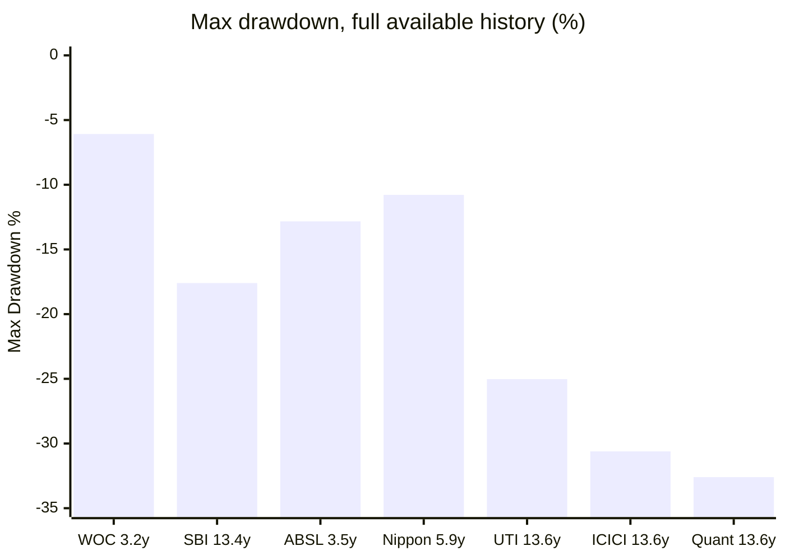
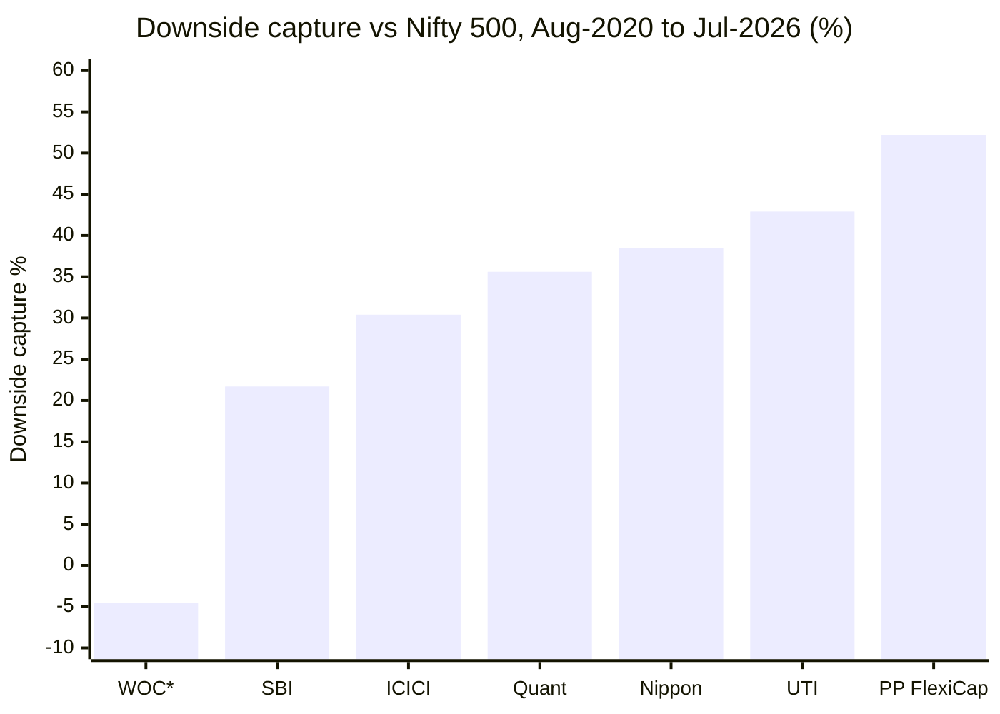
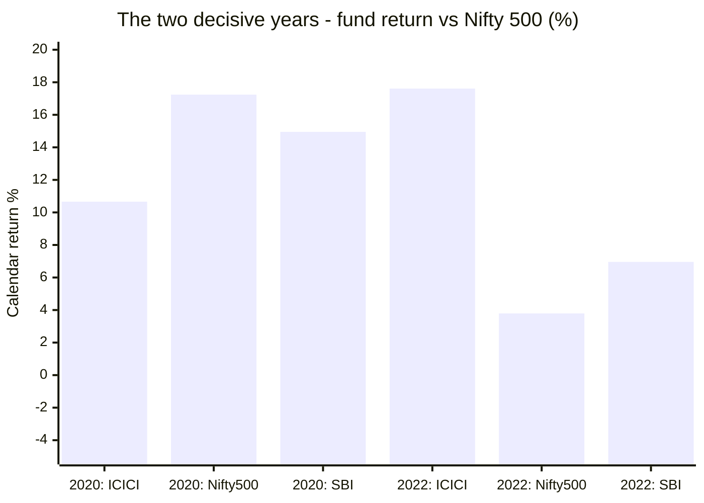
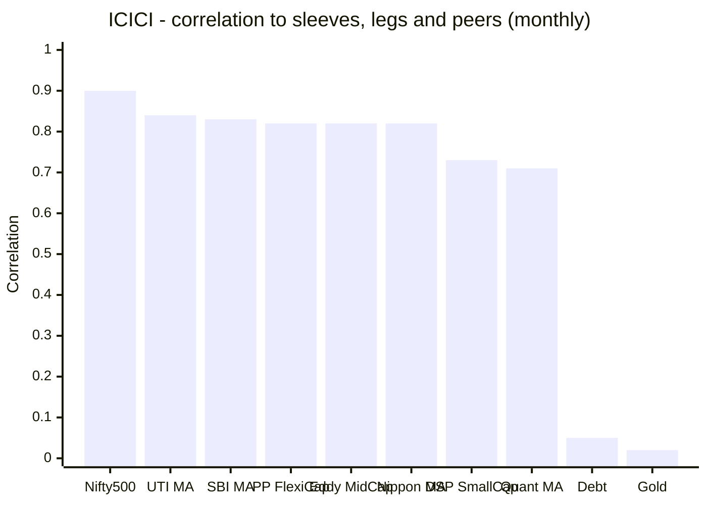
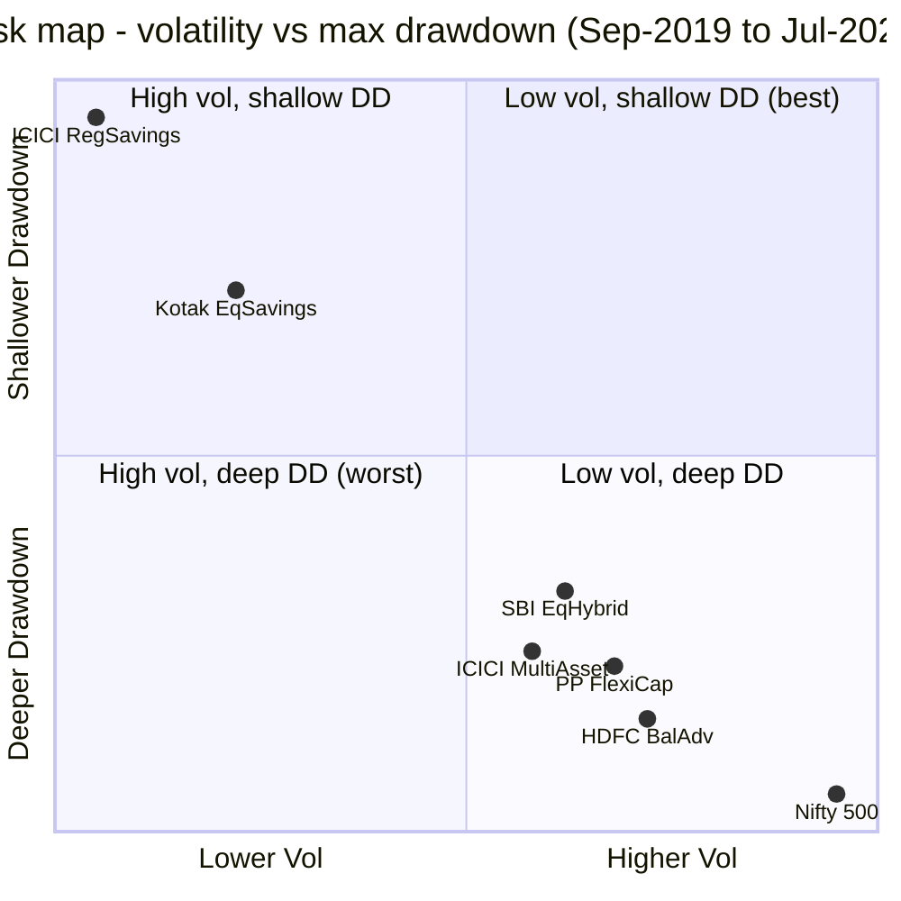
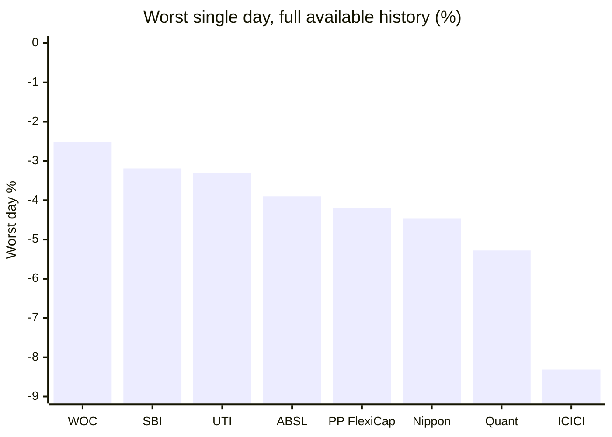
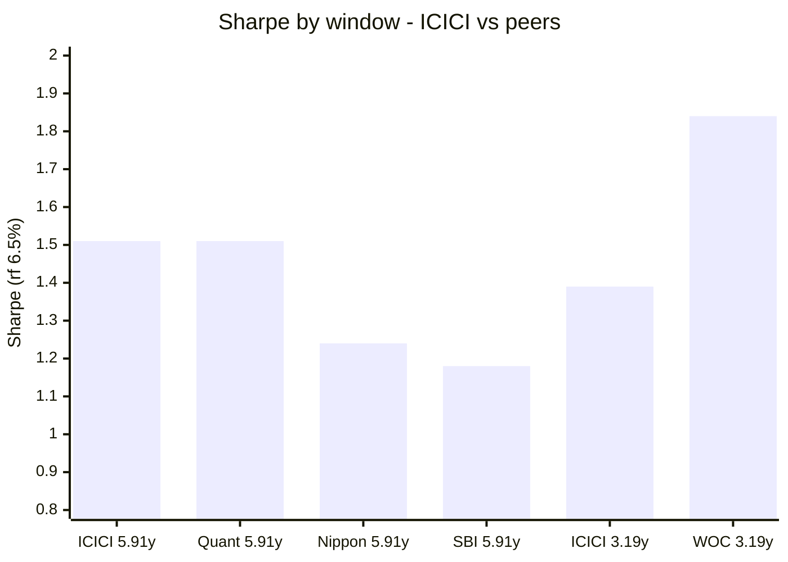
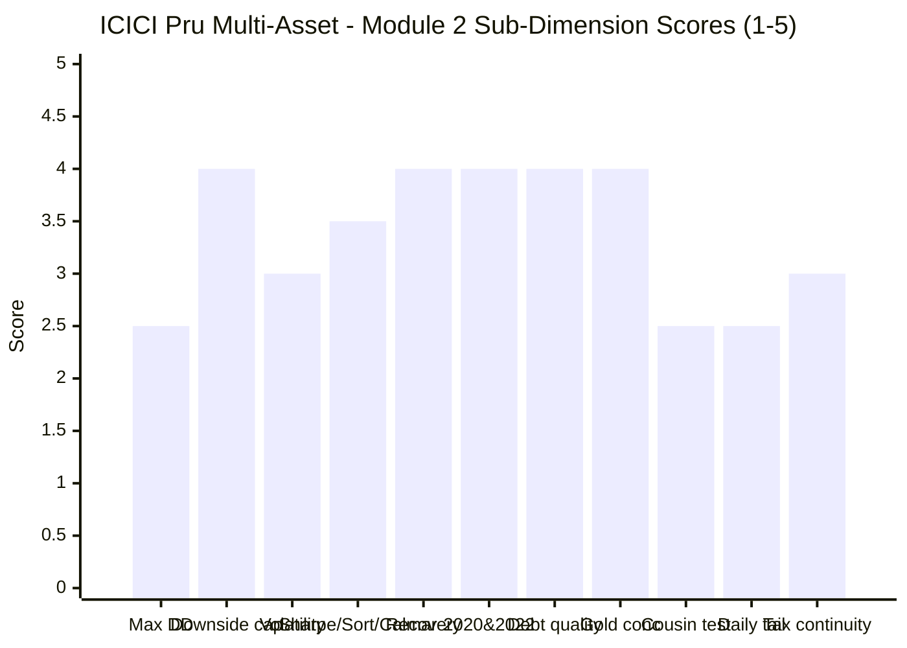

# Module 2: Risk Profile — ICICI Prudential Multi-Asset Fund

> **Provisional Module 2 score: ~3.4 / 5** (weight **25%** — the top weight in the multi-asset re-weight, because a risk-reduction product lives or dies here). **Scores are NOT comparable to the four equity categories** — this fund is judged on how much it *dampens*, not how much it returns.

> **The one-line context:** this module splits cleanly in two, and both halves are true. **On the test the category exists for, ICICI is the best fund in this study: CY2022 — equity flat, debt falling, gold rising — it returned +17.61% with a maximum drawdown of just −8.65%**, the highest return and near-shallowest drawdown of every fund that existed. Over the longest window containing 2022 it posts the **best Calmar in the category (2.21)** and a joint-best Sharpe (1.51) at 27% lower volatility than Quant. Its debt book is the **best-disclosed in the study** (modified duration 2.02y, full rating profile), its gold sleeve is **in-house and genuinely decorrelated** (monthly correlation to gold: +0.02), and it captured gold's 2025 melt-up that three peers missed.
>
> **And on the test that decides whether it can dampen an equity portfolio, it fails.** It fell **−30.61% in COVID** — past the study plan's *"alarming"* threshold of −28%, second-deepest of the seven funds studied, and only **+8.5pp better than the Nifty 500** when SBI managed +19.9pp. Worse, the **cousin test is a dead heat with a pure equity fund**: over the 6.89-year window ICICI's Sharpe is **1.00 against Parag Parikh FlexiCap's 1.01**, its drawdown **−30.61% against PP's −31.20%.** It has the **worst single day (−8.31%) and the fattest tail (kurtosis 14.60) of any fund in this study.** A multi-asset fund whose risk-adjusted profile is indistinguishable from a pure equity fund is not dampening anything — it is simply being run well.

---

## ✅ No `no-2022-data` Flag — and That Is This Module's Most Valuable Asset

| The framework's decisive risk tests | ICICI Pru | Shortlist coverage |
|---|---|---|
| **2020 COVID crash + gold rally** | ✅ **Traded in full** | SBI ✅ · UTI ✅ · Quant ✅ · Nippon ❌ · WOC ❌ · ABSL ❌ |
| **2022 — equity ↓, debt ↓, gold ↑** | ✅ **Traded in full — and won it outright** | SBI ✅ · UTI ✅ · Quant ✅ · Nippon ✅ · WOC ❌ · ABSL ❌ |
| Sep-2024 → Mar-2025 correction | ✅ | all |
| Jan–Mar 2026 tri-asset crash | ✅ | all |
| Under the **same lead manager** throughout | ✅ **Naren since Feb-2012** | unique |

**Every number in this module is measured, not inferred.** ABSL's and WOC's risk modules had to reason from a single benign regime; ICICI's drawdowns, capture ratios and cushioning figures were earned in three genuine crises. **That cuts both ways — the −30.61% is real in a way that WOC's −6.08% has never been tested to be, and the +17.61% in 2022 is real in a way no young fund can claim.**

---

## Fund Identity / Raw Data (MFAPI-computed + factsheet, as of 31-Jul-2026)

| Metric | Value | Source |
|---|---|---|
| MFAPI scheme code | **120334** (3,344 NAVs / 3,343 daily returns / 158 monthly obs, 13.57y) | api.mfapi.in/mf/120334 |
| **Volatility (daily)** | **11.83%** full-life · 11.93% multi-asset era · 12.26% (6.89y) · **9.80%** (Aug-2020, 5.91y) | MFAPI computed |
| **Max drawdown** | ⚠ **−30.61%** (17 Jan → 23 Mar 2020) — **recovered 01 Dec 2020, 319 days** | MFAPI computed |
| Max DD **since 2020** | ✅ **−9.63%** | MFAPI computed |
| % from all-time high | **−0.80%** (in a live −9.51% drawdown since 11 Feb 2026) | MFAPI computed |
| **Downside capture vs Nifty 500** | **43.8%** (6.89y) · **30.4%** (Aug-2020, 5.91y) | MFAPI (28 / 22 down-months) |
| Upside capture vs Nifty 500 | **79.8%** | MFAPI computed |
| Beta vs Nifty 500 (monthly) | **0.68** | MFAPI computed |
| Sharpe (rf 6.5%) | 0.82 full-life · **1.51** (Aug-2020) · 1.39 (May-2023) · **1.10** (AMC 3Y) | MFAPI / factsheet |
| Sortino | 1.15 full-life · **2.20** (Aug-2020) | MFAPI computed |
| **Calmar** | 0.53 full-life · **2.21 (Aug-2020 — best in study)** | MFAPI computed |
| Tracking error / Information Ratio vs SID blend | **5.18% / 0.77** | MFAPI computed |
| Beta / R² vs SID blended benchmark | 0.98 / 82% | MFAPI computed |
| **Correlation to PP FlexiCap** | **0.79** full-life · 0.80 multi-asset era · **0.70** (Aug-2020) | MFAPI (158 / 98 / 71 obs) |
| Correlation: DSP SmallCap / Edelweiss MidCap | 0.73 / 0.82 | MFAPI computed |
| **Correlation to gold / debt legs** | **+0.02 / +0.05** | MFAPI computed |
| Daily VaR (95% / 99%) | −1.08% / −1.99% | MFAPI computed |
| **Worst / best day** | ⚠ **−8.31%** / +5.43% | MFAPI computed |
| **Skew / excess kurtosis** | ⚠ **−1.01 / 14.60** — the fattest tail in the study | MFAPI computed |
| Days down >2% / >3% per year | 2.50 / 0.66 | MFAPI computed |
| **Stale-pricing test** | lag-1 autocorr **+0.0301 (t = 1.74)** — not significant; Geltner-unsmoothed vol **12.15%** vs reported 11.83% | MFAPI computed |
| **Debt book (disclosed)** | **Modified duration 2.02y · avg maturity 3.99y · Macaulay 2.11y · YTM 6.59%** | **Factsheet, verbatim** |
| **Debt rating profile** | Sovereign **25.33%** · AAA **18.78%** · AA **14.56%** · A **0.63%** · TREPS & current assets **40.70%** | **Factsheet, verbatim** |
| Gold / commodity sleeve | **ICICI Pru Gold ETF 9.77% (in-house)** + ETCDs 2.00% (gold future 1.81%, **crude-oil future 0.19%**) | **Factsheet, verbatim** |
| **Gross / net equity** | **68.32% / 63.7%** — ⚠ gross is only **3.32pp** above the 65% equity-tax line | **Factsheet, verbatim** |
| Portfolio beta (AMC-stated) | 0.83 | **Factsheet, verbatim** |
| SEBI riskometer | ⚠ **VERY HIGH** (benchmark: High) — the highest label in this study | **Factsheet, verbatim** |

---

## Cross-Source Verification

| Metric | MFAPI computed | Factsheet (AMC) | Tickertape | Verdict |
|---|---|---|---|---|
| **Sharpe** | 0.82 (13.6y) · **1.51** (5.91y) · 1.39 (3.19y) | **1.10** (3Y) | ⚠ **0.29** | ⚠ **Tickertape is the outlier and it is the figure that eliminated this fund at screening.** The AMC's own 1.10 and every MFAPI window contradict it |
| Volatility | 11.83% (13.6y) · 9.80% (5.91y) | **8.85%** (std dev, 3Y) | 9.8% | ✅ Consistent once the window is matched — the AMC's 3Y figure and Tickertape agree; the full-life number is higher because it contains 2020 |
| Portfolio beta | 0.68 (vs Nifty 500) | **0.83** | — | ✅ Consistent (different reference indices) |
| Max drawdown | **−30.61%** | not published | premium-gated | Self-computed; **second-deepest of the seven studied funds** (Quant −32.6%) |
| **Debt duration** | — | **Modified duration 2.02y — disclosed** | not exposed | ⭐ **The only fund in this study that publishes it.** WhiteOak declines to |
| Downside capture | **43.8% / 30.4%** | not published | not published | Self-computed |
| Net equity | 64.2% (M1 style analysis) | **63.7%** | 67.2% | ✅ Match within 0.5pp |

**Reliability: HIGH.** 3,343 daily returns and 158 monthly observations — **four times ABSL's sample and more than four times WOC's**, and drawn from three genuine crises rather than one regime. Capture ratios rest on 67 down-months (full life) versus WOC's 12. **One flagged anomaly, and it is consequential: Tickertape's Sharpe of 0.29**, which contradicts the AMC's own factsheet and every independent computation, and which was the decisive input in this fund's screening elimination (M1 §8).

---

## 1. ⚠ Max Drawdown — the Deepest Real Drawdown in the Study

### The full ledger (every drawdown beyond −8%)

| Peak → Trough | Depth | Recovery | Days underwater |
|---|---|---|---|
| 21 Jan 2013 → 25 Jun 2013 | −12.80% | 09 Oct 2013 | 261 |
| 03 Mar 2015 → 29 Feb 2016 | −18.79% | 12 Jul 2016 | 497 |
| 23 Jan 2018 → 16 Jul 2018 | −9.25% | 29 Mar 2019 | 430 |
| 04 Jul 2019 → 22 Aug 2019 | −8.41% | 25 Nov 2019 | 144 |
| **17 Jan 2020 → 23 Mar 2020 (COVID)** | ⚠ **−30.61%** | **01 Dec 2020** | **319** |
| 18 Apr 2022 → 20 Jun 2022 | −8.65% | 08 Aug 2022 | 112 |
| 11 Feb 2026 → 23 Mar 2026 | −9.51% | ⚠ **not recovered** | live |

**Three readings, and the first is decisive for this module.**

1. **⚠ −30.61% is past the study plan's own alarm line.** The framework's grid reads: *"Max Drawdown — Multi Asset 'good' < −20%; 'alarming' > −28% (it's barely dampening)."* ICICI is at −30.61%. **On the category's own stated standard this fund is in the alarming band**, and it is the second-deepest of the seven studied (behind Quant's −32.6%).
2. **✅ But it is a 2020-vintage number that no longer describes the fund.** Since 2020 the maximum drawdown is **−9.63%**, and annual volatility has fallen from **22.57% (2020) to 5.64% (2023), 7.60% (2024) and 6.48% (2025)** — WOC-like territory. The 2022, Sep-2024 and Jan-2026 drawdowns were −8.65%, −5.53% and −9.51%. **Something changed after 2020.** Module 3 must determine whether that is a deliberate de-risking of the allocation model or drift.
3. **⚠ And the caution against over-crediting that: 2026 volatility has snapped back to 12.10%**, roughly double the 2023–25 level. The benign recent profile is four years old and is already reverting.

**Recovery discipline is a genuine positive:** 319 days from a −30.61% hole, versus 12–24 months typical for equity. Every historical drawdown has been recovered; the fund sits **0.80% from its all-time high**.

---

## 2. Downside Capture — Good in Absolute Terms, Mid-Pack Against Peers

> *WOC's figure is from its own shorter window (May-2023 onward); it did not exist in Aug-2020.*

| Measure | ICICI (6.89y) | ICICI (5.91y) | SBI | Nippon | UTI | Quant |
|---|---|---|---|---|---|---|
| **Downside capture vs Nifty 500** | **43.8%** | **30.4%** | 21.7% | 38.5% | 42.9% | 35.6% |
| Upside capture | 79.8% | — | — | — | — | — |
| Capture asymmetry | **1.82×** | — | — | — | — | — |
| Beta vs Nifty 500 | **0.68** | — | — | — | — | — |

**In absolute terms 43.8% clears the framework's "<65% excellent" bar comfortably**, and the 79.8/43.8 asymmetry is a respectable shape — the fund participated in four-fifths of equity's upside while absorbing under half its downside.

**Two qualifications.** First, **it is mid-pack**: third of five over the window that includes 2022, well behind SBI's 21.7%. Second, and more revealing, **the 6.89-year figure (43.8%) is materially worse than the 5.91-year figure (30.4%)** — the difference is the 2020 quarter. **When equity fell hardest, ICICI captured most of it.** That is the pattern the drawdown ledger already showed, restated through a different lens.

---

## 3. ⭐ Realised Cushioning — Won 2022 Outright, Mediocre in 2020 (Tier-1)

**ICICI is one of only four studied funds with both decisive tests, and its results are opposite in the two.**

### ❌ 2020 — the weak result

| Fund | COVID crash (19 Feb → 23 Mar) | Max DD | CY2020 return | Cushion vs Nifty 500 |
|---|---|---|---|---|
| **SBI** | **−16.53%** | **−17.59%** | +14.95% | ⭐ **+19.9pp** |
| UTI | −25.02% | −25.02% | +14.00% | +11.4pp |
| **ICICI Pru** | ⚠ **−27.91%** | ⚠ **−30.61%** | +10.66% | ⚠ **+8.5pp** |
| Quant | −32.05% | −32.57% | +27.08% | +4.4pp |
| *Nifty 500* | −36.41% | −37.31% | +17.24% | — |
| *Gold* | −11.00% | −13.82% | **+27.90%** | — |

**ICICI is third of four.** In the year gold returned +27.90%, it held too little of it and too much equity, and its CY2020 return of +10.66% **lagged the index by 6.6pp** and its own blended benchmark by 7.15pp (M1). **This is the fund's worst hour and it is not defensible on the dampening thesis** — a fund carrying gold, debt and arbitrage should not lose 27.9% in a five-week equity crash.

### ⭐ 2022 — the best result in the study

| Fund | CY2022 return | Max DD in 2022 |
|---|---|---|
| **ICICI Pru** | ⭐ **+17.61%** | **−8.65%** |
| Quant | +15.28% | −15.89% |
| SBI | +6.96% | **−7.53%** |
| UTI | +5.34% | −11.44% |
| Nippon | +4.63% | −9.49% |
| *Nifty 500* | +3.79% | −17.51% |
| *Gold* | +13.01% | −8.01% |
| *Debt* | +5.34% | −1.29% |

**+17.61% in the year equity returned +3.79%, debt returned +5.34% and the market's own blend returned +5.10% — an alpha of +12.51pp (M1) — with a maximum drawdown of just −8.65%.** This is the single best result any fund in this study produced in the year the entire framework is built around. **When the three asset classes genuinely diverged, ICICI's allocation and selection both worked.**

### The two recent stress windows

| | Sep-2024 → Mar-2025 | Jan–Jun 2026 (tri-asset) |
|---|---|---|
| **ICICI** | **−5.53% DD · −1.09%** ✅ *2nd best of 7* | −9.51% DD · −2.09% ⚠ *5th of 7* |
| WOC | −2.19% DD · **+3.41%** 🥇 | −6.08% DD · **+3.56%** 🥇 |
| SBI | −6.20% · −2.84% | −8.59% · +1.75% |
| Nippon | −7.63% · −3.53% | −10.78% · +2.44% |
| UTI | −9.88% · −5.80% | −11.03% · −1.71% |
| ABSL | −8.84% · −3.75% | −12.83% · +1.95% |
| Quant | −12.49% · −6.80% | −8.16% · **+6.64%** |
| *Nifty 500* | −18.62% · −12.62% | −14.71% · −3.41% |

**Verdict: ICICI's cushioning is excellent when asset classes diverge (2022, Sep-2024) and poor when everything falls at once (2020).** That is a coherent and honest characterisation — and it means the fund protects against the *specific* scenario the category was designed for, but not against a broad market crash.

---

## 4. Correlation to the Existing Sleeves — Better Than It Looks (Tier-1)

| vs | Correlation | R² | Beta | Read |
|---|---|---|---|---|
| **PP FlexiCap** (full life, 158 obs) | **0.79** | **63%** | 0.78 | The core cross-sleeve number |
| PP FlexiCap (multi-asset era, 98 obs) | 0.80 | 65% | 0.74 | Stable |
| PP FlexiCap (Aug-2020, 71 obs) | **0.70** | **49%** | 0.68 | **Improving over time** |
| Edelweiss MidCap | 0.82 | 67% | 0.55 | — |
| DSP SmallCap | 0.73 | 53% | 0.44 | — |
| Nifty 500 | 0.90 | 82% | **0.68** | High correlation, moderate sensitivity |
| **Gold leg** | **+0.02** | **0%** | +0.01 | ⭐ **Genuinely decorrelated** |
| Debt leg | +0.05 | 0% | +0.36 | ⭐ Genuinely decorrelated |
| Multi-asset peers | 0.71–0.84 | 50–71% | — | The familiar cluster |

**Two findings.**

1. **At 0.79 to PP FlexiCap (0.70 over the last six years), ICICI is a better diversifier than its equity weight suggests** — comparable to WOC's 0.77 and materially better than UTI's 0.93. Roughly **37% of its variance is independent** of the FlexiCap core, rising to 51% on recent data. That is real, if partial, diversification.
2. **⭐ The gold sleeve is genuinely doing its job.** A monthly correlation of **+0.02 to the gold leg** means the commodity holding moves independently of the fund's dominant equity driver — which is the entire structural argument for holding it. Contrast this with the fund's 0.90 correlation to the Nifty 500: **the equity book explains the fund, and gold is the part that doesn't.**

> **Statistical note:** 158 monthly observations across three crises — by a wide margin the most robust correlation estimate in this study (WOC had 38, ABSL 41). These numbers can be relied on in a way the young funds' cannot.

---

## 5. ⚠ The Cousin Test — a Dead Heat With a Pure Equity Fund (NEW dimension)

**The test: does the third asset class buy dampening that simpler structures cannot?** This is what destroyed ABSL and what WOC passed decisively.

| Fund (category) | CAGR | Vol | Max DD | **Sharpe** | Dn-cap |
|---|---|---|---|---|---|
| ICICI Regular Savings *(Conservative Hybrid)* | 10.00% | **3.82%** | **−8.85%** | 0.92 | **7.0%** |
| Kotak Equity Savings | 11.19% | 6.82% | −16.48% | 0.69 | 24.4% |
| **ICICI Pru Multi-Asset** | **18.74%** | **12.26%** | ⚠ **−30.61%** | **1.00** | 43.8% |
| **PP FlexiCap** *(**pure equity**)* | **20.21%** | 13.56% | ⚠ **−31.20%** | ⚠ **1.01** | 52.2% |
| HDFC Balanced Advantage *(BAF)* | 16.61% | 14.07% | −33.26% | 0.72 | 63.7% |
| SBI Equity Hybrid *(Aggressive Hybrid)* | 14.08% | 12.83% | −27.49% | 0.59 | 63.8% |
| *Nifty 500* | 15.61% | 17.58% | −37.31% | 0.52 | — |

**The result, stated plainly and unfavourably: ICICI Pru Multi-Asset's risk-adjusted profile is statistically indistinguishable from a pure equity fund.** Sharpe **1.00 vs PP FlexiCap's 1.01**. Drawdown **−30.61% vs −31.20%**. It gives up 1.47pp of return for 1.30pp of volatility — an almost exactly proportional trade, i.e. **no dampening benefit at all** relative to simply owning a good flexi-cap equity fund.

**What it does clearly beat:**
- **HDFC Balanced Advantage** — +2.13pp more return, 1.81pp less volatility, 2.65pp shallower drawdown, Sharpe 1.00 vs 0.72, downside capture 43.8% vs 63.7%. A decisive win.
- **SBI Equity Hybrid** — +4.66pp more return at similar volatility, Sharpe 1.00 vs 0.59. Decisive.

**What clearly beats it on risk:** Kotak Equity Savings (−16.48% DD) and ICICI's own Regular Savings fund (−8.85% DD, 3.82% vol), both at 7.5–8.7pp less return.

**The honest conclusion: ICICI is a very good *hybrid* — it beats Balanced Advantage and Aggressive Hybrid comprehensively — and it is not a *dampener*.** Against the one comparator that matters for a portfolio already holding 100% equity, it offers no risk advantage whatsoever. **In fairness:** PP FlexiCap holds meaningful cash and international equity and is not a pure-beta comparator; and this window contains ICICI's worst-ever quarter. Over the Aug-2020 window (vol 9.80%, DD −9.63%) ICICI would win this test easily. **But the window that includes a real crash is the window that answers the question.**

---

## 6. Multi-Asset-Specific Risks (NEW dimensions)

| Risk | Assessment | Status |
|---|---|---|
| **Gold/metals-concentration risk** | ✅ **Well-sized and genuinely decorrelated.** 11.76% (in-house **ICICI Pru Gold ETF 9.77%** + ETCDs 2.00%), monthly correlation to gold **+0.02**. Captured 2025's +71.85% melt-up (M1: +5.59 alpha) that UTI, ABSL and WOC missed. **In-house vehicle — no rented ETF, no double layer.** ⚠ One oddity: a **0.19% crude-oil futures position**, a non-gold commodity with no stated rationale → M3 | ✅ **strong** |
| **Debt-sleeve duration + credit** | ⭐ **The best-disclosed debt book in the study.** **Modified duration 2.02y** (short — the 2022 rate trap largely avoided by design, and *proven*: the fund returned +17.61% in 2022), avg maturity 3.99y, YTM 6.59%. Rating: **Sovereign 25.33% + AAA 18.78% + TREPS 40.70% = 84.8% high-grade**; **AA 14.56% + A 0.63% = 15.2% credit reach** (Muthoot Finance AA+, Cholamandalam AA+). No credit event in the NAV across 13.6 years | ✅ **4.0** |
| **⚠ Equity-taxation continuity risk** | ⚠ **The live structural risk, and it is the mirror of WOC's.** Gross equity is **68.32% against a 65% requirement — a buffer of just 3.32pp.** M1 established equity taxation is worth a great deal here (₹1.25L exemption + a 12-month rather than 24-month window). **The fund's own benchmark declares 65% equity — it is running right at the line.** A sustained de-risking of the equity book below 65% gross would cost the shelter. **A standing review trigger, and it constrains how defensive the fund can become** | ⚠ **live** |
| **Joint equity + debt (2022-style) drawdown** | ⭐ **Experienced and won outright** — +17.61% with a −8.65% drawdown. **The only fund in the study that can make this claim.** The 2.02y duration is why | ✅ **passed** |
| **Broad equity crash** | ❌ **Experienced and failed** — −27.91% in the COVID quarter, +8.5pp cushion against SBI's +19.9pp | ❌ **failed** |
| **NAV smoothing / stale pricing** | ⚠ **Marginal, and the only fund where unsmoothing *raises* volatility.** Lag-1 autocorrelation **+0.0301 (t = 1.74)** — the highest of any fund tested and just short of significance; **Geltner-unsmoothed vol 12.15% vs reported 11.83%.** Not a red flag, but the reported figure is if anything mildly *understated* — the opposite direction to the usual concern | ⚠ **noted** |
| **Redemption / liquidity-spiral risk** | ⚠ **The largest AUM in the category at ₹84,991 Cr** — but the book is large-cap equity, an in-house gold ETF, sovereign/AAA debt and exchange-traded derivatives, all deeply liquid. REITs/InvITs total only **1.22%**, a fraction of WOC's ~11.6%. **Capacity is genuinely a non-issue here** | ✅ **low** |
| **FoF daily-pricing lag** | ✅ **N/A** — no feeder or FoF wrapper; the gold ETF is in-house and exchange-traded. Foreign equity is 0.11%, immaterial | ✅ N/A |
| **"No structural buffer" check** *(inverted)* | ⚠ **The buffer exists and works selectively** — decisive in 2022 and Sep-2024, ineffective in the 2020 broad crash | ⚠ **partial** |

---

## 7. Daily Distribution — the Fattest Tail in the Study

| Metric | **ICICI** | WOC | SBI | ABSL | PP FlexiCap |
|---|---|---|---|---|---|
| **Worst single day** | ⚠ **−8.31%** | −2.52% | −3.19% | −3.90% | −4.19% |
| Best single day | +5.43% | +1.79% | — | +2.99% | — |
| **Excess kurtosis** | ⚠ **14.60** | 10.34 | 8.82 | 8.89 | 7.38 |
| Skew | ⚠ **−1.01** | −0.78 | — | — | — |
| Days down >2% per year | 2.50 | 0.63 | 0.94 | 2.19 | 0.63 |
| Days down >3% per year | 0.66 | — | — | — | — |
| VaR 95% / 99% | −1.08% / −1.99% | −0.47% / −0.98% | — | −0.87% / −1.90% | — |

**ICICI has the worst single day, the highest kurtosis and the most negative skew of any fund in this study — by clear margins.** A −8.31% day is more than three times WOC's worst and twice PP FlexiCap's. Kurtosis of 14.60 with skew of −1.01 describes a distribution that is calm most of the time and occasionally violent in one direction.

**The honest framing:** this is a **measured** tail, not an estimated one. WOC's −2.52% worst day was recorded over 3.19 years containing no bear market; ICICI's −8.31% is what actually happened. **A fund with a genuinely fat left tail that has been observed is more trustworthy information than a thin tail that has not been tested — but it is still a fat tail, and an investor will feel it.**

---

## 8. Peer Risk Comparison — Everything Depends on the Window

### Window A — Aug-2020 → Jul-2026 (5.91y, **includes 2022**, 5 funds)

| Fund | CAGR | Vol | Max DD | **Sharpe** | Sortino | **Calmar** | Dn-cap |
|---|---|---|---|---|---|---|---|
| **ICICI Pru** | 21.31% | 9.80% | **−9.63%** | **1.51** 🥇 | 2.20 | **2.21** 🥇 | 30.4% |
| Quant | **26.63%** | 13.33% | −15.89% | **1.51** 🥇 | **2.21** | 1.68 | 35.6% |
| Nippon | 18.34% | 9.54% | −10.78% | 1.24 | 1.77 | 1.70 | 38.5% |
| SBI | 15.27% | **7.46%** | **−8.59%** | 1.18 | 1.67 | 1.78 | **21.7%** |
| UTI | 15.29% | 8.92% | −11.44% | 0.99 | 1.40 | 1.34 | 42.9% |

### Window B — May-2023 → Jul-2026 (3.19y, all 7 funds)

| Fund | CAGR | Vol | Max DD | **Sharpe** | Calmar | Dn-cap |
|---|---|---|---|---|---|---|
| **WOC** | 16.90% | **5.65%** | **−6.08%** | **1.84** 🥇 | **2.78** 🥇 | **−4.5%** 🥇 |
| Quant | **24.12%** | 11.25% | −12.49% | 1.57 | 1.93 | 29.3% |
| Nippon | 20.73% | 9.77% | −10.78% | 1.46 | 1.92 | 23.1% |
| SBI | 17.53% | 7.84% | −8.59% | 1.41 | 2.04 | 16.4% |
| **ICICI Pru** | 17.59% | 7.99% | −9.51% | **1.39** ⚠ *5th of 7* | 1.85 | 28.2% |
| UTI | 17.97% | 9.37% | −11.03% | 1.22 | 1.63 | 43.0% |
| ABSL | 17.92% | 10.12% | −12.83% | 1.13 | 1.40 | 29.2% |

**The two tables tell opposite stories, and both are legitimate.** Over the window containing 2022, ICICI has the **best Calmar in the category and a joint-best Sharpe at 27% lower volatility than Quant.** Over the most recent 3.19 years — the only window where all seven funds coexist — it ranks **fifth of seven**, behind WOC, Quant, Nippon and SBI.

**This is the same U-shape M1 found in the CAGR ladder, and it is the fund's defining ambiguity: the long-horizon record is excellent and the recent record is ordinary.**

---

## Points For / Points Against — Risk

### ✅ For
1. **⭐ Won 2022 outright — the category's defining test.** +17.61% with a −8.65% drawdown, against the Nifty 500's +3.79%. The best result any fund in this study produced in the year all three asset classes diverged.
2. **⭐ Best Calmar in the category over the window that includes 2022 (2.21)**, and a joint-best Sharpe (1.51) achieved at **27% lower volatility and 39% shallower drawdown than Quant**.
3. **⭐ The only fund with both decisive stress tests measured, under one lead manager** — 3,343 daily returns and 158 monthly observations across three genuine crises, versus WOC's 38 monthly observations from one regime.
4. **⭐ Best-disclosed debt book in the study** — modified duration 2.02y, avg maturity 3.99y, YTM 6.59% and a full rating profile (84.8% sovereign/AAA/TREPS), all published monthly. **The 2.02y duration is why 2022 worked**, and no fund else publishes this.
5. **⭐ The gold sleeve is genuinely decorrelated** — monthly correlation to gold of **+0.02** against 0.90 to the Nifty 500 — held via an **in-house ETF** with no double cost layer, and it captured the 2025 melt-up three peers missed.
6. **Downside capture 43.8% (30.4% since Aug-2020) clears the framework's <65% "excellent" bar**, with a 79.8/43.8 asymmetry.
7. **Better cross-sleeve diversification than its equity weight implies** — 0.79 correlation to PP FlexiCap full-life, **0.70 over the last six years**, versus UTI's 0.93.
8. **Recovered a −30.61% drawdown in 319 days** and sits 0.80% from an all-time high; every historical drawdown has been recovered.
9. **Beats both hybrid cousins decisively** — Sharpe 1.00 vs HDFC Balanced Advantage's 0.72 and SBI Equity Hybrid's 0.59, with 3–6pp shallower drawdowns and 20pp better downside capture.
10. **Capacity and liquidity are genuine non-issues** — large-cap equity, in-house gold ETF, sovereign/AAA debt; REITs/InvITs only 1.22% versus WOC's ~11.6%.
11. **Volatility has fallen dramatically since 2020** — 22.57% (2020) → 5.64% (2023) → 6.48% (2025).

### ❌ Against
1. **⚠ THE FINDING: −30.61% maximum drawdown — past the study plan's own "alarming" threshold of −28%**, and second-deepest of the seven funds studied.
2. **⚠ The cousin test is a dead heat with a pure equity fund.** Sharpe **1.00 vs PP FlexiCap's 1.01**; drawdown **−30.61% vs −31.20%**. Against the comparator that matters for an all-equity portfolio, **the multi-asset structure bought no risk advantage at all.**
3. **⚠ 2020 was a genuine failure** — −27.91% in the COVID quarter, a cushion of only +8.5pp against SBI's +19.9pp, in the year gold returned +27.90%.
4. **⚠ Worst single day (−8.31%), highest kurtosis (14.60) and most negative skew (−1.01) in the study** — by clear margins, and 2.50 down->2% days per year.
5. **⚠ Fifth of seven on the recent 3.19-year window** (Sharpe 1.39) — the long record is excellent, the current one is ordinary.
6. **⚠ Equity-taxation continuity risk is live and constraining** — gross equity **68.32% against a 65% requirement, a 3.32pp buffer.** The fund cannot de-risk much further without forfeiting the tax shelter M1 valued so highly.
7. **⚠ Volatility is reverting** — 2026 at 12.10%, roughly double the 2023–25 average of ~6.6%. The benign recent profile may not persist.
8. **⚠ Currently in an unrecovered −9.51% drawdown** since 11 February 2026.
9. **⚠ SEBI riskometer: VERY HIGH** — the highest label of any fund in this study, and above its own benchmark's "High".
10. **⚠ The stale-pricing test is the only one in the study where unsmoothing *raises* volatility** (12.15% vs 11.83% reported), with a lag-1 autocorrelation of +0.0301 (t=1.74) — borderline, and in the adverse direction.
11. **Tickertape's Sharpe of 0.29** — the input that eliminated this fund at screening — is contradicted by the AMC's factsheet (1.10) and every independent computation.

---

## Module 2 Scorecard

| Sub-dimension | Weight | Score | Reasoning |
|---|---|---|---|
| **Max drawdown (inception-adjusted)** *(Critical)* | 15% | **2.5** | ⚠ **−30.61% is past the framework's own "alarming" line (>−28%)** and second-deepest of seven. Guide gives 2.0 for >−30%; lifted half a point because it is a **2020-vintage number** (max DD since 2020 is −9.63%), it **recovered in 319 days**, and unlike WOC/ABSL it is a *tested* figure |
| **Downside capture vs Nifty 500** *(Critical)* | 15% | **4.0** | ✅ **43.8% full-window and 30.4% since Aug-2020** — clears the "<65% excellent" bar with a 79.8/43.8 asymmetry. Docked because it is **mid-pack** (3rd of 5) and because the 6.89y figure is materially worse than the 5.91y one — the difference is the 2020 crash |
| **Volatility** *(High)* | 10% | **3.0** | 11.83% full-life sits in the guide's 11–13% band (=3); 9.80% over Aug-2020 would be a 4. ✅ 2023–25 ran 5.6–7.6%. ⚠ But 2026 has snapped back to 12.10%, and the AMC's own 3Y figure is 8.85% |
| **Sharpe / Sortino / Calmar vs category** *(High)* | 10% | **3.5** | ⭐ **Best Calmar in the category (2.21) and joint-best Sharpe (1.51) over the window including 2022.** ⚠ But full-life Calmar is 0.53 and the recent 3.19y Sharpe (1.39) ranks 5th of 7. Heavily window-dependent |
| Recovery time from max DD *(Medium)* | 5% | **4.0** | 319 days (10.5 months) from a −30.61% hole — inside the guide's 9–12 month band; every historical drawdown recovered; 0.80% from an all-time high. Docked for the live unrecovered −9.51% |
| **2020 & 2022 realised cushioning** *(Critical)* | 15% | **4.0** | ⭐ **2022 won outright (+17.61%, −8.65% DD) — the best in the study.** ❌ 2020 was weak (+8.5pp cushion vs SBI's +19.9pp). **Scored 4.0 rather than 3.0 because ICICI is one of only four funds that has *both* tests at all** — measured evidence outweighs a young fund's absence of it |
| Debt-sleeve quality (duration + credit) *(Medium)* | 7% | **4.0** | ⭐ **Best-disclosed debt book in the study** — modified duration 2.02y, 84.8% sovereign/AAA/TREPS, YTM 6.59%, full rating profile published monthly. **Proven in 2022.** Docked for 15.2% AA-and-below credit reach (Muthoot, Chola) |
| **Gold/metals-concentration risk** *(NEW)* | 8% | **4.0** | ✅ 11.76% via an **in-house ETF**, monthly correlation to gold **+0.02** — genuinely decorrelated — and it **captured the 2025 melt-up** three peers missed. Docked for an unexplained 0.19% crude-oil futures position (→ M3) |
| **Cousin-category comparison** *(NEW)* | 8% | **2.5** | ⚠ **Statistically indistinguishable from a pure equity fund** — Sharpe 1.00 vs PP FlexiCap's 1.01, drawdown −30.61% vs −31.20%. **The multi-asset structure bought no dampening advantage.** Lifted from 2.0 because it beats Balanced Advantage and Aggressive Hybrid decisively on every axis |
| Daily tail risk | 4% | **2.5** | ⚠ **Worst single day (−8.31%), highest kurtosis (14.60) and most negative skew (−1.01) in the study**, with 2.50 down->2% days/yr. Lifted from 2.0 because this is a *measured* tail across 13.6 years, not an untested estimate |
| **Equity-taxation continuity risk** *(NEW)* | 3% | **3.0** | ⚠ **Gross equity 68.32% against a 65% requirement — a 3.32pp buffer**, and the benchmark itself declares 65%. The shelter M1 valued highly is live but thin, and it **constrains how defensive the fund can become.** A standing review trigger |
| Correlation to existing equity sleeves | *informational* | — | 0.79 to PP FlexiCap full-life (0.70 since Aug-2020), 0.73 to DSP SmallCap, beta 0.68 to Nifty 500 — better diversification than the equity weight implies. **158 monthly observations, the most robust estimate in this study.** Feeds the decision tree |
| **Module 2 Overall** | **100%** | **~3.4 / 5** | **The best 2022 in the study, the best Calmar over the window that contains it, a proven 2.02-year debt book and a genuinely decorrelated in-house gold sleeve — set against a −30.61% drawdown past the framework's own alarm line, a cousin test that is a dead heat with a pure equity fund, the fattest tail measured anywhere in this study, and a 3.32pp buffer on the tax status that limits how defensive it can get.** Not comparable to equity-category Module 2 scores |

---

## Comparative Module 2 Scores (studied funds — calibration only)

| Fund | Module 2 | Character |
|---|---|---|
| **SBI Multi Asset** | **~4.5 / 5** | Elite downside protection, cycle-proven through COVID **and** 2022 |
| WOC Multi Asset | ~4.1 / 5 | Best-measured risk profile — negative downside capture — on 38 months and no bear market |
| Nippon Multi Asset | ~3.6 / 5 | Respectable equity-plus dampener; saw 2022; never severe-bear-tested |
| **ICICI Pru Multi-Asset** | **~3.4 / 5** | **Won 2022 outright and has the best Calmar over that window — but a −30.6% COVID drawdown, a dead heat with pure equity, and the fattest tail in the study** |
| UTI Multi Asset | ~3.2 / 5 | Weakest dampener of the cycle-tested funds — but proven in 2020 *and* 2022 |
| ABSL Multi Asset | ~3.1 / 5 | Best capture asymmetry, worst like-for-like metrics, out-dampened by no-gold cousins |
| Quant Multi Asset | ~2.6 / 5 | Fails the risk test — equity-level drawdown, no 2022 cushion |

> Module 2 carries **25%** because risk *is* the multi-asset thesis. **ICICI lands fourth of seven, and the placement is a genuine trade-off rather than a verdict on quality.** It beats Nippon, UTI and ABSL on evidence depth and on the 2022 test. It sits below SBI and WOC because **both of those funds dampen and ICICI, on the measured record, does not** — SBI cushioned COVID by +19.9pp against ICICI's +8.5pp, and WOC's entire risk profile is a category better even if untested. **ICICI is the best-performing hybrid in this study and the third-best dampener.**

---

## SIP Implication

For a ₹15–20k/month SIP alongside a portfolio that is already ~100% equity, Module 2 delivers the clearest fork in this entire study. **ICICI's risk credentials in the specific scenario the category was designed for are the best on offer.** In 2022 — equity flat, bonds falling, gold rising, the exact cross-asset divergence the framework calls the defining test — it returned **+17.61% with a maximum drawdown of −8.65%** while the market returned 3.79%. Its debt book, with a disclosed modified duration of 2.02 years, is *why*, and it is the only fund in this study that publishes the number. Its gold sleeve is in-house, cheap, and carries a monthly correlation to the fund of **+0.02** — genuinely independent of the equity that drives everything else. Over the six years containing that test it has the best Calmar in the category. And all of this is measured across 3,343 daily observations and three crises, not inferred from 38 months of sunshine.

**But the question this sleeve is being bought to answer is different, and on that question the fund fails.** An investor holding four equity sleeves wants something that falls less when equity falls. ICICI fell **−30.61% in COVID** — past the framework's own alarm line, and only 8.5 points better than the index when SBI managed nearly 20. More damningly, over the full window its risk-adjusted profile is **statistically indistinguishable from Parag Parikh FlexiCap, a pure equity fund and very likely the portfolio's own core holding** — Sharpe 1.00 against 1.01, drawdown −30.61% against −31.20%. **You cannot diversify an equity portfolio with something that behaves like an equity fund**, however well run. Add the worst single day (−8.31%) and fattest tail (kurtosis 14.60) in the study, and a 3.32-percentage-point buffer on the equity-tax status that limits how defensive it is even allowed to become.

**So the honest framing is that ICICI and WOC are not competing for the same slot.** WOC dampens — a −6.08% worst drawdown, negative downside capture, and a decisive win over every cousin including pure equity — but has never met a bear market and gives up return to get there. **ICICI is the better fund and the worse dampener.** If the multi-asset allocation is meant to reduce whole-portfolio volatility, ICICI's −30.61% disqualifies it and Module 2 should weigh heavily against it. If the slot is a tax-efficient all-weather growth engine that will be held through a crash without flinching, ICICI's 2022 result and its 319-day COVID recovery are exactly the evidence you would want. **Module 2's verdict: outstanding cross-asset protection, no broad-market protection, and the most honestly-measured risk record in the study.**

## One-Line Verdict

**The only fund in this study that won 2022 outright — +17.61% with an −8.65% drawdown in the year equity, debt and gold genuinely diverged, backed by the only publicly-disclosed 2.02-year debt duration and a gold sleeve carrying a +0.02 correlation to the fund itself — and simultaneously the fund whose −30.61% COVID drawdown sits past the framework's own alarm line, whose Sharpe of 1.00 is indistinguishable from a pure equity fund's 1.01, and whose −8.31% worst day and 14.60 kurtosis are the fattest tail measured anywhere in this study.**

---

*Module 2 complete. Provisional score 3.4/5. **Method:** self-computed from MFAPI **120334** (3,344 NAVs / 3,343 daily returns / 158 monthly obs, 02-Jan-2013 → 31-Jul-2026). Capture ratios and betas computed vs **Nifty 500 index fund (147625)** as primary, with **Nifty 50 (120620)** for the pre-Sep-2019 history. Correlations vs PP FlexiCap (122639), Edelweiss MidCap (140228), DSP SmallCap (119212). Cousins: HDFC Balanced Advantage (118968), SBI Equity Hybrid (119609), Kotak Equity Savings (131373), ICICI Prudential Regular Savings (120616). Legs: SBI Gold (119788), ICICI All Seasons Bond (120603). Blended benchmark = the SID composite (Nifty 200 TRI 65 / Nifty Composite Debt 25 / gold 6 / silver 1 / iCOMDEX 3), proxied per M1. Peer risk re-computed over two windows — **Aug-2020 → Jul-2026** (5.91y, 5 funds, includes 2022) and **May-2023 → Jul-2026** (3.19y, all 7 funds). Debt duration, rating profile, gross/net equity, portfolio beta and riskometer taken **verbatim from the ICICI Prudential Multi-Asset Fund factsheet (30-Jun-2026)**. Stale-pricing test = lag-1..3 autocorrelation + Geltner unsmoothing.*

*⚠ **CROSS-MODULE CORROBORATION — M1 is confirmed and sharpened, no score change.** M1 flagged the −30.61% drawdown as *"the single most adverse fact in this fund's file"* and deferred it here. **Confirmed, and worse than M1 implied in one respect:** the cousin test shows the fund is risk-adjusted-indistinguishable from a pure equity fund, which M1 could not see. **And better in another:** M1 could not quantify the 2022 cushioning, which turns out to be the best in the study (+17.61% at −8.65% DD) and is the direct product of the 2.02-year debt duration. **M1's 4.3 stands** — its sub-scores were awarded on returns evidence that this module does not disturb.*

*⚠ **A new finding M1 did not have: the equity-tax buffer is thin and constraining.** Gross equity is **68.32% against the 65% threshold — 3.32pp.** M1 scored "post-tax return" 5.0 on the strength of equity taxation. That score stands (the status is current and real), **but the risk of losing it is now quantified and it is not remote** — and it means the fund cannot de-risk much further without forfeiting the shelter. This is the mirror image of WOC, which sits 25pp *below* the line and is permanently middle-tier. **→ M4 must model what a loss of equity status would cost.***

***Cross-module handoffs:*** *the **0.19% crude-oil futures position**, the **post-2020 volatility collapse (22.57% → 5.64%) — deliberate de-risking or drift?**, the **54.6pp equity range from M1**, and the **1.22% REIT/InvIT sleeve** → **M3**; the **3.32pp gross-equity buffer and the cost of losing equity taxation**, plus the **194% portfolio turnover** → **M4**; **whether Naren's team deliberately reduced risk after 2020** → **M5**; **ICICI AMC's fixed-income and commodity desks — both of which look strong on this evidence** → **M6**; the **0.79/0.70 correlation to PP FlexiCap and the cousin-test dead heat** → **decision tree (the decisive cross-sleeve numbers)**. **Standing caveat: the fund's risk profile changed materially after 2020, and this module's headline drawdown describes a version of the fund that may no longer exist — but 2026 volatility has already reverted to 12.10%.** Running scorecard: **M1 ~4.3 · M2 ~3.4** (weighted ≈ 3.80 across 45% of the framework).*

*Next: [Module 3 — Allocation Engine & Portfolio DNA](module3_allocation.md)*
