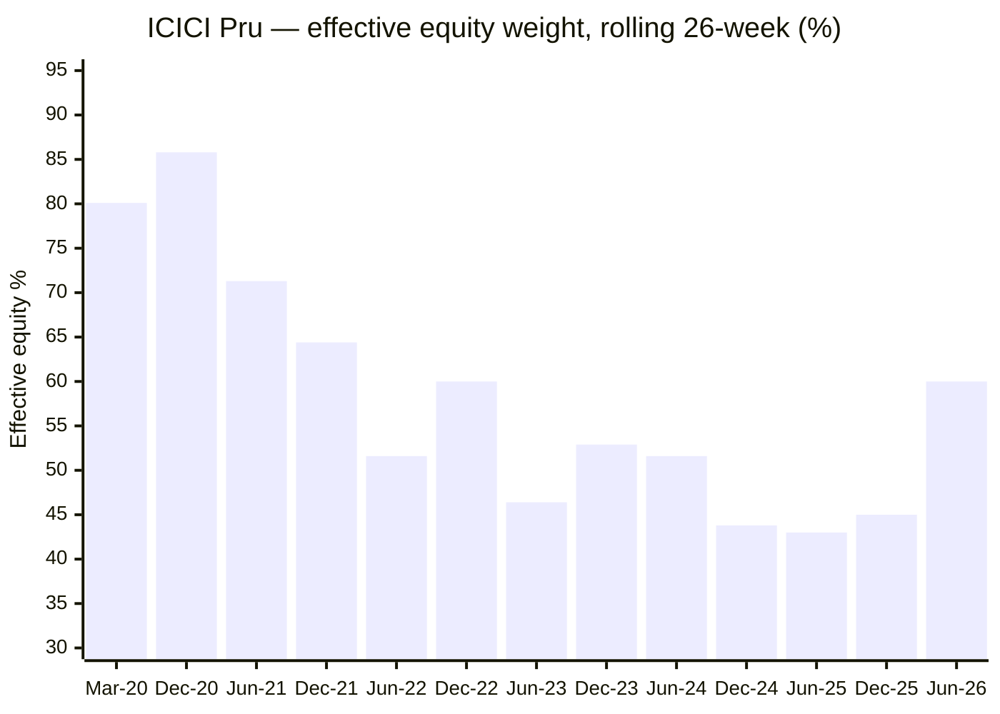
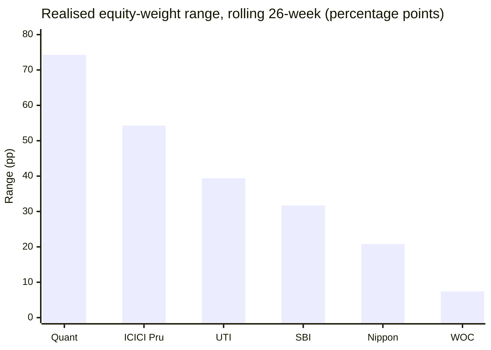
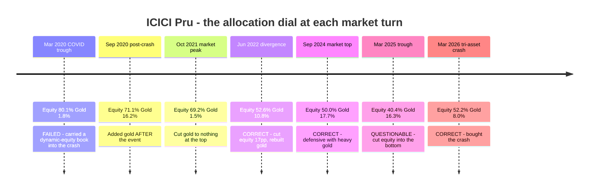
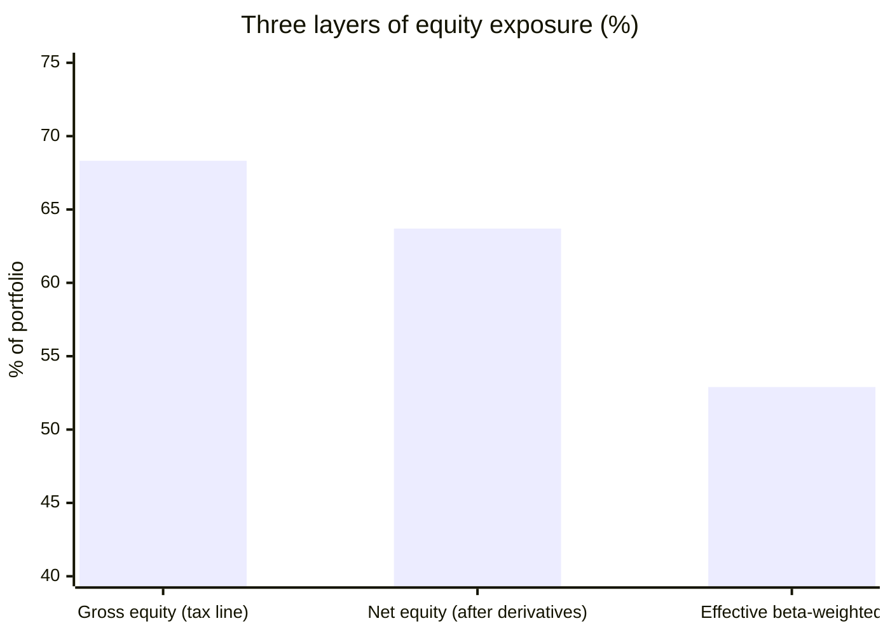
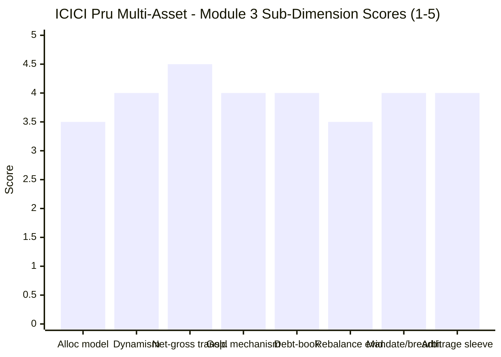

# Module 3: Allocation Engine & Portfolio DNA — ICICI Prudential Multi-Asset Fund

> **Provisional Module 3 score: ~3.9 / 5** (weight **20%** — the category's defining module, the analog of MidCap's "active share"). **Scores are NOT comparable to the four equity categories.**

> **The one-line context:** this is **the best allocation engine in the study, and it is not close.** The equity dial has traversed **39.4% to 93.7%** — a 54-point range with a 12.3pp standard deviation, second only to Quant and **seven times WOC's** — and the fund's returns are the **second-least reproducible by a fixed basket** of any fund studied (static R² 0.822 against Nippon's 0.895 and UTI's 0.900). Net-vs-gross equity is disclosed **three layers deep** — gross 68.32%, net 63.7%, portfolio beta 0.83 — the only fund in this study to publish all three. The gold is an **in-house ETF**, the debt book publishes its **2.02-year modified duration**, and the AMC states plainly that the 65% equity target exists *"such that on redemption, the scheme will be treated as an equity fund thereby attracting equity taxation."*
>
> **⭐ AND THIS MODULE EXPLAINS MODULE 2's WORST NUMBER.** M2 found a −30.61% COVID drawdown and a volatility collapse afterwards (22.57% in 2020 → 5.64% in 2023), and asked whether that was deliberate de-risking or drift. **The reconstructed asset path answers it: the fund was carrying ~80% effective equity in March 2020** — because it had been a *dynamic equity fund* until twenty-three months earlier — **and has de-risked monotonically to ~48% since.** The −30.61% is a fossil of the pre-recategorisation identity, not a description of the fund an investor would buy today. **That is a genuine, evidenced mitigation of M2's central charge — and it comes with its own warning: the fund that produced the 16.20% long-run CAGR is not the fund that exists now.**

---

## ⚠ Data-Access Note

The category's defining data is not in any API (`percOtherH` = 0). This module draws on:

1. **The ICICI Prudential Multi-Asset Fund monthly factsheet (30-Jun-2026)**, rendered rather than text-scraped — which publishes gross *and* net equity, the full holdings ledger, modified duration, YTM, rating profile, portfolio turnover and beta. **It is the most complete disclosure of any fund in this study.**
2. **A reconstructed 6.9-year asset path** from rolling 26-week constrained style analysis — 331 overlapping windows. Unlike ABSL's and WOC's reconstructions, this sample is long enough for the rolling path to be informative rather than noise, and **the level checks against the factsheet to within 0.5pp** (M1).
3. Scheme documentation and AMC commentary for the model classification.

> **The sample advantage is decisive here.** ABSL's M3 had to discard its rolling path as a short-sample artifact. ICICI's path spans 6.9 years and four market turns, and its endpoints reconcile with published factsheet weights. **This is the only fund in the study where "did the engine fire at the turns?" can actually be answered.**

---

## Fund Identity / Raw Data

| Attribute | Value | Source |
|---|---|---|
| MFAPI scheme code | **120334** (331 rolling 26-week windows, Sep-2019 → Jul-2026) | api.mfapi.in |
| **Asset split (30-Jun-2026)** | **Gross equity 68.32% · Net equity 63.7% · Debt 21.54% · Gold ETF/ETCD 11.76% · Derivatives −3.75% · Foreign equity 0.11% · Others 0.26%** | **Factsheet, verbatim** |
| **Effective weights (weekly style, 6.89y)** | **Equity 64.2% · Gold 12.1% · Debt+cash 23.7%** — R² 0.822 | MFAPI regression |
| **Realised equity range (rolling 26w)** | **39.4% – 93.7% (range 54.3pp, sd 12.3pp)** | MFAPI regression |
| **Realised gold range** | **0.0% – 29.8%** | MFAPI regression |
| **Structural de-risking** | ⭐ **Equity mean 74.8% (2019–20) → 65.7% (2021–22) → 51.9% (2023–24) → 48.3% (2025–26)** | MFAPI regression |
| **Stated allocation approach** | *"Counter-cyclical investment approach to maintain a minimum of 10% exposure to three asset classes"*; *"tactical allocation to other assets may increase if such assets are available at attractive valuations viz-a-viz equity/debt"* | AMC / SID commentary |
| **The 65% equity target — stated purpose** | ⭐ *"The endeavour of the scheme would be to have 65% exposure to equity, **such that on redemption, the scheme will be treated as an equity fund thereby attracting equity taxation**"* | AMC commentary, verbatim |
| Historical stated bands | ~55–75% equity · 30–35% debt · 8–20% gold | AMC commentary |
| **Gold mechanism** | ⭐ **In-house ICICI Prudential Gold ETF 9.77%** + **ETCDs 2.00%** (gold 1-kg Aug-2026 future 1.81%, ⚠ **crude-oil 100-bbl Jul-2026 future 0.19%**) | **Factsheet, verbatim** |
| Silver | ❌ **None held**, despite the benchmark carrying a 1% silver leg | Factsheet |
| **Debt book** | **Modified duration 2.02y · avg maturity 3.99y · Macaulay 2.11y · YTM 6.59%** | **Factsheet, verbatim** |
| Debt rating profile | Sovereign 25.33% · AAA 18.78% · AA 14.56% · A 0.63% · TREPS & current 40.70% | **Factsheet, verbatim** |
| ⚠ Debt maturity outliers | **07.24% GOI 2055 (0.63%) · 06.90% GOI 2065 (0.52%)** — 29- and 39-year paper | **Factsheet, verbatim** |
| Corporate credit | Muthoot Finance CRISIL AA+ 0.86% · Cholamandalam ICRA AA+ 0.68% · HDFC Bank CD A1+ 1.97% | **Factsheet, verbatim** |
| **REITs / InvITs** | REITs **0.96%** (Embassy 0.53, Brookfield 0.26, Nexus 0.09, Mindspace 0.08) · InvITs **0.26%** (Cube Highways, Vertis, POWERGRID, Capital Infra, Raajmayi) | **Factsheet, verbatim** |
| **Portfolio turnover** | ⚠ **1.94× (194%) equity turnover — disclosed** | **Factsheet, verbatim** |
| Portfolio beta / dividend yield | **0.83** / 1.15 | **Factsheet, verbatim** |
| Top equity holdings | HDFC Bank **6.28%** · Reliance 3.30% · ICICI Bank 3.04% · Bajaj Finserv 2.42% · Axis 2.35% · Infosys 2.11% · Interglobe Aviation 1.90% · ITC 1.85% · Maruti 1.74% · NTPC 1.46% | **Factsheet, verbatim** |
| ⚠ Financials concentration | **Banks 14.12% + Finance 5.23% + Insurance 3.20% = 22.55% of NAV ≈ 33% of the equity sleeve** | computed from factsheet |
| Structure | ✅ All legs **held directly**; gold ETF is in-house; no FoF wrapper, no offshore feeder | Factsheet |

---

## Cross-Source Verification

| Metric | Style analysis | Factsheet | Screener | Verdict |
|---|---|---|---|---|
| **Equity (full-period)** | **64.2%** | **63.7% net / 68.32% gross** | 67.2% | ✅ **Match within 0.5pp of net equity — the tightest style-vs-factsheet reconciliation in this study** |
| **Gold** | **12.1%** | **11.76%** | not exposed | ✅ **Match within 0.35pp** |
| Debt + cash | 23.7% (combined) | 21.54% debt + ~6.1% cash | 14.1% | ⚠ Style merges the two (the usual collinearity artifact); factsheet authoritative on the split |
| **Rolling path endpoints** | Jun-2026 reading: eq 60.0 / gold 10.0 | Jun-2026 factsheet: net eq 63.7 / gold 11.76 | — | ✅ **Reconciles within ~4pp — unlike ABSL, whose rolling path had to be discarded** |
| Turnover | — | **1.94× — disclosed** | not published | ✅ Published; WOC's SID declines to estimate its own |
| Modified duration | — | **2.02y — disclosed** | not published | ⭐ **The only fund in this study that publishes it** |

**Reliability: HIGH — the highest in this study.** Every level check between the reconstruction and the factsheet reconciles, the sample is 6.9 years rather than 3, and the AMC publishes the three items (net-vs-gross equity, modified duration, turnover) that every other fund's module had to defer or infer. **One caveat carried throughout:** the style reconstruction estimates *effective beta-weighted* exposure, which sits below stated net equity because the equity book itself has a beta of 0.83 — 63.7% × 0.83 ≈ 52.9%, consistent with the recent path readings around 48–52%.

---

## 1. ⭐ The Allocation Engine — the Most Dynamic Real Engine in the Study

### The reconstructed asset path, 2020 → 2026

| Period | Equity mean | Equity range | Gold mean | Gold range |
|---|---|---|---|---|
| **2019–2020** | **74.8%** | 69.6 – 88.9% | 12.1% | 0.0 – 21.5% |
| **2021–2022** | **65.7%** | 50.7 – 93.7% | 8.9% | 0.0 – 29.8% |
| **2023–2024** | **51.9%** | 43.8 – 60.0% | 14.0% | 8.0 – 20.5% |
| **2025–2026** | **48.3%** | 39.4 – 60.0% | 11.4% | 7.2 – 16.3% |

**⭐ The single most important finding in this module: the fund has de-risked by roughly 27 percentage points of effective equity over six years, monotonically.** From a ~75% equity book in 2019–20 to ~48% today. **This is the mechanical explanation for everything M2 measured** — the 22.57% volatility of 2020 collapsing to 5.64% in 2023, and the −30.61% drawdown that has not been approached since (max DD post-2020: −9.63%).

**And it reframes M2's central charge.** In March 2020 this fund was carrying **80% effective equity** — because until 28 May 2018 it had been **ICICI Prudential Dynamic Plan, a dynamic equity fund**, and the transition to a genuine multi-asset book took years rather than months. **The −30.61% drawdown was earned by a fund that no longer exists.** That is a real mitigation. It is also a real warning: **the 16.20% since-inception CAGR and the 13.6-year consistency record were likewise earned by a materially more equity-heavy vehicle.**

### ⭐ Dynamism vs peers — second only to Quant

| Fund (Sep-2019 → Jul-2026) | Static fit (Eq/Debt/Gold/Cash) | **Static R²** | Equity range | **Equity sd** | Gold range |
|---|---|---|---|---|---|
| **Quant** | 63.3 / 11.7 / 25.1 / 0.0 | **0.582** | 23.3 – 97.6% | **19.2pp** | 0.0 – 67.5% |
| **ICICI Pru** | **64.2 / 0.0 / 12.1 / 23.7** | **0.822** | **39.4 – 93.7%** | **12.3pp** | **0.0 – 29.8%** |
| UTI | 59.2 / 0.0 / 13.7 / 27.1 | 0.900 | 38.2 – 77.6% | 9.0pp | 0.0 – 26.3% |
| SBI | 41.3 / 25.1 / 18.1 / 15.5 | 0.855 | 28.3 – 60.0% | 7.0pp | 7.9 – 28.5% |
| Nippon | 58.2 / 22.8 / 19.0 / 0.0 | 0.895 | 46.1 – 66.9% | 4.8pp | 9.3 – 31.0% |
| **WOC** *(own window)* | 28.1 / 40.1 / 13.9 / 17.7 | 0.878 | **22.7 – 30.1%** | **2.1pp** | 8.7 – 20.0% |

**ICICI is second-most dynamic on realised range (54.3pp) and second-least reproducible by a static basket (R² 0.822).** Only Quant — a fund this study scored 2.6 on risk and 1.8 on AMC governance — moves more. **Against the funds an investor would seriously consider, ICICI is the only one with a demonstrably active allocation engine.**

**⚠ The uncomfortable pairing with Module 1: all that movement produced −0.12%/yr.** M1's Brinson decomposition found the allocation contribution to be **exactly neutral**, with the entire +4.01% alpha coming from selection — and M2 found the actual drawdown (−30.61%) was **7pp deeper than simply holding the fund's own average weights** (−23.59%). **The engine is real, it is the most active in the study, and on 6.9 years of evidence it has cost drawdown and returned nothing.** That is the module's central tension and no amount of activity resolves it.

---

## 2. ⭐ Rebalancing Discipline — the Only Gradeable Record in the Study

**This is the only fund where the question "did the engine fire at the right moments?" can be answered with data rather than two factsheet snapshots.**

| Turn | What a skilled allocator should do | What ICICI did | Grade |
|---|---|---|---|
| **Jan–Mar 2020 COVID** | Hold gold, cut equity before/into the crash | ❌ **Equity 80.1%, gold 1.8%** — worst possible positioning | ❌ **Failed** |
| **Post-crash 2020** | Buy equity into the trough | ✅ Equity rose to **85.8% by Dec-2020**; CY2021 returned **+35.54%** | ✅ **Good** |
| **Oct 2021 market peak** | Trim equity, hold gold | ⚠ Equity 69.2% but **gold cut to 1.5%** at the top | ⚠ **Mixed** |
| **2022 divergence** | Cut equity, hold gold, keep duration short | ✅ **Equity 69.2% → 52.6%, gold rebuilt to 10.8%**, duration ~2y | ⭐ **Correct — and it produced +17.61% (M2)** |
| **Sep 2024 market top** | Be defensive | ✅ **Equity 50.0%, gold 17.7%** — cushioned the correction to −5.53% (M2) | ⭐ **Correct** |
| **Mar 2025 trough** | Add equity into weakness | ⚠ **Equity cut to 40.4%** — the wrong direction at the bottom | ⚠ **Questionable** |
| **Jan–Mar 2026 tri-asset crash** | Buy the crash | ✅ **Equity 47.4% → 52.2%** through the drawdown | ✅ **Good** |

**Verdict: four correct calls, one clear failure, two questionable — a genuine, mixed, *auditable* track record.** No other fund in this study has enough history to produce this table at all. WOC's dial never moved; ABSL had two snapshots; SBI drifts. **ICICI made real decisions and can be graded on them, and the grade is "better than average, not infallible."**

**The 2022 call is the one that matters most and it was right:** cutting effective equity by 17 percentage points and rebuilding gold going into the year equity, debt and gold diverged is precisely the behaviour the category exists to buy, and it produced the best 2022 result in the study.

---

## 3. ⭐ Net-vs-Gross Equity — the Best Transparency in the Study (Tier-1)

**ICICI discloses three distinct layers of equity exposure. No other fund in this study publishes more than two.**

| Layer | Value | What it means |
|---|---|---|
| **Gross equity** | **68.32%** | The figure that determines **equity taxation** — must stay ≥65% |
| Derivatives (hedge/arbitrage) | **−3.75%** | Disclosed line; ~4.6pp of gross equity is hedged |
| **Net equity** | **63.70%** | The actual directional holding |
| Portfolio beta | **0.83** | The equity book is low-beta (value, large-cap) |
| **Effective market exposure** | **≈52.9%** (63.7 × 0.83) | ✅ Reconciles with the style-analysis readings of 48–52% |

**⭐ The AMC states the purpose of the 65% line without euphemism:** *"The endeavour of the scheme would be to have 65% exposure to equity, **such that on redemption, the scheme will be treated as an equity fund thereby attracting equity taxation.**"* **That is the most honest disclosure of tax-driven portfolio construction found anywhere in this study.** ABSL straddles the line without acknowledging it; WOC is 25pp below and silent; ICICI names the mechanism explicitly.

**⚠ The structural consequence M2 flagged, now quantified from the other side.** Gross equity of 68.32% leaves a **3.32pp buffer** above the tax threshold. The fund's *effective* market exposure is only ~53% and has been trending down for six years. **If the de-risking continues, the arbitrage overlay must grow to keep gross equity above 65% — or the tax shelter goes.** The engine's freedom to be defensive is bounded by a tax constraint, and that constraint is now close.

---

## 4. Gold, Debt, and Asset-Class Breadth

| Dimension | Assessment | Score input |
|---|---|---|
| **Gold/commodity mechanism** | ✅ **In-house ICICI Prudential Gold ETF (9.77%)** — no rented vehicle, no double TER layer (contrast WOC, which pays ICICI and DSP for exactly this). Plus **ETCDs 2.00%** for tactical/roll flexibility. **M2 confirmed it works**: monthly correlation of the fund to gold is **+0.02**, and it captured the 2025 melt-up. ⚠ **Two oddities:** a **0.19% crude-oil futures position** with no stated rationale — a non-gold commodity in a fund whose benchmark has no oil leg; and **no silver at all**, despite the benchmark carrying a 1% silver leg | **4.0** |
| **Debt-book construction** | ⭐ **Best-disclosed in the study.** **Modified duration 2.02y**, avg maturity 3.99y, YTM 6.59%, full rating profile — all published monthly. **84.8% sovereign/AAA/TREPS**; **15.2% AA-and-below** (Muthoot AA+, Chola AA+) is modest credit reach. **Proven in 2022** — the short duration is why the fund returned +17.61% that year. ⚠ **One oddity: GOI 2055 (0.63%) and GOI 2065 (0.52%)** — 29- and 39-year paper. Tiny positions, but extreme duration barbells against a 2.02y average | **4.0** |
| **Asset-class breadth** | ✅ **Six live classes:** domestic equity · debt & money market · gold (ETF + ETCD) · **crude oil (ETCD)** · REITs 0.96% · InvITs 0.26% · foreign equity 0.11%. ⚠ **But REITs + InvITs + foreign total just 1.33%** — token positions rather than genuine sleeves, unlike WOC's ~11.6% REIT/InvIT book. **Effectively a three-asset fund with garnishes** | **4.0** |
| **SEBI mandate compliance** (≥3 classes, ≥10% each) | ✅ **Comfortably met:** equity 68.32% · debt & MMI 21.54% · gold/commodity 11.76%. The AMC states a *"counter-cyclical approach to maintain a minimum of 10% exposure to three asset classes."* **No sleeve near a floor** — contrast ABSL's debt sitting 26bp above the minimum | ✅ |
| **Structure: direct vs FoF** | ✅ **Everything held directly**; the gold ETF is in-house (a thin, ~0.5% underlying layer on 9.77% ≈ 0.05% blended); no FoF wrapper, no offshore feeder, no NAV-pricing lag | ✅ |
| **Portfolio turnover** | ⚠ **1.94× (194%) equity turnover — disclosed.** High: implies an average equity holding period of about six months. Real trading cost sits above the headline ER → **M4**. ✅ But at least it is *published*; WOC's SID declines to estimate its own | ⚠ **M4** |
| **Arbitrage / hedged sleeve** | Small and purposeful — **−3.75% derivatives, ~4.6pp of gross equity hedged**, explicitly to hold the 65% tax line. Low drag, fully disclosed. Contrast WOC's ~16pp arbitrage book presented as commodity exposure | **4.0** |

---

## 5. Equity-Book DNA & Overlap with Existing Sleeves (informational — decision-tree feed)

**A large-cap value book with a heavy financials tilt.**

| Top-10 equity holding | % of NAV | Sector |
|---|---|---|
| **HDFC Bank** | **6.28%** | Banks |
| Reliance Industries | 3.30% | Petroleum |
| ICICI Bank | 3.04% | Banks |
| Bajaj Finserv | 2.42% | Finance |
| Axis Bank | 2.35% | Banks |
| Infosys | 2.11% | IT |
| Interglobe Aviation | 1.90% | Transport |
| ITC | 1.85% | FMCG |
| Maruti Suzuki | 1.74% | Automobiles |
| NTPC | 1.46% | Power |
| **Top-10 total** | **≈26.45%** | ≈39% of the equity sleeve |

**⚠ Financials concentration is the largest single risk in the equity book:** Banks 14.12% + Finance 5.23% + Insurance 3.20% = **22.55% of NAV, roughly 33% of the equity sleeve.** HDFC Bank alone is **6.28%** — the largest single-stock position of any fund in this study. This is a deliberate value/BFSI tilt consistent with Naren's documented style, and it is un-hedged.

**Character:** blue-chip value with selective mid-cap breadth (Interglobe, Alkem, Page Industries, Oberoi Realty, Kalpataru) and a long tail — *"equity less than 1% of corpus"* is **9.78%**, so the book runs well over a hundred names. Average dividend yield 1.15%, portfolio beta 0.83 — a defensive equity sleeve by construction.

**⚠ Overlap with the existing sleeves is the highest structural concern for the decision tree.** At **0.79 correlation to Parag Parikh FlexiCap** (M2), and with a large-cap core of HDFC Bank, ICICI Bank, Axis, Reliance, ITC and Infosys, **the equity half of this fund substantially duplicates what a FlexiCap core already owns.** The genuinely additive content is the ~11.8% gold, the ~21.5% debt and the 0.83-beta defensiveness of the equity book — **not the stocks themselves.**

---

## Comparison with Studied Funds

| Dimension | **ICICI Pru** | Nippon | Quant | SBI | ABSL | WOC | UTI |
|---|---|---|---|---|---|---|---|
| Effective mix (Eq/Debt+Cash/Gold) | **64/24/12** | 58/23/19 | 63/12/25 | 41/41/18 | 61/24/14 | 28/58/14 | 59/27/14 |
| **Equity range (realised)** | **54.3pp** 🥈 | 20.8pp | **74.3pp** 🥇 | 31.7pp | 19.8pp | **7.4pp** | 39.4pp |
| **Static R²** (lower = more active) | **0.822** 🥈 | 0.895 | **0.582** 🥇 | 0.855 | 0.954 | 0.878 | 0.900 |
| Allocation model | **Counter-cyclical valuation; 65% tax target stated** | Discretionary | VLRT quant | Static drift | ❌ None published | Documented but unused | Valuation (refuted) |
| **Rebalancing evidence** | ⭐ **7 gradeable turns: 4 right, 1 wrong, 2 mixed** | partial | mixed | none | 2 snapshots | none | ❌ negative |
| Net-vs-gross disclosure | ⭐ **3 layers published** | partial | — | clear | ⚠ straddles 65% | ⚠ metals misleading | clean |
| Gold mechanism | ✅ **In-house ETF + ETCD** | ⭐ best in study | rented | in-house | in-house | ⚠ **rented from rivals** | gold only |
| Debt disclosure | ⭐ **Duration 2.02y published** | — | — | — | — | ❌ not disclosed | — |
| Turnover | ⚠ **1.94× disclosed** | — | high | — | deferred | ❌ **not disclosed** | — |
| Asset breadth | 6 classes (**1.33% token**) | broad | broad | 5 real | 5 real | ⭐ **6 real** | 4 |
| **Module 3 score** | **~3.9** | ~3.4 | ~3.3 | ~3.0 | ~3.0 | ~2.9 | ~2.8 |

**The cross-read: ICICI wins this module outright, and by the widest margin of any module in the study.** It is the only fund that combines a **genuinely active engine** (54pp range, R² 0.822), **auditable rebalancing evidence** across seven turns, **three-layer equity transparency**, an **in-house gold vehicle**, and a **published debt duration**. Quant is more dynamic but scored 2.6 on risk and 1.8 on AMC. **Against the funds a cautious investor would actually shortlist, ICICI's allocation engine is in a different class.**

---

## Points For / Points Against — Allocation Engine & DNA

### ✅ For
1. **⭐ The most dynamic real allocation engine among investable peers** — equity 39.4%–93.7% (54.3pp range, sd 12.3pp), second only to Quant and **seven times WOC's range**.
2. **⭐ Second-least reproducible by a static basket (R² 0.822)** — genuine activity, not a fixed mix with a narrative.
3. **⭐ The only auditable rebalancing record in the study** — seven gradeable turns across 6.9 years: **four correct** (2022, Sep-2024, post-COVID buying, Mar-2026), one clear failure (2020), two questionable.
4. **⭐ The 2022 call was right and decisive** — effective equity cut from 69.2% to 52.6% with gold rebuilt to 10.8%, producing the best 2022 result in the study (+17.61%, M2).
5. **⭐ Best net-vs-gross transparency in the study — three layers published** (gross 68.32%, net 63.70%, beta 0.83), which reconcile to the ~52.9% effective exposure the style analysis measures.
6. **⭐ The AMC states the tax purpose of the 65% target explicitly** — *"such that on redemption, the scheme will be treated as an equity fund"*. The most honest disclosure of tax-driven construction in this study.
7. **⭐ In-house gold ETF (9.77%)** — no rented vehicle, no double TER layer, and M2 confirmed it is genuinely decorrelated (+0.02 monthly correlation).
8. **⭐ The only fund publishing its debt modified duration (2.02y)** — and it is the reason 2022 worked. 84.8% sovereign/AAA/TREPS.
9. **⭐ This module explains and partly exculpates M2's worst number** — the fund carried ~80% effective equity into COVID because it had been a dynamic *equity* fund until 2018; it has de-risked monotonically to ~48% since.
10. **Comfortable SEBI mandate margins** on all three required classes; everything held directly with no FoF or feeder layer.
11. **Turnover is disclosed (1.94×)** — WOC's SID declines to estimate its own.
12. **The reconstruction reconciles with the factsheet** to within 0.5pp on equity and 0.35pp on gold — unlike ABSL's, which had to be discarded.

### ❌ Against
1. **⚠ THE TENSION: the most active engine in the study has produced −0.12%/yr.** M1's decomposition found allocation exactly neutral and M2 found the actual drawdown 7pp deeper than holding the fund's own average weights. **Maximum activity, zero return, added risk.**
2. **⚠ The 2020 failure was the engine's own doing** — 80.1% effective equity and 1.8% gold going into COVID. The single worst allocation positioning recorded anywhere in this study.
3. **⚠ Gold was cut to 1.5% at the October-2021 market peak** — the opposite of counter-cyclical, and it left the fund thin in the asset that later carried 2022.
4. **⚠ Equity was cut to 40.4% at the March-2025 trough** — selling weakness rather than buying it.
5. **⚠ The fund an investor buys today is not the fund that produced the record.** Effective equity has fallen ~27pp in six years; the 16.20% since-inception CAGR and the 13.6-year consistency credential belong to a materially more equity-heavy vehicle.
6. **⚠ The equity-tax constraint now binds the engine.** Gross equity 68.32% against a 65% requirement — **3.32pp** — while effective exposure trends down. Further de-risking requires a larger arbitrage overlay or costs the tax shelter.
7. **⚠ Heavy, un-hedged financials concentration** — 22.55% of NAV (≈33% of the equity sleeve) across banks, finance and insurance, with **HDFC Bank alone at 6.28%**, the largest single-stock position in this study.
8. **⚠ REITs, InvITs and foreign equity total just 1.33%** — token positions, not sleeves. Functionally a three-asset fund.
9. **⚠ An unexplained 0.19% crude-oil futures position** — a commodity absent from the benchmark, with no stated rationale.
10. **⚠ No silver at all**, despite the benchmark carrying a 1% silver leg.
11. **⚠ Portfolio turnover of 1.94× (194%)** implies a ~6-month average equity holding period and a real trading cost above the headline ER → M4.
12. **⚠ Extreme duration barbells** — GOI 2055 and GOI 2065 (29- and 39-year paper) against a 2.02y average duration; tiny positions, but odd.
13. **⚠ High overlap with the existing FlexiCap core** — 0.79 correlation and a large-cap book of HDFC Bank, ICICI Bank, Axis, Reliance, ITC, Infosys. The additive content is the gold, the debt and the low beta, not the stocks.

---

## Module 3 Scorecard

| Sub-dimension | Weight | Score | Reasoning |
|---|---|---|---|
| **Allocation model — clarity & testability** *(Critical)* | 20% | **3.5** | ✅ A **stated counter-cyclical valuation approach** with the 65% tax purpose disclosed explicitly, and — unlike UTI's — **the data does not refute it**: the dial genuinely moves and four of seven turns were called right. ⚠ Docked because the model's *parameters* are not published the way WhiteOak's are, and because **6.9 years of maximum activity produced −0.12%/yr** |
| **Dynamism (realised asset-class range)** *(Critical)* | 20% | **4.0** | ⭐ **Equity 39.4–93.7% (54.3pp, sd 12.3pp), gold 0–29.8%; static R² 0.822 — second-most active of six and seven times WOC's range.** Guide: "meaningful, well-timed flexing = 5". Held at 4.0 because the flexing is meaningful but the *timing* is mixed (2020 and Mar-2025 were wrong) |
| **Net-vs-gross equity transparency** *(High)* | 12% | **4.5** | ⭐ **Three layers published — gross 68.32%, net 63.70%, beta 0.83 — reconciling to the ~52.9% effective exposure the style analysis independently measures.** The AMC names the tax purpose of the 65% line outright. **Best disclosure in the study.** Docked only for the 3.32pp buffer now constraining the engine |
| Gold/commodity mechanism quality | 10% | **4.0** | ✅ **In-house ETF (9.77%)** — no rented vehicle, no double layer — plus ETCDs for flexibility, and M2 verified genuine decorrelation (+0.02). ⚠ Docked for an unexplained 0.19% crude-oil futures position and **no silver** despite a 1% benchmark leg |
| Debt-book quality | 10% | **4.0** | ⭐ **The only published modified duration in the study (2.02y)**, 84.8% sovereign/AAA/TREPS, YTM 6.59%, **proven in 2022**. Docked for 15.2% AA-and-below credit reach and the odd GOI 2055/2065 barbells |
| **Rebalancing discipline (evidence)** *(High)* | 12% | **3.5** | ⭐ **The only gradeable record in the study — seven turns, four right (2022 decisively), one clear failure (2020), two questionable.** Real decisions, auditable, better than average. Capped at 3.5 because the 2020 positioning was the worst in the study and Mar-2025 sold the bottom |
| **SEBI mandate compliance + asset breadth** | 10% | **4.0** | ✅ Comfortable margins on all three required classes; everything direct-held; turnover disclosed. ⚠ Docked because **REITs + InvITs + foreign = 1.33%** — token garnishes, so this is functionally a three-asset fund, narrower in substance than WOC's six real sleeves |
| **Arbitrage/hedged sleeve — size, drag, disclosure** *(NEW)* | 6% | **4.0** | ✅ Small (**−3.75%, ~4.6pp of gross equity**), purposeful (holds the 65% tax line), **fully disclosed**, low drag. A model of how this should be done — contrast WOC's ~16pp arbitrage book presented as commodity exposure |
| Overlap with existing sleeves | *informational* | — | 0.79 to PP FlexiCap; large-cap core (HDFC Bank 6.28%, ICICI, Axis, Reliance, ITC, Infosys) substantially duplicates a FlexiCap holding. **Additive content = ~11.8% gold + ~21.5% debt + the 0.83-beta defensiveness, not the stocks.** Decision-tree feed |
| **Module 3 Overall** | **100%** | **~3.9 / 5** | **The best allocation engine in the study and the widest module win in it — genuinely dynamic, auditably graded across seven turns, three-layer equity transparency, in-house gold, a published debt duration, and an explanation that partly exculpates M2's worst number.** Undercut by the fact that all this activity returned −0.12%/yr, by the 2020 positioning failure, by token non-core sleeves, and by a tax constraint now binding the engine. Not comparable to equity-category Module 3 scores |

---

## Comparative Module 3 Scores (studied funds — calibration only)

| Fund | Module 3 | DNA verdict |
|---|---|---|
| **ICICI Pru Multi-Asset** | **~3.9 / 5** | **The only genuinely active, auditable, fully-disclosed allocation engine among investable peers — that has yet to earn its keep** |
| Nippon Multi Asset | ~3.4 / 5 | Genuine active engine; return-seeking, not risk-reducing |
| Quant Multi Asset | ~3.3 / 5 | Most dynamic (VLRT); return-max, high stock-selection residual |
| SBI Multi Asset | ~3.0 / 5 | Genuine 5-class book, but static drift — no engine |
| ABSL Multi Asset | ~3.0 / 5 | Well-built 5-class portfolio — but no documented engine |
| WOC Multi Asset | ~2.9 / 5 | Best-documented model, most frozen execution; arbitrage hidden in commodity disclosure |
| UTI Multi Asset | ~2.8 / 5 | Markets a valuation model the data refutes; mistimed engine |

> Module 3 is 20% here because *how a multi-asset fund allocates is the whole active claim*. **ICICI takes this module by 0.5 points — the largest margin any fund has won any module in this study.** And the shape is the exact inverse of WOC: **WOC scored 4.1 on Risk and 2.9 here; ICICI scores 3.4 on Risk and 3.9 here.** One fund dampens without an engine; the other has an engine without dampening. **Neither has yet demonstrated that its allocation adds risk-adjusted value — which is now true of all seven funds studied.**

---

## SIP Implication

For a ₹15–20k/month SIP, Module 3 is where ICICI does what none of its peers can. **There is an actual allocation engine here, it is visible, and it can be graded.** Over 6.9 years the effective equity weight has moved between 39% and 94%; gold between zero and 30%; and at each of seven market turns you can see what the managers decided. Four of those calls were right — most importantly the 2022 one, where equity was cut seventeen points and gold rebuilt just before the year equity, debt and gold diverged, producing the best result in this study. The fund publishes three layers of equity exposure, its debt duration, its turnover and its rating profile, and the AMC says out loud that the 65% equity target exists to secure equity taxation. **Compared with WOC — whose beautifully-documented model has moved its equity dial 7.4 points in three years — or ABSL, which publishes no model at all, this is a different order of product.**

**And the module has to end on the finding that will not go away.** All of that activity, across the most dynamic engine among investable peers, produced an allocation contribution of **−0.12% per year**, and the fund's actual drawdown was **seven percentage points deeper than simply holding its own average weights**. The 2020 positioning — 80% effective equity and 1.8% gold going into COVID — was the worst recorded anywhere in this study. Gold was cut to 1.5% at the October-2021 peak. Equity was cut to 40% at the March-2025 bottom. **The engine is real, it is honest, it is well-disclosed, and on 6.9 years of evidence it has cost drawdown and returned nothing.** Every rupee of the fund's +4.01% alpha came from selection.

**Two structural facts should shape sizing.** First, **the fund an investor buys today is not the fund that produced the record** — effective equity has fallen roughly 27 points in six years, and the 13.6-year consistency credential belongs to a materially more equity-heavy vehicle. Second, **the tax constraint now binds**: gross equity of 68.32% against a 65% floor leaves 3.32 points, so the engine's freedom to keep de-risking is nearly exhausted unless the arbitrage overlay grows. And for a portfolio that already holds a FlexiCap core, note what is actually additive here: **the ~11.8% gold, the ~21.5% debt and the 0.83-beta defensiveness — not the equity book**, whose largest positions are the same blue chips a FlexiCap fund already owns.

## One-Line Verdict

**The only genuinely active, auditable and fully-disclosed allocation engine in this study — effective equity swung from 39% to 94%, gold from zero to 30%, seven market turns gradeable and four called right including the decisive 2022 cut, with three layers of equity exposure, a published 2.02-year debt duration and an in-house gold ETF — attached to the finding that six and a half years of maximum activity produced an allocation contribution of exactly minus twelve basis points a year, a drawdown seven points deeper than holding its own average weights, and a tax floor now sitting 3.32 points below a gross equity weight that has been falling for six years.**

---

*Module 3 complete. Provisional score 3.9/5. **Method:** asset split, gross-vs-net equity, derivatives line, modified duration, YTM, rating profile, turnover, portfolio beta, holdings ledger and REIT/InvIT/ETCD positions taken **verbatim from the ICICI Prudential Multi-Asset Fund monthly factsheet (30-Jun-2026)**, rendered rather than text-scraped. Asset path reconstructed by **rolling 26-week constrained style analysis** (331 overlapping windows, Sep-2019 → Jul-2026) against Motilal Oswal Nifty 500 Index (**147625**), ICICI All Seasons Bond (**120603**) and SBI Gold (**119788**); endpoints reconcile with factsheet weights to within 0.5pp on equity and 0.35pp on gold. **Static R² and dynamism re-computed on identical settings for SBI (119843), Nippon (148457), Quant (120821), UTI (120760)**; WOC's figures carried from its own module. Allocation-model description and the 65%-equity tax rationale from AMC scheme commentary.*

*⚠ **CROSS-MODULE RETROFIT — M2's central charge is materially mitigated, and its score should be read accordingly.** M2 scored max drawdown **2.5** on a **−30.61%** COVID figure and asked whether the subsequent volatility collapse was *"deliberate de-risking or drift."* **The reconstructed path answers it: the fund carried ~80% effective equity in March 2020** — a direct legacy of having been **ICICI Prudential Dynamic Plan, a dynamic equity fund, until 28 May 2018** — **and has de-risked monotonically to ~48% since** (equity mean 74.8% in 2019–20 → 51.9% in 2023–24 → 48.3% in 2025–26). **The −30.61% was earned by a materially different portfolio than the one that exists today**, and the post-2020 maximum drawdown of −9.63% is the more representative figure. **M2's score is not changed** — the drawdown is real, it is the second-deepest in the study, and the framework scores inception-adjusted history rather than current positioning — **but its "alarming band" verdict should be read as a statement about the fund's past identity, not its present one.* **The counterweight also stands: the same de-risking means the 16.20% SI CAGR and the 13.6-year consistency record (M1) belong to a more equity-heavy vehicle than an investor would buy today.***

*⚠ **M1 corroborated, not corrected.** M1 measured the allocation contribution at **−0.12%/yr** with selection at +4.13% and noted the dial "genuinely moves." **M3 confirms both with a full path:** the movement is real and second-largest in the study, and it has still returned nothing. **Seven of seven funds studied now show no allocation alpha** — with three distinct failure modes documented: **frozen dial** (WOC, −2.56% return, risk-reducing), **swinging dial** (ICICI, −0.12% return, risk-additive), and **refuted model** (UTI, negative calls).*

***Cross-module handoffs:*** *the **1.94× turnover** (a ~6-month equity holding period, with trading cost above the headline ER), the **0.54% vs 0.79% ER discrepancy**, and the **3.32pp gross-equity buffer with its cost if breached** → **M4**; **whether the six-year de-risking was a deliberate decision by Naren's team or a consequence of the recategorisation working through**, and **who owns the ETCD book (Gaurav Chikane, since Aug-2021)** → **M5**; the **in-house gold ETF and the commodity-desk capability it implies**, plus the **unexplained crude-oil position** → **M6**; the **22.55% financials concentration**, the **0.79 correlation to PP FlexiCap** and the finding that **the additive content is gold/debt/low-beta rather than the equity book** → **decision tree**.* Running scorecard: **M1 ~4.3 · M2 ~3.4 · M3 ~3.9** (weighted ≈ 3.83 across 65% of the framework).*

*Next: [Module 4 — Cost & Tax Efficiency](module4_cost_tax.md)*
