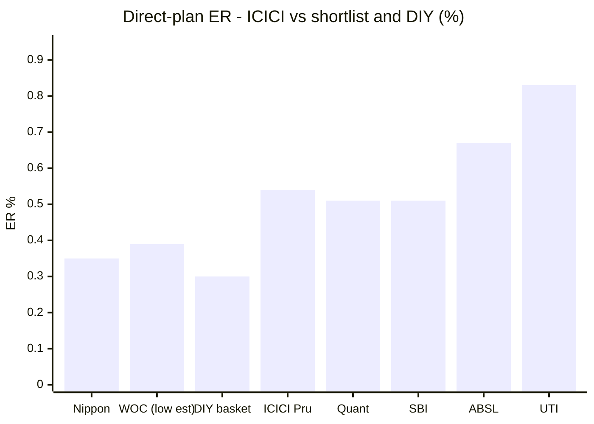
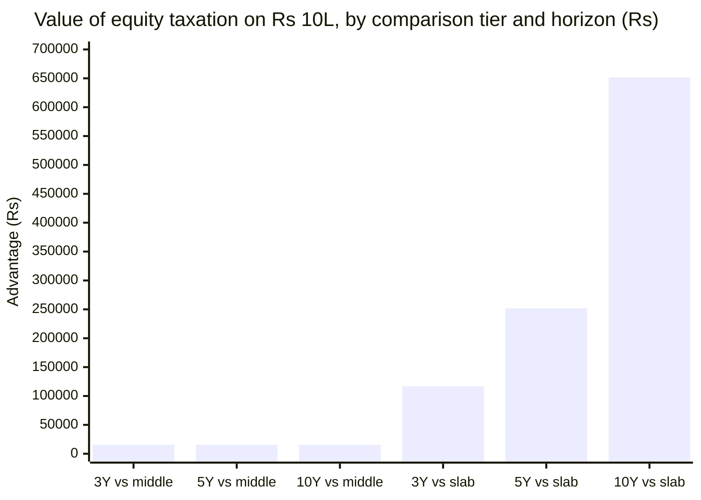
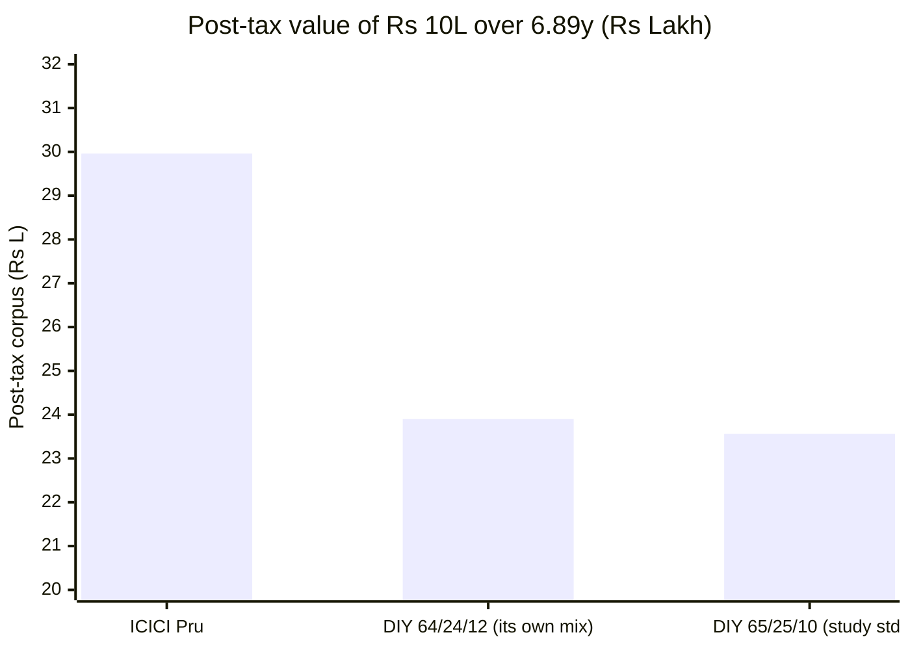
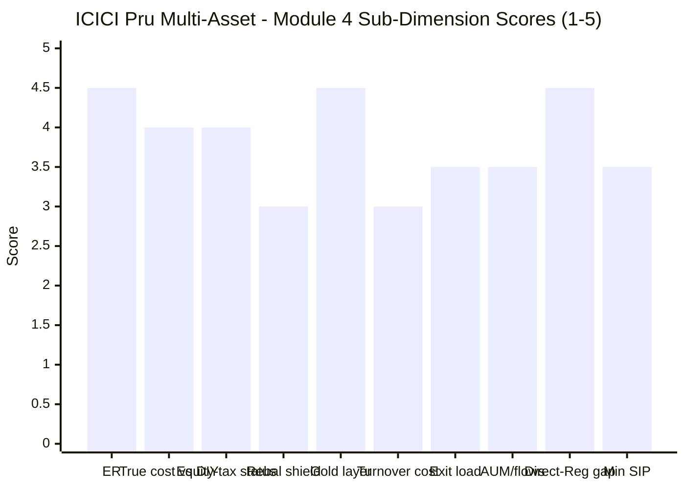

# Module 4: Cost & Tax Efficiency — ICICI Prudential Multi-Asset Fund

> **Provisional Module 4 score: ~3.8 / 5** (weight **20%**). **Scores are NOT comparable to the four equity categories.**

> **The one-line context:** on the surface this is the category's best cost-and-tax package — **0.54% Direct ER on an ₹84,991 Cr book**, the **narrowest Direct–Regular gap in the study (0.52pp)**, an **in-house gold ETF** with a negligible 0.05% layer, and **genuine equity taxation**: 12.5% LTCG after twelve months with the ₹1.25L exemption. Realised, it beat a DIY basket post-tax by **+₹6.39 lakh on ₹10 lakh** (+4.02pp/yr), the largest absolute margin in the study.
>
> **And this module produces two findings that cut against the category's own thesis, not just this fund's.** **First: equity taxation is worth almost nothing against the tier the peers actually occupy.** Because the LTCG *rate* is identical at 12.5%, ICICI's advantage over a middle-tier fund is a flat **₹15,625** — the ₹1.25L exemption — regardless of horizon. It is worth ₹6.52 lakh against *slab* taxation, but **no fund in this study is slab-taxed.** The "trump card" the framework built a scored dimension around is, in practice, a rounding error between the funds actually on the shortlist. **Second: the internal rebalancing shield is worth ~₹67,000 over ten years (+0.08pp/yr)** — real, but a fraction of what the category thesis implies, and it shelters an allocation engine that M1 and M3 showed contributes **−0.12%/yr**. **On pure fee-and-tax mechanics with equal gross returns, ICICI beats DIY by 0.08pp/yr — and loses by 0.25pp/yr once its 194% turnover is priced.** Every rupee of the realised edge came from the book.

---

## Fund Identity / Raw Data (per-metric source attribution)

| Attribute | Value | Source |
|---|---|---|
| **Expense Ratio (Direct)** | **0.54%** — *"Direct: 0.54% p.a."* | **Factsheet, verbatim** |
| Expense Ratio (Regular) | **1.06%** — *"Other: 1.06% p.a."* | **Factsheet, verbatim** |
| Cross-checks | VR **0.55%** · ⚠ **Tickertape 0.79% (stale-high)** | VR / Tickertape |
| **Direct–Regular gap** | **0.52pp — the narrowest in this study** | computed |
| **AUM** | **₹84,990.57 Cr closing (30-Jun-2026)**; monthly AAUM ₹84,523.15 Cr; ₹83,884 Cr (screening, Jul-2026) | **Factsheet** / Tickertape |
| Relative size | **4.4× the next-largest studied fund** (SBI ₹19,354 Cr) | computed |
| **Taxation status** | ✅ **EQUITY-ORIENTED — LTCG 12.5% after 12 months above a ₹1.25L annual exemption; STCG 20%** | ValueResearch |
| **Stated tax rationale** | *"The endeavour of the scheme would be to have 65% exposure to equity, **such that on redemption, the scheme will be treated as an equity fund thereby attracting equity taxation**"* | AMC commentary, verbatim (M3) |
| ⚠ Gross-equity buffer | **68.32% against a 65% requirement — 3.32pp**, while effective equity has fallen ~27pp in six years (M3) | Factsheet + M3 |
| **Exit load** | *"Upto 30% of units within 1 Year — **Nil**. More than 30% of units within 1 Year — **1%** of applicable NAV. After 1 Year — **Nil**"* → worst case **0.70%** on a full redemption inside 12 months | **Factsheet, verbatim** |
| **Portfolio turnover** | ⚠ **1.94× (194%) equity turnover — disclosed** | **Factsheet, verbatim** |
| Gold cost layer | **In-house ICICI Pru Gold ETF 9.77%** at ~0.5% TER ≈ **0.05% blended**; no external FoF | Factsheet (M3) |
| Min investment | **₹500** (plus multiples of ₹1), w.e.f. 15 Jun 2026 | **Factsheet, verbatim** |
| SEBI TER headroom | Hybrid slab ceiling ~1.75–2.0% blended at this AUM; Direct at 0.54% sits far inside | SEBI TER slabs |
| Estimated scheme revenue | **~₹745 Cr/yr** (≈₹161 Cr Direct + ≈₹586 Cr Regular, on a 35/65 plan split assumption) | computed → M6 |

---

## Cross-Source Verification

| Metric | Value(s) | Verdict |
|---|---|---|
| **Direct ER** | **Factsheet 0.54%** · VR 0.55% · ⚠ **Tickertape 0.79%** | ✅ **Resolved, unlike WOC.** The AMC's own factsheet and VR agree within 1bp. **Tickertape is stale-high by 25bp — the fifth time this study has caught it** (Nippon 0.43→0.27, SBI 0.74→0.51, Quant 1.16→0.51, WOC 0.67 vs 0.39, now ICICI 0.79 vs 0.54) |
| Regular ER | Factsheet **1.06%** | ✅ Primary source |
| **Taxation** | VR: **12.5% >12m, ₹1.25L exempt, 20% STCG** + AMC's stated 65% rationale | ✅ **Two-way agreement, and the AMC states the mechanism explicitly.** Higher confidence than any peer's tax determination |
| Exit load | Factsheet tiered structure | ✅ Primary source; more investor-friendly than a flat 1%/12m |
| **Turnover** | **1.94× — published** | ✅ **Disclosed.** WOC's SID explicitly declines to estimate its own |
| AUM | ₹84,991 Cr (factsheet) vs ₹83,884 Cr (screening, four weeks later) | ✅ Consistent; ~1.3% drift |

**Reliability: HIGH — the best cost/tax evidence base in the study.** Every material input comes from the AMC's own monthly factsheet: ER for both plans, exit-load tiers, turnover, minimum investment. **The one anomaly is Tickertape's ER, which is stale by 25bp** — and which, together with its Sharpe of 0.29, is what eliminated this fund at screening (M1 §8).

---

## 1. Expense Ratio — Cheap for Its Size, Second-Cheapest in the Study

| Fund | Direct ER | AUM (₹ Cr) | Rank |
|---|---|---|---|
| Nippon India Multi Asset | ~0.27–0.43% | 16,000 | 1st |
| WOC Multi Asset | ⚠ 0.39–0.67% (unresolved) | 7,107 | — |
| Quant Multi Asset | ~0.51% | 5,615 | 2nd |
| SBI Multi Asset | ~0.51% | 19,354 | 2nd |
| **ICICI Pru Multi-Asset** | **0.54%** *(verified)* | **84,991** | **4th** |
| ABSL Multi Asset | 0.67% | 6,989 | 6th |
| UTI Multi Asset | ~0.83% | 6,890 | 7th |
| *DIY basket (blended index)* | *~0.30%* | — | *counterfactual* |

**0.54% is 1.8× the DIY basket's blended cost — and it is charged on a fund 4.4× larger than any peer.** That size cuts both ways: it should have produced the *lowest* ER in the category through scale economics, and it has not — Nippon runs a fifth of the assets for roughly two-thirds the fee. **But 0.54% is verified, competitive, and materially cheaper than the 0.79% the screener carries.**

### 10-year SIP cost simulation (₹15,000/month, 11% gross)

| Plan / alternative | ER | 10Y corpus | vs DIY |
|---|---|---|---|
| DIY basket (blended index funds) | 0.30% | **₹32,27,455** | — |
| **ICICI Direct** | **0.54%** | **₹31,82,443** | **−₹45,012** |
| ICICI Direct *(at Tickertape's stale 0.79%)* | 0.79% | ₹31,36,362 | −₹91,092 |
| **ICICI Regular** | 1.06% | ₹30,87,503 | −₹1,39,952 |

**⭐ The Direct–Regular gap of 0.52pp is the narrowest in this study** (WOC 0.60–0.88pp, ABSL 0.83pp, Nippon ~1.0pp). A Regular-plan holder forfeits **₹94,940 over ten years** on a ₹15k SIP — real money, but roughly half what the equivalent decision costs at ABSL or WOC. **Still: always Direct.**

| Monthly SIP | ICICI Direct 10Y | vs DIY | vs Regular |
|---|---|---|---|
| ₹5,000 | ₹10,60,814 | −₹15,004 | +₹31,647 |
| ₹10,000 | ₹21,21,628 | −₹30,008 | +₹63,293 |
| **₹15,000** | **₹31,82,443** | **−₹45,012** | **+₹94,940** |
| ₹20,000 | ₹42,43,257 | −₹60,016 | +₹1,26,586 |
| ₹50,000 | ₹1,06,08,142 | −₹1,50,040 | +₹3,16,465 |

**SEBI TER headroom** is ample — the hybrid slab ceiling at ₹85,000 Cr AUM is roughly 1.75–2.0% blended, and Direct sits 120bp+ inside it. No cap pressure; ample room to cut further, which at this scale the AMC arguably should.

---

## 2. ⭐ Equity Taxation — Real, and Worth Far Less Than the Framework Assumes

**ICICI is equity-taxed. That status is genuine, AMC-stated and the best available. The question this module has to answer honestly is: what is it worth?**

| Horizon (₹10L, 30% slab) | Equity-taxed | vs **middle tier** | vs **slab** |
|---|---|---|---|
| 3Y (CAGR 15.53%) | ₹14,90,025 | **+₹15,625** | +₹1,17,011 |
| 5Y (CAGR 17.75%) | ₹21,21,283 | **+₹15,625** | +₹2,51,920 |
| 7Y (CAGR 18.60%) | ₹30,28,640 | **+₹15,625** | +₹4,45,835 |
| 10Y (CAGR 15.98%) | ₹39,92,645 | **+₹15,625** | **+₹6,51,857** |

**⭐ The finding, and it applies to the whole study rather than just this fund: against the middle tier, equity taxation is worth a flat ₹15,625 — the ₹1.25L exemption × 12.5% — and nothing more, at any horizon.** The LTCG *rate* is identical at 12.5% in both tiers. What equity status actually buys is (a) that one-time exemption and (b) a 12-month rather than 24-month qualifying window.

**Against *slab* taxation it is worth ₹6.52 lakh over ten years — enormous. But no fund in this study is slab-taxed.** SBI, Nippon, Quant, ABSL and WOC are all middle-tier; UTI and ICICI are equity. **So the "tax triad's trump card" separates the shortlist by roughly fifteen thousand rupees per ten lakh invested.**

**Two qualifications that keep this from being a dismissal:**
- **The 12-month window genuinely matters for anyone who might exit early.** A middle-tier fund sold at 18 months pays *slab* on the whole gain; ICICI pays 12.5%. On a ₹10L position with a ₹3L gain at a 30% bracket, that is a **₹56,000** difference. **Equity status is insurance against a short hold, not an edge over a long one.**
- **⚠ And the status is not structurally secure.** Gross equity is **68.32% against a 65% requirement — 3.32pp** — while M3 showed effective equity has fallen ~27 percentage points in six years and the arbitrage overlay is only −3.75%. **The engine's freedom to keep de-risking is bounded by this line**, and if it breaches, the fund drops to middle tier (a small loss) with a 24-month window (a larger one for early exits).

---

## 3. The Internal Rebalancing Shield — Modest, and It Shelters Trades That Do Not Pay

The category's second structural claim: the fund rebalances internally **tax-free**, while a DIY investor realises gains every year.

**Modelled over 10 years (₹10L, 11% gross to both, 30% slab, ICICI equity-taxed):**

| | Total tax over 10Y | Post-tax CAGR |
|---|---|---|
| DIY basket, 8% annual rebalancing turnover | **₹2,62,857** | 9.50% |
| **ICICI (single exit event)** | **₹1,95,882** | **9.58%** |
| **Shield value** | **₹66,975 ≈ +0.08pp/yr** | — |

**⚠ Two honest observations, and both temper the category thesis.**

1. **The shield is small.** ₹67,000 over a decade on ₹10 lakh is +0.08pp/yr — and WOC's equivalent figure was +0.17pp/yr. **Across the two funds where this has now been modelled properly, the internal-rebalancing shield is worth roughly 0.08–0.17 percentage points a year**, not the decisive advantage the framework's design implies. The reason is structural: the DIY investor's **₹1.25L annual exemption absorbs most of a modest rebalance**, and realising gains earlier steps up the cost basis, reducing the terminal bill.
2. **⚠ For ICICI specifically, the shield protects the wrong thing.** This fund has by far the largest internal turnover in the study — **194% equity turnover** plus an allocation dial that swung from 39% to 94% equity (M3). A DIY investor attempting to replicate that would realise gains constantly, so the *capability* the wrapper provides is genuinely valuable. **But M1 and M3 established that all that activity contributed −0.12%/yr.** The fund's structural advantage is the ability to trade heavily without tax friction — and on 6.9 years of evidence, the heavy trading has not paid. **A tax shield on unprofitable activity is not a benefit.**

---

## 4. ⭐ True Cost vs DIY — the Largest Realised Edge, and a Forward Coin-Flip

### 4a. Realised (₹10L lumpsum, Sep-2019 → Jul-2026, 6.89y, post-tax)

| | Pre-tax FV | Post-tax FV | **ICICI edge** |
|---|---|---|---|
| **ICICI Pru (equity-taxed)** | ₹32,62,958 | **₹29,95,713** | — |
| DIY 65/25/10 — study standard | ₹25,47,823 | ₹23,56,245 | **+₹6,39,468** |
| DIY 64/24/12 — ICICI's own effective mix | ₹25,83,243 | ₹23,89,650 | **+₹6,06,063** |

**Post-tax CAGR 17.27% vs DIY's 13.25% — an edge of +4.02pp/yr.** The DIY investor paid ₹1,92,710 in tax along the way; ICICI's holder paid ₹2,67,245 in one event but from a far larger pot.

### 4b. ⚠ The like-for-like test — and a study-level correction

**Re-running the identical post-tax calculation across two windows produces a result that contradicts an earlier conclusion in this study.**

| Fund | **Aug-2020 → Jul-2026 (5.91y, incl. 2022)** | **May-2023 → Jul-2026 (3.19y, all 7)** |
|---|---|---|
| Quant | **+₹14,88,126** | **+₹3,69,517** |
| **ICICI Pru** | **+₹7,11,730** 🥈 | +₹1,09,142 *(4th)* |
| Nippon | +₹3,21,833 | +₹2,22,287 |
| UTI | ⚠ **−₹1,061** | +₹1,24,119 |
| SBI | ⚠ **−₹18,914** | +₹91,068 |
| ABSL | *did not exist* | +₹1,06,573 |
| WOC | *did not exist* | +₹66,184 |

**⭐ Over the 5.91-year window that includes 2022, SBI and UTI both LOSE to the DIY basket post-tax.** WOC's Module 4 concluded that *"all six studied funds beat DIY over this window and WOC's absolute margin is the smallest."* **That was true of the 3.19-year window and is not true generally.** Over a longer window containing a real bear year, **only three of five cycle-tested funds beat do-it-yourself** — and the DIY basket is a materially harder benchmark than the young-fund comparison suggested. **This is a study-level correction flagged for the decision tree.**

**ICICI ranks 2nd of 5 over the long window and 4th of 7 over the short one** — consistent with the U-shape M1 and M2 both found.

### 4c. The forward model — the edge is the book, not the structure

Giving the fund **no credit** for alpha or risk reduction (identical 11% gross to both sides):

| | Post-tax 10Y CAGR | Corpus on ₹10L |
|---|---|---|
| DIY basket (0.30% ER, 8% annual rebalance) | 9.50% | ₹24,78,982 |
| **ICICI @ 0.54% + 0.05% gold layer** | **9.58%** | ₹24,96,174 |
| **ICICI + a plausible 0.35% turnover cost** | ⚠ **9.25%** | ₹24,22,559 |
| ICICI at Tickertape's stale 0.79% | 9.35% | ₹24,43,378 |

**True cost vs DIY = +0.08pp/yr in ICICI's favour on headline fees and tax — and −0.25pp/yr against it once the 194% turnover is priced.** In other words: **on structure alone this fund and a DIY basket are a dead heat, and the 194% turnover probably tips it the wrong way.** The realised +4.02pp/yr came entirely from the selection alpha M1 measured (+4.13%), not from cost or tax engineering.

---

## 5. Standard Cost Dimensions

| Dimension | Assessment | Score input |
|---|---|---|
| **Direct–Regular gap** | ⭐ **0.52pp — the narrowest in the study.** ₹94,940 forfeited over 10Y on a ₹15k SIP by a Regular holder — roughly half the equivalent penalty at ABSL (₹1.49L) or WOC (₹1.60L) | 4.5 |
| **SEBI TER buffer** | Ample — Direct at 0.54% sits 120bp+ inside the hybrid ceiling at this AUM. **At ₹85,000 Cr the AMC has both the room and the scale economics to cut further, and has not** | ✓ |
| **Exit load** | Tiered and reasonable: **30% of units free within 1 year, 1% on the rest, nil after 12 months** → worst case **0.70%** on a full early exit. More flexible than a flat 1%/12m; far less friendly than WOC's 1%/30-days | 3.5 |
| **ER glide** | ⚠ **Not verifiable** — no published ER history. The circumstantial evidence is unfavourable: **the largest fund in the category by 4.4× charges more than Nippon at a fifth the size**, so scale economics are not visibly reaching investors | 3.0 |
| **Turnover-adjusted true cost** | ⚠ **194% equity turnover — the highest disclosed in the study.** Implies a ~6-month average holding period. Modelled at 0.35%/yr it flips the DIY verdict from +0.08 to −0.25pp/yr. ✅ **At least it is published** — WOC's SID declines to estimate its own | 3.0 |
| **Flow-as-signal** | ✅ **Strong and stable.** ₹84,991 Cr (Jun-2026) vs ₹83,884 Cr (screening, four weeks later) — broadly flat, no redemption pressure. **Contrast WOC's −8.5% in six weeks against a rising NAV.** The market is not leaving this fund | 4.0 |
| **Gold cost layer (double-layer)** | ⭐ **In-house ICICI Pru Gold ETF (9.77%)** at ~0.5% TER ≈ **0.05% blended** — no external FoF, no rented vehicle. **WOC pays *this AMC* for exactly the same exposure** (M3/M4) | 4.5 |
| **AUM / capacity** | ✅ Genuinely liquid book (large-cap equity, in-house ETF, sovereign/AAA debt); REITs+InvITs only 1.22%. ⚠ **But size constrains the engine**: moving effective equity from 39% to 94% on ₹85,000 Cr means trading roughly ₹47,000 Cr. **The most dynamic engine in the study sits on the largest asset base — a tension M3 did not price** | 3.5 |
| **Min investment** | ₹500 (plus multiples of ₹1) — accessible; WOC's ₹100 SIP is better | 3.5 |
| **Fund revenue / AMC economics** | ~**₹745 Cr/yr** estimated (≈₹161 Cr Direct + ≈₹586 Cr Regular on a 35/65 split). **A very large franchise — this single scheme likely rivals some AMCs' entire revenue** → M6 | — |

---

## Comparison with Studied Funds

| Metric | **ICICI Pru** | Nippon | SBI | Quant | UTI | ABSL | WOC |
|---|---|---|---|---|---|---|---|
| Direct ER | **0.54%** *(verified)* | **~0.27–0.43%** | ~0.51% | ~0.51% | ~0.83% | 0.67% | ⚠ 0.39–0.67% |
| Regular ER / gap | **1.06% / 0.52pp** 🥇 | ~1.4% / 1.0 | ~1.5% / 0.8 | — | ~1.5% / 0.8 | 1.50% / 0.83 | 1.27% / 0.60–0.88 |
| **Tax status** | ✅ **EQUITY** | Middle | Middle | Middle | ✅ **EQUITY** | Middle | Middle |
| Value of equity status vs middle | **+₹15,625 flat** | — | — | — | +₹15,625 | — | — |
| Distance from 65% gross line | ⚠ **+3.32pp** | ~9pp below | ~18pp below | ~12pp below | above ✅ | straddles | 25pp below |
| Rebalancing shield | ~0.08pp/yr | meaningful | small | large | hollow | 0.12–0.20pp | ~0.17pp/yr |
| **Post-tax DIY edge (5.91y)** | **+₹7.12L** 🥈 | +₹3.22L | ⚠ **−₹18,914** | **+₹14.88L** | ⚠ **−₹1,061** | n/a | n/a |
| Post-tax DIY edge (3.19y) | +₹1.09L *(4th)* | +₹2.22L | +₹0.91L | +₹3.70L | +₹1.24L | +₹1.07L | +₹0.66L |
| Turnover | ⚠ **1.94× disclosed** | — | — | high | — | deferred | ❌ not disclosed |
| Gold cost layer | ⭐ **In-house 0.05%** | best in study | in-house | rented | in-house | in-house | ⚠ **rented** |
| Flow signal | ✅ Stable ₹85K Cr | strong | stable | — | stable | ✅ 4.4× since NFO | ⚠ **−8.5%/6wk** |
| **Module 4 score** | **~3.8** | **~4.1** | ~3.5 | ~3.5 | ~3.4 | ~3.3 | ~3.3 |

**The cross-read: ICICI takes second place behind Nippon, and the gap is fee, not structure.** ICICI has the better tax status (worth ₹15,625), a narrower Direct–Regular gap, an in-house gold vehicle and a far larger realised DIY edge — but Nippon charges roughly two-thirds the fee on a fifth of the assets, and that is the harder thing to fix. **ICICI's genuine cost weakness is that the category's largest fund by 4.4× has not passed scale economics through.**

---

## Points For / Points Against — Cost & Tax

### ✅ For
1. **⭐ Verified 0.54% Direct ER** — factsheet and ValueResearch agree to 1bp, and it is **25bp cheaper than the screener figure** that helped eliminate this fund.
2. **⭐ Narrowest Direct–Regular gap in the study (0.52pp)** — a Regular holder forfeits ₹94,940 over 10Y versus ₹1.49–1.60 lakh at ABSL and WOC.
3. **✅ Genuine equity taxation**, AMC-stated and unambiguous — 12.5% LTCG after **12 months** with the ₹1.25L exemption, versus a 24-month window for the five middle-tier peers.
4. **⭐ Largest realised post-tax DIY edge in the study: +₹6.39 lakh on ₹10 lakh (+4.02pp/yr)** over 6.89 years, and **+₹7.12 lakh (2nd of 5)** over the window containing 2022.
5. **⭐ In-house gold ETF at ~0.05% blended cost** — no rented vehicle, no external FoF. **WOC pays this very AMC for the same exposure.**
6. **Turnover is disclosed (1.94×)** — WOC's SID explicitly declines to estimate its own.
7. **Reasonable, tiered exit load** — 30% of units free within a year, worst case 0.70% on a full early exit, nil after 12 months.
8. **✅ Stable flow signal** — ₹84,991 Cr broadly flat over four weeks, with no redemption pressure; the contrast with WOC's −8.5% in six weeks is stark.
9. **Ample SEBI TER headroom** — 120bp+ inside the ceiling, so further cuts are entirely feasible.
10. **Capacity is not a constraint on the *portfolio*** — large-cap equity, in-house ETF and sovereign/AAA debt all scale; REITs and InvITs are only 1.22%.
11. **The best cost/tax evidence base in the study** — every material input comes from the AMC's own monthly factsheet.

### ❌ Against
1. **⚠ THE FINDING: equity taxation is worth ₹15,625 flat against the tier every peer occupies.** The LTCG rate is identical at 12.5%; only the ₹1.25L exemption and the 12-vs-24-month window differ. It is worth ₹6.52 lakh against *slab* — **but no fund in this study is slab-taxed.** The framework's "trump card" barely separates the shortlist.
2. **⚠ The rebalancing shield is worth ~₹67,000 over ten years (+0.08pp/yr)** — smaller than WOC's 0.17pp — and it **shelters an allocation engine that M1 and M3 measured at −0.12%/yr.** A tax shield on unprofitable activity is not a benefit.
3. **⚠ On forward mechanics ICICI and DIY are a dead heat** — +0.08pp/yr on headline fees and tax, and **−0.25pp/yr once the 194% turnover is priced.** The realised edge came entirely from selection alpha, not structure.
4. **⚠ 194% equity turnover** — the highest disclosed in the study, implying a ~6-month average holding period and real trading costs above the headline ER.
5. **⚠ No scale pass-through.** The category's largest fund by **4.4×** charges 0.54% while Nippon charges ~0.27–0.43% on a fifth of the assets. At ₹85,000 Cr the economics should produce the cheapest fund in the category, and do not.
6. **⚠ The equity-tax status is not structurally secure** — gross equity 68.32% against a 65% floor is a **3.32pp buffer**, while effective equity has fallen ~27pp in six years (M3). The tax line now constrains how defensive the engine may become.
7. **⚠ Size constrains the engine** — swinging effective equity from 39% to 94% on ₹85,000 Cr means moving roughly ₹47,000 Cr. **The most dynamic allocation engine in the study sits on the largest asset base**, a tension M3 did not price.
8. **⚠ No verifiable ER glide history** — the direction of travel cannot be established.
9. **Tickertape misreports the ER by 25bp** — the fifth such catch in this study, and part of what eliminated the fund at screening.
10. **Minimum investment ₹500** — accessible but behind WOC's ₹100 SIP.

---

## Module 4 Scorecard

| Sub-dimension | Weight | Score | Reasoning |
|---|---|---|---|
| **Expense Ratio (Direct)** *(High)* | 12% | **4.5** | ✅ **0.54% verified across two sources** — inside the guide's ≤0.60% top band, and cheap in absolute terms. Docked because the category's **largest fund by 4.4×** should be cheapest and is fourth, with **no visible scale pass-through** |
| **True cost vs DIY (all-in)** *(Critical)* | 22% | **4.0** | ⭐ **Largest realised edge in the study: +₹6.39L on ₹10L (+4.02pp/yr)**, and 2nd of 5 over the window containing 2022. ⚠ Docked two levels because on **forward mechanics it is a dead heat** (+0.08pp/yr, −0.25pp once turnover is priced) and **4th of 7 over the recent window** — the edge is the book, not the structure |
| **Equity-taxation status** *(Critical)* | 20% | **4.0** | ✅ **Genuine equity taxation, AMC-stated** — the best available status, and the 12-month window is real insurance against an early exit. ⚠ Held well off 5.0 because the guide requires *"structurally stable ≥65%"* and the buffer is **3.32pp and narrowing**, and because the advantage over the tier every peer occupies is a flat **₹15,625** |
| **Rebalancing tax-shield** *(High)* | 14% | **3.0** | ⚠ **~₹67,000 over 10Y (+0.08pp/yr)** — smaller than WOC's 0.17pp, because the DIY investor's ₹1.25L exemption absorbs most of a modest rebalance. **And it shelters activity that contributed −0.12%/yr.** Real but minor, and pointed at the wrong thing |
| Gold/commodity cost layer | 8% | **4.5** | ⭐ **In-house ICICI Pru Gold ETF at ~0.05% blended** — the best structure available, no external wrapper. WOC pays this AMC for the identical exposure |
| **Turnover-adjusted true cost** | 8% | **3.0** | ⚠ **1.94× (194%) — the highest disclosed in the study**, implying a ~6-month equity holding period; at 0.35%/yr it flips the DIY verdict negative. ✅ Lifted from 2.5 because it is **published** — WOC's is not |
| Exit load | 4% | **3.5** | Tiered and reasonable — 30% of units free within a year, 0.70% worst case on a full early exit, nil after 12 months. Behind WOC's 1%/30-days |
| AUM trajectory / capacity | 6% | **3.5** | ✅ Stable ₹84,991 Cr, no redemption pressure, genuinely liquid book. ⚠ Docked because **size constrains the engine** — a 39→94% equity swing on ₹85,000 Cr is ~₹47,000 Cr of trading |
| Direct-vs-Regular gap | 4% | **4.5** | ⭐ **0.52pp — narrowest in the study**; ₹94,940 forfeited over 10Y versus ₹1.49–1.60 lakh at peers |
| Min investment accessibility | 2% | **3.5** | ₹500 lumpsum — accessible; behind WOC's ₹100 SIP |
| ER glide / SEBI buffer / revenue | *informational* | — | No published glide history; 120bp+ TER headroom; ~₹745 Cr/yr estimated scheme revenue → M6 |
| **Module 4 Overall** | **100%** | **~3.8 / 5** | **The best-evidenced cost/tax package in the study — a verified 0.54% ER, the narrowest Direct–Regular gap, genuine equity taxation, an in-house gold vehicle and the largest realised DIY win — undercut by two findings that cut at the category's own thesis: equity status is worth ₹15,625 against the peers' tier, and the rebalancing shield is worth 0.08pp/yr and protects an engine that returns nothing.** Not comparable to equity-category Module 4 scores |

---

## Comparative Module 4 Scores (studied funds — calibration only)

| Fund | Module 4 | Cost/tax character |
|---|---|---|
| Nippon Multi Asset | ~4.1 / 5 | Cheapest **verified** ER; wide post-tax DIY win; not equity-taxed |
| **ICICI Pru Multi-Asset** | **~3.8 / 5** | **Verified 0.54%, narrowest Direct–Regular gap, genuine equity tax, in-house gold, largest realised DIY win — no scale pass-through, 194% turnover, a forward dead heat** |
| SBI Multi Asset | ~3.5 / 5 | Cost-competitive; not equity-taxed; ⚠ **loses to DIY over the 5.91y window** |
| Quant Multi Asset | ~3.5 / 5 | 0.51% ER; by far the largest DIY edge |
| UTI Multi Asset | ~3.4 / 5 | The other equity-taxed fund — but dearest ER, and ⚠ **also loses to DIY over 5.91y** |
| ABSL Multi Asset | ~3.3 / 5 | Fair verified ER, decent shield — middle-tier tax, small DIY edge |
| WOC Multi Asset | ~3.3 / 5 | Possibly cheapest but unprovable; best risk-adjusted DIY edge, smallest absolute |

> Module 4 is 20% here and carries the tax triad. **ICICI places second, behind Nippon on fee alone.** The more useful output of this module is not the ranking but the two corrections it forces on the framework: **equity taxation separates this shortlist by ₹15,625, and the internal rebalancing shield is worth under 0.2pp/yr.** Both legs of the "tax triad" are far weaker in practice than the study plan assumed — which means **the fund-vs-DIY question is decided almost entirely by whether a manager can actually generate alpha**, not by structural tax advantages. **That is the single most important input the decision tree will take from this module.**

---

## SIP Implication

For a ₹15–20k/month SIP, ICICI's cost and tax package is the most solid in the study on the things that can be verified. **The expense ratio is 0.54%, confirmed by the AMC's own factsheet and ValueResearch** — 25 basis points cheaper than the screener figure that helped eliminate this fund. The Direct–Regular gap of 0.52 percentage points is the narrowest here, so the cost of a distributor mistake is roughly half what it would be at ABSL or WOC (though at ₹94,940 over ten years it still matters more than most fund-selection decisions). The gold is held through the AMC's own ETF at a negligible 0.05% layer — while WhiteOak, notably, **pays this AMC** for exactly the same exposure. And the fund is genuinely equity-taxed, so gains qualify for 12.5% treatment after twelve months rather than twenty-four.

**But this module's most useful work is undoing two assumptions the framework was built on.** The study plan treats equity taxation as the category's trump card. **Measured, it is worth a flat ₹15,625 per ₹10 lakh against the middle tier that five of the seven studied funds occupy** — because the long-term rate is 12.5% either way. It is worth ₹6.5 lakh against slab taxation, but nothing on this shortlist is slab-taxed. Likewise the internal rebalancing shield: modelled properly it is **₹67,000 over a decade, about 0.08 percentage points a year** — and for this fund in particular it shelters an allocation engine that Modules 1 and 3 both measured at **minus twelve basis points a year.** A tax shield on activity that does not pay is not an advantage.

**What follows for the sizing decision is simple and slightly deflating.** Strip out the structural claims and, on identical gross returns, **ICICI and a do-it-yourself basket are a dead heat — the fund wins by 0.08pp/yr on fees and tax and loses by 0.25pp/yr once its 194% turnover is priced.** Every rupee of the realised +4.02pp/yr edge came from the manager's security selection. **That is a perfectly good reason to buy the fund — it is simply a different reason than the category advertises.** The corollary matters too: since the structural advantages are near-zero, **a multi-asset fund is worth paying for only if you believe its manager can pick securities**, and the moment that alpha fades the fund becomes a more expensive, less transparent version of three index products. Two things are worth watching on that basis: the **3.32-percentage-point gross-equity buffer**, which now limits how defensive the fund may become without forfeiting its tax status, and the fact that the **largest fund in the category by 4.4× has not passed its scale economics through to investors.**

## One-Line Verdict

**A verified 0.54% expense ratio, the narrowest Direct–Regular gap in the study, genuine equity taxation and an in-house gold ETF, producing the largest realised post-tax win over do-it-yourself of any fund here — wrapped around two findings that deflate the category's own thesis: equity taxation is worth a flat ₹15,625 against the tier every peer occupies, the internal rebalancing shield is worth eight basis points a year and shelters an allocation engine that returns minus twelve, and on identical gross returns the fund and a DIY basket are a dead heat that 194% turnover tips the wrong way.**

---

*Module 4 complete. Provisional score 3.8/5. **Method:** expense ratios (Direct 0.54%, Regular 1.06%), exit-load tiers, portfolio turnover (1.94×), AUM and minimum investment taken **verbatim from the ICICI Prudential Multi-Asset Fund monthly factsheet (30-Jun-2026)**; taxation from ValueResearch plus the AMC's stated 65%-equity rationale (M3). Post-tax models self-computed from MFAPI **120334** with full cost-basis tracking through each annual DIY rebalance at a 30% slab (31.2% with cess), ICICI taxed as **equity-oriented** (12.5% LTCG >12m, ₹1.25L exemption); DIY legs taxed by their own regimes. DIY baskets built from Motilal Oswal Nifty 500 Index (**147625**), HDFC Short Term Debt (**119016**) and SBI Gold (**119788**). **Like-for-like post-tax DIY edge re-computed over two windows** — Aug-2020 → Jul-2026 (5.91y) and May-2023 → Jul-2026 (3.19y) — for SBI (119843), Nippon (148457), Quant (120821), UTI (120760), WOC (151745), ABSL (151307). 10Y forward model assumes identical 11% gross to fund and DIY, 8% annual DIY rebalancing turnover, and includes the in-house gold-ETF layer (~0.05%).*

*⚠ **STUDY-LEVEL CORRECTION — WOC's Module 4 conclusion does not generalise.** WOC's M4 stated that *"all six studied funds beat DIY over this window"* and ranked WOC's margin smallest. **That was a property of the 3.19-year window, not of the funds.** Over **Aug-2020 → Jul-2026 (5.91y, including 2022), SBI loses to the DIY basket by ₹18,914 and UTI by ₹1,061** — only three of five cycle-tested funds beat do-it-yourself. **The DIY counterfactual is materially harder than the short-window comparison implied**, and the decision tree should use the longer window. No score changes to WOC's M4 (its own arithmetic was correct for its window), but its generalisation is withdrawn.*

*⚠ **TWO FRAMEWORK-LEVEL FINDINGS for the decision tree.** **(1) Equity-tax status separates this shortlist by ₹15,625 per ₹10L, flat, at any horizon** — the LTCG rate is 12.5% in both the equity and middle tiers. It is decisive only against *slab* taxation (₹6.52L over 10Y), which no studied fund faces. The study plan's framing of equity taxation as the category's structural trump card **overstates it by a wide margin** for a long-horizon investor; its real value is insurance against an exit inside 24 months. **(2) The internal rebalancing shield is worth 0.08–0.17pp/yr** across the two funds where it has now been modelled with full basis tracking — not the decisive edge the framework assumed. **Together these mean the fund-vs-DIY question is decided by manager alpha, not by structure.***

*⚠ **M1 reasoning corrected, score unchanged.** M1 scored "post-tax return" **5.0** and described equity taxation as *"the category's trump card."* **The status is real and the score stands — ICICI's post-tax return of 17.27% is the highest in the study** — **but the framing was wrong**: the 5.0 is earned by the *return*, not by the tax status, which is worth ₹15,625 against the peers' tier. M1's Points-For item 4 should be read with that correction.*

***Cross-module handoffs:*** *the **~₹745 Cr/yr estimated scheme revenue**, the **absence of scale pass-through at 4.4× the next-largest fund**, and the **stable flow signal** → **M6 (AMC economics and investor-first behaviour)**; **whether the 194% turnover is Naren's deliberate style or drift, and who bears its cost** → **M5**; the **3.32pp gross-equity buffer as a binding constraint on the allocation engine** → **decision tree (review trigger)**.* Running scorecard: **M1 ~4.3 · M2 ~3.4 · M3 ~3.9 · M4 ~3.8** (weighted ≈ 3.82 across 85% of the framework).*

*Next: [Module 5 — Fund Manager / Team Quality](module5_manager.md)*
