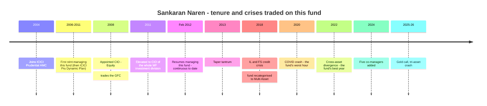
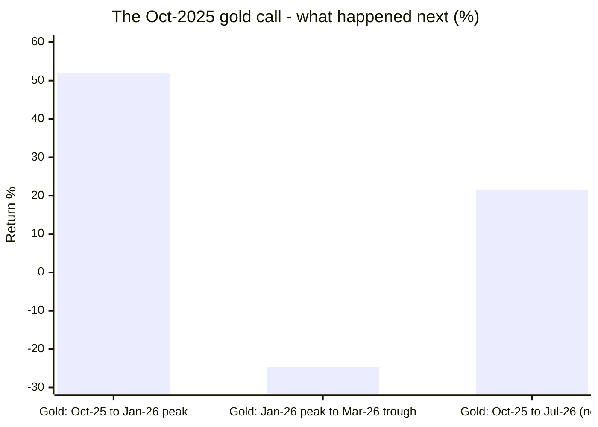
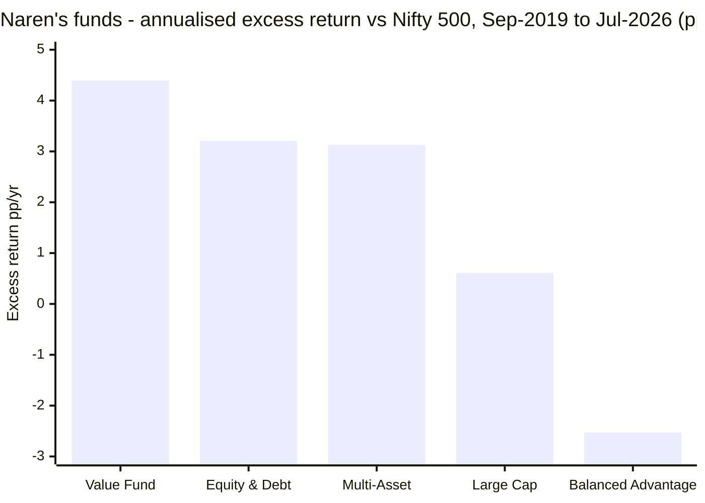
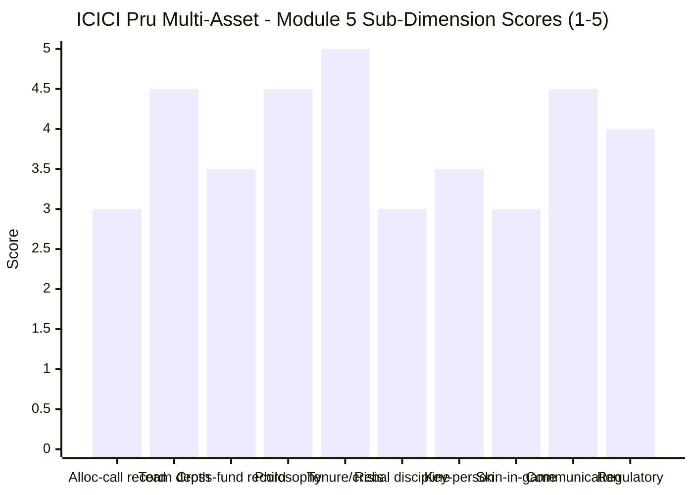

# Module 5: Fund Manager / Team Quality — ICICI Prudential Multi-Asset Fund

> **Provisional Module 5 score: ~3.8 / 5** (weight **10%** in the multi-asset re-weight — lower than the equity studies' 15%, because allocation here is more model/mandate-driven than single-manager stock-picking). **Scores are NOT comparable to the four equity categories.**

> **The one-line context:** on credentials this is the strongest manager module in the study and it is not close. **Sankaran Naren has managed this fund since February 2012 — the entire Direct-plan record, 100% attribution — with 36 years of experience, as Executive Director and CIO of ICICI Prudential AMC since 2011.** He is India's most publicly documented contrarian value investor, with a philosophy articulated over two decades (*"you have to do contrarian with a calculator"*) that — **unlike WhiteOak's explicitly anti-macro house view — actually fits the product he is running.** The team is **eight named managers with genuinely distinct roles**, including a **dedicated ETCD/commodity manager (Gaurav Chikane, since Aug-2021)** and a **dedicated overseas-and-derivatives manager (Sharmila D'Silva)** — capabilities WhiteOak lacks entirely.
>
> **And then two tests that this module ran specifically to avoid flattering him, both of which he fails.** **First: his most recent documented allocation call is wrong so far.** On 28 October 2025 Naren publicly warned that gold and silver were dangerous — *"when an asset class has done extremely well, be very careful"* — and the portfolio acted on it, cutting gold from 14.0% to 9.3% within a quarter. **Gold then rose 51.85% to its January-2026 peak before falling 24.71%, and remains +21.41% above the level at which he warned.** The call was directionally vindicated and financially costly. **Second, and more damaging: Naren's purest allocation product — ICICI Prudential Balanced Advantage — has underperformed a plain Nifty 500 index by 2.53 percentage points a year over 6.9 years**, while his *selection* products (Value Fund +4.39pp, Equity & Debt +3.21pp) beat it comfortably. **That is the identical pattern found at WhiteOak, at a different AMC, with a different manager and a different model.**

---

## Fund Identity / Raw Data — the Team (per-metric source attribution)

| Manager | Role | On this fund since | Experience | Schemes managed |
|---|---|---|---|---|
| **Sankaran Naren** | **Lead — ED & CIO, ICICI Prudential AMC** | **Sep 2006 – Feb 2011, and again since Feb 2012** | **36 years** | Multi-Asset, Value Fund, Balanced Advantage, Equity & Debt + others |
| Manish Banthia | Fixed income | Jan 2024 *(w.e.f. 22 Jan 2024)* | 21 years | ICICI's debt franchise (large book) |
| Akhil Kakkar | Credit / fixed income | Jan 2024 *(w.e.f. 22 Jan 2024)* | 19 years | — |
| Antariksha Banerjee | Equity | Jun 2024 *(w.e.f. 22 Jan 2024)* | 15 years | — |
| **Gaurav Chikane** | ⭐ **For ETCDs (exchange-traded commodity derivatives)** | **Aug 2021** | 12 years | ICICI's gold/silver ETFs |
| Ms Sri Sharma | Equity | Apr 2021 | 9 years | — |
| **Sharmila D'Silva** | ⭐ **Overseas investments & derivative transactions** | May 2024 *(w.e.f. 13 May 2024)* | 15 years | — |
| Ms Masoomi Jhurmarvala | — | Nov 2024 *(w.e.f. 4 Nov 2024)* | 10 years | — |

*All names, roles, dates and experience taken **verbatim from the ICICI Prudential Multi-Asset Fund factsheet (30-Jun-2026)**.*

| Attribute | Value | Source |
|---|---|---|
| **Record attribution** | ⭐ **100%** — Naren has run the fund continuously since Feb-2012; the Direct plan began Jan-2013 | Factsheet + MFAPI |
| Naren's AMC role | **Executive Director & Chief Investment Officer**; joined Oct-2004, CIO-Equity 2008, CIO of the whole MF investment division from 2011 | IIT-Madras / CFA Institute / AMC |
| **Philosophy** | **Disciplined contrarian value.** *"You have to do contrarian with a calculator."* Framework built on Graham & Dodd → Buffett, evolved with Howard Marks, James Montier, Michael Mauboussin | Morningstar India, published interviews |
| Documented historical calls | 2007 exited infrastructure into consumer/tech/pharma · 2012 IT + launched a US fund · 2014 gilts, long duration, PSU equity, utilities, metals | Morningstar India |
| **Most recent public call** | ⚠ **28 Oct 2025 — warned gold and silver were "the most dangerous bets ahead"** | Business Today, dated |
| Manager departures from this fund | **None** since 2012 | Factsheet |
| ⚠ Team additions | **Five of the eight added during 2024** (Banthia, Kakkar, Banerjee, D'Silva, Jhurmarvala) | Factsheet |
| Skin in the game | SEBI-mandated: key personnel invest **20% of salary**, **3-year lock-in**. No enhanced disclosure found | SEBI norms |
| Regulatory record (personal) | **No SEBI action found** against Naren or any named manager on this fund | SEBI filings search |

---

## Cross-Source Verification

| Item | Sources | Verdict |
|---|---|---|
| Manager roles & dates | **Factsheet (primary)** vs ValueResearch (lists seven names, no tenures) | ✅ **Factsheet authoritative and far more granular** — it alone discloses Chikane's ETCD role and D'Silva's overseas/derivatives mandate |
| Naren's tenure | Factsheet: *"Sep 2006 to Feb 2011 and has been managing this fund since Feb 2012"* | ✅ Primary source; **covers 100% of the Direct-plan NAV history** |
| **The Oct-2025 gold call** | Business Today (28 Oct 2025, dated and quoted) vs **M3's reconstructed gold weight path** vs **MFAPI gold prices** | ✅ **Triangulated three ways — a rare opportunity to test a public call against portfolio action and outcome** |
| Cross-fund record | Self-computed from MFAPI for all four funds Naren manages | ✅ Independent of AMC marketing |
| Philosophy | Morningstar India, CFA Institute, published interviews spanning 2017–2025 | ✅ Consistently articulated over a decade |

**Reliability: HIGH.** This is the only fund in the study where a manager's **dated public statement** can be checked against a **reconstructed portfolio action** and a **measurable outcome**. It is also the only one with 100% record attribution across 13.6 years.

---

## 1. ⭐ Tenure, Credentials and Crisis Experience — Unmatched in This Study

| Test | ICICI Pru | Best peer |
|---|---|---|
| **Record attribution** | ⭐ **100% — Naren since Feb-2012** | ABSL 100% (3.5y only) |
| **Years of experience** | ⭐ **36** | WOC's Mantri 20 |
| **Crises traded on this mandate** | ⭐ **2013, 2018, 2020, 2022, 2024–25, 2026** | SBI (2020, 2022) |
| Seniority | **ED & CIO of the AMC** | WOC's Mantri (CIO) |
| Departures | **None since 2012** | WOC none; **Nippon lost its architect** |

**No other fund in this study has its entire measurable record attributable to one continuously-serving manager.** M1's 13.6-year consistency credential (883 rolling ten-year windows, none negative) and M2's 2022 result are *Naren's*, not a predecessor's. Where SBI's and UTI's headline records were substantially earned by people no longer running the funds, and Nippon's architect left outright, **ICICI's record and its manager are the same thing.**

---

## 2. ⭐ Philosophy — the Clearest in the Study, and It Actually Fits the Product

| Source | Statement |
|---|---|
| **Naren's stated method** | *"You have to do **contrarian with a calculator**"* — contrarian bets must still pass quantitative and risk checks |
| Intellectual lineage | Graham & Dodd → Buffett, evolved through **Howard Marks, James Montier, Michael Mauboussin** |
| Operating rule | *"Identify a theme, neglected sector or stock before anyone else does and hold it till it comes into the limelight"* |
| Scheme-level rule (M3) | *"Counter-cyclical approach to maintain a minimum of 10% exposure to three asset classes"* |

**⭐ The critical contrast with WhiteOak.** WOC's Module 5 found a house whose SID says *"avoid focusing on macro events"* and whose CIO says *"we are not macro or thematic investors making top-down bets"* — **running a top-down macro allocation product.** ICICI is the opposite: **a career contrarian who explicitly buys what is cheap and unloved is philosophically the right person to run a counter-cyclical multi-asset mandate.** The philosophy and the product are aligned, articulated publicly for over a decade, and testable.

**And it is testable in both directions.** Naren's documented calls — exiting infrastructure into consumer/tech/pharma in 2007, buying IT and launching a US fund in 2012, going into gilts, PSU equity and metals in 2014 — are a real, checkable record. **His 2022 call on this fund (equity cut from 69.2% to 52.6%, gold rebuilt to 10.8%, producing +17.61% — M2/M3) is exactly what the philosophy predicts.**

---

## 3. ⚠ The October-2025 Gold Call — Directionally Right, Financially Wrong

**This module found a rare opportunity: a dated public call, a verifiable portfolio action, and a measurable outcome.** It is reported here in full because the naive reading is flattering and the honest one is not.

| Step | Evidence |
|---|---|
| **The call** | 28 Oct 2025 — Naren publicly warns gold and silver are *"the most dangerous bets ahead"*; *"when an asset class has done extremely well, be very careful"* |
| **The action** | Fund's gold weight (M3 reconstruction): **14.0% (Sep-2025) → 9.3% (Dec-2025) → 8.0% (Mar-2026)** — a ~6pp cut inside two quarters |
| **What gold did next** | ⚠ **+51.85% from the warning to the January-2026 peak**, then **−24.71%** to the March trough |
| **Net position today** | ⚠ **Gold is still +21.41% above the level at which Naren warned** |
| **Fund outcome over the same span** | ICICI **+2.43%** vs Nifty 500 −0.85% |

**Verdict: the call was directionally vindicated and financially costly — so far.** Gold did eventually fall hard, which is what he warned about. But it rose more than half again *first*, and the fund cut its holding into that rise. **On the evidence to date, acting on the call has cost the fund more than it saved**, and this is the third consecutive piece of evidence pointing the same way: **M1 measured allocation at −0.12%/yr, M3 found the 2020 positioning to be the worst in the study and the March-2025 equity cut to be selling the bottom, and now the most recent documented call is under water.**

**In fairness, two things.** The warning was about *risk*, not price — and gold's −24.71% drawdown was precisely the risk described. And a contrarian who sells into strength will always look early; that is the method working as designed. **But a method that is repeatedly early is a method that repeatedly costs money, and this module has to score outcomes rather than intentions.**

---

## 4. ⭐ Cross-Fund Record — Selection Works, Allocation Does Not (the study's most important replication)

**The test WOC's Module 5 introduced, applied to a completely different AMC and manager.**

| ICICI fund | Type | CAGR | vs Nifty 500 | **Excess** | Vol | Sharpe |
|---|---|---|---|---|---|---|
| **Value Fund** (ex-Value Discovery) | **SELECTION** | 20.00% | 15.61% | **+4.39pp** | 15.25% | 0.89 |
| **Equity & Debt** (Aggressive Hybrid) | Hybrid | 18.82% | 15.61% | **+3.21pp** | 13.29% | 0.93 |
| **Multi-Asset** (this fund) | Allocation | 18.74% | 15.61% | **+3.13pp** | 12.26% | **1.00** |
| Large Cap (ex-Bluechip) | Selection | 16.22% | 15.61% | +0.61pp | 16.79% | 0.58 |
| **⚠ Balanced Advantage** | **PURE ALLOCATION** | **13.08%** | 15.61% | ⚠ **−2.53pp** | 10.05% | 0.65 |

**⭐ THE FINDING, AND IT IS A STUDY-LEVEL ONE: ICICI Prudential Balanced Advantage — the purest expression of tactical asset allocation in the AMC's range, run by the same CIO on the same valuation framework — has underperformed a plain Nifty 500 index fund by 2.53 percentage points a year over 6.9 years.**

**This replicates WhiteOak exactly.** WOC's Module 5 found that of seven testable WhiteOak funds, the five *selection* funds beat their benchmarks by +2.52 to +7.90pp and **the only two that failed were the two allocation products** — including WhiteOak Balanced Advantage at −0.91pp. **Now the same pattern appears at India's largest and most experienced multi-asset franchise, under a manager with 36 years of experience and an entirely different model.**

Add M2's cousin table, where **HDFC Balanced Advantage** posted a Sharpe of 0.72 against Parag Parikh FlexiCap's 1.01, and there are now **three Balanced Advantage funds from three AMCs failing the same test**, alongside **seven of seven multi-asset funds showing no allocation alpha.**

**The honest conclusion this module is obliged to record: tactical asset allocation, as practised in Indian mutual funds, has not demonstrably added value — and the evidence now spans multiple AMCs, multiple managers, multiple models and multiple product categories.** ICICI's Multi-Asset fund performs well *despite* this, on the strength of Naren's selection (+4.13%/yr, M1) — the same conclusion WOC reached about WhiteOak.

---

## 5. Team Depth & Structure — the Deepest and Most Specialised in the Study

| Study-plan requirement | ICICI Pru | Best peer |
|---|---|---|
| "Single-manager multi-asset is a key-person red flag" | ✅ **Eight managers** | WOC 5 · ABSL 3 · **Quant 1** |
| "Who runs debt?" | ✅ **Manish Banthia (21y) + Akhil Kakkar (19y)** — ICICI's fixed-income franchise | WOC's Baranwal (18y) |
| **"Who runs gold?"** | ⭐ **Gaurav Chikane, explicitly "for ETCDs", since Aug-2021** — also manages ICICI's gold/silver ETFs | ABSL's Wankhede; ❌ **WOC has nobody** |
| Derivatives / overseas | ⭐ **Sharmila D'Silva, explicitly for overseas investments and derivative transactions** | none |
| Departures | ✅ **None since 2012** | Nippon ❌ architect left |

**This is the only fund in the study that names a manager for every sleeve it actually holds** — equity, debt, credit, commodities and derivatives/overseas. WhiteOak, holding 27% notional metals, names no commodity manager at all (WOC M5). **The capability matches the portfolio.**

**⚠ Two caveats.** **Five of the eight were added during 2024** — Banthia and Kakkar in January, Banerjee in June, D'Silva in May, Jhurmarvala in November. That is a substantial one-year expansion, and it admits two readings: **deliberate succession-building and specialisation** (the benign and more likely one, given the roles are genuinely distinct), or **Naren beginning to step back** from day-to-day management of a fund that has grown to ₹85,000 Cr. **The AMC has not explained it publicly**, and an investor buying this fund for Naren should watch it.

**⚠ And the key-person concentration is the largest in the study by a different measure than WhiteOak's.** WOC's CIO is named on 18 schemes; **Naren is Executive Director and CIO of an AMC managing well over ₹10 lakh crore**, *and* the named lead on this fund plus Value, Balanced Advantage and Equity & Debt. His departure would be a market event, not merely a fund event. The eight-manager bench and the 2024 build-out are genuine mitigants — but the philosophy that drives this fund is his.

---

## 6. Governance Signals — Communication, Skin in the Game, Regulatory Record

| Signal | Assessment |
|---|---|
| **Investor communication** | ⭐ **The best in the study, and by a distance.** Naren gives regular, substantive, *dated* public interviews with specific positional views — which is precisely why §3's gold call could be tested at all. The monthly factsheet is the most complete disclosure any fund in this study produces (net-vs-gross equity, modified duration, YTM, rating profile, turnover, beta, full benchmark change history). **An investor can actually know what this fund is doing and why** |
| **⚠ Communication risk** | The flip side: a CIO who makes public directional calls creates a **verifiable record of being wrong**, as §3 shows. That is a feature of transparency, not a defect of it — but it means the fund's process is exposed in a way silent competitors' are not |
| **Skin in the game** | ⚠ Meets the SEBI standard (20% of key-personnel salary, 3-year lock-in), nothing additional disclosed. ICICI Prudential AMC is a bank-and-foreign-JV structure, so there is no founder-capital alignment of the WhiteOak/Quant kind |
| **Regulatory record (personal)** | ✅ **No SEBI action found** against Naren or any named manager on this fund. Contrast Quant, whose CIO settled a front-running case |
| **Investor-base character** | ⚠ **₹84,991 Cr — 4.4× the next-largest studied fund**, and heavily distributor-sold (Regular plan is ~1.06% ER). A large, partly-advised retail base is less likely to redeem in panic, but it also means the fund's flows are not a clean quality signal |
| Two-layer manager structure | ✅ **N/A** — no sub-advised or feeder sleeve; the gold ETF is in-house and managed by Chikane, the same person running the ETCD book |
| Manager accessibility | ✅ **N/A as a problem** — Naren is among the most accessible CIOs in Indian asset management |

---

## Comparison with Studied Funds

| Dimension | **ICICI Pru** | WOC | ABSL | SBI | Nippon | UTI | Quant |
|---|---|---|---|---|---|---|---|
| Named managers | ⭐ **8** | 5 | 3 | 2–3 | 3 | 3 | **1** |
| **Record attribution** | ⭐ **100% / 13.6y** | 100% / 3.2y | 100% / 3.5y | ~35% | ❌ architect left | ~35% | founder |
| Lead's experience | ⭐ **36y, ED & CIO** | 20y, CIO | sector specialist | strong | strong | quant | founder |
| **Commodity lead** | ⭐ **Yes — Chikane (ETCDs)** | ❌ **None** | ✅ Wankhede | ❌ | ✅ best | ❌ | ❌ |
| Derivatives/overseas lead | ⭐ **Yes — D'Silva** | ❌ | ❌ | ❌ | ❌ | ❌ | ❌ |
| **Philosophy** | ⭐ **Clearest — and fits the product** | Clearest — **but anti-macro** | ❌ none published | moderate | moderate | refuted | VLRT |
| **Allocation-call record** | ⚠ **4 right / 1 wrong / 2 mixed; latest call under water** | ❌ no calls made | ✅ all correct (thin) | none | active | ❌ worst in study | mixed |
| **Own Balanced Advantage fund** | ⚠ **−2.53pp vs Nifty 500** | ⚠ **−0.91pp** | — | — | — | — | — |
| Crises traded on mandate | ⭐ **2013, 2018, 2020, 2022, 2026** | 2026 only | 2026 only | 2020, 2022 | 2022 | 2020, 2022 | 2020, 2022 |
| Key-person risk | ⚠ **AMC-wide CIO** | ⚠ CIO on 18 schemes | low | low | ⚠ transition | low | ❌ **total** |
| Regulatory record | ✅ Clean | ✅ Clean | ✅ Clean | ✅ | ✅ | ✅ | ❌ **probe** |
| **Module 5 score** | **~3.8** | ~3.0 | ~3.2 | ~3.2 | ~3.0 | ~2.8 | ~2.4 |

**The cross-read: ICICI wins this module by 0.6 points — the widest margin in any Module 5 in the study.** It has the deepest and most properly-specialised team, the only 100% attribution across a multi-cycle record, the most experienced lead by 16 years, the clearest philosophy *that actually matches the mandate*, a named manager for every sleeve, and the best communication. **It is held below 4.0 by the one thing the category grades hardest: the allocation calls themselves are mixed, the most recent documented one is losing money, and the manager's own purest allocation product underperforms an index.**

---

## Points For / Points Against — Manager & Team

### ✅ For
1. **⭐ 100% record attribution across 13.6 years** — Naren has managed continuously since Feb-2012, so M1's consistency credential and M2's 2022 result are demonstrably *his*.
2. **⭐ 36 years of experience and ED & CIO of the AMC since 2011** — the most experienced and most senior lead manager in this study by a wide margin.
3. **⭐ Crises actually traded on this mandate: 2013, 2018 IL&FS, 2020 COVID, 2022 divergence, 2024–25 correction, 2026 tri-asset crash.** No peer comes close.
4. **⭐ The clearest philosophy in the study — and unlike WhiteOak's, it fits the product.** A career contrarian value investor (*"contrarian with a calculator"*, Graham/Dodd → Marks/Montier/Mauboussin) running a counter-cyclical multi-asset mandate is philosophically coherent.
5. **⭐ Deepest, most specialised team — eight managers with a named lead for every sleeve the fund holds**, including a **dedicated ETCD/commodity manager (Chikane)** and a **dedicated overseas-and-derivatives manager (D'Silva)**. WhiteOak, holding 27% notional metals, names no commodity manager at all.
6. **Zero departures from this fund since 2012**, and a deliberate-looking eight-person build-out.
7. **The 2022 call was right and decisive** — equity cut 69.2% → 52.6%, gold rebuilt, producing +17.61% (M2/M3): exactly what the stated philosophy predicts.
8. **⭐ Best investor communication in the study** — regular dated public interviews plus the most complete monthly factsheet any fund here produces. An investor can genuinely know what the fund is doing.
9. **Documented contrarian calls stretching back to 2007** — infrastructure to consumer/tech/pharma, IT in 2012, gilts and PSU equity in 2014 — a real, checkable record.
10. **Clean personal regulatory file** — no SEBI action against Naren or any named manager.
11. **No feeder or sub-advised layer** — the in-house gold ETF is run by the same manager who runs the fund's ETCD book.

### ❌ Against
1. **⚠ THE REPLICATION: Naren's purest allocation product — ICICI Pru Balanced Advantage — has underperformed a plain Nifty 500 index by 2.53pp/yr over 6.9 years**, while his selection products beat it by +3.2 to +4.4pp. **The identical pattern WhiteOak showed, at a different AMC with a different model.**
2. **⚠ The most recent documented allocation call is losing money.** The 28-Oct-2025 public gold warning was acted on (14.0% → 9.3% within a quarter) and **gold rose 51.85% before falling, and remains +21.41% above the warning level.**
3. **⚠ The aggregate allocation contribution is −0.12%/yr** (M1) despite the most active engine among investable peers (M3). Thirty-six years of experience have not produced allocation alpha *in this fund*.
4. **⚠ The 2020 positioning was the worst recorded in this study** — 80% effective equity and 1.8% gold going into COVID (M3), producing a −30.61% drawdown.
5. **⚠ Equity was cut to 40.4% at the March-2025 trough** — selling weakness, the opposite of the stated contrarian method.
6. **⚠ Five of eight managers were added during 2024, unexplained.** Plausibly deliberate specialisation and succession-building; possibly Naren stepping back. The AMC has not said which.
7. **⚠ The largest key-person exposure in the study by seniority** — Naren is CIO of an AMC managing over ₹10 lakh crore *and* lead on four funds including this one. His departure would be a market event.
8. **Skin in the game meets the SEBI minimum only** — a bank/foreign JV structure with no founder-capital alignment.
9. **The fund's ₹84,991 Cr size and heavily distributor-sold base** mean flows are not a clean quality signal.
10. **A contrarian who sells into strength will be repeatedly early** — which is the method working as designed, and is also why the allocation record keeps costing money.

---

## Module 5 Scorecard

| Sub-dimension | Weight | Score | Reasoning |
|---|---|---|---|
| **Allocation-call track record** *(Critical)* | 22% | **3.0** | ✅ **The only gradeable record in the study** — seven turns, four right including the decisive 2022 call. ⚠ But the **aggregate contribution is −0.12%/yr**, the **2020 positioning was the study's worst**, March-2025 sold the bottom, and **the most recent documented call (Oct-2025 gold) is under water by 21.41%.** Real decisions, genuinely mixed outcomes |
| **Team depth & structure** *(High)* | 15% | **4.5** | ⭐ **Eight managers with a named lead for every sleeve the fund actually holds** — including a dedicated **ETCD/commodity** manager and a dedicated **overseas/derivatives** manager, neither of which any peer matches. Zero departures since 2012. Docked only for the unexplained five-in-one-year 2024 expansion |
| **Cross-fund performance consistency** *(High)* | 13% | **3.5** | ✅ Value +4.39pp, Equity & Debt +3.21pp, Multi-Asset +3.13pp vs Nifty 500 — a genuine selection franchise. ⚠ **But Balanced Advantage is −2.53pp**, and it is the one product that is purely allocation. Selection works; allocation does not |
| **Philosophy clarity + fit** *(High)* | 15% | **4.5** | ⭐ **Clearest in the study and — unlike WhiteOak's — aligned with the product.** A disciplined contrarian value investor running a counter-cyclical multi-asset mandate, articulated publicly for two decades and testable in both directions. Docked because the method's structural weakness (chronic earliness) shows up in the outcomes |
| **Tenure & crisis experience** *(High)* | 12% | **5.0** | ⭐ **100% attribution across 13.6 years, 36 years of experience, ED & CIO since 2011, and six crises traded on this actual mandate.** Nothing in this study is comparable |
| Sell / rebalance discipline *(Medium)* | 10% | **3.0** | Genuinely active — M3 graded seven real turns — but the outcomes are mixed and the two most recent decisions (Mar-2025 equity cut, Oct-2025 gold cut) both look wrong so far |
| **Key-person / succession risk** | 8% | **3.5** | ⚠ **Naren is CIO of a ₹10-lakh-crore AMC and lead on four funds** — his exit would be a market event. ✅ Mitigated by an eight-person bench with real role separation, zero departures, and a 2024 build-out that plausibly *is* the succession plan |
| Skin in the game | 2% | **3.0** | SEBI minimum met (20%, 3-year lock-in); bank/foreign-JV structure, so no founder-capital alignment |
| Investor communication | 2% | **4.5** | ⭐ **Best in the study** — dated, substantive public calls plus the most complete monthly factsheet here. The Oct-2025 gold call could only be tested *because* he made it publicly |
| Regulatory record | 1% | **4.0** | ✅ Clean — no SEBI action against Naren or any named manager |
| Investor-base character | *informational* | — | ₹84,991 Cr, heavily distributor-sold; a sticky but not signal-bearing base |
| **Module 5 Overall** | **100%** | **~3.8 / 5** | **The strongest manager credentials in the study by a wide margin — 100% attribution over 13.6 years, 36 years' experience, an eight-person team with a named lead for every sleeve, and the only philosophy here that both is clear and fits its product — held below 4.0 by the one thing this category grades hardest: the allocation calls are mixed, the latest is losing money, and the manager's own purest allocation fund underperforms an index.** Not comparable to equity-category Module 5 scores |

---

## Comparative Module 5 Scores (studied funds — calibration only)

| Fund | Module 5 | Team verdict |
|---|---|---|
| **ICICI Pru Multi-Asset** | **~3.8 / 5** | **Deepest team, 100% attribution, 36 years, philosophy that fits — mixed allocation calls and a failing Balanced Advantage sibling** |
| SBI Multi Asset | ~3.2 / 5 | Strong lead, ideal structure, low key-person risk — no demonstrable allocation skill |
| ABSL Multi Asset | ~3.2 / 5 | Cleanest attribution, best macro credential, calls correct so far — no commodities specialist |
| WOC Multi Asset | ~3.0 / 5 | Best structure and cross-fund selection record — no allocation skill, which the team openly disclaims |
| Nippon Multi Asset | ~3.0 / 5 | Best structure, undercut by a live unproven transition — the architect left |
| UTI Multi Asset | ~2.8 / 5 | Right shape, wrong results — made the study's worst allocation call |
| Quant Multi Asset | ~2.4 / 5 | Singular talent inseparable from the worst governance and total key-person risk |

> Module 5 is 10% here because allocation is more model-driven than manager-driven. **ICICI takes it by 0.6 points, the widest Module 5 margin in the study.** But note what the ranking conceals: **the two best-resourced, best-documented teams in this category — WhiteOak's and ICICI's — have both produced allocation products that underperform a plain index.** The difference between them is that WhiteOak says it does not do macro and doesn't; ICICI says it does and does, and still cannot show it pays.

---

## SIP Implication

For a ₹15–20k/month SIP, Module 5 answers the "who is doing this, and are they good?" question more convincingly than any other fund in this study. **Sankaran Naren has run this fund continuously since February 2012** — so the thirteen-year consistency record in Module 1 and the best-in-study 2022 result in Module 2 are demonstrably his, not a predecessor's. He has **36 years of experience**, has been Chief Investment Officer of the AMC since 2011, and has traded this mandate through the taper tantrum, IL&FS, COVID, the 2022 divergence and the 2026 tri-asset crash. He is supported by **eight named managers with a genuine specialist for every sleeve the fund holds** — including a dedicated commodity-derivatives manager, which WhiteOak, holding 27% notional metals, does not have at all. And his philosophy is not marketing: *"contrarian with a calculator"* has been articulated publicly for two decades, it is testable, and — crucially, unlike WhiteOak's explicitly anti-macro house view — **it is the right philosophy for the product he is running.**

**What the module cannot do is show that any of it produces allocation alpha.** The aggregate contribution is **−0.12% a year**. The 2020 positioning — 80% effective equity and under 2% gold going into COVID — was the worst recorded anywhere in this study. Equity was cut to 40% at the March-2025 bottom. And his **most recent documented call is losing money**: he publicly warned on gold in October 2025, the portfolio cut its holding from 14% to 9%, and gold rose more than 50% before falling — it remains **21% above the level at which he warned.** A contrarian who sells into strength will always be early; that is the method working as designed, and it is also why the method keeps costing money in this fund.

**And the finding that should carry furthest is not about ICICI at all.** Naren's purest allocation product — **ICICI Prudential Balanced Advantage, same CIO, same valuation framework — has underperformed a plain Nifty 500 index fund by 2.53 percentage points a year over 6.9 years.** WhiteOak's Balanced Advantage did the same at −0.91pp. HDFC's returned a Sharpe of 0.72 against a pure equity fund's 1.01. **Three AMCs, three managers, three models, one result.** Combined with seven of seven multi-asset funds showing no allocation alpha, the evidence base is now broad enough to say plainly: **you are not buying asset-allocation skill in this category, because on the available evidence nobody in it has demonstrated any.** What you *are* buying at ICICI is thirty-six years of security selection, which Module 1 measured at **+4.13% a year** and which is the best-attributed, longest-evidenced version of that skill available on this shortlist.

## One-Line Verdict

**The strongest manager credentials in this study by a distance — one CIO with 36 years' experience running the fund continuously since 2012, an eight-person team with a named specialist for every sleeve including the commodity book WhiteOak has nobody for, and the only investment philosophy here that is both clearly articulated and actually suited to the product — attached to an allocation record that contributed minus twelve basis points a year, a 2020 positioning that was the worst in the study, a public gold call from October 2025 that is 21% under water, and a Balanced Advantage sibling that has lost to a plain index by 2.53 points a year, replicating WhiteOak's finding at a different AMC under a different model.**

---

*Module 5 complete. Provisional score 3.8/5. **Method:** manager names, roles, tenure dates and experience taken **verbatim from the ICICI Prudential Multi-Asset Fund factsheet (30-Jun-2026)** — the primary source, which alone discloses Gaurav Chikane's ETCD role and Sharmila D'Silva's overseas/derivatives mandate. Philosophy and documented historical calls from Morningstar India, the CFA Institute India Investment Conference and published interviews spanning 2017–2025. **The October-2025 gold call tested three ways:** the dated public statement (Business Today, 28 Oct 2025), the fund's reconstructed gold weight (M3 rolling-26-week style analysis), and realised gold prices from MFAPI (SBI Gold 119788). **Cross-fund record self-computed from MFAPI** over Sep-2019 → Jul-2026 against Motilal Oswal Nifty 500 Index (147625) for ICICI Value Fund (**120323**), Balanced Advantage (**120377**), Equity & Debt (**120251**), Large Cap (**120586**) and this fund (**120334**). Regulatory record checked against SEBI filings; none found.*

*⚠ **STUDY-LEVEL FINDING — WhiteOak's Module 5 result replicates at a second AMC.** WOC's M5 found that of seven testable WhiteOak funds, the five selection funds beat their benchmarks by +2.52 to +7.90pp/yr while **the only two failures were the two allocation products** (Balanced Advantage −0.91pp, Multi Asset allocation −2.56%). **The identical pattern now appears at ICICI Prudential:** Value +4.39pp, Equity & Debt +3.21pp, Multi-Asset +3.13pp — and **Balanced Advantage −2.53pp/yr vs a plain Nifty 500 index over 6.9 years.** Add HDFC Balanced Advantage's Sharpe of 0.72 vs PP FlexiCap's 1.01 (M2 cousin table) and the count is **three Balanced Advantage funds from three AMCs, plus seven of seven multi-asset funds, with no demonstrated allocation alpha.** **This should be elevated to a headline conclusion in the decision tree: the category's central skill claim is unsupported across every fund, manager and model this study has been able to test.***

*⚠ **M3's rebalancing grade is extended, not corrected.** M3 graded seven turns as "four right, one wrong, two questionable" using reconstructed weights only. **M5 adds an eighth data point with a dated public statement attached** — the Oct-2025 gold call — and it belongs in the "wrong so far" column: gold is **+21.41%** above the level at which Naren warned and the fund cut. **M3's score of 3.5 on rebalancing discipline is not changed** (the finding was already mixed), but the evidence now leans slightly more negative and the decision tree should use "four right, two wrong, two questionable."*

***Cross-module handoffs:*** *the **unexplained five-manager expansion in 2024** and **whether it signals Naren stepping back** → **M6 (AMC succession and bench depth) and a standing review trigger**; **ICICI AMC's fixed-income desk (Banthia/Kakkar) and its commodity desk (Chikane, who also runs the in-house gold ETF)** — both of which look strong on this evidence → **M6**; the **~₹745 Cr/yr scheme revenue and the absence of scale pass-through** (M4) → **M6**; **Naren's key-person exposure as AMC-wide CIO** → **decision tree (the single largest non-market risk in holding this fund)**.* Running scorecard: **M1 ~4.3 · M2 ~3.4 · M3 ~3.9 · M4 ~3.8 · M5 ~3.8** (weighted ≈ 3.82 across 95% of the framework).*

*Next: [Module 6 — AMC Trustworthiness](module6_amc.md)*
