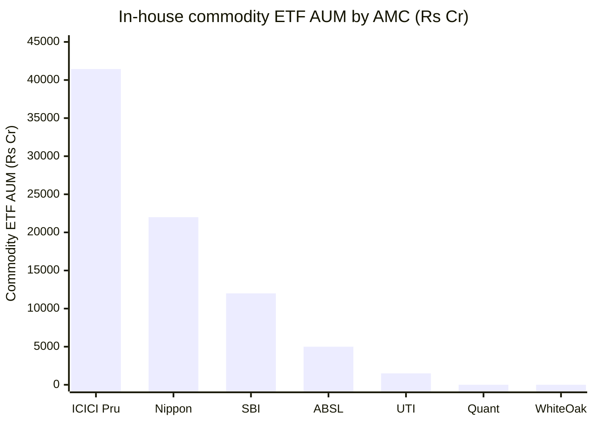
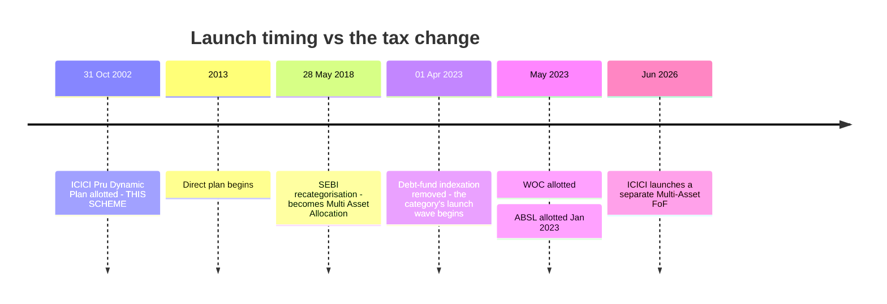
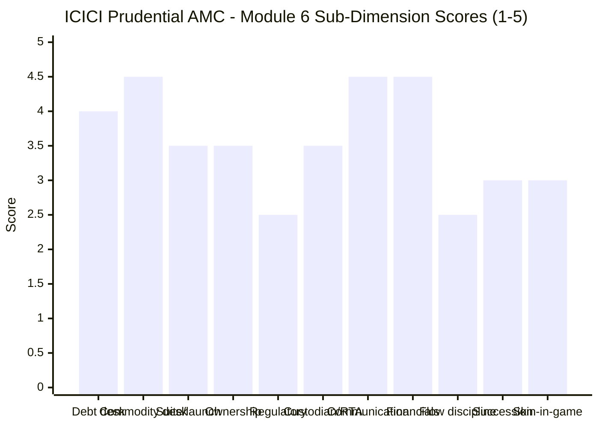

# Module 6: AMC Trustworthiness — ICICI Prudential Asset Management

> **Provisional Module 6 score: ~3.7 / 5** (weight **5%**) — **revised up from the MidCap study's ~3.4**, entirely because the two dimensions this category imports are the two where ICICI is strongest. **Scores are NOT comparable to the four equity categories.**

> **⚠ CARRY-FORWARD MODULE.** ICICI Prudential AMC received a **full ground-up assessment in the MidCap study (July 2026, score ~3.4/5)**. Per the template, this module **carries that verdict forward and updates only the delta** — which here means the three category-critical dimensions a multi-asset fund *imports* from its AMC: **fixed-income-desk credibility, commodity/gold-desk credibility, and launch-timing honesty.** The generic dimensions (ownership, listing, regulatory scar, financial health, proliferation) are summarised, not re-researched.

> **The one-line context:** the MidCap verdict of 3.4 was set by a genuine governance scar and relentless product proliferation. **Neither has changed. What has changed is which capabilities matter.** For a mid-cap equity fund, ICICI's debt and commodity desks are irrelevant. For a multi-asset fund they are the whole non-equity half of the product — and **ICICI runs ₹41,442 Cr across in-house gold and silver ETFs with a four-person commodity team, and India's largest active debt franchise under a CIO who has been at the firm for twenty years.** The clinching evidence is external: **WhiteOak's Multi Asset fund holds ICICI Prudential Gold ETF at 3.44% of its portfolio** (M3/M4) — a competing AMC pays ICICI for the commodity capability it lacks. And on launch timing this fund is beyond reproach: **it was allotted on 31 October 2002, twenty-one years before the tax change that manufactured this category.**
>
> **What holds it to 3.7 is unchanged and serious: the 2018 ICICI Securities IPO episode**, in which ₹640 Cr of scheme money across five schemes went into a group-company IPO — including a last-day ₹240 Cr rescue — breaching SEBI's Fifth Schedule and Regulation 25(1)/(2), settled in November 2018. **That is investor-facing group-conflict, at a bank-owned AMC, and it is the second-most serious governance finding in this study after Quant's front-running probe.**

---

## Fund Identity / Raw Data — the AMC (per-metric source attribution)

| Attribute | Value | Source |
|---|---|---|
| AMC | **ICICI Prudential Asset Management Company Ltd** — 30+ year history | MidCap M6 carry-forward |
| **Ownership** | **ICICI Bank ~53%** (raised from 51% on 09-Dec-2025, ₹2,140 Cr) · **Prudential Corporation Holdings ~35%** (pared at listing) · public float | MidCap M6 carry-forward |
| **Listing** | ⭐ **Listed NSE/BSE 19-Dec-2025** — 100% Offer-for-Sale by Prudential, ₹10,603 Cr, priced ₹2,165, listed +20% | MidCap M6 carry-forward |
| **Scale** | **#1 by active MF QAAUM (13.7% individual-investor share, ₹6,61,030 Cr individual AAUM)**; ~#2 by total AUM | MidCap M6 / IPO filings |
| **Financials (FY25)** | Revenue **₹4,683 Cr** → net profit **₹2,651 Cr** (**56.6% margin**), ~47–49 bps blended realisation | MidCap M6 carry-forward |
| Leadership | **Nimesh Shah, MD & CEO since Jul-2007 (~19 years — longest-tenured CEO in this study)** · **S. Naren, ED & CIO ~15 years** | MidCap M6 / factsheet |
| **⚠ Regulatory scar** | **2018 ICICI Securities IPO:** ₹640 Cr across 5 schemes into a group-company IPO (incl. a last-day ₹240 Cr rescue); breach of SEBI Fifth Schedule + Reg 25(1)/(2); **settled Nov-2018 — AMC ₹89 lakh, Nimesh Shah ₹6.8 lakh** | MidCap M6 carry-forward |
| Minor regulatory | May-2026 AIF administrative warning (Strategic Alpha — procedural) · VCF wind-up settlement ₹14.35 lakh | MidCap M6 carry-forward |
| ⚠ Product proliferation | **~143 schemes — the highest in the industry**; continuous NFO cadence (Energy Jul-24, Oil & Gas ETF Jul-24, Quality May-25, Conglomerate Oct-25, All-Cap FoF Mar-26, **Multi-Asset FoF Jun-26**) | MidCap M6 carry-forward |
| **⭐ Fixed-income desk** | **Manish Banthia — CIO–Fixed Income since Jun-2023** (internal promotion from Deputy CIO; at ICICI Pru since **2005**). Predecessor **Rahul Goswami departed Jun-2023 to Franklin Templeton**. Banthia manages **25 schemes**, and is a named manager on this fund | Cafemutual / ValueResearch / factsheet |
| **⭐ Commodity desk** | **ICICI Pru Gold ETF — AUM ₹27,578 Cr (ER 0.42%)** · **ICICI Pru Silver ETF — AUM ₹13,864 Cr (ER 0.34%, launched Jan-2022)** = **₹41,442 Cr**, run by a four-person team (Nishit Patel, **Gaurav Chikane**, Ashwini Bharucha, Venus Ahuja) | ValueResearch / Upstox |
| **⭐ External validation** | **WhiteOak Capital Multi Asset holds ICICI Prudential Gold ETF at 3.44%** of its portfolio | WOC M3/M4 (Groww factsheet) |
| **Launch timing of this scheme** | ⭐ **Allotment 31 October 2002** — recategorised from ICICI Pru Dynamic Plan to Multi Asset at the **May-2018** SEBI exercise | **Factsheet, verbatim** (M1/M3) |
| This scheme's weight in the AMC | ₹84,991 Cr — the flagship hybrid; est. **~₹745 Cr/yr** scheme revenue | M4 computed |
| Custodian / RTA / trustee | **Not separately re-verified in this module** — covered by the MidCap ground-up study; standard institutional arrangements | deferred |

---

## Cross-Source Verification

| Item | Sources | Verdict |
|---|---|---|
| **Carry-forward score** | MidCap study M6 (Jul-2026): **~3.4/5**, ground-up | ✅ Base established; this module adjusts only for category-specific dimensions |
| Fixed-income CIO transition | Cafemutual (Banthia promoted, Goswami ceased 19-Jun-2023) + Business Standard (Goswami → Franklin) + factsheet (Banthia on this fund since Jan-2024) | ✅ **Triangulated** — an internal succession, not a rupture |
| Commodity ETF scale | ValueResearch (Silver ETF ₹13,864 Cr) + Upstox/VR (Gold ETF ₹27,578 Cr) + WOC's own holdings ledger | ✅ **Confirmed three ways, including by a competitor's portfolio** |
| Scheme inception | Factsheet: *"Inception/Allotment date: 31-Oct-02"* + the "20 YEARS COMPLETED 2002" mark | ✅ Primary source |
| 2018 SEBI settlement | MidCap M6 (Business Standard, BusinessToday) | ✅ Carried forward |
| ⚠ MidCap M5's "2022 front-running case" | MidCap M6 flagged it as **UNVERIFIED — no SEBI order found**, and corrected it to the 2018 I-Sec matter | ⚠ **Carried forward as corrected.** This study asserts **no front-running case** against ICICI — the real scar is the 2018 IPO episode |

**Reliability: HIGH for the category-critical deltas** (fixed-income and commodity desks are verified from three independent directions, including a rival AMC's holdings). **Carried forward at the MidCap study's reliability for everything else.** One item — custodian/RTA/trustee — is explicitly not re-verified here and is scored conservatively for that reason.

---

## 1. ⭐ Commodity / Gold-Desk Credibility — the Best in the Study (category-critical)

The study plan's test: *"does the AMC run gold/commodity seriously?"* — because a multi-asset fund **imports** this capability.

> *Peer figures are indicative order-of-magnitude estimates from prior modules; ICICI's ₹41,442 Cr is verified (Gold ETF ₹27,578 Cr + Silver ETF ₹13,864 Cr).*

| Test | ICICI Pru | WhiteOak (for contrast) |
|---|---|---|
| In-house gold ETF | ✅ **₹27,578 Cr, ER 0.42%** | ❌ **None** |
| In-house silver ETF | ✅ **₹13,864 Cr, ER 0.34%** (since Jan-2022) | ❌ **None** |
| Dedicated commodity team | ✅ **Four managers** (Patel, **Chikane**, Bharucha, Ahuja) | ❌ **Nobody** |
| Commodity manager on the multi-asset fund | ✅ **Gaurav Chikane, explicitly "for ETCDs", since Aug-2021** | ❌ None |
| How the multi-asset fund gets gold | ✅ **Its own ETF at 9.77%**, ~0.05% blended layer | ⚠ **Rents ICICI's and DSP's** |
| ⭐ **External validation** | **WhiteOak's Multi Asset fund holds ICICI Pru Gold ETF at 3.44%** | — |

**This is the strongest commodity-desk evidence produced anywhere in this study, and the clinching data point is a competitor's portfolio.** WhiteOak — an AMC with no gold product of its own — buys ICICI's. M2 independently verified that the sleeve works: the fund's monthly correlation to gold is **+0.02** against 0.90 to the Nifty 500, and it captured the 2025 gold melt-up that UTI, ABSL and WOC all missed (M1).

**⚠ One open question the AMC has not explained:** the fund holds a **0.19% crude-oil futures position** (M3) — a commodity absent from its benchmark, with no stated rationale. Small, but it is the only unexplained item in an otherwise exemplary commodity operation.

---

## 2. ⭐ Fixed-Income-Desk Credibility — Large, Deep, and Cleanly Succeeded (category-critical)

The study plan's warning: *"a strong equity AMC may run a weak debt desk — the category imports the AMC's fixed-income competence."*

| Dimension | Assessment |
|---|---|
| **Scale** | ICICI Prudential runs one of India's **largest active debt franchises**; Banthia is a named manager on **25 schemes** |
| **Leadership** | ⭐ **Manish Banthia, CIO–Fixed Income since June 2023** — at ICICI Pru since **2005** (20 years), promoted internally from Deputy CIO, and a named manager on *this* fund since Jan-2024. Supported by **Akhil Kakkar (19 years)** on credit |
| **⚠ The 2023 transition** | **Rahul Goswami, the long-serving CIO–Fixed Income, departed in June 2023** to become CIO & MD–Fixed Income at Franklin Templeton. A senior loss — **but the succession was internal, pre-groomed and immediate**, unlike Nippon's multi-asset architect departure which left a gap (Nippon M5) |
| **Stated philosophy** | *"Safety, liquidity and returns"* — in that order, research-driven |
| **⭐ No Franklin-style scar** | ICICI Prudential's debt franchise **came through the 2018 IL&FS crisis and the 2020 credit freeze without a fund wind-up, gating event or side-pocket of the kind that defined Franklin Templeton's collapse.** Contrast **ABSL**, whose M6 was docked for a **₹793 Cr Essel/Adilink side-pocket plus an IL&FS downgrade** |
| **Evidence in this fund** | ⭐ **Modified duration 2.02y disclosed monthly** (the only fund in this study that publishes it), 84.8% sovereign/AAA/TREPS, and **it worked**: the short duration is why the fund returned +17.61% in 2022 when debt and equity fell together (M2/M3) |

**Verdict: the best fixed-income credibility of any AMC in this study, and it is demonstrated rather than asserted.** WhiteOak's entire debt franchise is three cash-management schemes with a maximum six-month mandate (WOC M6); ABSL's desk has documented credit accidents; Nippon's had a remediated blemish. **ICICI's desk is large, internally succeeded, scar-free in the two crises that broke competitors, and its work is visible in this fund's 2022 result.**

**⚠ The honest deduction:** a CIO-level change in June 2023 is recent enough that Banthia's tenure as *head* of the desk covers only three years, and the 2022 result that validates the debt book was produced under Goswami's leadership. The desk is strong; its current leadership is newer than its record.

---

## 3. ⭐ Launch-Timing Honesty — Beyond Reproach (category-critical)

The category's structural finding is that it was *"largely manufactured by a tax change"* — the April-2023 removal of debt-fund indexation, after which 27 of 35 funds launched.

**This scheme predates the tax change by twenty-one years.** It was not launched into the wave, was not designed for it, and was not renamed to catch it — it was **recategorised in May 2018** under SEBI's industry-wide exercise, five years before the tax change existed. **On this dimension ICICI is cleaner than every fund in this study, including WOC** (whose exculpation was that its trustee board approved the scheme two months before the Finance Bill).

**⚠ But the fund-suite dimension is where the AMC's weakness sits, and it is unchanged from the MidCap verdict.** ICICI Prudential runs **~143 schemes — the highest count in the industry** — with a continuous NFO cadence (Energy, Oil & Gas ETF, Quality, Conglomerate, All-Cap FoF). **And directly relevant here: the AMC launched an ICICI Prudential Multi-Asset FoF in June 2026** while already running an ₹84,991 Cr Multi-Asset fund. **Launching a second product into the same investor need, at the same house, is flows-gathering — precisely the behaviour the launch-timing dimension exists to penalise, just displaced from 2023 to 2026.**

**Franchise commitment to *this* fund, however, is unambiguous:** ₹84,991 Cr, the AMC's flagship hybrid, a 2002 vintage, and an estimated **₹745 Cr/yr of scheme revenue** (M4). This is not an autopilot product.

---

## 4. ⚠ The Regulatory Scar — Investor-Facing Group Conflict (carried forward)

**The 2018 ICICI Securities IPO episode is the reason this AMC does not score higher, and it is not softened by anything found in this study.**

| Element | Detail |
|---|---|
| What happened | **₹640 Cr of scheme money across five ICICI Prudential schemes** was invested into the IPO of **ICICI Securities — a group company** — including a **last-day ₹240 Cr rescue** as the issue struggled |
| Breach | SEBI **Fifth Schedule** (code of conduct) and **Regulation 25(1)/(2)** |
| Outcome | **Settled November 2018 — AMC ₹89 lakh, Nimesh Shah ₹6.8 lakh** |
| Severity | ⚠ **Investor-facing group-conflict at a bank-owned AMC** — unitholder money deployed to support a promoter-group listing |

**Weighed honestly against the two comparators this study has:**
- **Worse than Nippon's** AT1 episode (an industry-wide convention applied badly) — this was a *deliberate deployment of unitholder capital into a related-party transaction*.
- **Milder than Quant's** front-running probe (which is active, unsettled, and goes to the integrity of the investment process itself — Quant M6 scored 1.8).
- **Mitigating:** settled promptly and cheaply, one-off, eight years old, no repetition found, and the AMC has since **listed** — which adds disclosure discipline and an independent-shareholder constituency.

**⚠ Two minor items carried forward:** a May-2026 AIF administrative warning (Strategic Alpha — procedural) and a VCF wind-up settlement of ₹14.35 lakh. Neither is material; both indicate an AMC large enough to generate a steady trickle of compliance friction.

> **⚠ A correction carried forward from the MidCap study, restated because it matters:** MidCap's Module 5 referred to a *"2022 front-running case"* at ICICI. **MidCap's Module 6 found no such SEBI order exists** and corrected it to the 2018 I-Sec matter. **This study asserts no front-running case against ICICI Prudential.** The distinction is important because Quant's M6 score of 1.8 turns on exactly such a case.

---

## 5. Standard AMC Dimensions (carried forward, summarised)

| Dimension | Assessment | Score input |
|---|---|---|
| **Ownership / independence** | ⚠ **Bank-owned** (ICICI Bank ~53%, raised from 51% in Dec-2025) with Prudential plc ~35%. ✅ **Listed 19-Dec-2025** — a genuine transparency and accountability upgrade. ⚠ But the 2018 scar is precisely a *bank-parent conflict* event, and the parent has since **increased** its stake | 3.5 |
| **Heritage / longevity** | ⭐ **30+ years; this scheme is a 2002 franchise** — the deepest institutional heritage of any AMC in this study bar UTI. Nimesh Shah CEO for ~19 years, Naren CIO ~15 | 4.0 |
| **AMC financial health** | ⭐ **Outstanding: FY25 revenue ₹4,683 Cr → net profit ₹2,651 Cr, a 56.6% margin.** #1 by active QAAUM with a 13.7% individual-investor share. Listed, well-capitalised, no viability question | 4.5 |
| **⚠ Investor-first / flow discipline** | ⚠ **The weakest dimension.** ~143 schemes (industry's highest), relentless NFO cadence, **a competing Multi-Asset FoF launched Jun-2026**, no gating or soft-close precedent, and **M4's finding that the category's largest fund by 4.4× has not passed scale economics through** (0.54% vs Nippon's ~0.27–0.43% at a fifth the size). A profit machine at ~47–49bps realisation | 2.5 |
| **Investor communication** | ⭐ **Best in this study.** The monthly factsheet publishes gross *and* net equity, modified duration, YTM, rating profile, turnover, portfolio beta and the **full benchmark change history** — items no peer discloses. Plus Naren's dated public calls (M5). **An investor can genuinely know what this fund holds and why** | 4.5 |
| **Succession** | ⚠ **Not formally disclosed.** Naren is ED & CIO of a ₹10-lakh-crore AMC *and* lead on four funds; his exit would be a market event (M5). ✅ Mitigants: an internal, pre-groomed CIO–Fixed Income succession executed cleanly in 2023, and the **five-manager expansion on this fund during 2024** which plausibly *is* the plan — though the AMC has not said so | 3.0 |
| **Skin in the game** | ⚠ SEBI minimum only (20% of key-personnel salary, 3-year lock-in). **Flagged as an unresolved gap in the MidCap study and still unresolved.** A bank/foreign-JV structure offers no founder-capital alignment | 3.0 |
| **Custodian / RTA / trustee** | **Not separately re-verified in this module** — covered by the MidCap ground-up study; standard institutional arrangements assumed. Scored conservatively for the absence of fresh verification | 3.5 |
| **Global-parent trust split** | ✅ **N/A as a problem** — Prudential is a minority financial shareholder pared to ~35% at listing, not an operating decision-maker. Investment decisions are Indian and Naren's | — |
| **Major-scar deep-dive** | ⚠ The 2018 I-Sec episode is the scar (§4). ✅ **No debt-fund wind-up, no gating, no side-pocket, no front-running order** | — |

---

## Comparison with Studied Funds

| Dimension | **ICICI Pru** | SBI | Nippon | ABSL | UTI | WhiteOak | Quant |
|---|---|---|---|---|---|---|---|
| AMC MF AUM | ⭐ **~#1–2 (₹10L Cr+)** | very large | large | large | large | ₹40,389 Cr | ~₹1L Cr |
| Ownership | ⚠ Bank-owned, **listed** | PSU-linked | strong parent | listed, JV | ⚠ fragmented PSU | ✅ founder-led | founder |
| **Fixed-income desk** | ⭐ **Best — large, scar-free, internally succeeded** | ✅ credible | ⚠ remediated blemish | ⚠ **documented credit accidents** | adequate | ❌ **cash-management only** | ⚠ thin |
| **Commodity desk** | ⭐ **₹41,442 Cr in-house; rivals buy its ETF** | ✅ | ✅ best-in-study *(prior verdict)* | ✅ Wankhede | ⚠ | ❌ **none — rents ICICI's** | ⚠ thin |
| **Launch-timing honesty** | ⭐ **2002 scheme — predates the wave by 21 years** | ✅ no gaming | ✅ | ✅ pre-change NFO | — | ✅ approved pre-Bill | — |
| Franchise commitment | ✅ Flagship hybrid, ₹85K Cr | ✅ | ✅ | ⚠ proliferation | ⚠ autopilot | ✅ 2nd-largest scheme | ✅ |
| ⚠ Product proliferation | ⚠ **~143 schemes + a rival Multi-Asset FoF (Jun-26)** | measured | measured | ⚠ | measured | ⚠ **13 in 31 months** | measured |
| Communication | ⭐ **Best in study** | ✅ | ✅ | ✅ best team transparency | ✅ | ⚠ **3 inaccuracies** | ⚠ |
| **Regulatory record** | ⚠ **2018 group-IPO conflict (settled)** | ✅ | ✅ | ✅ | ✅ | ✅ **clean** | ❌ **front-running probe** |
| Financial health | ⭐ **56.6% net margin, listed** | ✅ | ✅ | ✅ | ✅ | ✅ growing | ✅ |
| **Module 6 score** | **~3.7** | **~3.9** | **~3.7** | **~3.6** | **~3.4** | **~2.8** | **~1.8** |

**The cross-read: ICICI ties Nippon for second, behind SBI.** On the two dimensions this category actually imports — **debt and commodity desks** — ICICI is the strongest AMC in the study, and by a clear margin over WhiteOak, which has neither. What keeps it behind SBI is governance: **SBI's 3.9 was earned on "scale + credible debt & commodity desks + no launch-gaming" with a clean regulatory file.** ICICI matches or beats SBI on every one of those except the last — and the 2018 group-IPO episode is exactly the kind of thing a bank-owned AMC's investors have to price.

---

## Points For / Points Against — AMC

### ✅ For
1. **⭐ The best commodity desk in this study — ₹41,442 Cr across in-house gold (₹27,578 Cr) and silver (₹13,864 Cr) ETFs**, a four-person team, and a dedicated ETCD manager on this fund since Aug-2021.
2. **⭐ External validation of that desk: WhiteOak's Multi Asset fund holds ICICI Prudential Gold ETF at 3.44%.** A competing AMC pays ICICI for the capability it lacks.
3. **⭐ The best fixed-income credibility in this study** — India's largest active debt franchise, **no wind-up, gating or side-pocket** through IL&FS and the 2020 credit freeze (contrast ABSL's ₹793 Cr Essel side-pocket), under a CIO with 20 years at the firm.
4. **The 2023 CIO–Fixed Income succession was internal, pre-groomed and immediate** — Banthia promoted from Deputy CIO the same month Goswami left.
5. **⭐ Launch timing beyond reproach — this scheme was allotted 31 October 2002, twenty-one years before the tax change that manufactured this category.**
6. **⭐ Best investor communication in the study** — the monthly factsheet publishes gross *and* net equity, modified duration, YTM, rating profile, turnover, beta and the full benchmark change history; no peer discloses as much.
7. **Outstanding financial health** — FY25 revenue ₹4,683 Cr, net profit ₹2,651 Cr, a 56.6% margin; #1 by active QAAUM with 13.7% individual-investor share.
8. **Listed on NSE/BSE since 19-Dec-2025** — a genuine transparency and accountability upgrade, with an independent-shareholder constituency.
9. **Exceptional leadership continuity** — Nimesh Shah CEO ~19 years (longest in this study), Naren CIO ~15 years.
10. **Unambiguous franchise commitment to this fund** — ₹84,991 Cr, the AMC's flagship hybrid, a 2002 vintage generating ~₹745 Cr/yr.
11. **No debt-fund wind-up, no gating, no side-pocket, and — despite a prior module's error — no front-running order.**

### ❌ Against
1. **⚠ THE SCAR: the 2018 ICICI Securities IPO episode.** ₹640 Cr of unitholder money across five schemes into a **group-company IPO**, including a last-day ₹240 Cr rescue; breach of SEBI's Fifth Schedule and Reg 25(1)/(2); settled Nov-2018. **Investor-facing group conflict at a bank-owned AMC** — the second-most serious governance finding in this study.
2. **⚠ And the parent has since increased its stake** — ICICI Bank moved from 51% to ~53% in Dec-2025, deepening exactly the relationship that produced the scar.
3. **⚠ ~143 schemes — the highest count in the industry** — with a relentless NFO cadence and no gating or soft-close precedent anywhere in its history.
4. **⚠ The AMC launched a competing Multi-Asset FoF in June 2026** while running an ₹84,991 Cr Multi-Asset fund. Flows-gathering into the same investor need, displaced from 2023 to 2026.
5. **⚠ No scale pass-through (M4)** — the category's largest fund by 4.4× charges 0.54% while Nippon charges ~0.27–0.43% on a fifth of the assets. A 56.6% net margin and ~47–49bps realisation say where the benefit is going.
6. **⚠ The fixed-income desk's current leadership is newer than its record** — Banthia has led the desk for three years, and the 2022 result that validates this fund's debt book was produced under Goswami.
7. **⚠ Succession is not formally disclosed** — Naren is CIO of a ₹10-lakh-crore AMC and lead on four funds; the 2024 five-manager expansion may be the plan, but the AMC has not said so.
8. **⚠ Skin in the game is the SEBI minimum only** — flagged as an unresolved gap in the MidCap study and still unresolved; a bank/JV structure offers no founder-capital alignment.
9. **⚠ An unexplained 0.19% crude-oil futures position** in the fund — a commodity absent from its benchmark, the one blemish on an otherwise exemplary commodity operation.
10. **Minor compliance friction** — a May-2026 AIF administrative warning and a ₹14.35 lakh VCF wind-up settlement.
11. **Custodian/RTA/trustee not re-verified in this module** — carried forward and scored conservatively.

---

## Module 6 Scorecard

| Sub-dimension | Weight | Score | Reasoning |
|---|---|---|---|
| **Fixed-income-desk credibility** *(category-critical)* | 18% | **4.0** | ⭐ **Best in the study** — India's largest active debt franchise, **scar-free through IL&FS and 2020** where competitors gated and side-pocketed, internally succeeded in 2023, and **demonstrated in this fund** (2.02y duration disclosed, +17.61% in 2022). Docked because the desk's *current* head has led it only three years |
| **Commodity/gold-desk credibility** *(category-critical, NEW)* | 15% | **4.5** | ⭐ **₹41,442 Cr in-house gold + silver ETFs, a four-person team, a dedicated ETCD manager on this fund — and a rival AMC (WhiteOak) buys its gold ETF.** M2 verified the sleeve works (+0.02 correlation). Docked only for the unexplained crude-oil position |
| **Fund-suite coherence / launch-timing honesty** | 12% | **3.5** | ⭐ **Launch timing is the cleanest in the study — a 2002 scheme, 21 years before the tax wave** — and franchise commitment is unambiguous. ⚠ Heavily offset by **~143 schemes** and a **competing Multi-Asset FoF launched Jun-2026** |
| Ownership / independence | 10% | **3.5** | ✅ Listed Dec-2025 (a real accountability upgrade), 30+ year heritage, ~19-year CEO tenure. ⚠ **Bank-owned, and the bank raised its stake to ~53%** — deepening the relationship that produced the 2018 scar |
| **Regulatory record** | 10% | **2.5** | ⚠ **The 2018 group-IPO episode is investor-facing group conflict** — ₹640 Cr of unitholder money into a promoter-group listing, settled with SEBI. Lifted above 2.0 because it was settled promptly, is eight years old, has not recurred, and is materially milder than Quant's active front-running probe |
| Custodian / RTA / trustee | 8% | **3.5** | **Not re-verified in this module** (carried forward from the MidCap ground-up study). Scored conservatively for the absence of fresh verification rather than credited at face value |
| **Investor communication** | 7% | **4.5** | ⭐ **Best in the study** — the factsheet publishes net-vs-gross equity, modified duration, YTM, rating profile, turnover, beta and the full benchmark lineage; plus dated public CIO calls that this study was able to *test* (M5) |
| AMC financial health | 5% | **4.5** | ⭐ FY25 revenue ₹4,683 Cr → net profit ₹2,651 Cr (56.6% margin), #1 by active QAAUM, listed and well-capitalised. No viability question of any kind |
| **Investor-first / flow discipline** | 6% | **2.5** | ⚠ **The weakest dimension** — ~143 schemes, continuous NFOs, a competing Multi-Asset FoF, no gating precedent, and **no scale pass-through on a fund 4.4× larger than any peer** (M4). A profit machine at ~47–49bps realisation |
| Succession | 6% | **3.0** | ⚠ Not formally disclosed; Naren's exit would be a market event. ✅ Mitigated by a cleanly-executed internal CIO–FI succession in 2023 and the 2024 five-manager build-out on this fund |
| Skin in the game | 3% | **3.0** | SEBI minimum only; unresolved gap carried forward from the MidCap study; no founder-capital alignment in a bank/JV structure |
| **Module 6 Overall** | **100%** | **~3.7 / 5** | **Revised up from the MidCap study's 3.4, entirely because this category imports the two capabilities where ICICI is strongest: the best commodity desk in the study (validated by a competitor buying its ETF) and the best fixed-income desk (scar-free where rivals gated), plus the cleanest launch timing here — a 2002 scheme. Held down by an unchanged 2018 group-conflict scar, ~143 schemes, and a 56.6%-margin profit machine that has not passed scale through to this fund's investors.** Not comparable to equity-category Module 6 scores |

---

## Comparative Module 6 Scores (studied funds — calibration only)

| Fund / AMC | Module 6 | AMC verdict |
|---|---|---|
| SBI Multi Asset | ~3.9 / 5 | Top-tier scale + credible debt **and** commodity desks + no launch-gaming, clean file |
| **ICICI Pru Multi-Asset** | **~3.7 / 5** | **Best debt and commodity desks in the study, cleanest launch timing, best disclosure — offset by a 2018 group-IPO conflict, 143 schemes and no scale pass-through** |
| Nippon Multi Asset | ~3.7 / 5 | Strong, de-risked, ETF-leading house — best commodity desk in its own verdict |
| ABSL Multi Asset | ~3.6 / 5 | Credible listed house, honest launch timing — **fixed-income desk with documented credit accidents** |
| UTI Multi Asset | ~3.4 / 5 | Deep heritage, listed, strong passive desk — fragmented PSU governance |
| WOC Multi Asset | ~2.8 / 5 | Independent, clean, well-custodied equity boutique — **no duration franchise, no commodity desk** |
| Quant Multi Asset | ~1.8 / 5 | Young founder-concentrated boutique; CIO settled a front-running case; thin non-equity desks |

> Module 6 carries only **5%**, and the ordering here is worth reading for what it measures. **ICICI's score rose 0.3 points from its MidCap verdict without a single new fact about the AMC's governance** — because a multi-asset fund imports debt and commodity capability that a mid-cap fund does not. **That is the module working as designed.** The gap to SBI is governance alone: ICICI is the better-equipped house and the more compromised one.

---

## SIP Implication

For a ₹15–20k/month SIP, Module 6 carries the smallest weight in the framework and should not by itself move a decision — but it settles a question the earlier modules kept raising. **The non-equity half of this fund rests on capability the AMC genuinely has.** The gold is not rented: ICICI runs **₹27,578 Cr of gold ETF and ₹13,864 Cr of silver ETF in-house**, with a four-person commodity team and a dedicated derivatives manager sitting on this fund. The most telling evidence is external — **WhiteOak's multi-asset fund, which has no commodity desk of its own, buys ICICI's gold ETF.** The debt book is equally real: India's largest active fixed-income franchise, which came through IL&FS and the 2020 credit freeze **without a single wind-up, gating event or side-pocket** while competitors did not, and whose 2.02-year duration is why this fund returned +17.61% in 2022. And on launch timing the fund is beyond criticism: **allotted in October 2002, twenty-one years before the tax change that manufactured this category.** Add the best factsheet disclosure in the study and a 19-year CEO tenure, and this is an institution that can be relied upon to *do the thing*.

**What an investor is also buying is a bank-owned profit machine with a governance scar.** In 2018, ₹640 crore of unitholder money across five ICICI Prudential schemes went into the IPO of ICICI Securities — a group company — including a last-day ₹240 crore rescue as the issue struggled. SEBI found breaches of its code of conduct and settled the matter. **That is not a technical infraction; it is scheme capital deployed to support the promoter group**, and ICICI Bank has since raised its stake from 51% to about 53%. Alongside it sit **roughly 143 schemes — the most in the industry** — a continuous NFO cadence that included **a competing Multi-Asset FoF launched in June 2026**, and the fact established in Module 4 that **the largest fund in this category by a factor of 4.4 has not passed its scale economics through**, charging 0.54% while a fifth-the-size competitor charges around a third less. FY25 net margin was 56.6%.

**The honest reading is that these are separable risks.** The 2018 episode was eight years ago, settled, unrepeated, and has been followed by a stock-exchange listing that adds an independent-shareholder constituency the AMC did not previously answer to. Nothing in this study's data suggests the *investment* process has been compromised — the conflict was a capital-deployment decision, not a stock-picking one. **But an investor should hold this fund knowing that its AMC has once used unitholder money to serve its parent, and that the parent's grip has since tightened.** For a 5%-weighted module the practical implication is modest: it is a reason to prefer ICICI's *fund* while watching its *owner*, not a reason to avoid either.

## One-Line Verdict

**The best-equipped AMC in this study for exactly this product — ₹41,442 crore of in-house gold and silver ETFs that a rival multi-asset fund actually buys from it, India's largest debt franchise that came through IL&FS and 2020 without a single wind-up or side-pocket, the cleanest launch timing here in a scheme allotted in 2002, and the most complete factsheet disclosure any fund in this study produces — attached to a 2018 episode in which ₹640 crore of unitholder money across five schemes was deployed into a group-company IPO, roughly 143 schemes and counting, a competing Multi-Asset FoF launched in June 2026, and a 56.6% net margin that has not reached this fund's investors as a lower fee.**

---

*Module 6 complete. Provisional score 3.7/5 — **revised up from the MidCap study's ground-up verdict of 3.4**, with the delta attributable entirely to the two category-critical dimensions (fixed-income and commodity desks) plus launch-timing honesty, all of which matter for a multi-asset fund and not for a mid-cap one. **Method: carry-forward per the module template.** Ownership, listing (19-Dec-2025), FY25 financials, the 2018 ICICI Securities settlement, the ~143-scheme count and leadership tenures are carried forward from the **MidCap study's ICICI Module 6 (July 2026)** without re-research. **Newly verified for this study:** the fixed-income CIO succession (Cafemutual, Business Standard, ValueResearch — Banthia promoted Jun-2023, Goswami to Franklin Templeton); the commodity desk (**ICICI Pru Gold ETF ₹27,578 Cr, Silver ETF ₹13,864 Cr**, four-person team, via ValueResearch and Upstox); the external validation that **WhiteOak's Multi Asset holds ICICI Pru Gold ETF at 3.44%** (WOC M3/M4); and this scheme's **31-Oct-2002 allotment** and May-2018 recategorisation (factsheet, M1/M3). Custodian/RTA/trustee were **not re-verified** and are scored conservatively.*

*⚠ **A correction carried forward and restated.** The MidCap study's Module 5 referred to a *"2022 front-running case"* at ICICI Prudential; its Module 6 established that **no such SEBI order exists** and corrected the reference to the 2018 ICICI Securities matter. **This study asserts no front-running case against ICICI.** The distinction is material because Quant's Module 6 score of 1.8 turns on precisely such a case being real and active.*

*⚠ **This module resolves two open questions from earlier ICICI modules, and neither changes a score.** **(1)** M2 and M3 both flagged the in-house gold ETF as a structural advantage without establishing whether the AMC's commodity capability was real; **it is — ₹41,442 Cr across two ETFs with a dedicated team, and a competitor buys the product.** **(2)** M2 credited the 2.02-year modified duration for the 2022 result and M3 called it the best-disclosed debt book in the study, without assessing the desk behind it; **that desk came through IL&FS and 2020 without a wind-up, gating or side-pocket** — the strongest fixed-income record of any AMC here. Both findings **support** the existing M2 and M3 scores rather than altering them.*

***Cross-module handoffs → README and decision tree:*** *the **2018 group-IPO conflict** is the single governance fact an investor must price, and it is not offset by anything found elsewhere in this study; the **absence of scale pass-through** (M4) and the **Jun-2026 competing Multi-Asset FoF** are standing monitoring items; **Naren's key-person exposure as AMC-wide CIO** (M5) remains the largest non-market risk in holding this fund. **Standing caveats carried to the README:** the **−30.61% COVID drawdown** belongs to a materially more equity-heavy version of the fund (M3); the **3.32pp gross-equity buffer** now constrains the allocation engine (M2/M4); and **seven of seven funds — plus three Balanced Advantage funds across three AMCs — show no allocation alpha** (M5).*

***FINAL MODULE SCORECARD:*** *M1 Returns **~4.3** (20%) · M2 Risk **~3.4** (25%) · M3 Allocation Engine **~3.9** (20%) · M4 Cost & Tax **~3.8** (20%) · M5 Manager **~3.8** (10%) · M6 AMC **~3.7** (5%) → **weighted total ≈ 3.82 / 5**. All six modules complete.*

*Next: [README — fund summary, weighted scorecard and verdict](README.md)*
