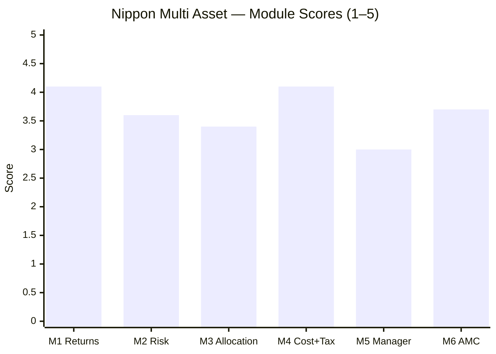

# Nippon India Multi Asset Allocation Fund — Fund Summary & Verdict

**Direct Plan – Growth · MFAPI 148457 · AUM ₹16,000 Cr · ER ~0.27–0.43% (cheapest in shortlist) · studied Jul 2026**

> **Final weighted score: ≈ 3.71 / 5.** The **returns-and-cost leader** of the cycle-tested funds — a genuinely cheap (at/below DIY cost), high-returning, actively-allocated multi-asset fund with the broadest asset book in the study (including international equity). But it wins by being **equity-*tilted*, not defensive** — its record is bull-flattered (no severe-bear test), its "alpha" is largely equity-overweight beta, and — most importantly — **the architect who built the whole record left the fund in early 2026.**
>
> **⚠ Scores are NOT comparable to the four equity categories** (multi-asset re-weight: Risk 25 / Returns 20 / Allocation 20 / Cost+Tax 20 / Manager 10 / AMC 5). **Not investment advice.**

---

## The Six-Module Scorecard

| Module | Topic | Weight | Score | Weighted | One-line |
|--------|-------|--------|-------|----------|----------|
| [M1](module1_returns.md) | Returns & Allocation Alpha | 20% | 4.1 | 0.82 | Large DIY-beating alpha, cheap — but bull-only, equity-tilted |
| [M2](module2_risk.md) | Risk Profile | 25% | 3.6 | 0.90 | Equity-plus dampener; weaker diversifier; never severe-bear-tested |
| [M3](module3_allocation.md) | Allocation Engine & DNA | 20% | 3.4 | 0.68 | Real engine + broadest book (incl. intl); mixed skill, index-like equity |
| [M4](module4_cost_tax.md) | Cost & Tax | 20% | 4.1 | 0.82 | Cheapest ER (at/below DIY); real rebalancing shield |
| [M5](module5_manager.md) | Manager / Team | 10% | 3.0 | 0.30 | Best team structure — but the architect left; new lead unproven |
| [M6](module6_amc.md) | AMC | 5% | 3.7 | 0.185 | #4 AMC, best gold-ETF desk; Reliance-era debt blemish |
| **TOTAL** | | **100%** | | **≈ 3.71** | |

---

## What Nippon Multi Asset Actually Is

Three data-driven reframings, each honest about a label:

1. **It is an equity-*plus* fund, not a defensive multi-asset fund.** Net equity ~56%, beta 0.58, **downside capture 38%** (M2). Its risk-peer is a Balanced Advantage fund (HDFC BAF), not a defensive sleeve. It participates strongly on the upside (hence the returns) and cushions only moderately.

2. **Its record is real but regime-flattered.** Launched Aug 2020, its entire 5.9-year life is a **post-COVID bull market with no severe bear** (M1/M2). The −10.8% worst-ever drawdown is a bull number; a beta-implied COVID-magnitude event would draw it **~−20%**. The 18.28% CAGR is *what a good equity-tilted fund did in a favourable window.*

3. **The winning record is the departed architect's.** Ashutosh Bhargava ran the equity + allocation from inception until early 2026 and **left the fund** (M5). His replacement (Jan 2026, ~7 months) is experienced but a sector/focused specialist, unproven on this mandate. **The past is his; the future is uncertain.**

---

## The Genuine Strengths

- **Returns leader (M1 4.1).** SI CAGR 18.28%; **+3.85%/yr blended-benchmark alpha; beats a DIY basket by ~+4.8%/yr** — the widest DIY margin in the study.
- **Cheapest in the shortlist (M4 4.1).** ~0.27–0.43% ER — *at or below* the all-in cost of doing it yourself. And because it genuinely rebalances, its **internal tax shield is real** (~0.15–0.25%/yr).
- **A real allocation engine + the broadest book (M3 3.4).** Equity oscillated 54–70%; six sleeves including genuine **international equity** (MSCI World ~5%) — the only fund so far to diversify beyond India.
- **Best gold/silver-ETF desk in the study (M6).** India's #1 ETF house — the engine of its cost advantage.
- **Real 2022 cushioning** (unlike the young WOC/ABSL) and fast recoveries.

## The Honest Weaknesses

- **Never faced a severe bear** — the pristine record is partly a regime artifact (M2).
- **Equity-tilted, weaker diversifier** — 0.82 correlation to the FlexiCap core (vs SBI 0.73); cushions every event *less* than SBI (M2).
- **The alpha is allocation-weight + bull beta, not skill** — equity book is index-like (85% R²); it *lagged* in the two years non-equity mattered most (2022, 2025) (M1/M3).
- **The architect left (M5)** — the returns, alpha, and engine belong to a manager who is gone; new lead unproven and style-mismatched.
- **Not equity-taxed** (middle tier) and **debt desk carries Reliance-era baggage** (M6).

---

## The Verdict That Matters: Fund vs DIY

| | Nippon | DIY (index + debt + gold/silver ETF, rebalanced) |
|---|---|---|
| 5Y SIP corpus (₹10k/mo) | ~₹9.28L | ~₹8.38L |
| 5Y lumpsum post-tax (₹10L) | ~₹19.91L | ~₹17.43L |
| Edge to Nippon (post-tax) | **~+₹2.5L over 5Y** | — |
| ER vs DIY | **At/below DIY (~0.27%)** | ~0.30% |

**Nippon clears the DIY bar decisively** — the strongest fund-vs-DIY case in the study, and the opposite of SBI (which barely passed). Two honest qualifiers: the *size* of the margin rides on bull-market returns (it would narrow in a bear), but the *structural* advantages (cheapest ER, real rebalancing shield, no capacity limit) are regime-independent. **On the "why not DIY?" test, Nippon has the clearest answer of any fund studied.**

---

## ⭐ Nippon vs SBI — the Head-to-Head (the study's central comparison so far)

The two cycle-tested funds finished in a **virtual dead heat** (Nippon ≈3.71, SBI ≈3.66) — reached by **opposite routes**:

| Axis | Nippon | SBI | Winner |
|------|--------|-----|--------|
| Returns (M1) | 4.1 | 3.6 | **Nippon** |
| Risk / defensiveness (M2) | 3.6 | 4.5 | **SBI** |
| Allocation engine (M3) | 3.4 (real engine) | 3.0 (static drift) | **Nippon** |
| Cost & tax (M4) | 4.1 (cheapest) | 3.5 | **Nippon** |
| Manager (M5) | 3.0 (architect left) | 3.2 (stable) | **SBI** |
| AMC (M6) | 3.7 | 3.9 | **SBI** |
| Correlation to your equity | 0.82 (worse diversifier) | 0.73 | **SBI** |
| Downside capture | 38% | 8% | **SBI** |
| **Final** | **≈3.71** | **≈3.66** | **~tie** |

**They are different products for different jobs:**
- **Nippon** = *equity-plus / return-and-cost leader.* Choose it for **higher through-cycle return, the lowest fee, a real allocation engine, and international diversification** — if you can accept BAF-like risk, a bull-only record, and a manager transition.
- **SBI** = *defensive diversifier.* Choose it for **maximum drawdown protection and genuine decorrelation** from a 100%-equity portfolio — accepting lower returns, no allocation skill, and a higher fee.

**The choice is a preference, not a ranking.** For a portfolio adding a sleeve *specifically to de-risk 100% equity*, SBI does that job better (lower correlation, 5× better downside capture). For one wanting *return-with-some-smoothing at the lowest cost*, Nippon wins. The decision tree will resolve this against the actual portfolio goal.

---

## Monitoring / Review Triggers (if held)

1. **The new equity/allocation lead** — Vinay Sharma (since Jan 2026) is unproven on this mandate; watch whether the allocation engine and equity selection hold up over the next 2–3 years / a real correction.
2. **First severe bear** — the fund has never seen one; its true downside (beta implies ~−20%) is unproven. Judge its cushioning the first time equity falls >25%.
3. **Equity-weight drift** — if net equity pushes toward ≥65%, it becomes an equity fund (changing its role and its tax tier); if it stays ~56%, it remains equity-plus.
4. **Debt-book credit** — the sleeve reaches into NBFC credit (Muthoot) under a desk with Reliance-era stress history; watch for downgrades/side-pockets.
5. **Gold allocation** — the manager mistimed gold (cut before the 2025 surge); watch whether the new team allocates commodities better.
6. **ER creep** — the 0.27–0.43% edge is the fund's structural advantage; watch it doesn't drift up.

---

## One-Line Verdict

**The returns-and-cost champion of the cycle-tested funds — cheapest fee (at/below DIY), widest DIY-beating margin, a real allocation engine, and the broadest book (with international) — but an equity-*tilted*, bull-flattered, never-severe-bear-tested fund whose entire winning record belongs to an architect who left in early 2026; a strong ≈3.71/5 that ties SBI by the opposite route (return vs risk) and whose slot depends on whether the portfolio wants participation-at-low-cost or genuine downside protection.**

---

*Fund README complete. All six modules + README done (Jul 30 2026). Final weighted score ≈ 3.71/5. Method: MFAPI self-computation (scheme 148457) + return-based style analysis + factsheet/web backfill (ValueResearch, Groww, Nippon product notes, Business Standard). Second of six shortlist funds; **virtual tie with SBI (≈3.66) by the opposite route.** Feeds the decision tree (fund-vs-DIY, the risk-vs-return sub-type choice, and the manager-transition risk). Next fund: Quant Multi Asset.*
