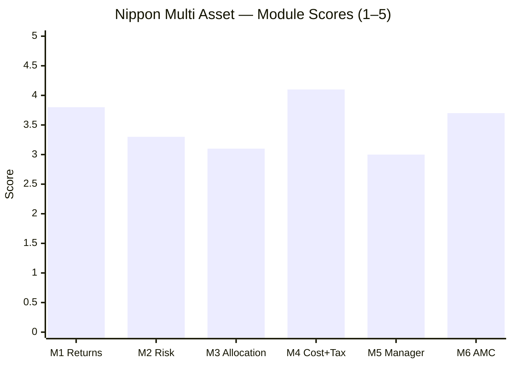

# Nippon India Multi Asset Allocation Fund — Fund Summary & Verdict

**Direct Plan – Growth · MFAPI 148457 · AUM ₹16,000 Cr · ER ~0.27–0.43% (cheapest in shortlist) · studied Jul 2026**

> **Final weighted score: ≈ 3.51 / 5** *(revised down from 3.71 in Aug-2026 — see the correction box below).* The **returns-and-cost leader** of the cycle-tested funds — a genuinely cheap (at/below DIY cost), high-returning, actively-allocated multi-asset fund with the broadest asset book in the study (including international equity). But it wins by being **equity-*tilted*, not defensive** — its record is bull-flattered (no severe-bear test), its "alpha" is largely equity-overweight beta, and — most importantly — **the architect who built the whole record left the fund in early 2026.**
>
> **⚠ Scores are NOT comparable to the four equity categories** (multi-asset re-weight: Risk 25 / Returns 20 / Allocation 20 / Cost+Tax 20 / Manager 10 / AMC 5). **Not investment advice.**

> ### ⚠ CORRECTIONS APPLIED AUGUST 2026 — score revised 3.71 → 3.51
> A study-wide audit found this fund's write-up was one of the two thinnest of seven and, like the four other early studies, **was built entirely from aggregators and never from the scheme's primary documents.** Three material errors followed:
>
> 1. **The benchmark was wrong (M1).** The SID declares **"50% BSE 500 TRI, 20% MSCI World Index TRI, 15% CRISIL Short Term Bond, 10% gold, 5% silver."** The study used 55% Nifty 50 / 20% debt / 25% gold — **wrong equity index, and the 20% international leg omitted entirely.** Corrected alpha: **+1.39–1.48%/yr, not +3.85%.** DIY edge: **+2.92–3.23%/yr, not +4.8%.**
> 2. **It is the only fund in the study to fail the stale-pricing test (M2).** Lag-1 autocorrelation **+0.0746 (t = 2.84, significant)**; Geltner-unsmoothed volatility **10.26% vs 9.54% reported** — risk understated by 7.6%, Sharpe overstated by 0.09. Cause: the international sleeve is priced after the Indian NAV cut-off.
> 3. **The "active engine" claim does not survive a like-for-like test (M3).** On the same rolling-26-week settings used for every peer, Nippon's equity dial moves **20.8pp (sd 4.8)** — **the narrowest of the five cycle-tested funds, narrower than SBI**, which this study used as its static counter-example. And the international sleeve is **~12.8% effective, not the ~5% reported.**
>
> **What survives unchanged:** the cheapest ER in the shortlist (M4 4.1), the genuine six-sleeve breadth, the real 2022 cushioning, and the departed-architect finding (M5 3.0). **The fund is still good — the margins were overstated.**

---

## The Six-Module Scorecard

| Module | Topic | Weight | Score | Weighted | One-line |
|--------|-------|--------|-------|----------|----------|
| [M1](module1_returns.md) | Returns & Allocation Alpha | 20% | **3.8** | 0.760 | ⚠ **Alpha corrected +3.85% → +1.39–1.48%/yr** on the real SID benchmark; still beats DIY |
| [M2](module2_risk.md) | Risk Profile | 25% | **3.3** | 0.825 | ⚠ **Only fund to fail the stale-pricing test** — true vol 10.26% not 9.54% |
| [M3](module3_allocation.md) | Allocation Engine & DNA | 20% | **3.1** | 0.620 | ⚠ **Least dynamic of five** on peer settings; intl sleeve was 12.8%, reported ~5% |
| [M4](module4_cost_tax.md) | Cost & Tax | 20% | 4.1 | 0.82 | Cheapest ER (at/below DIY); real rebalancing shield |
| [M5](module5_manager.md) | Manager / Team | 10% | 3.0 | 0.30 | Best team structure — but the architect left; new lead unproven |
| [M6](module6_amc.md) | AMC | 5% | 3.7 | 0.185 | #4 AMC, best gold-ETF desk; Reliance-era debt blemish |
| **TOTAL** | | **100%** | | **⚠ ≈ 3.51** | |

---

## What Nippon Multi Asset Actually Is

Three data-driven reframings, each honest about a label:

1. **It is an equity-*plus* fund, not a defensive multi-asset fund.** Net equity ~56%, beta 0.58, **downside capture 38%** (M2). Its risk-peer is a Balanced Advantage fund (HDFC BAF), not a defensive sleeve. It participates strongly on the upside (hence the returns) and cushions only moderately.

2. **Its record is real but regime-flattered.** Launched Aug 2020, its entire 5.9-year life is a **post-COVID bull market with no severe bear** (M1/M2). The −10.8% worst-ever drawdown is a bull number; a beta-implied COVID-magnitude event would draw it **~−20%**. The 18.28% CAGR is *what a good equity-tilted fund did in a favourable window.*

3. **The winning record is the departed architect's.** Ashutosh Bhargava ran the equity + allocation from inception until early 2026 and **left the fund** (M5). His replacement (Jan 2026, ~7 months) is experienced but a sector/focused specialist, unproven on this mandate. **The past is his; the future is uncertain.**

---

## The Genuine Strengths

- **Strong returns (M1 3.8).** SI CAGR 18.28%; ⚠ **corrected alpha +1.39–1.48%/yr** (not +3.85%) and **DIY edge +2.92–3.23%/yr** (not +4.8%) once measured against the fund's actual five-leg SID benchmark.
- **Cheapest in the shortlist (M4 4.1).** ~0.27–0.43% ER — *at or below* the all-in cost of doing it yourself. And because it genuinely rebalances, its **internal tax shield is real** (~0.15–0.25%/yr).
- **The broadest book in the study (M3 3.1).** Six genuine sleeves including **international equity — measured at ~12.8% effective, not the ~5% first reported** — the only fund here to diversify beyond India. ⚠ But on identical peer settings its allocation dial is the **least dynamic of the five** cycle-tested funds.
- **Best gold/silver-ETF desk in the study (M6).** India's #1 ETF house — the engine of its cost advantage.
- **Real 2022 cushioning** (unlike the young WOC/ABSL) and fast recoveries.

## The Honest Weaknesses

- **Never faced a severe bear** — the pristine record is partly a regime artifact (M2).
- **Equity-tilted, weaker diversifier** — 0.82 correlation to the FlexiCap core (vs SBI 0.73); cushions every event *less* than SBI (M2).
- **The alpha is allocation-weight + bull beta, not skill** — equity book is index-like (85% R²); it *lagged* in the two years non-equity mattered most (2022, 2025) (M1/M3).
- **The architect left (M5)** — the returns, alpha, and engine belong to a manager who is gone; new lead unproven and style-mismatched.
- **Not equity-taxed** (middle tier) and **debt desk carries Reliance-era baggage** (M6).

---

## The Verdict That Matters: Fund vs DIY

| | Nippon | DIY (index + debt + gold/silver ETF, rebalanced) |
|---|---|---|
| 5Y SIP corpus (₹10k/mo) | ~₹9.28L | ~₹8.38L |
| 5Y lumpsum post-tax (₹10L) | ~₹19.91L | ~₹17.43L |
| Edge to Nippon (post-tax) | **~+₹2.5L over 5Y** | — |
| ER vs DIY | **At/below DIY (~0.27%)** | ~0.30% |

**Nippon clears the DIY bar decisively** — the strongest fund-vs-DIY case in the study, and the opposite of SBI (which barely passed). Two honest qualifiers: the *size* of the margin rides on bull-market returns (it would narrow in a bear), but the *structural* advantages (cheapest ER, real rebalancing shield, no capacity limit) are regime-independent. **On the "why not DIY?" test, Nippon has the clearest answer of any fund studied.**

---

## ⭐ Nippon vs SBI — the Head-to-Head (the study's central comparison so far)

⚠ **Superseded by the Aug-2026 corrections: Nippon now sits below SBI (≈3.51 vs ≈3.66).** The original comparison read:

| Axis | Nippon | SBI | Winner |
|------|--------|-----|--------|
| Returns (M1) | 4.1 | 3.6 | **Nippon** |
| Risk / defensiveness (M2) | 3.6 | 4.5 | **SBI** |
| Allocation engine (M3) | 3.4 (real engine) | 3.0 (static drift) | **Nippon** |
| Cost & tax (M4) | 4.1 (cheapest) | 3.5 | **Nippon** |
| Manager (M5) | 3.0 (architect left) | 3.2 (stable) | **SBI** |
| AMC (M6) | 3.7 | 3.9 | **SBI** |
| Correlation to your equity | 0.82 (worse diversifier) | 0.73 | **SBI** |
| Downside capture | 38% | 8% | **SBI** |
| **Final** | ~~≈3.71~~ **≈3.51** | **≈3.66** | ⚠ **SBI now ahead** |

**They are different products for different jobs:**
- **Nippon** = *equity-plus / return-and-cost leader.* Choose it for **higher through-cycle return, the lowest fee, a real allocation engine, and international diversification** — if you can accept BAF-like risk, a bull-only record, and a manager transition.
- **SBI** = *defensive diversifier.* Choose it for **maximum drawdown protection and genuine decorrelation** from a 100%-equity portfolio — accepting lower returns, no allocation skill, and a higher fee.

**The choice is a preference, not a ranking.** For a portfolio adding a sleeve *specifically to de-risk 100% equity*, SBI does that job better (lower correlation, 5× better downside capture). For one wanting *return-with-some-smoothing at the lowest cost*, Nippon wins. The decision tree will resolve this against the actual portfolio goal.

---

## Monitoring / Review Triggers (if held)

1. **The new equity/allocation lead** — Vinay Sharma (since Jan 2026) is unproven on this mandate; watch whether the allocation engine and equity selection hold up over the next 2–3 years / a real correction.
2. **First severe bear** — the fund has never seen one; its true downside (beta implies ~−20%) is unproven. Judge its cushioning the first time equity falls >25%.
3. **Equity-weight drift** — if net equity pushes toward ≥65%, it becomes an equity fund (changing its role and its tax tier); if it stays ~56%, it remains equity-plus.
4. **Debt-book credit** — the sleeve reaches into NBFC credit (Muthoot) under a desk with Reliance-era stress history; watch for downgrades/side-pockets.
5. **Gold allocation** — the manager mistimed gold (cut before the 2025 surge); watch whether the new team allocates commodities better.
6. **ER creep** — the 0.27–0.43% edge is the fund's structural advantage; watch it doesn't drift up.

---

## One-Line Verdict

**The cheapest fund in the shortlist and the broadest book in it — six genuine sleeves including a ~12.8% international allocation no peer offers — but a fund whose headline margins shrank materially once it was measured against its own five-leg SID benchmark rather than an invented three-leg one (alpha +1.39–1.48%/yr, not +3.85%), whose reported volatility is understated by 7.6% because it is the only fund here to fail the stale-pricing test, whose allocation dial turns out to be the *least* dynamic of the five cycle-tested funds, and whose entire winning record belongs to an architect who left in early 2026: a revised ≈3.51/5, now behind SBI rather than tied with it.**

---

*Fund README complete. All six modules + README done (Jul 30 2026); **corrected and extended Aug 2026 — final weighted score revised 3.71 → ≈ 3.51/5** (M1 4.1→3.8, M2 3.6→3.3, M3 3.4→3.1; M4/M5/M6 unchanged). See the addenda in [M1](module1_returns.md), [M2](module2_risk.md) and [M3](module3_allocation.md). Method: MFAPI self-computation (scheme 148457) + return-based style analysis + factsheet/web backfill (ValueResearch, Groww, Nippon product notes, Business Standard). ⚠ **Now third of seven studied funds, behind ICICI (≈3.82) and SBI (≈3.66).** Feeds the decision tree (fund-vs-DIY, the risk-vs-return sub-type choice, and the manager-transition risk). Next fund: Quant Multi Asset.*
