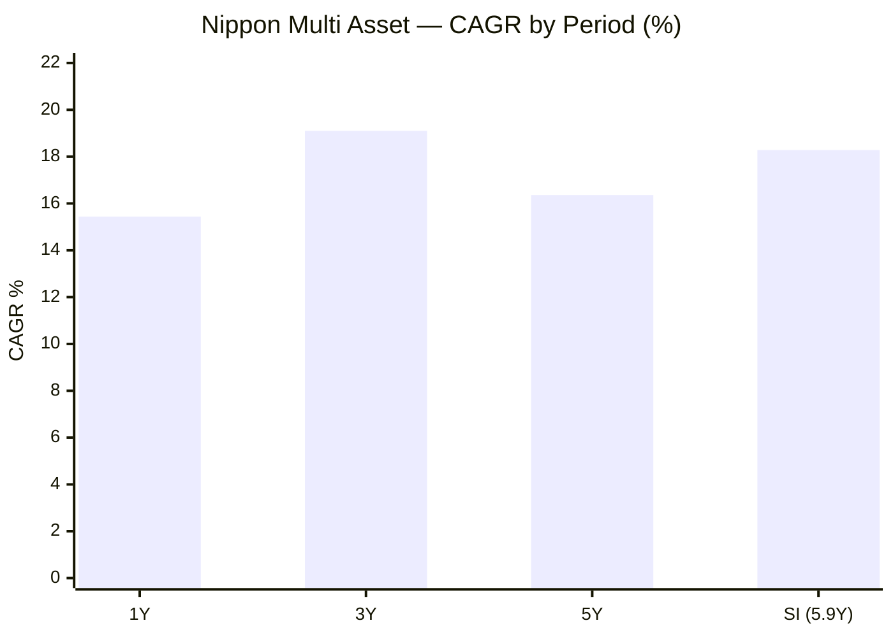
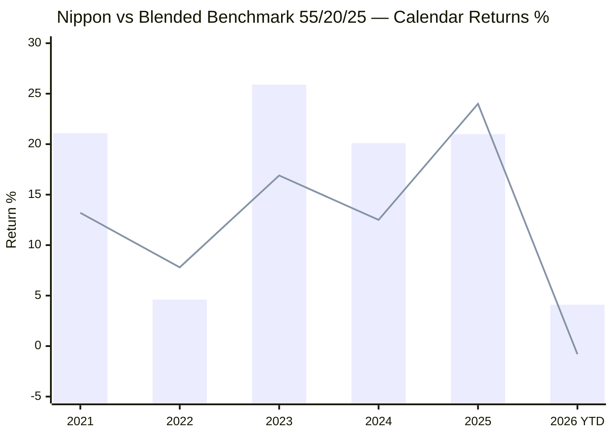
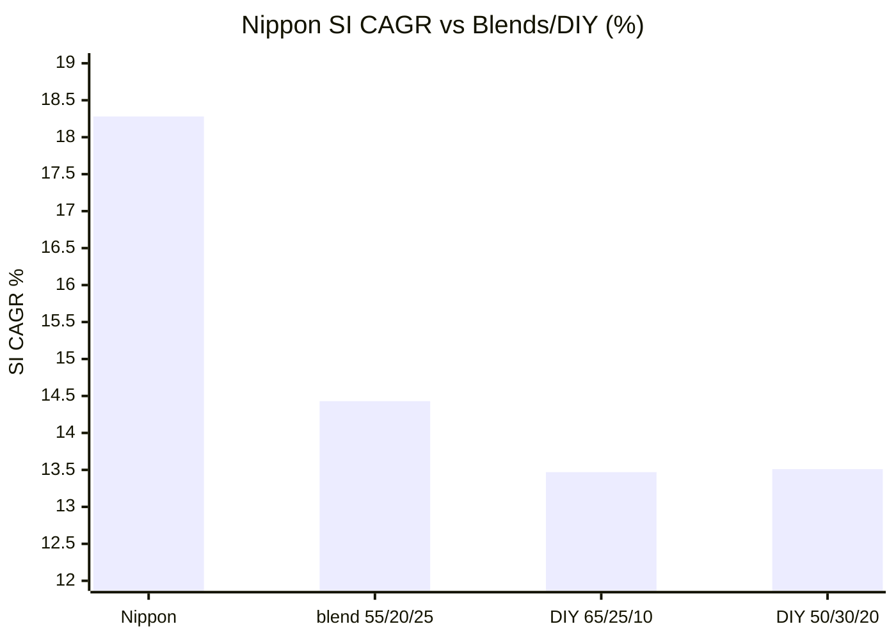
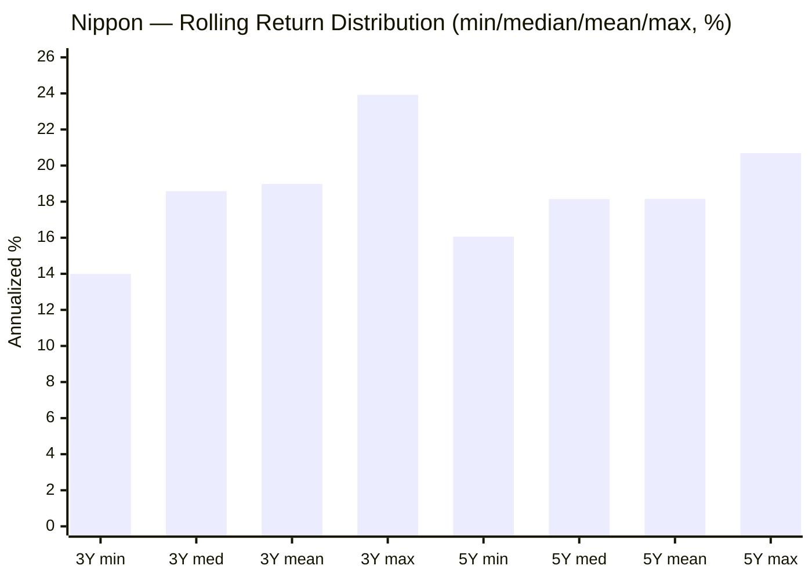
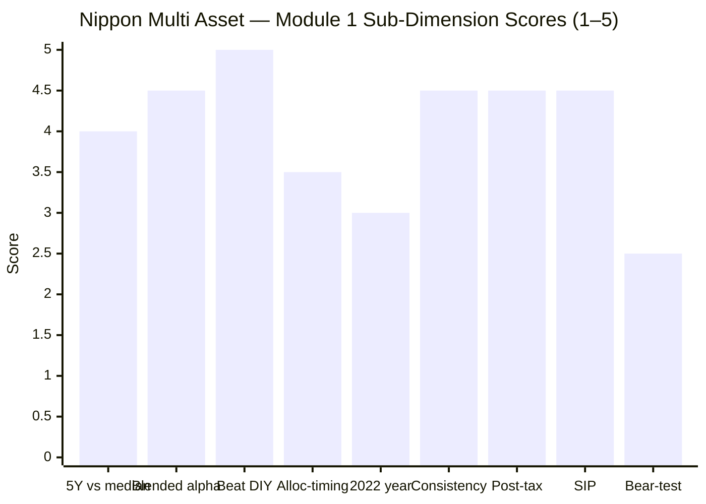
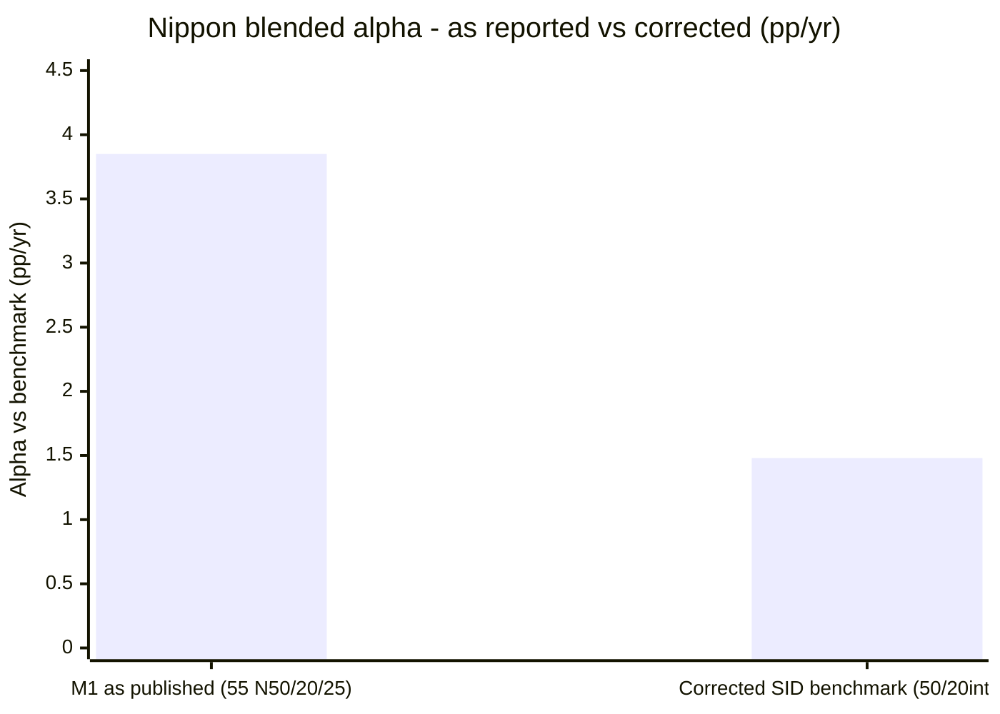

# Module 1: Returns & Allocation Alpha — Nippon India Multi Asset Allocation Fund

> **Provisional Module 1 score: ~4.1 / 5** (weight 20% in the multi-asset re-weight). **Scores are NOT comparable to the four equity categories.**

> **The one-line context:** on returns, Nippon is the anti-SBI. Where SBI's alpha was thin and lumpy (+0.72%/yr), **Nippon beats its blended benchmark by ~+3.85%/yr and a DIY basket by ~+4.8%/yr** — a genuinely large, fairly consistent edge, at the **cheapest ER in the shortlist (~0.27–0.43%)**. The catch, stated up front: it is an **equity-*tilted* multi-asset fund** (net equity ~56%) whose edge came from *riding equity* in a bull run and picking equity well — **not** from defensive allocation. It **lagged** its blend in exactly the two years non-equity mattered most (2022, 2025), and its whole 5.9-year life is a **post-COVID bull market with no severe-bear test** — so the pristine record is partly a regime artifact.

---

## Fund Identity

| Attribute | Detail | Source |
|-----------|--------|--------|
| Full name | Nippon India Multi Asset Allocation Fund — Direct — Growth | AMFI/MFAPI |
| AMC | Nippon Life India Asset Management | — |
| MFAPI scheme code | **148457** | api.mfapi.in/mf/148457 |
| NAV history | **28 Aug 2020 → 29 Jul 2026 (5.9y, 1,455 NAVs)** | MFAPI |
| Inception | **Aug 28, 2020** — a genuine multi-asset fund from day one (no mandate-change baggage, unlike SBI) | VR |
| Stated benchmark | BSE 500 TRI (Tickertape) — a *simplification* (see §critique) | Tickertape/SID |
| Asset mix (screener + factsheet) | Net equity ~56% · debt ~20% · gold+silver ~11% · cash/other ~13% | Tickertape + VR |
| Gold/silver vehicle | **Nippon GOLDBEES ETF (7.8%) + Nippon SILVERBEES ETF (3.0%)** | VR holdings |
| Taxation | **Middle tier — 12.5% LTCG after 2 years** (NOT true equity-oriented; same as SBI) | VR |
| ER (Direct) | **~0.27–0.43%** (VR 0.27% · screener 0.43%) — cheapest in shortlist | VR/Tickertape |
| AUM | ₹16,000 Cr | Tickertape/VR |
| Managers | **Vikram Dhawan (commodities), Vinay Sharma (equity), Sushil Budhia (debt)** — full assessment → M5 | VR/Groww |
| Study flag | Cycle-tested (72mo) — **has 2022 data** (no `no-2022-data` flag), but **no COVID/2018-magnitude bear in its life** | — |

---

## Raw Data (MFAPI-computed + Tickertape, as of 29-Jul-2026)

| Metric | Value | Source |
|--------|-------|--------|
| CAGR 1Y / 3Y / 5Y | **15.44% / 19.10% / 16.36%** | MFAPI |
| CAGR since inception (5.9Y) | **18.28%** | MFAPI |
| Volatility (daily, SI) | **9.52%** | MFAPI |
| Max drawdown (SI) | **−10.78%** (current, since Jan 2026 — no COVID in its life) | MFAPI |
| Rolling 3Y: mean / min / %neg | 18.98% / **+13.99%** / 0.0% | MFAPI (720 windows) |
| Rolling 5Y: mean / min / %neg | 18.15% / **+16.06%** / 0.0% | MFAPI (227 windows) |
| 5Y SIP XIRR (₹10k/mo) | **17.56%** (₹6.0L → ₹9.28L) | MFAPI |
| Blended-benchmark alpha (SI, vs 55/20/25) | **+3.85%/yr** | MFAPI |
| vs DIY 65/25/10 (SI) | **+4.81%/yr** | MFAPI |
| Screening: 5Y / 3Y / Sharpe | 16.4% / 19.2% / 0.88 | Tickertape |

---

## Cross-Source Verification

| Metric | MFAPI | Tickertape | Verdict |
|--------|-------|-----------|---------|
| 5Y CAGR | 16.36% | 16.4% | ✅ Confirmed |
| 3Y CAGR | 19.10% | 19.2% | ✅ Confirmed |
| Volatility | 9.52% (daily SI) | 11.1% (stdDev) | ⚠️ Tickertape higher (recent window); both ~mid — higher than SBI's ~6.6%, consistent with Nippon's higher equity |
| **Alpha (Tickertape)** | — | — | **Ignored** — vs a single equity index (BSE 500); meaningless for a 56%-equity fund. Blended benchmark replaces it |
| ER | VR 0.27% | 0.43% | ⚠️ Range 0.27–0.43%; either way **the cheapest in the shortlist** |

**Reliability: High** on all computed metrics (1,455 NAVs). ER carries a genuine two-source spread (0.27–0.43%) — resolved in M4.

---

## CAGR & the "No Severe Bear" Caveat

An 18.28% since-inception CAGR at 9.5% volatility is a genuinely strong risk-adjusted result — materially higher than SBI's balanced-era 14.5%. **But the entire 5.9-year record (Aug 2020 → 2026) is a post-COVID bull market.** The fund launched *after* the March-2020 crash; it has never lived through a COVID- or 2018-magnitude bear. Its worst-ever drawdown is just −10.78% (the current, ongoing 2026 dip). Compare SBI, which *did* weather COVID (−17.6%). **So Nippon's spotless record is partly a regime artifact** — the "no-GFC/no-dotcom" caveat from the International study, applied here as "no-COVID/no-2018." The 18.28% CAGR should be read as *what a good equity-tilted multi-asset fund did in a favourable window*, not a proven all-weather number.

---

## Calendar-Year Returns — vs Blended Benchmark and SBI

*Blend = 55% Nifty 50 / 20% debt / 25% gold, daily-rebalanced (approximate — the fund's ~56/20/11 mix normalised to 3 assets; gold leg over-weights vs actual ~11%, so treat the blend as a fair-to-generous bar).*

> Bar = Nippon · Line = blended benchmark

| Year | Nippon | Blend | Alpha | Read |
|------|--------|-------|-------|------|
| 2020 (Sep+) | +11.7 | +12.3 | −0.6 | Partial year |
| **2021** | +21.1 | +13.2 | **+7.9** | Rode the equity bull hard |
| **2022** | +4.6 | +7.8 | **−3.2** | ⚠️ **Lagged in the all-diverge year** — higher equity, less gold cushion |
| **2023** | +25.9 | +16.9 | **+9.0** | Big — broad equity + selection |
| **2024** | +20.1 | +12.5 | **+7.6** | Big — strong equity year |
| **2025** | +21.0 | +24.0 | **−3.0** | ⚠️ **Lagged gold's monster year** — under-weight metals |
| 2026 YTD | +4.1 | −0.8 | +4.9 | Holding up as equity softens |

**The pattern is the opposite of SBI's, and it's the module's key finding:** Nippon's large alpha is **concentrated in the equity-bull years (2021, 2023, 2024)** and it **lagged in the two years the non-equity sleeves mattered most (2022 all-diverge, 2025 gold surge).** That is the fingerprint of an **equity-tilted book with good equity selection — not defensive allocation skill.** It wins by *carrying more equity and picking it well* in a rising market. Whether that is repeatable *skill* (selection) or *style* (bull-market beta) is the M3/M5 question — but the 2022/2025 lags rule out "good allocation timing."

---

## The Blended-Benchmark Alpha — Large and Robust

| Benchmark | SI CAGR | Nippon alpha |
|-----------|---------|--------------|
| **Nippon** | **18.28%** | — |
| blend 55/20/25 | 14.43% | **+3.85%/yr** |
| DIY 65/25/10 | 13.47% | **+4.81%/yr** |
| DIY 50/30/20 | 13.51% | **+4.77%/yr** |

The alpha is **large (+3.85 to +4.81%/yr) and robust to blend assumptions** — a real, wide margin over any static basket, unlike SBI's thin +0.5–0.7%. **Two honest caveats:** (1) the equity leg is Nifty 50; part of the "alpha" is a broader/mid-cap equity book beating a large-cap index (equity *style*, not allocation) — the 2021/2023/2024 magnitudes (+7–9pp) point that way; (2) it is earned in a bull-only window. Even discounted for both, the margin is wide enough that Nippon *clearly* clears the DIY bar (framing fact #2) — the central test SBI barely passed.

**Allocation-vs-selection (directional):** selection/equity-tilt dominates; allocation *timing* is neutral-to-negative (lagged 2022/2025). **Asset-class attribution:** the equity sleeve is the engine; gold+silver (~11%) helped less than in a gold-heavy fund (hence the 2025 lag); debt is a small stabiliser. Full split → M3 factsheet reconstruction.

**Post-tax:** Nippon is middle-tier taxed (12.5% after 2 years — same as SBI, confirmed VR), so the DIY comparison is post-tax-neutral on the fund's own tier; its ~+4%/yr pre-tax edge comfortably survives tax (quantified in M4). It beats DIY post-tax by a wide margin — the strongest DIY case of the two funds studied so far.

---

## Rolling Returns & Probability of Loss

| Window | Min | Median | Mean | Max | % negative |
|--------|-----|--------|------|-----|------------|
| 3Y | **+13.99%** | 18.58% | 18.98% | 23.92% | **0.0%** |
| 5Y | **+16.06%** | 18.14% | 18.15% | 20.69% | **0.0%** |

Every rolling 3Y and 5Y window was strongly positive (worst 3Y +14%, worst 5Y +16%). **But this is 720 windows from a single bull regime** — impressive, yet untested by a severe bear. The honest read: the rolling record is *excellent for the conditions it has seen*, and *unproven* for the conditions it hasn't. (SBI's identical "0% negative" record spans COVID and 2022; Nippon's does not span a COVID-magnitude event.)

---

## SIP XIRR — ₹10,000/month

| Horizon | SIP XIRR | Invested | Corpus |
|---------|----------|----------|--------|
| 3Y | 16.37% | ₹3.60L | ₹4.58L |
| **5Y** | **17.56%** | ₹6.00L | ₹9.28L |
| SI (5.9Y) | 17.59% | ₹7.20L | ₹12.23L |

A ₹10k/month SIP grew ₹7.2L → ₹12.23L at 17.6% XIRR over the fund's life — a strong outcome, again with the bull-regime caveat attached.

---

## Comparison with Studied Funds

| Metric | **Nippon MA** | SBI MA (studied) | PP FlexiCap | DSP SmallCap |
|--------|---------------|------------------|-------------|--------------|
| SI / long-run CAGR | 18.28% (5.9y) | 12.42% (13.4y) | ~18.3% (10Y) | 20.85% |
| Volatility | 9.52% | 6.59% (era-blended) | ~12% | ~16% |
| Max drawdown | **−10.78%** (no COVID) | −17.6% (saw COVID) | −31% | −49% |
| Blended-bench alpha | **+3.85%/yr** | +0.72%/yr | (equity) | (equity) |
| Beats DIY basket | **Yes, widely (+4.8%)** | Thinly (+0.5%) | — | — |
| Severe-bear tested? | **No** (post-COVID launch) | Yes (COVID) | Yes | Yes |
| Tax tier | Middle (12.5%/2yr) | Middle (12.5%/2yr) | Equity | Equity |

**Nippon vs SBI (the head-to-head that matters):** Nippon wins decisively on *return, alpha, and DIY-margin*, and is far cheaper (0.27–0.43% vs 0.51–0.68%). SBI wins on *defensiveness and battle-testing* (lower vol, saw COVID, cushioned 2022 better). They are different products: Nippon is **equity-plus** (higher return, higher risk, bull-proven), SBI is **defensive-balanced** (lower return, lower risk, cycle-proven). On Module 1 (returns), Nippon is clearly ahead.

---

## Points For / Points Against — Returns

### ✅ For
1. **Large, robust blended-benchmark alpha (+3.85 to +4.81%/yr)** — clearly beats every DIY static basket, the study's central test.
2. **18.28% SI CAGR at 9.5% vol** — strong risk-adjusted return; SI SIP 17.6%.
3. **Fairly consistent outperformance** — beat the blend in 4 of 6 full years (2021, 2023, 2024, 2026).
4. **Cheapest ER in the shortlist (~0.27–0.43%)** — flatters net returns structurally.
5. **0% negative 3Y/5Y windows** (worst 3Y +14%).
6. **Beats DIY post-tax by a wide margin** — the strongest DIY case studied so far.

### ❌ Against
1. **No severe-bear test** — launched post-COVID (Aug 2020); the −10.78% max DD and pristine rolling record are partly a bull-regime artifact.
2. **Equity-*tilted*, not defensively allocated** — lagged the blend in the two years non-equity mattered most (2022 −3.2, 2025 −3.0); the alpha is equity carry + selection, not allocation timing.
3. **Alpha is partly equity *style*** — the 2021/2023/2024 magnitudes (+7–9pp vs a Nifty-50 leg) suggest a broad/mid-cap tilt, not pure skill (→ M3).
4. **Short history (5.9y)** — less multi-cycle evidence than SBI's 13.4y (even if SBI's is era-blended).
5. **Higher volatility (9.5%)** than SBI — the cost of the equity tilt.

---

## Module 1 Scorecard

| Sub-dimension | Score | Reasoning |
|---------------|-------|-----------|
| 5Y CAGR vs category median | **4.0** | 16.36% vs 14.45% median — clearly above |
| Alpha vs blended benchmark | **4.5** | +3.85%/yr, robust, fairly consistent (docked for equity-style component) |
| Beat the DIY static basket | **5.0** | +3.85 to +4.81%/yr — wide, robust margin |
| Allocation-timing contribution | **3.5** | Lagged 2022/2025; edge is equity carry+selection, not timing |
| 2022 asset-divergence year | **3.0** | +4.6% positive but lagged blend −3.2 (under-cushioned) |
| Consistency (rolling) | **4.5** | 0% negative 3Y/5Y; worst 3Y +14% — but bull-only regime |
| Post-tax return | **4.5** | Middle-tier taxed; beats DIY post-tax widely |
| SIP XIRR quality | **4.5** | SI SIP 17.6%, ₹7.2L→₹12.23L |
| Severe-bear test / inception bias | **2.5** | No COVID/2018 in its life — record partly a regime artifact |
| **Module 1 Overall** | **~4.1 / 5** | Strong, cheap, DIY-beating returns with genuine (if partly style/beta) alpha — held back from higher by the missing bear test, the equity tilt, and the 2022/2025 non-equity lags |

---

## Comparative Module 1 Scores (studied funds)

| Fund | Module 1 | Character |
|------|----------|-----------|
| DSP SmallCap | 4.5 | High alpha + crash resilience |
| Edelweiss MidCap | ~4.2 | Genuine consistent alpha |
| **Nippon Multi Asset** | **~4.1** | **Large DIY-beating alpha, cheap; but bull-only and equity-tilted** |
| SBI Multi Asset | 3.6 | Reliable, thin lumpy non-skill alpha |

> Nippon's 4.1 vs SBI's 3.6 is the return-side verdict: **Nippon is the stronger *returns* fund by a clear margin** — more alpha, cheaper, beats DIY widely. The equity studies' scores aren't comparable (different job); within multi-asset, Nippon leads on Module 1.

---

## SIP Implication

For a ₹15–20k/month SIP, Nippon offers what SBI could not: a genuine, wide margin over doing it yourself (~+4%/yr), at the cheapest fee in the category, with a strong compounding record (SI SIP 17.6%). The honest asterisks are that (a) you are buying an **equity-tilted** multi-asset fund — expect it to fall more than SBI in a real bear (it has never seen one), and (b) its diversification/cushioning is weaker (it lagged in 2022 and under-owned gold in 2025). If the goal is *maximum through-cycle return with some smoothing*, Module 1 says Nippon is the better engine; if the goal is *maximum drawdown protection*, that is M2's call and SBI may reclaim ground. The DIY question — so central for SBI — is largely answered *for* Nippon on returns: it clears the bar comfortably. Whether that survives a bear, and whether the alpha is skill or style, are the open threads.

## One-Line Verdict

**The strongest *returns* fund in the study so far — a large, robust ~+4%/yr edge over any DIY basket at the cheapest fee in the shortlist — but it is an equity-*tilted* book that won by carrying and picking equity well in a bull run, lagged in the very years (2022, 2025) that non-equity mattered, and has never faced a severe bear; its pristine record is real but regime-flattered.**

---

*Module 1 complete. Provisional score 4.1/5. Method: self-computed from MFAPI 148457 (1,455 NAVs, 28-Aug-2020 → 29-Jul-2026); blended benchmark & DIY baskets from Nifty 50 (120620) / ICICI All Seasons Bond (120603) / SBI Gold (119788); factsheet (ER, tax, holdings, managers) from ValueResearch/Groww. **Cross-fund note:** Nippon and SBI are opposite tilts — Nippon equity-plus (return leader), SBI defensive-balanced (risk leader). **Handoffs:** equity-style-vs-skill decomposition + international/gold split → M3; the wide DIY edge post-tax → M4 (with the shared middle-tier finding); severe-bear behaviour is unobservable (flagged) → M2 must lean on 2022 + the current 2026 dip. First module for this fund — no retrofit.*

*Next: [Module 2 — Risk Profile](module2_risk.md)*

---

# ⚠ ADDENDUM (Aug 2026) — Missing Dimensions Added, and a Material Benchmark Correction

> **Why this addendum exists.** A study-wide audit found Nippon's write-up to be one of the two thinnest of the seven funds (1,467 lines, 24 charts) and — like the four other early studies — **built entirely from aggregators, never from the scheme's primary documents.** This section closes that gap. **The Scheme Information Document has now been retrieved and read, and it shows the blended benchmark used throughout this module was materially wrong.**

## A1. ⭐ The Real Benchmark — from the SID, verbatim

> **"AMFI Tier I Benchmark - 50% of BSE 500 TRI, 20% of MSCI World Index TRI, 15% of CRISIL Short Term Bond Index, 10% of Domestic prices of Gold & 5% of Domestic prices of Silver"**
> — *Nippon India Multi Asset Allocation Fund SID (AMFI portal doc 12137), Part I §VII, verbatim*

**This module used a three-leg blend of 55% Nifty 50 / 20% debt / 25% gold. Three things were wrong with it:**

| Error | Effect |
|---|---|
| **Nifty 50 used instead of BSE 500** | Nifty 50 returned **14.78%/yr** over this window vs Nifty 500's **17.51%** — a **2.73pp/yr** understatement of the equity leg |
| **⚠ The 20% international leg was omitted entirely** | MSCI World (S&P 500 proxy) returned **19.22%/yr — the best-performing leg of all.** Dropping a 20% weight in the highest-returning asset understated the benchmark badly |
| **Gold weighted 25% vs the benchmark's 10% gold + 5% silver** | Partially offsetting, since gold returned 17.58% |

### The corrected alpha

| Benchmark construction | CAGR | **Nippon alpha** |
|---|---|---|
| **Nippon India Multi Asset** | **18.34%** | — |
| ❌ *M1 as published* — 55% Nifty 50 / 20% debt / 25% gold | 14.49% | ~~+3.85%/yr~~ |
| ✅ **SID benchmark** — 50% BSE500 / 20% intl / 15% ST bond / 15% precious | **16.86%** | **+1.48%/yr** (daily) · **+1.39%/yr** (annual) |
| Robustness: 55/15/15/15 | 16.73% | +1.61% |
| Robustness: 45/25/15/15 | 16.98% | +1.36% |
| *No-international control (70/15/15)* | *16.27%* | *+2.08% — the intl leg alone accounts for ~0.6pp* |

**The alpha is overstated in the published module by roughly 2.4 percentage points — about 60% of the reported figure.** Corrected, it is **+1.36% to +1.61%/yr** — tight and robust, but a different order of claim.

**This also reorders the study.** On like-for-like Nifty-500 legs: **ICICI +4.01%/yr · WOC +1.92%/yr · Nippon +1.39–1.48%/yr.** The published module described Nippon's edge as *"large… unlike SBI's thin +0.5–0.7%"*; corrected, it sits **below WOC and well below ICICI.**

### The corrected DIY test

| | CAGR | **Nippon edge** |
|---|---|---|
| ❌ *M1 as published* — DIY 65/25/10, Nifty-50 leg | 13.53% | ~~+4.81%/yr~~ |
| ✅ **DIY 65/25/10, Nifty-500 + short-duration-debt legs** | **15.11%** | **+3.23%/yr** (daily) · **+2.92%/yr** (annual) |

**Nippon still clears the DIY bar comfortably — but by ~2.9–3.2pp/yr, not ~4.8pp.**

## A2. ⚠ Score Corrections

| Sub-dimension | Was | **Now** | Reason |
|---|---|---|---|
| Alpha vs blended benchmark | 4.5 | **3.5** | Alpha is **+1.39–1.48%/yr**, not +3.85%. Guide: 1–2% = 4; docked half a point further because the published figure rested on a benchmark missing the fund's own 20% international leg |
| Beat the DIY static basket | 5.0 | **4.0** | **+2.92–3.23%/yr**, not +4.81%. Still a clear, robust win — no longer an exceptional one |
| **Module 1 Overall** | **~4.1** | **⚠ ~3.8 / 5** | The return record is unchanged and still good; the *margin over the right yardstick* is materially smaller than published |

**What does not change:** the CAGR ladder, the rolling-return distribution (0% negative at 3Y/5Y), the SIP XIRR, the 2022 lag, and the severe-bear caveat. **This correction is about the benchmark, not the fund's returns.**

---

*Addendum complete. **Method:** benchmark taken **verbatim from the SID** (AMFI portal doc 12137, text-extracted); corrected blend built from Motilal Oswal Nifty 500 Index (**147625**) as the BSE-500 proxy, **Motilal Oswal S&P 500 Index (148381)** as the MSCI-World proxy, HDFC Short Term Debt (**119016**) as the CRISIL-ST-Bond proxy, and SBI Gold (**119788**) carrying the 10% gold + 5% silver legs (silver folded into gold because the Nippon Silver ETF FoF series begins Feb-2022, after this fund's Aug-2020 inception — flagged as an approximation). **Retrofit chain:** this correction feeds M3 (the international sleeve is ~12.8% effective, not the ~5% assumed) and M4 (the DIY margin narrows but the verdict holds).*
