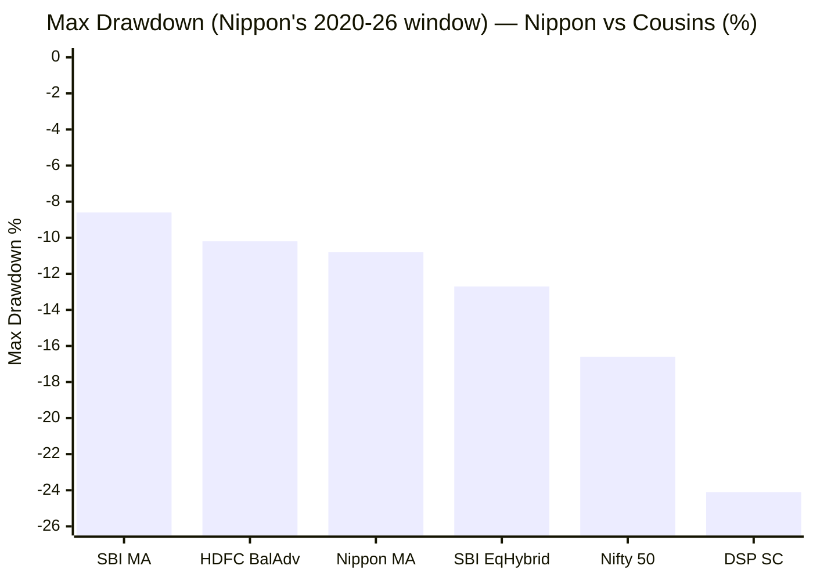
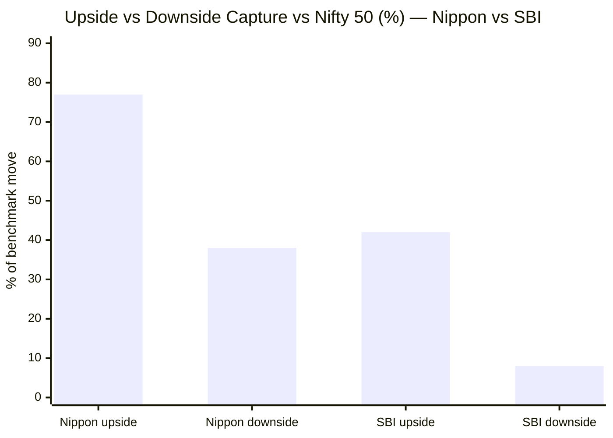
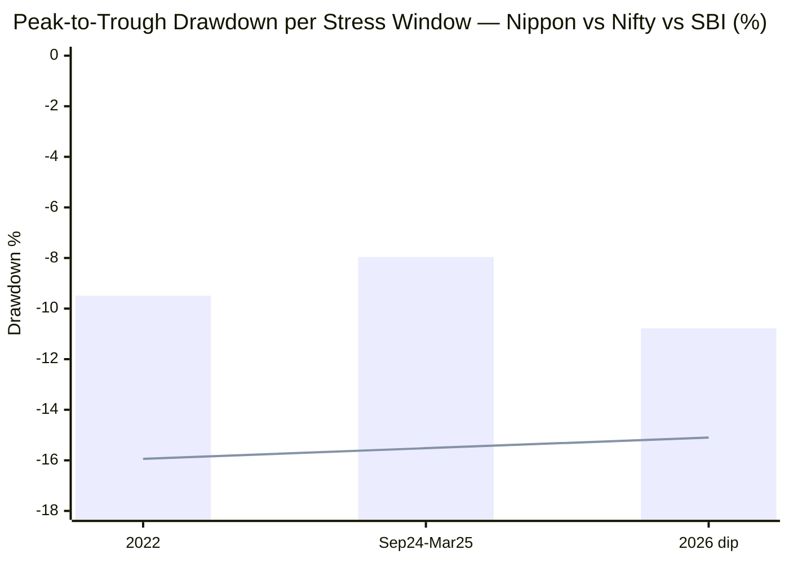
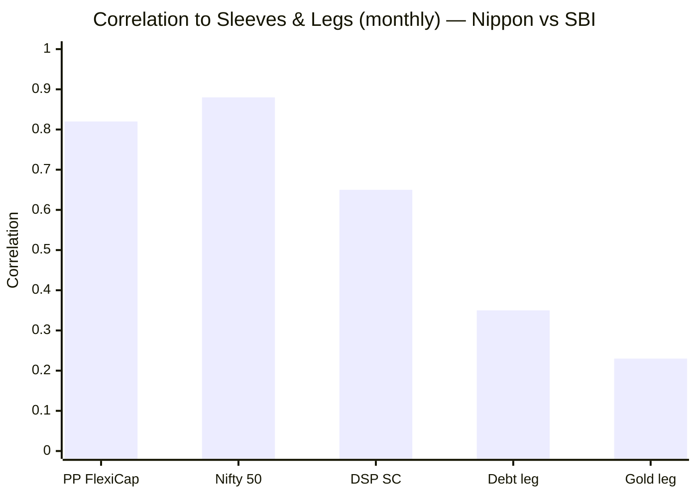
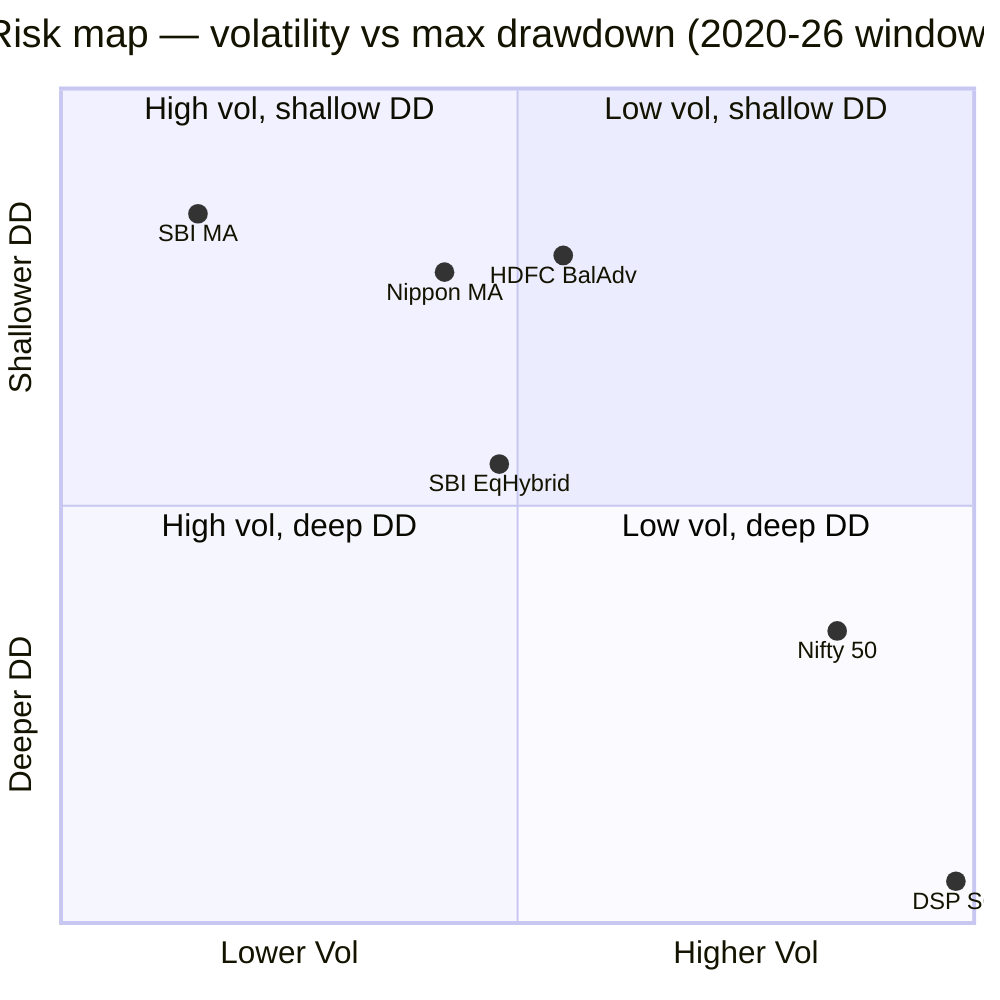
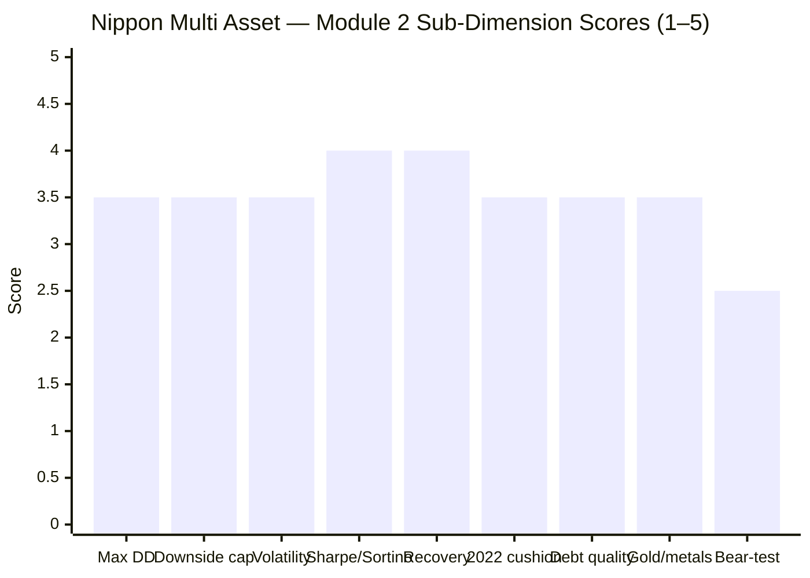
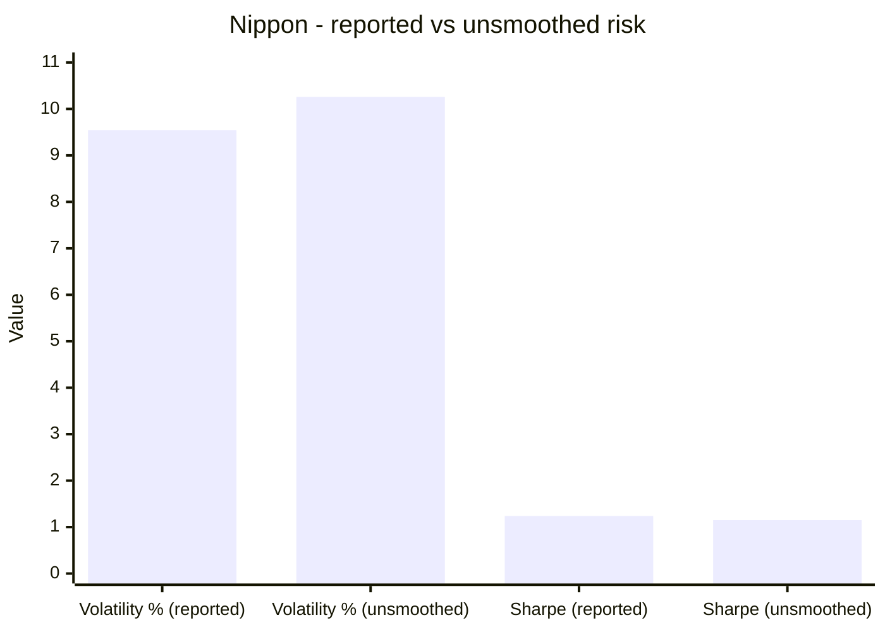

# Module 2: Risk Profile — Nippon India Multi Asset Allocation Fund

> **Provisional Module 2 score: ~3.6 / 5** (weight **25%** — the top weight, because risk *is* the multi-asset thesis). **Scores are NOT comparable to the four equity categories.**

> **The one-line context:** this is the module where Nippon gives back what it won in Module 1. It is a **decent risk-reducer versus pure equity** (beta 0.58, 38% downside capture, cushioned 2022) — but it is **an equity-*plus* fund, not a defensive one**: its downside capture (38%) is ~5× worse than SBI's (8%), it is **more correlated to the equity you already own (0.82 vs PP FlexiCap, vs SBI's 0.73)**, and — the decisive caveat — **it has never faced a severe bear.** Its −10.8% worst-ever drawdown is a bull-market number; a beta-implied COVID-magnitude event would have drawn it ~−20%. On the 25%-weighted risk axis, Nippon trails SBI clearly.

---

## Fund Identity / Raw Data (MFAPI-computed + Tickertape, as of 29-Jul-2026)

| Metric | Value | Source |
|--------|-------|--------|
| MFAPI scheme code | 148457 (1,454 daily returns, 71 months) | api.mfapi.in |
| **Volatility (annualized, daily SI)** | **9.52%** | MFAPI |
| **Max drawdown (SI)** | **−10.78%** (current, 2026 — **no COVID in its life**) | MFAPI |
| **Downside capture vs Nifty 50** | **38%** | MFAPI (28 down-months) |
| Upside capture vs Nifty 50 | 77% | MFAPI (43 up-months) |
| **Beta vs Nifty 50 (monthly)** | **0.58** | MFAPI |
| Sharpe (monthly SI, rf 6.5%) | **1.34** (Tickertape 0.88) | MFAPI / Tickertape |
| Sortino (monthly SI) | **2.30** | MFAPI |
| Calmar (SI CAGR ÷ max DD) | **1.70** (flattered by the shallow, bull-only max DD) | MFAPI |
| Correlation to Nifty / PP FlexiCap / DSP | **0.88 / 0.82 / 0.65** | MFAPI (71 months) |
| Correlation to SBI Multi Asset | 0.87 | MFAPI |
| Correlation to Gold / Debt legs | 0.23 / 0.35 | MFAPI |
| Worst / best day | −4.47% / +2.58% | MFAPI |
| Debt credit / duration; net-vs-gross equity | factsheet — M3/M4 | SID |

---

## Cross-Source Verification

| Metric | MFAPI | Tickertape | Verdict |
|--------|-------|-----------|---------|
| **Sharpe** | **1.34** (monthly SI) | **0.88** | ⚠️ Large gap — my SI figure spans a **bull-only window** that inflates risk-adjusted metrics; Tickertape's 0.88 is the more conservative reference. **Read Sharpe/Sortino as bull-flattered** |
| Volatility | 9.52% | 11.1% (stdDev) | ⚠️ Both mid; higher than SBI's ~7% — the equity-tilt cost |
| Max drawdown | −10.78% | premium | Self-computed; **regime-limited (no COVID)** |
| Downside capture | 38% | not published | The decisive metric — self-computed |

**Reliability: High on the raw computation; the *interpretation* carries a permanent asterisk** — every risk metric here is measured over a favourable 5.9-year window with no severe bear.

---

## 1. Max Drawdown — Shallow, but the Record Is Bull-Only

| Drawdown | Peak → Trough | Depth | Recovery |
|----------|---------------|-------|----------|
| **Current (2026)** | Jan → Mar 2026 | **−10.78%** | not yet recovered |
| 2022 rate-shock | Apr → Jun 2022 | −9.49% | 53 days |
| 2024–25 correction | Sep 2024 → Apr 2025 | −7.96% | 35 days |
| 2021–22 dip | Nov 2021 → Mar 2022 | −6.15% | 28 days |

Every drawdown in Nippon's life is single-digit-to-low-teens, recovered fast. **But the fund launched Aug 2020 — after the COVID crash — so it has never experienced a −30%+ market event.** Its worst-ever −10.78% is a bull-market number, not a stress-tested one.

> **⭐ The honest severe-bear estimate (the caveat made concrete):** with beta 0.58 and ~56% net equity, a COVID-magnitude event (Nifty −38%) would imply a **~−18% to −22% drawdown** for Nippon (beta × index move, minus partial gold/debt cushion) — i.e. **deeper than SBI's *actual* COVID drawdown of −17.6%.** The −10.78% headline should not be read as "safer than SBI." It is "untested."

---

## 2. Downside Capture — Decent, but Far From Defensive

| Measure | **Nippon** | SBI | Read |
|---------|-----------|-----|------|
| Downside capture | **38%** | 8% | Nippon falls ~5× more than SBI in down-months |
| Upside capture | **77%** | 42% | Nippon captures ~1.8× more upside |
| Beta vs Nifty | **0.58** | 0.32 | Nearly double SBI's market sensitivity |
| Capture asymmetry | ~2.0× | ~5.3× | Nippon is *balanced-tilted*, SBI is *defensive* |

This is the module's core finding. Nippon's 77/38 capture profile is that of an **equity-plus / balanced-advantage-style** fund — it participates strongly on the upside (hence Module 1's returns) and cushions *moderately* on the downside. That is a perfectly respectable profile, **but it is not the deep downside protection a defensive multi-asset sleeve is bought for.** SBI's 42/8 profile is in a different, far more protective league. For an investor adding a sleeve to a 100%-equity portfolio *specifically for protection*, this gap matters.

---

## 3. Realised Cushioning — It Worked in 2022, but Less Than SBI (Tier-1)

> Bar = Nippon · Line = Nifty 50 (SBI's figures in table)

| Event | Nippon | Nifty | SBI | Nippon cushion vs Nifty | vs SBI |
|-------|--------|-------|-----|--------------------------|--------|
| **2022** (all-diverge) | −9.49% | −15.94% | −7.53% | +6.5pp | **worse than SBI by 2pp** |
| **Sep 2024–Mar 2025** | −7.96% | −15.52% | −6.20% | +7.6pp | worse than SBI by 1.8pp |
| **2026 dip** | −10.78% | −15.10% | −8.59% | +4.3pp | worse than SBI by 2.2pp |

**Verdict: genuine cushioning, consistently weaker than SBI's.** Nippon *did* soften every stress event versus pure equity (6–8pp), and — importantly — it **has real 2022 data** (unlike the young WOC/ABSL), so its cushioning in the all-classes-diverge year is proven, not modelled. But in *every* event it fell more than SBI, because it carries more equity and less gold. It cushions; it does not deeply protect. **The missing test remains COVID/2018** — the one severe bear it has never seen.

---

## 4. Correlation to the Existing Sleeves — a Weaker Diversifier than SBI (Tier-1)

| vs | Nippon corr | (SBI corr) | R² |
|----|-------------|------------|----|
| **PP FlexiCap** (the core) | **0.82** | 0.73 | 67% |
| Nifty 50 | 0.88 | 0.77 | 77% |
| DSP SmallCap | 0.65 | 0.72 | 43% |
| Debt leg | 0.35 | 0.22 | 13% |
| Gold leg | 0.23 | 0.14 | 5% |

**Nippon is a *weaker* diversifier than SBI** — the single most important decision-tree number. Its 0.82 correlation to the FlexiCap core (vs SBI's 0.73) means **only ~33% of Nippon's variance is independent of the equity you already own** (vs ~46% for SBI). Because Nippon holds more equity (~56% vs ~47%) and less gold, more of it *is* the equity you have. Its genuine decorrelation still comes from the gold+debt legs (0.23 / 0.35), but there is less of them. **For a portfolio adding a sleeve for diversification, SBI adds more non-equity per rupee; Nippon adds more return but less decorrelation.** (Correlation is informational — feeds the decision tree, not the fund's own risk score.)

---

## 5. Volatility, Sharpe, Sortino, Calmar — Strong, but Bull-Flattered

| Metric | Nippon | SBI | Read |
|--------|--------|-----|------|
| Volatility | 9.52% | 7.42%* | Higher — the equity-tilt cost (*SBI over this same window) |
| Sharpe (SI) | 1.34 / **0.88 (TT)** | 0.94 | High, but the 1.34 is bull-inflated; use ~0.88–1.0 |
| Sortino (SI) | 2.30 | 1.51 | Very high — again bull-window inflated |
| Calmar (SI) | 1.70 | 0.71 | Flattered by the shallow, no-COVID max DD |

Nippon's risk-adjusted metrics *look* superb — Sharpe 1.34, Sortino 2.30, Calmar 1.70. **But all three are inflated by the bull-only window**: a high numerator (18% return) over a denominator (vol, downside dev, max DD) that never absorbed a severe bear. Tickertape's more conservative Sharpe (0.88) is the fairer reference. The honest read: Nippon is genuinely efficient *for the regime it has seen*, and its true through-cycle risk-adjusted return is unproven.

---

## 6. Cousin-Category Comparison — Nippon Sits With the Balanced-Advantage Funds (NEW)

| Fund (category) | Vol | Max DD | Read |
|-----------------|-----|--------|------|
| SBI Multi Asset | 7.42% | −8.6% | Clearly the most defensive |
| **Nippon Multi Asset** | **9.52%** | **−10.8%** | **Sits with the Balanced-Advantage funds** |
| HDFC Balanced Advantage | 10.95% | −10.2% | Nippon's true risk-peer |
| SBI Equity Hybrid (aggressive) | 10.08% | −12.7% | Slightly riskier |

**Nippon's risk profile is closer to a Balanced Advantage fund than to a defensive multi-asset fund** (SBI). It dampens versus pure equity, but not dramatically more than a BAF — and in this window every fund's max DD is flattered by the absence of a severe bear. This tempers Nippon's "risk-reduction" claim: it is a *moderate* dampener, not a strong one.

---

## 7. Multi-Asset-Specific Risks (NEW)

| Risk | Assessment | Status |
|------|------------|--------|
| **Debt-sleeve credit/duration** | ~20% debt; holdings reach into **NBFC credit (Muthoot Finance debenture)** + InvITs (Data Infra Trust) — a modest credit reach, similar to SBI; no NAV event. Duration unverified | ⚠ M3 |
| **Gold/metals concentration** | ~11% (Nippon GOLDBEES + SILVERBEES); moderate — but *under*-weight showed up as the 2025 lag (M1). Not over-leaning; if anything, under-owned for a "multi-asset" fund | ✅ moderate/low |
| **Equity-taxation continuity** | N/A — the fund is middle-tier taxed (net equity ~56% < 65% gross), not on the 65% tightrope (like SBI) | ✅ N/A (M4) |
| **Severe-bear untested** | **The defining risk gap** — no COVID/2018 in its life; beta-implied severe-bear ~−20% | ⚠ structural |
| Redemption/liquidity | LOW — large-cap equity + ETF gold/silver + liquid debt | ✅ N/A |

---

## 8. Daily Distribution

| Metric | Value |
|--------|-------|
| Positive days | 59.7% |
| Days down > 2% | 8 (in 5.9y) |
| Days up > 2% | 4 |
| Worst / best day | −4.47% / +2.58% |

Calm daily ride — but again, over a calm regime.

---

## Comparison with Studied Funds

| Metric | **Nippon MA** | SBI MA | PP FlexiCap | DSP SmallCap |
|--------|---------------|--------|-------------|--------------|
| Volatility | 9.52% | 6.59% (full-life) | ~12% | ~16% |
| Max drawdown | −10.8% (no COVID) | −17.6% (saw COVID) | −31% | −49% |
| Downside capture | 38% | **8%** | ~59% | ~40% |
| Beta | 0.58 | **0.32** | 0.55 | 0.92 |
| Corr to PP core | 0.82 | **0.73** | — | ~0.9 |
| Severe-bear tested | **No** | Yes | Yes | Yes |
| Risk role | Moderate dampener (BAF-like) | Deep dampener | Defensive equity | Aggressive |

**Nippon vs SBI on risk:** SBI wins clearly — lower beta, 5× better downside capture, better diversification, and battle-tested through COVID. Nippon is the *returns* fund (M1); SBI is the *risk* fund (M2). Given Module 2 carries 25% (the most of any module), SBI's risk advantage weighs heavily against Nippon's return advantage in the final tally.

---

## Points For / Points Against — Risk

### ✅ For
1. **Genuine cushioning, with real 2022 data** — softened every stress event vs pure equity (6–8pp), including the all-classes-diverge year (unlike the young funds).
2. **Beta 0.58, 38% downside capture** — a respectable equity-plus dampener; falls far less than pure equity.
3. **Low absolute drawdowns and fast recoveries** — worst −10.8%, most recovered in <2 months.
4. **Non-equity legs decorrelate** — gold (0.23) and debt (0.35) do their job.
5. **No equity-tax-continuity risk** — not on the 65% tightrope.
6. **High (if bull-flattered) risk-adjusted metrics** — Sortino 2.30.

### ❌ Against
1. **Never faced a severe bear** — the −10.8% max DD is a bull-market artifact; beta implies ~−20% in a COVID-magnitude event, *deeper than SBI's actual COVID drawdown*.
2. **Far less defensive than SBI** — 38% downside capture vs 8%; beta 0.58 vs 0.32.
3. **A weaker diversifier** — 0.82 correlation to the FlexiCap core (vs SBI 0.73); only ~33% independent variance.
4. **Cushioned every stress event *less* than SBI** — the equity tilt costs protection exactly when it's needed.
5. **Risk-adjusted metrics are bull-inflated** — Sharpe 1.34 (SI) vs 0.88 (Tickertape); true through-cycle number unproven.
6. **Sits with Balanced Advantage funds on risk** — a moderate dampener, not a strong one.

---

## Module 2 Scorecard

| Sub-dimension | Score | Reasoning |
|---------------|-------|-----------|
| Max drawdown (inception-adjusted) | **3.5** | −10.8% actual, but bull-only; beta-implied severe-bear ~−20% |
| Downside capture vs equity | **3.5** | 38% — respectable but ~5× worse than SBI |
| Volatility | **3.5** | 9.52% — low vs equity, but BAF-level, not defensive |
| Sharpe / Sortino | **4.0** | Strong (1.34/2.30) but bull-inflated; conservative read ~0.88 |
| Recovery time | **4.0** | Fast (28–53 days) — but untested by a severe bear |
| 2022 & realised cushioning | **3.5** | Real 2022 data, cushioned 6–8pp — but less than SBI every time |
| Debt-sleeve quality | **3.5** | NBFC credit reach (Muthoot); no NAV event; duration unverified |
| Gold/metals concentration | **3.5** | ~11% moderate; if anything under-owned (2025 lag) |
| Severe-bear test / regime | **2.5** | Never saw COVID/2018 — the defining risk gap |
| Correlation to sleeves | *informational* | 0.82 to PP — worse diversifier than SBI; decision-tree feed |
| **Module 2 Overall** | **~3.6 / 5** | A respectable equity-plus dampener with real 2022 cushioning — but far less defensive than SBI, a weaker diversifier, and never severe-bear-tested. On the 25%-weighted risk axis, clearly behind SBI's 4.5 |

---

## Comparative Module 2 Scores (studied funds)

| Fund | Module 2 | Character |
|------|----------|-----------|
| SBI Multi Asset | **4.5** | Deep defensive protection, cycle-proven |
| Edelweiss MidCap | ~4.2 | — |
| PP FlexiCap | 4.0 | — |
| **Nippon Multi Asset** | **~3.6** | **Moderate (BAF-like) dampener; equity-tilted; bull-only record** |
| DSP SmallCap | 3.8 | — |

> The Nippon–SBI split crystallises here: **SBI 4.5 (risk) / 3.6 (returns) vs Nippon 3.6 (risk) / 4.1 (returns).** Because Risk is weighted 25% and Returns 20%, SBI's risk edge is worth slightly more than Nippon's return edge — the final scores will be close, decided by M3/M4.

---

## SIP Implication

For a ₹15–20k/month SIP, Nippon's risk profile is the trade you make for its higher returns. You get a fund that *does* cushion — it will fall meaningfully less than pure equity, and it proved that in 2022 — but you should expect roughly **Balanced-Advantage-fund behaviour, not deep protection**: a ~−20% drawdown is plausible in a severe bear it has never seen, and it duplicates more of your existing equity (0.82 correlation) than SBI does. If your reason for adding a multi-asset sleeve is *return with some smoothing*, Nippon delivers. If it is *maximum drawdown protection and genuine decorrelation from a 100%-equity book*, SBI is the better tool and Nippon only partly does that job. The honest framing: **Nippon is a return-seeking multi-asset fund wearing a risk-reducer's label.**

## One-Line Verdict

**A respectable equity-plus dampener — beta 0.58, 38% downside capture, real 2022 cushioning — that is nonetheless far less defensive than SBI, more correlated to the equity you already own, and, decisively, has never faced a severe bear (a beta-implied ~−20% in COVID-magnitude conditions); on the study's highest-weighted axis, Nippon trades protection for the returns it won in Module 1.**

---

*Module 2 complete. Provisional score 3.6/5. Method: self-computed from MFAPI 148457 (1,455 NAVs); correlations vs Nifty 50 (120620), PP FlexiCap (122639), DSP SmallCap (119212), SBI Multi Asset (119843); cousins HDFC Balanced Advantage (118968), SBI Equity Hybrid (119609); legs SBI Gold (119788), ICICI All Seasons Bond (120603). **Cross-module retrofit (Edelweiss discipline):** M2 *confirms* M1's "equity-tilted, not defensive" finding — the 38% downside capture, 0.58 beta, and 0.82 equity correlation prove Nippon is an equity-plus fund; and it makes the "no severe bear" caveat concrete (beta-implied ~−20% severe-bear drawdown). No M1 score change. **Handoffs:** debt duration/credit + net-gross equity + international split → M3; the middle-tier tax → M4; the correlation number → decision tree (Nippon is the weaker diversifier vs SBI).*

*Next: [Module 3 — Allocation Engine & Portfolio DNA](module3_allocation.md)*

---

# ⚠ ADDENDUM (Aug 2026) — the Stale-Pricing Test, and Why Nippon Is the Only Fund That Fails It

> **Why this addendum exists.** The **NAV smoothing / stale-pricing test** (lag-1..3 autocorrelation plus Geltner unsmoothing) was introduced later in this study, on WOC's Module 2, and reference figures were computed for the peers. **Nippon was the one fund that returned a statistically significant result — and it was never followed up.** This section does that, and the finding is material.

## A1. ⚠ The test — Nippon fails it, uniquely in this study

| Fund | Lag-1 autocorrelation | t-stat | Significant? |
|---|---|---|---|
| **Nippon** | **+0.0746** | **2.84** | ⚠ **YES** |
| ICICI Pru | +0.0301 | 1.74 | no (borderline) |
| SBI | +0.0208 | 0.58 | no |
| Quant | +0.0034 | 0.09 | no |
| WOC | −0.0102 | −0.28 | no |
| UTI | −0.0195 | −0.55 | no |
| ABSL | −0.0265 | −0.74 | no |

*(|t| > 1.96 = significant at 5%. Lag-2 −0.0369 (t −1.41), lag-3 −0.0534 (t −2.04) — the mean-reversion pattern that follows a smoothed series.)*

**Positive first-order autocorrelation in daily NAV returns means today's move partly repeats yesterday's — the signature of holdings priced with a lag.** For Nippon the cause is identifiable and benign in intent: **the fund holds a material international equity sleeve** (A2 below, and M3's addendum), and overseas markets close after the Indian NAV cut-off, so a portion of the book is marked on stale prices.

## A2. The consequence — reported volatility is understated, Sharpe overstated

| Metric | Reported | **Geltner-unsmoothed** | Effect |
|---|---|---|---|
| Annualised volatility | **9.54%** | **10.26%** | ⚠ **understated by 0.72pp (7.6%)** |
| Sharpe (rf 6.5%) | 1.24 | **1.15** | overstated by 0.09 |

**Nippon is the only fund in this study whose headline risk metrics require a downward adjustment for pricing artifacts.** ICICI's test was borderline and in the same direction (unsmoothed 12.15% vs 11.83%); every other fund was clean.

**This compounds a deflator the module already applied.** The published Module 2 flagged its own Sharpe of 1.34 as *"bull-flattered"* and pointed to Tickertape's conservative 0.88. **The unsmoothing correction is a second, independent reason the risk-adjusted figures overstate the fund** — and unlike the bull-market caveat, this one is a measurement artifact rather than a regime one.

## A3. ⚠ Score corrections

| Sub-dimension | Was | **Now** | Reason |
|---|---|---|---|
| Volatility | 3.5 | **3.0** | True volatility is **10.26%**, not 9.52% — squarely in the guide's 9–11% band rather than at its edge, and the *only* fund here needing this adjustment |
| Sharpe / Sortino | 4.0 | **3.5** | Sharpe falls to **1.15** on unsmoothed data — a second deflator on top of the bull-market caveat the module already carried |
| **NAV smoothing / stale pricing** *(NEW dimension)* | — | **2.0** | ⚠ **The only fund in the study to fail the test** (t = 2.84). Not a governance problem — it is a mechanical consequence of holding international assets — but it means the published risk numbers flatter the fund |
| **Module 2 Overall** | **~3.6** | **⚠ ~3.3 / 5** | A respectable dampener whose measured risk was understated by ~7.6%, still never severe-bear-tested |

**What does not change:** the 2022 cushioning evidence, the drawdown ledger, the downside-capture figure (38% — computed on monthly data, largely immune to daily smoothing), or the correlation work.

---

*Addendum complete. **Method:** lag-1..3 autocorrelation of daily returns and Geltner unsmoothing, computed from MFAPI **148457** over 31-Aug-2020 → 31-Jul-2026 (1,457 NAVs), on identical settings to the peer reference figures in WOC's Module 2. **Cause diagnosis** cross-referenced to M3's addendum, which measures the effective international sleeve at ~12.8%.*
