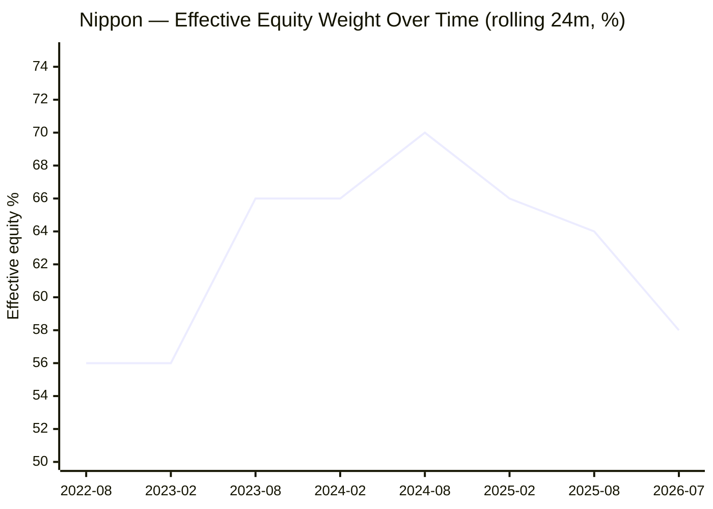
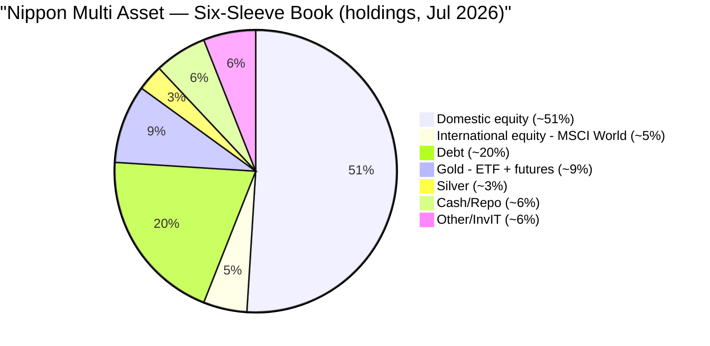
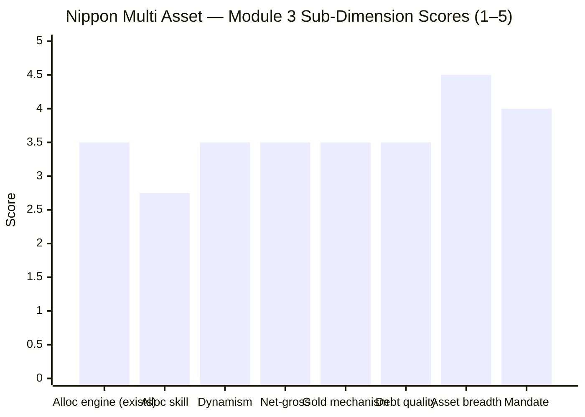

# Module 3: Allocation Engine & Portfolio DNA — Nippon India Multi Asset Allocation Fund

> **Provisional Module 3 score: ~3.4 / 5** (weight **20%** — the category's defining module). **Scores are NOT comparable to the four equity categories.**

> **The one-line context:** where SBI's Module 3 found *no* allocation engine, Nippon's finds a **real one — but a return-seeking, mixed-skill one.** Its effective equity weight genuinely *oscillated* (54→70→58%) rather than drifting, and it runs the **broadest asset book in the study** — six sleeves including genuine **international equity** (iShares MSCI World ~5%). That is a real point of differentiation. But two honest deductions follow: the dynamism was **pro-cyclical** (it raised equity *into* the 2024 top and **cut gold to 12% right before its +72% 2025 run**), and the equity book is **large-cap / index-like** (85% R² to Nifty 50), so Module 1's alpha is **allocation-weight, not stock selection.** A backfill bonus/warning: the **equity manager is brand new (Jan 2026)** — the record isn't his.

---

## ⚠ Data-Access Note (read first)

As with SBI, the equity/debt/gold split *history*, net-vs-gross equity, and turnover are factsheet items. This module combines **return-based style analysis** (the rigorous NAV-based reconstruction of effective weights) with **factsheet holdings** (ValueResearch/Groww) — the corrected process. Exact turnover and sector percentages remain factsheet-deferred (not published by aggregators).

---

## Fund Identity / Raw Data

| Attribute | Value | Source |
|-----------|-------|--------|
| MFAPI scheme code | 148457 (71 monthly obs, Sep 2020–Jul 2026) | api.mfapi.in |
| **Effective weights (full-period, style analysis)** | **EQ 60% / DEBT 20% / GOLD 20%** | MFAPI regression |
| **Effective equity range (rolling 24m)** | **54% → 70% → 58%** (genuine oscillation) | MFAPI regression |
| Net equity (screener) | 56.2% | Tickertape |
| 3-factor R² | **84.9%** (only ~15% residual = intl/cash/selection) | MFAPI regression |
| **Asset book (6 sleeves)** | Domestic equity ~51% · **international (iShares MSCI World) ~5%** · debt ~20% · gold (GOLDBEES ETF 7.8% + gold futures 1.5%) ~9% · silver (SILVERBEES) 3% · cash/repo ~6% | VR/Groww holdings |
| Top-10 (equity) | ICICI Bank 4.0%, HDFC Bank 2.8%, SBI 1.9%, Reliance 1.7%, Zomato 1.7%, Trent 1.6% — **large-cap-led** | Groww |
| Holdings count | **171** | Groww |
| Gold vehicle | GOLDBEES ETF (physical) **+ ~1.5% gold futures** (minor roll-drag) | Groww |
| Debt holdings | Muthoot Finance debenture (NBFC), Data Infra InvIT, T-bills — modest credit reach | VR/Groww |
| Managers | **Vinay Sharma (equity, Jan 2026 — NEW)**, Vikram Dhawan (commodities, Aug 2020), Kinjal Desai (overseas, Aug 2020), Sushil Budhia (debt, Mar 2021), Amber Singhania (Mar 2026) | Groww |
| Turnover / PE / sector % | **factsheet — deferred** | SID |

---

## Cross-Source Verification

| Metric | Style analysis | Screener/holdings | Verdict |
|--------|----------------|-------------------|---------|
| Effective equity | 60% (full) / 58% (current) | 56.2% net + ~5% intl | ✅ Consistent — the ~60% includes the ~5% international the screener buckets as equity |
| Debt | ~20% | ~20% | ✅ |
| Gold+silver | ~20% (style) | ~12% (holdings: gold 9% + silver 3%) | ⚠️ Style over-weights gold (~8pp) — same over-attribution seen for SBI; **use the ~12% factsheet figure** |

**Reliability:** High for the effective-weight *path* (the module's backbone); the style analysis over-states the gold *level* (a known limitation — corrected to ~12% via holdings).

---

## 1. ⭐ The Allocation Engine — a Real, but Return-Seeking, One

Unlike SBI's monotonic drift, **Nippon's equity weight genuinely oscillated** — 56% (2022) → **70% (2024)** → 58% (2026), a ~16pp swing, with gold moving 12–24% inversely. **There is a real allocation engine here.** The question is whether it is *skilful*. Grading the calls:

| Move | What happened | Skilful? |
|------|---------------|----------|
| **Equity 56→70% (2022→2024)** | Raised equity *into* the 2023–24 bull | ⚠️ **Pro-cyclical** — captured returns, but the *opposite* of buy-low; it added risk near the top |
| **Equity 70→58% (2024→2026)** | Trimmed after the Sep-2024 top | ➕ Arguably decent de-risking (or drift) |
| **Gold 24%→12% (2023→early 2025)** | Cut gold right before its **+72% 2025 run** | ❌ **Bad timing** — this is the M1/M2 2025 lag, explained |
| **Gold 12%→20% (2025→2026)** | Rebought gold after the run | ❌ Late |

**Verdict: an active, discretionary allocation engine with *mixed and unproven* skill.** It is genuinely more dynamic than SBI — but its dynamism was **return-seeking, not risk-reducing** (it raised equity into a top and mistimed gold). For a category where "risk + allocation carry the thesis," an engine that amplifies equity near highs is not the *defensive* allocation skill the category ideally rewards. It is real activity; it is not (yet) demonstrated skill.

---

## 2. ⭐ Asset-Class Breadth — the Broadest in the Study (a genuine positive)

Nippon runs a genuine **six-sleeve** book — the widest diversification of any fund studied so far:
- **International equity (~5% via iShares MSCI World)** — a real global-decorrelation sleeve SBI entirely lacks. It is small, but it is the *only* fund so far to add non-Indian equity (a genuine, if partial, answer to the "diversify beyond India" question). *(Retrofit to M2: this ~5% adds a sliver of genuine global decorrelation the 0.82-to-PP correlation doesn't fully capture — marginal, but real.)*
- **Gold via ETF + futures + silver** — deeper commodity toolkit (the futures add minor roll-drag/complexity).
- Debt with a modest NBFC-credit + InvIT reach.

This breadth is Nippon's clearest structural advantage over SBI's narrower equity/debt/gold/silver book.

---

## 3. The Equity Book Is Index-Like — Which Reframes Module 1's Alpha

The 3-factor style regression explains **84.9%** of Nippon's returns (vs SBI's 65%), and the top equity holdings are index heavyweights (**ICICI Bank, HDFC Bank, SBI, Reliance**). Both point the same way: **the equity sleeve behaves much like a large-cap index.**

> **⭐ RETROFIT to Module 1:** M1 credited Nippon with a large +3.85%/yr blended-benchmark alpha and hypothesized it might be equity *selection*. The high R² and large-cap holdings say otherwise: **the alpha is mostly allocation-*weight* — carrying ~60% (vs the blend's 55%) equity through a bull market — not stock-picking.** The equity book ≈ Nifty 50 + a few high-growth names (Zomato, Trent). This *weakens* the "skill" reading of M1's alpha (it is largely a structural equity overweight that paid off in a bull), though it does not change M1's *score* (the returns are real). Combined with §1 (mixed allocation timing), the honest read is: **Nippon's outperformance is equity-overweight-in-a-bull, not demonstrated skill.**

---

## 4. Net-vs-Gross Equity, Gold Mechanism, Debt (NEW dimensions)

| Dimension | Assessment | Status |
|-----------|------------|--------|
| **Net-vs-gross equity** | Net ~56% (incl. ~5% intl); **< 65% → middle-tier taxed** (M4). No arbitrage overlay evident (unlike an equity-tax-seeking fund) | ✅ confirmed |
| **Gold/silver mechanism** | Mostly **GOLDBEES ETF (physical, 7.8%)** + **~1.5% gold futures** + SILVERBEES (3%). The futures sliver adds minor roll-drag; the bulk is low-cost physical ETF | ✅ mostly good |
| **International** | iShares MSCI World ETF (~5%) — genuine global equity; note SEBI's overseas-investment cap limits how much any fund can add here | ✅ genuine breadth |
| **Debt-book construction** | ~20%; reaches into **NBFC credit (Muthoot)** + InvITs (Data Infra) + T-bills — a modest credit reach; duration unverified | ⚠ partial |
| **SEBI mandate compliance** | ✅ Met — equity/debt/gold each >10%; genuine multi-asset | ✅ |

---

## 5. Rebalancing Discipline — Active, but the Evidence Cuts Both Ways

Unlike SBI (no rebalancing, pure drift), Nippon **does** rebalance — the 54–70% equity oscillation is proof of an active hand. But §1 showed the *quality* is mixed: pro-cyclical equity (raised into the bull), poorly-timed gold (cut before the surge). So the score reflects **genuine activity with unproven skill** — better than SBI's inertia, short of demonstrated tactical excellence. The one clearly-defensible move is the post-2024-top equity trim.

---

## 6. Overlap with Existing Sleeves (informational)

The large-cap equity book (ICICI/HDFC Bank/SBI/Reliance) **heavily overlaps** the FlexiCap core (M2: 0.82 correlation to PP — the highest of the funds studied). The genuine non-overlapping content is the debt + gold/silver + the ~5% international. Exact name overlap → holdings-level (the top names are visible and clearly PP-overlapping).

---

## Comparison with Studied Funds

| Dimension | **Nippon MA** | SBI MA | DSP SmallCap |
|-----------|---------------|--------|--------------|
| Allocation engine | **Real (oscillates), mixed skill** | None (static drift) | N/A (equity) |
| Asset breadth | **6 sleeves (incl. international)** | 5 sleeves (no intl) | 1 |
| Equity book | Large-cap / index-like (85% R²) | Broad (65% R²) | Small-cap conviction |
| Dynamism | Genuine (equity 54–70%) | Monotonic drift only | — |
| Allocation *skill* evidence | Mixed (pro-cyclical, bad gold timing) | None | (stock selection) |
| Module 3 verdict | **A real but return-seeking engine; broadest book** | Static mix, no engine | Conviction picker |

**Nippon vs SBI on Module 3:** Nippon wins — it actually *has* an allocation engine and the broadest asset book (including international), where SBI has neither. But it wins *modestly*, because the engine's skill is unproven and return-seeking rather than defensive, and the equity book is index-like.

---

## Points For / Points Against — Allocation Engine & DNA

### ✅ For
1. **A genuine allocation engine** — equity oscillated 54–70%, gold 12–24%; real active management, not SBI's drift.
2. **Broadest asset book in the study** — six sleeves including genuine **international equity** (MSCI World), the only fund so far to diversify beyond India.
3. **Low-cost physical gold/silver ETFs** (GOLDBEES/SILVERBEES) for the bulk of metals.
4. **Diversified 171-holding book**; SEBI multi-asset mandate genuinely met.
5. **Commodity + overseas desks are stable** (Dhawan, Desai since inception).

### ❌ Against
1. **The engine is return-seeking, not defensive** — raised equity *into* the 2024 top; skill unproven.
2. **Bad gold timing** — cut gold to 12% right before its +72% 2025 run (the M1/M2 lag).
3. **Equity book is index-like (85% R²)** — M1's alpha is allocation-weight, not selection.
4. **Equity manager is brand new (Jan 2026)** — the return record isn't his (→ M5).
5. **Some gold via futures** — minor roll-drag/complexity vs pure physical ETF.
6. **Heavy overlap with the FlexiCap core** (0.82) — the equity half duplicates what you own.

---

## Module 3 Scorecard

| Sub-dimension | Score | Reasoning |
|---------------|-------|-----------|
| Allocation model — exists & is testable | **3.5** | A real, discretionary engine (unlike SBI) — genuine oscillation |
| Allocation *skill* | **2.75** | Mixed: pro-cyclical equity, bad gold timing; unproven |
| Dynamism (tactical range) | **3.5** | Genuine (equity 54–70%, gold 12–24%) |
| Net-vs-gross equity transparency | **3.5** | Net ~56% clear; middle-tier confirmed; no hidden overlay |
| Gold/silver mechanism | **3.5** | Mostly physical ETF; ~1.5% futures adds minor complexity |
| Debt-book quality | **3.5** | NBFC-credit + InvIT reach; no NAV event; duration unverified |
| Asset breadth | **4.5** | Six sleeves incl. international — broadest in the study |
| SEBI mandate compliance | **4.0** | Genuine multi-asset; all classes >10% |
| Equity-book overlap | *informational* | 0.82 to PP — decision-tree feed |
| **Module 3 Overall** | **~3.4 / 5** | A genuine, broad, actively-allocated book — clearly more of an "engine" than SBI — but capped by unproven/return-seeking allocation skill, an index-like equity book, and heavy core-overlap |

---

## Comparative Module 3 Scores (studied funds)

| Fund | Module 3 | DNA verdict |
|------|----------|-------------|
| DSP SmallCap | 3.8 | Conviction stock-picker |
| **Nippon Multi Asset** | **~3.4** | **Real engine + broadest book (incl. intl); skill unproven, equity index-like** |
| SBI Multi Asset | 3.0 | Static mix, no engine |

> Nippon leads SBI on Module 3 (3.4 vs 3.0) — it has an allocation engine and international diversification SBI lacks. But the lead is modest, because the engine's dynamism added *return-seeking risk* (not defensive protection) and its skill is unproven.

---

## SIP Implication

For a ₹15–20k/month SIP, Module 3 tells you Nippon is a *genuinely* managed multi-asset fund — someone is actively moving the equity/debt/gold/international dials, and the book is the most broadly diversified in the study (it even owns global equity). That is more than SBI offers. But temper expectations on two fronts: (1) the active management has been **return-seeking** (it raised equity into highs), so it will likely *add* risk in a euphoric market rather than protect you — consistent with M2's equity-plus profile; and (2) the equity engine that drove the returns is now run by a **new manager (since Jan 2026)**, so past behaviour is not a guarantee. You are buying a broad, actively-allocated, equity-tilted book — good for participation, unproven for protection.

## One-Line Verdict

**Unlike SBI, Nippon has a real allocation engine and the broadest asset book in the study — six sleeves including genuine international equity — but the engine is return-seeking (it raised equity into the 2024 top and mistimed gold badly before its 2025 surge), the equity book is large-cap/index-like so Module 1's alpha is allocation-weight not skill, and the equity manager driving it all is brand new as of Jan 2026.**

---

*Module 3 complete. Provisional score 3.4/5. Method: return-based style analysis (MFAPI 148457 vs Nifty 50 120620 / ICICI All Seasons Bond 120603 / SBI Gold 119788, 71 monthly obs) + factsheet holdings/managers (ValueResearch, Groww). **Cross-module retrofits (Edelweiss discipline):** (1) **M1** — the index-like equity book (85% R²) means the +3.85% alpha is allocation-*weight*, not stock selection, weakening the "skill" reading (no score change); (2) **M2** — the ~5% international sleeve adds a sliver of genuine global decorrelation (marginal); (3) **new finding for M5** — the equity manager (Vinay Sharma) is new as of Jan 2026, so the 2020–25 equity record belongs to a predecessor. **Deferred:** exact turnover, PE, sector %.*

*Next: [Module 4 — Cost & Tax Efficiency](module4_cost_tax.md)*
