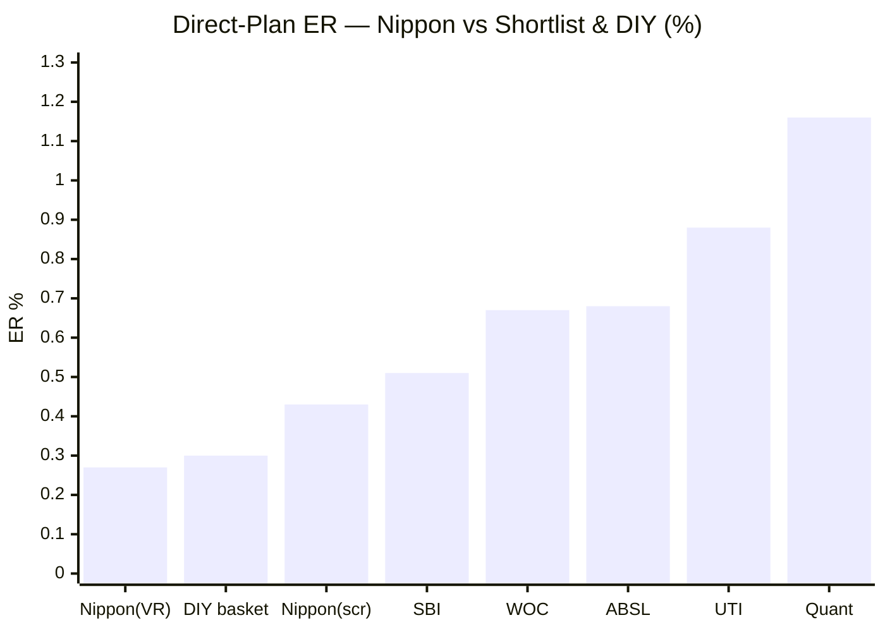
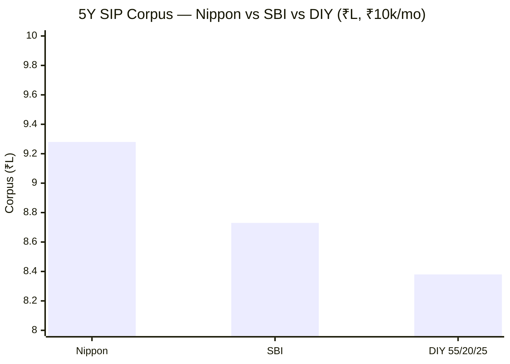
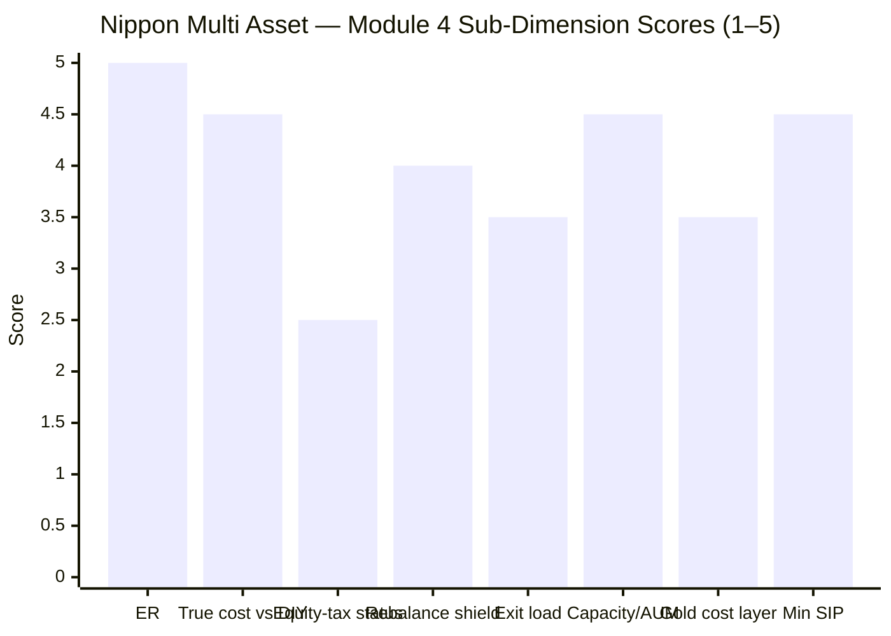

# Module 4: Cost & Tax Efficiency — Nippon India Multi Asset Allocation Fund

> **Provisional Module 4 score: ~4.1 / 5** (weight **20%**). **Scores are NOT comparable to the four equity categories.**

> **The one-line context:** this is Nippon's strongest module and the mirror image of SBI's. Where SBI's tax triad *misfired* (mid-pack ER, barely rebalances), Nippon's largely *works*: it is the **cheapest fund in the shortlist (~0.27–0.43% ER) — at or below the all-in cost of doing it yourself** — it **beats a DIY basket by a wide margin (+₹2.5L over 5Y on ₹10L, post-tax)**, and — crucially — its **internal-rebalancing tax shield is genuinely meaningful**, because (unlike SBI) it *actually rebalances* (M3). The one shared debit is the category-wide one: it is **not equity-taxed** (middle tier, 12.5% after 2 years). But the wide book edge means it clears the DIY bar regardless.

---

## Fund Identity / Raw Data

| Attribute | Value | Source |
|-----------|-------|--------|
| **Expense Ratio (Direct)** | **~0.27–0.43%** (VR 0.27% · screener 0.43%) — **cheapest in the shortlist** | ValueResearch / Tickertape |
| Expense Ratio (Regular) | ~1.5% (est.) — confirm SID | estimate |
| Direct–Regular gap | ~1.1–1.2% (est.) | computed |
| Exit load | **1%** on units > 10% of investment, within 12m; nil after | VR/Groww |
| AUM | ₹16,000 Cr | Tickertape/VR |
| Min SIP / lumpsum | **₹100 / ₹5,000** | VR |
| **Taxation status** | **Middle tier — 12.5% LTCG after 2 years, STCG slab** (NOT true equity-oriented; net equity ~56% < 65%) | VR-confirmed |
| Gold vehicle cost layer | GOLDBEES ETF (~0.1% embedded) + ~1.5% gold **futures** (minor roll-cost) | Groww |
| Rebalancing | **Genuine (M3: equity oscillated 54–70%)** → the internal-rebalancing shield is real | M3 |
| Turnover / ER-glide | factsheet — deferred | SID |

---

## Cross-Source Verification

| Metric | Value | Source | Note |
|--------|-------|--------|------|
| Direct ER | 0.27% / 0.43% | VR / Tickertape | Genuine two-source spread; **either way the cheapest in the shortlist** |
| Tax status | middle tier | VR ("sold after 2 years, 12.5%") + net-equity math | Same as SBI — a category-wide trait, not fund-specific |
| Exit load | 1%/12m (>10%) | VR/Groww | Standard |

**Reliability:** ER carries a real 0.27–0.43% spread (resolved as "cheapest either way"); tax status is VR-confirmed and matches the allocation math.

---

## 1. Expense Ratio — the Cheapest Fund in the Shortlist, at/below DIY

| Fund | Direct ER |
|------|-----------|
| **Nippon Multi Asset** | **~0.27–0.43%** (cheapest) |
| DIY basket (index funds, blended) | ~0.30% |
| SBI Multi Asset | ~0.51–0.68% |
| WOC / ABSL | 0.67 / 0.68% |
| UTI / Quant | 0.88 / 1.16% |

**This is the headline cost fact and the anti-SBI result:** at its VR-reported 0.27%, Nippon is *cheaper than assembling the DIY basket yourself* (~0.30%). Even at the screener's 0.43%, it is barely above DIY and comfortably the cheapest active fund in the shortlist. Where SBI lost to DIY on ER, **Nippon wins (or ties) DIY on ER before a single other factor is counted.** For a fund whose active management is real (M3), being priced like an index basket is a genuine structural advantage.

---

## 2. The Tax Status — Middle Tier (the shared category debit)

Same conclusion as SBI, VR-confirmed: **Nippon is not equity-taxed.** Net equity ~56% (incl. ~5% international) is below the 65% gross-equity threshold; there is no arbitrage overlay lifting it. So it sits in the **middle tier**:

| Tier | Rule | Nippon? |
|------|------|---------|
| Equity-oriented (≥65%) | 12.5% >12m, ₹1.25L exemption, 20% STCG | ❌ |
| **Middle (35–65%)** | **12.5% LTCG after 24m; STCG slab** | ✅ |
| Specified (>65% debt) | slab | ❌ |

**For a long-term SIP this is nearly as good as equity taxation** (12.5% LTCG on the bulk of gains), losing only the ₹1.25L exemption and the 12→24-month window. But the category's structural tax *trump card* — equity taxation on the whole gold/debt corpus — is **absent**, exactly as for SBI. This is a category-wide trait (both cycle-tested funds miss it), not a Nippon-specific flaw.

---

## 3. ⭐ The Internal-Rebalancing Tax Shield — Real Here (the SBI contrast)

This is where Nippon *beats* SBI on the tax triad. The shield's value depends entirely on **how much the fund actually rebalances** — and M3 established that Nippon's equity weight genuinely oscillated 54→70→58% (with gold moving 12–24%), while SBI merely drifted.

| | Nippon | SBI |
|--|--------|-----|
| Does it rebalance? | **Yes — real oscillation** (M3) | No — static drift |
| Internal cross-asset churn | Meaningful | Minimal |
| **Rebalancing shield value** | **~0.15–0.25%/yr** | ~0.10–0.15%/yr |

A DIY investor replicating Nippon's actual allocation swings (raising equity to 70%, cutting gold to 12%, then reversing) would have **realised taxable gains at each turn**; Nippon did all of it **internally, tax-free**. This is the one fund where the "internal-rebalancing shield" argument is not hand-waving — it is genuinely worth ~0.15–0.25%/yr. *(Caveat: some of that rebalancing was mistimed — M3 — but the tax shield accrues regardless of whether the calls were good.)*

---

## 4. ⭐ True Cost vs DIY — Beats It by a Wide Margin (framing fact #2)

### 5Y SIP (₹10k/month, actual NAVs, net of embedded ERs)

| | Corpus (5Y, ₹6L invested) |
|--|---------------------------|
| **Nippon** | **₹9.28L** |
| SBI | ₹8.73L |
| DIY 55/20/25 | ₹8.38L |
| **Nippon edge vs DIY** | **+₹0.90L over 5Y** (pre investor-tax) |

### 5Y lumpsum (₹10L), post-tax
| | CAGR | Post-tax value (12.5% LTCG >2yr) |
|--|------|----------------------------------|
| **Nippon** | 16.36% | **₹19.91L** |
| DIY 55/20/25 | 13.09% | ₹17.43L → **Nippon +₹2.48L** |
| DIY 65/25/10 | 10.90% | ₹15.93L → **Nippon +₹3.98L** |

**Nippon beats DIY by a wide margin, post-tax — ~+₹2.5L over just 5 years on ₹10L.** This is the strongest DIY case in the study (SBI's was a thin +₹0.6–1.3L over 10Y). Two honest qualifiers: **(1)** the margin is driven mostly by Nippon's high *returns* (M1), which are bull-flattered and partly equity-overweight beta (M3) — in a bear, the equity tilt would narrow or reverse the gap; **(2)** the *structural* cost advantages (cheapest ER, real rebalancing shield, no capacity limit) are regime-independent and stand on their own. **Net:** on cost/tax structure alone Nippon clears DIY; the *size* of the margin is return-dependent and should be discounted for the bull regime.

---

## 5. Standard Cost Dimensions

| Dimension | Assessment | Score input |
|-----------|------------|-------------|
| Direct–Regular gap | ~1.1–1.2% (Regular ~1.5%) — a Regular investor gives up a lot; **use Direct** | 3.0 |
| SEBI TER buffer | At ₹16,000 Cr, far inside the hybrid TER ceiling | ✓ |
| Exit load | 1%/12m on >10% — standard, irrelevant to a long SIP | 3.5 |
| Turnover-adjusted cost | Rebalancing is active (M3), but ETF/large-cap execution is cheap; no evidence of high-churn leakage; ~1.5% gold futures add a small roll-cost | 3.5 |
| Flow-as-signal | ₹16,000 Cr and growing — a healthy, well-subscribed fund (Nippon's brand + the category boom) | 3.5 |
| Gold cost layer (double-layer) | GOLDBEES ETF ~0.1% + gold futures roll-cost on ~1.5% — negligible-to-minor | 3.5 |
| **AUM / capacity** | ₹16,000 Cr with **no capacity constraint** — large-cap + ETF + liquid debt scale indefinitely | 4.5 |
| Min SIP | **₹100** — best-in-class accessibility | 4.5 |

---

## Comparison with Studied Funds

| Metric | **Nippon MA** | SBI MA | DSP SmallCap |
|--------|---------------|--------|--------------|
| Direct ER | **~0.27–0.43%** (cheapest) | ~0.51–0.68% | 0.64% |
| ER vs DIY | **At/below DIY** | Above DIY | — |
| Tax status | Middle tier (12.5%/2yr) | Middle tier | Equity |
| Rebalancing shield | **Real (~0.15–0.25%)** | Small (barely rebalances) | N/A |
| Beats DIY post-tax | **Widely (+₹2.5L/5Y)** | Thinly (+₹0.6–1.3L/10Y) | Yes (alpha) |
| Capacity | None | None | High |
| Cost/tax verdict | **Cheapest + real shield; middle-tier tax the only debit** | Cost-competitive but weak shield | Turnover-efficient, equity-taxed |

**Nippon vs SBI on Module 4:** Nippon wins clearly — cheaper (at/below DIY), a *real* rebalancing shield (SBI's is muted), and a far wider DIY margin. The only place they tie is the middle-tier tax status (a shared category trait). This is the module that most separates the two funds in Nippon's favour.

---

## Points For / Points Against — Cost & Tax

### ✅ For
1. **Cheapest fund in the shortlist (~0.27–0.43%)** — at or below the all-in cost of DIY.
2. **Beats DIY by a wide margin post-tax** (+₹2.5L/5Y on ₹10L) — the strongest DIY case in the study.
3. **A genuinely meaningful internal-rebalancing tax shield** (~0.15–0.25%/yr) — because it actually rebalances (M3), unlike SBI.
4. **No capacity constraint** — scales indefinitely.
5. **₹100 minimum SIP** — best accessibility.
6. **Middle-tier tax is nearly as good as equity tax** for a long holder.

### ❌ Against
1. **Not equity-taxed** — the structural trump card is absent (shared with SBI).
2. **The wide DIY margin is return-driven** — bull-flattered and partly equity-overweight beta (M3); it would narrow in a bear.
3. **~1.5% gold futures** add a small roll-cost/complexity vs pure physical ETF.
4. **Regular plan ~1.5%** — a large Direct–Regular gap (use Direct).

---

## Module 4 Scorecard

| Sub-dimension | Score | Reasoning |
|---------------|-------|-----------|
| Expense Ratio (Direct) | **5.0** | ~0.27–0.43% — cheapest in shortlist; at/below DIY cost |
| True cost vs DIY (all-in) | **4.5** | Beats DIY widely (+₹2.5L/5Y post-tax); docked slightly as return-driven |
| Equity-taxation status | **2.5** | Middle tier, not equity-oriented (shared category debit) |
| Rebalancing tax-shield | **4.0** | Real & meaningful (~0.15–0.25%/yr) — it actually rebalances |
| Exit load | **3.5** | Standard 1%/12m on >10%; irrelevant to a long SIP |
| AUM / capacity | **4.5** | No capacity constraint |
| Gold cost layer / double-layer | **3.5** | ETF cheap; ~1.5% futures add minor roll-cost |
| Min SIP accessibility | **4.5** | ₹100 — best-in-class |
| ER-glide / turnover | *informational* | Deferred; no red flags |
| **Module 4 Overall** | **~4.1 / 5** | Nippon's strongest module — cheapest ER (at/below DIY), a genuine rebalancing shield, wide DIY margin, no capacity risk. Held off higher only by the middle-tier tax status (shared) and the return-dependence of the DIY margin |

---

## Comparative Module 4 Scores (studied funds)

| Fund | Module 4 | Cost/tax character |
|------|----------|--------------------|
| BOI FlexiCap | 4.25 | Cheapest ER, tiny AUM |
| **Nippon Multi Asset** | **~4.1** | **Cheapest MA ER (at/below DIY), real rebalancing shield; middle-tier tax the only debit** |
| DSP SmallCap | 3.7 | Turnover-efficient, equity-taxed |
| SBI Multi Asset | 3.5 | Cost-competitive but weak shield |

> Module 4 carries 20% and the tax triad. Nippon's 4.1 vs SBI's 3.5 is the module that most separates them — Nippon's structural cost advantages (cheapest ER + real shield) are genuine and regime-independent.

---

## SIP Implication

For a ₹15–20k/month SIP, Nippon's cost/tax profile is a clear positive and the flip side of its risk profile. You are paying the lowest fee in the category — so low that you are not obviously better off doing it yourself — and because the fund genuinely rebalances, you get a real (if modest) tax-deferral benefit a DIY investor cannot replicate without triggering gains. The fund clears the "why not DIY?" test comfortably, unlike SBI. The honest caveats are that (1) the *size* of its DIY win rides on its bull-market returns (it would shrink in a bear), and (2) it is not equity-taxed, so the tax edge is a deferral-and-cheapness story, not the structural trump card. Net: on cost and tax, Nippon is the better-value fund of the two studied — and the value is real, not just a return artifact.

## One-Line Verdict

**Nippon's best module and the mirror of SBI's: the cheapest fund in the shortlist (~0.27–0.43%, at/below DIY cost) with a genuinely meaningful internal-rebalancing tax shield (because it actually rebalances), beating a DIY basket by a wide ~+₹2.5L/5Y post-tax — undercut only by the shared middle-tier tax status and the fact that the size of the DIY win rides on bull-market returns.**

---

*Module 4 complete. Provisional score 4.1/5. Method: ER/tax from ValueResearch/Groww; 5Y SIP & post-tax lumpsum from MFAPI 148457 vs DIY 55/20/25 & 65/25/10 (Nifty 50 120620 / ICICI All Seasons Bond 120603 / SBI Gold 119788). **Cross-module consistency (Edelweiss discipline):** M4 *confirms* the M3 finding pays off here — because Nippon genuinely rebalances (M3), its internal-rebalancing tax shield is real (unlike SBI's), so the M3 "real engine" verdict and the M4 "real shield" verdict reinforce each other. No prior score changes. **Deferred:** exact Regular ER, ER-glide, turnover.*

*Next: [Module 5 — Fund Manager / Team Quality](module5_manager.md)*
