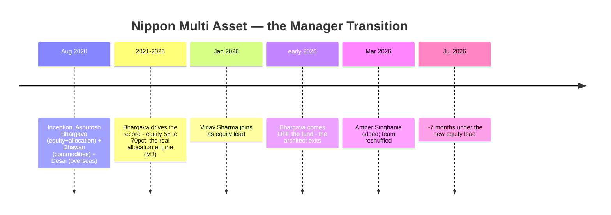
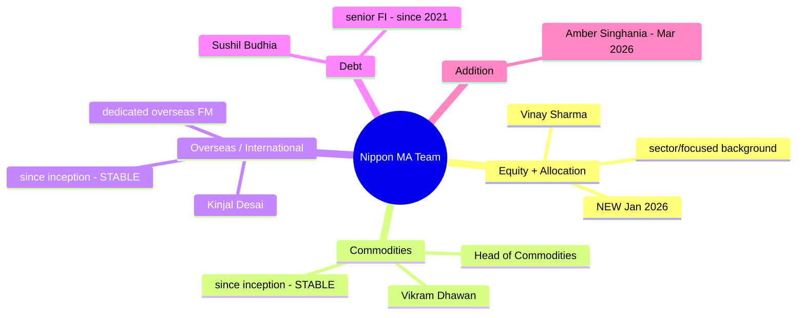
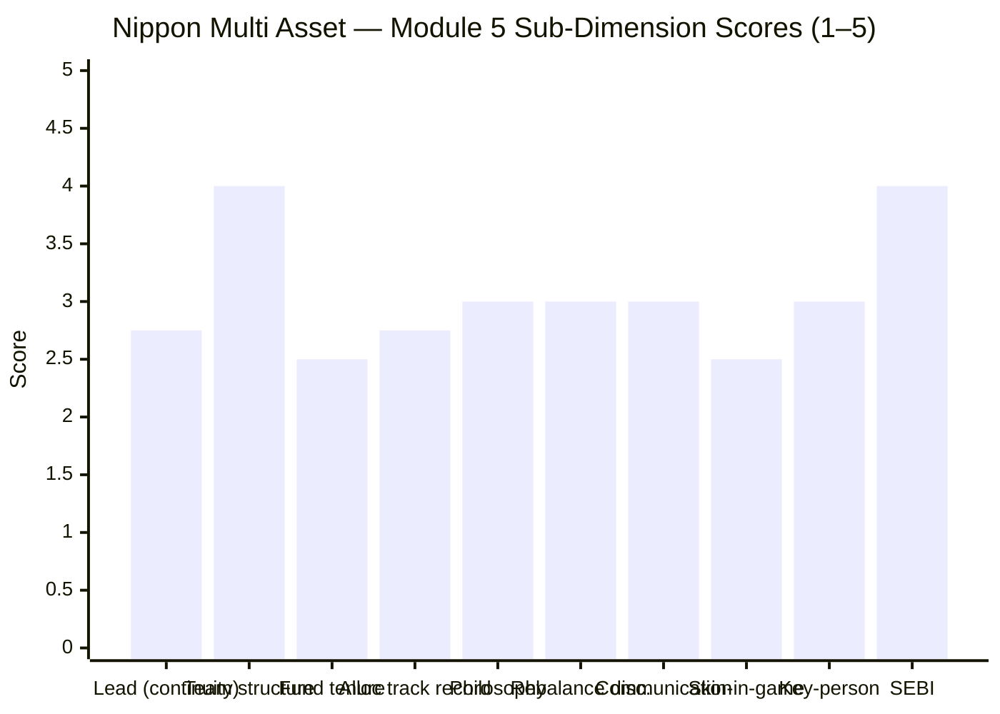

# Module 5: Fund Manager / Team Quality — Nippon India Multi Asset Allocation Fund

> **Provisional Module 5 score: ~3.0 / 5** (weight **10%**). **Scores are NOT comparable to the four equity categories.**

> **The one-line context:** Module 5 exposes the crack under Nippon's strong first four modules. The fund has a genuinely **good multi-desk team structure** — dedicated commodities and *overseas* specialists SBI lacks — but its **architect just left.** Ashutosh Bhargava ran the equity sleeve and the (real, if mixed-skill) allocation engine from inception (Aug 2020) to **early 2026** — *the entire track record M1–M4 rest on is his* — and he came off the fund. His replacement, **Vinay Sharma (since Jan 2026, ~7 months)**, is an experienced Nippon hand but a **banking/financials and focused-equity specialist**, new to diversified multi-asset. **The key-person risk didn't stay theoretical — it materialised.** So the forward-looking fund is more uncertain than its backward-looking record.

---

## Fund Identity / Raw Data (web-researched — VR/Groww/Nippon product notes, Jul 2026)

| Attribute | Detail | Source |
|-----------|--------|--------|
| **Architect / prior lead** | **Ashutosh Bhargava** — equity + allocation, **Aug 2020 → early 2026** (Nippon's Head of Equity Research/strategist); **now off the fund** | VR / Nippon notes |
| **Current equity lead** | **Vinay Sharma — since Jan 2026 (~7 months)**; also runs Nippon Banking & Financial Services (Apr 2018) & Nippon Focused (May 2018) — a **sector/focused specialist** | Groww / VR |
| **Commodities (gold/silver)** | **Vikram Dhawan — since inception (Aug 2020)**, Nippon Head of Commodities | Groww |
| **Overseas (international)** | **Kinjal Desai — since inception (Aug 2020)**, dedicated overseas-investments manager | Groww |
| **Debt** | **Sushil Budhia — since Mar 2021** (~5y), senior fixed income | Groww |
| New addition | Amber Singhania — Mar 2026 | Groww |
| Team change (early 2026) | FROM {Bhargava, V.Sharma, Dhawan, Budhia, Desai, +2} → TO {V.Sharma, Dhawan, Budhia, Desai, Singhania} | VR story |
| Skin in the game | Not disclosed (large AMC) | — |
| Personal SEBI record | Clean (AMC → M6) | — |

---

## Cross-Source Verification

| Fact | Sources | Verdict |
|------|---------|---------|
| Bhargava ran the fund Aug 2020 → early 2026 | VR, Nippon product notes, SteelCity | ✅ Confirmed — the architect of the whole record |
| Vinay Sharma equity lead since Jan 2026 | Groww, VR | ✅ Confirmed — ~7 months |
| Commodities (Dhawan) & overseas (Desai) since inception | Groww | ✅ Confirmed — the non-equity desks are stable |
| Vinay Sharma = banking/financials + focused specialist | VR | ✅ Confirmed — a style-fit question |

**Reliability: High.** The manager transition is documented across multiple sources; it is the module's central, verified fact.

---

## 1. ⭐ The Architect Left — the Central Finding

Every number in Modules 1–4 — the 18.28% CAGR, the +3.85% blended-benchmark alpha, the genuine (if mixed-skill) allocation engine — was produced under **Ashutosh Bhargava**, who ran the fund from inception until he stepped off in early 2026. **The person who built the track record and drove the allocation is no longer managing the fund.** This is the single most important forward-looking fact about Nippon, and it directly qualifies M1–M4:

> **⭐ RETROFIT to M1/M3 (Edelweiss discipline):** the strong returns (M1) and the real allocation engine (M3) are **Bhargava's, not the current team's.** M1 already flagged that the equity book is index-like (so the alpha is allocation-weight); M5 adds that even *that* allocation was the departed architect's. The past record's *predictive value for the fund you'd buy today is materially reduced.* No M1–M4 scores change (the past happened), but a **forward-looking transition risk** now sits over all of them.

---

## 2. The Replacement — Competent, but a Style-Fit Question

Vinay Sharma is **not** a novice: ~8 years at Nippon managing **Nippon Banking & Financial Services** (since Apr 2018) and **Nippon Focused Equity** (since May 2018). But that background is a flag as much as a comfort:
- His demonstrated skill is **concentrated / sector equity** (banking, financials, high-conviction focused portfolios) — a *different* discipline from running a **diversified, index-like large-cap multi-asset equity sleeve** and, more importantly, from **tactical asset allocation** across equity/debt/gold/international.
- He has **~7 months** on this fund. His approach to the allocation dials (the thing M3 identified as the fund's real engine) is **entirely unproven** here.

So the replacement is experienced but potentially **style-mismatched**, and untested in the multi-asset allocation role. The honest read: competent hands, wrong-shaped experience, no track record on *this* mandate yet.

---

## 3. Team Depth & Structure — Genuinely Good (the offsetting strength)

Nippon's team structure is a real strength and arguably better than SBI's: it has **dedicated commodities *and* overseas specialists** (Dhawan, Desai) — appropriate for a fund that genuinely holds gold, silver, *and* international equity (M3) — and both have been in place **since inception.** The debt desk (Budhia) is stable. **The continuity gap is confined to the equity + overall-allocation seat** — but that is the most important seat, and it is exactly the one that turned over. So: strong *structure*, broken *continuity at the top*.

---

## 4. Allocation-Call Track Record, Philosophy, Discipline

| Dimension | Assessment | Score input |
|-----------|------------|-------------|
| **Allocation-call track record** | A real engine existed (M3: equity 54–70%) with **mixed skill** — pro-cyclical equity, mistimed gold — **but it was Bhargava's**; the current lead's is unproven | 2.75 |
| **Philosophy / process** | Nippon markets an in-house asset-allocation framework (monthly product notes exist) — *if* the engine is process/model-driven, the transition risk is lower; but M3's discretionary oscillation looks manager-led, not purely model-led | 3.0 |
| **Sell / rebalance discipline** | Genuine rebalancing occurred (M3) — but under the departed architect | 3.0 |
| **Investor communication** | Institutional standard — monthly product notes, factsheets; no structured quarterly unitholder letters | 3.0 |
| **Skin in the game** | Not disclosed | 2.5 |
| **Key-person / succession risk** | **Materialised** — the architect left; cushioned by stable non-equity desks + AMC depth, but the equity/allocation transition is live and unproven | 3.0 |
| **SEBI record (personal)** | Clean | 4.0 |

---

## Comparison with Studied Fund Managers

| Fund | Lead / team | Tenure on fund | Key edge | Key gap | Module 5 |
|------|-------------|----------------|----------|---------|----------|
| PP FlexiCap | Rajeev Thakkar | 13y | Skin-in-game, letters, proven | — | 5.0 |
| DSP SmallCap | Vinit Sambre | 14y | Conviction, longevity | No letters | 3.9 |
| SBI Multi Asset | Balachandran + team | 4.75y / 2.5y | Strong equity lead, stable | No allocation skill; secondary mandate | 3.2 |
| **Nippon Multi Asset** | **V. Sharma (new) + stable non-eq desks** | **~7mo (eq) / inception (commod, overseas)** | **Best multi-desk *structure*; real (past) engine** | **Architect left; new lead unproven & style-mismatched** | **~3.0** |

**Nippon vs SBI on Module 5:** they are close, and Nippon edges *below*. SBI has a stable (if secondary-mandate) lead with no allocation skill; Nippon has a better team *structure* and had a real allocation engine, but just **lost the architect** and handed the seat to an unproven, style-mismatched replacement. On a *manager-continuity* axis, SBI is safer; on *team structure*, Nippon is better. The live transition tips Nippon slightly lower.

---

## Points For / Points Against — Manager / Team

### ✅ For
1. **Best multi-desk team *structure* in the study** — dedicated commodities (Dhawan) *and* overseas (Desai) specialists, both since inception.
2. **Non-equity desks are stable** — the gold/silver, international, and debt sleeves have continuity through the transition.
3. **The replacement is experienced** (~8y at Nippon), not a rookie.
4. **A real allocation engine existed** (M3) — the process may be partly institutional, not purely personal.
5. **Clean regulatory record; large-AMC bench depth** cushions the transition.

### ❌ Against
1. **The architect left** — Bhargava ran the entire track record and the allocation engine, and is off the fund; the record's forward value is reduced.
2. **New equity/allocation lead (~7 months)** — Vinay Sharma is unproven on this mandate.
3. **Style-fit question** — his background is concentrated/sector equity, not diversified multi-asset allocation.
4. **The allocation engine's continuity is unproven** — the thing that made M3 better than SBI was the departed manager's.
5. **No skin-in-game disclosure; no quarterly letters.**
6. **Broad early-2026 team reshuffle** (three managers off, two on) — organisational churn on the fund.

---

## Module 5 Scorecard

| Sub-dimension | Score | Reasoning |
|---------------|-------|-----------|
| Lead-manager continuity/credentials | **2.75** | Architect left; replacement experienced but new & style-mismatched |
| Team depth & structure | **4.0** | Best multi-desk structure studied — dedicated commodities + overseas |
| Tenure/attribution on this fund | **2.5** | Equity lead ~7mo; the record is the departed architect's |
| Allocation-call track record | **2.75** | Real (mixed-skill) engine — but Bhargava's, not the current lead's |
| Philosophy / process clarity | **3.0** | In-house framework exists; how model-vs-manager-driven is unproven |
| Rebalance discipline | **3.0** | Genuine rebalancing (M3) — under the departed manager |
| Investor communication | **3.0** | Institutional standard; no letters |
| Skin in the game | **2.5** | Not disclosed |
| Key-person / succession risk | **3.0** | Materialised; cushioned by stable non-equity desks + AMC depth |
| SEBI record (personal) | **4.0** | Clean |
| **Module 5 Overall** | **~3.0 / 5** | Best team *structure* in the study, undercut by a live, unproven transition at the most important seat: the architect who built the record and the allocation engine has left, and his replacement is experienced but style-mismatched and untested on this mandate |

---

## Comparative Module 5 Scores (studied funds)

| Fund | Module 5 | Manager verdict |
|------|----------|-----------------|
| PP FlexiCap | 5.0 | Gold standard |
| DSP SmallCap | 3.9 | Conviction, longevity |
| SBI Multi Asset | 3.2 | Stable lead, no allocation skill |
| **Nippon Multi Asset** | **~3.0** | **Best team structure, but architect left; new lead unproven & style-mismatched** |

> Module 5 is 10% — but here it carries a real signal: Nippon's strong M1–M4 record is the work of a manager who is gone. This is the module that most tempers Nippon's lead over SBI.

---

## SIP Implication

For a ₹15–20k/month SIP, Module 5 is the reason not to over-extrapolate Nippon's excellent first four modules. The returns, the alpha, and the allocation engine that made Nippon look like the winner were built by **Ashutosh Bhargava, who has left the fund.** The team structure around the seat is genuinely good — the gold/silver, international, and debt sleeves are run by stable, specialist hands — so this is not a collapse risk. But the **equity + allocation seat, the one that matters most, is now held by an experienced-but-style-mismatched manager with ~7 months on the mandate and no track record running multi-asset.** A prudent SIP investor should treat Nippon's stellar back-record as *the departed manager's*, watch the new lead's allocation behaviour for a few cycles, and size the position with that uncertainty in mind. The fund is not broken; its future is simply less certain than its past.

## One-Line Verdict

**Nippon has the best multi-desk team *structure* in the study — stable, specialist commodities, overseas and debt desks — but the architect who built the entire track record and the allocation engine (Ashutosh Bhargava) has left, handing the most important seat to an experienced but style-mismatched, ~7-month-tenured replacement; the strong past is the departed manager's, and the future is unproven.**

---

*Module 5 complete. Provisional score 3.0/5. Method: web research (ValueResearch, Groww, Nippon product notes, SteelCity) for team identities/tenure/the transition; allocation-call context from M3. **Cross-module retrofit (Edelweiss discipline):** M5 materially qualifies M1–M4 — the returns, alpha, and allocation engine belong to Ashutosh Bhargava, who left the fund in early 2026; the forward-looking value of the record is reduced, and a live transition risk now overlays the fund's strong quantitative profile. No M1–M4 scores change (the past is real), but the decision tree must weight the manager transition. **Deferred:** none material.*

*Next: [Module 6 — AMC Trustworthiness](module6_amc.md)*
