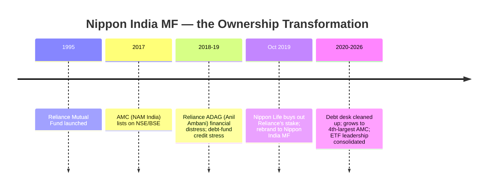
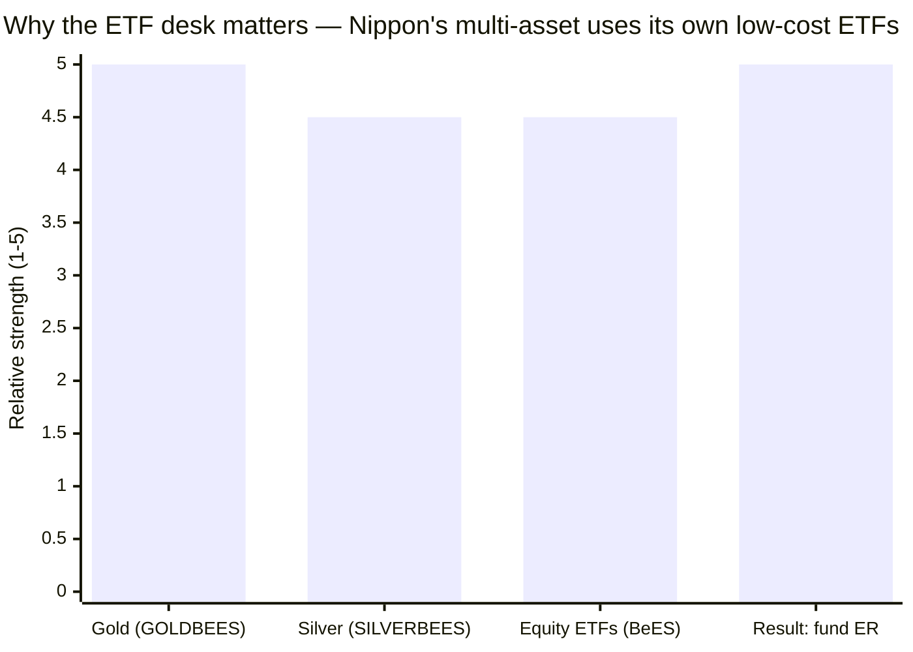
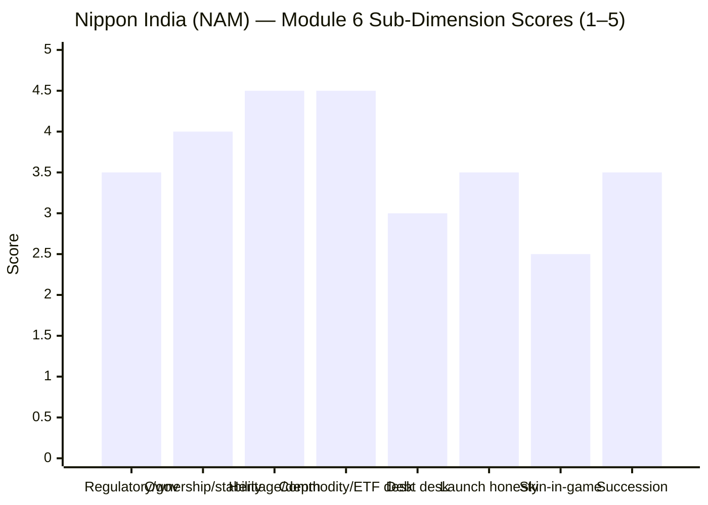

# Module 6: AMC Trustworthiness — Nippon India Multi Asset Allocation Fund

> **Provisional Module 6 score: ~3.7 / 5** (weight **5%**). **Scores are NOT comparable to the four equity categories.**

> **The one-line context:** a split verdict, mirroring the fund. Nippon Life India AM is a **large (4th-biggest), listed, Japanese-insurer-owned house whose 2019 rescue from the troubled Reliance ADAG group was a genuine governance *upgrade*** — and, uniquely useful here, it is **India's #1 gold/silver-ETF provider** (GOLDBEES/SILVERBEES), the very desks a multi-asset fund leans on, and the reason this fund is so cheap (M4). But the same house carries a **real fixed-income blemish** — the Reliance-era debt-fund stress and side-pocketing of 2019–20 — which sits directly under this fund's debt sleeve. **Best-in-study commodity desk; checkered (if remediated) debt desk.** No prior study covered Nippon's AMC — fresh assessment, no carry-forward.

---

## Fund Identity / Raw Data (web-researched, Jul 2026)

| Attribute | Detail | Source |
|-----------|--------|--------|
| AMC | **Nippon Life India Asset Management (NAM India)** | — |
| Formerly | **Reliance Mutual Fund** → rebranded **Oct 2019** after Nippon Life bought out Reliance | VR / Business Standard |
| Rank / AUM | **#4 AMC — ₹7,40,031 Cr (Mar 2026)** | Fincash / INDmoney |
| Owner | **Nippon Life Insurance (Japan's largest life insurer)** majority; **listed (NAM India, since 2017)** | Business Standard |
| AMC inception | 1995 (as Reliance MF) | VR |
| **ETF leadership** | **India's #1 gold-ETF provider — GOLDBEES (oldest/largest) + SILVERBEES + Nifty BeES suite** | industry |
| Fixed-income history | **Reliance-era debt stress + segregated portfolios (side-pockets) 2019–20** — remediated post-Nippon | industry/VR |
| Overseas capability | Dedicated overseas desk (Kinjal Desai) | Groww |
| Regulatory | SEBI-registered, listed; Reliance-era baggage the main historical item | VR |
| Skin in the game | Not disclosed | — |

---

## Cross-Source Verification

| Fact | Sources | Verdict |
|------|---------|---------|
| #4 AMC, ~₹7.4L Cr | Fincash, INDmoney, VR | ✅ Consistent |
| Nippon Life majority; rebranded from Reliance 2019 | Business Standard, VR | ✅ Consistent |
| #1 gold-ETF provider (GOLDBEES) | industry-standard fact | ✅ Confirmed |
| Reliance-era debt side-pockets (2019–20) | historical record | ✅ Confirmed — the fixed-income blemish |

**Reliability: High** on ownership/scale/ETF-leadership; the debt-desk history is well-documented.

---

## 1. The 2019 Governance Upgrade — From Reliance ADAG to Nippon Life

The most important AMC fact for Nippon is that **its 2019 change of ownership was a governance *upgrade*, not a risk.** Under Reliance ADAG, the fund house was tied to a promoter group in financial distress — a genuine conflict-of-interest and credit-contagion risk (which showed up in the debt funds, see §3). **Nippon Life's takeover severed that tie**, placing the AMC under a conservative, ~130-year-old Japanese life insurer with no Indian-group entanglements. This is the DSP-BlackRock / independence parallel: a house that *removed* its governance risk. Post-2019, NAM India has been stable, listed, and transparent, and grew to #4. **The direction of travel is strongly positive.**

---

## 2. ⭐ ETF / Commodity-Desk Leadership — Best-in-Study for This Fund (NEW)

For a multi-asset fund, the single most useful thing about Nippon is that **it is India's #1 ETF house.** GOLDBEES is the oldest and largest gold ETF in India; SILVERBEES extends it to silver; the BeES suite dominates index ETFs. This matters concretely:
- The fund holds its **own low-cost, physical-backed gold/silver ETFs** (M3) — deep, credible commodity capability run by a dedicated desk (Dhawan).
- **This is *why* the fund is the cheapest in the shortlist (M4, ~0.27–0.43%)** — it plugs into the AMC's own low-cost ETF machinery rather than buying external product.

On the **commodity leg specifically, Nippon's desk is the best in the study** — better even than SBI's (also strong). For a fund whose non-equity thesis rests on gold/silver, this is a material, fund-specific strength.

---

## 3. ⭐ Fixed-Income-Desk Credibility — the Real Blemish (NEW)

The multi-asset import cuts the other way on debt. A multi-asset fund is only as good as its *worst* desk, and Nippon's fixed-income history is its weakest link:

| Item | Detail | Relevance |
|------|--------|-----------|
| **Reliance-era debt stress (2018–20)** | The debt funds held stressed credits during the ADAG/IL&FS/DHFL era; NAM India **created segregated portfolios (side-pockets)** in several debt schemes (2019–20) | A documented fixed-income governance/credit blemish |
| Remediation | Post-Nippon (2019+), the debt desk was rebuilt under new ownership; no comparable event since | Direction positive, but the history is real |
| This fund's debt sleeve | ~20%, reaching into **NBFC credit (Muthoot)** + InvITs (M3) | Sits under a desk with a checkered (if remediated) past |

> **⚠ RETROFIT to M2/M3 (Edelweiss discipline):** for SBI, M6 *supported* the debt-quality presumption (SBI's fixed-income desk is conservative and blowup-free). For **Nippon, M6 does the opposite — it mildly *reinforces* the M2/M3 debt caution.** The multi-asset fund's debt sleeve (Muthoot NBFC credit) sits under a desk that side-pocketed stressed paper only a few years ago. Not alarming under Nippon Life's cleaned-up regime, but a genuine, fund-relevant negative that SBI does not carry. No M2/M3 score change, but the debt-quality flag is now *supported by AMC history*, not just holdings.

---

## 4. Launch-Timing, Franchise & Regulatory Record

| Dimension | Assessment |
|-----------|------------|
| **Launch timing** | Launched **Aug 2020** — post-COVID-crash, early recovery; **not** an opportunistic 2023-tax-wave top launch. Reasonable, non-gaming timing |
| **Franchise commitment** | Run as a real product (₹16,000 Cr, growing), structurally advantaged by the ETF desk; not a flagship (Nippon's flagships are Small Cap + the ETF suite), but a credible commitment |
| **Regulatory (post-2019)** | Clean of major actions under Nippon Life; the Reliance-era debt stress is the historical item; **no fraud/front-running** (the Quant contrast). **⚠ Retrofit flag (added Jul 30, from Quant M6 research):** CEO **Sundeep Sikka reportedly settled a *separate* SEBI market-violation matter** — a different, apparently lesser case (not front-running of the fund's orders); noted for decision-tree follow-up; does not change this M6 score, but mildly tempers the regulatory line |
| **Listing/transparency** | Listed since 2017 — a **longer public-market track record than SBI** (which IPO'd only in 2026) |

---

## 5. Communication, Skin-in-Game, Succession

| Dimension | Assessment | Score input |
|-----------|------------|-------------|
| Investor communication | Institutional standard — **monthly product notes** (used in M3/M5), factsheets; no quarterly unitholder letters | 3.0 |
| Skin in the game | Not disclosed | 2.5 |
| Succession / stability | Large listed AMC, deep bench — AMC-level stability is high; **note the fund-level manager exit (M5)** is a scheme issue, not an AMC-stability one | 3.5 |

---

## Comparison with Studied AMCs

| AMC | Module 6 | Character |
|-----|----------|-----------|
| PPFAS | 4.5 | Boutique, aligned, spotless |
| DSP | 4.3 | Heritage, all-employee skin-in-game |
| SBI Funds Mgmt | 3.9 | #1 AMC; strongest+cleanest debt desk; no launch-gaming |
| **Nippon India (NAM)** | **~3.7** | **#4 AMC; best ETF/commodity desk for this fund; 2019 governance upgrade — but Reliance-era debt blemish** |
| HDFC AMC | ~3.8 | Large, listed, commercial |
| BOI | 3.3 | Small PSU |
| Quant | 1.25 | Active front-running probe |

**Nippon vs SBI on Module 6:** SBI edges it (3.9 vs 3.7). SBI is bigger (#1 vs #4), its fixed-income desk is cleaner and more conservative (a plus for a multi-asset fund's debt sleeve), and it had no debt-side-pocket history. **Nippon's counter is the commodity/ETF desk** — genuinely the best in the study for a gold-holding fund, and the engine of its cost advantage. On balance SBI's cleaner debt history + greater scale wins the AMC axis narrowly; Nippon's ETF leadership keeps it close.

---

## Points For / Points Against — AMC

### ✅ For
1. **2019 governance upgrade** — Nippon Life's buyout *removed* the Reliance-ADAG conflict/contagion risk; a house that de-risked itself.
2. **Best ETF/commodity desk in the study** — #1 gold-ETF provider; the fund's cheap, efficient gold/silver exposure and low ER flow directly from this.
3. **#4 AMC, ₹7.4L Cr, listed since 2017** — scale, depth, and a longer public-market track record than SBI.
4. **Non-gaming launch timing** (Aug 2020) and a credible franchise commitment.
5. **No fraud/front-running**; clean under Nippon Life.
6. **Stable Japanese-insurer parent** — long-term, conservative ownership.

### ❌ Against
1. **Reliance-era fixed-income blemish** — debt-fund stress + side-pockets (2019–20); sits under this fund's debt sleeve (reinforces the M2/M3 debt caution).
2. **#4, not #1** — smaller than SBI (a minor point).
3. **No skin-in-game disclosure; no quarterly letters.**
4. **Fund-level instability** — the M5 manager exit is a scheme concern the AMC's stability doesn't offset.
5. **Multi-asset is not a flagship** — a credible but secondary franchise.

---

## Module 6 Scorecard

| Sub-dimension | Score | Reasoning |
|---------------|-------|-----------|
| Regulatory / governance | **3.5** | 2019 upgrade (big +); Reliance-era debt history (−); clean since |
| Ownership independence & stability | **4.0** | Nippon Life majority, listed; de-risked from Reliance ADAG |
| Heritage & institutional depth | **4.5** | #4 AMC, ₹7.4L Cr, ETF leader, listed since 2017 |
| **Commodity/ETF desk** | **4.5** | Best in study for a gold-holding fund; drives the cost advantage |
| **Fixed-income desk** | **3.0** | Reliance-era side-pockets; remediated but the weakest desk — reinforces debt caution |
| Launch-timing honesty / franchise | **3.5** | Aug-2020 non-gaming launch; credible but secondary franchise |
| Skin in the game | **2.5** | Not disclosed |
| Succession / continuity (AMC-level) | **3.5** | Deep listed AMC; fund-level M5 exit noted separately |
| **Module 6 Overall** | **~3.7 / 5** | A strong, de-risked, ETF-leading house whose commodity desk is the best in the study for this fund — pulled down from SBI's 3.9 by a genuine (if remediated) fixed-income blemish and smaller scale |

---

## Comparative Module 6 Scores (studied funds)

| AMC | Module 6 |
|-----|----------|
| PPFAS | 4.5 |
| DSP | 4.3 |
| SBI Funds Mgmt | 3.9 |
| HDFC AMC | ~3.8 |
| **Nippon India (NAM)** | **~3.7** |
| BOI | 3.3 |
| Quant | 1.25 |

---

## ⭐ The Complete Six-Module Picture — M6 as the Closer

| Module | Topic | Weight | Nippon | Weighted | (SBI) |
|--------|-------|--------|--------|----------|-------|
| M1 | Returns & Allocation Alpha | 20% | 4.1 | 0.82 | (3.6) |
| M2 | Risk Profile | 25% | 3.6 | 0.90 | (4.5) |
| M3 | Allocation Engine & DNA | 20% | 3.4 | 0.68 | (3.0) |
| M4 | Cost & Tax | 20% | 4.1 | 0.82 | (3.5) |
| M5 | Manager / Team | 10% | 3.0 | 0.30 | (3.2) |
| **M6** | **AMC** | **5%** | **3.7** | **0.185** | (3.9) |
| **TOTAL** | | **100%** | | **≈ 3.71** | **(≈3.66)** |

**Nippon ≈ 3.71 vs SBI ≈ 3.66 — a virtual dead heat, Nippon marginally ahead.** They arrive there by **opposite routes**: Nippon wins on **returns, cost, and having a real (broad, international-inclusive) allocation engine**; SBI wins on **risk, defensiveness, and diversification value**. Nippon's edge is shadowed by two live risks — the **departed architect (M5)** and the **never-seen-a-severe-bear** record (M2) — while SBI's ceiling is capped by having **no allocation skill at all**. The decision between them is genuinely a *preference*, not a ranking — quantified for the decision tree.

---

## SIP Implication

For a ₹15–20k/month SIP, Nippon's AMC is a net positive you can largely rely on: a large, listed, de-risked house whose ETF leadership is the very thing that makes this fund cheap and its gold/silver exposure efficient. The one thing to keep an eye on is the debt sleeve — not because it is currently risky, but because this house's fixed-income desk has a stressed past, and the fund does reach into NBFC credit. On the AMC axis, Nippon is trustworthy and well-suited to running a multi-asset fund (especially its commodity side); it simply lacks SBI's cleaner debt pedigree and top-of-table scale.

## One-Line Verdict

**A large, listed, Nippon-Life-owned house that de-risked itself from the Reliance ADAG group in 2019 and runs the best gold/silver-ETF desk in the study — the engine of this fund's cost advantage — held below SBI only by a genuine (remediated) Reliance-era fixed-income blemish that sits under the fund's debt sleeve.**

---

*Module 6 complete. Provisional score 3.7/5. Method: web research (Business Standard, ValueResearch, Fincash, INDmoney). No prior-study carry-forward. **Cross-module retrofit (Edelweiss discipline):** M6 *reinforces* (does not resolve) the M2/M3 debt-quality caution — the fund's NBFC-credit debt sleeve sits under a desk with a Reliance-era side-pocket history; the commodity/ETF desk, by contrast, is the best in the study and validates M4's cost advantage. No prior scores change. **Final six-module weighted score ≈ 3.71/5** — a virtual tie with SBI (≈3.66), reached by the opposite route (returns/cost vs risk/defensiveness). All Nippon modules complete → next: the Nippon fund README.*
