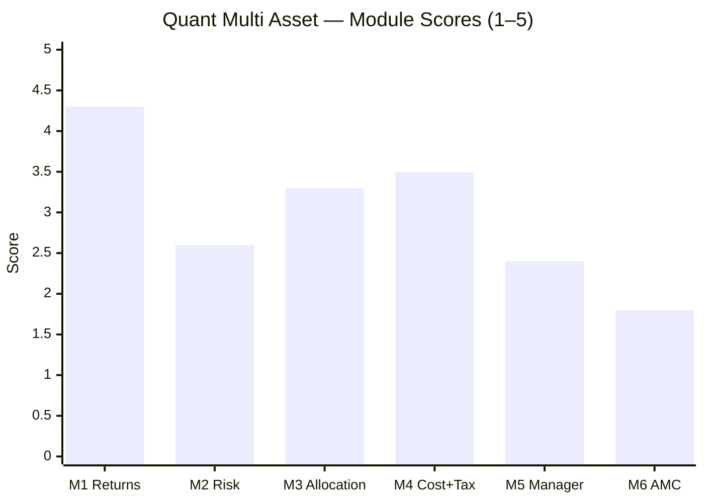
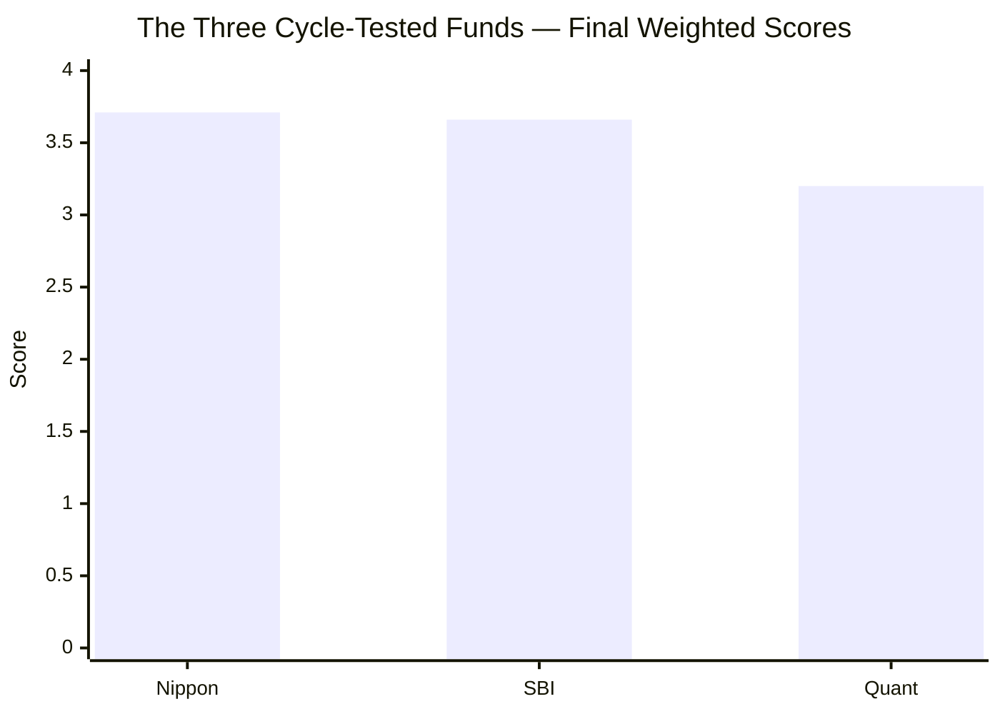

# Quant Multi Asset Allocation Fund — Fund Summary & Verdict

**Direct Plan – Growth · MFAPI 120821 · AUM ~₹5,980 Cr · ER ~0.51% (VR; screener 1.16% stale) · studied Jul 2026**

> **Final weighted score: ≈ 3.20 / 5 — last of the three cycle-tested funds, despite winning Module 1 outright.** The study's **cautionary case**: the highest returns in the category (quant-era 26% CAGR, +10–14%/yr alpha over DIY, ₹39L 10Y SIP) built on an aggressive, one-man momentum-quant model (VLRT) — that **fails the multi-asset thesis** on the axes that carry the weight. It draws down like an equity fund (−32.6%), gave *zero* cushion in 2022, is run entirely by a founder-CIO who **settled a SEBI front-running case**, and has no plan B if he goes.
>
> **⚠ Scores are NOT comparable to the four equity categories** (multi-asset re-weight: Risk 25 / Returns 20 / Allocation 20 / Cost+Tax 20 / Manager 10 / AMC 5). **Not investment advice.**

---

## The Six-Module Scorecard

| Module | Topic | Weight | Score | Weighted | One-line |
|--------|-------|--------|-------|----------|----------|
| [M1](module1_returns.md) | Returns & Allocation Alpha | 20% | 4.3 | 0.86 | Runaway returns leader — but momentum-regime-dependent, data-caveated |
| [M2](module2_risk.md) | Risk Profile | 25% | 2.6 | 0.65 | **Fails the risk test** — equity-level DD, zero 2022 cushion |
| [M3](module3_allocation.md) | Allocation Engine & DNA | 20% | 3.3 | 0.66 | Most dynamic engine — but return-oriented; 44% is momentum stock-picking |
| [M4](module4_cost_tax.md) | Cost & Tax | 20% | 3.5 | 0.70 | Cheap (corrected), might be equity-taxed — all uncertain/return-driven |
| [M5](module5_manager.md) | Manager / Team | 10% | 2.4 | 0.24 | Singular talent under a front-running probe; extreme key-person risk |
| [M6](module6_amc.md) | AMC | 5% | 1.8 | 0.09 | Lowest in study — founder-CIO settled front-running; thin non-equity desks |
| **TOTAL** | | **100%** | | **≈ 3.20** | |

---

## What Quant Multi Asset Actually Is

Three reframings, each from the data:

1. **It is an aggressive momentum *equity* fund with an allocation veneer.** 44% of its returns are momentum stock-selection, not asset allocation (M3); its effective equity is ~74% (M3); its risk clusters with equity funds, not multi-asset ones (M2). The "multi-asset" label understates what you're buying.

2. **Its record is regime-dependent and partly corrupted.** The reliable data is only ~6 years (quant era; pre-2020 Escorts NAVs are artifact-ridden — M1). Within that, a single **2021 momentum-mania +57%** carries the alpha, and it **lagged when leadership rotated to gold (2025)** (M1/M3).

3. **It is one man's model — and that man settled a front-running case.** The returns (M1), risk (M2), and engine (M3) are all Sandeep Tandon's VLRT model. He is the founder, CIO, CEO, and owner — and he settled a SEBI front-running case (M5/M6). There is no succession and no institutional oversight.

---

## The Genuine Strengths

- **Returns leader (M1 4.3).** quant-era 26% CAGR; **+10–14%/yr alpha over any DIY basket** (triple Nippon's); **10Y SIP ₹12L → ₹39L at 22.35%** — the best in the study.
- **Cost-competitive (M4 3.5).** Real ER 0.51% (the screener's 1.16% was stale); **might even be equity-taxed** (unlike SBI/Nippon); largest internal-rebalancing shield; beats DIY by the widest margin.
- **A genuine, distinctive allocation engine (M3 3.3)** — the VLRT model swings harder (equity 46–84%, gold 6–54%) than any fund studied, and it demonstrably caught the 2021 momentum mania.
- **Severe-bear-tested** — unlike Nippon, it lived through COVID (the −32.6% is real, not estimated).
- **Genuine talent** — Tandon built ₹2L Cr and a real framework from a defunct shell.

## The Disqualifying Weaknesses

- **Fails the multi-asset risk test (M2 2.6).** Equity-level volatility (~15%) and a −32.6% COVID drawdown; **zero cushioning in 2022** (fell like the Nifty in the exact year the category is built for); 0.79 correlated to the equity you own. **Not a risk-reducer.**
- **The seductive Sharpe (1.5) is a return credential in disguise** — high because the return is high, not because the risk is low; fragile if the momentum regime turns.
- **Extreme key-person risk (M5 2.4)** — the whole fund is one investigated man's model, with no succession.
- **Founder-CIO settled a SEBI front-running case (M6 1.8)** — the gravest investor-conduct failure in the study; the strategy's defining activity (high-turnover momentum trading) is the very thing that was probed.
- **Structurally weakest AMC for multi-asset** — thin fixed-income, no proprietary commodity desk (rents Nippon's ETFs).

---

## The Verdict That Matters: Fund vs DIY

| | Quant | DIY (index + debt + gold ETF, rebalanced) |
|---|---|---|
| 5Y lumpsum post-tax (₹10L) | ~₹23.04L | ~₹17.61L |
| Edge to Quant | **+₹5.43L over 5Y (widest in study)** | — |

**Quant beats DIY by the widest margin — but the least durably.** The margin is almost entirely the M1 return advantage, which is momentum-regime-dependent and earned with equity-level risk. In a value/mean-reversion regime the margin shrinks while the −32.6% drawdown risk stays. **It clears the DIY bar by the most, and for the wrong reasons.**

---

## ⭐ The Central Lesson — Why the Returns Leader Finishes Last

Quant **won Module 1 outright** and is competitive on cost — yet finishes **last (≈3.20)**, ~0.5 behind SBI and Nippon. That gap is the whole point of the multi-asset re-weight:
- **Risk is 25%** — the most of any module — precisely because a multi-asset fund's *job* is risk reduction. Quant's 2.6 there (vs SBI's 4.5) is a ~0.5-point swing that no returns lead can offset.
- **Governance (M5+M6 = 15%)** — Quant's 2.4/1.8 (vs peers' ~3.0–3.9) costs another ~0.2.

**The framework did exactly what it was built to do: it refused to reward the highest returns when they come with the wrong risk profile and a governance cloud.** Quant is the multi-asset study's analog of the MidCap study's Motilal Oswal — the instructive cautionary case that chasing trailing returns misses.

---

## Who (if anyone) Quant Suits

- **NOT** a core, diversifying, risk-reducing multi-asset sleeve — it fails that job (M2), which is the job.
- **NOT** a trust-based decade-long SIP for a cautious investor — the governance and key-person risks (M5/M6) are close to disqualifying.
- **Possibly** a small, satellite, *consciously aggressive* allocation for an investor who: (a) explicitly wants Tandon's momentum-quant edge, (b) can stomach a −33% drawdown, (c) accepts the governance risk with eyes open, and (d) sizes it as money they can afford to lose. That is a narrow, high-conviction, speculative use case — not the category's purpose.

---

## Monitoring / Review Triggers (if held)

1. **Any escalation of the SEBI matter** beyond the settlement (conditions, re-opening, or a Tandon ban) — an immediate exit trigger.
2. **Tandon's continued involvement** — the fund *is* him; any departure/incapacity removes the strategy.
3. **Momentum-regime turn** — if the market rotates to value/mean-reversion for a sustained period, Quant's edge (and the DIY margin) can vanish while the risk stays.
4. **Redemption spiral** — reputation-driven outflows (₹1,400 Cr in 3 days once already) can force selling of momentum small/mid names.
5. **Drawdown behaviour** — if the next severe bear repeats the −32.6%, the "multi-asset" thesis is confirmed broken.
6. **Tax-status flips** — its dynamic allocation can move it between equity and middle-tier taxation year to year.

---

## One-Line Verdict

**The study's cautionary case — the runaway returns leader (26% quant-era CAGR, +₹5.4L/5Y over DIY, best SIP in the study) that finishes last (≈3.20/5) because a multi-asset framework weighting risk at 25% and governance at 15% refuses to reward the highest returns when they come with equity-level drawdowns, zero 2022 cushion, extreme one-man-model dependence, and a founder-CIO who settled a SEBI front-running case; real talent and real returns, but un-ownable as the diversifying, dependable sleeve this category exists to provide.**

---

*Fund README complete. All six modules + README done (Jul 30 2026). Final weighted score ≈ 3.20/5 — last of the three cycle-tested funds. Method: MFAPI self-computation (scheme 120821, quant era 2020+ used as reliable) + return-based style analysis + factsheet/web backfill (ValueResearch, Business Standard, BW Businessworld). Third of six shortlist funds; the study's cautionary case (the returns leader the framework disqualifies). Feeds the decision tree as the "why chasing returns fails in this category" reference. Standings: Nippon 3.71 > SBI 3.66 >> Quant 3.20. Next fund: UTI Multi Asset (the borderline pass).*
