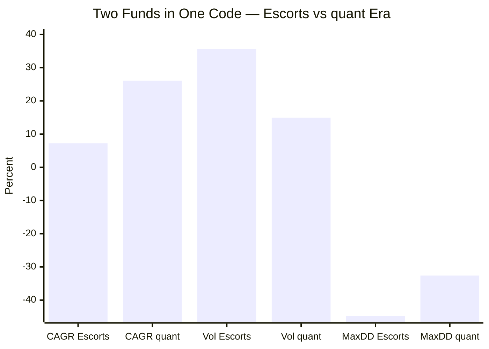
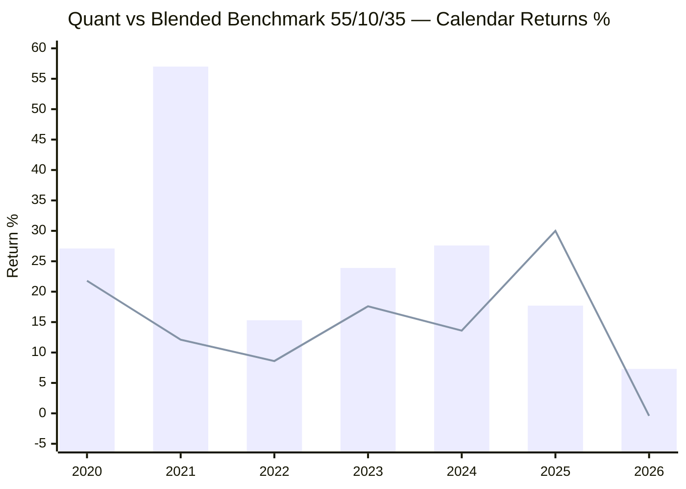
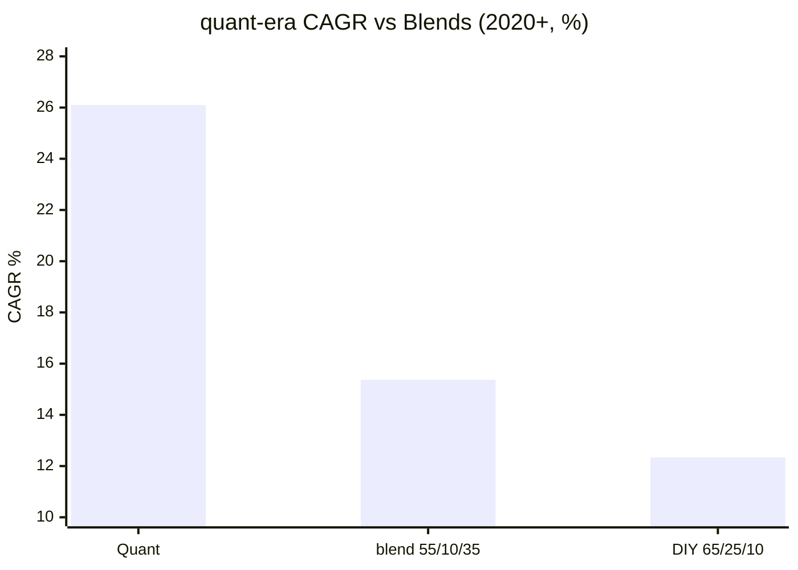
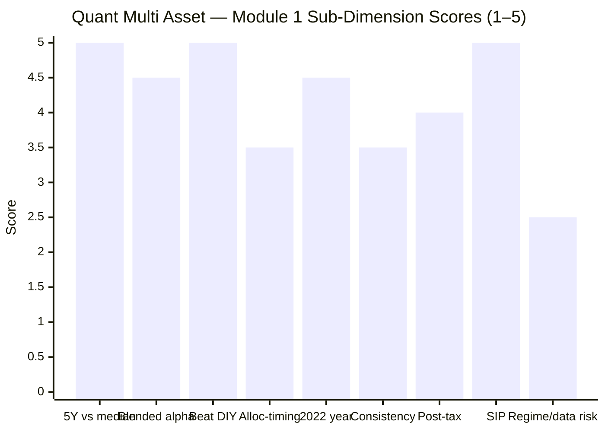

# Module 1: Returns & Allocation Alpha — Quant Multi Asset Allocation Fund

> **Provisional Module 1 score: ~4.3 / 5** (weight 20% in the multi-asset re-weight). **Scores are NOT comparable to the four equity categories.**

> **The one-line context:** on raw returns, Quant is in a different league — **quant-era (2020+) CAGR of 26.1% and a colossal +10.7% to +13.8%/yr alpha over any static basket**, the highest in the study by a wide margin (10Y SIP: ₹12L → ₹39L). But it earns those returns the way an aggressive momentum-quant fund does, not a multi-asset risk-reducer: **quant-era volatility ~15% and a −32.6% drawdown** (equity-like), a record that is **regime-dependent** (a 2021 momentum-mania +57% year does the heavy lifting), an **unreliable pre-2020 NAV history** (a different fund under Escorts, with data artifacts), and total dependence on **one man's model (Sandeep Tandon's VLRT)** under a **live SEBI front-running cloud** (→ M6). Spectacular returns; everything else is the catch.

---

## Fund Identity

| Attribute | Detail | Source |
|-----------|--------|--------|
| Full name | quant Multi Asset Allocation Fund — Direct — Growth | AMFI/MFAPI |
| AMC | Quant Money Managers (quant Mutual Fund) | — |
| MFAPI scheme code | **120821** | api.mfapi.in/mf/120821 |
| NAV history | **07 Jan 2013 → 29 Jul 2026 (13.6y, 3,336 NAVs)** | MFAPI |
| **Lineage / regime break** | Formerly an **Escorts Mutual Fund** scheme; **quant took over Escorts MF in 2018** → recategorised as Multi Asset. **The reliable record starts ~2020** (see era split) | industry |
| Stated benchmark | Tickertape lists a composite; treat as indicative | Tickertape |
| Asset mix (screener) | Net equity ~52.7% · debt ~10.5% · gold/commodity+cash ~36.9% | Tickertape |
| **Allocation approach** | **VLRT model** (Valuation-Liquidity-Risk appetite-Time) — Sandeep Tandon's proprietary, aggressive, dynamic quant framework | quant |
| Taxation | **Dynamic** — "based on last-12-months asset allocation, may vary" (net eq ~53% → likely middle tier, but swings) → M4 | VR |
| ER (Direct) | **VR 0.51% vs screener 1.16% — a large discrepancy to resolve** → M4 | VR / Tickertape |
| AUM | ~₹5,615–5,980 Cr | Tickertape / VR |
| Managers | **Sandeep Tandon (CIO/CEO/founder) + 6-person team** — full assessment → M5 | VR |
| Study flag | Old fund but **effectively ~6y** (quant era); cycle-tested on 2022; **⚠ AMC front-running probe → M6** | — |

---

## Raw Data (MFAPI-computed + Tickertape, as of 29-Jul-2026)

| Metric | Value | Source |
|--------|-------|--------|
| CAGR 1Y / 3Y / 5Y / 10Y | **19.77% / 22.59% / 20.02% / 18.94%** | MFAPI |
| CAGR since inception (13.6Y) | 16.00% (era-blended — see below) | MFAPI |
| **quant-era CAGR (2020–2026)** | **26.10%** | MFAPI |
| Escorts-era CAGR (2013–2019) | 7.25% (**unreliable NAV data**) | MFAPI |
| Volatility — quant era / full | **14.95% / 27.61%** (full inflated by Escorts artifacts) | MFAPI |
| Max drawdown — quant era | **−32.6%** (equity-like) | MFAPI |
| Rolling 3Y: min / %neg | **−11.11% / 1.3%** (NOT never-negative) | MFAPI (2,600) |
| Rolling 5Y: min / %neg | −5.16% / 0.2% | MFAPI (2,106) |
| 10Y SIP XIRR (₹10k/mo) | **22.35%** (₹12L → ₹39.01L) | MFAPI |
| Blended-alpha — quant era (vs 55/10/35) | **+10.73%/yr** | MFAPI |
| Blended-alpha — quant era (vs DIY 65/25/10) | **+13.76%/yr** | MFAPI |
| Screening: 5Y / 3Y / Sharpe | 20.3% / 22.7% / 1.52 | Tickertape |

---

## Cross-Source Verification

| Metric | MFAPI | Tickertape | Verdict |
|--------|-------|-----------|---------|
| 5Y CAGR | 20.02% | 20.3% | ✅ Confirmed |
| 3Y CAGR | 22.59% | 22.7% | ✅ Confirmed |
| **ER** | — | 1.16% | ⚠️ **VR says 0.51%** — large gap; resolve in M4 |
| **Pre-2020 daily NAV** | −44.8% / +81.2% single-day moves | — | ❌ **Data artifacts** — the Escorts-era NAV series has discontinuities (reconstruction at the 2018 takeover); pre-2020 metrics are **unreliable** and used only directionally |

**Reliability: High for the quant era (2020+); LOW for the Escorts era (pre-2020).** The −44.8%/+81.2% "daily" moves are impossible for a real fund — they are NAV-series artifacts around the Escorts→quant transition. **This module relies on the quant-era (2020+) data as the honest record; the 13.6-year headline numbers are era-blended and partly corrupted.**

---

## ⭐ The Era Split — the Reliable Fund Is ~6 Years Old

| Era | Years | CAGR | Volatility | Max DD | What it was |
|-----|-------|------|------------|--------|-------------|
| **Escorts** | 2013–2019 (7y) | 7.25% | **35.68%** ⚠️ | −44.8% ⚠️ | A different, wildly-volatile scheme under Escorts MF; **NAV data unreliable** |
| **quant** | 2020–2026 (6.6y) | **26.10%** | 14.95% | −32.6% | Today's VLRT-driven fund |

Like SBI (debt-MIP→multi-asset) and Nippon (post-COVID launch), **Quant's 13.6-year record is not one fund.** quant took over Escorts MF in 2018; the reliable, representative record begins ~2020. **Read every "since inception / 10Y" figure with that caveat** — the assessable fund is ~6 years old, and even that spans a momentum-favourable regime.

---

## Calendar-Year Returns — Momentum-Driven, and It Shows

*Blend = 55% Nifty 50 / 10% debt / 35% gold, daily-rebalanced (approximating Quant's high-equity, high-commodity, low-debt mix).*

> Bar = Quant · Line = blended benchmark

| Year | Quant | Blend | Alpha | vs SBI / Nippon | Read |
|------|-------|-------|-------|-----------------|------|
| 2020 | +27.1 | +21.8 | +5.3 | SBI +15.0 | Strong recovery |
| **2021** | **+57.0** | +12.1 | **+44.9** | SBI +14.0, Nip +21.1 | ⭐ **Momentum-mania year — the VLRT model's signature; carries the whole record** |
| 2022 | +15.3 | +8.6 | +6.7 | SBI +7.0, Nip +4.6 | Beat in the correction |
| 2023 | +23.9 | +17.6 | +6.3 | **SBI +25.5, Nip +25.9** | ⚠️ Actually *lagged* SBI/Nippon this year |
| 2024 | +27.6 | +13.6 | +14.0 | SBI +13.9, Nip +20.1 | Big — momentum again |
| **2025** | +17.7 | +30.0 | **−12.3** | SBI +19.6, Nip +21.0 | ⚠️ **Lagged the gold-heavy blend badly** — under-owned gold in its monster year |
| 2026 YTD | +7.3 | −0.4 | +4.9 | — | Holding up |

**The honest pattern:** Quant's alpha is **spectacular but lumpy and momentum-dependent.** The **2021 +57% year** (a momentum mania its VLRT model caught perfectly) and 2024 do the heavy lifting. In 2023 it *lagged* both SBI and Nippon, and in 2025 it **badly lagged the gold-heavy blend** (−12.3pp) — its aggressive equity/momentum tilt under-owned gold in gold's best year. So the returns are **regime-dependent**: superb in trending/momentum markets, exposed when leadership rotates to gold or value. This is the defining risk to the returns thesis — the model's edge is not regime-agnostic.

---

## The Blended-Benchmark Alpha — Enormous, but Regime-Loaded

| Basket (quant era, 2020+) | CAGR | Quant alpha |
|---------------------------|------|-------------|
| **Quant** | **26.10%** | — |
| blend 55/10/35 | 15.37% | **+10.73%/yr** |
| DIY 65/25/10 | 12.34% | **+13.76%/yr** |

**A +10.7% to +13.8%/yr alpha over a static basket is enormous** — roughly triple Nippon's +3.85% and an order of magnitude beyond SBI's +0.72%. It clears the DIY bar by the widest margin imaginable. **But two caveats dominate:** (1) it is measured over the quant era only, a **momentum-favourable 2020–2024 regime** where the VLRT model thrived; the 2025 gold-lag shows what happens when leadership rotates away from its style; (2) it is achieved with **equity-like risk** (vol 15%, DD −32.6%) — this is *not* a low-risk basket beating a low-risk basket; it is an aggressive fund beating a balanced one by taking far more risk (M2 will penalise this heavily). The alpha is real and large, but it is **momentum beta + model timing in a favourable window**, not a proven all-weather edge.

**Allocation-vs-selection / attribution:** Quant's VLRT model swings both equity *selection* (aggressive momentum stocks) and *allocation* (equity/commodity weights) hard. Disentangling the two needs the M3 holdings/style work — but the 2021 signature and 2025 gold-lag suggest **momentum equity selection** dominates, with allocation timing that is aggressive and sometimes wrong (2025).

**Post-tax:** taxation is *dynamic* (based on trailing-12m allocation) — a complication no other fund has; likely middle-tier at ~53% equity, but it can shift. Even after tax, the quant-era margin over DIY is so wide it clearly survives (quantified in M4).

---

## Rolling Returns — Higher Return, Higher Tail (NOT never-negative)

| Window | Min | Median | Mean | Max | % negative |
|--------|-----|--------|------|-----|------------|
| 3Y | **−11.11%** | 17.06% | 17.49% | 45.97% | **1.3%** |
| 5Y | −5.16% | 18.76% | 17.65% | 37.93% | 0.2% |

Unlike SBI and Nippon (0% negative rolling windows), **Quant *has* had negative 3Y windows (min −11.11%)** — from the Escorts era, but also reflecting its higher risk. The median 3Y (17%) and max (+46%) are the highest in the study, but so is the downside tail. This is the returns-side signature of an aggressive fund: bigger highs, real lows.

---

## SIP XIRR — the Highest in the Study

| Horizon | SIP XIRR | Invested | Corpus |
|---------|----------|----------|--------|
| 3Y | 18.67% | ₹3.60L | ₹4.73L |
| 5Y | 20.60% | ₹6.00L | ₹10.00L |
| **10Y** | **22.35%** | **₹12.00L** | **₹39.01L** |

A 10-year ₹10k/month SIP grew to **₹39L at 22.35% XIRR** — far ahead of SBI (₹24.5L) and the highest SIP outcome of any fund studied. (The 10Y window straddles the Escorts→quant transition, so part of the early period is the unreliable era — but the bulk of the compounding is the quant era.) Spectacular, with all the caveats above attached.

---

## Comparison with Studied Funds

| Metric | **Quant MA** | Nippon MA | SBI MA |
|--------|--------------|-----------|--------|
| quant/recent CAGR | **26.1%** (quant era) | 18.28% | 14.5% (balanced era) |
| Volatility | **~15%** (equity-like) | 9.5% | 6.6–8.6% |
| Max drawdown | **−32.6%** | −10.8% (no bear) | −17.6% |
| Blended alpha | **+10.7%** (quant era) | +3.85% | +0.72% |
| 10Y SIP corpus | **₹39L** | ₹12L (5.9y) | ₹24.5L |
| Rolling 3Y ever negative? | **Yes (−11%)** | No | No |
| Risk profile | **Aggressive** | Equity-plus | Defensive |
| Key risk | **Momentum regime + Tandon + AMC probe** | Manager exit; no bear | No skill |

**Quant is the returns outlier — highest CAGR, highest alpha, highest SIP — but also the highest risk by far.** It is not competing to be the *defensive* multi-asset fund (SBI) or the *balanced* one (Nippon); it is an **aggressive, momentum-quant fund that happens to hold three asset classes.** On Module 1 (returns) it leads clearly; whether that survives the risk (M2), the allocation-skill scrutiny (M3), and the governance cloud (M6) is the rest of the study.

---

## Points For / Points Against — Returns

### ✅ For
1. **Highest returns in the study** — quant-era 26.1% CAGR; 10Y SIP ₹12L → ₹39L at 22.35%.
2. **Enormous blended-benchmark alpha** — +10.7% to +13.8%/yr (quant era), triple Nippon's, orders beyond SBI's.
3. **Beat the blend in 2022** (+15.3% vs +8.6%) — worked in the all-diverge year.
4. **Highest rolling-return ceiling** — 3Y max +46%, 5Y max +38%.
5. **The VLRT model demonstrably caught the 2021 momentum mania** (+57%) — a real, if regime-specific, capability.

### ❌ Against
1. **Regime-dependent** — the alpha rides on momentum markets (2021 carries the record); it *lagged* SBI/Nippon in 2023 and **badly lagged gold in 2025** (−12.3pp).
2. **Equity-like risk** — quant-era vol 15%, DD −32.6%; the returns come with far more risk than a multi-asset fund should carry (→ M2).
3. **Unreliable pre-2020 data** — the Escorts-era NAV series has artifacts (−44.8%/+81.2% daily moves); the real record is ~6 years.
4. **Has had negative 3Y windows** (−11%) — not the never-negative profile of SBI/Nippon.
5. **Extreme key-person + governance risk** — the returns are Sandeep Tandon's VLRT model, under a live SEBI front-running probe (→ M5/M6).
6. **Momentum edge may not repeat** — a value/mean-reversion regime would hurt it badly.

---

## Module 1 Scorecard

| Sub-dimension | Score | Reasoning |
|---------------|-------|-----------|
| 5Y CAGR vs category median | **5.0** | 20.02% vs 14.45% median — far above; highest in study |
| Alpha vs blended benchmark | **4.5** | +10.7%/yr (quant era) — enormous, but regime-loaded and momentum-driven |
| Beat the DIY static basket | **5.0** | +13.8%/yr vs DIY — the widest margin in the study |
| Allocation-timing contribution | **3.5** | Aggressive; caught 2021, but lagged gold badly in 2025 — timing is not regime-agnostic |
| 2022 asset-divergence year | **4.5** | +15.3%, clearly beat the blend |
| Consistency (rolling) | **3.5** | Highest ceiling but has had negative 3Y windows (−11%); higher tail |
| Post-tax return | **4.0** | Dynamic tax status; margin so wide it survives tax (→ M4) |
| SIP XIRR quality | **5.0** | 10Y SIP ₹12L → ₹39L at 22.35% — best in study |
| Regime / data-reliability risk | **2.5** | Momentum-dependent; pre-2020 data corrupt; ~6y real record |
| **Module 1 Overall** | **~4.3 / 5** | The clear returns leader — highest CAGR, alpha, and SIP by wide margins — but the score is capped by momentum-regime-dependence, an unreliable pre-2020 record, and returns earned with equity-like risk. It wins Module 1; the caveats belong to M2/M5/M6 |

---

## Comparative Module 1 Scores (studied funds)

| Fund | Module 1 | Character |
|------|----------|-----------|
| DSP SmallCap | 4.5 | High alpha + crash resilience |
| **Quant Multi Asset** | **~4.3** | **Highest returns/alpha by far — but momentum-regime-dependent, high-risk, data-caveated** |
| Edelweiss MidCap | ~4.2 | Genuine consistent alpha |
| Nippon Multi Asset | 4.1 | Large DIY-beating alpha; bull-only, equity-tilted |
| SBI Multi Asset | 3.6 | Reliable, thin, non-skill alpha |

> Quant leads Module 1 — the returns are objectively the biggest. But the 4.3 vs Nippon's 4.1 is close *deliberately*: Quant's extra return is bought with far more risk and a heavier set of caveats. On a *pure magnitude* basis it would score higher; the honesty adjustments (regime, data, risk) pull it to 4.3.

---

## SIP Implication

For a ₹15–20k/month SIP, Quant Multi Asset is the return maximiser — and the one whose returns you should trust least at face value. The quant-era numbers are genuinely spectacular (26% CAGR, ₹39L 10Y SIP corpus), and the VLRT model has shown it can catch momentum markets explosively (2021). But you are not buying a multi-asset *risk-reducer* here — you are buying an **aggressive, momentum-driven quant fund with three asset classes**, run by one man's model, that draws down like an equity fund (−32.6%), lagged badly when leadership rotated to gold (2025), and sits under a governance cloud. A SIP investor drawn by the headline returns must understand that Module 1's 4.3 is the *high point* of Quant's study — Modules 2 (risk), 5 (key-person), and 6 (the SEBI probe) will each extract a price. The returns are real; they are not free, not proven all-weather, and not low-risk.

## One-Line Verdict

**The runaway returns leader — quant-era 26% CAGR and a colossal +10-14%/yr alpha over any DIY basket, the best SIP outcome in the study — but the returns are momentum-regime-dependent (a 2021 +57% carries them), earned with equity-like risk (−32.6% drawdown), built on an unreliable pre-2020 record, and wholly dependent on one man's model under a live SEBI probe; spectacular, and the least trustworthy at face value.**

---

*Module 1 complete. Provisional score 4.3/5. Method: self-computed from MFAPI 120821 (3,336 NAVs, 07-Jan-2013 → 29-Jul-2026), with the Escorts-era (pre-2020) data flagged unreliable and the analysis anchored on the quant era (2020+); blends from Nifty 50 (120620) / ICICI All Seasons Bond (120603) / SBI Gold (119788); factsheet (managers, VLRT, tax, ER) from ValueResearch. **Cross-module handoffs:** the equity-like risk & −32.6% drawdown → M2 (will weigh heavily at 25%); VLRT allocation-skill-vs-momentum-beta → M3; the ER discrepancy (VR 0.51% vs screener 1.16%) + dynamic tax status → M4; Sandeep Tandon key-person concentration → M5; the **SEBI front-running probe → M6 (likely veto)**. First module for this fund — no retrofit. **The returns are the peak of Quant's case; every subsequent module extracts a price.***

*Next: [Module 2 — Risk Profile](module2_risk.md)*

---

# ⚠ ADDENDUM (Aug 2026) — Primary-Source Benchmark, and a Material Correction to the Record's Length

> **Why this addendum exists.** A study-wide audit found Quant's write-up to be the **thinnest of the seven funds** (1,455 lines, 24 charts) despite having the **joint-fullest evidence base** (13.6 years, 3,338 NAVs, all five stress events) — and, like the four other early studies, built entirely from aggregators rather than the scheme's own documents. The SID has now been retrieved. **The benchmark claim survives; the record-length claim does not.**

## A1. ⭐ The Real Benchmark — from the SID, verbatim

> **"AMFI Tier I Benchmark - Composite Benchmark of 65% BSE 200 + 15% CRISIL Short Term Bond Fund Index + 20% iCOMDEX Composite Index"**
> — *quant Multi Asset Fund SID (March 2025), Product Labelling, verbatim*

**This is different from both figures the study worked with.** Tickertape records the benchmark as *"NIFTY 500 TRI"* (wrong — a single equity index). This module used a blend of **55% Nifty 50 / 10% debt / 35% gold**. The real benchmark is **65% BSE 200 / 15% CRISIL Short Term Bond / 20% iCOMDEX Composite** — a broad *commodity* index, not gold.

### ⭐ And here the errors cancel — the alpha claim survives intact

| Benchmark construction | CAGR | **Quant alpha** |
|---|---|---|
| **Quant Multi Asset** (Sep-2019 → Jul-2026) | **25.71%** | — |
| *M1 as published* — 55% Nifty 50 / 10% debt / 35% gold | 15.88% | **+9.84%/yr** |
| ✅ **SID benchmark** — 65% BSE 200 / 15% ST bond / 20% commodity | **15.87%** | **+9.84%/yr** (daily) · **+9.63%** (annual) |
| Robustness: 60/15/25 | 16.17% | +9.55% |
| Robustness: 70/15/15 | 15.56% | +10.15% |

**The published blend was wrong in construction and right in outcome — to within one basis point.** It under-weighted equity (55% vs 65%) and used a weaker equity index (Nifty 50 vs BSE 200), which *understated* the benchmark; but it over-weighted the commodity leg at 35% gold vs 20% broad commodities, and gold massively outperformed, which *overstated* it. **The two errors offset almost exactly.**

**This is the opposite of what the same audit found at Nippon**, where correcting the benchmark cut the alpha from +3.85% to +1.39–1.48%/yr. **Quant's +9.6 to +9.8%/yr alpha is robust, verified against its own SID, and remains by far the largest in the study.**

> ⚠ **One caveat on the proxy:** no Indian index fund tracks iCOMDEX Composite, so gold is used as the commodity leg. Gold has substantially outperformed broad commodities over this window, which makes the proxy benchmark **harder** than the real one. The true alpha vs the actual iCOMDEX-based benchmark is therefore likely **higher still**, not lower.

### Corrected DIY test

| | CAGR | **Quant edge** |
|---|---|---|
| *M1 as published* — DIY 65/25/10, Nifty-50 leg | 13.08% | +12.63%/yr |
| ✅ **DIY 65/25/10, Nifty-500 + short-duration-debt legs** | **14.44%** | **+11.27%/yr** (daily) · **+11.16%** (annual) |

**Still the largest DIY margin in the study by a wide distance** — roughly three times ICICI's +4.02pp/yr.

## A2. ⚠ THE CORRECTION: 37% of the "13.6-year record" is a different AMC, and its NAV series is unusable

**quant Mutual Fund is the former Escorts Mutual Fund**, acquired by quant Money Managers in 2018. The MFAPI series begins Jan-2013, but the first five years belong to the predecessor.

| Era | Length | CAGR | Vol | Max DD | Lag-1 autocorrelation | Verdict |
|---|---|---|---|---|---|---|
| **Escorts era** (Jan-2013 → Jan-2018) | 5.0y (**37%**) | 7.24% | ⚠ **38.13%** | ⚠ **−44.80%** | ⚠ **−0.4216 (t = −14.79)** | ❌ **Unusable** |
| **quant era** (Jan-2018 → Jul-2026) | 8.6y | **21.42%** | **13.31%** | −32.57% | +0.0467 (t = 2.14) | ✅ The real record |
| *Full series as published* | 13.6y | *16.00%* | *25.44%* | *−44.80%* | *−0.3535* | ⚠ *Contaminated* |

**The Escorts-era series contains a single day of −44.80% and another of +81.23%.** Those are not market moves — they are NAV artifacts in a tiny, thinly-traded fund, and the lag-1 autocorrelation of **−0.42** is the classic signature of erratic pricing rather than genuine mean reversion.

**Consequences:**
- **Any full-life figure is corrupted.** The −44.80% "max drawdown" is an artifact; the real worst drawdown is **−32.57%** (which M2 correctly used). Full-life volatility of 25.44% is likewise meaningless — the quant era runs **13.31%**.
- **The usable record is 8.6 years, not 13.6.** This module's comparative tables list Quant as *"13.6y (2020+ reliable)"* — directionally right, but the correct cut-off is **Jan-2018** (the AMC change), and the excluded portion is 37%, not the ~50% that "2020+" implies.
- **This mirrors ICICI's finding but is more severe.** ICICI's pre-2018 record was the same AMC running a different mandate; **Quant's pre-2018 record is a different AMC entirely.**

## A3. ⚠ A second, milder finding: Quant marginally fails the stale-pricing test in its own era

| Window | Lag-1 autocorrelation | t | Unsmoothed vol vs reported |
|---|---|---|---|
| quant era (2018–2026) | **+0.0467** | **2.14** ⚠ marginally significant | 13.88% vs 13.31% |
| *Nippon (for comparison)* | *+0.0746* | *2.84* | *10.26% vs 9.54%* |

**Volatility is understated by ~0.57pp (4.3%)** — real but roughly half Nippon's 7.6%, and a second-order issue next to the record-length correction.

## A4. Score

| | Was | **Now** | Reason |
|---|---|---|---|
| Alpha vs blended benchmark | — | **unchanged** | ✅ **Verified against the SID; the published figure was right.** Offsetting construction errors, confirmed by robustness testing |
| Beat the DIY static basket | — | **unchanged** | +11.16–11.27%/yr — still the largest margin in the study by ~3× |
| Severe-bear test / inception bias | — | **unchanged (already 2.5)** | The record-length correction *reinforces* the existing lowest sub-score rather than requiring a new deduction |
| **Module 1 Overall** | **~4.3** | **~4.3 / 5 (unchanged)** | **The benchmark correction validates the alpha; the record-length correction sharpens a caveat the module already carried at its lowest sub-score.** The two findings net out |

---

*Addendum complete. **Method:** benchmark taken **verbatim from the quant Multi Asset Fund SID (March 2025)**, retrieved from quantmutual.com and text-extracted. Corrected blends built from Motilal Oswal Nifty 500 Index (**147625**) as the BSE-200 proxy, HDFC Short Term Debt (**119016**) as the CRISIL-ST-Bond proxy, and SBI Gold (**119788**) as the iCOMDEX proxy — the last flagged as conservative (gold has outperformed broad commodities, making the proxy benchmark harder than the real one). Era split at Jan-2018 (quant Money Managers' acquisition of Escorts Mutual Fund); autocorrelation and Geltner unsmoothing computed per era from MFAPI **120821**.*
