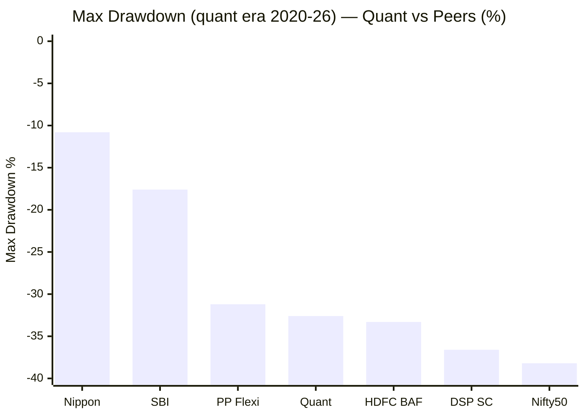
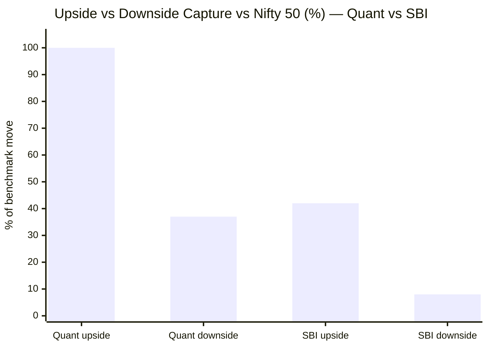
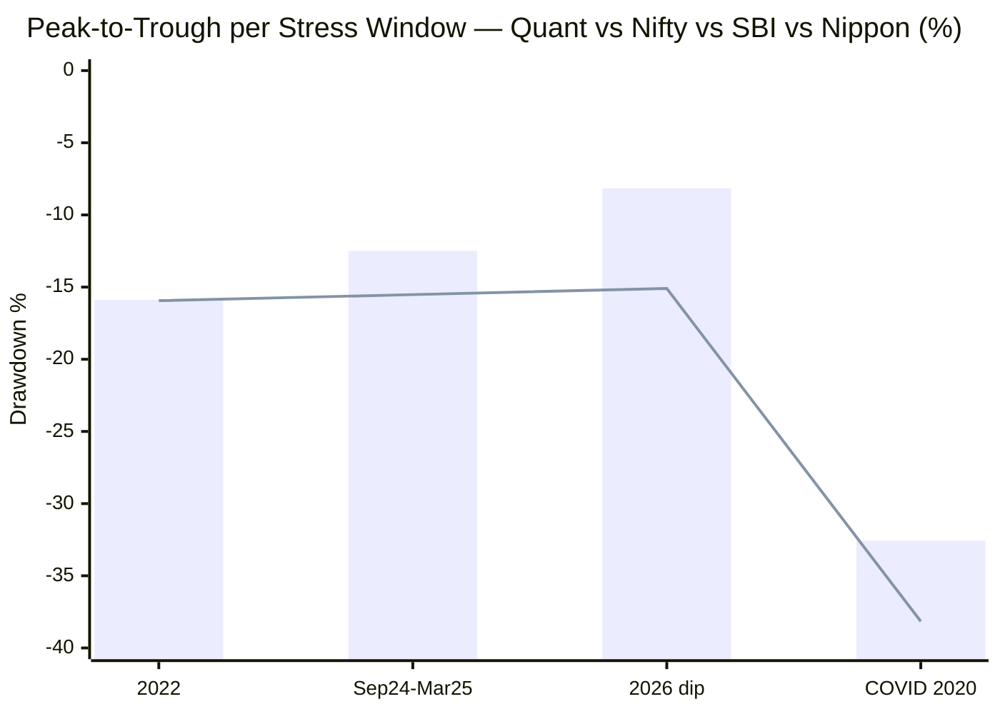
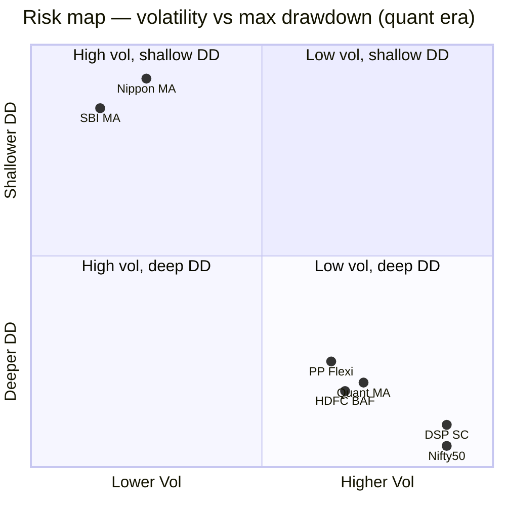
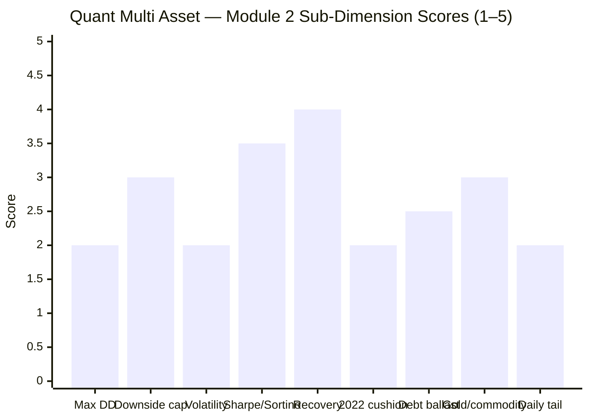

# Module 2: Risk Profile — Quant Multi Asset Allocation Fund

> **Provisional Module 2 score: ~2.6 / 5** (weight **25%** — the top weight, because risk *is* the multi-asset thesis). **Scores are NOT comparable to the four equity categories.**

> **The one-line context:** this is where Quant's spectacular Module 1 collapses. On the study's highest-weighted axis, **Quant fails the multi-asset risk test.** Its risk is *equity-level*, not multi-asset-level: **volatility ~15% and a −32.6% COVID drawdown** (deeper than SBI, Nippon, and even PP FlexiCap), **zero cushioning in the 2022 all-diverge year** (it fell as much as the Nifty), and a **0.79 correlation to the equity you already own.** Its high Sharpe (1.2–1.5) is *seductive but misleading* — it is driven by huge returns over high risk, not by low risk. A "multi-asset" fund that draws down like an equity fund is not doing the job the category exists for.

---

## ⚠ Methodology Note (read first)

Per Module 1, the **pre-2020 (Escorts-era) NAV series is unreliable** (data artifacts). **This module computes all risk metrics over the quant era (2020+)** — the reliable, representative window. This has one *favourable* consequence for honesty: the quant era **includes the COVID crash**, so unlike Nippon (which launched post-COVID), **Quant is genuinely severe-bear-tested** — and the result (−32.6%) is the honest number.

---

## Fund Identity / Raw Data (MFAPI quant-era, as of 29-Jul-2026)

| Metric | Value | Source |
|--------|-------|--------|
| MFAPI scheme code | 120821 (quant era: 1,622 days, 78 months) | api.mfapi.in |
| **Volatility (annualized, quant era)** | **14.95%** (daily) / 17.76% (monthly-ann.) | MFAPI |
| **Max drawdown (quant era)** | **−32.57%** (COVID 2020) — equity-level | MFAPI |
| **Downside capture vs Nifty 50** | **37%** (monthly) | MFAPI (31 down-months) |
| Upside capture vs Nifty 50 | **100%** | MFAPI (47 up-months) |
| **Beta vs Nifty 50** | **0.73** | MFAPI |
| Sharpe (quant-era monthly, rf 6.5%) | **1.22** (Tickertape 1.52) | MFAPI / Tickertape |
| Sortino (quant era) | **2.01** | MFAPI |
| Calmar (quant CAGR ÷ max DD) | ~0.80 | MFAPI |
| **Correlation to PP FlexiCap / Nifty / SBI** | **0.79 / 0.74 / 0.78** | MFAPI (78 months) |
| Correlation to Gold / Debt legs | 0.18 / 0.19 | MFAPI |
| Worst / best day | **−7.85% / +5.91%** | MFAPI |
| Debt sleeve (screener) | ~10.5% — **low; little debt cushion** | Tickertape |

---

## Cross-Source Verification

| Metric | MFAPI (quant era) | Tickertape | Verdict |
|--------|-------------------|-----------|---------|
| Sharpe | 1.22 | 1.52 | ⚠️ Both high — but **return-driven**; the high Sharpe masks equity-level absolute risk |
| Volatility | 14.95% | 9.9% (stdDev) | ⚠️ Tickertape understates; my daily figure (15%) is the honest one — near-equity |
| Max drawdown | −32.6% | premium | Self-computed; **the decisive risk number** |
| Downside capture | 37% (monthly) | not published | Flattered by the monthly frame — the −32.6% event tells the truer story |

**Reliability: High (quant era).** The key reconciliation: Quant's **risk-adjusted** metrics look great, but its **absolute** risk (vol, drawdown) is equity-level. The Sharpe is high because the *return* is high, not because the *risk* is low — the single most important thing to understand about this fund.

---

## 1. ⭐ Max Drawdown — Equity-Level, and It Saw COVID

| Drawdown | Peak → Trough | Depth | Recovery |
|----------|---------------|-------|----------|
| **COVID 2020** | 20 Feb → 23 Mar 2020 | **−32.57%** | 127 days |
| 2022 (rate shock) | Apr → Jun 2022 | −15.89% | 79 days |
| 2024–25 correction | Sep 2024 → Mar 2025 | −12.49% | 94 days |
| Early-2022 | Jan → Feb 2022 | −12.16% | 39 days |
| 2026 dip | Jan → Mar 2026 | −8.16% | 44 days |

**The −32.6% COVID drawdown is the module's defining number.** It is deeper than SBI (−17.6%), Nippon (−10.8%), and PP FlexiCap (−31.2%) — it sits **right next to HDFC Balanced Advantage (−33.3%) and not far from pure equity** (DSP SmallCap −36.6%, Nifty −38.2%). Unlike Nippon, Quant *was* there for COVID, so this is not a beta-implied estimate — it is what the fund *actually did* in a severe bear: it fell like an equity fund. The one redeeming feature is **fast recovery** (127 days) — its momentum style snaps back quickly — but the drawdown itself disqualifies it as a *defensive* sleeve.

---

## 2. ⭐ Capture & Beta — Seductive Ratios, Equity-Level Reality

| Measure | **Quant** | SBI | Read |
|---------|-----------|-----|------|
| Upside capture | **100%** | 42% | Captures *all* of equity's upside — it's that aggressive |
| Downside capture | **37%** | 8% | Monthly frame looks OK; the −32.6% event says otherwise |
| Beta vs Nifty | **0.73** | 0.32 | High — more than double SBI |
| Volatility | **14.95%** | 8.58% | Near-equity |

**The capture ratios flatter Quant** — a 100/37 profile *looks* attractive. But two things undercut it: (1) the **monthly** downside-capture (37%) hides the **intra-event** −32.6% drawdown (fast crashes don't show up cleanly in monthly capture); (2) a 100% upside / 0.73 beta / 15% vol fund is, by construction, **an aggressive equity-plus vehicle**, not a dampener. Quant participates fully in equity's upside and takes equity-level hits in fast crashes. The asymmetry that exists is *momentum snap-back*, not *protection*.

---

## 3. ⭐ Realised Cushioning — Zero in 2022 (the damning result, Tier-1)

> Bar = Quant · Line = Nifty 50

| Event | Quant | Nifty | SBI | Nippon | Quant cushion vs Nifty |
|-------|-------|-------|-----|--------|-------------------------|
| **2022 (all-diverge)** | **−15.89%** | −15.94% | −7.53% | −9.49% | **~0pp — NO cushioning; fell like the Nifty** |
| Sep 2024–Mar 2025 | −12.49% | −15.52% | −6.20% | −7.96% | +3.0pp (weak; SBI/Nippon far better) |
| 2026 dip | −8.16% | −15.10% | −8.59% | −10.78% | +6.9pp (decent here) |
| **COVID 2020** | −32.57% | −38.16% | −17.6%* | (didn't exist) | +5.6pp (but −32.6% absolute is equity-level) |

**The 2022 result is damning.** In the one year the entire multi-asset thesis is built for — equity and debt both falling, gold rising — **Quant provided essentially zero cushioning** (−15.89%, matching the Nifty's −15.94%), while SBI (−7.5%) and Nippon (−9.5%) did their job. Quant's aggressive, equity-heavy, low-debt (~10.5%) book, and its *under-ownership of gold* (M1's 2025 lag), meant it had no ballast when it was needed. Its cushioning is **inconsistent and regime-dependent** — weak-to-absent in 2022, decent in 2026. For a risk-reduction product, failing the 2022 test is close to disqualifying.

---

## 4. Correlation to Existing Sleeves — a Poor Diversifier (Tier-1)

| vs | Quant corr | (SBI) | (Nippon) |
|----|-----------|-------|----------|
| **PP FlexiCap** (the core) | **0.79** | 0.73 | 0.82 |
| Nifty 50 | 0.74 | 0.77 | 0.88 |
| DSP SmallCap | 0.74 | 0.72 | 0.65 |
| Gold leg | 0.18 | 0.14 | 0.23 |
| Debt leg | 0.19 | 0.22 | 0.35 |

Quant is **~0.79 correlated to the FlexiCap core** — a poor diversifier, worse than SBI (0.73), comparable to Nippon (0.82). Its equity-heavy, momentum book *is* largely the equity you own (with a momentum tilt). The genuine decorrelation comes only from the gold/commodity + tiny debt sleeves (0.18/0.19) — and 2022/2025 showed the fund does not reliably *use* them for protection. **For a 100%-equity portfolio seeking diversification, Quant adds the least genuine non-equity of the three cycle-tested funds relative to the risk it brings.** (Informational — feeds the decision tree.)

---

## 5. Sharpe/Sortino — High, but for the Wrong Reason

| Metric | Quant | SBI | Nippon | Read |
|--------|-------|-----|--------|------|
| Sharpe (quant era) | **1.22** (TT 1.52) | 0.94 | 1.34 (bull-infl.) | Highest headline — but... |
| Sortino | 2.01 | 1.51 | 2.30 | ...driven by the 28% return numerator |
| Volatility | **14.95%** | 8.58% | 9.52% | ...over the *highest* risk denominator |
| Max DD | **−32.6%** | −17.6% | −10.8% | The absolute risk the Sharpe hides |

**This is the seduction to resist.** Quant's screening Sharpe (1.52) was a headline attraction — but a high Sharpe from a *high return over high risk* is a fundamentally different (and more fragile) thing than a high Sharpe from *low risk*. If the momentum regime turns and the 28% return compresses toward the mean, the same 15% vol and −32.6% drawdown remain — and the Sharpe collapses. **A high Sharpe built on regime-dependent momentum returns is not a risk credential; it is a return credential in disguise.**

---

## 6. Cousin Comparison — Quant Sits With Equity Funds, Not Multi-Asset

| Fund | Vol | Max DD | Category |
|------|-----|--------|----------|
| SBI Multi Asset | 8.58% | −17.6% | Defensive multi-asset |
| Nippon Multi Asset | 9.52% | −10.8% | Balanced multi-asset |
| **Quant Multi Asset** | **14.95%** | **−32.6%** | **Sits with equity funds** |
| HDFC Balanced Advantage | 13.96% | −33.3% | — |
| PP FlexiCap (equity) | 13.63% | −31.2% | Equity |

**Quant's risk profile is indistinguishable from an equity fund's** — it clusters with PP FlexiCap and DSP SmallCap, not with SBI/Nippon. It is a *multi-asset fund in name and a high-beta momentum equity fund in behaviour.*

---

## 7. Multi-Asset-Specific Risks (NEW)

| Risk | Assessment | Status |
|------|------------|--------|
| **Debt-sleeve** | Only **~10.5%** — the lowest of the studied funds; **minimal debt ballast** (part of why 2022 hurt) | ⚠ structurally low |
| **Gold/commodity concentration** | High commodity weight (~part of the ~37% remainder), but **actively swung** — under-owned in 2025 (M1). Commodity + momentum-equity means volatile, not stabilising | ⚠ dynamic/volatile |
| **Equity-tax continuity** | **Dynamic tax status** (trailing-12m allocation) — the swinging allocation can flip tax tiers; a genuine, fund-specific complication → M4 | ⚠ M4 |
| **Severe-bear tested?** | **Yes — COVID −32.6%** (the one honest severe-bear result in the study; and it's bad) | ✅ tested / ❌ result |
| **Key-person / model risk** | The entire risk-return profile is one man's VLRT model (Tandon) — a concentration risk that is also a *risk-management* risk → M5 | ⚠ M5 |
| Redemption/liquidity | Moderate — momentum small/mid positions can be less liquid than a large-cap book | ⚠ note |

---

## 8. Daily Distribution — Very Volatile

| Metric | Value (quant era) |
|--------|-------------------|
| Positive days | 57.2% |
| Days down > 2% | **33** (vs SBI 9, Nippon 8) |
| Days up > 2% | **36** |
| Worst / best day | **−7.85% / +5.91%** |

Quant has **~4× as many >2% days** as SBI or Nippon — a genuinely turbulent daily ride, consistent with its momentum-equity character.

---

## Comparison with Studied Funds

| Metric | **Quant MA** | Nippon MA | SBI MA |
|--------|--------------|-----------|--------|
| Volatility | **14.95%** | 9.52% | 8.58% |
| Max drawdown | **−32.6%** (saw COVID) | −10.8% (no bear) | −17.6% (saw COVID) |
| Downside capture | 37% | 38% | **8%** |
| Beta | 0.73 | 0.58 | **0.32** |
| 2022 cushion | **~0pp (none)** | +6.5pp | +8.4pp |
| Corr to PP core | 0.79 | 0.82 | **0.73** |
| Risk role | **Aggressive (equity-like)** | Balanced | Defensive |
| Module 2 | **~2.6** | 3.6 | **4.5** |

**On the 25%-weighted risk axis, Quant is last by a wide margin.** SBI (4.5) is the deep dampener, Nippon (3.6) the moderate one, Quant (2.6) is not a dampener at all. Its Module 1 returns lead is bought entirely with the risk this module exposes.

---

## Points For / Points Against — Risk

### ✅ For
1. **Genuinely severe-bear-tested** — it lived through COVID (unlike Nippon); the −32.6% is honest, not estimated.
2. **Fast recoveries** — COVID recovered in 127 days; momentum snaps back.
3. **High risk-adjusted headline metrics** (Sharpe 1.2–1.5, Sortino 2.0) — *if* the return regime persists.
4. **100% upside capture** — participates fully in equity rallies.
5. Cushioned reasonably in 2026 (+6.9pp) and 2024–25 (weakly).

### ❌ Against
1. **Equity-level drawdown (−32.6%)** — deeper than every studied fund except pure equity; not a risk-reducer.
2. **Zero cushioning in 2022** — fell as much as the Nifty in the exact year multi-asset is built for.
3. **Volatility ~15%** — double SBI/Nippon; near-equity.
4. **Poor diversifier (0.79 to PP)** — largely the equity you own, with momentum beta.
5. **High Sharpe is return-driven, not risk-driven** — fragile if the momentum regime turns.
6. **Lowest debt ballast (~10.5%)** and actively-swung (sometimes-absent) gold — little reliable ballast.
7. **Turbulent daily ride** — 33 down->2% days; worst day −7.85%.

---

## Module 2 Scorecard

| Sub-dimension | Score | Reasoning |
|---------------|-------|-----------|
| Max drawdown | **2.0** | −32.6% — equity-level; deeper than every studied fund bar pure equity |
| Downside capture | **3.0** | 37% monthly looks OK but the −32.6% event belies it |
| Volatility | **2.0** | 14.95% — double the defensive funds; near-equity |
| Sharpe / Sortino | **3.5** | 1.2–1.5 high, but return-driven, not risk-driven — fragile |
| Recovery time | **4.0** | Fast (COVID 127d) — momentum snap-back |
| 2022 & realised cushioning | **2.0** | ~0pp cushion in 2022 — failed the defining test |
| Debt ballast | **2.5** | Lowest debt (~10.5%); little stabiliser |
| Gold/commodity as ballast | **3.0** | High but actively swung; under-owned in 2025 — volatile, not stabilising |
| Daily tail risk | **2.0** | 33 down->2% days; worst −7.85% |
| Correlation to sleeves | *informational* | 0.79 to PP — poor diversifier; decision-tree feed |
| **Module 2 Overall** | **~2.6 / 5** | Fails the multi-asset risk test — equity-level drawdown and volatility, zero 2022 cushioning, poor diversification. The high Sharpe is a return credential in disguise. Held off the floor only by fast recoveries and genuine bear-testing. **The lowest M2 in the study.** |

---

## Comparative Module 2 Scores (studied funds)

| Fund | Module 2 | Character |
|------|----------|-----------|
| SBI Multi Asset | **4.5** | Deep defensive protection |
| Edelweiss MidCap | ~4.2 | — |
| PP FlexiCap | 4.0 | — |
| Nippon Multi Asset | 3.6 | Moderate dampener |
| DSP SmallCap | 3.8 | — |
| **Quant Multi Asset** | **~2.6** | **Equity-level risk; not a dampener** |

> The 25% risk weight is where Quant's Module 1 lead evaporates. SBI 4.5 vs Quant 2.6 on the *most heavily weighted module* is a ~0.5-point swing in the final score — enough to offset most of Quant's returns advantage.

---

## SIP Implication

For a ₹15–20k/month SIP, Module 2 is the reality check on Quant's dazzling returns. This is **not a risk-reducing multi-asset sleeve** — it draws down like an equity fund (−32.6% in COVID), provided *no* cushioning in 2022, and is ~0.79 correlated to the equity you already own. An investor who adds Quant to a 100%-equity portfolio expecting *diversification or protection* will get neither; they will get a second aggressive equity-like fund with a momentum tilt and some gold. The seductive Sharpe (1.5) is doing marketing work here — it is high because the returns were high, not because the risk is low, and if the momentum regime turns, the risk stays while the return fades. Quant may suit an aggressive investor consciously seeking *return maximisation* who can stomach a −33% drawdown — but on the axis that defines this category, and that carries the most weight, it is the weakest fund studied.

## One-Line Verdict

**Quant fails the multi-asset risk test on the study's highest-weighted axis — equity-level volatility (~15%) and a −32.6% COVID drawdown, zero cushioning in the 2022 all-diverge year, and a 0.79 correlation to the equity you already own — with a seductive-but-misleading Sharpe that is a return credential in disguise; a high-beta momentum fund wearing a multi-asset label.**

---

*Module 2 complete. Provisional score 2.6/5. Method: self-computed from MFAPI 120821, **quant era (2020+) only** (pre-2020 data unreliable — M1); correlations vs Nifty 50 (120620), PP FlexiCap (122639), DSP SmallCap (119212), SBI (119843), Nippon (148457); cousins HDFC BAF (118968); legs SBI Gold (119788), ICICI All Seasons Bond (120603). **Cross-module retrofit (Edelweiss discipline):** M2 *confirms and sharpens* M1's caveat — Quant's returns are earned with equity-level risk, and it fails the 2022 cushioning test that defines the category. No M1 score change, but the fund's identity is now clear: **an aggressive momentum-quant fund, not a risk-reducer.** **Handoffs:** the VLRT allocation/momentum engine → M3; the dynamic tax status → M4; the Tandon key-person/model risk → M5; the SEBI probe → M6.*

*Next: [Module 3 — Allocation Engine & Portfolio DNA](module3_allocation.md)*
