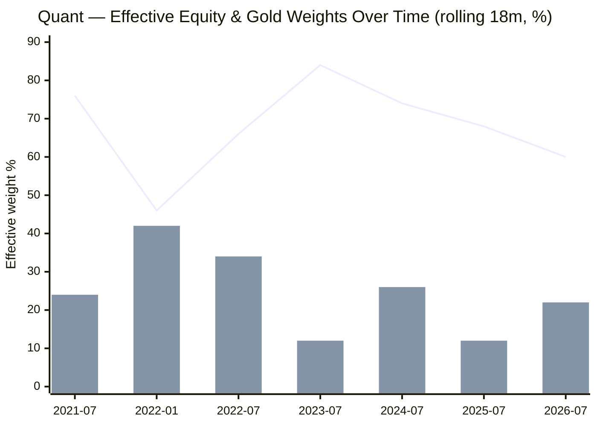
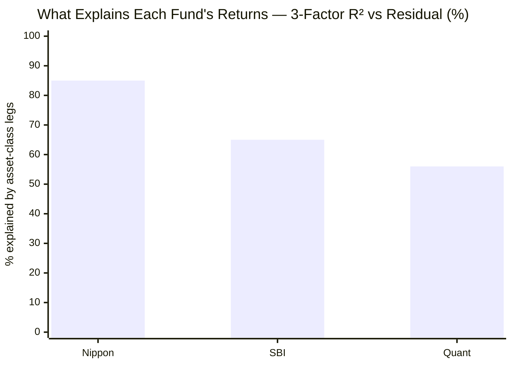
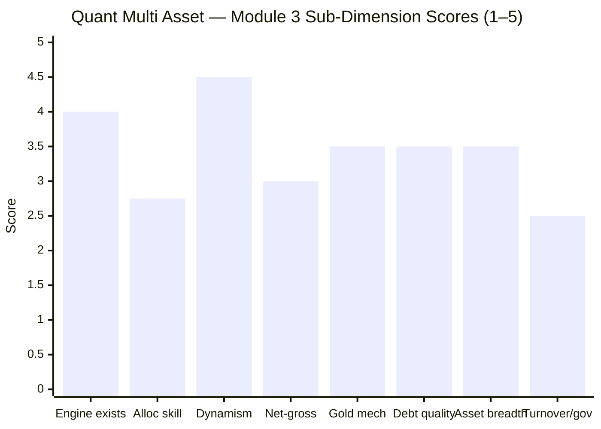

# Module 3: Allocation Engine & Portfolio DNA — Quant Multi Asset Allocation Fund

> **Provisional Module 3 score: ~3.3 / 5** (weight **20%** — the category's defining module). **Scores are NOT comparable to the four equity categories.**

> **The one-line context:** Quant has the **most genuinely dynamic allocation engine in the study** — the VLRT model swings equity 46–84% and gold 6–54%, far harder than SBI (static drift) or Nippon (gentle oscillation). That is real and distinctive. But three findings pull the score back to the middle: the engine is oriented to **return-maximisation, not risk-managed diversification** (it produced the −32.6% drawdown and zero 2022 cushion of M2); its allocation *timing* has been **mixed-to-poor** (it under-owned gold in gold's monster 2025); and — most tellingly — **44% of its returns are momentum *stock-selection*, not asset allocation** (the highest residual in the study). It is, in large part, an aggressive momentum *equity* engine with an asset-allocation overlay, not a genuine multi-asset allocator.

---

## ⚠ Data-Access Note (read first)

Combines **return-based style analysis** (quant-era 2020+, the reliable window) with **factsheet holdings** (ValueResearch). Quant's allocation is so dynamic that any single factsheet snapshot is a poor guide — the style analysis (which infers *behaviour* over time) is the more honest tool here. Turnover, holdings count, and sector % remain factsheet-deferred (not published by aggregators — a recurring gap, and one that matters more for a high-churn fund).

---

## Fund Identity / Raw Data

| Attribute | Value | Source |
|-----------|-------|--------|
| MFAPI scheme code | 120821 (quant era: 78 monthly obs) | api.mfapi.in |
| **Effective weights (quant-era avg, style analysis)** | **EQ 74% / DEBT 0% / GOLD 26%** (equity beta-equivalent — momentum book runs > Nifty beta) | MFAPI regression |
| **Effective range (rolling 18m)** | **EQ 46–84% · GOLD 6–54%** — the widest swings in the study | MFAPI regression |
| Net equity (screener) | 52.7% (label); **effective ~74%** (high-beta momentum) | Tickertape / MFAPI |
| **3-factor R²** | **56.1%** (→ **43.9% residual = momentum stock-selection**, highest in study) | MFAPI regression |
| Gold/silver vehicle | **Nippon GOLDBEES ETF (8.4%) + Nippon SILVERBEES ETF (1.5%)** — uses the market-leading ETFs (not proprietary) | VR holdings |
| Debt holdings | **GOI 6.92% 2039 gilt + NABARD/EXIM CDs** — **high-grade (govt + AAA quasi-sovereign)**; but the 2039 gilt carries **duration risk** | VR |
| Debt weight | ~10.5% (screener) — low; effective ~0% at times | Tickertape/MFAPI |
| **Allocation model** | **VLRT** (Valuation-Liquidity-Risk appetite-Time) — Tandon's proprietary momentum/behavioural quant model | quant |
| Turnover | **factsheet — deferred** (Quant is industry-known for *very high* turnover) | SID |
| Managers | Sandeep Tandon (CIO/CEO) + 6-person team → M5 | VR |

---

## Cross-Source Verification

| Metric | Style analysis | Screener/holdings | Verdict |
|--------|----------------|-------------------|---------|
| Effective equity | ~74% (beta-equiv) | 52.7% (net label) | ⚠️ Style analysis reads *higher* — Quant's momentum equity runs a **beta above the Nifty**, so its effective equity exposure exceeds the label. This is why M2's risk was equity-level |
| Gold | ~26% (era avg) | ~10% (current snapshot: GOLDBEES 8.4% + silver 1.5%) | ⚠️ Huge gap = the **dynamic swinging** (gold ranged 6–54%); current is low, era-average high |
| Debt | ~0% (effective) | ~10.5% (label) | ⚠️ Debt is nominally ~10% but contributes little; high-grade but minimal |

**Reliability: High for the *behaviour* (the style analysis captures the aggressive swinging); a single snapshot is misleading for this fund.** The key reconciliation: the label understates the effective equity (momentum high-beta) and the gold weight is a moving target.

---

## 1. ⭐ The VLRT Engine — Genuinely Dynamic, but Return-Oriented

> Line = effective **equity** · Bar = effective **gold**

Quant's allocation genuinely *moves* — and moves hard. Equity swung **46–84%**, gold **6–54%** (std 13pp) — **the widest swings of any fund studied.** This is a real, active, distinctive allocation engine (VLRT), not SBI's drift or even Nippon's gentle oscillation. Credit where due: **the engine exists and is genuinely dynamic.**

But grading the calls exposes the problem — **the engine is a return-seeker, and its timing is mixed:**

| Move | What it did | Skilful? |
|------|-------------|----------|
| Equity ~76% into 2021 | Rode the momentum mania (M1's +57%) | ➕ Great *for returns* (not risk) |
| Equity → 84% by mid-2023 | Maxed equity into the 2023–24 bull | ➕ Returns; ❌ aggressive |
| **Gold ~12% through mid-2025** | **Under-owned gold in its +72% year** | ❌ **Badly mistimed the decade's biggest gold move** |
| Gold 42% into early 2022 | Raised gold — yet still no 2022 cushion (M2) | ➖ Smoothed-window artifact; the fund still fell like equity |

**The engine optimises for return, not risk** — it maxes equity in bull markets (driving the returns *and* the −32.6% drawdown), and it got the single most important commodity call of the period (2025 gold) wrong. For a category where the allocation engine is supposed to *manage risk*, a dynamic engine pointed at return-maximisation is a double-edged asset.

---

## 2. ⭐ 44% of Returns Are Momentum Stock-Selection, Not Allocation

The 3-factor style regression explains only **56.1%** of Quant's returns — the **lowest R² in the study** (SBI 65%, Nippon 85%). The 44% residual is the tell:

**44% of Quant's returns are *not* explained by the equity/debt/gold index legs** — it is momentum **stock-selection** (concentrated, high-beta momentum names that beat the index massively in bull runs), possibly with derivative/leverage overlays. This reframes the whole fund:

> **⭐ RETROFIT to M1:** Module 1 credited Quant with a colossal +10.7% blended-benchmark alpha. M3 shows **most of that alpha is momentum *equity stock-picking*, not asset *allocation*.** The VLRT model's edge is picking momentum stocks that soar in trending markets — an *equity-fund* skill deployed inside a multi-asset wrapper. So Quant is, in large part, **an aggressive momentum equity fund** that also swings its gold weight — not primarily a multi-asset *allocator*. This confirms M2 (equity-level risk) and reframes M1 (the alpha is momentum beta + stock-selection, not allocation skill). No M1/M2 score change.

---

## 3. Asset-Class Composition, Debt Quality & Gold Mechanism (NEW)

| Dimension | Assessment | Status |
|-----------|------------|--------|
| **Debt-book quality** | **A positive surprise:** GOI gilts + NABARD/EXIM CDs = **high-grade (govt + AAA quasi-sovereign)** — *better credit quality than SBI (Adani Power) or Nippon (Muthoot)*. BUT the **2039 gilt carries duration/rate risk**, and the sleeve is **minimal (~10%)** | ✅ credit-clean / ⚠ duration + tiny |
| **Gold/silver mechanism** | Via **Nippon GOLDBEES + SILVERBEES ETFs** (physical-backed, market-leading, low-cost) — good vehicles, but *bought-in*, not proprietary; **swung 6–54%** (poorly timed in 2025) | ✅ vehicle / ❌ timing |
| **Net-vs-gross / effective equity** | Label ~53%, **effective ~74%** (momentum high-beta) — the *true* risk exposure is higher than the label; dynamic tax status follows the swings | ⚠ higher than labelled |
| **Asset breadth** | Equity + gold + silver + minimal debt (~3–4 classes). No international evident | ✅ mandate met (on paper) |
| **SEBI mandate strain** | Effective debt hit ~0% at times; the aggressive swinging can **strain the ≥10%-each-of-3-classes spirit** (on-paper compliance likely maintained at reporting dates) | ⚠ note |

> **Minor retrofit to M2:** the debt sleeve's *credit* quality is actually **good** (govt/AAA) — better than I implied. The M2 "little ballast" point stands on *quantity* (~10%) and adds a *duration* caveat (the 2039 gilt), but the credit quality is clean. Net: no M2 score change.

---

## 4. Rebalancing Discipline — Extreme, and Connected to the M6 Risk

Quant rebalances **more aggressively than any fund studied** — the 46–84% equity and 6–54% gold swings imply **very high turnover** (Quant is industry-known for turnover multiples of peers). This is genuine *activity*, but it carries three costs:
1. **Transaction/impact costs** (a high-turnover drag, though the low ER partly absorbs it).
2. **Timing risk** — more trades = more chances to be wrong (the 2025 gold miss).
3. **⚠ The governance connection** — the **SEBI front-running probe (→ M6)** is precisely about front-running Quant's large momentum orders. **The fund's defining characteristic (high-turnover momentum trading) is the same activity under regulatory investigation.** The allocation engine and the governance risk are two sides of one coin.

---

## 5. Overlap with Existing Sleeves (informational)

Quant's momentum equity book (effective ~74%) is **~0.79 correlated to PP FlexiCap** (M2) — a poor diversifier. Its momentum names (small/mid-cap tilt likely) may overlap less with PP's large-caps than SBI/Nippon's index-like books do, but the correlation is high regardless. The genuine non-overlap is the gold/silver — which the fund swings unreliably. Holdings-level overlap → deferred (top-10 shows the ETFs + debt, not the momentum equity book).

---

## Comparison with Studied Funds

| Dimension | **Quant MA** | Nippon MA | SBI MA |
|-----------|--------------|-----------|--------|
| Allocation engine | **Most dynamic (VLRT)** | Real, gentle | None (drift) |
| Effective equity range | **46–84%** | 54–70% | drift to ~50% |
| Gold range | **6–54%** | 12–24% | ~10% static |
| 3-factor R² (allocation-explained) | **56% (lowest)** | 85% | 65% |
| Alpha source | **Momentum stock-selection (44% resid)** | Allocation-weight | Equity-style |
| Debt credit quality | **High (govt/AAA)** | NBFC (Muthoot) | Corp (Adani Power) |
| Engine orientation | **Return-max** | Return-seeking | None |
| Module 3 | **~3.3** | 3.4 | 3.0 |

**Quant vs Nippon on Module 3:** near-tie, and instructive. Nippon's engine is gentler but its book is more genuinely *diversified* (six sleeves incl. international) and more of its return is *allocation*. Quant's engine is far more *dynamic* but its return is mostly *momentum stock-picking* (44% residual) and its debt/gold are minimal or mistimed. Nippon edges it as a *multi-asset allocator*; Quant is more a *momentum equity fund with an allocation overlay.*

---

## Points For / Points Against — Allocation Engine & DNA

### ✅ For
1. **The most genuinely dynamic allocation engine in the study** — VLRT swings equity 46–84%, gold 6–54%; real, distinctive, active.
2. **High-grade debt** — govt gilts + AAA quasi-sovereign (NABARD/EXIM); cleaner credit than SBI or Nippon.
3. **Low-cost, physical-backed gold/silver ETFs** (Nippon GOLDBEES/SILVERBEES).
4. **Caught the 2021 momentum mania** via the engine — a real, if regime-specific, capability.
5. Mandate met on paper (3 classes).

### ❌ Against
1. **44% of returns are momentum stock-selection, not allocation** — it's largely an equity fund in a multi-asset wrapper.
2. **The engine is return-oriented, not risk-managed** — it produced the −32.6% drawdown and zero 2022 cushion (M2).
3. **Mixed-to-poor allocation timing** — badly under-owned gold in its +72% 2025.
4. **Effective equity (~74%) exceeds the label (~53%)** — the true risk exposure is higher than it appears.
5. **Extreme turnover** — costs, timing risk, and the direct connection to the SEBI front-running probe (M6).
6. **Minimal debt (~10%) with duration risk** (2039 gilt) — little reliable ballast.
7. **SEBI mandate strain** — effective debt hit ~0% at times.

---

## Module 3 Scorecard

| Sub-dimension | Score | Reasoning |
|---------------|-------|-----------|
| Allocation model — exists & is testable | **4.0** | The most genuine, distinctive engine in the study (VLRT) |
| Allocation *skill* | **2.75** | Return-oriented; mistimed gold 2025; 44% of return is stock-selection not allocation |
| Dynamism (tactical range) | **4.5** | Widest swings in the study (eq 46–84%, gold 6–54%) |
| Net-vs-gross / effective equity | **3.0** | Effective ~74% > label ~53%; dynamic tax; true risk higher than it looks |
| Gold/silver mechanism | **3.5** | Good vehicles (Nippon ETFs), but bought-in and mistimed |
| Debt-book quality | **3.5** | High credit grade (govt/AAA) — a plus; but minimal + duration risk |
| Asset breadth | **3.5** | 3–4 classes; mandate met; no international |
| Turnover / governance connection | **2.5** | Extreme turnover; directly tied to the SEBI probe (M6) |
| Overlap with sleeves | *informational* | 0.79 to PP — decision-tree feed |
| **Module 3 Overall** | **~3.3 / 5** | The most dynamic engine in the study — but return-oriented, mistimed on gold, and only ~56% of returns are actually *allocation* (44% is momentum stock-picking). A genuine engine pointed the wrong way for this category |

---

## Comparative Module 3 Scores (studied funds)

| Fund | Module 3 | DNA verdict |
|------|----------|-------------|
| DSP SmallCap | 3.8 | Conviction stock-picker |
| Nippon Multi Asset | 3.4 | Real engine + broadest book (intl) |
| **Quant Multi Asset** | **~3.3** | **Most dynamic engine — but return-oriented, mistimed, mostly momentum stock-selection** |
| SBI Multi Asset | 3.0 | Static mix, no engine |

> Quant's engine is the most *active* in the study, but Module 3 is scored on whether the engine serves the category's purpose (risk-managed allocation) and whether the edge is genuine *allocation* — on both, Quant is middling. It out-*dynamises* everyone and out-*allocates* no one.

---

## SIP Implication

For a ₹15–20k/month SIP, Module 3 clarifies what Quant's "multi-asset allocation" really is: **an aggressive momentum equity engine (that's where 44% of the return comes from) with a very actively-swung gold overlay (that it mistimed in 2025).** The VLRT model is real and genuinely dynamic — you are not paying for a static mix — but it is built to *maximise return in trending markets*, not to *manage risk across assets*, which is why M2 found equity-level drawdowns. The debt sleeve is high-quality but too small to matter. And the fund's defining behaviour — high-turnover momentum trading — is the exact activity under SEBI investigation. A SIP investor should understand they are buying a momentum quant strategy with an asset-allocation veneer, run by one man's model, not a diversified multi-asset allocator.

## One-Line Verdict

**The most dynamic allocation engine in the study (VLRT swings equity 46–84%, gold 6–54%) — but it is a *return-maximising momentum engine*, not a risk-managed allocator: 44% of its returns are momentum stock-selection rather than allocation, it badly mistimed gold in 2025, its effective equity (~74%) exceeds its label, and its defining high-turnover trading is the very activity under SEBI investigation.**

---

*Module 3 complete. Provisional score 3.3/5. Method: return-based style analysis (quant era 2020+, MFAPI 120821 vs Nifty 50 120620 / ICICI All Seasons Bond 120603 / SBI Gold 119788, 78 monthly obs) + factsheet holdings (ValueResearch). **Cross-module retrofits (Edelweiss discipline):** (1) **M1** — 44% residual means the alpha is momentum stock-selection, not allocation skill; (2) **M2** — the debt is high *credit* quality (govt/AAA), softening the "ballast" critique on quality (not quantity); (3) the extreme turnover connects directly to the **M6 SEBI front-running probe.** No prior scores change. **Deferred:** exact turnover, holdings count, sector %, leverage/derivative disclosure — factsheet items the aggregators don't publish (a bigger gap for a high-churn fund).*

*Next: [Module 4 — Cost & Tax Efficiency](module4_cost_tax.md)*

---

# ⚠ ADDENDUM (Aug 2026) — SID Mandate Bands, and Effective Equity Beta Above the Mandate Ceiling

> **Why this addendum exists.** This module deferred the SID allocation bands, turnover, holdings count, sector percentages and derivative disclosure — *"factsheet items the aggregators don't publish (a bigger gap for a high-churn fund)."* The SID has now been retrieved and closes the first of those. It also produces a finding the module could not have reached without it.

## A1. The SID allocation bands — verbatim

> *"Under normal circumstances the asset allocation will be:"*
>
> | Instrument | Min | Max |
> |---|---|---|
> | Equity and equity related instruments | **10%** | **80%** |
> | Debt and money market instruments | **10%** | **80%** |
> | Gold ETF, Silver ETF & any other mode of investment in commodities (excluding commodity derivatives) | **10%** | **80%** |
> | **Exchange Traded Commodity Derivatives (ETCDs)** & any other mode of investment in commodities | **0%** | **30%** |
> | Units issued by REITs / InvITs | **0%** | **10%** |
>
> — *quant Multi Asset Fund SID (March 2025), Part II §A, verbatim*

**This is the widest mandate in the study — 10–80% on all three primary classes simultaneously**, versus WOC's 10–80/10–80/10–50 and ICICI's tighter working bands. It formally licenses the extreme dynamism this module measured, and confirms the "genuine engine" characterisation is mandate-backed rather than drift.

## A2. ⚠ The finding: measured equity beta exceeds the mandate ceiling

Re-running the rolling-26-week style analysis on the settings used for every other fund:

| Fund | Rolling equity range | Range (pp) | sd (pp) | Static R² |
|---|---|---|---|---|
| **Quant** | **23.3 – 97.6%** | **74.3** | **19.2** | **0.582** |
| ICICI Pru | 39.4 – 93.7% | 54.3 | 12.3 | 0.822 |
| UTI | 38.2 – 77.6% | 39.4 | 9.0 | 0.900 |
| SBI | 28.3 – 60.0% | 31.7 | 7.0 | 0.855 |
| Nippon | 46.1 – 66.9% | 20.8 | 4.8 | 0.895 |

✅ **Quant is confirmed the most dynamic fund in the study by a wide margin, and the least reproducible by a static basket (R² 0.582).** Both of this module's central claims survive.

⚠ **But peak effective equity beta reached 97.6% — roughly 18 percentage points above the SID's own 80% equity ceiling.** Two readings, and the module cannot distinguish them from returns alone:

1. **A high-beta equity book.** If the equity sleeve holds momentum and small/mid names with betas well above 1.0, a 70–80% cash-equity weight can produce a 95%+ effective *beta* without breaching the mandate. This is the benign and more likely reading, and it fits the fund's documented VLRT momentum style.
2. **Derivative amplification.** The SID permits ETCDs to 30% and the scheme uses index futures (the SID illustrates short Nifty futures positions explicitly). Derivative exposure could lift effective beta above the cash-holding cap.

**Either way the practical implication is the same and it belongs in the risk assessment: an investor sizing this fund off its stated 10–80% equity band is understating the fund's peak market sensitivity by roughly a fifth.** This is a genuine addition to M2's case for Quant's equity-level risk.

## A3. What remains deferred

The SID does not publish them and no aggregator carries them: **portfolio turnover ratio** (the largest gap — Quant is industry-known for very high churn, and this module flagged it), **holdings count**, **sector percentages**, and **the derivative/leverage disclosure** that would settle §A2. These require the monthly factsheet, which was not retrievable.

## A4. Score

| Sub-dimension | Was | **Now** | Reason |
|---|---|---|---|
| Allocation model — exists & is testable | — | **unchanged** | ✅ **Confirmed by the SID's 10–80% bands** — the dynamism is mandate-licensed, not drift |
| Dynamism (tactical range) | — | **unchanged** | ✅ **Confirmed as the study's most dynamic** on identical peer settings (74.3pp range, sd 19.2, R² 0.582) |
| **Module 3 Overall** | **~3.3** | **~3.3 / 5 (unchanged)** | The SID **validates** this module's two central claims. The beta-above-ceiling finding is a **risk** observation, handed to M2, not an allocation-engine deduction |

---

*Addendum complete. **Method:** allocation bands taken **verbatim from the quant Multi Asset Fund SID (March 2025)**, retrieved from quantmutual.com and text-extracted. Dynamism re-computed on identical three-factor rolling-26-week settings to ICICI (120334), SBI (119843), UTI (120760) and Nippon (148457). **Handoff to M2:** peak effective equity beta of 97.6% against an 80% mandate ceiling is a material addition to the equity-level-risk case.*
