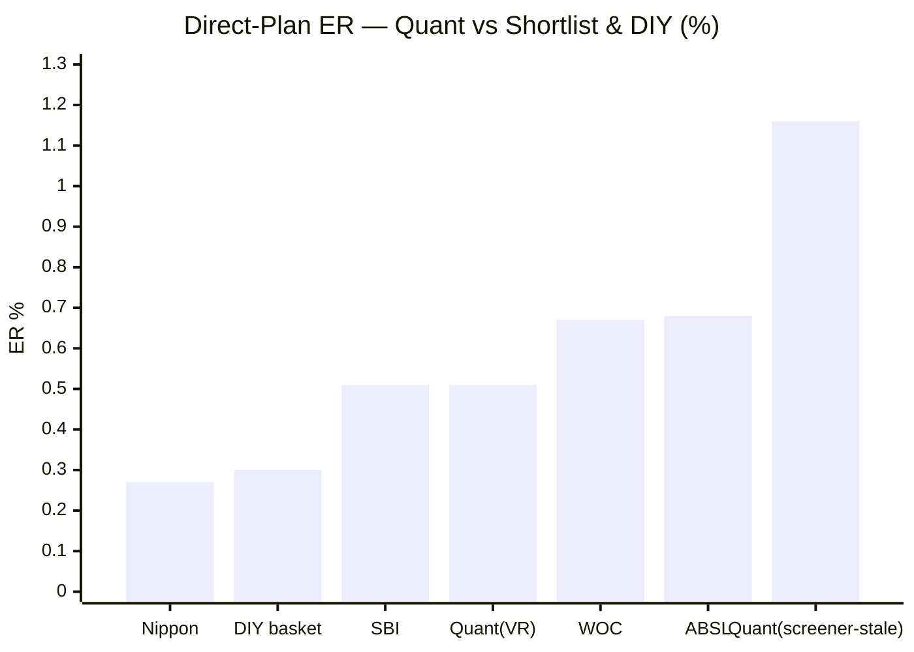
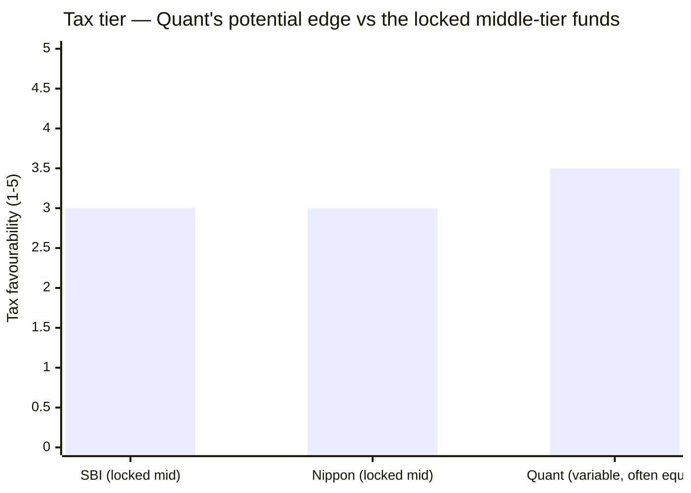
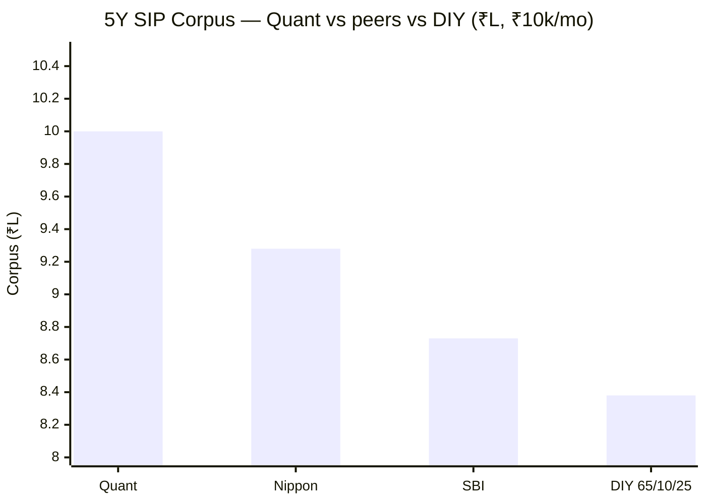
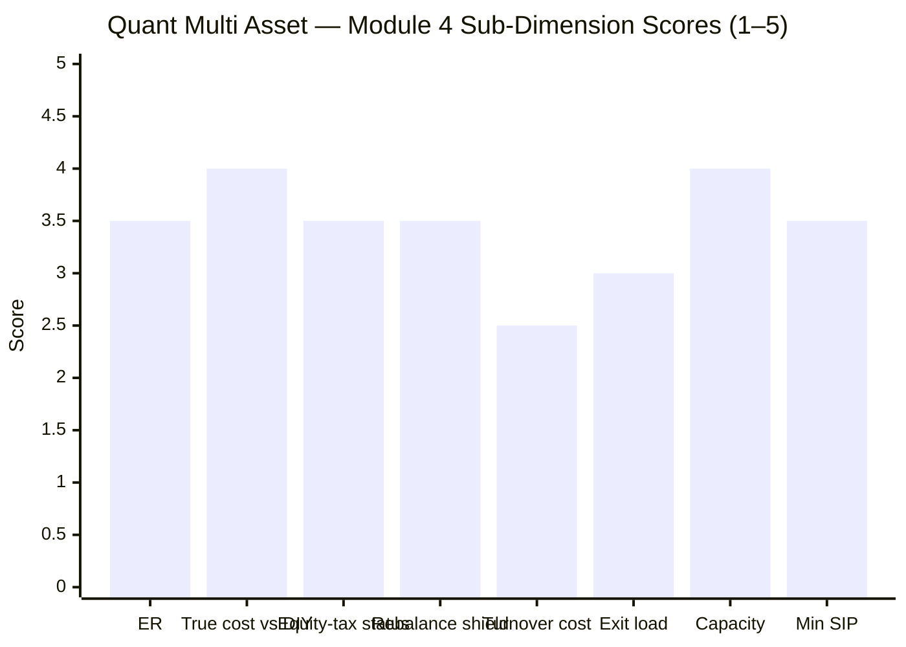

# Module 4: Cost & Tax Efficiency — Quant Multi Asset Allocation Fund

> **Provisional Module 4 score: ~3.5 / 5** (weight **20%**). **Scores are NOT comparable to the four equity categories.**

> **The one-line context:** a genuinely interesting, genuinely caveated module. Quant is the **only fund in the study that might be equity-*taxed*** (its aggressive, often-65%+ equity book), and — because it churns harder than any peer — it has the **largest internal-rebalancing tax shield.** It also **beats the DIY basket by the widest margin (+₹5.4L over 5Y post-tax)** and its real ER is **0.51%** (cost-competitive; the screener's 1.16% is stale). But every one of those positives is shadowed: the tax status is **variable and unconfirmed**, the DIY margin is **return-driven** (M1's regime-dependent returns), the extreme turnover carries **real transaction costs** — and it is the exact activity under the **SEBI front-running probe (M6).**

---

## Fund Identity / Raw Data

| Attribute | Value | Source |
|-----------|-------|--------|
| **Expense Ratio (Direct)** | **~0.51%** (VR) — **the screener's 1.16% is stale**; at 0.51% Quant is cost-competitive | ValueResearch / Tickertape |
| Expense Ratio (Regular) | ~1.8–1.9% (est.) — confirm SID | estimate |
| Exit load | **1%** (short-window; confirm SID) | Tickertape (exitLoad=1) |
| AUM | ~₹5,615–5,980 Cr — small, no capacity issue | Tickertape/VR |
| Min SIP / lumpsum | ₹1,000 / ₹1,000 | VR |
| **Taxation status** | **DYNAMIC — "based on trailing-12-month allocation, may vary"; potentially EQUITY-taxed** in high-equity periods (effective equity ~74%, M3) | VR |
| **Rebalancing** | **Extreme turnover** (M3: equity 46–84%, gold 6–54% swings) → largest cross-asset internal tax shield | M3 |
| Gold/silver vehicle | Nippon GOLDBEES + SILVERBEES ETF (low-cost, physical) | VR |
| Turnover ratio | **factsheet — deferred** (Quant known for very high turnover) | SID |

---

## Cross-Source Verification

| Metric | Value | Source | Note |
|--------|-------|--------|------|
| **Direct ER** | **VR 0.51% vs screener 1.16%** | VR / Tickertape | **Large gap resolved in VR's favour** — 0.51% is the current Direct ER; the 1.16% screener figure (which made Quant "barely pass" the ER≤1.2 filter) is stale. **At 0.51%, Quant comfortably passes and is cost-competitive** |
| Tax status | dynamic | VR | Unique — the only fund whose tax tier genuinely *varies* |
| 5Y CAGR | 20.0% | MFAPI/Tickertape | Confirmed |

**Reliability:** the ER correction (1.16% → 0.51%) is material and favourable; tax status is genuinely variable and unconfirmed at the gross-equity level (needs SID).

---

## 1. Expense Ratio — Cost-Competitive (after the correction)

**The screener's 1.16% ER was stale** — ValueResearch reports the current Direct ER at **0.51%**, tied with SBI and only ~0.2% above Nippon/DIY. This is a meaningful correction: Quant is **cost-competitive, not the shortlist's most expensive fund** as the screening implied. For a fund with extreme turnover, a 0.51% ER is genuinely low (the AMC absorbs much of the trading friction rather than passing it through as a high headline ER). *(The high-turnover transaction/impact costs are a separate, hidden drag — see §4.)*

---

## 2. ⭐ Tax Status — the Only Fund That Might Be Equity-Taxed (but variable)

The tax picture is Quant's most distinctive, and it cuts both ways.

| Layer | Detail |
|-------|--------|
| **Stated basis** | VR: taxation "based on trailing-12-month asset allocation, **may vary**" — genuinely *dynamic* |
| **Net equity (label)** | ~52.7% |
| **Effective equity (M3)** | **~74%** (momentum high-beta); the book *often* runs 66–84% |
| **Implication** | If Quant maintains **≥65% *gross* equity** (plausible given its aggressive style + arbitrage), it earns **EQUITY taxation** (12.5% LTCG >12m, ₹1.25L exemption, 20% STCG) — **better than SBI's and Nippon's locked middle tier** |
| **The catch** | The allocation *swings* (equity dropped to 46% effective in early 2022) — so in low-equity periods it can **fall to the middle tier**, and the status is **unpredictable year to year** |

**Quant is the only fund in the study with a *shot* at the category's structural tax trump card** — equity taxation on the whole corpus. Its aggressive, frequently-65%+ equity book makes this plausible in a way SBI's ~47% and Nippon's ~56% do not. But it is **variable and unconfirmed** (needs the SID / trailing gross-equity record), so it is a *potential* edge, not a banked one. Net: a modest positive over the middle-tier funds, discounted heavily for uncertainty.

---

## 3. ⭐ The Internal-Rebalancing Tax Shield — the Largest in the Study

The shield's value scales with how much the fund rebalances — and **Quant rebalances harder than any fund studied** (M3: equity 46–84%, gold 6–54%).

| | Quant | Nippon | SBI |
|--|-------|--------|-----|
| Cross-asset rebalancing | **Extreme (46–84% eq, 6–54% gold)** | Moderate (54–70%) | Minimal (drift) |
| **Internal-rebalancing shield** | **Largest (~0.2–0.4%/yr on cross-asset swings)** | ~0.15–0.25% | ~0.10–0.15% |

A DIY investor replicating Quant's actual allocation swings — cutting equity to 46%, raising gold to 42%, then reversing — would have **realised large taxable gains at every turn**; Quant does it **internally, tax-free.** This is the largest such shield in the study. **Two honest deductions:** (1) much of Quant's turnover is *within* equity (momentum stock rotation), which a DIY *index-fund* holder also defers — so the *incremental* shield vs a DIY index basket is the cross-asset portion, not the full turnover; (2) the shield accrues **regardless of whether the swings were well-timed** (they often weren't — the 2025 gold miss).

---

## 4. ⭐ True Cost vs DIY — Widest Margin, but Return-Driven and Turnover-Shadowed

### 5Y SIP (₹10k/month, actual NAVs)

| | 5Y SIP corpus (₹6L invested) |
|--|------------------------------|
| **Quant** | **₹10.00L** |
| Nippon | ₹9.28L · SBI ₹8.73L · DIY 65/10/25 ₹8.38L |
| **Quant edge vs DIY** | **+₹1.62L over 5Y** (pre investor-tax) |

### 5Y lumpsum (₹10L), post-tax
| | CAGR | Post-tax value |
|--|------|----------------|
| **Quant** | 20.02% | **₹23.04L** |
| DIY 65/10/25 | 13.34% | ₹17.61L → **Quant +₹5.43L** |
| DIY 65/25/10 | 10.90% | ₹15.93L → **Quant +₹7.11L** |

**Quant beats DIY by the widest margin of any fund — +₹5.4L over 5Y post-tax.** But the honesty qualifiers are heavier here than for any peer: **(1)** the margin is almost entirely the M1 *return* advantage, which is **momentum-regime-dependent and earned with equity-level risk (M2)** — in a value/mean-reversion regime it would shrink or vanish; **(2)** the comparison ignores Quant's **hidden turnover costs** (transaction + market-impact from extreme churn), which the 0.51% ER does not capture; **(3)** if the momentum returns compress, the DIY margin compresses with them, while the risk (−32.6% drawdown) stays. So Quant clears the DIY bar *by the most* — but the least durably.

---

## 5. Standard Cost Dimensions

| Dimension | Assessment | Score input |
|-----------|------------|-------------|
| Direct–Regular gap | ~1.3–1.4% (Regular ~1.8–1.9%) — large; use Direct | 3.0 |
| SEBI TER buffer | At ~₹6,000 Cr, far inside the hybrid ceiling | ✓ |
| Exit load | 1% short-window — standard | 3.0 |
| **Turnover-adjusted true cost** | **The key hidden cost** — extreme churn adds real transaction/impact drag the 0.51% ER hides; partly offset by the AMC absorbing it | 2.5 |
| Flow-as-signal | AUM ~₹6,000 Cr — modest; grew on the returns, some outflow risk if performance/governance sours | 3.0 |
| Gold cost layer | Nippon GOLDBEES/SILVERBEES ETFs (~0.1%) — negligible | 3.5 |
| AUM / capacity | Small (~₹6,000 Cr); **no capacity constraint** — but note momentum small/mid names are less liquid at scale | 4.0 |
| Min SIP | ₹1,000 | 3.5 |

---

## Comparison with Studied Funds

| Metric | **Quant MA** | Nippon MA | SBI MA |
|--------|--------------|-----------|--------|
| Direct ER | **0.51%** (corrected) | 0.27–0.43% | 0.51–0.68% |
| Tax status | **Variable; potentially EQUITY** | Middle tier | Middle tier |
| Rebalancing shield | **Largest** | Real | Small |
| Beats DIY post-tax | **Widest (+₹5.4L/5Y)** — but return-driven | Wide (+₹2.5L/5Y) | Thin |
| Hidden turnover cost | **Highest (a real drag)** | Low | Low |
| Governance shadow | **SEBI probe (turnover-linked)** | — | — |
| Module 4 | **~3.5** | 4.1 | 3.5 |

**Quant vs Nippon on Module 4:** Nippon edges it. Both are cost-competitive and beat DIY, but Nippon's ER is lower, its cost story is cleaner (no turnover-cost drag, no governance shadow), and its rebalancing shield is real without the "much of it is within-equity" caveat. Quant's *potential* equity-tax status is its one distinctive advantage — but it is unconfirmed and variable. Quant ties SBI (both 3.5), below Nippon (4.1).

---

## Points For / Points Against — Cost & Tax

### ✅ For
1. **Cost-competitive ER (0.51%, corrected from a stale 1.16%)** — not the expensive fund screening implied.
2. **The only fund that might be equity-taxed** — its aggressive ≥65% equity book could earn the category's tax trump card (SBI/Nippon can't).
3. **Largest internal-rebalancing tax shield** — it churns harder than any peer, deferring cross-asset gains.
4. **Beats DIY by the widest margin post-tax** (+₹5.4L/5Y).
5. **No capacity constraint** (small AUM).

### ❌ Against
1. **Tax status is variable and unconfirmed** — the equity-tax edge is a *possibility*, not a fact; it can drop to the middle tier when equity swings low.
2. **Highest hidden turnover cost** — extreme churn drags returns; the 0.51% ER understates the all-in cost.
3. **The DIY margin is return-driven** — regime-dependent (M1/M2); it would shrink in a value regime while the risk remains.
4. **Turnover ties directly to the SEBI front-running probe** — the cost/rebalancing story and the governance risk are the same activity.
5. **Momentum small/mid liquidity** — a scaling constraint if AUM grows.

---

## Module 4 Scorecard

| Sub-dimension | Score | Reasoning |
|---------------|-------|-----------|
| Expense Ratio (Direct) | **3.5** | 0.51% (corrected) — cost-competitive; above Nippon/DIY |
| True cost vs DIY | **4.0** | Widest DIY margin (+₹5.4L/5Y) — but return-driven, least durable |
| Equity-taxation status | **3.5** | Only fund that *might* be equity-taxed — but variable/unconfirmed |
| Rebalancing tax-shield | **3.5** | Largest in study — but much of the turnover is within-equity |
| Turnover-adjusted cost | **2.5** | Extreme churn = real hidden drag the ER hides; probe-linked |
| Exit load | **3.0** | Standard short-window |
| AUM / capacity | **4.0** | No capacity constraint (small AUM); momentum-liquidity note |
| Min SIP | **3.5** | ₹1,000 |
| **Module 4 Overall** | **~3.5 / 5** | Genuinely interesting — potentially equity-taxed with the biggest rebalancing shield and the widest DIY margin — but every edge is uncertain (variable tax), return-driven (DIY margin), or shadowed (turnover cost + the probe). Ties SBI; below Nippon |

---

## Comparative Module 4 Scores (studied funds)

| Fund | Module 4 | Cost/tax character |
|------|----------|--------------------|
| Nippon Multi Asset | **4.1** | Cheapest ER, real shield, clean |
| **Quant Multi Asset** | **~3.5** | **Potentially equity-taxed + biggest shield + widest DIY margin — all uncertain/return-driven/turnover-shadowed** |
| SBI Multi Asset | 3.5 | Cost-competitive; weak shield |

---

## SIP Implication

For a ₹15–20k/month SIP, Quant's cost/tax profile is better than its 1.16% screening ER suggested — the real ER is 0.51%, it might even earn equity taxation (which neither SBI nor Nippon can), and its constant rebalancing defers gains you'd otherwise realise doing it yourself. On paper, that is an attractive cost/tax package, and it beats a DIY basket by the widest margin of any fund. But the caveats are the same ones that haunt the whole Quant study: the DIY win rides on momentum returns that may not repeat, the potential equity-tax status is unconfirmed and can flip, and the extreme turnover that generates the tax shield is both a hidden cost and the very activity SEBI is investigating. A cost-conscious investor gets a fair deal here — but should not mistake the wide DIY margin for a durable structural edge; it is mostly the return advantage (M1) wearing a cost/tax label.

## One-Line Verdict

**The most interesting cost/tax profile in the study on paper — a corrected-to-cheap 0.51% ER, the only fund that might be equity-taxed, the largest internal-rebalancing shield, and the widest DIY-beating margin (+₹5.4L/5Y) — but every edge is uncertain (variable tax), return-driven (the DIY margin), or shadowed by the extreme, probe-linked turnover that creates the shield in the first place.**

---

*Module 4 complete. Provisional score 3.5/5. Method: ER/tax from ValueResearch (ER corrected 1.16%→0.51%); 5Y SIP & post-tax lumpsum from MFAPI 120821 (quant era) vs DIY baskets (Nifty 50 120620 / ICICI All Seasons Bond 120603 / SBI Gold 119788). **Cross-module retrofit (Edelweiss discipline):** M4 corrects the screening ER (favourable — Quant is cost-competitive, not expensive) and surfaces a genuine tax nuance (potentially equity-taxed, unlike SBI/Nippon). But it also *reinforces* the study's core caveats: the DIY margin is the M1/M2 return advantage (regime-dependent), and the rebalancing shield / turnover is the same activity as the M6 probe. No prior scores change. **Deferred:** exact Regular ER, turnover ratio, gross-equity/tax history — SID items.*

*Next: [Module 5 — Fund Manager / Team Quality](module5_manager.md)*
