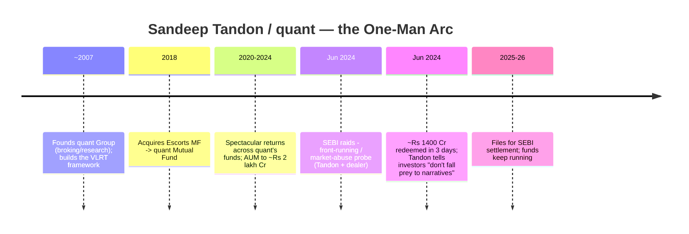
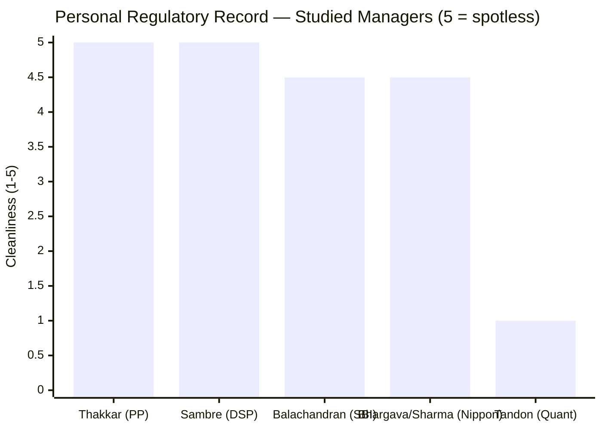
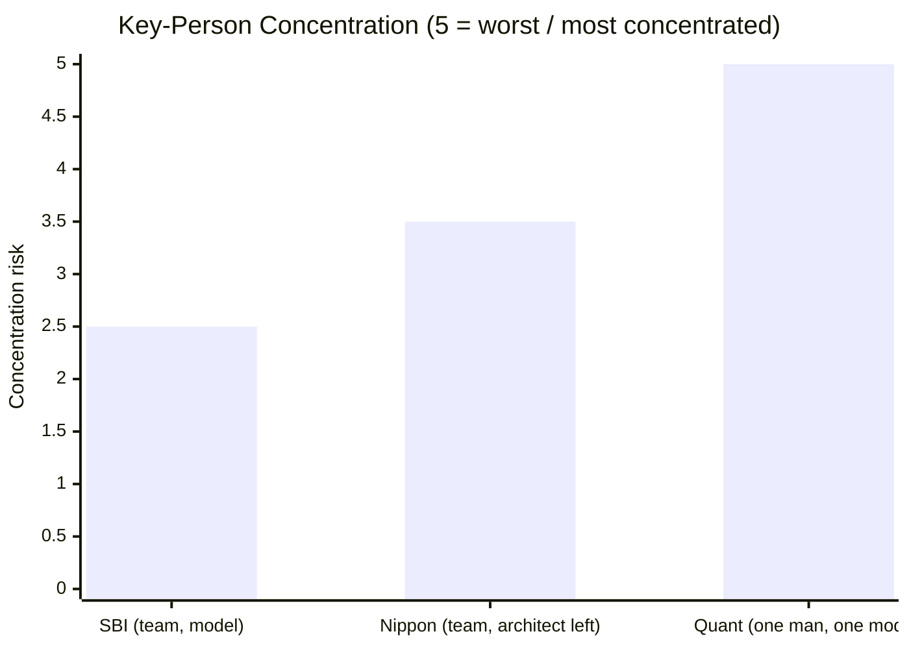
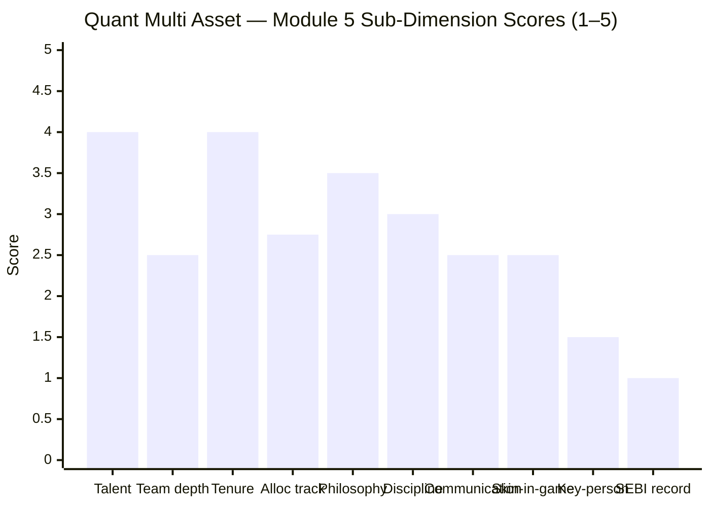

# Module 5: Fund Manager / Team Quality — Quant Multi Asset Allocation Fund

> **Provisional Module 5 score: ~2.4 / 5** (weight **10%**). **Scores are NOT comparable to the four equity categories.**

> **The one-line context:** Quant is the study's starkest manager paradox — **a genuine, singular investing talent (Sandeep Tandon) wrapped around the study's worst governance and key-person risk.** Tandon built ₹2 lakh crore and a distinctive, real framework (VLRT); every number in Modules 1–4 is his model's work. But that is precisely the problem: **the entire fund is one man's model — and that man is under an active SEBI front-running investigation** (raids June 2024; settlement filed). The "team" of seven executes his model, not independent judgment. So the fund carries the **highest key-person concentration and the worst personal regulatory record of any manager in the study**, in a single person.

---

## Fund Identity / Raw Data (web-researched — VR/Business Standard/BW, Jul 2026)

| Attribute | Detail | Source |
|-----------|--------|--------|
| **Lead / CIO / CEO / founder** | **Sandeep Tandon** — founder of quant Group; took over Escorts MF (2018) → quant MF | VR / BS |
| — role concentration | **CIO + CEO + founder + owner** — total control; the VLRT framework is his | industry |
| — on this fund since | ~2018 (quant era ~8y); 25+ years markets experience | VR |
| — investment philosophy | **VLRT** (Valuation-Liquidity-Risk appetite-Time) — proprietary momentum/behavioural quant model | quant |
| **Co-managers** | Ankit Pande, Sanjeev Sharma, Sameer Kate, Ayusha Kumbhat, Yug Tibrewal, Varun Pattani (6) | VR |
| — team character | Execute Tandon's VLRT model; **not independent decision-makers** | assessment |
| **⚠ SEBI action (personal)** | **Front-running / market-abuse / insider-trading probe** — raids 20 Jun 2024 (Mumbai + Hyderabad); ₹70–80 Cr alleged transactions; **Tandon + dealer filed for SETTLEMENT** (fine, no admission/denial) | Business Standard / BW |
| Post-probe impact | **~₹1,400 Cr ($168m) redeemed in 3 days** (Jun 2024) | Business Standard |
| Skin in the game | **Owns the AMC** (high alignment) — but the front-running allegation is the opposite of investor-alignment | industry |

---

## Cross-Source Verification

| Fact | Sources | Verdict |
|------|---------|---------|
| Tandon = founder/CIO/CEO; VLRT is his | VR, quant, BS | ✅ Confirmed — total control |
| SEBI front-running raids Jun 2024; ₹70–80 Cr | Business Standard, BW, StockGro | ✅ Confirmed — the defining event |
| Settlement filed (no admission/denial) | BW, ZeeBiz | ✅ Confirmed — resolving via consent, not adjudication |
| ~₹1,400 Cr redeemed in 3 days | Business Standard | ✅ Confirmed — real investor flight |

**Reliability: High.** The probe is extensively documented across mainstream financial press; it is the central, verified fact of this module.

---

## 1. Sandeep Tandon — the Singular Talent (and the Singular Risk)

Tandon is, on pure investing talent, one of the most distinctive managers in this study. The **VLRT framework is real, articulated, and demonstrably powerful** in the right regime (M1's quant-era 26% CAGR; the 2021 +57%). He built quant from a defunct Escorts shell to ₹2 lakh crore in ~6 years — a genuine achievement. **This is not a mediocre manager.** But everything that makes Quant Multi Asset attractive is *his* — and that concentration, combined with the probe, is the problem the rest of this module documents.

---

## 2. ⭐ The SEBI Front-Running Probe — the Defining Event

Every manager studied across all five categories had a **clean** personal regulatory record — until Tandon. In **June 2024, SEBI raided** quant's premises (Mumbai + Hyderabad) over alleged **front-running, market abuse, and insider trading** involving Tandon and a dealer, with alleged transactions of **₹70–80 crore**. Tandon subsequently **filed for settlement** (paying a fine, without admission or denial of guilt).

**What this is (and isn't):**
- **It is** a serious, formal market-abuse investigation into the fund's own CIO — the gravest personal-integrity flag in the study. Front-running (trading ahead of the fund's own large orders) directly harms the fund's investors.
- **It is not** (yet) a conviction or a ban; the settlement route means the matter is being **resolved via consent order**, and the funds continue to operate.
- **The connection to the strategy is not incidental:** the probe concerns front-running of quant's **large momentum orders** — i.e., the very high-turnover trading (M3/M4) that *is* the VLRT strategy. The governance risk and the investment approach are the same activity.

For a *manager* module, an active front-running probe into the singular decision-maker is close to a veto — it scores 1.0 on the personal-regulatory-record axis, and it colours everything else.

---

## 3. ⭐ Extreme Key-Person Risk — the Highest in the Study

Everything — the returns (M1), the equity-level risk (M2), the dynamic allocation engine (M3) — is **Sandeep Tandon's VLRT model.** The six co-managers execute it; they are not independent decision-makers with their own mandates. So:
- **If Tandon is banned, incapacitated, or leaves, the fund has no strategy** — there is no institutional process that survives him, unlike SBI (deep bench) or even Nippon (stable non-equity desks).
- **The probe makes this scenario materially more likely** than a normal key-person risk — a settlement could carry conditions, and reputation-driven redemptions (₹1,400 Cr in 3 days already) can force AUM-destroying outflows regardless of the outcome.

This is the **single most concentrated key-person risk in the entire studied universe** — and it sits on the person under investigation. It is the mirror image of a boutique's alignment strength (Tandon owns the firm) turned into its maximal fragility.

---

## 4. Team Depth — Illusory

Quant lists **seven managers** — on paper, the deepest team in the study. But depth requires *independent* decision-makers, and here they are **executors of one man's model.** There is no evidence of a second, independent allocation philosophy, a separate risk-management veto, or a succession-ready co-CIO. The seven names provide operational continuity (someone can place trades), not **judgment redundancy** (someone can run the fund differently if Tandon is gone). A large team around a single model is not team depth; it is a single point of failure with staff.

---

## 5. Allocation Track Record, Philosophy, Communication, Skin-in-Game

| Dimension | Assessment | Score input |
|-----------|------------|-------------|
| **Allocation-call track record** | Real, aggressive VLRT engine (M3) — but **mixed skill** (mistimed gold 2025; return-oriented, caused the −32.6% drawdown) | 2.75 |
| **Philosophy clarity** | VLRT is genuinely distinctive and documented — a real, articulated framework | 3.5 |
| **Sell/rebalance discipline** | Extreme turnover (M3/M4) — aggressive; the discipline is *there* but return-seeking, not risk-managed | 3.0 |
| **Investor communication** | High volume, but **defensive/dismissive during the probe** ("don't fall prey to narratives") — communication criticised for reassuring rather than informing | 2.5 |
| **Skin in the game** | **Owns the AMC** — maximal ownership alignment; **but** the front-running allegation is the antithesis of acting in investors' interest. Net: ambiguous-to-negative | 2.5 |
| **Key-person / succession** | **Extreme** — no succession; the fund is the model is the man (§3) | 1.5 |
| **SEBI record (personal)** | **Active front-running probe** — worst in the study (§2) | 1.0 |

---

## Comparison with Studied Fund Managers

| Fund | Lead | Talent | Key-person risk | Regulatory record | Module 5 |
|------|------|--------|-----------------|-------------------|----------|
| PP FlexiCap | Thakkar | High | Moderate | Spotless | 5.0 |
| DSP SmallCap | Sambre | High | Moderate | Clean | 3.9 |
| SBI Multi Asset | Balachandran + team | High (equity) | Low (team/institutional) | Clean | 3.2 |
| Nippon Multi Asset | V. Sharma + desks | Mixed (architect left) | Moderate | Clean | 3.0 |
| **Quant Multi Asset** | **Tandon (one man)** | **High (VLRT)** | **Extreme** | **Active front-running probe** | **~2.4** |

**Quant vs the field:** Tandon's *talent* rivals the best in the study — but Module 5 is not a talent contest; it is a *trust-and-durability* assessment. On that axis, Quant is last: the highest key-person concentration and the only manager under a market-abuse investigation. The very talent that generated the returns is inseparable from the governance risk that threatens them.

---

## Points For / Points Against — Manager / Team

### ✅ For
1. **Genuine, distinctive talent** — Tandon built ₹2L Cr and the real, articulated VLRT framework.
2. **Owner-operator alignment** — he owns the AMC; his wealth is tied to it.
3. **Documented, coherent philosophy** (VLRT) — not a vague process.
4. **Operational continuity** — a seven-person team keeps the machine running through the probe.
5. **The funds kept performing** post-probe (2024 +27.6%, 2025 +17.7%).

### ❌ Against
1. **Active SEBI front-running probe into the CIO** — the worst personal-integrity flag in the study; front-running directly harms fund investors.
2. **Extreme key-person risk** — the entire fund is one man's model; no succession, no independent judgment redundancy.
3. **The probe targets the strategy itself** — front-running of the large momentum orders that *are* VLRT.
4. **Team depth is illusory** — seven executors of one model, not independent decision-makers.
5. **Defensive, narrative-managing communication** during the crisis, criticised for reassuring over informing.
6. **Mixed allocation skill** (M3) — the model is return-oriented and mistimed gold in 2025.
7. **Reputation-driven redemption risk** — ₹1,400 Cr fled in 3 days on the news alone.

---

## Module 5 Scorecard

| Sub-dimension | Score | Reasoning |
|---------------|-------|-----------|
| Lead-manager talent | **4.0** | Genuine, distinctive; built ₹2L Cr + the real VLRT framework |
| Team depth & structure | **2.5** | Seven names, but all execute one man's model — illusory depth |
| Tenure on this fund | **4.0** | ~8y (quant era); founder |
| Allocation-call track record | **2.75** | Real engine, mixed skill; mistimed gold 2025 |
| Philosophy clarity | **3.5** | VLRT — distinctive, documented |
| Sell / rebalance discipline | **3.0** | Extreme, return-seeking, not risk-managed |
| Investor communication | **2.5** | High volume but defensive/dismissive during the probe |
| Skin in the game | **2.5** | Owns the AMC (+), but front-running allegation (−); net ambiguous |
| Key-person / succession | **1.5** | Extreme — the fund is the model is the man; no succession |
| SEBI record (personal) | **1.0** | Active front-running / market-abuse probe — worst in the study |
| **Module 5 Overall** | **~2.4 / 5** | The study's starkest paradox — genuine, singular talent inseparable from the worst governance and key-person risk in the studied universe. The talent keeps it off the floor; the front-running probe and total one-man concentration define it. **Lowest M5 in the study** |

---

## Comparative Module 5 Scores (studied funds)

| Fund | Module 5 | Manager verdict |
|------|----------|-----------------|
| PP FlexiCap | 5.0 | Gold standard |
| DSP SmallCap | 3.9 | Conviction, clean |
| SBI Multi Asset | 3.2 | Stable, institutional |
| Nippon Multi Asset | 3.0 | Architect left; team structure |
| **Quant Multi Asset** | **~2.4** | **Singular talent under a front-running probe; extreme key-person risk** |

> Module 5 is 10% — but for Quant it carries an outsized signal: the manager who generated the study-leading returns is under a market-abuse investigation and *is* the entire strategy. This module, together with M6, is where Quant's returns case meets its governance reckoning.

---

## SIP Implication

For a ₹15–20k/month SIP, Module 5 is the point at which Quant's dazzling returns must be weighed against a hard question: *do you want your monthly savings run entirely by one man's model, when that man is under an active SEBI front-running investigation and there is no plan B if he goes?* The talent is real — Tandon is a genuinely gifted, distinctive investor — but a SIP is a decade-long act of trust, and Quant asks you to place that trust in a single, investigated individual with no succession and a strategy whose defining activity (high-turnover momentum trading) is the subject of the probe. The ₹1,400 Cr that fled in three days shows how fast reputation risk becomes redemption risk, which becomes forced-selling risk for those who stay. An aggressive investor who consciously accepts concentrated, high-conviction, high-governance-risk exposure might still choose it; a SIP investor seeking a dependable multi-asset sleeve should treat Module 5 (with M6) as close to disqualifying.

## One-Line Verdict

**A genuinely singular investing talent (Sandeep Tandon, VLRT, ₹2L Cr built from nothing) inseparable from the study's worst governance and key-person risk — the entire fund is one man's model, that man is under an active SEBI front-running probe (settlement filed) targeting the very strategy, there is no succession, and reputation risk has already triggered ₹1,400 Cr of redemptions; the talent keeps this off the floor, but for a trust-based SIP it is close to disqualifying.**

---

*Module 5 complete. Provisional score 2.4/5. Method: web research (Business Standard, BW Businessworld, ValueResearch, StockGro) for the team, Tandon's profile, and the SEBI front-running probe; allocation-track context from M3. **Cross-module retrofit (Edelweiss discipline):** M5 sharpens the concentration finding — the returns (M1), the equity-level risk (M2), and the allocation engine (M3) are ALL Tandon's model, so the fund's entire quantitative profile hinges on one investigated individual. No M1–M4 scores change, but the forward-looking risk is now the starkest in the study. **The probe also drives M6 (AMC governance) — the two together are Quant's governance reckoning.** Next: M6.*

*Next: [Module 6 — AMC Trustworthiness](module6_amc.md)*
