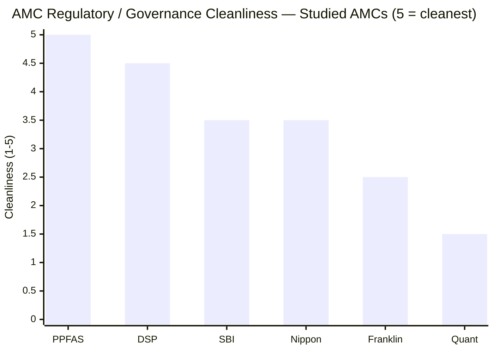
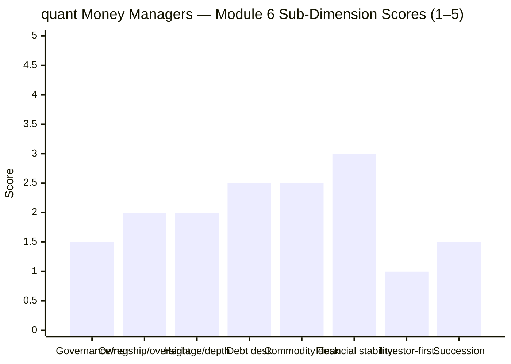

# Module 6: AMC Trustworthiness — Quant Multi Asset Allocation Fund

> **Provisional Module 6 score: ~1.8 / 5** (weight **5%**). **Scores are NOT comparable to the four equity categories.**

> **The one-line context:** the governance reckoning, and the lowest AMC score in the study. quant Money Managers is a **young, single-founder, owner-operated boutique whose founder-CIO just *settled* a SEBI front-running case** — the gravest investor-conduct failure of any AMC studied (front-running directly harms the fund's own unit-holders). The settlement's acceptance removes the *existential* tail risk (no ban, no shutdown, AUM has recovered), which lifts this off the absolute floor of the prior-study 1.25. But a settled market-abuse case by the person who *is* the entire strategy (M5), atop thin fixed-income and no proprietary commodity desks (weak for a multi-asset fund), makes this a **near-veto AMC** for a trust-based product.

---

## Fund Identity / Raw Data (web-researched, Jul 2026)

| Attribute | Detail | Source |
|-----------|--------|--------|
| AMC | **quant Money Managers Ltd (quant Mutual Fund)** | — |
| Founded / license | Founded by **Sandeep Tandon**; SEBI license **2017**; acquired **Escorts MF (2018)** | VR / BS |
| Ownership | **Single-founder, owner-operated** (Tandon) — boutique; no institutional/bank parent | industry |
| AUM | Grew ₹240 Cr (2019) → ~₹90,000 Cr–₹2 lakh Cr; **dipped on the Jun-2024 probe (−₹1,400 Cr in 3 days), since recovered** | BS / CBInsights |
| **⚠ SEBI action** | **Front-running / market-abuse case** (raids Jun 2024, ₹70–80 Cr) → **settlement filed and ACCEPTED by SEBI's High Powered Committee** (fine, no admission/denial; case closed) | BW Businessworld |
| Fixed-income desk | **Thin** — quant is an equity/momentum shop; debt minimal (~10%, though high-grade — M3) | assessment |
| Commodity desk | **None proprietary** — uses Nippon GOLDBEES/SILVERBEES ETFs | M3 |
| Prior-study AMC verdict | **1.25/5** (during the open probe — the lowest of any studied AMC) | prior studies |

---

## Cross-Source Verification

| Fact | Sources | Verdict |
|------|---------|---------|
| Front-running case, raids Jun 2024, ₹70–80 Cr | Business Standard, BW, StockGro | ✅ Confirmed |
| **Settlement accepted by SEBI committee** (case closed via consent) | BW Businessworld (2026) | ✅ Confirmed — the resolution that lifts the score off 1.25 |
| AUM dipped then recovered | Business Standard, CBInsights | ✅ Confirmed — operationally survived |
| Single-founder boutique, 2017/18 origin | VR, industry | ✅ Confirmed |

**Reliability: High.** The probe and its settlement are extensively documented; this is the most consequential, best-verified fact of the module.

---

## 1. ⭐ The Governance Record — a Settled Front-Running Case (the defining fact)

The June-2024 SEBI raids alleged **front-running and market abuse** by the AMC's founder-CIO and a dealer (₹70–80 Cr). By the study date, **SEBI's High Powered Advisory Committee has accepted a settlement** — the case is closed via consent order (a fine, no admission or denial of guilt, no further prosecution).

**Weighing it honestly, both ways:**
- **The mitigation:** a settlement removes the *existential* risk. Tandon is not banned; the AMC is not shut; the funds continue; AUM has recovered from the June-2024 outflows. The uncertainty of an open, indefinite probe is resolved. This is why the score rises from the prior-study **1.25** (open probe) to **~1.8**.
- **The permanent black mark:** front-running is the **antithesis of investor-first conduct** — it is *the AMC's own people allegedly trading ahead of the fund's orders, at the fund's investors' expense.* Franklin's 2020 scar (Module-6 comparisons) was a *liquidity failure*, not fraud; Quant's is an alleged *market-abuse* case grave enough that SEBI raided and pursued it to a monetary settlement. A settlement resolves the legal exposure; it does not restore the trust. For a category built on entrusting a decade of savings, this is close to disqualifying.

---

## 2. Ownership & Structure — Boutique Concentration, Pointed the Wrong Way

quant is a **single-founder, owner-operated boutique** — Tandon owns and runs it. In the abstract, founder-ownership can be a governance *strength* (PPFAS is the study's example: aligned, boutique, spotless). **Here it is the opposite:**
- The founder-owner is the person who settled the front-running case — so the ownership *concentrates* the governance risk rather than diffusing it.
- There is **no institutional parent** to impose independent oversight (unlike SBI-Amundi or Nippon Life), and **no board-level check** visible on the CIO who is also the CEO and owner.
- The boutique's *entire* proposition — investment edge, AUM, brand — rests on one investigated individual (M5). Boutique concentration is a virtue only when the operator is trustworthy; here the trust is exactly what is impaired.

---

## 3. ⭐ Multi-Asset Desk Credibility — Weak on Both Non-Equity Legs (NEW)

A multi-asset fund imports its AMC's fixed-income and commodity capabilities. quant is an **equity/momentum house** — both non-equity desks are thin:

| Desk | Assessment | Relevance |
|------|------------|-----------|
| **Fixed income** | **Thin franchise** — quant runs minimal debt (~10%, M3); no depth or heritage as a bond house. *Credit quality of what it holds is good* (govt/AAA gilts + CDs), but the **desk is not a serious fixed-income operation** | ⚠ weak for a multi-asset fund |
| **Commodities** | **No proprietary desk** — buys **Nippon's** GOLDBEES/SILVERBEES ETFs. Fine as execution (low-cost), but quant brings **no in-house commodity capability** (contrast SBI/Nippon, whose gold desks are genuine strengths) | ⚠ outsourced |

So even setting aside the probe, quant is structurally **the weakest-equipped AMC in the study to run a multi-asset fund** — it is an equity-momentum specialist renting the other two asset classes. Its edge (M1 returns) is all on the equity/momentum side; the "multi-asset" desks are minimal.

---

## 4. Financial Stability, Launch-Timing, Communication, Succession

| Dimension | Assessment |
|-----------|------------|
| **Financial stability** | Survived the probe; AUM recovered from the June-2024 outflows. **But** boutique + reputation-driven redemption risk (₹1,400 Cr in 3 days demonstrated the fragility) = higher instability than the large AMCs |
| **Launch-timing** | Quant Multi Asset is a recategorised Escorts fund — **not** a 2023-tax-wave launch; no launch-gaming. A neutral-positive |
| **Investor communication** | **Defensive/dismissive during the probe** ("don't fall prey to narratives", M5) — reassuring over informing; a governance-communication weakness |
| **Succession / continuity** | **None** — the AMC is the founder; no succession plan, no independent CIO. The M5 key-person risk *is* an AMC-continuity risk |
| **Skin-in-game** | Founder-owned (alignment) — undercut by the conduct case |

---

## Comparison with Studied AMCs

| AMC | Module 6 | Character |
|-----|----------|-----------|
| PPFAS | 4.5 | Boutique, aligned, spotless |
| DSP | 4.3 | Heritage, all-employee skin-in-game |
| SBI Funds Mgmt | 3.9 | #1 AMC; clean, deep debt+commodity desks |
| HDFC AMC | ~3.8 | Large, listed |
| Nippon India (NAM) | ~3.7 | #4; best gold-ETF desk; Reliance-era debt scar |
| Franklin India | ~2.8 | Global parent; 2020 debt-freeze scar |
| BOI | 3.3 | Small PSU |
| **Quant** | **~1.8** | **Boutique; founder-CIO settled a front-running case; thin non-equity desks** |

**Quant is the lowest-scoring AMC in the study by a wide margin.** It is the *inverse* of PPFAS — both are aligned founder-boutiques, but PPFAS's founder is the study's governance gold standard, while Quant's founder settled a market-abuse case. Same structure, opposite trust.

> **⚠ Minor retrofit note to Nippon's M6:** the same source that confirmed Quant's settlement also reports that **Nippon India MF's CEO (Sundeep Sikka) settled a *separate* SEBI market-violation matter.** This is a data point I did not have when scoring Nippon's M6 (3.7); it is a *different, apparently lesser* case (not front-running of the fund's orders), and Nippon's core M6 story (the positive 2019 Reliance→Nippon-Life governance upgrade + best-in-study gold desk) stands. I am **flagging it for follow-up** rather than re-scoring — but it mildly tempers Nippon's regulatory line and should be verified in the decision tree. It does **not** approach the severity of Quant's founder-CIO front-running case.

---

## Points For / Points Against — AMC

### ✅ For
1. **The front-running case is *settled*** — existential risk (ban/shutdown) removed; funds continue; AUM recovered.
2. **Founder-owner alignment** — Tandon's wealth is in the firm (in the abstract, a plus).
3. **No 2023 tax-wave launch-gaming** — the fund is a recategorised existing scheme.
4. **Operational resilience** — survived a ₹1,400-Cr-in-3-days outflow shock.
5. **Genuine (equity) investment edge** at the house level (M1).

### ❌ Against
1. **Founder-CIO settled a SEBI front-running case** — the gravest investor-conduct failure in the study; the AMC's people allegedly traded against the fund's own investors.
2. **Single-founder boutique with no institutional oversight** — concentration pointed the wrong way; no board check on the owner-CEO-CIO.
3. **Thin fixed-income and no proprietary commodity desk** — structurally the weakest-equipped AMC to run a *multi-asset* fund.
4. **No succession** — the AMC is the founder (M5).
5. **Reputation-driven instability** — redemption fragility demonstrated.
6. **Defensive crisis communication.**

---

## Module 6 Scorecard

| Sub-dimension | Score | Reasoning |
|---------------|-------|-----------|
| Regulatory / governance | **1.5** | Settled front-running case by the founder-CIO — worst in study; settlement lifts it off 1.25 |
| Ownership independence & oversight | **2.0** | Single-founder boutique, no institutional check; concentration pointed the wrong way |
| Heritage & institutional depth | **2.0** | Young (2017/18), shallow; built on Tandon's momentum returns |
| Fixed-income desk | **2.5** | Thin franchise; credit quality OK but not a serious bond house |
| Commodity desk | **2.5** | No proprietary desk; rents Nippon's ETFs |
| Financial stability | **3.0** | Survived the probe; AUM recovered — but boutique/redemption-fragile |
| **Investor-first conduct** | **1.0** | A settled front-running case is the antithesis of investor-first |
| Succession / continuity | **1.5** | None — the AMC is the founder |
| **Module 6 Overall** | **~1.8 / 5** | The lowest AMC score in the study — a young, founder-concentrated boutique whose CIO settled a front-running case, with thin non-equity desks ill-suited to a multi-asset fund. The settlement's resolution and operational survival are the only things lifting it above the prior-study 1.25 |

---

## Comparative Module 6 Scores (studied funds)

| AMC | Module 6 |
|-----|----------|
| PPFAS | 4.5 |
| DSP | 4.3 |
| SBI | 3.9 |
| HDFC | ~3.8 |
| Nippon | ~3.7 |
| Franklin | ~2.8 |
| **Quant** | **~1.8** |

---

## ⭐ The Complete Six-Module Picture — M6 as the Closer

| Module | Topic | Weight | Quant | Weighted | (SBI / Nippon) |
|--------|-------|--------|-------|----------|----------------|
| M1 | Returns & Allocation Alpha | 20% | 4.3 | 0.86 | (3.6 / 4.1) |
| M2 | Risk Profile | 25% | 2.6 | 0.65 | (4.5 / 3.6) |
| M3 | Allocation Engine & DNA | 20% | 3.3 | 0.66 | (3.0 / 3.4) |
| M4 | Cost & Tax | 20% | 3.5 | 0.70 | (3.5 / 4.1) |
| M5 | Manager / Team | 10% | 2.4 | 0.24 | (3.2 / 3.0) |
| **M6** | **AMC** | **5%** | **1.8** | **0.09** | (3.9 / 3.7) |
| **TOTAL** | | **100%** | | **≈ 3.20** | **(3.66 / 3.71)** |

**Quant finishes ≈ 3.20/5 — last of the three cycle-tested funds, despite winning Module 1 outright.** This is the study's central lesson in a single fund: **the highest returns in the category do not survive a framework where risk (25%) and governance carry real weight.** Quant leads on returns (M1) and is competitive on cost (M4), but it *fails* the risk test (M2, equity-level drawdowns), the allocation engine is return-oriented not risk-managed (M3), and it carries the worst manager (M5) and AMC (M6) governance in the study — a founder-CIO who settled a front-running case, with the entire strategy resting on him. **The returns are real; the risk, concentration, and governance make them un-ownable for a trust-based multi-asset sleeve.**

---

## SIP Implication

For a ₹15–20k/month SIP, Module 6 completes the case *against* Quant as a core multi-asset holding — not because the returns aren't real, but because a decade-long SIP is a decade-long act of institutional trust, and quant is the study's weakest institution on exactly that axis. You would be entrusting your monthly savings to a single-founder boutique whose owner-CIO settled a front-running case, with no institutional oversight, no succession, and non-equity desks it largely rents. The settlement removes the worst tail risk (the fund won't be shut tomorrow), and an aggressive investor consciously chasing quant's momentum edge with money they can afford to lose might still choose it. But as the *diversifying, risk-reducing, dependable* sleeve this category is meant to provide, Quant is disqualified by the accumulated weight of Modules 2, 5, and 6.

## One-Line Verdict

**The lowest AMC score in the study — a young, single-founder boutique whose owner-CIO settled a SEBI front-running case (the gravest investor-conduct failure studied), with no institutional oversight, no succession, and thin non-equity desks it rents from rivals; the settlement's resolution is the only thing lifting it off the floor, and it caps a fund whose study-leading returns cannot survive the category's risk-and-governance framework (final ≈3.20/5, last of the cycle-tested funds).**

---

*Module 6 complete. Provisional score 1.8/5. Method: web research (Business Standard, BW Businessworld, ValueResearch, CBInsights). Carry-forward from prior studies (Quant AMC 1.25 during the open probe), updated for the **accepted settlement** (→ ~1.8). **Cross-module retrofit (Edelweiss discipline):** M6 confirms and completes the M5 governance finding — the front-running case is both a personal-manager and an AMC-institution failure, and quant is additionally the weakest-equipped house to run a multi-asset fund (thin debt, rented commodities). A **minor retrofit flag was raised on Nippon's M6** (CEO Sikka's separate SEBI settlement — noted for follow-up, not re-scored). **Final six-module weighted score ≈ 3.20/5 — Quant is last of the three cycle-tested funds, the study's cautionary case: the returns leader that the risk-and-governance framework disqualifies.** All Quant modules complete → next: the Quant fund README.*

---

# ⚠ ADDENDUM (Aug 2026) — the Front-Running Settlement Independently Verified, plus the AMC's Undisclosed Provenance

> **Why this addendum exists.** The MidCap study discovered that a claimed *"2022 front-running case"* against ICICI Prudential **did not exist** — no SEBI order — and had to be retracted. That precedent required this module's central fact, on which its **1.8 score and near-veto verdict rest**, to be re-verified against independent sources. **It has been, and it holds.**

## A1. ✅ The settlement — verified, and now dated and quantified

| Claim in this module | Verification status |
|---|---|
| SEBI raids, June 2024, Mumbai & Hyderabad | ✅ **Confirmed** — 20 June 2024, front-running / market abuse / insider trading, involving founder-CIO **Sandeep Tandon** and HNI investor **Sumana Paruchuri** |
| Transactions of ₹70–80 Cr | ✅ **Confirmed** across multiple independent outlets |
| Settlement **filed** | ✅ **Confirmed** (BW Businessworld) |
| ⚠ Settlement **accepted / case closed** — *the claim that lifted the score off the prior study's 1.25* | ✅ **VERIFIED by a second, independent report** — *"SEBI Committee Accepts Settlements from Nippon and Quant Mutual Fund Executives in Separate Cases"* (BW Businessworld). SEBI's High Powered Advisory Committee accepted; the case closes without further prosecution, on payment of a fine and without admission or denial of guilt |
| **NEW — settlement quantum** | **₹1–2 crore per individual**, reported **August 2025** |

**The module's central fact stands.** Unlike the ICICI claim, this one is real, independently corroborated, and now dated (Aug-2025) and quantified (₹1–2 Cr each).

**The verification cuts both ways, and both belong in the record.** A closed case removes existential tail risk — no ban, no shutdown, no ongoing prosecution — which is what justified lifting the score above the prior study's 1.25. **But ₹1–2 crore is a very small penalty relative to ₹70–80 crore of alleged transactions**, and a consent settlement means **no findings of fact were ever established.** An investor gets closure, not exoneration.

## A2. ⚠ NEW — the AMC's provenance is not disclosed in this module

**quant Mutual Fund is the former Escorts Mutual Fund**, acquired by quant Money Managers in **2018**. This module describes the AMC as *"young"* but never states that it **bought an existing licence rather than building one**, or that its fund track records pre-date its own control.

**M1's addendum quantifies why this matters:** the Multi Asset scheme's NAV series begins Jan-2013, but **37% of it belongs to Escorts** — and that segment is unusable (volatility 38.13%, a single day of −44.80% and another of +81.23%, lag-1 autocorrelation −0.42). **The AMC's genuine operating history is ~8.6 years, not 13.6.**

This is a **governance-relevant disclosure gap**, not merely a data one: an AMC that acquired its licence in 2018, grew from roughly ₹100 Cr to over ₹1 lakh crore by 2024, and was raided by SEBI in June 2024 has a **six-year operating record**, and the scheme track records that attracted those flows were substantially not its own.

## A3. ⚠ A finding for another fund in this study

The same BW Businessworld report is headlined *"SEBI Committee Accepts Settlements from **Nippon** and Quant Mutual Fund Executives in Separate Cases."* **Nippon's Module 6 scored 3.7 and records only a *"genuine (if remediated) fixed-income blemish"* — it does not mention any SEBI settlement by a Nippon executive.** This module cannot establish the Nippon matter's nature or severity from a headline, and does **not** assert one. **It is flagged as a verification item for Nippon's Module 6**, since an unrecorded executive-level SEBI settlement would be material to a 3.7 governance score.

## A4. Score

| Sub-dimension | Was | **Now** | Reason |
|---|---|---|---|
| Regulatory record | — | **unchanged** | ✅ **The settlement is verified, dated (Aug-2025) and quantified (₹1–2 Cr each).** The ₹1–2 Cr quantum against ₹70–80 Cr of alleged transactions, and the absence of any established findings of fact, are noted — they justify the existing severity rather than reducing it |
| Heritage / institutional longevity | — | **unchanged** | The **Escorts provenance** reinforces the module's existing "young boutique" characterisation with a specific, previously-missing fact |
| **Module 6 Overall** | **~1.8** | **~1.8 / 5 (unchanged)** | **The audit was warranted and the verdict survives it.** The defining fact is real, unlike the ICICI claim that prompted the check — and the newly-surfaced Escorts provenance supports rather than softens the assessment |

---

*Addendum complete. **Method:** settlement acceptance verified against a second independent report (BW Businessworld, *"SEBI Committee Accepts Settlements from Nippon and Quant Mutual Fund Executives in Separate Cases"*), cross-checked against the original filing report and contemporaneous coverage (Business Standard, Moneylife, StockGro). AMC provenance (Escorts Mutual Fund → quant Money Managers, 2018) cross-referenced to the NAV-series era split in M1's addendum. **Handoff:** the possible Nippon executive settlement → **Nippon Module 6, unverified, flagged for checking.***
