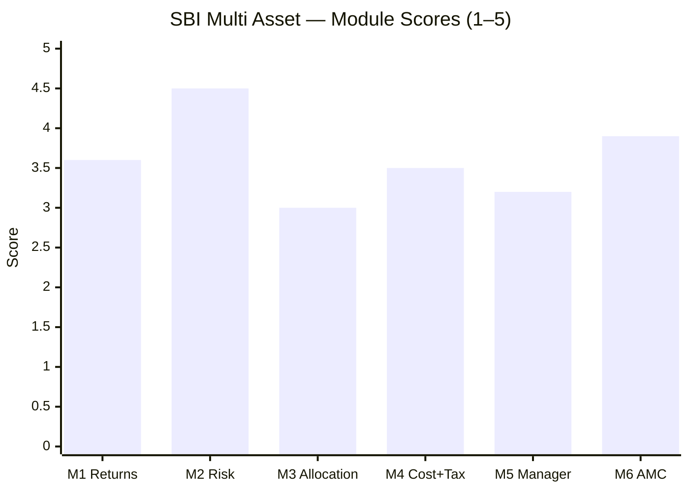

# SBI Multi Asset Allocation Fund — Fund Summary & Verdict

**Direct Plan – Growth · MFAPI 119843 · AUM ₹19,354 Cr · ER ~0.51–0.68% · studied Jul 2026**

> **Final weighted score: ≈ 3.66 / 5.** A genuinely low-risk, well-run, cheaply-priced, institution-backed **static** balanced fund — elite on the risk axis, with the study's best AMC-desk-fit — but with **no active allocation skill**, a record that predates its team, a tax status that is *not* the category's structural trump card, and **~0.75 correlation to the equity you already own**. A strong house safely delivering an unremarkable strategy.
>
> **⚠ Scores are NOT comparable to the four equity categories** — this fund is measured on a multi-asset re-weight (Risk 25 / Returns 20 / Allocation 20 / Cost+Tax 20 / Manager 10 / AMC 5), against a blended benchmark and a DIY basket, not against a single equity index. **Not investment advice.**

---

## The Six-Module Scorecard

| Module | Topic | Weight | Score | Weighted | One-line |
|--------|-------|--------|-------|----------|----------|
| [M1](module1_returns.md) | Returns & Allocation Alpha | 20% | 3.6 | 0.72 | Reliable compounder; thin, lumpy, non-skill alpha |
| [M2](module2_risk.md) | **Risk Profile** | **25%** | **4.5** | **1.125** | Elite — 8% downside capture, but ~0.75 corr to your equity |
| [M3](module3_allocation.md) | Allocation Engine & DNA | 20% | 3.0 | 0.60 | Static drift, no engine; genuine 5-class book |
| [M4](module4_cost_tax.md) | Cost & Tax | 20% | 3.5 | 0.70 | Cost-competitive; but NOT equity-taxed; tax triad misfires |
| [M5](module5_manager.md) | Manager / Team | 10% | 3.2 | 0.32 | Strong equity lead + ideal team; no allocation skill; recent |
| [M6](module6_amc.md) | AMC | 5% | 3.9 | 0.195 | India's #1 AMC; best debt+commodity desks for multi-asset |
| **TOTAL** | | **100%** | | **≈ 3.66** | |

---

## What SBI Multi Asset Actually Is

The single most important finding of the study is that **the labels mislead**. Three reframings, each from the data:

1. **It is a *static* balanced fund, not an actively-allocated one.** Return-based style analysis (M3) shows the effective equity weight drifting *monotonically* from ~8% (2016) to ~50% (2026) — a slow glide-path, never a tactical allocation. It never de-risked before a crash (equity rose *into* 2022 and 2024). Triangulated across M1 (equity-style alpha), M3 (static drift), and M5 (no manager timing): **there is no allocation engine.**

2. **Its flattering long record is two different funds.** It was **"SBI Magnum Monthly Income Plan – Floater"** — a *debt MIP* — before ~2019 (M3). The era split: debt era (2013–19) CAGR 10.5% / vol **3.6%** / max DD −3.1%; balanced era (2020–26) CAGR 14.5% / vol **8.6%** / max DD −17.6%. The "13.4-year, never-negative, 6.6%-vol" headline is *era-blended*; the fund you buy today is the ~6-year-old balanced fund, run by a team assembled 2021–2024.

3. **It is a *partial* diversifier, not a pure one.** ~0.75 correlated to the equity sleeves you already own (M2); the genuine decorrelation is only the gold+silver+debt half.

---

## The Genuine Strengths

- **Elite, cycle-proven downside protection (M2 4.5).** 8% downside capture, beta 0.32, 6.6% vol, −17.6% worst-ever drawdown vs Nifty's −38% — and cushioning that *worked* in all three stress regimes, including 2022 (when only gold could save the structure). Zero negative 3Y/5Y windows in 13.4 years.
- **Cost-competitive (M4).** ~0.51–0.68% Direct ER (2nd–3rd cheapest in the shortlist), no capacity constraint, beats a DIY static basket by ~+₹0.6–1.3L over 10Y (₹10k SIP) — thinly, and on its book, not tax.
- **Best AMC-desk-fit in the study (M6 3.9).** India's #1 AMC with the deepest fixed-income and gold/commodity desks — exactly what a multi-asset fund imports — and no 2023 tax-wave launch-gaming.
- **Genuine 5-asset-class book** (equity/debt/gold/silver/REIT) run by a capable *equity* manager (Balachandran of SBI Contra).

## The Honest Weaknesses

- **No active allocation skill** — the very thing the category's fee is meant to buy (M1/M3/M5).
- **NOT equity-taxed** — sits in the middle tier (12.5% LTCG after 24m, STCG slab); the structural tax trump card is absent (M4).
- **~0.75 correlation to your existing equity** — half of it duplicates what you own (M2).
- **The record isn't the team's**, and multi-asset is a secondary mandate for the lead (M5).
- **The alpha is thin and lumpy** — essentially 2015 + 2023, and likely equity-*style*, not skill (M1).

---

## The Verdict That Matters: Fund vs DIY

The study's central test (framing fact #2) — should you pay SBI, or assemble the pieces yourself?

| | SBI Multi Asset | DIY (index fund + debt fund + gold/silver ETF, rebalanced annually) |
|---|---|---|
| 10Y SIP corpus (₹10k/mo) | ~₹24.6L | ~₹23.3L (pre-rebalancing-tax) |
| All-in edge to SBI | **~+₹0.6–1.3L over 10Y** | — |
| Source of the edge | Its book's gross return + a small (~0.10–0.15%/yr) rebalancing tax shield | — |
| **NOT** the source | Tax status (middle-tier, same as DIY) or allocation skill (none) | — |

**SBI wins — but thinly, and for the wrong-sounding reasons.** The edge is convenience + scalability + a competent equity book + a small rebalancing shield, **not** a structural tax advantage or allocation alpha. For an investor who will *not* rebalance a DIY basket with discipline, that thin edge plus one-fund simplicity is a fair deal. For one who will, the honest math says DIY captures almost the same outcome for less.

---

## Where SBI Sits in the Shortlist (provisional — peers not yet studied)

SBI is the **first of six** funds studied. Its ≈3.66 is a solid-but-unspectacular baseline. The open questions the remaining funds must answer:
- **Nippon** (0.43% ER, Sharpe 0.88) — is it the same low-risk profile *cheaper*, and does it show any allocation skill SBI lacks?
- **Quant** (Sharpe 1.52) — does it have the allocation alpha SBI doesn't — and does the AMC front-running probe veto it?
- **WOC** (conservative, 26% eq) — a genuinely different, more-diversifying risk posture.

SBI's specific pitch — *lowest-equity, most debt+gold of the cycle-tested funds* — makes it the shortlist's closest thing to a **true diversifier**, which is exactly why its ~0.75 equity correlation (still substantial) is the number the decision tree will weigh.

---

## Monitoring / Review Triggers (if held)

1. **Allocation-model drift toward closet-equity** — the effective equity weight has risen to ~50%; if it pushes toward ≥65%, the fund quietly becomes an equity fund (changing both its risk role *and* its tax tier). Watch the trailing factsheets.
2. **Tax-status change** — if gross equity crosses 65% (equity taxation) or the debt sleeve pushes it toward specified-fund treatment, the post-tax math shifts. Re-check at each budget and on allocation drift.
3. **Debt-book credit deterioration** — the book reaches into corporate credit (e.g. Adani Power); watch for any downgrade/default in the debt holdings.
4. **Manager exit** — lower risk than a boutique (institutional bench), but Balachandran leaving would remove the capable equity hand; the debt/commodity managers are already recent.
5. **Correlation creep** — if the equity weight rises, the ~0.75 correlation to your other sleeves rises too, eroding the diversification rationale.
6. **Fee/flow** — post-IPO profit pressure on the AMC; watch that the ~0.51–0.68% ER doesn't drift up.

---

## One-Line Verdict

**A rock-solid, cheaply-priced, elite-downside-protection static balanced fund from India's best-equipped multi-asset AMC — that beats DIY only thinly and on its book, has no allocation skill, isn't equity-taxed, and is ~0.75 correlated to the equity you already own: a safe, unremarkable ≈3.66/5 whose slot in the portfolio hinges on the decision-tree's DIY-vs-fund and diversification math.**

---

*Fund README complete. All six modules + README done (Jul 30 2026). Final weighted score ≈ 3.66/5. Method: MFAPI self-computation (scheme 119843) + return-based style analysis + factsheet/web backfill (ValueResearch, Groww, Dezerv, IPO RHP). First of six shortlist funds; feeds the decision tree (sleeve question, fund-vs-DIY, sub-type choice). Next fund: Nippon India Multi Asset.*
