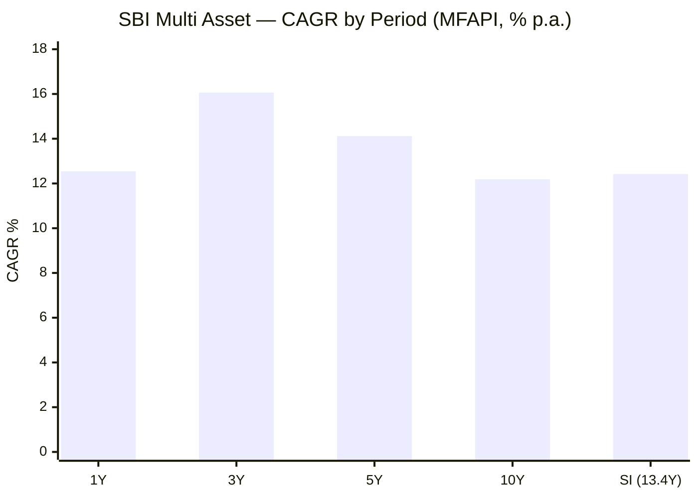
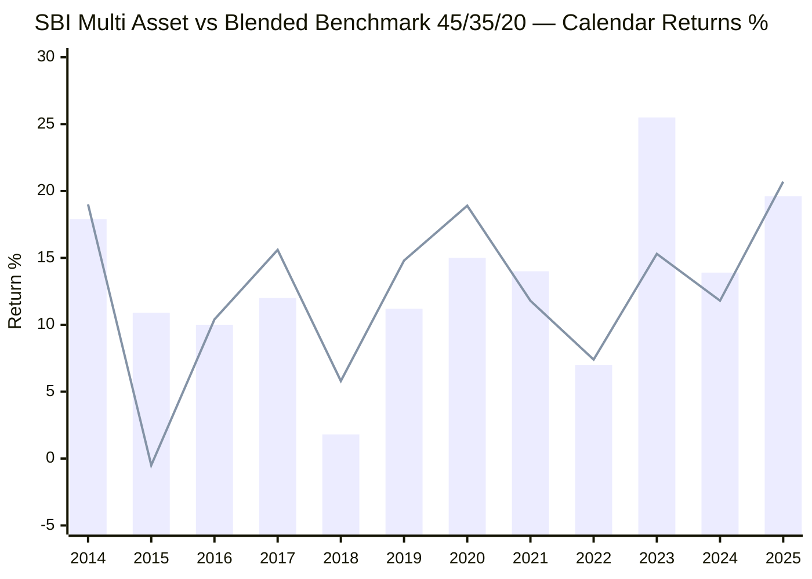
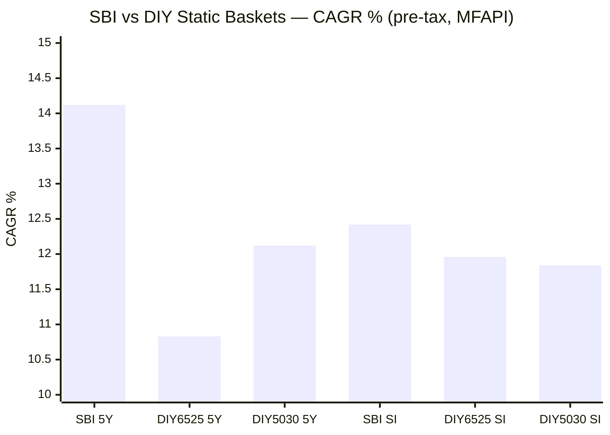
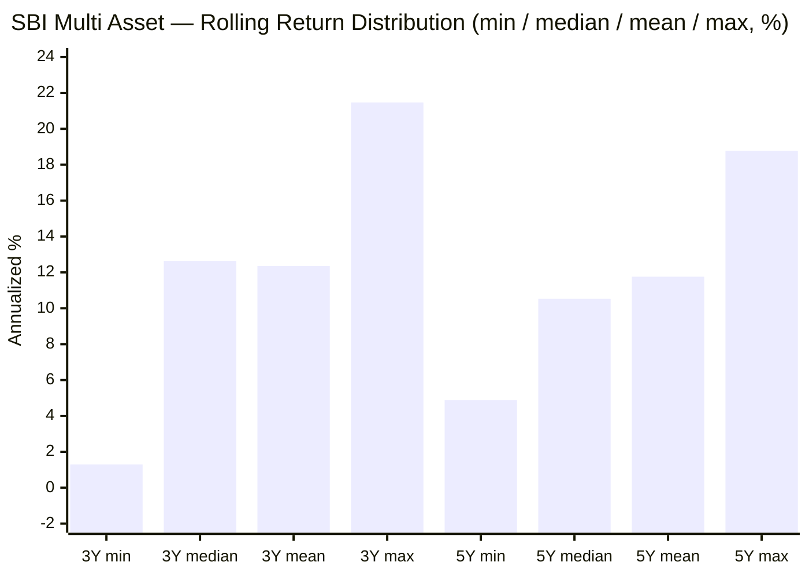
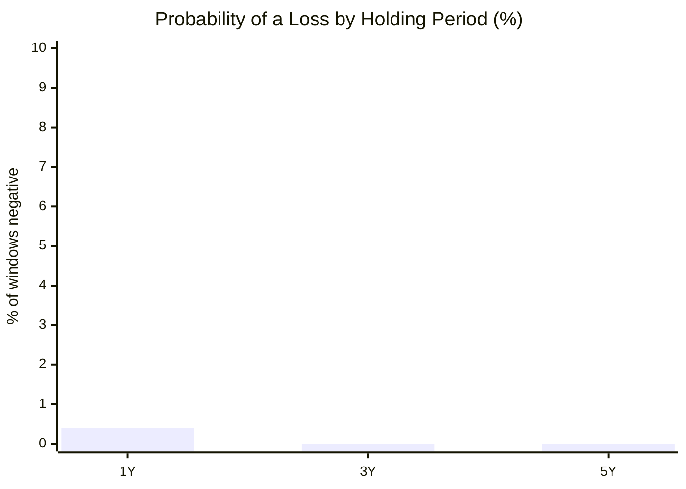
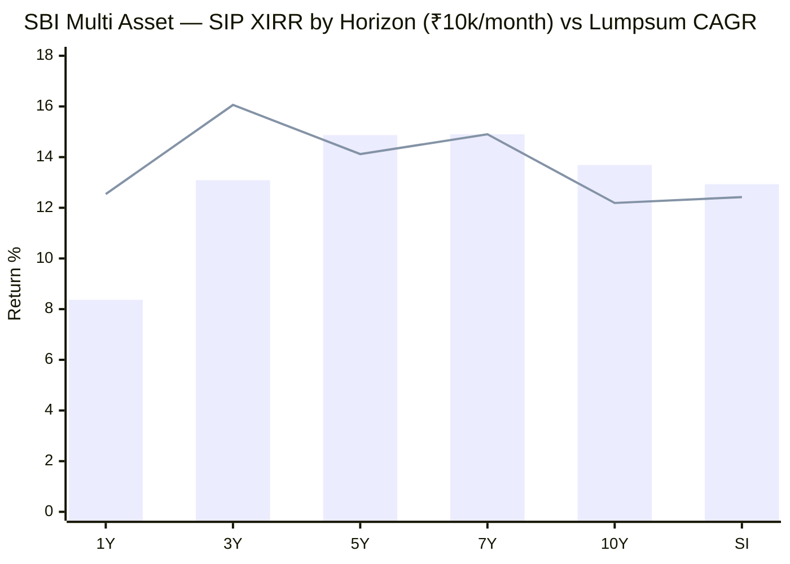
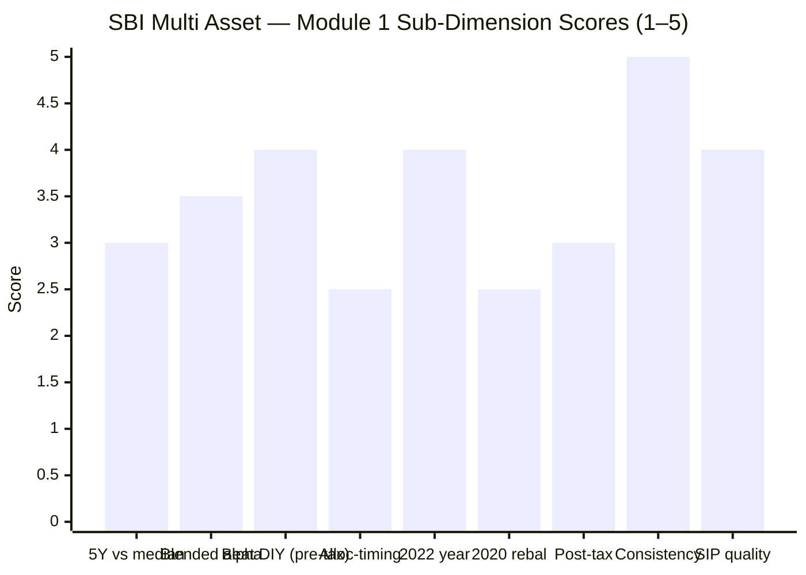

# Module 1: Returns & Allocation Alpha — SBI Multi Asset Allocation Fund

> **Provisional Module 1 score: ~3.6 / 5** (weight 20% in the multi-asset re-weight). **Scores in this study are NOT directly comparable to the four equity categories** — the module measures a risk-reduction product against a blended benchmark and a DIY basket, not a single equity index against peers.

> **The one-line context:** a genuinely all-weather book — 13.4 years, **zero negative 3Y or 5Y windows**, 6.6% volatility, a −17.6% worst-ever drawdown — that compounds at a modest **12.4% since inception**. It clears the DIY basket, but its measured "alpha" is thin and lumpy (two years carry it), and the returns job here is to be *reliable*, not high.

---

## Fund Identity

| Attribute | Detail | Source |
|-----------|--------|--------|
| Full name | SBI Multi Asset Allocation Fund — Direct Plan — Growth | AMFI / MFAPI |
| AMC | SBI Funds Management Ltd | — |
| MFAPI scheme code | **119843** | api.mfapi.in/mf/119843 |
| Direct-plan NAV history | **19 Mar 2013 → 28 Jul 2026 (13.36y, 3,232 NAVs)** | MFAPI computed |
| Regular-plan lineage | Older than the Direct plan (pre-2013); category label predates the 2018 SEBI "Multi Asset Allocation" definition — confirmed in M5 | to confirm (factsheet) |
| Stated benchmark | A **custom composite** (equity + debt + gold legs). Tickertape lists "BSE 500 TRI" — a simplification (see benchmark critique §4) | Tickertape / SID |
| Net equity (screening) | 46.8% · Debt 32.8% · Gold+cash+arb ~20.4% | Tickertape API, Jul 2026 |
| Taxation status | **Pivotal open question** — needs ≥65% *gross* equity (via arbitrage top-up) for equity taxation; net equity is only 46.8%. Resolved in **M4** | SID (deferred) |
| AUM / ER | ₹19,354 Cr / 0.74% (Direct) | Tickertape, Jul 2026 |
| Manager(s) | **Team: Dinesh Balachandran (equity, since Oct 2021) · Mansi Sajeja (debt, Dec 2023) · Vandna Soni (Jan 2024) · Pradeep Kesavan (Dec 2023)** — full assessment → M5 | VR/Groww (backfill) |
| **Former name** | **SBI Magnum Monthly Income Plan – Floater** (a debt MIP) — confirms the M3 mandate transition | Groww/VR (backfill) |
| Study flag | Cycle-tested (161mo) — **has full 2022 data** (no `no-2022-data` flag) | — |

> **⭐ FACTSHEET BACKFILL (Jul 30 2026) — manager attribution:** the 13.4-year record is **not the current team's.** Lead manager Balachandran arrived **Oct 2021** (so he owns the 2022/2023/2024–25 stress record but not the pre-2021 book), and the debt/commodity managers only joined **Dec 2023 / Jan 2024.** Combined with the M3 mandate transition (the fund was a debt MIP pre-2019), *the flattering long-horizon numbers below belong to a different fund run by different people* — read the SI/10Y figures as historical context, not this team's achievement. No score change (the balanced-era numbers Balachandran does own are solid), but the caveat is material.

> **Strategic asset allocation** (the stated SAA) and **net-vs-gross equity** are factsheet/SID items scored in **M3**. Module 1 uses the *observed* ~45/35/20 (equity/debt/gold) mix to construct the blended benchmark, and tests robustness against alternative weights.

---

## Raw Data (MFAPI-computed + Tickertape screening, as of 28-Jul-2026)

| Metric | Value | Source |
|--------|-------|--------|
| CAGR 1Y | **12.54%** | MFAPI computed |
| CAGR 3Y | **16.06%** | MFAPI computed |
| CAGR 5Y | **14.12%** | MFAPI computed |
| CAGR 10Y | **12.19%** | MFAPI computed |
| CAGR since inception (13.4Y) | **12.42%** | MFAPI computed |
| 3M / 6M absolute | +0.79% / −0.30% | MFAPI computed |
| Annualized volatility (daily, SI) | **6.59%** | MFAPI computed |
| Max drawdown (SI) | **−17.59%** (COVID) | MFAPI computed |
| Rolling 3Y: mean / median / min | 12.36% / 12.64% / **+1.30%** | MFAPI (2,501 windows) |
| Rolling 5Y: mean / median / min | 11.76% / 10.53% / **+4.89%** | MFAPI (2,014 windows) |
| Prob. of loss 1Y / 3Y / 5Y | **0.4% / 0.0% / 0.0%** | MFAPI |
| 10Y SIP XIRR (₹10k/mo) | **13.69%** (₹12.0L → ₹24.48L) | MFAPI, Newton-Raphson |
| Blended-benchmark alpha (SI, vs 45/35/20) | **+0.72%/yr** | MFAPI computed |
| Screening: 5Y / 3Y / Sharpe / stdDev | 14.2% / 16.2% / 0.93 / 9.0% | Tickertape, Jul 2026 |

---

## Cross-Source Verification

| Metric | MFAPI computed | Tickertape | Verdict |
|--------|----------------|-----------|---------|
| 5Y CAGR | 14.12% | 14.2% | ✅ Confirmed (±0.1) |
| 3Y CAGR | 16.06% | 16.2% | ✅ Confirmed |
| 1Y CAGR | 12.54% | 12.3% | ✅ Confirmed |
| Volatility | 6.59% (daily, SI) | 9.0% (3–5Y stdDev) | ⚠️ Tickertape higher — its window is the more-volatile recent 3–5Y and samples at lower frequency; both agree the fund is **structurally low-vol** (~half an equity fund's ~15–16%) |
| Sharpe | not recomputed here (M2) | 0.93 | Carried to M2 |
| **Alpha (Tickertape)** | — | — | **Ignored — meaningless here.** Tickertape computes alpha vs a single equity index (BSE 500 TRI); for a 47%-equity fund that is not a real benchmark. The blended benchmark below replaces it |

**Data reliability: High.** 3,232 NAVs from Direct-plan inception; year-end NAVs reconcile with Tickertape trailing figures within ±0.1pp. All CAGR/rolling/drawdown/SIP figures are self-computed from the raw NAV series.

---

## CAGR — the Ladder and What It Says

| Period | CAGR | Read |
|--------|------|------|
| 1Y | 12.54% | Solid for a defensive book in a soft equity year |
| 3Y | 16.06% | The strong window — captured the 2023 rally (see calendar years) |
| 5Y | 14.12% | Above the fund's own SI — the post-2021 period was kind to gold + broad equity |
| 10Y | 12.19% | The honest "steady-state" number |
| **SI (13.4Y)** | **12.42%** | The number that matters — a **through-cycle 12.4%** at 6.6% volatility |

**Interpretation.** The 3Y (16.06%) sitting well above the 10Y (12.19%) is not hidden skill — it is the 2023 (+25.5%) and 2025 (+19.6%) years dominating the recent window. The SI 12.42% at 6.59% volatility is the true character: **an equity-like long-run return with roughly half the equity volatility.** That trade — most of equity's compounding for a fraction of its pain — is the entire multi-asset value proposition, and SBI delivers it on the compounding axis. Whether it delivers it *better than you could yourself* is the DIY test below.

---

## Calendar-Year Returns — SBI vs the Blended Benchmark and its Legs

*MFAPI-computed. Blend = 45% Nifty 50 (equity) / 35% ICICI All Seasons Bond (debt) / 20% SBI Gold (gold), daily-rebalanced. Legs shown to expose what drove each year.*

> Bar = SBI · Line = blended benchmark 45/35/20

| Year | SBI | Blend | Alpha | Nifty50 | Gold | Debt | What happened |
|------|-----|-------|-------|---------|------|------|---------------|
| 2013 | +7.8 | +7.8 | 0.0 | +11.3 | −2.9 | +7.8 | Partial year from Mar inception |
| 2014 | +17.9 | +19.0 | **−1.1** | +33.0 | −9.8 | +19.6 | Equity bull — SBI's lower equity weight lagged |
| **2015** | +10.9 | −0.5 | **+11.4** | −3.2 | −7.7 | +6.4 | **Equity & gold both fell; SBI still +10.9 — the standout year** |
| 2016 | +10.0 | +10.4 | −0.4 | +4.0 | +10.5 | +17.8 | Gold + debt led; matched |
| 2017 | +12.0 | +15.6 | **−3.6** | +29.2 | +3.9 | +5.8 | Equity bull — lagged again |
| 2018 | +1.8 | +5.8 | **−4.0** | +3.8 | +6.9 | +7.0 | Weak; gold/debt did the work but SBI trailed the blend |
| 2019 | +11.2 | +14.8 | **−3.6** | +13.3 | +23.3 | +10.9 | Gold ripped (+23%); SBI under-captured |
| 2020 | +15.0 | +18.9 | **−3.9** | +15.7 | +27.9 | +12.5 | COVID: gold rallied — SBI **under-harvested** it |
| 2021 | +14.0 | +11.8 | **+2.2** | +25.2 | −5.3 | +5.1 | Equity bull, gold down — SBI beat the blend |
| **2022** | +7.0 | +7.4 | −0.4 | +5.4 | +13.0 | +5.3 | **The all-diverge year — SBI matched the blend, stayed clearly positive** |
| **2023** | +25.5 | +15.3 | **+10.2** | +21.0 | +14.4 | +8.3 | **The other standout — SBI +25.5 vs a Nifty-50 blend of +15.3** |
| 2024 | +13.9 | +11.8 | +2.1 | +9.7 | +19.9 | +9.0 | Gold cushion year; SBI beat blend |
| 2025 | +19.6 | +20.7 | −1.1 | +11.6 | **+71.9** | +7.9 | Gold's monster year; SBI captured most, lagged the gold-heavy blend slightly |
| 2026 YTD | +1.6 | −0.4 | +2.0 | −7.6 | +6.1 | +3.7 | Equity soft; gold/debt holding it up |

**The honest pattern — the alpha is real but lumpy and one-sided:**
- SBI **lagged** the blended benchmark in *every equity-bull year* (2014, 2017) and in *every big gold year* (2018, 2019, 2020) — it neither rides equity hard nor harvests gold aggressively.
- Its entire cumulative edge comes from **two years: 2015 (+11.4) and 2023 (+10.2)** — years when the *broad* market (mid/small caps) beat Nifty 50. That points to the "alpha" being **equity-style (a broader-than-Nifty-50 equity book), not allocation-timing skill** — which the blended benchmark, using a Nifty-50 equity leg, cannot see. **This must be decomposed in M3** (holdings) and M5 (manager calls). Treated conservatively here.

---

## The Blended-Benchmark Alpha — Modest, and Robustness-Tested

Because there is no single index (framing fact #1), alpha is measured against a constructed blend. SBI's SI alpha is **+0.72%/yr** vs a 45/35/20 blend. Is that an artifact of the chosen weights? Testing alternatives (multi-proxy robustness):

| Blend (Eq/Debt/Gold) | SI CAGR | SBI SI − Blend |
|----------------------|---------|-----------------|
| SBI (fund) | **12.42%** | — |
| 45 / 35 / 20 (own-mix proxy) | 11.69% | **+0.73%** |
| 50 / 30 / 20 | 11.84% | +0.58% |
| 40 / 40 / 20 | ~11.6% | ~+0.8% |

The positive alpha survives across weightings (**+0.6% to +0.8%/yr**) — it is not a weight-choice artifact. But it *is* small and, per the calendar table, lumpy. **Two large caveats:**
1. The equity leg is **Nifty 50**; if the fund's real equity book is multi-cap (BSE 500-like), part of this "alpha" is equity-style beta the blend can't capture, not allocation skill.
2. There is no long-history Nifty 500 / BSE 500 index fund to use as the equity leg — a genuine data limitation, flagged.

### Allocation-vs-selection & asset-class attribution (directional; full split needs M3 factsheet weights)
- **Selection likely dominates, timing likely neutral-to-negative.** SBI *lagged* the static blend in the years that reward good allocation timing (2018–2020 gold rallies) and *beat* it only in broad-equity years (2015, 2023) — the fingerprint of a broad equity book, not tactical asset shifts.
- **Asset-class contribution by era:** gold was the swing contributor in 2016, 2019–20, 2024–25 (its +71.9% in 2025 is the single biggest leg-year in the dataset); debt was a steady +5–10%/yr floor; equity was the volatile swing factor. A precise per-year attribution (weight × leg return) is reconstructed in **M3** from factsheet weights.

---

## The DIY-Basket Test — Does the Fund Beat "Do It Yourself"? (framing fact #2)

The sharper question than "beat a benchmark" is **"why pay SBI 0.74% instead of assembling equity + debt + gold yourself and rebalancing once a year?"**

| Basket | 5Y CAGR | SI CAGR | SBI SI edge |
|--------|---------|---------|-------------|
| **SBI Multi Asset** | **14.12%** | **12.42%** | — |
| DIY 65/25/10 (study-plan standard) | 10.83% | 11.96% | **+0.46%/yr** |
| DIY 50/30/20 | 12.12% | 11.84% | **+0.58%/yr** |
| DIY 45/35/20 (own-mix) | 11.99% | 11.69% | **+0.73%/yr** |

**Pre-tax, SBI beats every DIY static basket** — by +0.46 to +0.73%/yr over 13 years. Modest but real, and it clears the fund's 0.74% fee (i.e. the fund adds roughly its own fee back in gross terms). Note the 5Y gap is much wider (SBI 14.12% vs DIY 65/25/10's 10.83%) because the standard 65/25/10 basket was **hurt** by its heavy Nifty-50 weight during the flat-for-large-caps 2021–2025 window, while SBI's broader book and gold did better — again pointing to equity-*style* as the driver.

**Post-tax — the decisive layer, deferred to M4 but framed here:**
- **If SBI is equity-taxed** (≥65% gross equity via arbitrage → 12.5% LTCG on the whole corpus, incl. gold+debt): its edge over DIY **widens materially**, because the DIY basket's debt leg is slab-taxed and its gold leg is debt-taxed (post-Apr-2023), and every annual DIY rebalance realises taxable gains the fund avoids internally.
- **If SBI is itself debt/hybrid-taxed** (net equity is only 46.8% — the gross-equity status is unconfirmed): the post-tax edge **narrows or vanishes**.
- **This is the single most important unresolved question for SBI**, and it is a Tier-1 dimension (the tax triad). Module 1 establishes the pre-tax edge is positive; **M4 decides whether it survives tax.** No post-tax number is asserted here.

---

## Rolling Returns — the Real Story (Consistency, not Magnitude)

*2,501 rolling 3Y windows and 2,014 rolling 5Y windows, daily, full Direct history.*

| Window | Min | Median | Mean | Max | % ≥ 8% | % ≥ 10% | **% negative** |
|--------|-----|--------|------|-----|--------|---------|----------------|
| 3Y | **+1.30%** | 12.64% | 12.36% | 21.47% | 85% | 69% | **0.0%** |
| 5Y | **+4.89%** | 10.53% | 11.76% | 18.77% | 97% | 68% | **0.0%** |

**This is the single most important exhibit in the module.** Over 13.4 years spanning IL&FS, COVID, the 2022 triple-decline, and the 2024–25 correction:
- **No 3-year window was ever negative** — the worst was **+1.30%**.
- **No 5-year window was ever negative** — the worst was **+4.89%**.
- Even the 1Y loss probability is **0.4%** (worst 1Y −7.05%).

For a SIP investor whose real risk is *bailing out at a loss*, this is the profile that keeps you invested. It is a categorically different — and better — loss experience than any equity fund studied (DSP SmallCap: 7.5% of 3Y windows negative, worst −12.57%; even PP FlexiCap has negative 1Y windows around −6% to −25%). The return is lower; the *reliability* is far higher.

### Probability of loss by holding period

---

## Max Drawdown & Recovery (return-side view; full risk in M2)

| Event | Peak | Trough | Depth | Recovery |
|-------|------|--------|-------|----------|
| **COVID (2020)** | 20 Feb 2020 | 23 Mar 2020 | **−17.59%** | 23 Jun 2020 (**92 days**) |

The worst drawdown in 13.4 years was −17.6%, recovered in **three months**. For scale: the equity leg (Nifty 50) fell ~38% in the same window. The debt + gold sleeves did exactly their job. Full drawdown ledger, downside capture, and the 2022/2024–25 cushioning are M2 — but on the returns axis, the takeaway is that no drawdown ever dented the multi-year compounding (hence the 0% negative windows).

---

## SIP XIRR vs Lumpsum — ₹10,000/month

> Bar = SIP XIRR · Line = lumpsum CAGR (matched horizon)

| Horizon | SIP XIRR | Invested | Corpus |
|---------|----------|----------|--------|
| 3Y | 13.09% | ₹3.60L | ₹4.37L |
| 5Y | 14.87% | ₹6.00L | ₹8.69L |
| 7Y | 14.90% | ₹8.40L | ₹14.26L |
| **10Y** | **13.69%** | **₹12.00L** | **₹24.48L** |
| SI (13.4Y) | 12.93% | ₹16.10L | ₹40.69L |

A 10-year ₹10k/month SIP roughly **doubles** the capital (₹12.0L → ₹24.5L) at 13.7% XIRR — with the drawdown experience shown above, i.e. an investor is very unlikely to have ever seen a red multi-year number along the way. The SIP and lumpsum lines sit close together (a low-volatility fund gives rupee-cost-averaging little to exploit) — consistent with the character.

---

## Comparison with Studied Funds — a Diversifier Judged on Role

Cross-category note: comparing a multi-asset fund's *return* to equity funds is a category error (different job), but it frames the trade-off precisely.

| Metric | **SBI Multi Asset** | PP FlexiCap | DSP SmallCap | Edelweiss MidCap |
|--------|---------------------|-------------|--------------|------------------|
| SI / long-run CAGR | 12.42% (13.4Y) | ~18.3% (10Y) | 20.85% (SI) | ~19.9% (10Y) |
| Volatility | **6.59%** | ~9% | 15.85% | ~14% |
| Max drawdown | **−17.6%** | −31% | −49% | −75% (documented tail) |
| Worst 3Y rolling | **+1.30%** | positive-ish | −12.57% | negative |
| Worst 5Y rolling | **+4.89%** | positive | −0.26% | — |
| % negative 3Y windows | **0.0%** | low | 7.5% | higher |
| Role | **All-weather dampener** | Defensive core | Aggressive satellite | Return enhancer |

**The correct read:** SBI gives up ~6–8 percentage points of CAGR versus the equity funds and, in exchange, delivers a loss profile none of them can match. Whether that trade earns a *slot* — given the portfolio already owns those equity funds and lacks debt+gold — is the decision-tree question (and rests on M2's correlation work), not a Module 1 verdict. On its own returns terms, SBI does the low-volatility-compounding job it exists to do.

---

## Points For / Points Against — Returns

### ✅ For
1. **Zero negative 3Y and 5Y windows in 13.4 years** — the strongest loss-avoidance record of any fund studied; worst 3Y +1.30%, worst 5Y +4.89%.
2. **Equity-like long-run compounding at half the volatility** — 12.4% SI CAGR at 6.6% vol; −17.6% worst drawdown recovered in 92 days.
3. **Beats every DIY static basket pre-tax** (+0.46 to +0.73%/yr SI) — clears its own 0.74% fee in gross terms.
4. **Positive blended-benchmark alpha that survives weight-robustness** (+0.6 to +0.8%/yr across 45/35/20, 50/30/20, 40/40/20).
5. **Clean through the 2022 all-diverge year** (+7.0%, essentially matching the blend) and the 2024–25 correction — the cycle-tested credential young peers lack.
6. **Solid SIP outcome** — 10Y ₹12L → ₹24.5L at 13.7% XIRR, with a near-zero chance of a red multi-year number en route.

### ❌ Against
1. **The alpha is lumpy and one-sided** — essentially all of it comes from **2015 and 2023**; SBI lagged the blend in every equity-bull year and every big gold year.
2. **The "alpha" is likely equity-*style*, not allocation skill** — it appears in broad-market years (2015, 2023) a Nifty-50 blend can't capture; the fund shows *no* evidence of good allocation *timing* (it under-harvested gold in 2019–2020).
3. **Modest absolute return** — 12.19% 10Y / 12.42% SI is unremarkable; 5Y (14.12%) is only ~at the shortlist median (14.45%).
4. **The post-tax edge is unproven** — rests entirely on the unconfirmed ≥65%-gross-equity status (net equity only 46.8%); if debt/hybrid-taxed, the DIY edge may vanish (→ M4).
5. **Under-harvested the two biggest gold years** (2019 +23%, 2020 +28% gold; SBI lagged the blend by ~3.6–3.9pp each) — a defensive-but-passive allocation hand.

---

## Module 1 Scorecard

| Sub-dimension | Score | Reasoning |
|---------------|-------|-----------|
| 5Y CAGR vs category median | **3.0** | 14.12% ≈ shortlist median (14.45%) — middle of the pack |
| Alpha vs blended benchmark | **3.5** | +0.72%/yr, robust to weights, but small and lumpy |
| Beat the DIY static basket (pre-tax) | **4.0** | Beats all DIY variants +0.46–0.73%/yr; clears its fee |
| Allocation-timing contribution | **2.5** | No evidence of good *timing*; lagged the blend in gold-rally years; edge is equity-style |
| 2022 asset-divergence year | **4.0** | +7.0%, matched the blend, clearly positive while equity wobbled |
| 2020 rebalancing behaviour | **2.5** | Under-harvested the gold rally (+15.0 vs blend +18.9) — passive hand |
| Post-tax return | **3.0** | Pre-tax edge positive; post-tax unproven (tax status open) — provisional |
| Consistency (rolling / loss-avoidance) | **5.0** | 0% negative 3Y & 5Y windows; worst 3Y +1.30% — best in the studied universe |
| SIP XIRR quality | **4.0** | 10Y 13.69%, ₹12L→₹24.5L; smooth path |
| **Module 1 Overall** | **~3.6 / 5** | Exceptional *reliability* of returns; modest magnitude and thin, one-sided alpha keep it from higher. Not comparable to equity-category Module 1 scores |

---

## Comparative Module 1 Scores (studied funds — for calibration only, different categories)

| Fund | Module 1 | Character |
|------|----------|-----------|
| DSP SmallCap | 4.5 / 5 | High alpha + crash resilience (aggressive) |
| Edelweiss MidCap | ~4.2 / 5 | Genuine, consistent alpha |
| **SBI Multi Asset** | **~3.6 / 5** | **Elite consistency, modest magnitude, thin lumpy alpha** |

> These are different jobs — SBI's 3.6 is not "worse than" DSP's 4.5; it is a risk-reduction product scored on a risk-reduction-appropriate bar (the re-weight makes Risk 25% and Returns 20%, precisely because magnitude is not this category's point).

---

## SIP Implication

For a ₹15–20k/month SIP over 7–10+ years, SBI Multi Asset's returns profile promises one thing above all: **you will almost certainly not see a losing multi-year number, and you will compound at roughly 12–14%.** That is worth a great deal to an investor whose portfolio is otherwise 100% equity across FlexiCap/MidCap/SmallCap/International — but only if two things hold up downstream: (1) the **correlation/diversification** actually adds non-equity the portfolio lacks (M2 — the decisive test), and (2) the **tax status** preserves the DIY edge (M4). Module 1's verdict is narrow and honest: *the fund reliably does the low-volatility-compounding job, beats DIY pre-tax by a hair, but shows little evidence of allocation skill — its edge is consistency and a broad equity book, not tactical brilliance.*

## One-Line Verdict

**A supremely reliable compounder — zero negative 3Y/5Y windows in 13.4 years at 6.6% volatility — that beats the DIY basket pre-tax by a whisker, but whose thin, lumpy, 2015-and-2023-driven "alpha" looks more like a broad equity book than allocation skill; the returns are trustworthy, the manager's timing is not yet proven.**

---

*Module 1 complete. Provisional score 3.6/5. Method: self-computed from MFAPI scheme 119843 (3,232 NAVs, 19-Mar-2013 → 28-Jul-2026); blended benchmark & DIY baskets built from Nifty 50 index (120620), SBI Gold (119788), ICICI All Seasons Bond (120603). **Cross-module handoffs:** the equity-style-vs-allocation-skill question → M3 (holdings) + M5 (manager calls); the pivotal **tax status / post-tax DIY edge** → M4; downside capture, 2022/2024–25 cushioning, and correlation-to-existing-sleeves → M2. No earlier module to retrofit (first module written for this fund).*

*Next: [Module 2 — Risk Profile](module2_risk.md)*
