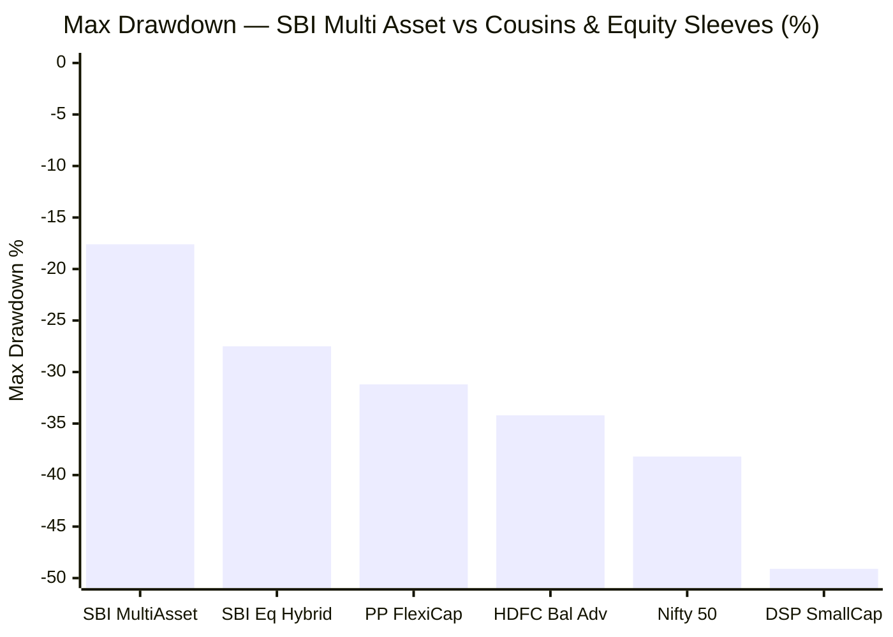
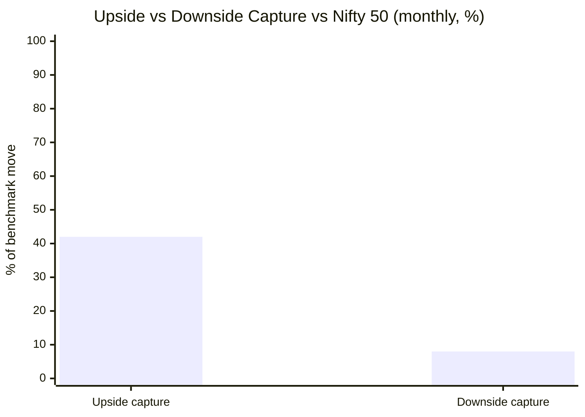
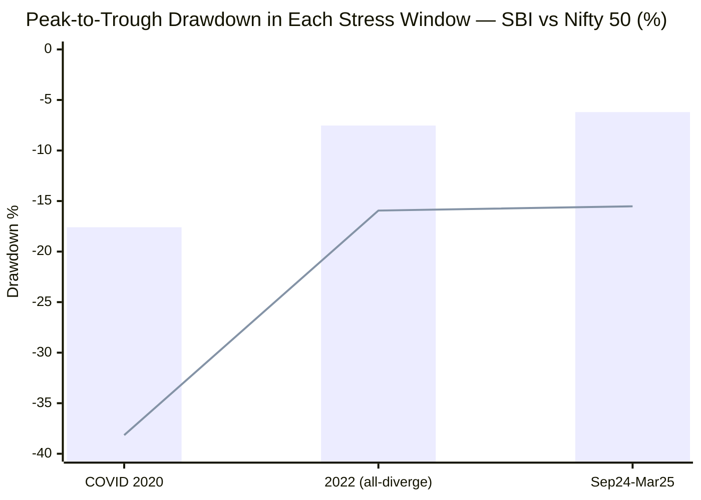
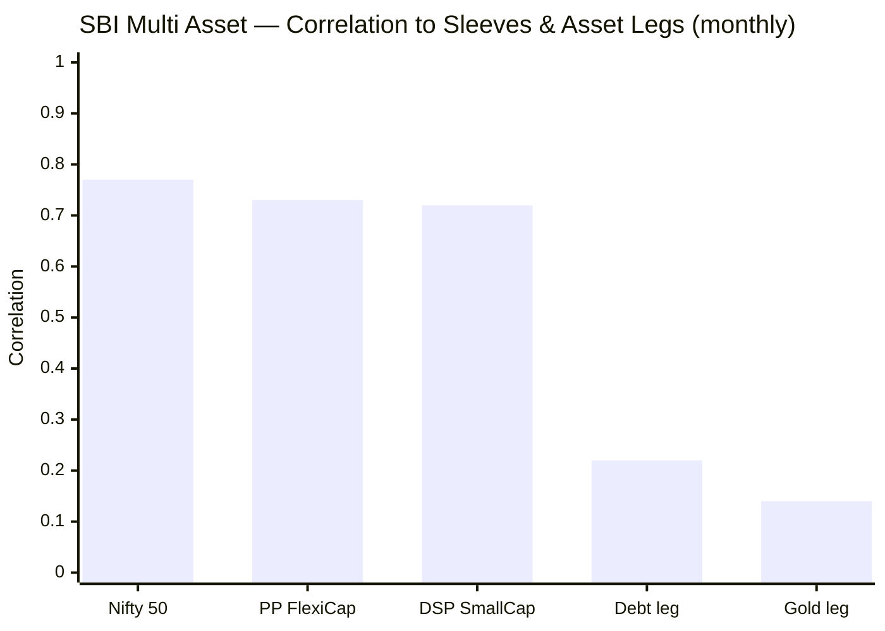
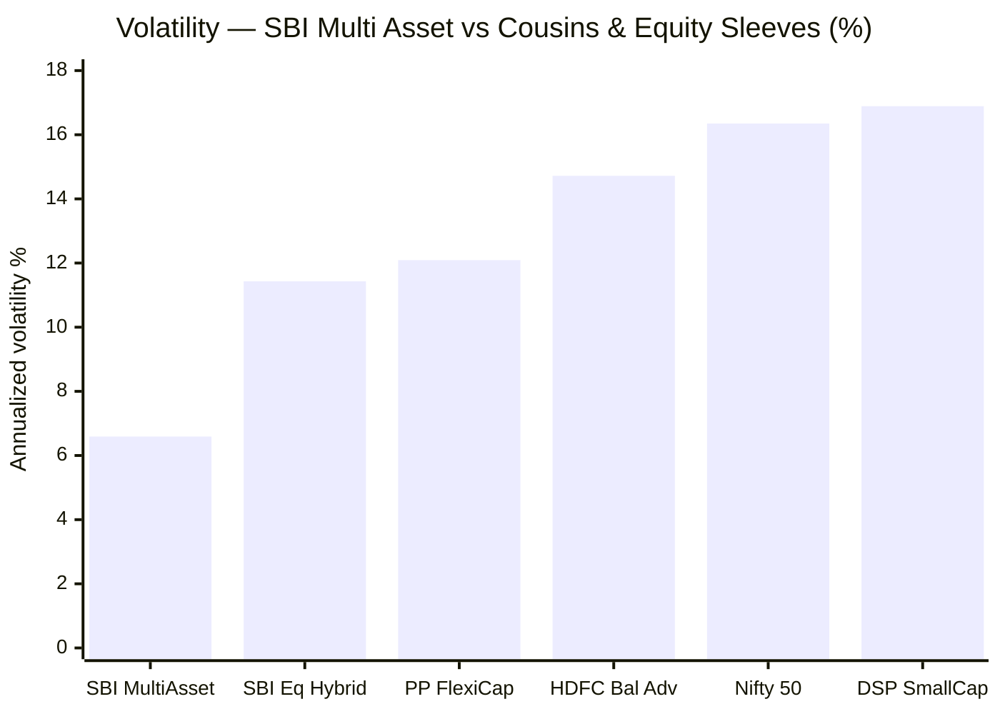
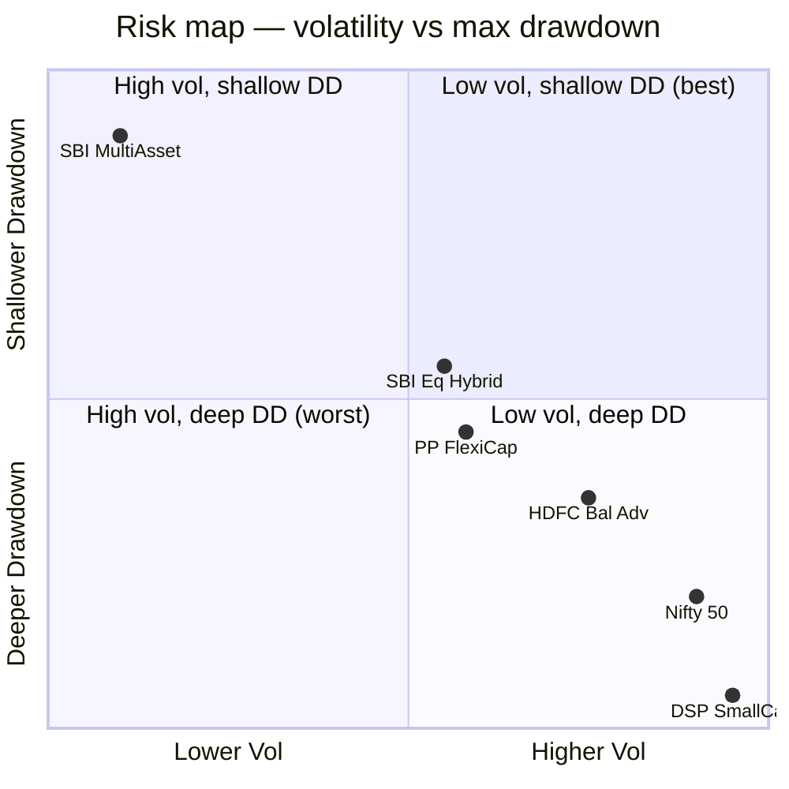
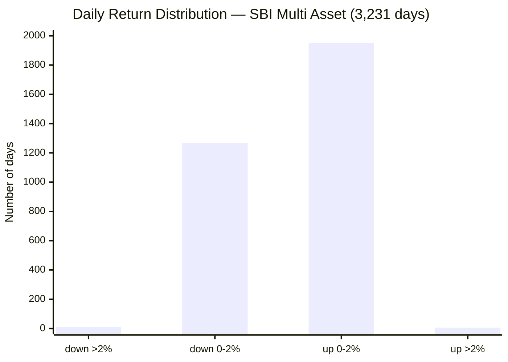
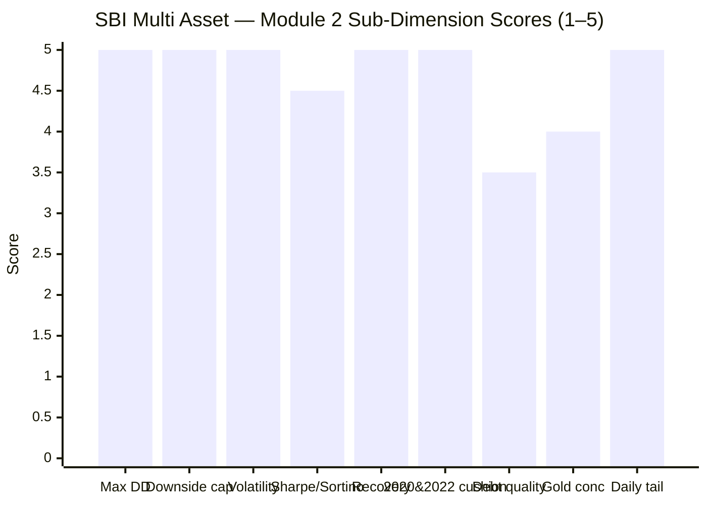

# Module 2: Risk Profile — SBI Multi Asset Allocation Fund

> **Provisional Module 2 score: ~4.5 / 5** (weight **25%** — the top weight in the multi-asset re-weight, because a risk-reduction product lives or dies here). **Scores are NOT comparable to the four equity categories** — this fund is judged on how much it *dampens*, not how much it returns.

> **The one-line context:** this is the module SBI Multi Asset was built to win. An **8% downside capture**, a −17.6% worst-ever drawdown against Nifty's −38%, 6.6% volatility, and genuine cushioning in every stress year — it is comprehensively, structurally low-risk. The one honest asterisk: it is *low-risk because it holds ~47% equity*, not because of clever risk management, and its correlation to the equity funds you already own (~0.75) means it is a **partial** diversifier, not a pure one.

---

## Fund Identity / Raw Data (MFAPI-computed + Tickertape, as of 28-Jul-2026)

| Metric | Value | Source |
|--------|-------|--------|
| MFAPI scheme code | 119843 (3,231 daily returns) | api.mfapi.in/mf/119843 |
| **Volatility (annualized, daily SI)** | **6.59%** | MFAPI computed |
| Volatility (monthly, annualized) | 6.58% | MFAPI computed |
| **Max drawdown (SI)** | **−17.59%** (COVID) | MFAPI computed |
| **Downside capture vs Nifty 50** | **8%** | MFAPI (65 down-months) |
| Upside capture vs Nifty 50 | 42% | MFAPI (95 up-months) |
| **Beta vs Nifty 50 (monthly)** | **0.32** | MFAPI computed |
| Sharpe (monthly, rf 6.5%) | **0.94** | MFAPI computed |
| Sortino (monthly, rf 6.5%) | **1.51** | MFAPI computed |
| Calmar (SI CAGR ÷ max DD) | **0.71** | MFAPI computed |
| Correlation to Nifty 50 / PP FlexiCap / DSP SmallCap | **0.77 / 0.73 / 0.72** | MFAPI (monthly, ~160m) |
| Correlation to Gold / Debt legs | **0.14 / 0.22** | MFAPI computed |
| Worst / best day | −5.18% / +4.17% | MFAPI computed |
| Screening cross-refs | Sharpe 0.93 · stdDev 9.0% | Tickertape, Jul 2026 |
| Debt-book duration/credit; net-vs-gross equity | **factsheet — deferred to M3/M4** | SID (not in API) |

---

## Cross-Source Verification

| Metric | MFAPI computed | Tickertape | Verdict |
|--------|----------------|-----------|---------|
| Sharpe | 0.94 | 0.93 | ✅ Confirmed |
| Volatility | 6.59% (daily SI) | 9.0% (3–5Y stdDev) | ⚠️ Tickertape's window is the higher-vol recent 3–5Y; both confirm a **structurally low-vol** fund (~⅓–½ of an equity fund's ~15–16%) |
| Sortino | 1.51 | — | Computed (rf 6.5%); no Tickertape anomaly to flag here |
| Max drawdown | −17.59% | premium-gated | Self-computed from NAV |
| Downside capture | 8% | not published | The category's decisive metric — self-computed |

**Reliability: High.** All figures self-computed from 3,232 NAVs (Mar 2013 → Jul 2026). Correlations use 158–160 overlapping monthly returns vs each sleeve.

---

## 1. Max Drawdown & the Drawdown Ledger — Shallow and Fast

| Drawdown | Peak → Trough | Depth | Duration | Recovery |
|----------|---------------|-------|----------|----------|
| **COVID 2020** | 20 Feb → 23 Mar 2020 | **−17.59%** | 32 days | 92 days |
| **Current (2026)** | 29 Jan → 23 Mar 2026 | **−8.59%** | 53 days | **not yet recovered** |
| 2022 rate-shock | 11 Apr → 20 Jun 2022 | −7.53% | 70 days | 58 days |
| 2024–25 correction | 26 Sep 2024 → 3 Mar 2025 | −6.20% | 158 days | 52 days |
| Post-COVID wobble | Aug → Sep 2020 | −4.68% | 45 days | 43 days |
| Dec-2022 dip | Dec 2022 → Feb 2023 | −4.10% | 75 days | 44 days |

**Only one drawdown in 13.4 years exceeded −10%** (COVID, −17.6%), and it recovered in three months. Every other stress event was a single-digit dip recovered inside two months. **Honesty note:** the fund is *currently* in a −8.59% drawdown (since Jan 2026, not yet recovered) — shallow and consistent with its history, but worth stating plainly rather than showing only the recovered ones.

---

## 2. Downside Capture — the Category's Decisive Number

| Measure | SBI | Read |
|---------|-----|------|
| **Downside capture** | **8%** | In down-Nifty months, SBI falls ~8% of the index's fall — extraordinary |
| Upside capture | 42% | In up-Nifty months, it captures ~42% |
| Beta vs Nifty 50 | 0.32 | Very low market sensitivity |
| Capture asymmetry | **~5.3×** | 42 / 8 — heavily downside-protective |

An 8% downside capture is the single strongest risk credential in the studied universe — better even than PP FlexiCap (~59%) or DSP SmallCap (~40%), both of which are far more equity-exposed. **The honest caveat:** this is achieved by holding only ~47% equity plus ~33% debt and ~20% gold — it is *structural* (a low-equity book), not a clever hedging engine. The 42% upside capture is the price: SBI will feel painfully slow in an equity bull. That is the correct, deliberate trade for an all-weather sleeve, but it is a trade, not a free lunch.

---

## 3. Realised Cushioning — Did the Non-Equity Sleeves Work When It Mattered? (Tier-1)

This is the test the whole product exists to pass: in each stress event, did gold + debt actually cushion the equity fall?

> Bar = SBI · Line = Nifty 50

| Event | SBI | Nifty 50 | Cushion | What cushioned |
|-------|-----|----------|---------|----------------|
| **COVID 2020** | −17.59% | −38.16% | **+20.6pp** | Debt + the (then-smaller) gold sleeve; recovered in 92 days |
| **2022 — the all-diverge year** | −7.53% | −15.94% | **+8.4pp** | **Gold (+13% in 2022)** did the work while both equity *and* debt fell — the exact scenario multi-asset is built for, and it worked |
| **Sep 2024 – Mar 2025** | −6.20% | −15.52% | **+9.3pp** | Gold at highs + debt; the freshest, universal stress test — passed cleanly |

**Verdict: genuine, and proven in all three regimes** — including the hardest one (2022, when equity and debt fell together and only gold saved the structure). This is the credential the young `no-2022-data` funds (WOC, ABSL) cannot show. SBI is cycle-tested and the cushioning is real, not modelled.

---

## 4. Correlation to the Existing Sleeves — the Decisive Decision-Tree Number (Tier-1)

The portfolio is already ~100% equity (FlexiCap + MidCap + SmallCap + International). The only reason to add SBI is *non-equity it lacks*. So: how correlated is it to what you own?

| vs | Correlation | R² | Read |
|----|-------------|----|------|
| Nifty 50 | 0.77 | 59% | — |
| **PP FlexiCap** (the core) | **0.73** | 54% | ~46% of SBI's variance is independent of the FlexiCap core |
| **DSP SmallCap** (the satellite) | **0.72** | 52% | ~48% independent |
| Debt leg | 0.22 | 5% | Near-uncorrelated — a real diversifier |
| Gold leg | 0.14 | 2% | Near-uncorrelated — the real diversifier |

**This is the module's most important honest finding.** SBI is a **partial** diversifier, not a pure one:
- Its ~0.73–0.77 correlation to the equity sleeves is *substantial* — because ~47% of it **is** equity, much of it overlapping the large-caps PP already holds.
- The genuine decorrelation comes entirely from the **gold (0.14) and debt (0.22) slices**, which are near-uncorrelated to Indian equity.
- Net effect: adding SBI does add real non-equity (roughly 46–48% of its movement is independent of your equity funds), but you are paying a fund fee for a book that is *half* stuff you already own. **The decision-tree question this feeds:** would a **gold ETF + a short-duration debt fund held directly** deliver the decorrelating half more cheaply, without the overlapping equity half? That is the DIY debate (M1/M4), now with the correlation evidence attached. *(Per the checklist, correlation is informational — it feeds the decision tree, not the fund's own risk score.)*

---

## 5. Volatility, Sharpe, Sortino, Calmar

| Metric | SBI | Reference | Read |
|--------|-----|-----------|------|
| Volatility | **6.59%** | equity funds ~15–16% | Lowest by a wide margin — half a balanced-advantage fund |
| Sharpe (rf 6.5%) | **0.94** | shortlist median 0.86 | Above median; strong risk-adjusted |
| Sortino | **1.51** | — | Downside-adjusted return is strong; upside-skewed |
| Calmar (SI) | **0.71** | — | 12.4% CAGR per 17.6% max pain — healthy |
| Calmar (3Y / 5Y) | 0.91 / 0.80 | — | Even stronger on recent windows |

Sharpe 0.94 confirms Tickertape's 0.93. Sortino (1.51) > Sharpe (0.94) → the volatility is upside-skewed (harmful downside is rarer than the total-vol figure implies) — consistent with the 8% downside capture.

---

## 6. Cousin-Category Comparison — SBI vs Its Nearest Relatives (NEW dimension)

Multi-asset's true peers are Balanced Advantage / DAAF, Aggressive Hybrid, and Equity Savings. The test: does SBI dampen *more* than these for the equity it holds?

| Fund (category) | Vol | Max DD | Read |
|-----------------|-----|--------|------|
| **SBI Multi Asset** | **6.59%** | **−17.6%** | Far more defensive than every cousin |
| SBI Equity Hybrid (Aggressive Hybrid) | 11.43% | −27.5% | Equity+debt, no gold — deeper |
| HDFC Balanced Advantage (BAF/DAAF) | 14.72% | −34.2% | Flexes equity 30–80% — much riskier than its "balanced" name |
| PP FlexiCap (equity) | 12.09% | −31.2% | — |

**SBI Multi Asset dampens dramatically more than a Balanced Advantage or Aggressive Hybrid fund** — the third asset class (gold) plus a genuinely lower equity load make it a different risk animal. The flip side (again): far lower equity participation. If the goal is *maximum drawdown reduction*, SBI beats the cousins clearly; if the goal is *equity-like return with some cushioning*, a BAF actually keeps more equity in the game.

---

## 7. Multi-Asset-Specific Risks (NEW dimensions)

| Risk | Assessment | Status |
|------|------------|--------|
| **Debt-sleeve duration + credit** | ~28% of the book is debt. **No credit event is visible in the NAV** (2022's −7.5% max DD shows the debt book behaved). **Backfill (Jul-30):** holdings reach into **corporate credit** — NABARD (AAA/quasi-sov) *and* an **Adani Power debenture** — so it is **not the pure sovereign/AAA book** presumed; a mild credit-reach flag. Duration still unverified | ⚠ corp-credit confirmed; duration deferred |
| **Gold/metals-concentration risk** | **Backfill: precious metals are ~10% (gold ETF 6.3% + silver ETF 3.9%), not ~20%** — even more moderate than first written; plus ~3.7% REITs. Metals *helped* in 2019/2022/2024/2025; a gold+silver bear coinciding with an equity fall is the (rare) risk. Clearly **not over-leaning** | ✅ moderate |
| **Equity-taxation continuity risk** | Net equity is only **46.8%**; equity taxation requires ≥65% *gross* equity, presumably reached via an arbitrage/derivative top-up. If gross equity ever slips below 65%, the fund loses equity taxation — a real, standing risk that also makes the arbitrage sleeve a low-return drag. Quantified in **M4**; flagged here as a risk, not just a tax line | ⚠ M4 |
| Redemption / liquidity-spiral risk | **N/A — LOW.** The book is large-cap equity + arbitrage + gold ETF + high-grade debt, all liquid; no small-cap redemption spiral concern | ✅ N/A |
| No structural buffer | **Inverted here** — the buffer (gold + debt) *is* the product; that it exists is the point, and it demonstrably worked (§3) | ✅ |

---

## 8. Daily Distribution — an Exceptionally Calm Ride

| Metric | Value |
|--------|-------|
| Positive days | 1,956 (60.5%) |
| Days down > 2% | **9** (in 13.4 years) |
| Days up > 2% | 6 |
| Worst day | −5.18% (COVID) |
| Best day | +4.17% |

Nine >2% down-days in 13 years (an equity fund has dozens). The daily experience is almost boringly calm — precisely what keeps a nervous investor from selling.

---

## Comparison with Studied Funds

| Metric | **SBI Multi Asset** | PP FlexiCap | DSP SmallCap | Edelweiss MidCap |
|--------|---------------------|-------------|--------------|------------------|
| Volatility | **6.59%** | 12.09% | 16.89% | ~14% |
| Max drawdown | **−17.6%** | −31.2% | −49.1% | −74.7% (tail) |
| Downside capture | **8%** | ~59% | ~40% | >100% |
| Beta (vs equity) | **0.32** | 0.55 | 0.92 | >1 |
| Sharpe | 0.94 | ~0.68 | 0.74 | ~0.85 |
| Structural buffer | **Gold + debt (the point)** | Bonds + intl | None | None |
| Correlation to equity core | ~0.73 | (is the core) | ~0.9 to mid/small | ~0.9 |

SBI's risk profile is in a different league from any equity fund studied — as it should be. The relevant comparison is not "is it safer than DSP" (obviously) but "does its safety come with enough independent return to earn a slot over just holding the equity funds and adding gold+debt yourself" — the correlation work (§4) is what answers that in the decision tree.

---

## Points For / Points Against — Risk

### ✅ For
1. **8% downside capture, 0.32 beta** — the strongest downside protection in the studied universe.
2. **−17.6% worst-ever drawdown vs Nifty's −38%**, recovered in 92 days; only one >−10% drawdown in 13.4 years.
3. **Genuine cushioning proven in all three stress regimes** — incl. 2022, when only gold could save the structure (+8.4pp cushion).
4. **6.59% volatility** — roughly half a Balanced Advantage fund, a third of an equity fund.
5. **Sharpe 0.94 / Sortino 1.51 / Calmar 0.71** — strong on every risk-adjusted measure; above the shortlist Sharpe median.
6. **Real non-equity decorrelation exists** — gold (0.14) and debt (0.22) legs are near-uncorrelated to Indian equity.
7. **Exceptionally calm daily ride** — 9 down->2% days in 13 years.

### ❌ Against
1. **~0.73–0.77 correlation to the equity sleeves you already own** — it is a *partial* diversifier; ~half its movement overlaps your existing equity. The decorrelating half is only the gold+debt slice.
2. **The low risk is structural, not skilful** — it comes from holding ~47% equity, not from a clever risk engine; a plain 47/33/20 static mix would look similar (the M1 finding).
3. **Debt-book quality is unverified** — ~33% of the fund; duration/credit tiers deferred to M3; a large sleeve to leave un-inspected.
4. **Equity-taxation continuity risk** — net equity only 46.8%; the ≥65%-gross status is arbitrage-dependent and unconfirmed (M4).
5. **Currently in a (shallow) drawdown** — −8.59% since Jan 2026, not yet recovered.
6. **42% upside capture** — the deliberate cost; it will lag hard in equity bulls (an investor must accept this or they'll abandon it at the wrong time).

---

## Module 2 Scorecard

| Sub-dimension | Score | Reasoning |
|---------------|-------|-----------|
| Max drawdown (inception-adjusted) | **5.0** | −17.6% worst-ever; only one >−10% in 13.4y |
| Downside capture vs equity | **5.0** | 8% — best in the studied universe |
| Volatility | **5.0** | 6.59% — half a BAF, third of an equity fund |
| Sharpe / Sortino | **4.5** | 0.94 / 1.51 — above category median; strong |
| Recovery time | **5.0** | Max 92 days (COVID); others <70 days |
| 2020 & 2022 realised cushioning | **5.0** | +20.6pp and +8.4pp; proven incl. the hardest (2022) regime |
| Debt-sleeve quality | **3.5** | No credit event in NAV, but duration/credit unverified (M3 gap) |
| Gold-concentration risk | **4.0** | ~20% — moderate, not over-leaning; helped repeatedly |
| Daily tail risk | **5.0** | 9 down->2% days in 13y; −5.18% worst day |
| Correlation to sleeves | *informational* | 0.73–0.77 to equity — feeds decision tree, not the fund score |
| **Module 2 Overall** | **~4.5 / 5** | Elite, cycle-proven risk profile; docked only for the unverified debt book, the tax-continuity risk, and the honest fact that the safety is structural (low equity), not skill |

---

## Comparative Module 2 Scores (studied funds — calibration only, different categories)

| Fund | Module 2 | Character |
|------|----------|-----------|
| **SBI Multi Asset** | **~4.5 / 5** | **Elite downside protection; partial-diversifier caveat** |
| PP FlexiCap | 4.0 / 5 | Low-vol equity with bond+intl buffer |
| DSP SmallCap | 3.8 / 5 | Battle-tested but −49% max DD |
| Edelweiss MidCap | ~4.2 / 5 | Genuine down-capture, deep tail |

> Module 2 carries 25% here (vs 20% in the equity studies) precisely because risk *is* the multi-asset thesis. SBI's 4.5 is its highest module and rightly so — but note the correlation finding tempers what that 4.5 *buys* the portfolio.

---

## SIP Implication

For a ₹15–20k/month SIP alongside a 100%-equity portfolio, SBI Multi Asset delivers exactly the risk experience a defensive sleeve should: an 8% downside capture, drawdowns that stay shallow and recover in weeks, and proven cushioning in 2020, 2022, and 2024–25. An investor will almost never be scared out of it. **The catch is not risk — it is what the risk-reduction is worth to *this* portfolio:** at ~0.75 correlation to the FlexiCap/SmallCap sleeves, roughly half of SBI duplicates equity already owned, and only the gold+debt half genuinely decorrelates. Whether that half is worth a fund wrapper — versus a gold ETF + a short-duration debt fund bought directly — is the decision-tree call, and Module 2 has now put the correlation number on the table for it.

## One-Line Verdict

**An elite, cycle-proven risk profile — 8% downside capture, −17.6% worst drawdown, cushioning that worked in every stress regime including 2022 — whose only real blemish is that it is a *partial* diversifier (≈0.75 correlated to the equity you already own), so its formidable safety is worth less to an all-equity portfolio than the headline numbers suggest.**

---

*Module 2 complete. Provisional score 4.5/5. Method: self-computed from MFAPI 119843 (3,232 NAVs); correlations vs Nifty 50 (120620), PP FlexiCap (122639), DSP SmallCap (119212); cousins HDFC Balanced Advantage (118968), SBI Equity Hybrid (119609); legs SBI Gold (119788), ICICI All Seasons Bond (120603). **Cross-module handoffs:** debt-book duration/credit → M3; net-vs-gross equity & the equity-taxation-continuity risk → M4; the correlation-to-sleeves number → decision tree. **Retrofit note (Edelweiss discipline):** this module *reinforces* M1's finding — the low risk, like the thin alpha, is structural (a low-equity static-ish book), not evidence of allocation skill; no M1 score change, but the "is there skill?" question now leans further toward 'no' pending M3/M5.*

*Next: [Module 3 — Allocation Engine & Portfolio DNA](module3_allocation.md)*
