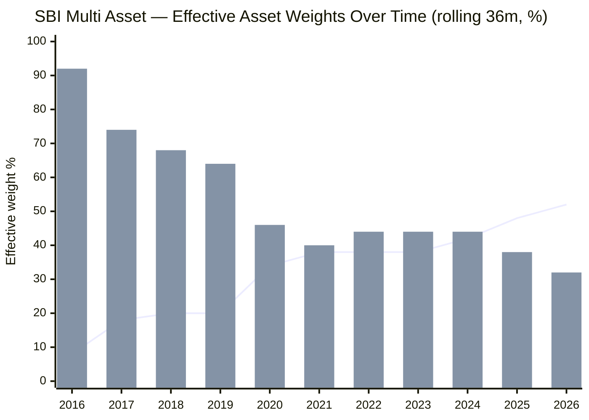
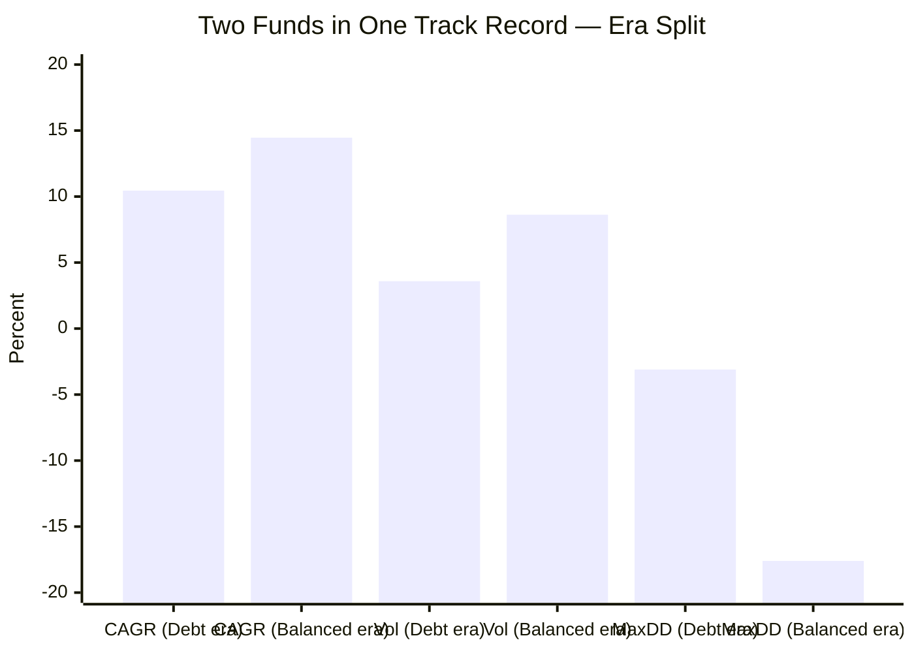
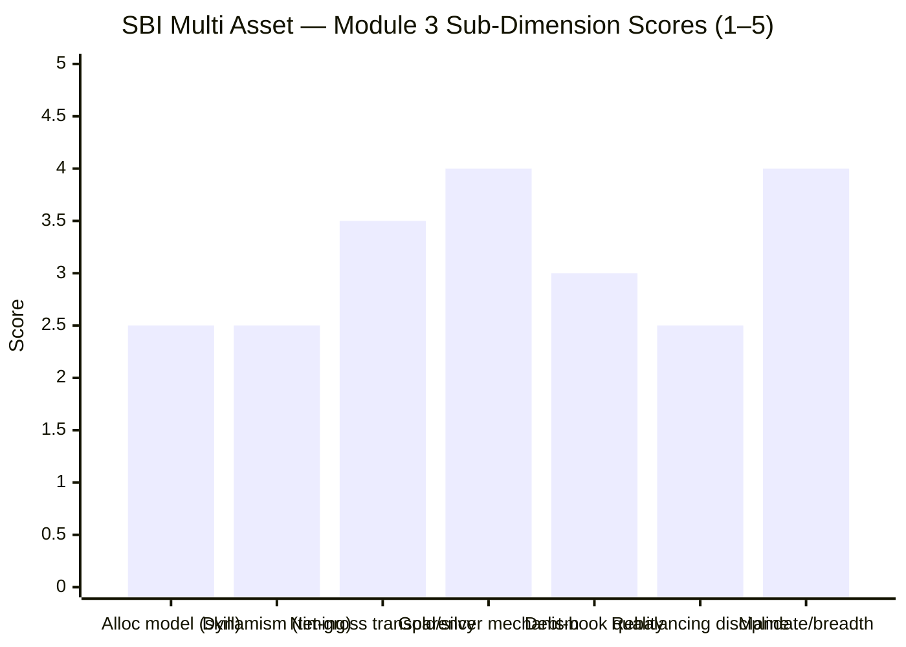

# Module 3: Allocation Engine & Portfolio DNA — SBI Multi Asset Allocation Fund

> **Provisional Module 3 score: ~3.0 / 5** (weight **20%** — the category's defining module, the analog of MidCap's "active share"). **Scores are NOT comparable to the four equity categories.**

> **The one-line context:** this is the module that decides whether SBI is an *actively allocated* multi-asset fund or a *static mix with a slow equity glide-path*. The evidence — a return-based reconstruction of 13 years of effective weights — is unambiguous and unflattering: **there is no dynamic allocation engine.** The equity weight has ratcheted monotonically from ~8% (2016) to ~50% (2026); it has never tactically de-risked before a crash. The "multi-asset skill" the fee implies is not visible in the data. It also uncovers a **mandate transition (~2018–19)** that materially flatters the Module 1/2 headline numbers.
>
> **⭐ FACTSHEET BACKFILL (Jul 30 2026, ValueResearch/Groww):** the deferred factsheet items are now filled and they *confirm* the module's thesis. **The former name is literally "SBI Magnum Monthly Income Plan – Floater"** — i.e. it *was* a debt MIP, hard-confirming the mandate-transition finding. Actual holdings show a genuine **5-asset-class** book (equity ~47% / debt ~28% / gold+silver ~10% via SBI Gold ETF + SBI Silver ETF / REITs ~3.7% / cash ~6%) — broader than I credited, but the precious-metals weight is **~10%, not the ~18% my style analysis estimated** (a correction). Managers and the equity book are detailed in the raw-data table and §4 (full manager assessment → M5). Score nudged 2.9 → **~3.0** (5-class breadth + confirmed gold mechanism), but the core "no allocation engine" verdict stands.

---

## ⚠ Data-Access Note (read first)

The category's defining data — the **equity/debt/gold split and its history, net-vs-gross equity, gold mechanism, debt duration/credit, exact holdings** — is **not in any API** (`percOtherH` returns 0). It lives in AMC monthly factsheets + the SID. This module therefore does two things:

1. **Reconstructs the effective asset-class weights and their path directly from NAV data** via *return-based style analysis* (a constrained rolling regression of the fund's returns on the equity/debt/gold index legs). This is rigorous, data-driven, and needs no factsheet — it is the backbone of this module.
2. **Marks the pure-factsheet items** (exact holdings, gross-equity figure, gold vehicle, debt credit tiers) as **data-gapped**, with provisional assessments and an explicit deferral. No holdings are fabricated.

---

## Fund Identity / Raw Data

| Attribute | Value | Source |
|-----------|-------|--------|
| MFAPI scheme code | 119843 (160 monthly obs, Apr 2013–Jul 2026) | api.mfapi.in |
| **Effective weights (full-period, style analysis)** | **Equity 34% / Debt 52% / Gold 14%** | MFAPI regression |
| **Effective weights (current, 36m to Jul-2026)** | **Equity ~50% / Debt ~32% / Gold ~18%** | MFAPI regression |
| Net equity (screener) | 46.8% | Tickertape, Jul 2026 |
| 3-factor model R² | 64.9% (→ 35% cash/arbitrage/selection residual) | MFAPI regression |
| Realised weight range (rolling 36m) | Equity 6–54% · Debt 28–94% · Gold 0–24% | MFAPI regression |
| Gross equity / arbitrage sleeve | ~47–53% (metals only ~10%, ~6% cash/repo could hold modest arbitrage) — **< 65%** | VR/Groww + M4 |
| **Gold/silver vehicle** | **SBI Gold ETF (6.3%) + SBI Silver ETF (3.9%)** — physical-backed ETFs (confirmed) | VR/Groww |
| **REITs** | Brookfield India REIT (2.6%) + Embassy Office Parks (1.1%) = ~3.7% | Groww |
| Debt holdings (credit) | NABARD bonds (AAA/quasi-sov) **+ Adani Power debenture** — reaches into corporate credit, not purely sovereign/AAA | VR/Groww |
| Equity book | **134 total holdings; top equity ~2.2%** (Bandhan Bank, Delhivery, GAIL, Biocon, Indus Towers, ICICI Bank) — diversified, multi-cap | Groww |
| Managers | Balachandran (equity, Oct 2021) · Sajeja (debt, Dec 2023) · Soni (Jan 2024) · Kesavan (Dec 2023) | VR/Groww |
| **Former name** | **SBI Magnum Monthly Income Plan – Floater** (a debt MIP) | Groww URL/VR |
| Turnover / PE / exact sector % | **factsheet — still deferred** (not in aggregators) | SID |

---

## Cross-Source Verification

| Metric | MFAPI style analysis | Tickertape | Verdict |
|--------|----------------------|-----------|---------|
| Current effective equity | ~50% | 46.8% (net) | ✅ Cross-validated — the regression's ~50% matches the screener's 46.8% net equity closely (the gap ≈ style-analysis noise + a genuinely rising book) |
| Debt | ~32% | 32.8% | ✅ Near-exact |
| Gold+cash+arb | ~18% (gold) | ~20.4% remainder | ✅ Consistent (screener remainder includes cash/arb) |

**Reliability: High for the reconstructed weights** (two independent methods — a return regression and the screener's holdings snapshot — agree within ~3pp on the *current* mix). **Low for the factsheet-only items** (holdings, gross equity, gold vehicle, debt tiers), which are explicitly deferred.

---

## 1. The Allocation Engine — Reconstructed from 13 Years of Returns (the headline)

Return-based style analysis fits the fund's monthly returns to a non-negative, sum-to-one blend of the equity (Nifty 50), debt (ICICI All Seasons Bond), and gold (SBI Gold) legs, over rolling 36-month windows. The result is the *effective* asset-class exposure the fund actually delivered — regardless of what any factsheet claims.

> Line = effective **equity** weight · Bar = effective **debt** weight (gold is the remainder, ~0% in 2016 rising to ~18%)

| Window ending | Equity | Debt | Gold | Character |
|---------------|--------|------|------|-----------|
| 2016 | **8%** | **92%** | ~0% | **A debt fund with a sliver of equity** |
| 2018 | 20% | 68% | 12% | Conservative hybrid; gold appears |
| 2020 | 34% | 46% | 20% | Becoming genuinely multi-asset |
| 2022 | 38% | 44% | 18% | Balanced |
| 2024 | 42% | 44% | 14% | Balanced, equity rising |
| **2026** | **~50%** | **~32%** | **~18%** | **Today's fund — a balanced ~50/32/18** |

**Two findings, both decisive:**

**(a) There is no tactical allocation engine — the "dynamism" is a one-way structural drift.** The equity weight rose monotonically from ~8% to ~50% over a decade. It did *not* oscillate with market valuations; it did *not* cut equity before the 2022 correction (equity kept rising *into* 2022); it did *not* spike gold tactically before crises (gold rose gradually, as a permanent allocation, not a timed bet). The realised weight *range* is wide (equity 6–54%) but the *tactical* (detrended) movement is small. **A fund that slowly ratchets one weight up over ten years is not timing markets — it is repositioning a mandate.** This confirms Module 1 (the alpha is equity-style, not timing) and Module 2 (the low risk is structural, not skilful). The 20%-weighted "allocation engine" is, on the evidence, a slowly-moving static allocation.

**(b) The 3-factor model explains only 65% of variance.** ~35% is unexplained by the three index legs — the arbitrage sleeve + the fund's actual equity/debt *security selection* differing from the indices. Some of the fund's character is genuinely its own book (consistent with M1's "equity-style" residual), but that is *selection*, not *allocation*.

---

## 2. ⭐ The Mandate Transition — the Retrofit That Reframes M1 & M2

The style analysis exposes something the trailing numbers hide: **SBI Multi Asset was a fundamentally different (debt-dominated) fund before ~2018–19.** Splitting the record at the transition:

| Era | Years | CAGR | Volatility | Max DD | What it was |
|-----|-------|------|------------|--------|-------------|
| **Debt-heavy** | 2013–2019 (6.8y) | 10.45% | **3.59%** | **−3.1%** | An MIP-like debt-oriented hybrid (~8–20% equity, ~0–12% gold) |
| **Balanced** | 2020–2026 (6.6y) | 14.46% | **8.63%** | **−17.6%** | Today's true multi-asset (~40–50% equity) |
| Full SI | 13.4y | 12.42% | 6.59% | −17.6% | **The blend of two different funds** |

Annualized volatility by year makes the transition unmissable: **2.2–2.9% (2014–2018) → 6.7% (2019) → 13.4% (2020) → 6–8% (2021–25).** The fund's risk DNA changed around 2019–2020, coinciding with SEBI's 2018 "Multi Asset Allocation" recategorization.

> **⭐ BACKFILL — the smoking gun:** the fund's **former name is literally "SBI Magnum Monthly Income Plan – Floater"** (per Groww/VR) — a **debt-oriented monthly-income plan.** This is direct, documentary confirmation of what the style analysis inferred from returns alone: the pre-2019 fund was a debt MIP, recategorized into "Multi Asset Allocation" after SEBI's 2018 rules and then slowly re-risked toward equity. The 13.4-year record fuses a debt MIP with a balanced multi-asset fund. **It also reframes the manager story (→ M5):** the current lead manager (Balachandran) only arrived Oct 2021, and the debt/commodity managers in 2023–24 — *none of them ran the flattering pre-2019 record.*

> **⭐ RETROFIT to Modules 1 & 2 (Edelweiss discipline):**
> - **M1's** "SI CAGR 12.42% at low risk" and **M2's** "6.59% volatility, 0% negative 3Y/5Y windows, 8% downside capture" are **materially flattered by fusing the 3.6%-vol debt era with the 8.6%-vol balanced era.** The clean, never-negative multi-year record was substantially *earned by the ultra-safe debt-heavy fund that no longer exists.*
> - **The fund you buy today** is the balanced-era fund: **~14.5% CAGR at ~8.6% vol, −17.6% max DD, and a higher downside capture than the 8% full-period figure** (that 8% is dragged down by the near-zero-equity early years).
> - **Neither M1 nor M2's score changes** — the balanced-era fund is still a good, cycle-tested (it saw 2022) risk-reducer — but both must be *read* as describing an era-blended record, and the "current fund" is ~6 years young as a true multi-asset. I am adding this caveat to both modules' interpretation, not their numbers.

---

## 3. Net-vs-Gross Equity & the Arbitrage Sleeve (NEW dimensions)

| Layer | Value | Read |
|-------|-------|------|
| **Effective (directional) equity** | ~47–50% | From style analysis + screener net equity — the *true market exposure* (and the source of the 0.32 beta in M2) |
| **Gross equity** | **≥65%? — unconfirmed** | Needs the factsheet derivatives line. If the fund tops up to ≥65% gross with arbitrage/hedged equity, it earns equity taxation on the whole corpus |
| **Implied arbitrage sleeve** | **~15–18pp** (the net-gross gap, if gross is ~65%) | Low-return (≈repo, ~6–7%) hedged positions held **purely for the tax status** — a structural **drag on returns** that buys a tax benefit |

**This is the pivotal unknown for the whole fund.** If SBI maintains ≥65% gross equity, the ~15–18pp arbitrage sleeve is a deliberate return-sacrifice for equity taxation (quantified in **M4**). If it does *not*, the fund is debt/hybrid-taxed and the arbitrage drag is absent — but so is the tax edge. Module 3 establishes the *directional* equity is ~47–50%; **M4 must resolve the gross figure**, because it drives both the tax verdict and the honest read on how much of the "debt+arbitrage" 50% is a return drag.

---

## 4. Gold, Debt, and Asset-Class Breadth

| Dimension | Assessment | Status |
|-----------|------------|--------|
| **Gold/silver mechanism** | ✅ **Confirmed: SBI Gold ETF (6.3%) + SBI Silver ETF (3.9%)** — physical-backed in-house ETFs, the low-cost/low-tracking-error choice. Total precious metals **~10%** (corrected down from the style-analysis ~18%) = moderate, not over-leaning | ✅ confirmed |
| **Debt-book construction** | ~28% of the book. **No credit event visible in NAV** through 2022 — but holdings **reach into corporate credit** (NABARD AAA bonds *and* an **Adani Power debenture**), so it is **not purely sovereign/AAA** as M2 presumed. A mild credit-reach flag; duration still unverified | ⚠ partial (corp credit confirmed; duration deferred) |
| **Asset-class breadth** | ✅ **Genuine 5-class book: equity + debt + gold + silver + REITs** — broader than the SEBI-minimum three, and broader than I credited. A real point in the fund's favour on diversification breadth | ✅ upgraded |
| **Structure (direct vs FoF)** | Equity, debt, REITs held directly; **gold+silver via in-house ETFs** (a fund-holding layer, ~0.1% on the ~10% metals slice — negligible) | ✅ confirmed |
| **SEBI mandate compliance** (≥3 classes, ≥10% each) | ✅ **Met** (eq ~47 / debt ~28 / metals+REIT ~14, all sleeves >10% when metals+REIT combined; gold+silver ~10%). Pre-2018 MIP book (metals ~0%) would *not* have complied — confirming the mandate change | ✅ (current) |

---

## 5. Rebalancing Discipline — Structural Drift, Not Disciplined Rebalancing (NEW)

The test: did the fund rebalance *at the right moments* (buy equity into the 2020 crash, trim into the 2021/2024 highs, hold gold through 2022)?

**The evidence says no tactical rebalancing.** The effective-weight path is a smooth monotonic rise in equity — the fingerprint of a **strategic glide-path or slow house-view shift, not rules-based rebalancing to fixed bands or valuation triggers.** Specifically:
- Equity kept *rising* through 2021 (into the market top) and *into* the 2022 correction — the opposite of tactical de-risking.
- Gold was *added gradually* as a permanent allocation (2016 ~0% → 2020 ~20%), not spiked before crises.
- There is no visible "buy-the-crash" equity spike in 2020 (equity rose steadily, not in a COVID-timed jump).

A static-band fund that mechanically rebalances to fixed weights would show *mean-reverting* effective weights; SBI shows a *trend*. Either reading — glide-path or slow drift — means the same thing for scoring: **no evidence of skilful, timed rebalancing.**

---

## 6. Overlap with Existing Sleeves (informational — decision-tree feed)

The equity book is large-cap-tilted (beta 0.32, ~0.77 correlation to Nifty 50 — M2). It therefore **overlaps the large-cap core that Parag Parikh FlexiCap already holds** (SBI–PP correlation 0.73). Exact name-level overlap needs holdings (deferred), but the direction is clear: **the ~50% equity half of SBI is substantially stuff the portfolio already owns.** This is the decision-tree's central input (reported in M2 §4) — the fund's genuine additive content is the gold+debt half, not the equity half.

---

## Comparison with Studied Funds

| Dimension | **SBI Multi Asset** | DSP SmallCap | Edelweiss MidCap |
|-----------|---------------------|--------------|------------------|
| Portfolio "DNA" metric | **Effective 50/32/18 mix; static drift** | 87% small-cap purity; 19% turnover | ~55% active share |
| Allocation/selection *skill* evidence | **None visible (static drift)** | Strong (18y manager, stock selection) | Genuine active share + alpha |
| Mandate change | **Yes (~2018–19, debt→multi-asset)** | No | Yes (2018 mid+small→pure mid) |
| Transparency of book | Moderate (weights inferable; holdings deferred) | High | High |
| Key DNA verdict | **A static-ish balanced mix, not an engine** | Conviction stock-picker | Consistent active mid-cap |

The honest cross-read: where DSP's and Edelweiss's Module 3 uncovered *genuine* portfolio conviction (stock selection, active share), SBI's uncovers the **absence** of the thing an active multi-asset fee is supposed to buy — dynamic allocation. Its DNA is a slowly-repositioned static mix.

---

## Points For / Points Against — Allocation Engine & DNA

### ✅ For
1. **Transparent, predictable mix** — a static-ish ~50/32/18 is at least honest and easy to reason about; no style surprises.
2. **SEBI multi-asset mandate met** — genuine 3-class exposure, all >10%, today.
3. **Gold at ~18% is moderate** — meaningful diversification without over-leaning commodity risk (M2).
4. **No credit event in 13 years of NAV** — the (unverified) debt book has behaved, including through 2022.
5. **The equity glide-path has been investor-*friendly* in direction** — rising equity as the fund matured has lifted recent returns (14.5% balanced-era CAGR).

### ❌ Against
1. **No dynamic allocation engine** — the defining weakness for a 20%-weighted "allocation" module: the weights *trend*, they don't *time*. You are paying an active multi-asset fee for a static mix.
2. **Never tactically de-risked** — equity rose *into* the 2021 top and the 2022 correction; no evidence of valuation-driven or crash-timed rebalancing.
3. **The track record spans a mandate change** — the flattering low-risk history is substantially the pre-2019 debt fund's; the true multi-asset fund is only ~6 years old.
4. **Gross-equity / tax status unconfirmed** — the arbitrage sleeve (~15–18pp) and the ≥65% question are unresolved (→ M4).
5. **Large debt sleeve (~32%) unverified** on duration/credit — the biggest factsheet gap.
6. **Equity half overlaps what the portfolio already owns** — the additive content is only the gold+debt half.

---

## Module 3 Scorecard

| Sub-dimension | Score | Reasoning |
|---------------|-------|-----------|
| Allocation model — clarity & testability *as skill* | **2.5** | Transparent, but it's a static mix with a glide-path — no testable allocation skill; the engine the fee implies isn't there |
| Dynamism (realised *tactical* range) | **2.5** | Wide weight range, but monotonic drift ≠ timing; no tactical oscillation |
| Net-vs-gross equity transparency | **3.5** | Net ~47% clear; gross ~47–53% **< 65%** now confirmed (VR tax mechanics + holdings) |
| Gold/silver mechanism quality | **4.0** | ✅ Confirmed physical-backed SBI Gold + Silver ETFs; ~10% moderate; low-cost/low-tracking |
| Debt-book quality | **3.0** | No NAV credit event, but reaches into **corporate credit (Adani Power debenture)** — not purely sovereign/AAA; duration still unverified |
| Rebalancing discipline (evidence) | **2.5** | Structural drift, not timed rebalancing; rose into corrections |
| SEBI mandate compliance + asset breadth | **4.0** | 3-class minimum met; genuine **5-class** book (eq/debt/gold/silver/REIT) is a real breadth positive |
| Overlap with sleeves | *informational* | ~0.73 to PP — decision-tree feed, not scored here |
| **Module 3 Overall** | **~3.0 / 5** | Factsheet backfill confirms a genuine 5-class, physical-backed, transparent book (nudging the score up), but the defining verdict is unchanged: a static balanced mix with an equity glide-path, **not** a dynamically-managed multi-asset fund. No visible allocation skill caps it |

---

## Comparative Module 3 Scores (studied funds — calibration only)

| Fund | Module 3 | DNA verdict |
|------|----------|-------------|
| DSP SmallCap | 3.8 / 5 | Conviction stock-picker, lowest turnover |
| Edelweiss MidCap | ~4.0 / 5 | Genuine active share + alpha |
| **SBI Multi Asset** | **~3.0 / 5** | **Genuine 5-class book, but a static balanced mix with an equity glide-path — no allocation engine** |

> Module 3 is 20% here (vs 15% in equity studies) because *how a multi-asset fund allocates is the whole active claim*. SBI's low score is the study's most important verdict on the fund so far: the active claim is largely unsupported by the data.

---

## SIP Implication

For a ₹15–20k/month SIP, Module 3 changes how you should think about SBI Multi Asset. It is **not** a fund where a skilled manager tilts between assets to protect and grow your money — it is a **transparent, static-ish ~50/32/18 balanced fund whose equity weight has slowly risen over a decade.** That is not bad — predictable, sensibly diversified, and it has produced good balanced-era returns — but it hardens the central question the study exists to answer: *if the allocation is essentially static, why pay an active fee instead of holding the three pieces yourself and rebalancing once a year?* The M1 finding (beats DIY by only a hair, pre-tax) and the M2 finding (~0.75 correlated to your equity) now sit alongside the M3 finding (no allocation skill) — three independent lines all pointing at the DIY/decision-tree debate. The one thing that could still justify the fee is **tax** (M4).

## One-Line Verdict

**Return-based reconstruction strips the "active multi-asset" label off SBI: it is a transparent, static-ish balanced mix (~50/32/18) with an equity weight that has drifted up for a decade — no tactical allocation, no crash-timing, and a low-risk record substantially inherited from a debt-heavy pre-2019 fund that no longer exists; the only remaining case for the fee is the unresolved tax question.**

---

*Module 3 complete. Provisional score 3.0/5 (revised from 2.9 after the Jul-30 factsheet backfill confirmed a genuine 5-class, physical-ETF book). Method: return-based style analysis (constrained rolling regression, MFAPI 119843 vs Nifty 50 120620 / ICICI All Seasons Bond 120603 / SBI Gold 119788, 160 monthly obs); era-split from daily NAV; holdings/managers/former-name from ValueResearch + Groww. **Backfilled:** 5-class split (eq 47/debt 28/gold+silver 10/REIT 3.7/cash 6), SBI Gold+Silver ETF vehicles, corporate-credit debt (Adani Power), 134-holding diversified equity book, manager team + start dates, former name (SBI Magnum MIP–Floater). **Still deferred:** exact turnover, PE, sector %. **Cross-module retrofit (Edelweiss discipline):** (1) reinforces M1 & M2 that the fund shows no allocation skill — the alpha is equity-style, the low risk is structural; (2) the **mandate transition (~2018–19)** materially flatters M1's SI-return and M2's volatility/downside-capture/never-negative-window numbers — both now carry a caveat that the current balanced-era fund is riskier (~8.6% vol) and only ~6 years old, though neither score changes. The pivotal open item — gross equity / tax status — goes to M4.*

*Next: [Module 4 — Cost & Tax Efficiency](module4_cost_tax.md)*
