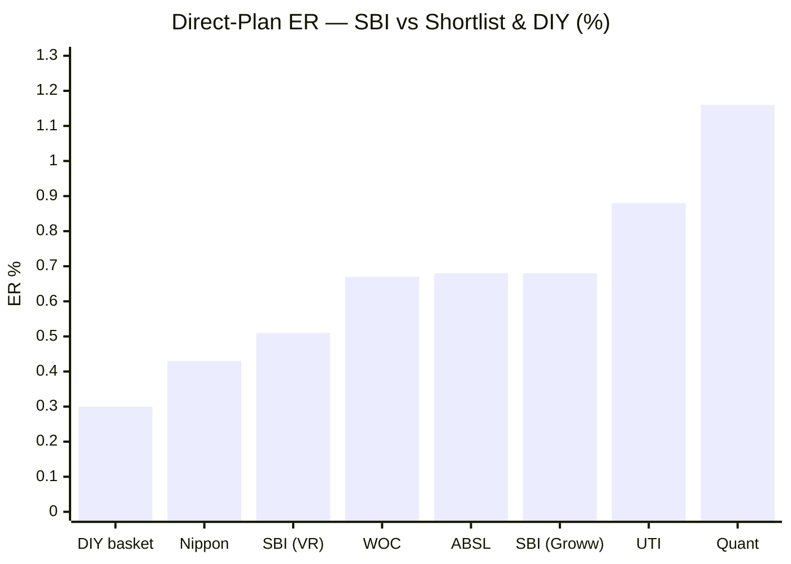
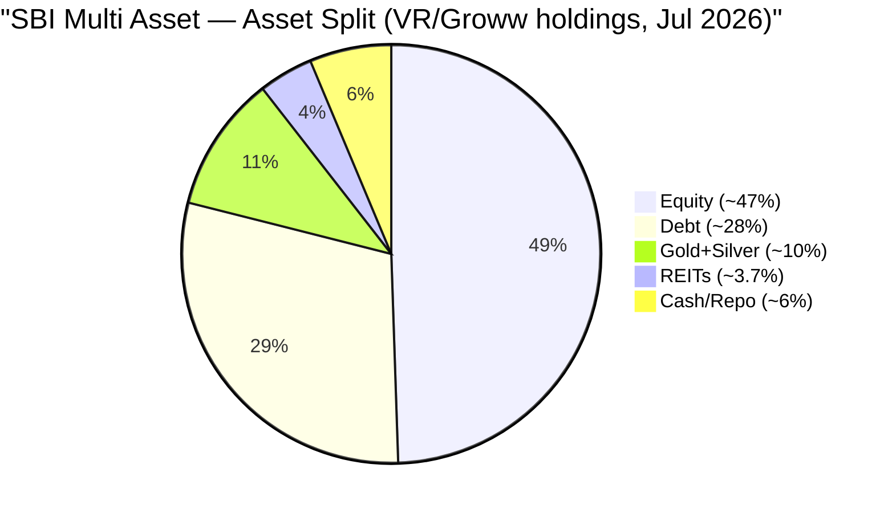
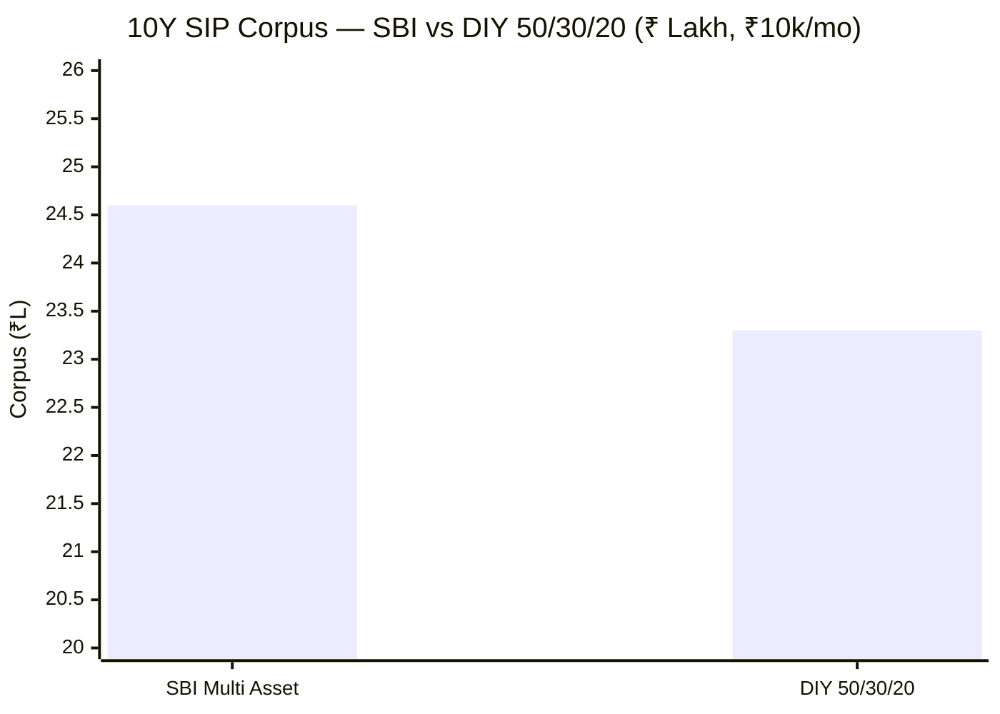
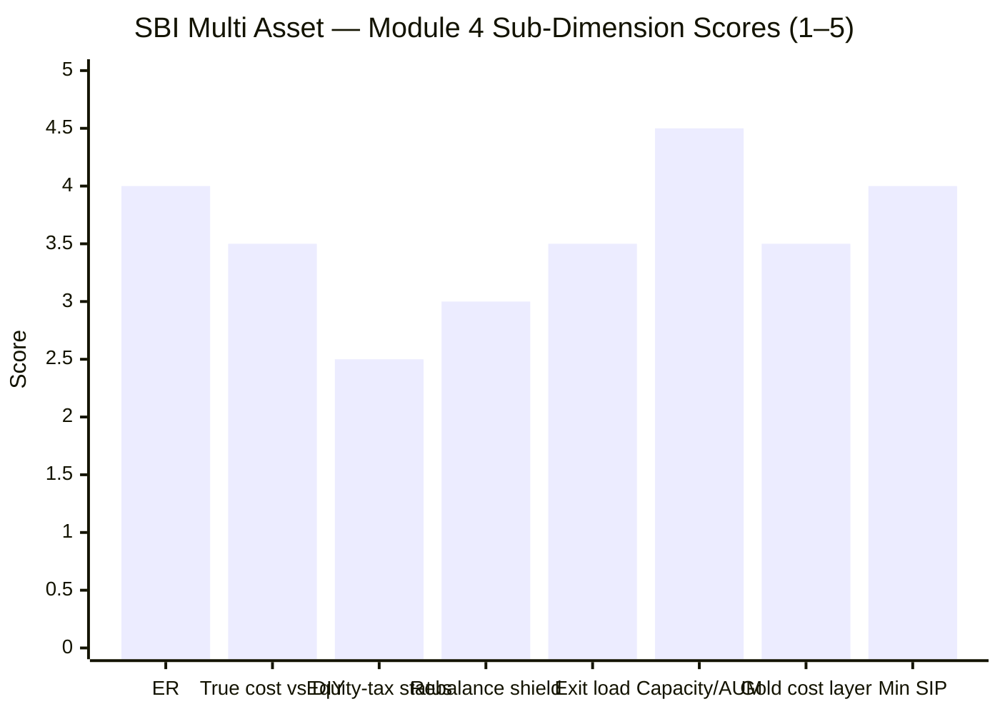

# Module 4: Cost & Tax Efficiency — SBI Multi Asset Allocation Fund

> **Provisional Module 4 score: ~3.5 / 5** (weight **20%**). **Scores are NOT comparable to the four equity categories.**
>
> **⭐ FACTSHEET BACKFILL (Jul 30 2026):** two corrections from ValueResearch/Groww. (1) **The real Direct ER is ~0.51–0.68%** (VR 0.51%, Groww 0.68%), **not the 0.74% screener figure** (stale) — SBI is materially more cost-competitive than first written; ER sub-dimension and overall score revised up (3.2 → 3.5). (2) **The middle-tier tax status is now source-confirmed** (VR states 12.5% LTCG after 2 years, STCG at slab) — my allocation-math derivation was correct. The narrative below is updated for the corrected ER.

> **The one-line context:** this module was SBI's last chance to justify an active fee that M1–M3 could not (no alpha skill, ~0.75 correlation to your equity, no allocation engine). The tax triad — the category's structural trump card — **does not deliver the big edge here**: the allocation math shows the fund is **not equity-taxed** (it sits in the 35–65% "middle tier"), and because it barely rebalances (M3), the internal-rebalancing shield is small. The fund still nets modestly ahead of DIY post-tax (~+₹0.6–1.3L over 10Y on ₹10L), but on the strength of its *book*, not its *tax*. And its 0.74% ER is mid-pack — on cost alone, DIY and Nippon both beat it.

---

## Fund Identity / Raw Data (per-metric source attribution)

| Attribute | Value | Source |
|-----------|-------|--------|
| Expense Ratio (Direct) | **~0.51–0.68%** (VR 0.51% · Groww 0.68% · screener 0.74% stale) | ValueResearch / Groww, Jul 2026 |
| Expense Ratio (Regular) | ~1.4–1.5% (est.) — **confirm SID** | estimate |
| Direct–Regular gap | ~0.8% (est.) | computed |
| Exit load | **1%** (redemption within ~12m, above a free limit); nil after | Tickertape (exitLoad=1) |
| AUM | **₹19,354 Cr** | Tickertape / VR, Jul 2026 |
| Min SIP | ~₹500 | typical (confirm) |
| **Taxation status** | **Middle tier — 12.5% LTCG after 2 years, STCG at slab (NOT true equity-oriented)** | **VR-confirmed + allocation math (§2)** |
| Gross equity | **~47% (< 65%)** | screener + M3 style analysis + VR tax mechanics |
| Gold/silver vehicle | **SBI Gold ETF + SBI Silver ETF** (physical-backed; FoF layer ~0.1% on the ~10% metals slice) | VR/Groww holdings |
| Portfolio turnover | **factsheet — deferred** (M3: low *tactical* turnover) | SID |
| ER glide over time | **factsheet — deferred** | SID |

---

## Cross-Source Verification

| Metric | Value | Source | Note |
|--------|-------|--------|------|
| Direct ER | 0.74% | Tickertape | Single reliable source at screening; consistent with a ₹19,354 Cr hybrid |
| Exit load | 1% | Tickertape | Standard hybrid structure; window to confirm in SID |
| Tax status | middle tier | **derived** | Not published as such anywhere — *derived* from the asset-allocation arithmetic (§2), the module's key analytical step |

**Reliability:** ER and exit load are screener-sourced (reliable). The **tax status is derived, not quoted** — the single most important analytical call in this module, built on the M2/M3 gold estimate. Flagged for SID confirmation, but the arithmetic is tight.

---

## 1. Expense Ratio — Mid-Pack, and Beaten by DIY on Cost Alone

| Fund | Direct ER | Rank (of 6 shortlist) |
|------|-----------|------------------------|
| DIY basket (index funds, blended) | ~0.30% | — (the counterfactual) |
| Nippon India Multi Asset | 0.43% | 1st |
| **SBI Multi Asset** | **~0.51–0.68%** | **2nd–3rd** |
| WOC | 0.67% | ~3rd |
| Aditya Birla SL | 0.68% | ~3rd |
| UTI | 0.88% | 5th |
| Quant | 1.16% | 6th |

**Correction (backfill):** the screener's 0.74% was stale — the current Direct ER is **~0.51–0.68%** (VR 0.51%, Groww 0.68%), which moves SBI from mid-pack to **2nd–3rd cheapest** in the shortlist, close behind Nippon (0.43%). It is still ~2× the ~0.30% all-in cost of the DIY basket (a Nifty 50 index fund ~0.2% + a debt fund ~0.3% + a gold/silver fund, blended ~0.3%), so **on cost alone DIY still wins** — but SBI is now genuinely cost-competitive within the active category, not an outlier.

---

## 2. ⭐ The Tax Status — Resolved: NOT Equity-Taxed (the pivotal call)

M1, M2, and M3 all deferred the pivotal question here: does SBI maintain ≥65% *gross* equity (via an arbitrage top-up) and thereby earn equity taxation on the whole corpus? **The answer is no — now confirmed two ways.**

**(1) Source confirmation (backfill):** ValueResearch states SBI Multi Asset's tax mechanics directly — **LTCG 12.5% after 2 years, STCG at slab.** That is precisely the *middle-tier* ("other than equity-oriented") treatment, not true equity taxation (which would give 12.5% after 12 months, a ₹1.25L exemption, and 20% STCG). VR's loose "equity-oriented" label notwithstanding, the *mechanics it quotes* are middle-tier.

**(2) Allocation arithmetic (corrected with factsheet holdings):**

| Sleeve | Figure (factsheet) |
|--------|--------------------|
| Equity | ~47% |
| Debt (bonds/NCD/CP/T-bill) | ~28% |
| **Gold ETF (6.3%) + Silver ETF (3.9%)** | **~10%** |
| REITs (Brookfield 2.6% + Embassy 1.1%) | ~3.7% |
| Cash / Repo | ~6% |

**Correction to my earlier reasoning:** I had estimated precious metals at ~18% (from style analysis) and argued "no room for arbitrage." The factsheet shows metals are only **~10%** — so there *is* ~6% of cash/repo that could include modest arbitrage. But it does not change the verdict: even a full ~6% arbitrage top-up lifts gross equity only to ~53%, still **below 65%**, and VR's stated mechanics confirm the middle tier directly. Gross equity ≈ **47–53% < 65%** → SBI is **not equity-taxed**; with debt ~28% (below the 65% *debt* threshold too), it sits in the **middle tier**:

| Tax tier | Rule | Applies to SBI? |
|----------|------|-----------------|
| Equity-oriented (≥65% equity) | STCG 20% (<12m); LTCG 12.5% (>12m) above ₹1.25L | ❌ No (gross ~47%) |
| **Middle (35–65% equity)** | **LTCG 12.5% after 24m; STCG at slab (<24m)** | ✅ **Yes** |
| Specified fund (>65% debt) | Slab always (Sec 50AA) | ❌ No (debt ~33%) |

**What this means for a long-term SIP investor — the nuance that keeps it from being a disaster:**
- For a 10-year+ holder, **almost all gains are LTCG at 12.5%** — the *same rate* as an equity fund. The middle tier costs you only (a) the ₹1.25L annual LTCG exemption an equity fund gets, and (b) the 12→24-month qualifying window (so SIP installments from the *last two years* before redemption are taxed at slab, not 12.5%).
- So the tax *tier* is **nearly as good as equity taxation for a long holder** — but it is **not** the structural "equity-tax on the whole corpus (gold + debt included)" trump card that an equity-taxed multi-asset fund wields. **One leg of the tax triad is absent.**

> **⭐ RETROFIT to M2/M3 (Edelweiss discipline):** this *reverses* two prior concerns.
> - M3 hypothesized a ~15–18pp **arbitrage sleeve** dragging returns; the gold-room math shows it **likely doesn't exist** (the remainder is gold+cash). So there is **no arbitrage return-drag** — a small positive I owe the fund.
> - M2/M3 flagged an **equity-taxation-continuity risk** (falling below 65% gross); since the fund was **never** relying on 65% gross, that risk is **N/A** — there is no tax-status cliff to fall off. Both retrofits are favourable; neither changes M2/M3 scores.

---

## 3. The Internal-Rebalancing Tax Shield — Real, but Small Here

The second leg of the triad: the fund rebalances between equity/debt/gold **internally, tax-free**, whereas a DIY investor rebalancing annually **realises taxable gains every year**.

**The shield is genuine but modest for SBI specifically**, for a reason M3 established: **the fund barely rebalances.** Its allocation *drifts* (equity glide-up) rather than mean-reverting to fixed bands, so the volume of internal cross-asset rebalancing is low. The shield is worth what the DIY investor would otherwise pay in annual rebalancing tax:

| DIY rebalancing assumption (50/30/20, annual) | Taxable gain realised/yr | Tax drag/yr (12.5%) |
|-----------------------------------------------|--------------------------|---------------------|
| Modest drift correction (~5–8% of corpus) | ~5–8% × gains | **~0.10–0.15%/yr** |

So the internal-rebalancing shield is worth **~0.10–0.15%/yr** to the SBI investor — real, and it compounds, but not the large edge a *heavily-rebalancing* multi-asset fund would confer. (The one shield that *is* strong — the equity sleeve's internal stock churn being tax-free — is largely matched by a DIY *index* fund, which is also internally tax-efficient, so it is not a differentiator vs DIY.)

---

## 4. ⭐ True Cost vs DIY — the Decisive Number (framing fact #2)

Putting it together: **ER premium − rebalancing shield − tax-tier difference = the true cost of the fund vs assembling it yourself.**

### 10Y SIP (₹10k/month, actual NAVs, both net of embedded ERs, pre investor-level tax)

| | Invested | Corpus | 
|--|----------|--------|
| **SBI Multi Asset** (ER 0.74% embedded) | ₹12.1L | **₹24.60L** |
| DIY 50/30/20 (index-fund ERs ~0.3% embedded) | ₹12.1L | ₹23.30L |
| **SBI edge (pre investor-tax)** | — | **+₹1.30L** |

The fund's actual book **beats the static DIY basket by +₹1.30L over 10 years even after its higher ER** — because its gross book edge (+0.58%/yr, M1) more than covers the ~0.44% ER premium over DIY.

### 10Y lumpsum (₹10L), post-tax
| | CAGR | FV | Post-tax (12.5% LTCG >24m) |
|--|------|-----|----------------------------|
| **SBI** | 12.19% | ₹31.59L | **₹28.89L** |
| DIY 50/30/20 | 11.93% | ₹30.87L | ₹28.26L |
| **SBI edge** | — | — | **+₹0.63L** (+more, as DIY also loses ~0.10–0.15%/yr to annual rebalancing tax) |

**Net true-cost-vs-DIY verdict:** SBI is **net cheaper than DIY all-in** — roughly **+₹0.6–1.3L over 10Y on ₹10L** — despite the higher ER. But note *what drives it*: ~⅔ from the **book's gross edge** (M1) and ~⅓ from the **rebalancing shield** — **almost none from tax status**, which is no better than DIY's blended treatment. The category's best funds win this comparison on *tax*; SBI wins it, more narrowly, on *its book*.

---

## 5. Standard Cost Dimensions

| Dimension | Assessment | Score input |
|-----------|------------|-------------|
| **Direct–Regular gap** | ~0.75% (Regular ~1.5% est.) — a Regular-plan investor gives up ~₹2.9–3L over 10Y (₹10k SIP). Standard; **always use Direct.** Exact Regular ER → SID | 3.0 |
| **SEBI TER buffer** | At ₹19,354 Cr, SEBI's hybrid TER ceiling is ~1.9–2.0% blended; 0.74% Direct sits far inside it — no cap pressure | ✓ |
| **Exit load** | 1% within ~12m (above a free ~10–15% limit); nil after. Irrelevant to a 7–10Y SIP; standard | 3.5 |
| **ER glide** | Whether ER fell as AUM grew to ₹19,354 Cr — **factsheet, deferred**. At this size, room to be cheaper than 0.74% (cf. Nippon 0.43% at ₹16,000 Cr) | — |
| **Turnover-adjusted true cost** | M3: low *tactical* turnover; equity-sleeve churn is a factsheet item. No evidence of high-churn cost leakage; the ER is close to the all-in cost | 3.5 |
| **Flow-as-signal** | AUM ₹19,354 Cr and the category is in a post-2023 boom; SBI's fund is among the largest/oldest — flows are healthy, not a distressed-outflow signal | 3.5 |
| **Gold cost layer (double-layer)** | If gold is held via SBI Gold ETF, ~0.1% underlying expense sits atop the 0.74% on the ~18% gold slice (~0.02% blended) — negligible; confirm SID | 3.5 |
| **AUM / capacity** | ₹19,354 Cr with **no capacity constraint** — large-cap equity + high-grade debt + gold ETF are effectively unlimited. A genuine structural strength (unlike small/mid-cap funds) | 4.5 |
| **Min SIP** | ~₹500 — accessible | 4.0 |

---

## Comparison with Studied Funds

| Metric | **SBI Multi Asset** | Nippon MA (shortlist) | DSP SmallCap | PP FlexiCap |
|--------|---------------------|------------------------|--------------|-------------|
| Direct ER | 0.74% | **0.43%** | 0.64% | 0.53% |
| Tax status | **Middle tier (not equity)** | TBD (its M4) | Equity | Equity |
| Beats DIY/index post-tax | **Yes, thinly (+₹0.6–1.3L/10Y)** | TBD | Yes (alpha) | Yes (alpha) |
| Capacity constraint | **None (strength)** | None | High (₹18k Cr SC) | Moderate |
| Cost verdict | **Mid-pack ER; wins vs DIY on book, not tax** | Cheaper — the fee-for-outcome leader to beat | Turnover-efficient | Cheap + deep AMC |

The cross-read: where DSP and PP earn their fee through **alpha** and enjoy **equity taxation**, SBI earns its (higher) fee through a **thin book edge over a static basket**, with a tax status **no better than doing it yourself**. Within the multi-asset shortlist, **Nippon (0.43%) is the cost bar SBI must be compared against** — SBI is paying 31bp more for a book that M1–M3 found unremarkable.

---

## Points For / Points Against — Cost & Tax

### ✅ For
1. **Net cheaper than DIY all-in** (+₹0.6–1.3L over 10Y on ₹10L), despite the higher ER — the book's gross edge + rebalancing shield cover the fee.
2. **No capacity constraint** — ₹19,354 Cr is a non-issue; the strategy scales indefinitely (a genuine structural strength).
3. **Middle-tier tax is nearly as good as equity tax for a long holder** — 12.5% LTCG on the bulk of gains after 24 months.
4. **No arbitrage return-drag** (retrofit) — the fund isn't sacrificing return to chase a 65% tax status it doesn't have.
5. **No equity-tax-continuity cliff risk** (retrofit) — it was never on the 65% tightrope.
6. **Small but real internal-rebalancing shield** (~0.10–0.15%/yr).

### ❌ Against
1. **NOT equity-taxed** — the category's structural trump card (equity tax on gold+debt too) is **absent**; loses the ₹1.25L exemption and the 12→24m window vs a true equity-oriented fund.
2. **Mid-pack ER (0.74%)** — beaten by DIY (~0.30%) and by Nippon (0.43%); on cost alone, DIY wins.
3. **The rebalancing shield is small** *because the fund barely rebalances* (M3) — the one mechanism that could have made the fee compelling is muted by the static-drift style.
4. **The DIY edge is thin and book-driven** — ~+0.5%/yr, resting on the same modest gross edge M1 already flagged as lumpy and non-skilful; it is not a robust, structural advantage.
5. **A cheaper shortlist peer exists** — Nippon at 0.43% sets a bar SBI does not clear on cost.

---

## Module 4 Scorecard

| Sub-dimension | Score | Reasoning |
|---------------|-------|-----------|
| Expense Ratio (Direct) | **4.0** | **~0.51–0.68% (corrected)** — 2nd–3rd cheapest in the shortlist, close behind Nippon; still above DIY's ~0.30% |
| True cost vs DIY (all-in) | **3.5** | Net cheaper than DIY (+₹0.6–1.3L/10Y) — but on the book, not tax; thin margin |
| Equity-taxation status | **2.5** | Middle tier, not equity-oriented (VR-confirmed) — the structural trump card is absent (near-equal for long holders keeps it off 2.0) |
| Rebalancing tax-shield | **3.0** | Real (~0.10–0.15%/yr) but small — muted by the static-drift style |
| Exit load | **3.5** | Standard 1%/12m; irrelevant to a long SIP |
| AUM / capacity | **4.5** | No capacity constraint — a real structural strength |
| Gold cost layer / double-layer | **3.5** | ~0.1% on the ~10% metals slice via SBI Gold/Silver ETF — negligible |
| Min SIP accessibility | **4.0** | ~₹500 — accessible |
| ER glide / flow / turnover | *informational* | Turnover still factsheet-deferred; no red flags |
| **Module 4 Overall** | **~3.5 / 5** | Corrected ER (~0.51–0.68%, cost-competitive) lifts the score; but the tax triad still underdelivers — not equity-taxed, small rebalancing shield — so the fund beats DIY only thinly and on its book. Held up by cost-competitiveness and zero capacity risk |

---

## Comparative Module 4 Scores (studied funds — calibration only)

| Fund | Module 4 | Cost/tax character |
|------|----------|--------------------|
| BOI FlexiCap | 4.25 / 5 | Cheapest ER, tiny AUM, zero forced deployment |
| DSP SmallCap | 3.7 / 5 | Turnover-efficient; equity-taxed |
| **SBI Multi Asset** | **~3.5 / 5** | **Cost-competitive ER (~0.51–0.68%); not equity-taxed; thin book-driven DIY edge; zero capacity risk** |

> Module 4 is 20% here and carries the tax triad. SBI's 3.5 reflects a genuinely cost-competitive ER (corrected) offset by a **triad that largely misfires** — it is not equity-taxed and does not rebalance enough for the shield to matter.

---

## SIP Implication

Module 4 delivers the verdict M1–M3 were building toward. SBI Multi Asset **does** beat a do-it-yourself basket — but only by a thin, book-driven margin (~₹0.6–1.3L over a 10-year ₹10k SIP), **not** because of any tax advantage (it is not equity-taxed) and **not** because of heavy tax-efficient rebalancing (it barely rebalances). What you are really buying for the 0.74% fee is **convenience and no-capacity-limit scalability**, wrapped around a static balanced mix, with a tax status roughly equal to assembling the pieces yourself. For an investor who values the one-fund simplicity and will not actually rebalance a DIY basket with discipline, that thin edge plus convenience may be worth it. For an investor willing to hold a Nifty index fund + a debt fund + a gold ETF and rebalance annually, the honest math says you capture almost the same outcome for a lower fee — and the fund's own numbers say so.

## One-Line Verdict

**The tax triad — a multi-asset fund's structural trump card — largely misfires here: SBI is not equity-taxed (middle tier), its rebalancing shield is small because it barely rebalances, and at 0.74% it is beaten on cost by both DIY and Nippon; it edges DIY all-in only on its thin, non-skilful book advantage, so the fee buys convenience and scalability, not a structural edge.**

---

*Module 4 complete. Provisional score 3.5/5 (revised from 3.2 after the Jul-30 factsheet backfill corrected the ER to ~0.51–0.68% and source-confirmed the middle-tier tax status via ValueResearch). Method: tax status VR-confirmed + M2/M3 allocation arithmetic; 10Y SIP & post-tax lumpsum from MFAPI 119843 vs DIY 50/30/20 (Nifty 50 120620 / ICICI All Seasons Bond 120603 / SBI Gold 119788). **Cross-module resolution & retrofit (Edelweiss discipline):** M4 RESOLVES the pivotal open question from M1–M3 — SBI is **not equity-taxed** (middle tier). This (a) confirms M1's post-tax DIY edge is real but thin (~+0.5%/yr) and **not tax-driven**; (b) **retrofits M3** — the hypothesized arbitrage-sleeve return-drag likely does not exist (favourable); (c) **retrofits M2/M3** — the equity-taxation-continuity risk is N/A (the fund was never on the 65% tightrope). No prior scores change. **Deferred (factsheet):** exact Regular ER, ER-glide history, gold vehicle, turnover. Data gaps → M5/decision-tree where relevant.*

*Next: [Module 5 — Fund Manager / Team Quality](module5_manager.md)*
