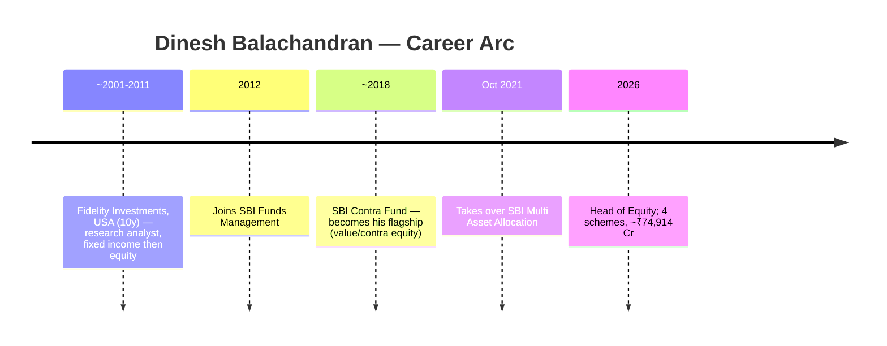
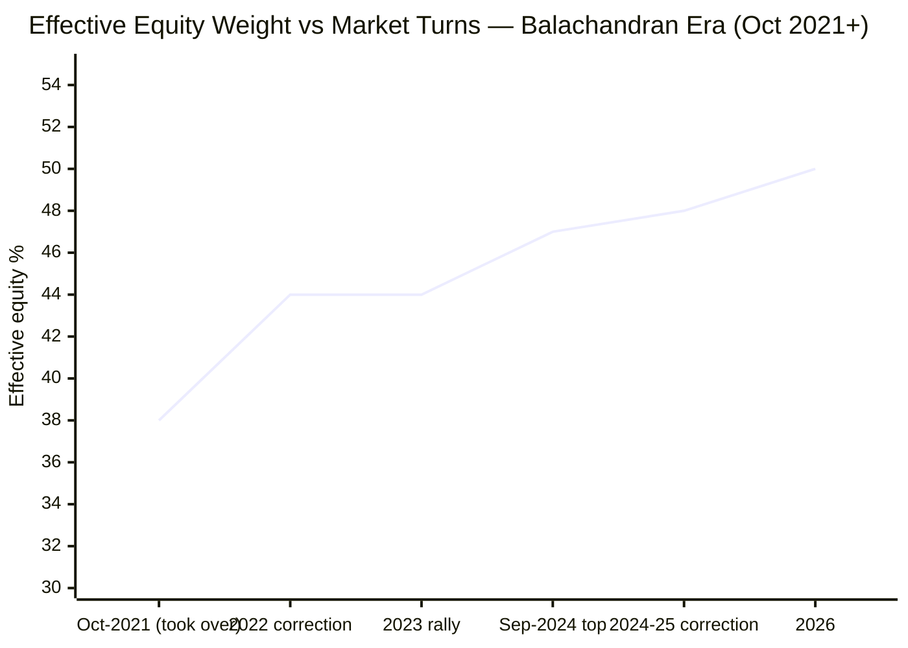
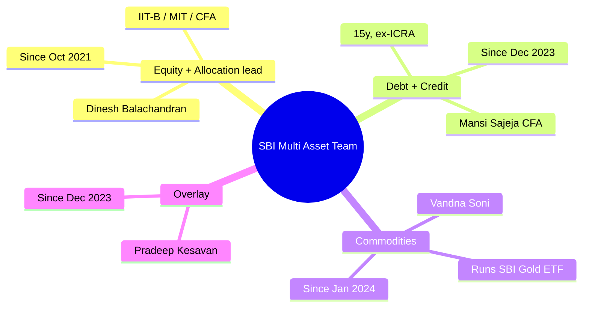
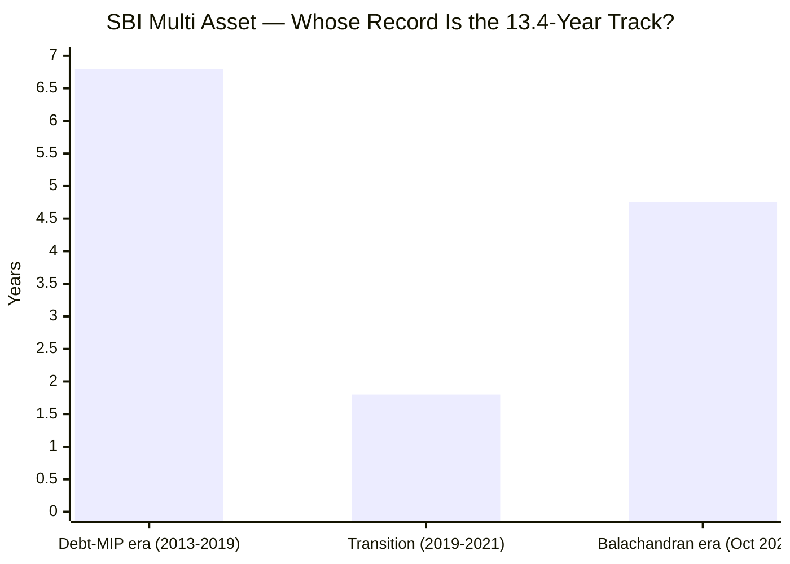
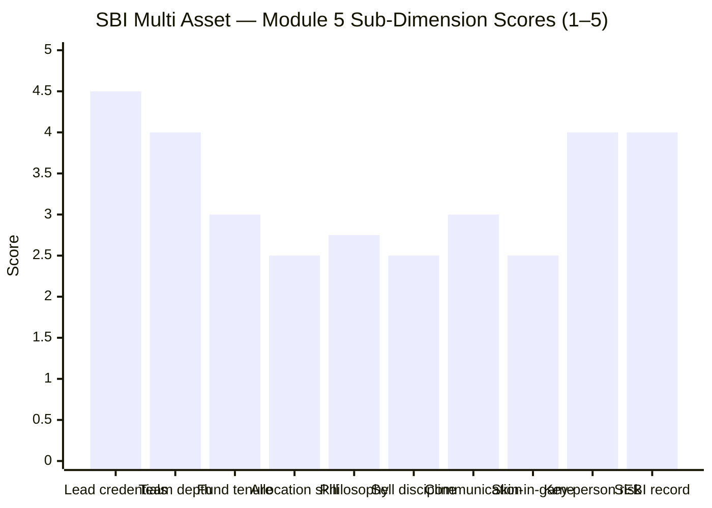

# Module 5: Fund Manager / Team Quality — SBI Multi Asset Allocation Fund

> **Provisional Module 5 score: ~3.2 / 5** (weight **10%** in the multi-asset re-weight — lower than the equity studies' 15%, because allocation here is more model/mandate-driven than single-manager stock-picking). **Scores are NOT comparable to the four equity categories.**

> **The one-line context:** the fund is run by a **genuine multi-desk team** — a heavyweight equity/allocation lead (Dinesh Balachandran, IIT-B/MIT/CFA, Head of Equity) plus dedicated credit and commodity specialists — which is exactly the right *structure* for a multi-asset fund. But the module's two defining findings are unflattering: **(1) the current team is recent** (Balachandran since Oct 2021; the rest since Dec 2023–Jan 2024) — *the flattering 13.4-year record is not theirs*; and **(2) there is no demonstrable asset-*allocation* skill** — the one job that defines this category. Balachandran's real edge is **equity selection** (he runs the well-regarded SBI Contra), not tactical allocation, and Multi Asset is not his primary mandate.

---

## Fund Identity / Raw Data (web-researched — factsheet/VR/Dezerv/LinkedIn, Jul 2026)

| Attribute | Detail | Source |
|-----------|--------|--------|
| **Lead manager** | **Dinesh Balachandran** — Head of Equity, SBI MF | VR / Dezerv |
| — on this fund since | **Oct 2021** (~4.75y) | Groww/VR |
| — experience / credentials | ~22y (12y SBI + 10y Fidelity Investments USA); **B.Tech IIT-Bombay, M.S. MIT, CFA** | Dezerv/VR |
| — background | Started as a **fixed-income** analyst, moved to Indian equity — genuine cross-asset breadth | VR interview |
| — other mandates | Manages **4 schemes, ~₹74,914 Cr** — incl. **SBI Contra (his flagship)**; Multi Asset is not the primary | Dezerv |
| **Debt / hybrids manager** | **Mansi Sajeja, CFA** — Fund Manager (Hybrids) & Credit Analyst | LinkedIn / Paytm |
| — tenure | ~15y at SBI (since Sept 2009; prior ICRA rating analyst); **on this fund Dec 2023** | LinkedIn |
| **Commodities manager** | **Vandna Soni** — MBA, ~10y exp; manages SBI Gold ETF | ICICIdirect/Finalyca |
| — tenure | Joined SBI Dec 2021 (commodities research); **on this fund Jan 2024** | Finalyca |
| **Fourth manager** | **Pradeep Kesavan** — on this fund Dec 2023 (overlay/dedicated FM) | Groww |
| Skin in the game | Not disclosed (large AMC; SEBI-mandated only) | — |
| Personal SEBI record | Clean (AMC-level governance → M6) | — |

---

## Cross-Source Verification

| Fact | Sources | Verdict |
|------|---------|---------|
| Balachandran = Head of Equity, IIT-B/MIT/CFA, ~22y | Dezerv, VR, InvestOnline | ✅ Consistent |
| On SBI Multi Asset since Oct 2021 | Groww, VR | ✅ Consistent |
| Sajeja since Dec 2023 (debt/credit), Soni since Jan 2024 (commodities) | LinkedIn, Groww, Finalyca | ✅ Consistent |
| Team runs a genuine equity+credit+commodity split | multiple | ✅ The right structure for multi-asset |

**Reliability: High** on identities/credentials/tenure (multiple independent sources agree). The *quality* assessment below leans on the M3 allocation reconstruction + M1/M2 performance, since a manager's skill is inferred from what the portfolio did, not from a bio.

---

## 1. The Lead — Dinesh Balachandran: a Strong Equity Manager, Not a Proven Allocator

Balachandran is, on credentials, one of the stronger managers in the studied universe: **IIT-Bombay + MIT + CFA**, ~22 years, and a genuinely well-regarded **equity** track record at **SBI Contra** (a large, top-quartile value fund). His unusual **fixed-income-then-equity** path is a real asset for a multi-asset role — he understands both sides of the book.

**But two things temper this for *this* fund:**
1. **Multi Asset is not his primary mandate.** SBI Contra is his flagship (the bulk of his ~₹74,914 Cr). Multi Asset gets a fraction of a stretched lead's attention — a mild attention-dispersion flag.
2. **His demonstrated skill is equity *selection*, not asset *allocation*.** The thing this category pays for — deciding when to hold more gold, less equity, more debt — is not what he is known for, and (per §2) not visible in the fund's behaviour.

---

## 2. ⭐ The Allocation-Call Track Record — No Timing Skill Visible (Tier-1 dimension)

The defining test for a multi-asset manager: reconstruct the equity/debt/gold path (M3) and grade the calls against what a skilled allocator *should* have done.

| Turn | What a skilled allocator would do | What SBI did | Grade |
|------|-----------------------------------|--------------|-------|
| **Into the 2022 correction** | Trim equity / raise gold-cash | **Equity *rose* ~38→44%** — no de-risking | ❌ Poor timing |
| **2023 rally** | Hold/add equity | Held ~44% | ➖ Neutral (rode it) |
| **Sep-2024 top** | Trim equity | Equity kept rising ~47% | ❌ No trim |
| **2024–25 correction** | Cushion via gold | Gold *did* cushion — but that's the static ~10% metals, not a timed add | ➖ Structural, not skill |

**Verdict: no demonstrable allocation-timing skill.** The equity weight rose *monotonically through his tenure* — including *into* the two corrections a good allocator would have trimmed before. The fund's genuine wins came from **equity selection** (2023's +25.5%, where the broad equity book beat the index) and from the **structural gold sleeve** (2025's +71.9% gold), **not** from tactical asset shifts. This is the manager-level confirmation of M1 (alpha is equity-style) and M3 (static drift, no engine): *the allocation is not being actively, skilfully managed.*

> **The one genuine positive:** the ~47% equity sleeve is run by a capable equity manager. So while the *allocation* shows no skill, the *equity selection* inside it is in good hands — which is partly why the balanced-era returns (M1: 14.5% CAGR) and 2023 (+25.5%) are respectable.

---

## 3. Team Depth & Structure — the Right Shape (a real positive)

Unlike a single-manager multi-asset fund (a key-person red flag the study warns about), SBI runs a **genuine multi-desk team**: an equity/allocation lead, a **dedicated credit analyst** (Sajeja — directly relevant, given M3 found corporate credit like the Adani Power debenture in the book), and a **commodities specialist** (Soni, who runs the gold/silver ETFs the fund holds). This is the correct structure for the asset class and a genuine strength. **The catch:** the credit and commodity managers have only been on *this* fund since **Dec 2023 / Jan 2024** — the *team as currently constituted* is ~2.5 years old.

---

## 4. Tenure & Attribution — the Record Is Not This Team's

The 13.4-year record spans (M1/M3): a **debt-MIP predecessor** ("SBI Magnum Monthly Income Plan – Floater", pre-2019), a transition, and only ~4.75 years under Balachandran. **None of the current team ran the flattering low-risk pre-2019 history.** The honest attribution: **the assessable record for this team is ~4.75 years (Balachandran) / ~2.5 years (the rest)** — it covers 2022, 2023, and the 2024–25 correction (a decent, cycle-touching sample) but is *not* the deep multi-cycle tenure the headline "13 years" implies.

---

## 5. Philosophy, Sell Discipline, Communication, Skin-in-Game

| Dimension | Assessment | Score input |
|-----------|------------|-------------|
| **Allocation philosophy (documented)** | SBI publishes a strategic asset-allocation mandate, but there is **no evidence of a clearly-articulated, skilful *tactical* allocation process** — the realised behaviour (M3) is a static drift, not a stated valuation-model or rules-based framework | 2.75 |
| **Sell / rebalance discipline** | No tactical rebalancing visible (rose into corrections, M3) | 2.5 |
| **Investor communication** | Average-institutional: factsheets, occasional manager interviews (Balachandran does VR/press interviews); **no structured quarterly letters** (PPFAS standard). Huge retail SBI investor base = real accountability | 3.0 |
| **Skin in the game** | Not disclosed (large AMC; unlike PPFAS's explicit co-investment) | 2.5 |
| **Key-person / succession risk** | **LOW** — institutional depth (SBI's deep bench), a team not a solo, and a model/mandate-driven (not star-dependent) approach mean a manager exit is absorbable; the flip side is there's no star *skill* to lose either | 4.0 |
| **SEBI record (personal)** | Clean (AMC governance → M6) | 4.0 |

---

## Comparison with Studied Fund Managers

| Fund | Manager(s) | Tenure on fund | Key edge | Key gap | Module 5 |
|------|-----------|----------------|----------|---------|----------|
| PP FlexiCap | Rajeev Thakkar | 13y (inception) | Skin-in-game, quarterly letters, 13y proven | — | 5.0 |
| DSP SmallCap | Vinit Sambre | 14y | Longest SC tenure, FCA, conviction | No letters | 3.9 |
| **SBI Multi Asset** | **Balachandran + team** | **4.75y / 2.5y** | **Strong equity lead + genuine multi-desk team; low key-person risk** | **No allocation skill; record predates team; not lead's primary mandate** | **~3.2** |

The honest cross-read: SBI's lead has *better raw credentials* than Sambre or Singh, and the team *structure* is ideal for multi-asset — but the module scores lower because the **specific skill this category demands (allocation) is absent**, the **team is recent**, and **the fund is a secondary mandate** for a manager whose heart (and flagship) is elsewhere.

---

## Points For / Points Against — Manager / Team

### ✅ For
1. **Heavyweight lead** — Balachandran (IIT-B/MIT/CFA, ~22y, Head of Equity) with a genuinely strong **equity** track record (SBI Contra).
2. **Ideal team structure** — dedicated equity/allocation + credit + commodity desks; not a single-manager key-person risk.
3. **Cross-asset background** — Balachandran's fixed-income-then-equity path suits a multi-asset role.
4. **Dedicated credit analyst (Sajeja)** — directly relevant given the book holds corporate credit.
5. **Low key-person/succession risk** — deep institutional bench; approach is model/mandate-driven, not star-dependent.
6. **Clean personal regulatory record.**

### ❌ Against
1. **No demonstrable allocation-timing skill** — equity rose *into* the 2022 and 2024 corrections; the wins are equity-selection + structural gold, not tactical allocation. For a manager module in *this* category, this is the central failing.
2. **The record is not this team's** — Balachandran 4.75y, the rest ~2.5y; the flattering pre-2019 history belongs to a debt-MIP predecessor.
3. **Multi Asset is a secondary mandate** — SBI Contra is Balachandran's flagship; attention is split across ~₹74,914 Cr / 4 schemes.
4. **No clearly-articulated tactical-allocation philosophy** — the realised behaviour is a static drift, not a stated skilful process.
5. **No skin-in-game disclosure; no quarterly letters** — below the best-in-class communication bar.

---

## Module 5 Scorecard

| Sub-dimension | Score | Reasoning |
|---------------|-------|-----------|
| Lead-manager credentials | **4.5** | IIT-B/MIT/CFA, 22y, Head of Equity, strong SBI Contra record |
| Team depth & structure | **4.0** | Genuine equity+credit+commodity desks — ideal for multi-asset |
| Tenure/attribution on this fund | **3.0** | Balachandran 4.75y (covers 2022); team ~2.5y; record predates them |
| **Allocation-call track record** | **2.5** | No timing skill — rose into corrections; wins are selection + structural gold |
| Philosophy clarity (allocation) | **2.75** | Static drift, no articulated tactical framework |
| Sell / rebalance discipline | **2.5** | No tactical rebalancing evident |
| Investor communication | **3.0** | Average-institutional; interviews yes, no quarterly letters |
| Skin in the game | **2.5** | Not disclosed |
| Key-person / succession risk | **4.0** | Low — institutional depth, team not solo, model-driven |
| SEBI record (personal) | **4.0** | Clean |
| **Module 5 Overall** | **~3.2 / 5** | Strong lead + ideal team structure + low key-person risk, dragged down by the category's central test: **no demonstrable allocation skill**, a recent team, and a secondary-mandate lead. The equity sleeve is in good hands; the *allocation* is not actively skilful |

---

## Comparative Module 5 Scores (studied funds — calibration only)

| Fund | Module 5 | Manager verdict |
|------|----------|-----------------|
| PP FlexiCap | 5.0 | Gold standard — skin-in-game, letters, proven |
| DSP SmallCap | 3.9 | Longest-tenure conviction stock-picker |
| **SBI Multi Asset** | **~3.2** | **Strong equity lead + ideal team, but no allocation skill; recent team; secondary mandate** |

> Module 5 is 10% here (vs 15% in equity studies) — deliberately, because in a static-allocation, team-run, institution-backed product, the single-manager axis matters less. SBI's 3.2 is a fair reflection: good people, wrong-skill-for-the-job, recent tenure.

---

## SIP Implication

For a ₹15–20k/month SIP, the manager picture is reassuring on *durability* and unremarkable on *skill*. You are not exposed to key-person risk — this is an institutional, team-run, model-ish product with a deep bench, so a manager exit would not derail it. The ~47% equity sleeve is run by a capable equity manager (Balachandran of SBI Contra), which is a quiet positive. But you should not expect the team to *add value through allocation* — the evidence says they don't tactically time the equity/debt/gold mix; they run a slowly-drifting static allocation and let a good equity book and a structural gold sleeve do the work. That is consistent with everything M1–M4 found: **a well-run, low-risk, static multi-asset fund whose active fee buys competent equity selection and convenience, not allocation alpha.**

## One-Line Verdict

**A genuinely strong equity lead (Balachandran, IIT-B/MIT/CFA, SBI Contra) heads an ideally-structured multi-desk team with low key-person risk — but the record isn't theirs, the team is recent, Multi Asset is a secondary mandate, and there is no demonstrable *allocation* skill: the very thing this category is supposed to pay for.**

---

*Module 5 complete. Provisional score 3.2/5. Method: web research (ValueResearch, Dezerv, LinkedIn, Groww, Finalyca) for team identities/credentials/tenure; allocation-call track record reconstructed from the M3 effective-weight path + M1 calendar returns. **Cross-module retrofit (Edelweiss discipline):** M5 *confirms and completes* the M1/M3 thesis — the current team (Balachandran Oct-2021; others 2023–24) shows no allocation-timing skill, and the flattering long record is a debt-MIP predecessor's, not theirs. No prior score changes; the "no active allocation skill" finding is now triangulated across M1 (returns), M3 (portfolio), and M5 (manager). **Deferred:** none material for this module.*

*Next: [Module 6 — AMC Trustworthiness](module6_amc.md)*
