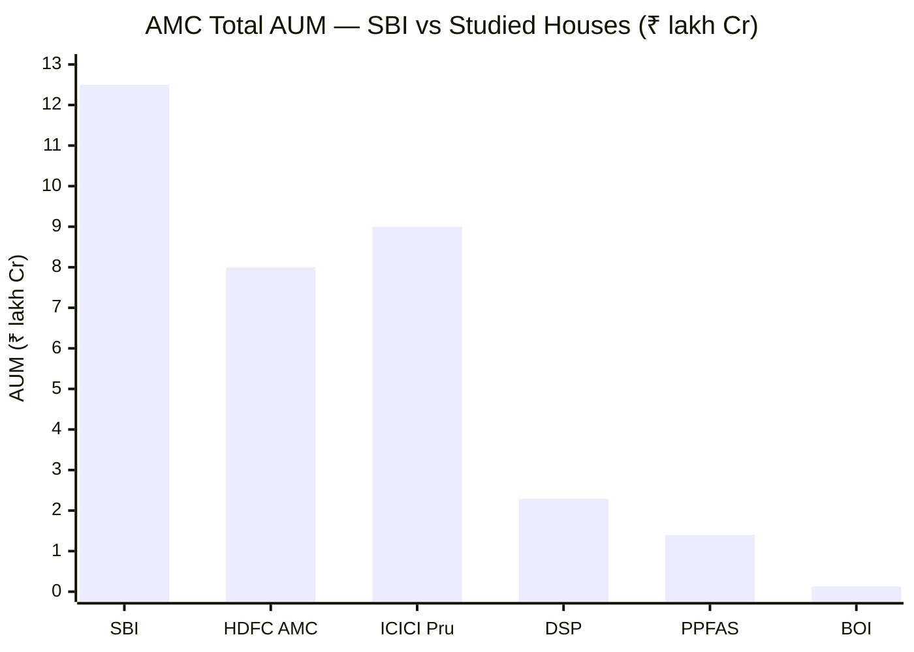
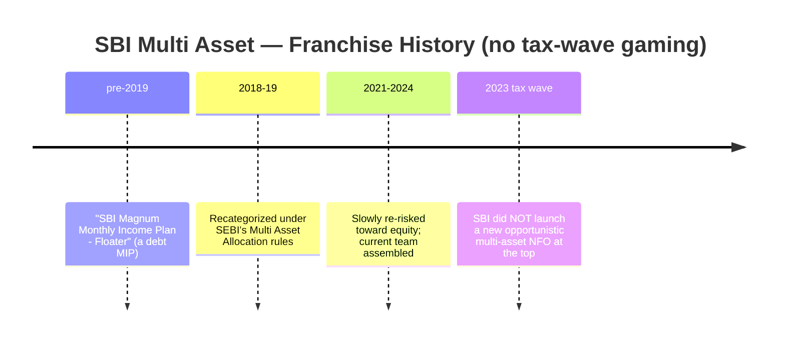
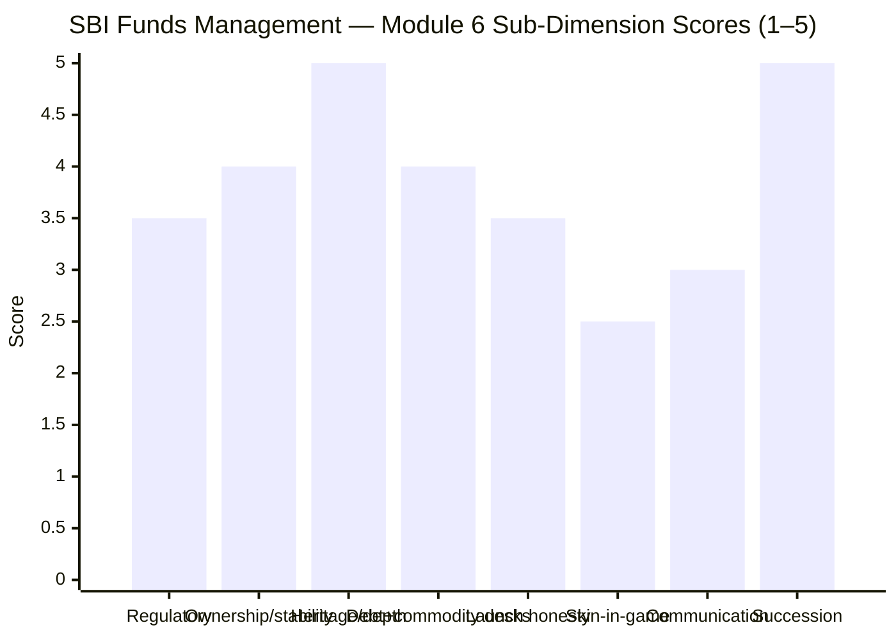

# Module 6: AMC Trustworthiness — SBI Multi Asset Allocation Fund

> **Provisional Module 6 score: ~3.9 / 5** (weight **5%**). **Scores are NOT comparable to the four equity categories.**

> **The one-line context:** the house is the strongest structural asset in the whole SBI Multi Asset case. **SBI Funds Management is India's largest AMC** (~₹12.5 lakh Cr, ~15.4% share), backed by State Bank of India + Amundi (Europe's largest asset manager), **freshly listed (July 2026 IPO)**, with the two desks a multi-asset fund most depends on — **fixed income and gold/commodities** — among the deepest and most credible in India. It also **did not game the 2023 tax-wave launch** (it recategorized an existing fund, rather than opportunistically launching at the top). The debits are mild and typical of a giant PSU-linked house: minor SEBI inspection deficiencies, no skin-in-game disclosure, and only moderate *franchise commitment* to multi-asset specifically. **No prior study covered SBI's AMC — this is a fresh assessment (no carry-forward).**

---

## Fund Identity / Raw Data (web-researched, Jul 2026)

| Attribute | Detail | Source |
|-----------|--------|--------|
| AMC | **SBI Funds Management Ltd** | — |
| Rank / AUM | **#1 AMC in India — ~₹12.5 lakh Cr QAAUM (Dec 2025), ~15.4% share** | Business Standard / ShareScart |
| Ownership (pre-IPO) | **SBI 61.86% · Amundi 36.33%** | RHP / Business Standard |
| **Listing** | **IPO'd Jul 2026** (~₹11,693 Cr, priced ₹574 top-of-band; NSE/BSE ~Jul 21) — SBI + Amundi divested ~10% | Amundi/GlobeNewswire |
| Parents | State Bank of India (India's largest bank; GoI-majority) + **Amundi** (Europe's largest AM, ~€2tn) | — |
| AMC inception | **1987** — one of India's oldest AMCs | SBI MF |
| Regulatory record | **Administrative warnings/deficiencies in SEBI inspections** (MF/PMS/RTA), corrective measures claimed; no major penalty/fraud | IPO RHP risk factors |
| Fixed-income desk | Among the largest/most conservative in India | industry |
| Commodity desk | **SBI Gold ETF** (since 2009 — oldest/largest) + **SBI Silver ETF** | factsheet |
| Skin in the game | Not disclosed (large AMC; SEBI-mandated only) | — |

---

## Cross-Source Verification

| Fact | Sources | Verdict |
|------|---------|---------|
| #1 AMC, ~₹12.5 lakh Cr, 15.4% share | Business Standard, ShareScart, mySIP | ✅ Consistent |
| SBI 61.86% / Amundi 36.33%; Jul-2026 IPO | Amundi disclosures, RHP, Business Standard | ✅ Consistent (primary-source: Amundi/RHP) |
| SEBI inspection deficiencies (minor) | IPO RHP (self-disclosed risk factor) | ✅ Confirmed — disclosed by the company itself |

**Reliability: High.** The ownership and listing facts are from primary sources (Amundi's own disclosures + the IPO RHP). The regulatory characterization is the company's own risk-factor language.

---

## 1. Scale, Heritage & Ownership — the Deepest Institution in the Study

SBI Funds Management is the **largest AMC in India** — bigger than any house in any prior study. What that buys a multi-asset fund specifically:
- **Research + operational depth across every asset class** — equity, a deep fixed-income desk, and a long-standing commodities/ETF franchise, all in-house. A multi-asset fund needs *all three*, and few AMCs have all three at this depth.
- **Rock-solid financial stability** — backed by India's largest bank and Amundi (Europe's largest asset manager, ~€2tn); zero solvency/continuity risk.
- **Amundi's governance** — the 36% foreign partner brings global risk/compliance standards (the DSP-BlackRock parallel), tempering the PSU-parent character.

**The ownership nuance (honest):** SBI is majority government-owned, so SBI MF is ultimately **PSU-linked** — a mild governance consideration (as flagged for BOI in prior studies). But SBI MF is run far more professionally than a typical PSU, Amundi's stake adds global discipline, and the **July-2026 listing** now subjects it to public-market disclosure and scrutiny. Net: the PSU-linkage is a footnote, not a flag.

---

## 2. ⭐ Fixed-Income & Commodity Desk Credibility — the Multi-Asset Import (NEW)

A multi-asset fund is only as good as the *worst* of its asset-class desks. A strong equity AMC with a weak debt desk imports that weakness. SBI is strong on **both** non-equity sleeves — which matters more here than the headline equity reputation.

| Desk | Assessment | Relevance |
|------|------------|-----------|
| **Fixed income (~28% of the book)** | One of India's largest and **historically conservative** debt desks; broadly avoided the category-defining credit blow-ups (IL&FS/DHFL/Franklin-type). M3 found the book reaches modestly into corporate credit (an **Adani Power** debenture) — but within a generally high-grade, credible framework. **A credible desk is running the debt sleeve** | ✅ Strong — resolves part of M2/M3's debt-quality concern |
| **Commodities / gold-silver (~10%)** | **SBI Gold ETF** is one of India's **oldest (2009) and largest** gold ETFs; SBI also runs **SBI Silver ETF**. Deep, proven commodity-ETF capability — physical-backed, low tracking error | ✅ Strong |

> **Retrofit note (mild, favourable):** M2/M3 flagged the debt book's credit quality as "unverified / presumed high-grade." M6 supports the presumption at the *desk* level — SBI's fixed-income franchise is credible and conservative — so the Adani-Power-style corporate-credit reach is a calibrated choice by a competent desk, not a stretch by a weak one. This slightly softens (does not erase) the M2/M3 debt-quality flag.

---

## 3. Launch-Timing Honesty & Franchise Commitment (NEW)

**A genuine positive:** the post-2023 multi-asset boom (driven by the debt-indexation tax change) saw ~27 opportunistic NFOs launched at the top (the screening finding). **SBI did not join that wave** — it simply recategorized and re-risked an existing fund. There is **no launch-timing gaming** here, which is a real governance credit.

**The offsetting debit — moderate franchise commitment:** multi-asset is *not* an SBI flagship. SBI's marquee funds are SBI Contra, SBI Bluechip, SBI Small Cap, etc. This fund was a sleepy MIP for years and gets a secondary-mandate lead (M5). SBI runs it competently and at scale, but it is not a franchise priority — which is consistent with the "well-run but not special" verdict of the whole study.

---

## 4. Regulatory Record — Clean-ish, Not Spotless

| Item | Detail |
|------|--------|
| Major penalties / fraud / front-running | **None** (unlike Quant's active SEBI probe — the shortlist's cautionary contrast) |
| SEBI inspection findings | **Administrative warnings, deficiencies, advisories** across MF/PMS/RTA operations in recent years (self-disclosed in the IPO RHP); corrective measures claimed |
| Verdict | A large, complex AMC with the routine minor inspection findings that scale brings — **no serious governance failure**, but **not the spotless record** of a PPFAS |

For a house running ₹12.5 lakh Cr across hundreds of schemes, minor administrative deficiencies are close to unavoidable and are being disclosed transparently (a listing-driven positive). This is a 3.5-tier regulatory record — clean of anything serious, short of pristine.

---

## 5. Investor Communication, Skin-in-Game, Conduct

| Dimension | Assessment | Score input |
|-----------|------------|-------------|
| Investor communication | Institutional standard — factsheets, manager interviews (Balachandran in VR/press); **no structured quarterly letters** (PPFAS standard) | 3.0 |
| Skin in the game | **Not disclosed** (large AMC; no PPFAS/DSP-style all-employee co-investment policy) | 2.5 |
| Investor-first conduct | No notable investor-first *signature* (no DSP-style flow-gating heroics), but no adverse conduct either; huge retail base via SBI's branch network = broad accountability | 3.0 |
| Succession / stability | **Very high** — deepest institutional bench in the study; a manager or executive exit is fully absorbable | 5.0 |

---

## Comparison with Studied AMCs

| AMC | Module 6 | Character |
|-----|----------|-----------|
| PPFAS | 4.5 | Boutique, aligned, quarterly letters, spotless |
| DSP | 4.3 | 160y heritage, all-employee skin-in-game |
| **SBI Funds Management** | **~3.9** | **India's #1 AMC; strongest debt+commodity desks for multi-asset; no launch-gaming; minor SEBI deficiencies, no skin-in-game, PSU-linked** |
| HDFC AMC | ~3.8 | Large, listed, commercial |
| BOI | 3.3 | Small PSU-backed |
| Quant | 1.25 | Active front-running probe |

SBI ranks near the top of the *large-AMC* tier — its unmatched scale and its **specific strength on the non-equity desks a multi-asset fund depends on** lift it above HDFC here, while the absence of boutique-style alignment (skin-in-game, letters) keeps it below PPFAS/DSP.

---

## Points For / Points Against — AMC

### ✅ For
1. **India's largest AMC** — ₹12.5 lakh Cr, 15.4% share; unmatched research/operational depth across all three asset classes.
2. **Strongest non-equity desks in the study for multi-asset** — a credible, conservative fixed-income desk + the oldest/largest gold-ETF franchise (+ silver).
3. **No 2023 tax-wave launch-gaming** — recategorized an existing fund rather than launching opportunistically at the top.
4. **Rock-solid stability** — SBI + Amundi parents; just listed (Jul 2026) with public-market transparency.
5. **Amundi's global governance** tempers the PSU-parent character.
6. **No serious regulatory failure** — clean of fraud/front-running (the Quant contrast).
7. **Very low succession/continuity risk** — deepest bench in the study.

### ❌ Against
1. **Minor SEBI inspection deficiencies** (MF/PMS/RTA) — clean-ish, not spotless.
2. **No skin-in-game disclosure** — no PPFAS/DSP-style alignment policy.
3. **PSU-linked ownership** — SBI is GoI-majority; a mild governance consideration.
4. **Moderate franchise commitment to multi-asset** — a secondary, historically-sleepy fund, not a flagship.
5. **No structured investor letters / investor-first signature** — communication is average-institutional.
6. **Newly listed** — public-shareholder profit pressure is a (mild) new variable.

---

## Module 6 Scorecard

| Sub-dimension | Score | Reasoning |
|---------------|-------|-----------|
| Regulatory cleanliness | **3.5** | Minor SEBI inspection deficiencies; no fraud/front-running |
| Ownership independence & stability | **4.0** | SBI + Amundi + newly listed; strong & stable, mild PSU-linkage |
| Heritage & institutional depth | **5.0** | India's #1 AMC; unmatched cross-asset depth |
| **Fixed-income + commodity desk credibility** | **4.0** | The multi-asset import — both non-equity desks are strong |
| Launch-timing honesty / franchise | **3.5** | No tax-wave gaming (+), but multi-asset is a secondary franchise (−) |
| Skin in the game | **2.5** | Not disclosed |
| Investor communication / conduct | **3.0** | Institutional standard; no letters, no adverse conduct |
| Succession / continuity | **5.0** | Deepest bench in the study |
| **Module 6 Overall** | **~3.9 / 5** | A top-tier large AMC whose specific strengths (scale + credible debt & commodity desks + no launch-gaming) are exactly what a multi-asset fund needs; held below the boutique leaders by no skin-in-game, minor deficiencies, and PSU-linkage |

---

## Comparative Module 6 Scores (studied funds)

| AMC | Module 6 |
|-----|----------|
| PPFAS | 4.5 |
| DSP | 4.3 |
| **SBI Funds Management** | **~3.9** |
| HDFC AMC | ~3.8 |
| BOI | 3.3 |
| Quant | 1.25 |

---

## ⭐ The Complete Six-Module Picture — M6 as the Closer

With all six modules done, the weighted verdict:

| Module | Topic | Weight | Score | Weighted |
|--------|-------|--------|-------|----------|
| M1 | Returns & Allocation Alpha | 20% | 3.6 | 0.72 |
| M2 | Risk Profile | 25% | 4.5 | 1.125 |
| M3 | Allocation Engine & DNA | 20% | 3.0 | 0.60 |
| M4 | Cost & Tax | 20% | 3.5 | 0.70 |
| M5 | Manager / Team | 10% | 3.2 | 0.32 |
| **M6** | **AMC** | **5%** | **3.9** | **0.195** |
| **TOTAL** | | **100%** | | **≈ 3.66 / 5** |

**The coherent story across six modules:** SBI Multi Asset is a **genuinely low-risk, well-run, cheaply-priced, institution-backed static balanced fund** — elite on the risk axis (M2 4.5), backed by the study's best AMC-desk-fit (M6 3.9) — but with **no active allocation skill** (triangulated across M1/M3/M5), a record that predates its team and mandate, a tax status that is *not* the category's structural trump card (M4), and a ~0.75 correlation to the equity you already own (M2). The AMC is the strong floor under a fund whose active case is thin. Whether ~3.66/5 earns a portfolio slot — versus a DIY gold-ETF-plus-debt-fund, or versus the cheaper/higher-Sharpe shortlist peers (Nippon, Quant, WOC) — is the decision-tree question.

---

## SIP Implication

For a ₹15–20k/month SIP, the AMC is the part of this fund you least need to worry about. SBI Funds Management is India's largest, most stable house, with exactly the cross-asset desk depth a multi-asset fund draws on, and it ran this fund with integrity (no launch-gaming). You are not taking AMC risk. What the strong AMC *cannot* fix is the fund's core limitation the other five modules exposed: it is a well-run static mix, not a skilfully-allocated one. A rock-solid house running an unremarkable strategy is still an unremarkable strategy — safely delivered.

## One-Line Verdict

**The strongest structural piece of the SBI Multi Asset case: India's #1 AMC, uniquely deep on the fixed-income and gold/commodity desks a multi-asset fund lives on, freshly listed, with no launch-timing gaming — held just below the boutique leaders only by no skin-in-game, minor SEBI deficiencies, and PSU-linkage; a rock-solid house safely delivering an unremarkable strategy.**

---

*Module 6 complete. Provisional score 3.9/5. Method: web research (Business Standard, Amundi/GlobeNewswire primary disclosures, IPO RHP, ShareScart). No prior-study carry-forward (SBI's AMC is new to the studies). **Cross-module retrofit (Edelweiss discipline):** M6 mildly *supports* the M2/M3 debt-quality presumption (SBI's fixed-income desk is credible/conservative) and adds favourable context (no tax-wave launch-gaming) — no prior score changes. **Final six-module weighted score ≈ 3.66/5.** All SBI modules complete → next: the fund README (full scorecard, fund-vs-DIY verdict, monitoring/review triggers).*
