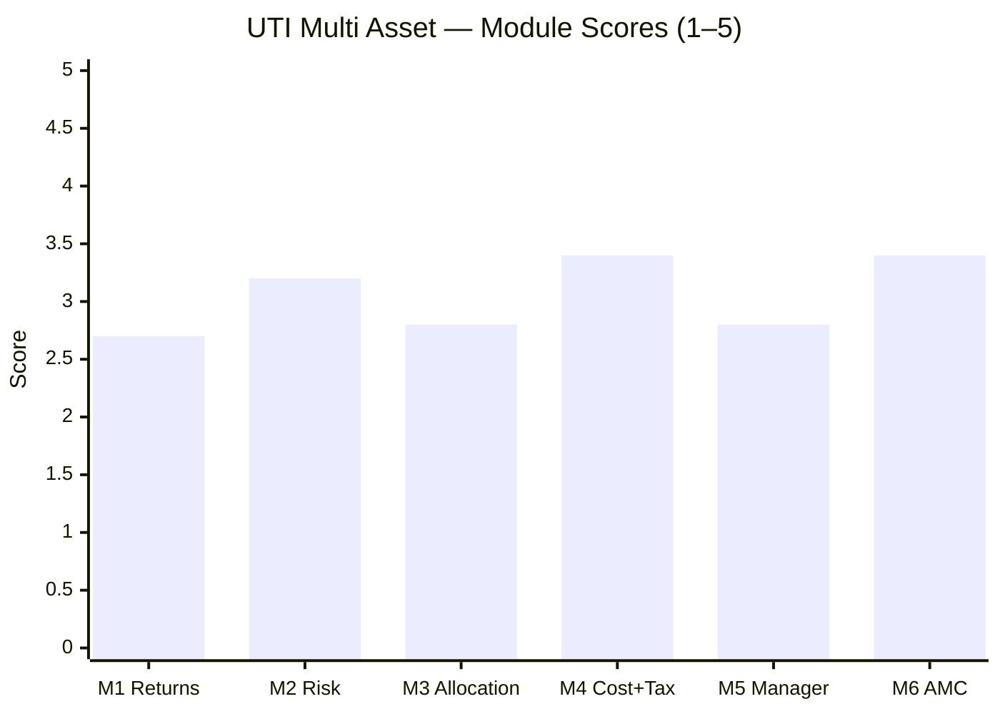

# UTI Multi Asset Allocation Fund — Fund Summary & Verdict

**Direct Plan – Growth · MFAPI 120760 · AUM ₹6,890 Cr · ER ~0.78–0.88% · studied Jul 2026**

> **Final weighted score: ≈ 3.03 / 5 — the weakest of the studied MultiAsset funds** (SBI ≈3.66, Nippon ≈3.71, Quant ≈3.20). A **~70%-equity, honestly-taxed, systematically-run fund whose one job — asset allocation — it has done poorly.** It loses to a naïve DIY basket pre-tax and only *ties* it post-tax on its equity-tax status; it is the weakest dampener and poorest diversifier of the cycle-tested funds; and its marketed "valuation model" is refuted by an 87%-static return signature and the study's clearest allocation error — cutting gold into the 2024–25 boom. There is **no module where UTI leads the set, and two (M1, M3) where it trails badly.**
>
> **⚠ Scores are NOT comparable to the four equity categories** — this fund is measured on a multi-asset re-weight (Risk 25 / Returns 20 / Allocation 20 / Cost+Tax 20 / Manager 10 / AMC 5), against a blended benchmark and a DIY basket, not against a single equity index. **Not investment advice.**

---

## The Six-Module Scorecard

| Module | Topic | Weight | Score | Weighted | One-line |
|--------|-------|--------|-------|----------|----------|
| [M1](module1_returns.md) | Returns & Allocation Alpha | 20% | 2.7 | 0.540 | Negative alpha; loses to DIY on the full record |
| [M2](module2_risk.md) | **Risk Profile** | **25%** | **3.2** | **0.800** | Defensive vs equity, but weakest dampener; 0.81 corr to your equity |
| [M3](module3_allocation.md) | Allocation Engine & DNA | 20% | 2.8 | 0.560 | "Valuation model" refuted; cut gold into its boom |
| [M4](module4_cost_tax.md) | Cost & Tax | 20% | 3.4 | 0.680 | Cleanly equity-taxed — but dearest ER; ties DIY, doesn't beat it |
| [M5](module5_manager.md) | Manager / Team | 10% | 2.8 | 0.280 | Systematic quant desk — but owns the study's worst allocation call |
| [M6](module6_amc.md) | AMC | 5% | 3.4 | 0.170 | Deepest heritage + strong passive desk; but mid-tier, governance-scarred |
| **TOTAL** | | **100%** | | **≈ 3.03** | |

---

## What UTI Multi Asset Actually Is

The labels flatter it; the data does not. Three reframings, each from the analysis:

1. **It is a closet-equity fund with a gold garnish, not a genuine dampener.** At ~70% net equity (M3), its drawdown (−25%) is only ~2.5pp shallower than a plain Aggressive Hybrid that holds *no* gold (M2); its 0.81 correlation to Parag Parikh FlexiCap means two-thirds of what you'd buy, you already own. The gold sleeve barely earns its place.

2. **Its marketed "dynamic valuation model" is refuted by its own returns.** Return-based style analysis (M3) shows **87% of variance is a static equity/debt/gold blend echo** — the highest of any studied fund — and where the model *did* move, it moved wrong: it cut gold from ~21% (2020) to ~7% (2023) **straight into gold's +20%/+72% 2024–25 boom.** That is the documentary mechanism behind M1's worst-in-study gold-year alphas, and it happened on the current team's watch (Goyal era, Nov 2021+, M5).

3. **Its record is one honest, mediocre fund — no flattering era to strip.** Unlike SBI (a debt-MIP past that inflated its low-risk numbers), UTI has been an equity+gold multi-asset fund throughout (M3). So its 10.18% since-inception CAGR, −25% drawdown, and 0.38 Sharpe are the *true* through-cycle record — which makes the weak numbers **more** damning, not less.

---

## The Genuine Strengths

- **Cleanly equity-taxed (M4 — its best module).** At ~70% net equity (≥65% with *no* arbitrage engineering), the whole corpus — gold and debt included — is taxed at equity rates. This is the tax-triad trump card SBI lacked, and it flips UTI's pre-tax DIY *loss* into a thin post-tax *tie*.
- **Defensive versus pure equity, and cycle-proven (M2).** 47% downside capture, −25% vs Nifty's −38% drawdown, with cushioning that worked in 2020, 2022, *and* 2024–25 — the full-cycle record the young `no-2022-data` peers (WOC, ABSL) lack.
- **A recent, genuine equity turnaround (M1).** +30.2% (2023) and +21.9% (2024) — real, and driven by a decent quality large-cap-plus-mid-cap book (M3).
- **Structure-fit AMC desk (M6).** UTI's genuinely strong passive/quant franchise is the very desk running this fund; low key-person risk.

## The Honest Weaknesses

- **Negative allocation alpha (−1.77%/yr) and loses to a DIY basket on the full record (M1)** — the only studied fund its own blended benchmark *and* the DIY counterfactual both beat pre-tax.
- **The weakest dampener and poorest diversifier of the cycle-tested funds (M2)** — deepest drawdown, highest volatility, lowest Sharpe (0.38), a −9.76% worst day, and 0.81 correlation to your equity.
- **Systematically mistimed gold — the study's clearest allocation error (M3/M5)** — cut a booming asset to a near-mandate-minimum right before its biggest run in a decade.
- **The dearest ER of the studied set bar Quant (~0.78–0.88%)** — ~2.6× the DIY basket, for a book that underperforms it (M4).
- **The post-tax DIY "win" is thin and fragile (M4)** — exists only vs a debt-heavy basket; vs an equity-matched DIY mix, UTI loses even post-tax.

---

## The Verdict That Matters: Fund vs DIY

The study's central test (framing fact #2) — should you pay UTI, or assemble the pieces yourself?

| | UTI Multi Asset | DIY (index fund + debt fund + gold ETF, rebalanced annually) |
|---|---|---|
| 10Y pre-tax CAGR | **11.33%** | 11.72% (65/25/10) · 12.71% (70/10/20) |
| 10Y lumpsum post-tax (₹10L) | ~₹27.0L | ~₹26.6–26.9L (65/25/10) · **> UTI** (70/10/20) |
| All-in edge to UTI | **~+₹0.1–0.4L vs the standard basket; LOSES vs an equity-matched one** | — |
| Source of the (thin) edge | **Equity-tax status only** — shields the standard basket's slab-taxed debt leg | — |
| **NOT** the source | Its book (loses pre-tax) or allocation skill (negative) | — |

**UTI *ties* DIY — it does not beat it — and only on tax.** It loses to the DIY basket pre-tax on its full record, and its equity-tax status is just enough to claw back to a rough post-tax tie against a debt-heavy basket. Against a DIY mix matched to UTI's own equity-heavy allocation, it loses even after tax. This is the opposite of a fund earning its (dearest-of-set) fee through performance — the tax status is propping up a book M1–M3 found wanting. **For an investor who wants tax-efficient gold+debt exposure in one wrapper and won't hold the pieces directly, the equity-tax status has real value; for anyone comparing it to the better multi-asset funds or a disciplined DIY basket, UTI pays more, allocates worse, and wins only on a tax status two cheaper peers approximate.**

---

## Where UTI Sits in the Shortlist

UTI is the **fifth of six** funds studied, and lands **last on the weighted score** of the four cycle-tested funds:

| Fund | Score | Character |
|------|-------|-----------|
| Nippon Multi Asset | ≈3.71 | Cheapest, wide DIY win, but bull-market artifact |
| SBI Multi Asset | ≈3.66 | Elite dampener, static book, not equity-taxed |
| Quant Multi Asset | ≈3.20 | Returns leader, equity-like risk, governance cloud |
| **UTI Multi Asset** | **≈3.03** | **Closet-equity, negative allocation alpha, wins only on tax** |

The screening flagged UTI as the **borderline weak-Sharpe pass** (Sharpe 0.36, admitted on 3Y return alone), and the deep study vindicated the flag comprehensively: its competitive trailing 3Y/5Y numbers are a 2023–24 broad-equity windfall, not evidence of an allocation engine. UTI's one distinctive credential — **clean equity taxation** (which SBI/Nippon lack) — is real but narrow, and it is bolted onto the weakest book and the dearest fee of the set. It brings the *least* additive, non-duplicated diversification of the cycle-tested funds to a portfolio that is already ~100% equity.

---

## Monitoring / Review Triggers (if held)

1. **Allocation-model drift toward pure closet-equity** — effective equity is already ~70%; if the model pushes it toward 75–80%, the fund becomes an expensive large-cap fund with a gold token. Watch the trailing factsheets.
2. **Gold sizing** — the fund's defining failure was cutting gold into its boom (~21%→7%). Watch whether the model rebuilds a meaningful (>12%) gold sleeve or keeps starving it.
3. **Debt-sleeve mandate margin** — debt sits at ~10–13%, right at the SEBI ≥10%-per-class floor; a further trim risks breaching the multi-asset mandate (and could shift the tax tier).
4. **Equity-tax continuity** — net equity ~70% is comfortably above 65%, so status is secure; but re-check on any large de-risking or budget change.
5. **Manager/team** — Goyal (quant/passive lead) leaving would remove the systematic anchor; the commodity seat is already a junior (Kulthia). Watch for further team thinning after Sunil Patil's 2024 exit.
6. **AMC governance/fee** — UTI's fragmented PSU ownership and "decade of underperformance" turnaround under CEO Vetri Subramaniam; watch that the dear ~0.78–0.88% ER doesn't drift up and that governance stays stable.

---

## One-Line Verdict

**The weakest of the studied MultiAsset funds (≈3.03/5): a ~70%-equity closet fund with negative allocation alpha that loses to a naïve DIY basket pre-tax and only ties it post-tax on its one genuine edge — clean equity taxation — while carrying the dearest ER of the set, the poorest diversification, and the study's clearest allocation error (cutting gold into its 2024–25 boom); competent structure and an honest tax status cannot rescue a fund that does its one job, asset allocation, poorly.**

---

*Fund README complete. All six modules + README done (Jul 31 2026). Final weighted score ≈ 3.03/5. Method: MFAPI self-computation (scheme 120760, 3,340 NAVs) + return-based style analysis (R² 86.8%) + factsheet/web backfill (Groww, ValueResearch, UTI SID, Business Standard). Fifth of six shortlist funds; **finishes last of the four cycle-tested funds.** Feeds the decision tree (sleeve question, fund-vs-DIY, sub-type choice — UTI is the equity-oriented sub-type's weakest case). Next fund: Aditya Birla SL Multi Asset (no-2022-data).*
