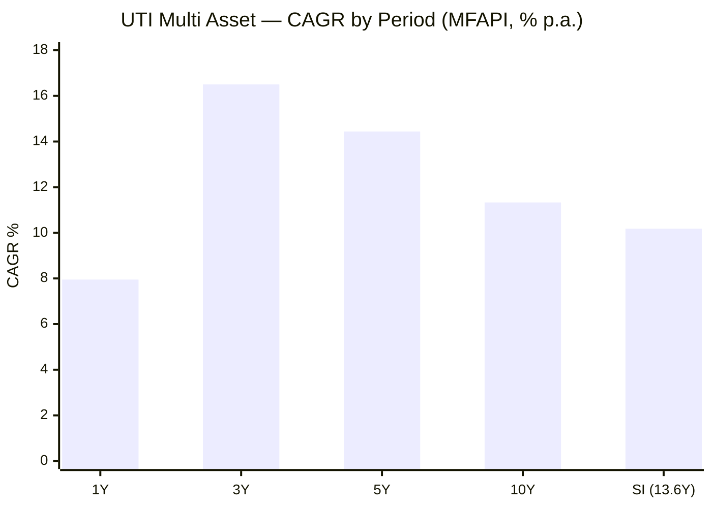
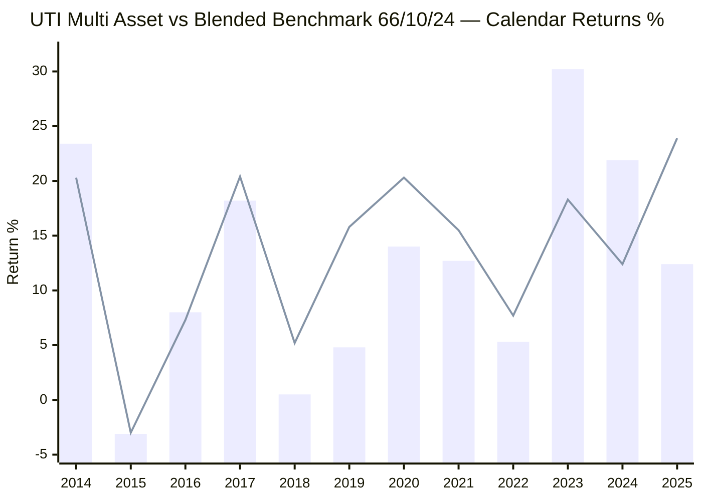
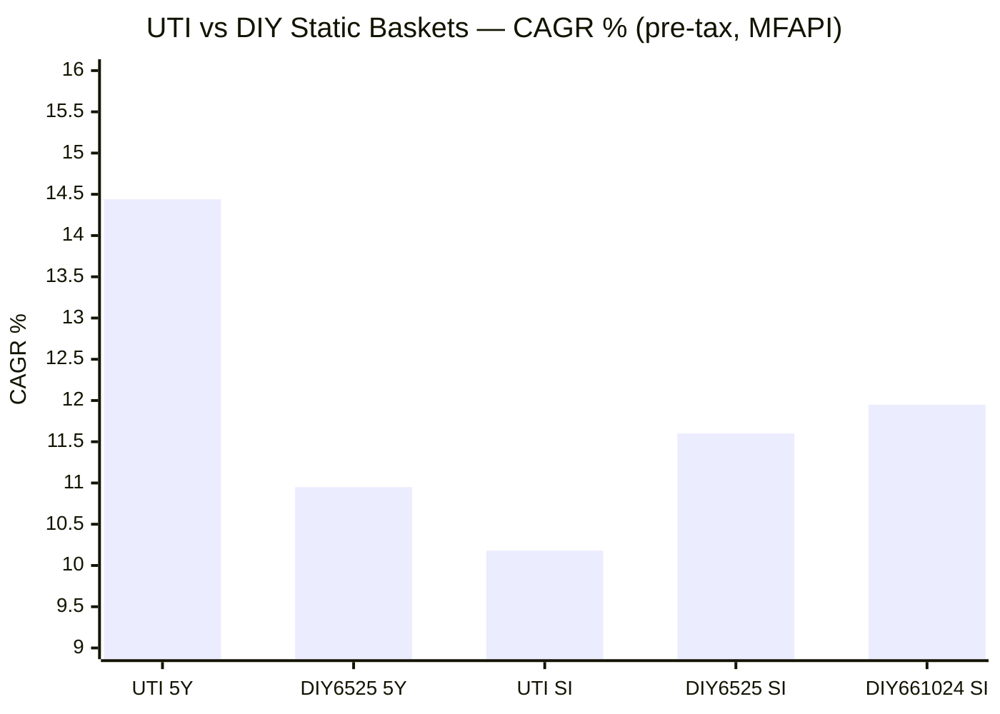
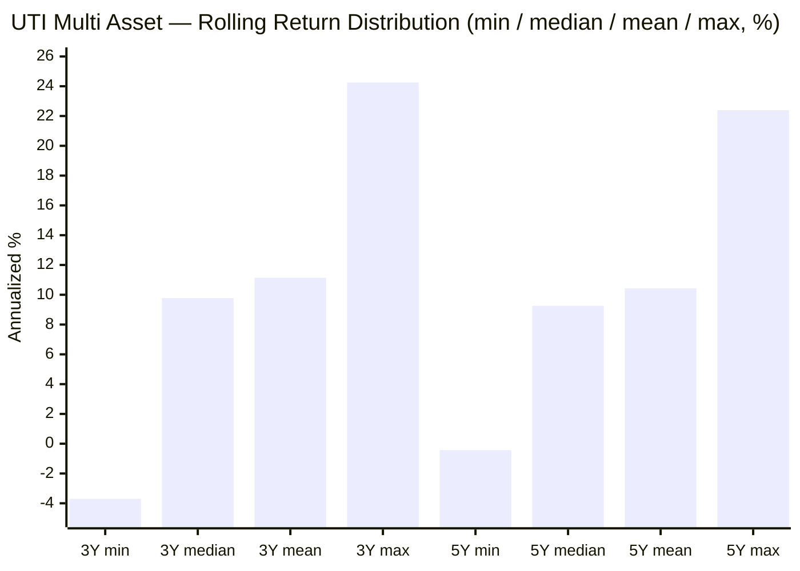
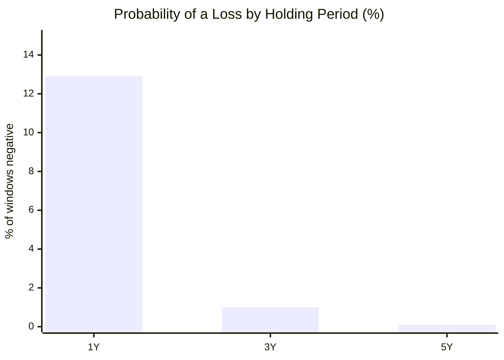
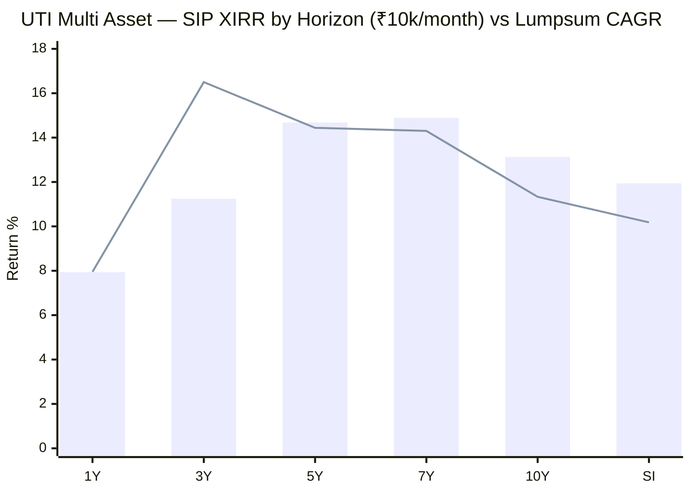
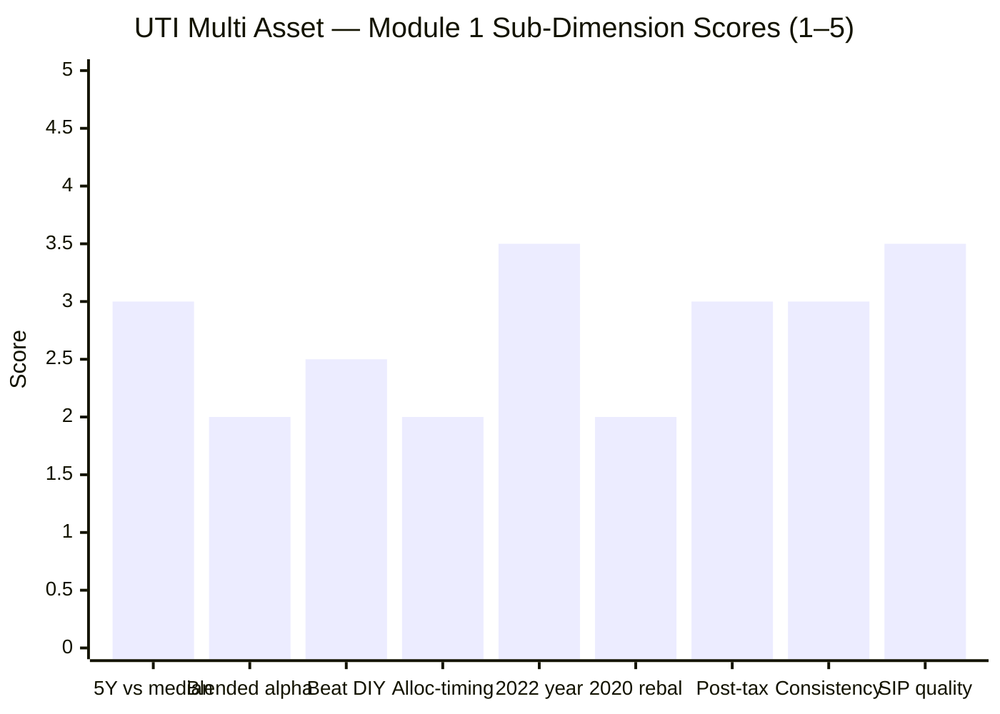

# Module 1: Returns & Allocation Alpha — UTI Multi Asset Allocation Fund

> **Provisional Module 1 score: ~2.7 / 5** (weight 20% in the multi-asset re-weight). **Scores in this study are NOT directly comparable to the four equity categories** — the module measures a risk-reduction product against a *blended* benchmark and a DIY basket, not a single equity index against peers.

> **The one-line context:** the weakest returns profile of any fund studied so far — and the first to **fail the two existential tests outright.** Over its full 13.6-year Direct record UTI compounded at just **10.18%/yr** (lowest of the studied MultiAsset funds), **lost to its own blended benchmark by −1.77%/yr** (the only negative-alpha fund in the study), and **lost to a naïve static DIY 65/25/10 basket by −1.42%/yr pre-tax** — the counterfactual it is supposed to beat. It also carries the **worst drawdown (−25%) and highest volatility (10.4%)** of the studied set, i.e. it dampens the least. What rescues its *screening* numbers is a genuine **2023–24 turnaround** (+30.2% then +21.9%) that lifts the trailing 3Y/5Y — but that turnaround is broad-equity beta, not allocation skill, and it flatters a fund whose through-cycle record is poor. This is the **borderline weak-Sharpe pass** (screening Sharpe 0.36) confirmed on the returns axis.

---

## Fund Identity

| Attribute | Detail | Source |
|-----------|--------|--------|
| Full name | UTI Multi Asset Allocation Fund — Direct Plan — Growth | AMFI / MFAPI |
| AMC | UTI Asset Management Co. Ltd | — |
| MFAPI scheme code | **120760** | api.mfapi.in/mf/120760 |
| Direct-plan NAV history | **02 Jan 2013 → 30 Jul 2026 (13.57y, 3,340 NAVs)** | MFAPI computed |
| Regular-plan lineage | Older than Direct (Reg code 111599); the "Multi Asset Allocation" label predates the 2018 SEBI category definition — the fund was reconstituted/renamed into the current mandate (confirm the transition + strategy overhaul date in **M3/M5**) | Groww/VR (to confirm) |
| Stated benchmark | Tickertape lists **BSE 200 TRI** — a *pure large-cap equity* index. **Not an honest multi-asset benchmark** (see §Benchmark critique) | Tickertape / SID |
| Net equity (screening) | 66.4% · Debt 10.4% · Gold+cash+arb ~23.1% | Tickertape API, Jul 2026 |
| Taxation status | Likely **equity-taxed** — net equity 66.4% is already above 65% before any arbitrage top-up, so the ≥65% *gross*-equity test is very probably met (confirm mechanism in **M4**). This is the one structural point in UTI's favour | screening + SID (deferred to M4) |
| AUM / ER | ₹6,890 Cr / **0.88% (Direct)** — the dearest of the studied MultiAsset funds so far (SBI 0.74, Nippon 0.43) | Tickertape, Jul 2026 |
| Manager(s) | Full assessment → **M5.** The trailing-vs-SI split (below) strongly implies a **strategy/manager change ~2021–2023** — whose record is the good part is an open M5 question | to confirm (factsheet) |
| Study flag | Cycle-tested (163mo cap) — **has full 2020 AND 2022 data** (no `no-2022-data` flag); **no inception-bias discount applies** | — |

> **Strategic asset allocation** (the stated SAA) and **net-vs-gross equity** are factsheet/SID items scored in **M3**. Module 1 uses the *observed* ~66/10/24 (equity/debt/gold+cash) mix to construct the primary blended benchmark, and tests robustness against alternative weights.

---

## Raw Data (MFAPI-computed + Tickertape screening, as of 30-Jul-2026)

| Metric | Value | Source |
|--------|-------|--------|
| CAGR 1Y | **7.95%** | MFAPI computed |
| CAGR 3Y | **16.50%** | MFAPI computed |
| CAGR 5Y | **14.44%** | MFAPI computed |
| CAGR 10Y | **11.33%** | MFAPI computed |
| CAGR since inception (13.6Y) | **10.18%** | MFAPI computed |
| 3M / 6M absolute | +2.43% / −1.97% | MFAPI computed |
| Annualized volatility (daily, SI) | **10.39%** | MFAPI computed |
| Max drawdown (SI) | **−25.02%** (COVID) | MFAPI computed |
| Rolling 3Y: mean / median / min | 11.14% / 9.78% / **−3.70%** | MFAPI (2,603 windows) |
| Rolling 5Y: mean / median / min | 10.44% / 9.26% / **−0.43%** | MFAPI (2,110 windows) |
| Prob. of loss 1Y / 3Y / 5Y | **12.9% / 1.0% / 0.1%** | MFAPI |
| 10Y SIP XIRR (₹10k/mo) | **13.13%** (₹12.1L → ₹24.12L) | MFAPI, Newton-Raphson |
| Blended-benchmark alpha (SI, vs 66/10/24) | **−1.77%/yr** | MFAPI computed |
| Screening: 5Y / 3Y / Sharpe / stdDev | 14.4% / 16.5% / **0.36** / 11.4% | Tickertape, Jul 2026 |

---

## Cross-Source Verification

| Metric | MFAPI computed | Tickertape | Verdict |
|--------|----------------|-----------|---------|
| 5Y CAGR | 14.44% | 14.4% | ✅ Confirmed |
| 3Y CAGR | 16.50% | 16.5% | ✅ Confirmed |
| 1Y CAGR | 7.95% | 7.6% | ✅ Confirmed (±0.4) |
| Volatility | 10.39% (daily, SI) | 11.4% (3–5Y stdDev) | ✅ Broadly agree — and both are **high for the category** (~2× SBI's 6.6%, above the 8–11% "good" band); UTI behaves closer to an aggressive hybrid than a dampener |
| Sharpe | ~0.43 (SI, rf 6%) | **0.36** | ⚠️ Both **low** — the lowest of the studied MultiAsset funds; the screening flag was justified, full treatment in M2 |
| Sortino | ~0.59 (SI) | 0.04 (Tickertape scale) | Tickertape's Sortino is on its own non-standard scale (same quirk flagged for other funds); MFAPI value carried to M2 |
| **Alpha (Tickertape)** | — | — | **Ignored — meaningless here.** Tickertape computes alpha vs **BSE 200 TRI**, a 100%-equity index. For a 66%-equity/34%-non-equity fund that is not a real benchmark. The blended benchmark below replaces it |

**Data reliability: High.** 3,340 NAVs from Direct-plan inception (02-Jan-2013); trailing figures reconcile with Tickertape within ±0.4pp. All CAGR/rolling/drawdown/SIP figures are self-computed from the raw NAV series. Blended-benchmark and DIY legs use the **same index funds as the SBI/Nippon studies** (Nifty 50 index 120620, SBI Gold 119788, ICICI All Seasons Bond 120603), so cross-fund comparisons are apples-to-apples.

---

## CAGR — the Ladder and What It Says

| Period | CAGR | Read |
|--------|------|------|
| 1Y | 7.95% | Soft — a weak equity tape (Nifty 50 −6.3% CY-to-date); the non-equity sleeves are carrying it |
| 3Y | 16.50% | The strong window — the 2023 (+30.2%) and 2024 (+21.9%) turnaround years dominate it |
| 5Y | 14.44% | Above the SI — the post-2021 broad-equity + gold run flattered the recent window |
| 10Y | 11.33% | The steady-state number begins to reveal the weakness |
| **SI (13.6Y)** | **10.18%** | **The number that matters — and the lowest of any studied MultiAsset fund** (SBI 12.4%, Nippon 18.3%, Quant era 26%) |

**Interpretation — a rising ladder is the tell.** UTI's CAGR *rises* from SI (10.18%) toward 3Y (16.50%): the fund was mediocre for roughly its first eight years and turned sharply better around 2022–2023. This is the **opposite** of a stable compounder — it means the trailing 3Y/5Y numbers the screen relied on describe a *different regime* than the fund's long history. Two readings are possible and must be resolved in M5: (a) a **genuine strategy/team upgrade** (the fund now allocates better), or (b) a **broad-equity beta windfall** (2023–24 was a mid/small-cap year; a more equity-heavy book simply rode it). The calendar and alpha evidence below point firmly to (b). Either way, at 10.18% SI *with 10.4% volatility*, UTI delivered **less compounding than SBI at nearly double the risk** — the worst returns-for-risk trade in the studied set.

---

## Calendar-Year Returns — UTI vs the Blended Benchmark and its Legs

*MFAPI-computed. Blend = 66% Nifty 50 (equity) / 10% ICICI All Seasons Bond (debt) / 24% SBI Gold (gold), daily-rebalanced — UTI's observed mix. Legs shown to expose what drove each year.*

> Bar = UTI · Line = blended benchmark 66/10/24

| Year | UTI | Blend | Alpha | Nifty50 | Gold | Debt | What happened |
|------|-----|-------|-------|---------|------|------|---------------|
| 2013 | −3.8 | +4.0 | **−7.8** | +6.8 | −6.8 | +9.5 | Partial year from Jan inception; poor start |
| 2014 | +23.4 | +20.3 | **+3.1** | +33.0 | −9.8 | +19.6 | Equity bull; UTI beat the gold-dragged blend but trailed a Nifty-heavy basket (+24.9) |
| 2015 | −3.1 | −3.0 | −0.1 | −3.2 | −7.7 | +6.4 | Equity & gold both fell; UTI fell with them — **no cushioning** |
| 2016 | +8.0 | +7.3 | +0.7 | +4.0 | +10.5 | +17.8 | Gold + debt led; roughly matched |
| 2017 | +18.2 | +20.4 | **−2.2** | +29.2 | +3.9 | +5.8 | Equity bull — lagged the blend |
| 2018 | +0.5 | +5.2 | **−4.7** | +3.8 | +6.9 | +7.0 | Weak; gold/debt did the work but UTI captured almost none of it |
| **2019** | +4.8 | +15.8 | **−11.0** | +13.3 | +23.3 | +10.9 | **Gold ripped +23%, equity +13% — UTI made just +4.8%. The single worst allocation year of any studied fund** |
| **2020** | +14.0 | +20.3 | **−6.3** | +15.7 | +27.9 | +12.5 | COVID: gold rallied hard — UTI **badly under-harvested** it and took a −25% drawdown en route |
| 2021 | +12.7 | +15.5 | **−2.8** | +25.2 | −5.3 | +5.1 | Equity bull, gold down — still lagged |
| **2022** | +5.3 | +7.7 | **−2.4** | +5.4 | +13.0 | +5.3 | **The all-diverge year — UTI stayed positive (+5.3) but lagged its own blend; gold's +13% was under-captured again** |
| **2023** | +30.2 | +18.3 | **+11.9** | +21.0 | +14.4 | +8.3 | **The turnaround — UTI +30.2 vs a Nifty-50 blend of +18.3; broad-market (mid/small) equity year** |
| 2024 | +21.9 | +12.4 | **+9.5** | +9.7 | +19.9 | +9.0 | The other strong year — big beat, again broad-equity driven while gold also helped |
| 2025 | +12.4 | +23.9 | **−11.4** | +11.6 | **+71.9** | +7.9 | **Gold's monster +71.9% year — UTI captured a fraction; the −11.4 alpha mirrors 2019** |
| 2026 YTD | −0.1 | −1.7 | +1.5 | −6.3 | +6.7 | +3.6 | Equity soft; gold/debt holding it up |

**The honest pattern — the alpha is negative, and the wins are broad-equity beta, not allocation skill:**
- UTI **lagged its blended benchmark in every single year gold mattered** — 2018, **2019 (−11.0)**, 2020 (−6.3), 2022 (−2.4), and **2025 (−11.4)**. In the two biggest gold years in the dataset (2019, 2025) it produced the **two worst allocation-alpha readings of any fund in the study.** For a product whose gold sleeve is supposed to be the point, this is the most damaging single finding in the module.
- Its **only** large positive years (**2023 +11.9, 2024 +9.5**) are precisely the **broad-market equity years** a Nifty-50 blend cannot capture — the fingerprint of a **more-aggressive-than-average equity book**, not tactical asset allocation. The "turnaround" is equity-style beta.
- Net: the good calls and the bad calls do **not** cancel to zero — they cancel to **negative** (SI alpha −1.77%/yr). UTI is the only studied fund that its own blended benchmark beats.

---

## The Blended-Benchmark Alpha — Negative, and Robustness-Tested

Because there is no single index (framing fact #1), alpha is measured against a constructed blend. UTI's SI alpha is **−1.77%/yr** vs its observed 66/10/24 mix. Is that an artifact of the chosen weights? Testing alternatives (multi-proxy robustness):

| Blend (Eq/Debt/Gold) | SI CAGR | UTI SI − Blend |
|----------------------|---------|-----------------|
| **UTI (fund)** | **10.18%** | — |
| 66 / 10 / 24 (own-mix proxy) | 11.95% | **−1.77%** |
| 70 / 10 / 20 | 11.94% | **−1.76%** |
| 65 / 15 / 20 | 11.84% | **−1.66%** |
| 65 / 25 / 10 (study-plan DIY standard) | 11.60% | **−1.42%** |

**The negative alpha is not a weight-choice artifact — it survives every reasonable blend at −1.4% to −1.8%/yr.** A passive investor holding *any* of these static index baskets would have beaten UTI over its full life. This is the inverse of SBI (whose +0.72% survived robustness) and light-years from Nippon (+3.85%) and Quant (+10.7%). Two caveats, applied symmetrically:
1. The equity leg is **Nifty 50**; UTI's real equity book is multi-cap, so part of its **positive** 2023–24 alpha is equity-*style* beta a Nifty-50 blend can't see — which means UTI's *allocation* skill is **even worse** than the headline −1.77% suggests, because the number is *helped* by uncounted equity beta.
2. No long-history Nifty 500 / BSE 500 index fund exists to use as the equity leg — a genuine data limitation, flagged (same as SBI/Nippon).

### Allocation-vs-selection & asset-class attribution (directional; full split needs M3 factsheet weights)
- **Allocation timing is actively negative; equity selection is the only positive contributor.** UTI *lagged* the static blend in every gold-relevant year and *beat* it only in broad-equity years — the reverse of what a skilled multi-asset allocator should produce. There is **no evidence of good asset-class timing** anywhere in 13.6 years; the fund appears to have sat over-weight equity and under-weight gold structurally, harvesting neither the 2019 nor 2025 gold surges.
- **Asset-class contribution by era:** equity was the swing factor throughout; gold — the biggest single-leg contributor available (2019 +23%, 2020 +28%, 2025 +72%) — was **systematically under-captured**; debt (10% weight) was too small to matter. A precise per-year attribution (weight × leg return) is reconstructed in **M3** from factsheet weights.

---

## Benchmark Appropriateness Critique (framing fact #1)

UTI's self-selected benchmark is **BSE 200 TRI** — a **pure large-cap equity index with zero debt or gold.** This is *not* an honest multi-asset benchmark:
- It **penalises** the fund in equity bull years (a 66%-equity fund cannot keep pace with 100% equity) and **flatters** it in equity bear years — so any "alpha vs BSE 200 TRI" swings entirely with the equity regime and says nothing about allocation skill.
- Tickertape's alpha (computed against it) is therefore **meaningless** for this fund and is discarded.
- The choice is arguably the *least* gamed of the flattering options (a fund could pick a debt-heavy index to look good) — but it is still the wrong tool. The **blended 66/10/24 benchmark** built here is the honest yardstick, and by that yardstick UTI is **behind**.

---

## The DIY-Basket Test — Does the Fund Beat "Do It Yourself"? (framing fact #2)

The sharper question than "beat a benchmark" is **"why pay UTI 0.88% instead of assembling equity + debt + gold yourself and rebalancing once a year?"**

| Basket | 5Y CAGR | SI CAGR | UTI edge (SI) |
|--------|---------|---------|----------------|
| **UTI Multi Asset** | **14.44%** | **10.18%** | — |
| DIY 65/25/10 (study-plan standard) | 10.95% | 11.60% | **−1.42%/yr** |
| DIY 66/10/24 (own-mix) | 13.27% | 11.95% | **−1.77%/yr** |
| DIY 70/10/20 | 12.71% | 11.94% | **−1.76%/yr** |

**The verdict splits by window, and the honest read is damning on the record that matters:**
- **Over its full 13.6-year life, UTI LOSES to every DIY static basket** by −1.4% to −1.8%/yr, pre-tax and before its own 0.88% fee. This is the **existential failure** the DIY test is designed to catch: a naïve investor rebalancing an index basket annually would have beaten the active fund, and kept the fee.
- **Over the trailing 5Y, UTI beats DIY** (+3.5%/yr vs the 65/25/10 standard) — but this is **entirely the 2023–24 turnaround**, the same broad-equity windfall that flatters every trailing number. Extend the window and the edge inverts. A 5Y-only reader would reach the opposite (and wrong) conclusion — which is precisely how a weak fund passes a trailing-return screen.

**Post-tax — the one place UTI has a structural argument (deferred to M4, framed here):**
- UTI's net equity (66.4%) is **already above 65% before arbitrage**, so it is very probably **equity-taxed** (12.5% LTCG on the whole corpus, gold+debt included). That is a real, permanent edge over a DIY basket whose debt leg is slab-taxed and whose gold leg is debt-taxed post-Apr-2023, plus the annual DIY rebalance realising taxable gains.
- **But the tax shield cannot rescue a −1.4%/yr pre-tax deficit over the full record.** The equity-tax advantage over DIY is worth (order-of-magnitude) ~0.5–1.0%/yr for a high-bracket investor — enough to *narrow* the SI gap, not close it. Only on the trailing 5Y (where UTI is already ahead pre-tax) does the shield make the fund comfortably better than DIY. **M4 quantifies this; M1's finding is that the pre-tax base case is a loss.**

---

## Rolling Returns — Consistency Is Merely "OK," Not Elite

*2,603 rolling 3Y windows and 2,110 rolling 5Y windows, daily, full Direct history.*

| Window | Min | Median | Mean | Max | % ≥ 8% | % ≥ 10% | **% negative** |
|--------|-----|--------|------|-----|--------|---------|----------------|
| 3Y | **−3.70%** | 9.78% | 11.14% | 24.25% | 65% | 48% | **1.0%** |
| 5Y | **−0.43%** | 9.26% | 10.44% | 22.39% | 70% | 39% | **0.1%** |
| 1Y | **−20.14%** (min) | — | — | — | — | — | **12.9%** |

**The consistency is real but second-rate for the category.** Over 13.6 years:
- **3Y windows went negative 1.0% of the time** (worst −3.70%) — vs **SBI's 0.0%** (worst *+*1.30%). UTI has produced losing 3-year holds; SBI never has.
- **5Y windows dipped just below zero** (worst −0.43%) — again worse than SBI's +4.89% floor.
- **1Y windows were negative 12.9% of the time**, worst **−20.14%** — vs SBI's 0.4% / −7.05%. A UTI investor could very plausibly have seen a −20% year and a red multi-year stretch.

This is still **categorically safer than an equity fund** (DSP SmallCap: 7.5% of 3Y windows negative, worst −12.6%) — so on the "keep the SIP-investor invested" axis UTI does *something*. But it is the **weakest loss-avoidance record of the studied MultiAsset funds**, consistent with its high volatility and closet-equity tilt. The dampening is partial.

### Probability of loss by holding period

---

## Max Drawdown & Recovery (return-side view; full risk in M2)

| Event | Peak | Trough | Depth | Recovery |
|-------|------|--------|-------|----------|
| **COVID (2020)** | 19 Feb 2020 | 23 Mar 2020 | **−25.02%** | 23 Jul 2020 (**122 days**) |

The worst drawdown in 13.6 years was **−25.0%** — recovered in **four months**, but **materially deeper than SBI's −17.6%** over the same COVID event, because UTI carried far more equity and under-harvested the gold rally that cushioned SBI. On the returns axis the drawdown didn't permanently dent compounding (only 1% of 3Y windows went red), but −25% is a **real dampening failure for a multi-asset fund** — it drew down like an aggressive hybrid, not a diversifier. Full drawdown ledger, downside capture, the 2022 test, and the **Sep-2024→Mar-2025 correction (UTI −9.5% vs Nifty 50 −15.3%, gold +12.3% — a ~60% capture, moderate)** are M2; the returns takeaway is that UTI's cushioning is thin.

---

## SIP XIRR vs Lumpsum — ₹10,000/month

> Bar = SIP XIRR · Line = lumpsum CAGR (matched horizon)

| Horizon | SIP XIRR | Invested | Corpus |
|---------|----------|----------|--------|
| 3Y | 11.25% | ₹3.70L | ₹4.40L |
| 5Y | 14.68% | ₹6.10L | ₹8.86L |
| 7Y | 14.89% | ₹8.50L | ₹14.53L |
| **10Y** | **13.13%** | **₹12.10L** | **₹24.12L** |
| SI (13.6Y) | 11.94% | ₹16.30L | ₹38.74L |

A 10-year ₹10k/month SIP roughly **doubles** the capital (₹12.1L → ₹24.1L) at 13.1% XIRR — a decent outcome, and the SIP XIRR *exceeds* the lumpsum SI CAGR because the systematic buying front-loaded the weak early years and captured the 2023–24 surge. Note this is the flip side of the rising-ladder problem: **a lump-sum investor at inception earned only 10.18%**, while a disciplined SIP did better by averaging into the turnaround. The SIP and lumpsum lines diverge more than SBI's (UTI's higher volatility gives rupee-cost-averaging more to exploit) — the one place its higher risk pays a small dividend.

---

## Comparison with Studied Funds — the Laggard of the Set

| Metric | **UTI Multi Asset** | SBI Multi Asset | Nippon Multi Asset | Quant Multi Asset |
|--------|---------------------|-----------------|--------------------|--------------------|
| SI / long-run CAGR | **10.18%** (13.6Y) | 12.42% (13.4Y) | 18.28% (5.9Y) | ~16% blended / 26% era |
| Volatility (SI) | **10.39%** | 6.59% | ~11% | ~15% (era) |
| Max drawdown | **−25.0%** | −17.6% | (bull-only) | −32.6% |
| Blended-benchmark alpha | **−1.77%/yr** | +0.72%/yr | +3.85%/yr | +10.7 to +13.8%/yr |
| Beat DIY basket (pre-tax, SI) | **No (−1.42%/yr)** | Yes (+0.46%) | Yes (+4.8%) | Yes (huge) |
| Worst 3Y rolling | **−3.70%** | +1.30% | positive | (era) |
| % negative 3Y windows | **1.0%** | 0.0% | ~0% (short) | higher |
| Provisional M1 score | **~2.7** | ~3.6 | ~4.1 | ~4.3 |

**The correct read:** on every returns-and-allocation axis that matters, UTI ranks **last** of the four funds studied. It compounds the least, at the second-highest volatility, with the deepest drawdown, the only negative alpha, and the only DIY-basket loss on the full record. Its trailing 3Y/5Y numbers — which won it the borderline screening pass — are a **2023–24 broad-equity artifact**, not evidence of a good allocation engine. The one genuine positive is the probable equity-tax status (→ M4). Whether any of this earns a portfolio slot is the decision-tree question, but Module 1's contribution is unambiguous: **as a returns-and-allocation proposition, UTI is the weakest of the shortlist.**

---

## Points For / Points Against — Returns

### ✅ For
1. **A real 2023–24 turnaround** — +30.2% then +21.9%, lifting the trailing 3Y (16.50%) and 5Y (14.44%) to competitive, above-median levels.
2. **Beats the DIY basket on the trailing 5Y** (+3.5%/yr vs 65/25/10) — the recent regime made it look good, and for a 5-year-forward investor that window is not irrelevant.
3. **Probably equity-taxed** (net equity 66.4% > 65% before arbitrage) — a structural post-tax edge over a DIY basket, the one place UTI has an argument (→ M4).
4. **Fully cycle-tested** — 13.6 years spanning 2020 *and* 2022; no `no-2022-data` flag and **no inception-bias discount** (unlike WOC/ABSL/DSP).
5. **SIP outcome decent and better than its lump-sum** — 10Y ₹12.1L → ₹24.1L at 13.1% XIRR; averaging into the weak early years paid off.
6. **Consistency still beats any equity fund** — 1% negative 3Y windows vs DSP SmallCap's 7.5%; it does *some* dampening.

### ❌ Against
1. **Negative blended-benchmark alpha (−1.77%/yr SI)** — the **only** studied fund its own blend beats; robust across every weighting (−1.4% to −1.8%).
2. **Loses to the DIY static basket on the full record (−1.42%/yr pre-tax)** — fails the existential "why pay a fund?" test on 13.6 years; the 5Y win is a regime artifact that inverts over longer windows.
3. **Lowest SI CAGR of the studied set (10.18%) at the second-highest volatility (10.4%)** — the worst returns-for-risk trade studied.
4. **Systematically under-harvested gold** — lagged the blend in every gold year, with the **two worst allocation-alpha readings in the entire study** (2019 −11.0, 2025 −11.4); actively poor asset-class timing.
5. **Deepest drawdown of the studied MultiAsset funds (−25%)** — drew down like an aggressive hybrid in 2020, not a dampener; closet-equity behaviour.
6. **The rising CAGR ladder is a warning, not a feature** — trailing numbers describe a recent, equity-favourable regime; the through-cycle record is poor and the "turnaround" is broad-equity beta, not allocation skill (confirm the strategy/manager change in M5).
7. **Dearest ER of the studied funds (0.88%)** for the weakest returns — the fee case is the hardest here (→ M4).

---

## Module 1 Scorecard

| Sub-dimension | Score | Reasoning |
|---------------|-------|-----------|
| 5Y CAGR vs category median | **3.0** | 14.44% ≈ at/just below the cycle-tested median (~15%) — middle, and only because of the 2023–24 lift |
| Alpha vs blended benchmark | **2.0** | **−1.77%/yr**, robust to weights — the only negative-alpha fund studied (guide: negative = 2) |
| Beat the DIY static basket | **2.5** | **Loses on the full record (−1.42%/yr pre-tax)**; wins only on the regime-flattered 5Y — fails the test that matters |
| Allocation-timing contribution | **2.0** | Actively negative; the two worst gold-year lags in the study (2019, 2025); no timing skill in 13.6 years |
| 2022 asset-divergence year | **3.5** | +5.3%, stayed clearly positive while equity wobbled — but lagged its own blend (−2.4) and under-captured gold |
| 2020 rebalancing behaviour | **2.0** | Under-harvested the gold rally (+14.0 vs blend +20.3) *and* took a −25% drawdown — the worst 2020 of the studied set |
| Post-tax return | **3.0** | Probable equity-tax status is a genuine edge over DIY, but can't close the pre-tax SI deficit — provisional (→ M4) |
| Consistency (rolling / loss-avoidance) | **3.0** | 1.0% negative 3Y, 12.9% negative 1Y (worst −20%) — beats equity, but the weakest of the MultiAsset funds |
| SIP XIRR quality | **3.5** | 10Y 13.13%, ₹12.1L→₹24.1L; better than its lump-sum, but built on the recent regime |
| **Module 1 Overall** | **~2.7 / 5** | Fails both existential tests (negative alpha, loses to DIY on the record); weakest returns-and-allocation profile of the shortlist. The equity-tax status and a genuine-but-late turnaround keep it off the floor. Not comparable to equity-category Module 1 scores |

---

## Comparative Module 1 Scores (studied funds)

| Fund | Module 1 | Character |
|------|----------|-----------|
| Quant Multi Asset | ~4.3 / 5 | Enormous alpha, regime-dependent, equity-like risk |
| Nippon Multi Asset | ~4.1 / 5 | Large edge, cheap, but a bull-market artifact |
| SBI Multi Asset | ~3.6 / 5 | Elite consistency, modest magnitude, thin lumpy +alpha |
| **UTI Multi Asset** | **~2.7 / 5** | **Negative alpha, loses to DIY on the record; a broad-equity turnaround flatters the trailing numbers** |

> Different weightings, same category. UTI's 2.7 places it clearly last of the four studied: it is the only fund whose blended benchmark and DIY basket both beat it over the full record, and its "recovery" is equity beta rather than allocation skill.

---

## SIP Implication

For a ₹15–20k/month SIP over 7–10+ years, UTI Multi Asset's returns profile offers a **decent recent outcome built on a weak foundation.** A 10-year SIP would have returned ~13% XIRR and roughly doubled the capital — but that number leans entirely on the 2023–24 broad-equity surge, and the fund's *through-cycle* character (10.2% SI, −25% drawdown, negative allocation alpha) is the weakest of the studied set. Crucially, an investor could simply have **bought a static 65/25/10 index basket, rebalanced annually, and beaten UTI over its full life** while keeping the 0.88% fee — the DIY counterfactual UTI is meant to defeat, and doesn't. The only structural argument in its favour is the probable **equity-tax status** (→ M4), which narrows but does not close the DIY gap. Module 1's verdict is narrow and honest: **UTI reliably dampens *relative to pure equity*, but as an active multi-asset proposition it neither out-allocates a naïve basket nor earns its fee — its recent strength is a regime windfall, not evidence of skill.**

## One-Line Verdict

**The laggard of the shortlist — the only studied fund with negative allocation alpha (−1.77%/yr) that *loses to a naïve DIY basket over its full 13.6-year record*, carrying the deepest drawdown (−25%) and highest volatility of the set; its competitive trailing 3Y/5Y are a 2023–24 broad-equity turnaround, not allocation skill, and its systematic failure to harvest gold (worst 2019 and 2025 alpha in the study) is exactly the opposite of what a multi-asset fund is paid to do.**

---

*Module 1 complete. Provisional score 2.7/5. Method: self-computed from MFAPI scheme 120760 (3,340 NAVs, 02-Jan-2013 → 30-Jul-2026); blended benchmark & DIY baskets built from Nifty 50 index (120620), SBI Gold (119788), ICICI All Seasons Bond (120603) — the same legs used for SBI/Nippon, so cross-fund figures are directly comparable. **Cross-module handoffs:** the strategy/manager-change hypothesis behind the rising CAGR ladder and the 2023–24 turnaround → **M5** (whose record is the good part?) + M3 (equity-book DNA); the pivotal **equity-tax status / post-tax DIY edge** → **M4**; the −25% drawdown, downside capture, 2022/2024–25 cushioning, and correlation-to-existing-sleeves → **M2**; the systematic gold under-harvesting → M3 (allocation engine) + M5 (allocation calls). No earlier module to retrofit (first module written for this fund).*

*Next: [Module 2 — Risk Profile](module2_risk.md)*
