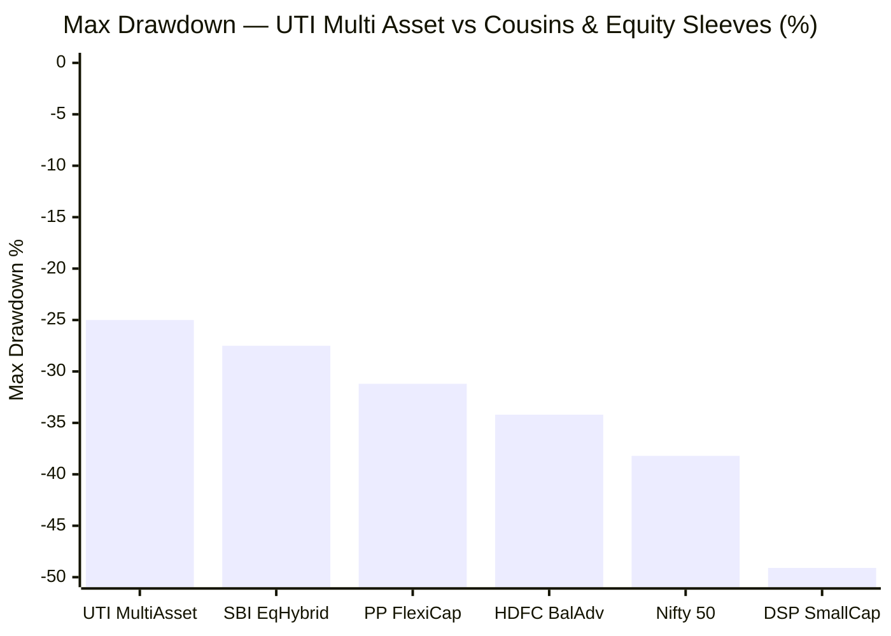
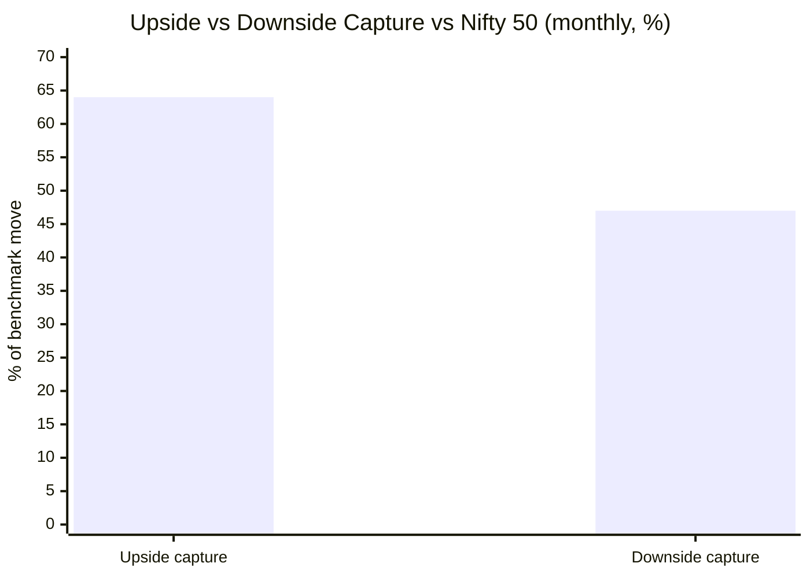
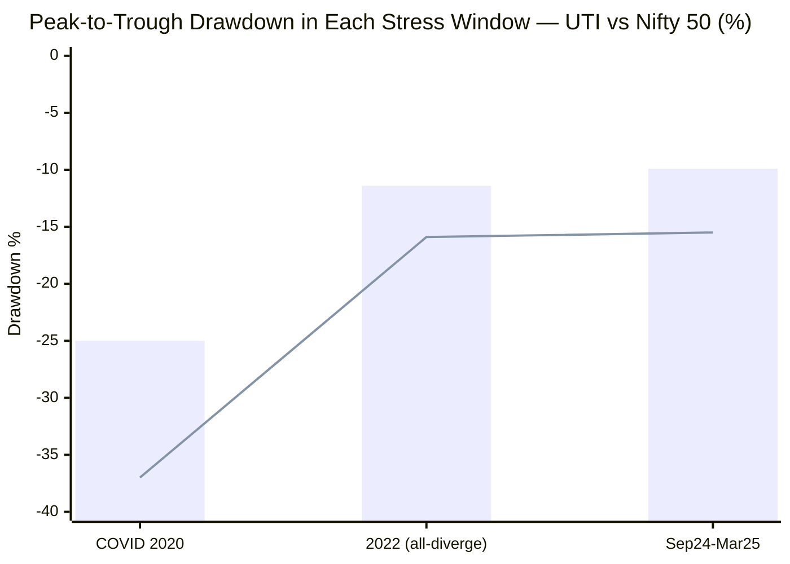
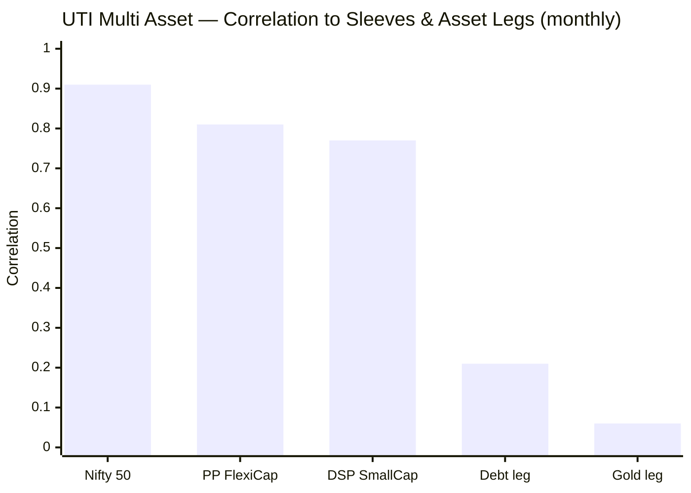
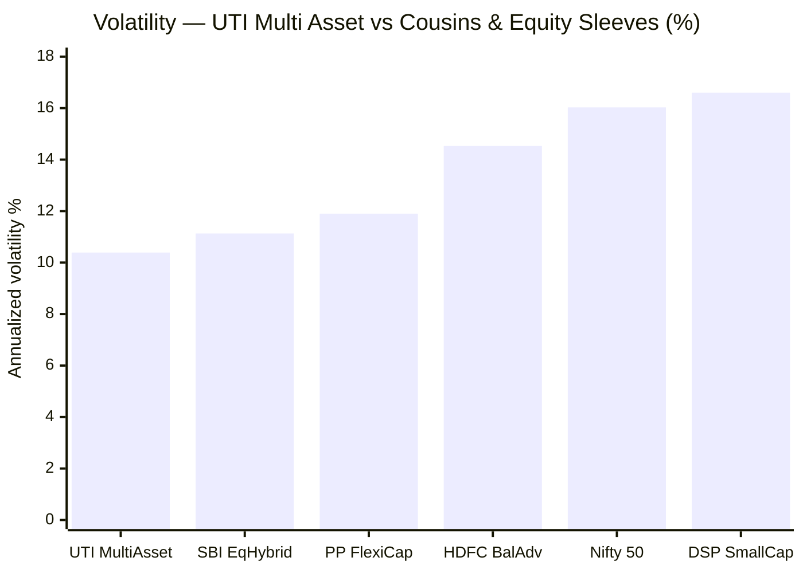
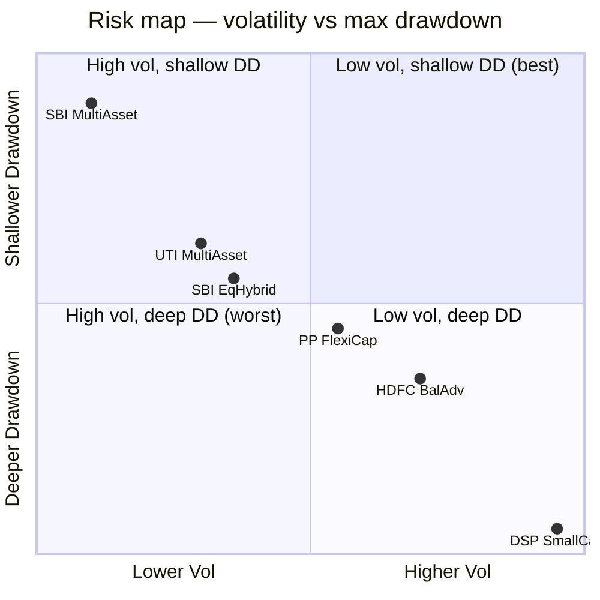
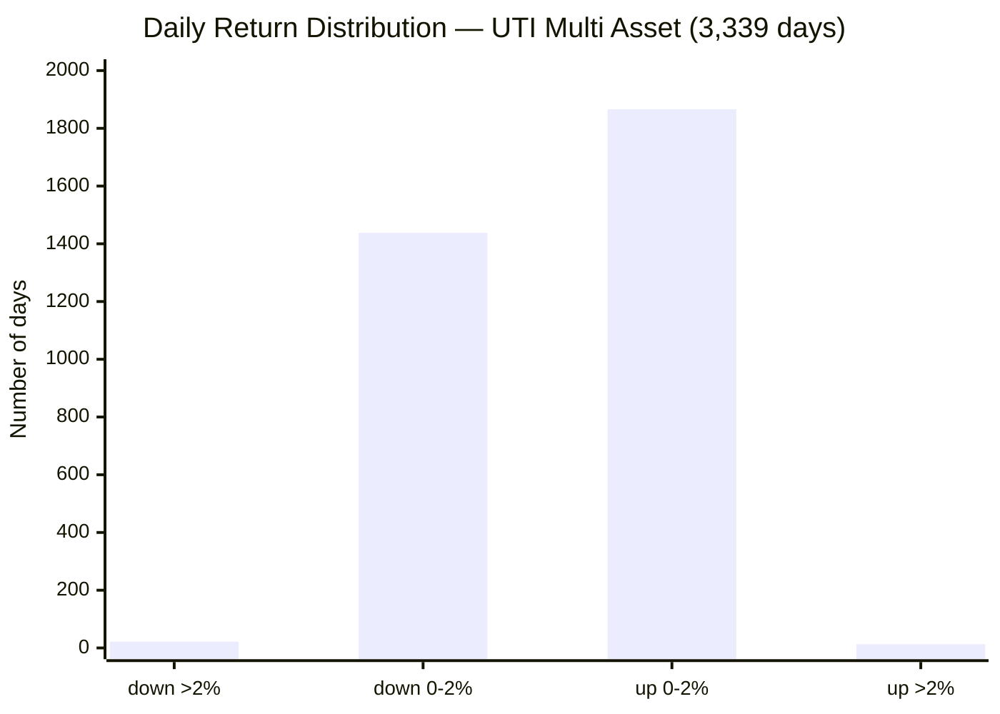
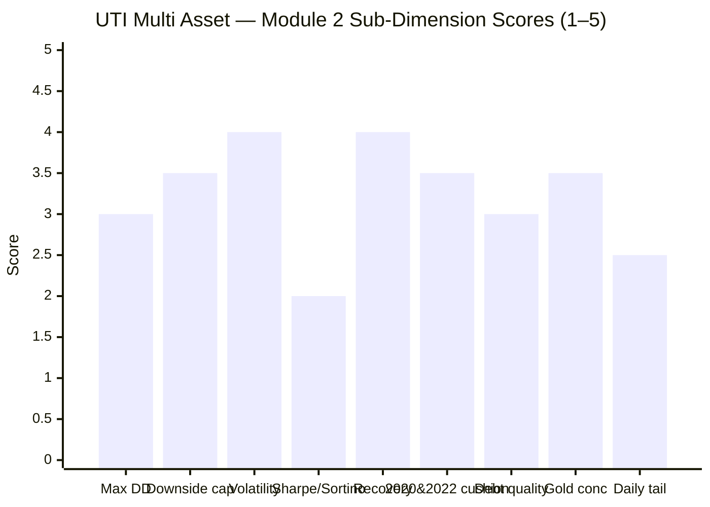

# Module 2: Risk Profile — UTI Multi Asset Allocation Fund

> **Provisional Module 2 score: ~3.2 / 5** (weight **25%** — the top weight in the multi-asset re-weight, because a risk-reduction product lives or dies here). **Scores are NOT comparable to the four equity categories** — this fund is judged on how much it *dampens*, not how much it returns.

> **The one-line context:** this is the module that exposes what UTI really is — **an aggressive-hybrid with a gold garnish, not a genuine dampener.** It *is* defensive versus pure equity (47% downside capture, −25% worst drawdown vs Nifty's −38%, cushioning proven in 2020/2022/2024–25) — so it clears the category's absolute risk bar. But on every relative measure it is the **weakest risk profile of the cycle-tested MultiAsset funds**: the deepest drawdown (−25%), highest volatility (10.4%), lowest Sharpe (0.38), a −9.76% worst day, and — the decisive finding — a **0.81–0.91 correlation to the very equity funds the portfolio already owns.** Its gold sleeve barely earns its place: it dampens only ~2.5pp more than a plain equity-debt hybrid that holds *no* gold. The screening's weak-Sharpe flag is comprehensively vindicated here.

---

## Fund Identity / Raw Data (MFAPI-computed + Tickertape, as of 30-Jul-2026)

| Metric | Value | Source |
|--------|-------|--------|
| MFAPI scheme code | 120760 (3,339 daily returns) | api.mfapi.in/mf/120760 |
| **Volatility (annualized, daily SI)** | **10.39%** | MFAPI computed |
| **Max drawdown (SI)** | **−25.02%** (COVID) | MFAPI computed |
| **Downside capture vs Nifty 50** | **47%** | MFAPI (67 down-months) |
| Upside capture vs Nifty 50 | 64% | MFAPI (95 up-months) |
| **Beta vs Nifty 50 (monthly)** | **0.59** | MFAPI computed |
| Sharpe (daily SI, rf 6.5%) | **0.38** | MFAPI computed |
| Sortino (daily SI, rf 6.5%) | **0.53** | MFAPI computed |
| Calmar (SI CAGR ÷ max DD) | **0.41** | MFAPI computed |
| Correlation to Nifty 50 / PP FlexiCap / DSP SmallCap | **0.91 / 0.81 / 0.77** | MFAPI (monthly, ~158–162m) |
| Correlation to Gold / Debt legs | **0.06 / 0.21** | MFAPI computed |
| Worst / best day | **−9.76%** / +6.85% | MFAPI computed |
| Daily VaR (95%) | −0.98% | MFAPI computed |
| Screening cross-refs | **Sharpe 0.36** · stdDev 11.4% | Tickertape, Jul 2026 |
| Debt-book duration/credit; net-vs-gross equity | **factsheet — deferred to M3/M4** | SID (not in API) |

---

## Cross-Source Verification

| Metric | MFAPI computed | Tickertape | Verdict |
|--------|----------------|-----------|---------|
| Sharpe | 0.38 | **0.36** | ✅ Confirmed — both **low**, the lowest of the studied MultiAsset funds; the borderline screening pass is vindicated |
| Volatility | 10.39% (daily SI) | 11.4% (3–5Y stdDev) | ✅ Broadly agree; both put UTI at the **top of the "good" 8–11% band, edging toward closet-equity** |
| Sortino | 0.53 (daily SI) | 0.04 (Tickertape scale) | Tickertape's Sortino is on its own non-standard scale (flagged for every fund); MFAPI value carried forward |
| Max drawdown | −25.02% | premium-gated | Self-computed from NAV — the deepest of the studied set |
| Downside capture | 47% | not published | The category's decisive metric — self-computed; ~6× SBI's 8% |

**Reliability: High.** All figures self-computed from 3,340 NAVs (Jan 2013 → Jul 2026). Correlations use 158–162 overlapping monthly returns vs each sleeve. Same benchmark/leg/cousin codes as the SBI and Nippon modules, so all cross-fund figures are directly comparable.

---

## 1. Max Drawdown & the Drawdown Ledger — Deeper Than It Should Be

| Drawdown | Peak → Trough | Depth | Duration | Recovery |
|----------|---------------|-------|----------|----------|
| **COVID 2020** | 19 Feb → 23 Mar 2020 | **−25.02%** | 33 days | 122 days |
| **2015–16 slowdown** | 28 Jan 2015 → 11 Feb 2016 | −15.83% | 379 days | 165 days |
| **2013 taper-tantrum** | 03 Jan → 26 Jun 2013 | −13.03% | 174 days | 287 days |
| **2022 rate-shock / all-diverge** | 17 Jan → 20 Jun 2022 | −11.44% | 154 days | 57 days |
| **Current (2026)** | 29 Jan → 23 Mar 2026 | −11.03% | 53 days | **not yet recovered** |
| 2024–25 correction | 26 Sep 2024 → 28 Feb 2025 | −9.94% | 155 days | 101 days |

**Four drawdowns in 13.6 years exceeded −11%** — a very different ledger from SBI (which had *one* >−10% event in 13.4 years). UTI's −25% COVID trough is the deepest of the studied MultiAsset funds and reflects its high equity load: it drew down like a conservative-equity fund, not a dampener. **Honesty note:** the fund is *currently* in an unrecovered −11.03% drawdown (since Jan 2026) — the second-deepest in its history, worth stating plainly. Recoveries on the major events are reasonably fast (COVID 122 days, 2022 just 57 days), but the *early* episodes (2013, 2015–16) took 9–10 months to recover — the fund was riskier and slower in its first half.

---

## 2. Downside Capture — Defensive vs Pure Equity, Weakest of the Set

| Measure | UTI | SBI (ref) | Read |
|---------|-----|-----------|------|
| **Downside capture** | **47%** | 8% | In down-Nifty months UTI falls ~47% of the index's fall — beats the category's <65% target, but ~6× SBI |
| Upside capture | 64% | 42% | Higher participation — the flip side of holding more equity |
| Beta vs Nifty 50 | 0.59 | 0.32 | Nearly double SBI's — meaningfully equity-sensitive |
| Capture asymmetry | **~1.4×** | ~5.3× | 64/47 — only mildly downside-protective |

**The honest read:** a 47% downside capture *does* clear the category's absolute bar (target <65%), so UTI is genuinely defensive relative to owning pure equity. But the **asymmetry is only ~1.4×** (vs SBI's ~5.3×) — meaning UTI participates in downdrafts almost as much as it participates in rallies. It is defensive by *degree*, not by *design*: the protection comes from holding ~34% non-equity, and it is the mildest of the studied cycle-tested funds. A 0.59 beta confirms it — this book moves with the equity market well over half for one.

---

## 3. Realised Cushioning — Real, but Roughly Half of SBI's in Every Regime (Tier-1)

The test the product exists to pass: in each stress event, did gold + debt actually cushion the equity fall?

> Bar = UTI · Line = Nifty 50

| Event | UTI | Nifty 50 | Cushion | SBI cushion (ref) | What cushioned |
|-------|-----|----------|---------|-------------------|----------------|
| **COVID 2020** | −25.0% | −37.0% | **+12.0pp** | +20.6pp | Debt (−2.5% only) + gold; but the high equity load meant a −25% hole |
| **2022 — the all-diverge year** | −11.4% | −15.9% | **+4.5pp** | +8.4pp | Gold (only −8% in the window, +13% for the year) did the work while debt was flat — but UTI under-held gold, so the cushion was thin |
| **Sep 2024 – Mar 2025** | −9.9% | −15.5% | **+5.6pp** | +9.3pp | Gold at highs (+12% CY) + debt; passed, but again half of SBI's cushion |

**Verdict: the cushioning is genuine and cycle-proven — UTI has the full 2020 *and* 2022 record the young `no-2022-data` funds (WOC, ABSL) lack — but it is consistently about *half* as effective as SBI's in every single regime.** The reason is structural and ties directly to M1: UTI carries ~66% equity and *systematically under-harvested gold* (the two worst gold-year alphas in the study were UTI's, 2019 and 2025). So when the cushion was most needed, there was less of it. The product works; it just works weakly.

---

## 4. Correlation to the Existing Sleeves — the Decisive Decision-Tree Number (Tier-1)

The portfolio is already ~100% equity (FlexiCap + MidCap + SmallCap + International). The only reason to add UTI is *non-equity it lacks*. So: how correlated is it to what you own?

| vs | Correlation | R² | Read |
|----|-------------|----|------|
| Nifty 50 | 0.91 | 82% | Very high — moves almost with the index |
| **PP FlexiCap** (the core) | **0.81** | **65%** | **Two-thirds of UTI's variance is explained by the FlexiCap core you already hold** |
| **DSP SmallCap** (the satellite) | **0.77** | 60% | ~40% independent |
| Debt leg | 0.21 | 4% | Near-uncorrelated — a real diversifier |
| Gold leg | 0.06 | 0% | Essentially uncorrelated — the real diversifier |

**This is the module's most important honest finding, and it is worse than SBI's.** UTI is a **weak partial diversifier**:
- Its **0.81 correlation to PP FlexiCap (R² 65%)** is materially higher than SBI's 0.73 — because ~66% of UTI *is* equity, much of it large-cap overlapping what PP already holds. Two-thirds of what you'd be buying, you already own.
- The genuine decorrelation comes *only* from the **gold (0.06) and debt (0.21) slices** — and UTI holds less of those than SBI, and under-harvests the gold it does hold.
- **The decision-tree implication is sharper than for SBI:** if you already own PP FlexiCap + DSP SmallCap, adding UTI mostly adds *more equity beta* plus a thin gold/debt garnish. A **gold ETF + a short-duration debt fund held directly** would deliver the decorrelating slice more cheaply and without paying 0.88% for equity you already have. *(Per the checklist, correlation is informational — it feeds the decision tree, not the fund's own risk score — but for UTI it is damning.)*

---

## 5. Volatility, Sharpe, Sortino, Calmar

| Metric | UTI | Reference | Read |
|--------|-----|-----------|------|
| Volatility | **10.39%** | SBI 6.59% · equity ~16% | Top of the "good" 8–11% band; only marginally below an Aggressive Hybrid (11.1%) |
| **Sharpe (rf 6.5%)** | **0.38** | shortlist median 0.86 | **Well below median — the weakest risk-adjusted profile of the studied set** |
| Sortino | **0.53** | SBI 1.51 | Downside-adjusted return is poor; the low Sharpe is not a volatility artifact |
| Calmar (SI) | **0.41** | SBI 0.71 | 10.2% CAGR per 25% max pain — the weakest |
| Calmar (3Y / 5Y) | 1.50 / 1.26 | — | Strong on recent windows — the 2023–24 turnaround again (M1); regime-flattered |

**The Sharpe is the story.** At 0.38 (confirming Tickertape's 0.36), UTI's risk-adjusted return is roughly **40% of SBI's** and the lowest of every cycle-tested fund. Sortino 0.53 confirms it is not a vol artifact — the fund genuinely delivered thin return *for* its risk over the full record. The only flattering numbers are the 3Y/5Y Calmars (1.50/1.26), which — exactly as in M1 — are the recent broad-equity turnaround dressed up as risk efficiency. Extend the window and the risk-adjusted profile collapses.

---

## 6. Cousin-Category Comparison — Barely Beats an Aggressive Hybrid (NEW dimension)

Multi-asset's true peers are Balanced Advantage / DAAF, Aggressive Hybrid, and Equity Savings. The test: does UTI dampen *more* than these for the equity it holds? **This is where the gold sleeve must justify itself — and largely fails to.**

| Fund (category) | Vol | Max DD | Read |
|-----------------|-----|--------|------|
| **SBI Multi Asset** | 6.59% | −17.6% | The genuine dampener — a different risk animal |
| **UTI Multi Asset** | **10.39%** | **−25.0%** | Only marginally safer than an Aggressive Hybrid |
| SBI Equity Hybrid (Aggressive Hybrid — **no gold**) | 11.13% | **−27.5%** | UTI beats it by just **~2.5pp of drawdown** despite holding a whole gold sleeve |
| HDFC Balanced Advantage (BAF/DAAF) | 14.53% | −34.2% | Flexes equity 30–80% — riskier |
| PP FlexiCap (equity) | 11.90% | −31.2% | UTI's ~0.81-correlated core |

**The most damaging comparison in the module:** UTI's drawdown (−25.0%) is only **~2.5pp shallower than a plain Aggressive Hybrid that holds no gold at all** (SBI Equity Hybrid, −27.5%), and its volatility (10.4%) is barely below it (11.1%). A multi-asset fund's *entire structural advantage* over an aggressive hybrid is the third asset class (gold) — and UTI's gold sleeve is delivering almost none of that advantage, because it is small and under-harvested. On a pure risk basis, an investor gets ~90% of UTI's dampening from an ordinary aggressive hybrid. The gold garnish is nearly cosmetic.

---

## 7. Multi-Asset-Specific Risks (NEW dimensions)

| Risk | Assessment | Status |
|------|------------|--------|
| **Debt-sleeve duration + credit** | Debt is only **~10%** of the book (screening) — too small to be a major risk vector, and **no credit event is visible in the NAV** (2022's −11.4% max DD is equity-driven, not a debt blowup). Duration/credit tiers unverified → M3. A small sleeve, low concern | ⚠ M3 (low materiality) |
| **Gold/metals-concentration risk** | The ~23% "other" sleeve (gold+cash+arb) is **not over-leaned** — if anything UTI *under-holds* and *under-harvests* gold (the M1 finding: worst gold-year alphas of the study). The risk here is the opposite of over-concentration: **too little gold to cushion.** Exact gold % → M3 | ✅ under-, not over-leaning |
| **Equity-taxation continuity risk** | Net equity **66.4%** — already above 65% before any arbitrage top-up, so equity taxation is very probably secure with a **comfortable buffer** (unlike SBI's 46.8%, which is arbitrage-dependent). Low continuity risk. Confirmed in M4 | ✅ low risk (M4) |
| Redemption / liquidity-spiral risk | **N/A — LOW.** The book is large-cap equity + gold ETF + high-grade debt, all liquid; no small-cap redemption spiral concern | ✅ N/A |
| No structural buffer | **Present but thin** — the buffer (gold + debt) exists and demonstrably worked (§3), but at ~34% of the book and under-harvested, it is a *weak* buffer, not the robust one SBI carries | ⚠ thin |

> **Note — the tax/risk trade-off is inverted vs SBI.** UTI's higher equity load is its risk *weakness* (M2) but its tax *strength* (M4): the same 66% equity that makes it a poor dampener makes its equity-tax status rock-solid. SBI is the mirror image. This tension is central to the decision tree.

---

## 8. Daily Distribution — A Notably Rougher Ride Than SBI

| Metric | Value | SBI (ref) |
|--------|-------|-----------|
| Positive days | 1,878 (56.2%) | 60.5% |
| Days down > 2% | **22** (in 13.6 years) | 9 |
| Days up > 2% | 13 | 6 |
| **Worst day** | **−9.76%** (COVID) | −5.18% |
| Best day | +6.85% | +4.17% |
| Daily VaR (95%) | −0.98% | — |

**A −9.76% single day** — nearly double SBI's worst (−5.18%) and approaching equity territory — plus 22 down->2% days (vs SBI's 9). The daily experience is meaningfully rougher: a UTI investor *felt* the COVID crash almost like an equity holder. For a product whose behavioural value is "calm enough that you don't sell," this is a real weakness — the ride is choppier than a dampener's should be.

---

## Comparison with Studied Funds

| Metric | SBI Multi Asset | Nippon Multi Asset | **UTI Multi Asset** | Quant Multi Asset |
|--------|-----------------|--------------------|--------------------|--------------------|
| Volatility | 6.59% | ~11% | **10.39%** | ~15% |
| Max drawdown | −17.6% | (bull-only) | **−25.0%** | −32.6% |
| Downside capture | 8% | ~55% | **47%** | high |
| Beta (vs Nifty 50) | 0.32 | ~0.55 | **0.59** | high |
| Sharpe (SI) | 0.94 | 0.88 | **0.38** | 1.52 (return-driven) |
| Correlation to PP FlexiCap | 0.73 | ~0.78 | **0.81** | ~0.7 |
| 2022 cushioning | +8.4pp | +? (had 2022) | **+4.5pp** | ~0 (none) |
| **Module 2 score** | **~4.5** | **~3.6** | **~3.2** | **~2.6** |

**UTI ranks third of four on the risk axis** — ahead of Quant (which had equity-level −32.6% drawdowns and *no* 2022 cushioning) but clearly behind SBI and Nippon. It is genuinely defensive versus pure equity and cycle-proven, which keeps it respectable; but it is the **poorest diversifier** (highest equity correlation) and the **weakest dampener per unit of the gold sleeve it carries**. On the 25%-weighted thesis module, that is a meaningful mark against it.

---

## Points For / Points Against — Risk

### ✅ For
1. **Genuinely defensive vs pure equity** — 47% downside capture, 0.59 beta, −25% worst drawdown vs Nifty's −38%; it clears the category's absolute risk bar.
2. **Cushioning is real and cycle-proven** — positive in 2020, 2022 (+4.5pp), and 2024–25 (+5.6pp); it has the full 2020 *and* 2022 record that WOC/ABSL lack.
3. **Volatility 10.4%** — still ~two-thirds of an equity fund and inside the acceptable band.
4. **Fast recoveries on the major events** — COVID 122 days, 2022 just 57 days.
5. **Rock-solid equity-tax status** — 66.4% net equity sits comfortably above 65% with a buffer, unlike SBI's arbitrage-dependent 46.8% (a risk *strength* here, cashed in M4).
6. **Gold is under-leaned, not over-leaned** — no gold-concentration blow-up risk.

### ❌ Against
1. **The poorest diversifier of the cycle-tested funds** — 0.81 correlation to PP FlexiCap (R² 65%); two-thirds of what you'd buy, you already own.
2. **The gold sleeve barely earns its place** — UTI dampens only ~2.5pp more than an Aggressive Hybrid that holds *no* gold; ~90% of its protection is available from a plain hybrid.
3. **Deepest drawdown (−25%) and highest volatility (10.4%) of the studied set** — closet-equity behaviour from a 66%-equity book.
4. **Lowest Sharpe (0.38) and Sortino (0.53) of every cycle-tested fund** — thin risk-adjusted return over the full record; the screening flag vindicated.
5. **A −9.76% worst day** (vs SBI's −5.18%) and 22 down->2% days — a rough, near-equity daily ride that could scare an investor out.
6. **Cushioning is ~half of SBI's in every stress regime** — the buffer works, but weakly, because there's less of it and the gold is under-harvested.
7. **Currently in an unrecovered −11% drawdown** (since Jan 2026) — its second-deepest ever.

---

## Module 2 Scorecard

| Sub-dimension | Score | Reasoning |
|---------------|-------|-----------|
| Max drawdown (inception-adjusted) | **3.0** | −25.0% — in the −24 to −30% band; deepest of the studied set, closet-equity |
| Downside capture vs equity | **3.5** | 47% clears the <65% target but is ~6× SBI and the weakest of the set; only ~1.4× asymmetry |
| Volatility | **4.0** | 10.39% — top of the good 8–11% band; two-thirds of equity but nearly an Aggressive Hybrid |
| Sharpe / Sortino | **2.0** | 0.38 / 0.53 — well below the 0.86 category median; the weakest risk-adjusted profile studied |
| Recovery time | **4.0** | COVID 122d, 2022 57d — fast on majors; early episodes (2013/2015) slower |
| 2020 & 2022 realised cushioning | **3.5** | Real and cycle-proven, but ~half of SBI's in every regime; under-harvested gold thinned it |
| Debt-sleeve quality | **3.0** | ~10% of book, no credit event in NAV; small sleeve, duration/credit unverified (M3) |
| Gold-concentration risk | **3.5** | Under-leaned rather than over-leaned — no blow-up risk, but too little to cushion well |
| Daily tail risk | **2.5** | −9.76% worst day, 22 down->2% days — a near-equity daily ride, roughest of the set |
| Correlation to sleeves | *informational* | 0.81–0.91 to equity — feeds decision tree, not the fund score; the worst of the cycle-tested funds |
| **Module 2 Overall** | **~3.2 / 5** | Genuinely defensive vs pure equity and cycle-proven — but the weakest dampener of the studied set, the poorest diversifier, and a fund whose gold sleeve barely improves on a plain hybrid. Respectable floor, no more. Not comparable to equity-category Module 2 scores |

---

## Comparative Module 2 Scores (studied funds — calibration only, different categories)

| Fund | Module 2 | Character |
|------|----------|-----------|
| **SBI Multi Asset** | **~4.5 / 5** | Elite downside protection; partial-diversifier caveat |
| Nippon Multi Asset | ~3.6 / 5 | Respectable equity-plus dampener; never severe-bear-tested |
| **UTI Multi Asset** | **~3.2 / 5** | **Defensive vs equity but the weakest dampener/diversifier of the set; gold barely earns its place** |
| Quant Multi Asset | ~2.6 / 5 | Fails the risk test — equity-level drawdown, no 2022 cushion |

> Module 2 carries 25% here (vs 20% in the equity studies) precisely because risk *is* the multi-asset thesis. UTI's 3.2 places it third of four — held above Quant only by its shallower drawdown and genuine 2022 cushioning, held well below SBI/Nippon by its high equity correlation and thin protection.

---

## SIP Implication

For a ₹15–20k/month SIP alongside a 100%-equity portfolio, UTI Multi Asset delivers *some* of what a defensive sleeve should — a 47% downside capture, cushioning that worked in 2020/2022/2024–25, and drawdowns roughly a third shallower than pure equity. An investor is less likely to panic-sell it than a small-cap fund. **But the sleeve's core purpose — adding non-equity diversification the portfolio lacks — it serves poorly:** at 0.81 correlation to PP FlexiCap, roughly two-thirds of UTI duplicates equity already owned, and its dampening barely exceeds a plain aggressive hybrid's despite the gold sleeve. The decision-tree question this sharpens: if the goal is genuine diversification, a **gold ETF + a short-duration debt fund bought directly** would add the decorrelating slice far more cheaply than paying 0.88% for a fund that is two-thirds the equity you already hold. Module 2 has put that correlation number (0.81) on the table — and it is the worst of the cycle-tested funds.

## One-Line Verdict

**A genuine-but-weak dampener — defensive versus pure equity (47% downside capture, −25% vs −38% drawdown, cushioning proven in every stress regime) yet the poorest risk profile of the cycle-tested MultiAsset funds: the deepest drawdown, highest volatility, lowest Sharpe (0.38), a −9.76% worst day, and — decisively — a 0.81 correlation to the equity you already own, with a gold sleeve that barely improves on an ordinary aggressive hybrid.**

---

*Module 2 complete. Provisional score 3.2/5. Method: self-computed from MFAPI 120760 (3,340 NAVs); correlations vs Nifty 50 (120620), PP FlexiCap (122639), DSP SmallCap (119212); cousins HDFC Balanced Advantage (118968), SBI Equity Hybrid (119609); legs SBI Gold (119788), ICICI All Seasons Bond (120603). **Cross-module handoffs:** debt-book duration/credit and the exact gold % → M3; net-vs-gross equity & the (low) equity-taxation-continuity risk → M4; the 0.81 correlation-to-sleeves number → decision tree. **Retrofit note (Edelweiss discipline):** this module *reinforces and sharpens* M1's finding — the deep drawdown, high volatility, and 0.81 equity correlation all confirm UTI is a **closet-equity book (aggressive-hybrid-plus-gold-garnish)**, which is the same root cause as M1's negative allocation alpha and systematic gold under-harvesting. The two modules corroborate: there is little evidence of allocation skill *or* strong dampening — UTI's risk-reduction is real but structural, thin, and largely duplicative of the portfolio's existing equity. No M1 score change; the "is there skill?" question now leans firmly toward 'no' pending M3/M5.*

*Next: [Module 3 — Allocation Engine & Portfolio DNA](module3_allocation.md)*
