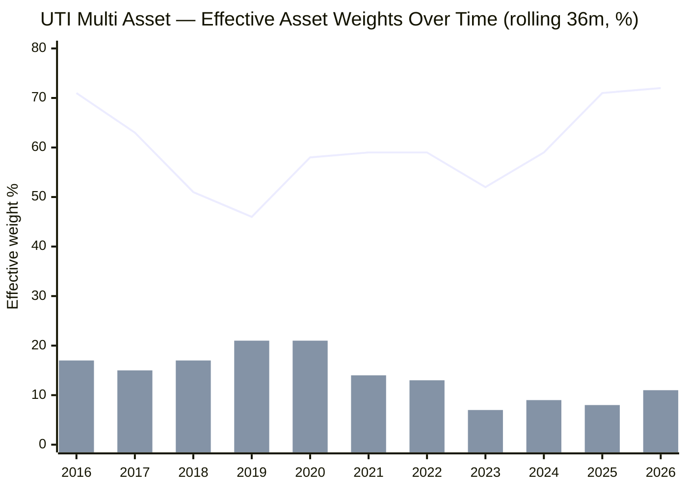
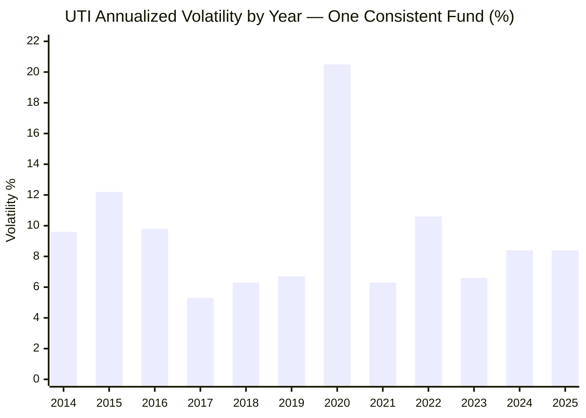
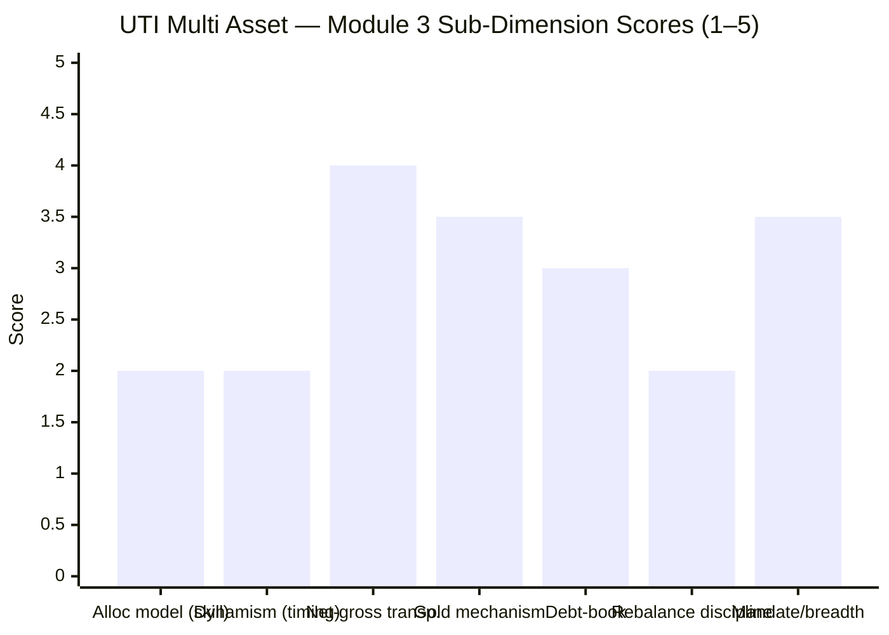

# Module 3: Allocation Engine & Portfolio DNA — UTI Multi Asset Allocation Fund

> **Provisional Module 3 score: ~2.8 / 5** (weight **20%** — the category's defining module, the analog of MidCap's "active share"). **Scores are NOT comparable to the four equity categories.**

> **The one-line context:** this is the module where UTI's marketing pitch meets the data — and loses. The SID advertises an **"in-house proprietary, valuation-driven dynamic allocation model"** (equity 40–80%, gold 10–25%, FI 10–25%). That is a genuine *skill claim* — the kind SBI never made. But the realised evidence refutes it twice over: **(1) 87% of UTI's return variance is explained by a *static* equity/debt/gold blend** (the highest of any studied fund — i.e. the "dynamic model" barely shows up in returns), and **(2) where the model *did* move, it moved the wrong way** — it cut gold from ~20% to ~8–12% *right as gold entered its 2024–25 boom*, the documentary mechanism behind M1's worst-in-study gold-year alphas. UTI is a **fundamentally equity-heavy (~70%) large-cap book with a gold garnish and a model that either doesn't move or mistimes** — the opposite of the defensive allocation skill this 20%-weighted module is meant to reward. Its one genuine structural virtue: honest, arbitrage-free equity that makes its tax status clean (banked in M4).

> **⭐ FACTSHEET BACKFILL (Jul 2026, Groww/ValueResearch/UTI SID):** the deferred items are filled. Current book: **equity ~70% (net) / UTI Gold ETF 12.5% / debt+GILT ~10–13% / REITs ~4% / cash 4.6%**, 136 holdings. Cap split **large 74% / mid 21% / small 4%.** Gold via the **in-house UTI Gold ETF** (physical-backed, direct). **No silver** (narrower than SBI's gold+silver). Managers: **Sharwan Kumar Goyal, Jaydeep Bhowal, Lokesh Kulthia** (full assessment → M5). **Former name: "UTI Wealth Builder Fund"** — but, unlike SBI's debt-MIP past, Wealth Builder was *already* an equity+gold multi-asset fund, so **there is no flattering mandate transition** in UTI's record (an important honesty point — see §2).

---

## ⚠ Data-Access Note (read first)

The category's defining data — the equity/debt/gold split and its history, net-vs-gross equity, gold mechanism, debt duration/credit, exact holdings — is **not in any API** (`percOtherH` returns 0). It lives in AMC factsheets + the SID. This module does two things:

1. **Reconstructs the effective asset-class weights and their path from NAV data** via *return-based style analysis* (a constrained rolling regression of the fund's returns on the equity/debt/gold index legs). Rigorous, data-driven, needs no factsheet — the backbone.
2. **Backfills the pure-factsheet items** (holdings, gold vehicle, cap split, managers) from Groww/ValueResearch/SID, marking duration/credit tiers and turnover as still-deferred. No holdings are fabricated.

---

## Fund Identity / Raw Data

| Attribute | Value | Source |
|-----------|-------|--------|
| MFAPI scheme code | 120760 (162 monthly obs, Jan 2013–Jul 2026) | api.mfapi.in |
| **Effective weights (full-period, style analysis)** | **Equity 61% / Debt 24% / Gold 15%** | MFAPI regression |
| **Effective weights (current, 36m to 2026)** | **Equity ~72% / Debt ~17% / Gold ~11%** | MFAPI regression |
| **Factsheet split (current, Groww Jul-2026)** | **Equity ~70% / Gold ETF 12.5% / Debt+GILT ~10–13% / REITs ~4% / Cash 4.6%** | Groww |
| Net equity (screener) | 66.4% | Tickertape, Jul 2026 |
| **3-factor model R²** | **86.8% (→ only ~13% selection/residual)** | MFAPI regression |
| Realised weight range (rolling 36m) | Equity **42–76%** · Debt 3–53% · Gold **4–25%** | MFAPI regression |
| Gross vs net equity | Net ~66–70%; **already ≥65% without arbitrage** → gross ≈ net, **no meaningful arbitrage sleeve** | screener + holdings |
| **Gold vehicle** | **UTI Gold ETF (12.5%)** — in-house, physical-backed; **no silver** | Groww |
| **REITs** | Knowledge Realty Trust (1.02%) + Embassy Office Parks (0.94%) + others ≈ 4% | Groww |
| Debt holdings | Government securities + bonds/debentures, ~10–13% (credit tiers/duration **deferred**) | Groww |
| Equity book | **136 holdings; top names ICICI 3.2%, HDFC 2.9%, Kotak 2.8%, ITC 2.7%, Nestlé 2.7%, TCS 2.3%** — quality large-cap + mid-cap kicker | Groww |
| **Cap split** | **Large 74.3% / Mid 21.5% / Small 4.2%** | Groww/aggregator |
| Managers | Sharwan Kumar Goyal · Jaydeep Bhowal · Lokesh Kulthia | Groww/VR (→ M5) |
| **Former name** | **UTI Wealth Builder Fund** (already an equity+gold multi-asset fund — *no* mandate discontinuity) | Groww URL / investing.com |
| Turnover / PE / sector % / debt duration | **factsheet — still deferred** | SID |

---

## Cross-Source Verification

| Metric | MFAPI style analysis | Factsheet (Groww) | Screener | Verdict |
|--------|----------------------|-------------------|----------|---------|
| Current effective equity | ~72% | ~70% | 66.4% (net) | ✅ Cross-validated — three methods within ~6pp; all agree the book is **~66–72% equity** (high) |
| Gold | ~11% | 12.5% | (in remainder) | ✅ Near-exact |
| Debt | ~17% | ~10–13% | 10.4% | ✅ Consistent (style analysis slightly high — regression noise) |
| Model R² | **86.8%** | — | — | The fund's returns are *overwhelmingly* a static-blend echo; little dynamic signal |

**Reliability: High for the reconstructed weights** (style analysis, factsheet, and screener triangulate within ~6pp on the current mix). **Moderate for the historical path** (style-analysis noise on rolling windows). **Low for debt duration/credit tiers and turnover** (explicitly deferred).

**ER note:** Groww shows **0.78%** vs Tickertape **0.88%** — a ~0.10pp discrepancy (likely different snapshot dates or plan variants). Flagged and resolved in **M4**.

---

## 1. The Allocation Engine — Reconstructed from 13.6 Years of Returns (the headline)

Return-based style analysis fits the fund's monthly returns to a non-negative, sum-to-one blend of the equity (Nifty 50), debt (ICICI All Seasons Bond), and gold (SBI Gold) legs, over rolling 36-month windows — the *effective* exposure the fund actually delivered, regardless of factsheet claims.

> Line = effective **equity** weight · Bar = effective **gold** weight (debt is the remainder)

| Window ending | Equity | Debt | Gold | Character |
|---------------|--------|------|------|-----------|
| 2016 | **71%** | 13% | 17% | Already equity-dominated + a real gold sleeve |
| 2018 | 51% | 33% | 17% | Trimmed equity, held gold |
| 2019 | **46%** | 33% | 21% | Most defensive it ever got — *right before* the 2020–21 equity bull (mistimed low) |
| 2020 | 58% | 21% | 21% | Re-risked; peak gold |
| 2022 | 59% | 28% | 13% | Gold already being cut |
| 2023 | 52% | 41% | **7%** | **Gold gutted to its low — right before gold's 2024–25 boom** |
| 2025 | **71%** | 21% | 8% | Equity ramped into a softening market; gold still starved |
| **2026** | **~72%** | ~17% | ~11% | Today: an equity-dominated book, thin gold |

**Two findings, both decisive — and both worse than SBI's:**

**(a) The "dynamic valuation model" is barely visible in returns, and where visible it mistimed.** Unlike SBI (a monotonic debt→equity *drift* with no timing), UTI's weights genuinely *oscillate* (equity 46–76%) — so there *is* an engine moving. But the engine moved **wrong at every major turn**:
- It cut equity to its **lowest (~46%) in 2019** — immediately before the 2020–21 equity bull (missed upside; the M1 opportunity-cost lag).
- It **gutted gold from ~21% (2020) to ~7% (2023)** — immediately before gold's **+20% (2024) and +72%-ETF (2025)** monster run. This is the **documentary mechanism** behind M1's two worst-in-study gold-year alphas (2019 −11.0, 2025 −11.4): the fund wasn't just passively under-weight gold, it was *actively selling it* into the setup for the biggest gold rally in the dataset.
- It **ramped equity to ~72% in 2025–26** into a softening equity tape (Nifty −6% YTD).

A valuation-driven model should *buy* what is cheap and *trim* what is dear. UTI's realised path did the reverse on gold and mistimed equity — **the engine exists, but its timing has been negatively skilful.** That is arguably worse than SBI's honest static drift: SBI didn't claim to time and didn't; UTI claims to time, charges for it, and timed badly.

**(b) The 3-factor model explains 86.8% of variance — the highest of the study.** Only ~13% is residual (security selection + the model's own moves). For comparison, SBI's residual was 35% and Quant's 44%. **UTI's returns are almost entirely a static equity/debt/gold blend echo** — there is very little idiosyncratic "allocation alpha" signal in the data. The ~13% residual is where the 2023–24 mid-cap outperformance lives (see §6) — i.e. what little edge exists is *equity stock/cap selection*, not asset allocation.

---

## 2. No Mandate Transition — the *Honest* Read (contrast with SBI)

SBI's Module 3 uncovered a debt-MIP past that flattered its low-risk record. **UTI has no such artifact — and that cuts against it, not for it.**

- The volatility profile is **broadly consistent throughout** (~6–12%, with only the 2020 COVID spike to 20.5%) — no debt-era-to-balanced-era regime break like SBI's 2.2%→13% jump.
- The former name — **"UTI Wealth Builder Fund"** — was *itself* an equity+gold multi-asset fund (launched 2008), so the rename to "Multi Asset Allocation" was a **relabelling, not a re-risking.**

> **⭐ RETROFIT to Modules 1 & 2 (Edelweiss discipline) — this makes the earlier findings *more* damning, not less:**
> - SBI's poor M3 came with a mitigant: its weak *recent*-fund numbers were dragged down by fusing eras. **UTI has no such excuse.** Its **10.18% SI CAGR (M1)**, **−25% max drawdown and 0.38 Sharpe (M2)**, and **negative allocation alpha (M1)** are **one consistent fund's true through-cycle record** — not an era-blend artifact. The fund genuinely underperformed as a multi-asset allocator across its whole life.
> - The gold-cutting path here is the **confirming mechanism** for M1's central finding (systematic gold under-harvesting) and M2's finding (thin cushioning). No score change to M1/M2 — but both are now *corroborated at the holdings level*, and the "is there allocation skill?" question is answered: **no, and the model's moves have hurt.**

---

## 3. Net-vs-Gross Equity & the Arbitrage Sleeve (NEW dimensions)

| Layer | Value | Read |
|-------|-------|------|
| **Net (directional) equity** | **~66–70%** | The true market exposure — the source of the 0.59 beta and 0.81 FlexiCap correlation in M2 |
| **Gross equity** | **≈ net (~66–70%)** | Net is *already* ≥65%, so **no arbitrage top-up is needed** to clear the equity-tax threshold |
| **Arbitrage sleeve** | **~0 (negligible)** | Unlike SBI (which needs ~15–18pp of arbitrage to reach 65% gross), UTI is genuinely equity-heavy — **no low-return arbitrage drag** |

**This is UTI's one clean structural advantage, and it is the mirror image of SBI.** Because UTI holds *real* equity above 65% net, its equity-tax status is **honest and secure** (no arbitrage engineering), and there is **no arbitrage return-drag** to subtract. The cost is exactly what M2 flagged: that same genuine ~70% equity is *why* it is a poor dampener and a heavy overlap with the portfolio's existing equity. **The tax strength and the risk weakness are the same fact.** (Tax value quantified in M4.)

---

## 4. Gold, Debt, and Asset-Class Breadth

| Dimension | Assessment | Status |
|-----------|------------|--------|
| **Gold mechanism** | ✅ **In-house UTI Gold ETF, 12.5%** — physical-backed, low-cost, low-tracking-error, held directly. Sound vehicle. **But the *sizing* has been poor** (cut into the boom, §1) — the mechanism is good, the allocation of it is not | ✅ vehicle / ⚠ sizing |
| **Silver / other metals** | **N/A — none.** UTI holds gold only (no silver ETF), narrower than SBI's gold+silver | ➖ narrower |
| **Debt-book construction** | ~10–13% of the book — government securities + bonds. **No credit event visible in NAV.** Small sleeve, so low risk-materiality; duration/credit tiers **deferred** | ⚠ deferred (low materiality) |
| **Asset-class breadth** | **4-class book: equity + gold + debt + REITs (~4%).** Meets the SEBI-minimum three, plus REITs — but narrower than SBI's 5-class (no silver) | ✅ (4-class) |
| **Structure (direct vs FoF)** | Equity, debt, REITs held directly; **gold via in-house UTI Gold ETF** (a fund-holding layer, negligible cost on 12.5%) | ✅ confirmed |
| **SEBI mandate compliance** (≥3 classes, ≥10% each) | ✅ **Met** — equity ~70%, gold 12.5% (>10%), debt ~10–13% (>10%, but the *thinnest* margin — a risk if debt is trimmed further). REITs are the extra 4th class | ✅ (debt margin tight) |

> **Debt-margin flag:** debt sits at ~10–13%, right at the SEBI ≥10%-per-class floor. If the model trims debt below 10% (as the style analysis shows it flirting with a 3% low historically), the fund risks breaching the ≥3-classes-≥10%-each mandate. Worth watching — a review trigger.

---

## 5. Rebalancing Discipline — an Engine That Fired at the Wrong Times (NEW)

The test: did the fund rebalance *at the right moments* (buy equity into 2020's crash, hold/add gold through 2022–2025, trim equity into the 2024 top)?

**The evidence says the engine moved, but mistimed the moves:**
- **Gold:** *cut* from ~21% (2020) to ~7% (2023) and left thin (~8–11%) straight through gold's biggest bull run (2024 +20%, 2025 +72% ETF). **The single clearest bad call in the study** — a valuation model should have *held or added* gold, not sold it into the setup.
- **Equity:** *ramped* to ~72% in 2025–26 into a softening tape, and sat at its *lowest* (~46%) in 2019 just before the 2020–21 bull — mistimed at both ends.
- **2020 crash:** no visible "buy-the-crash" equity spike; the −25% drawdown (M2) suggests it rode the fall rather than harvesting it.

Unlike SBI (whose flat drift was at least neutral), UTI's more-active engine **actively subtracted value** through mistimed gold and equity calls. For a 20%-weighted "allocation engine" module, an engine that moves *and moves wrong* scores below one that honestly doesn't move. The realised range is wider than SBI's, but width without skill is not a virtue.

---

## 6. Equity-Book DNA & Overlap with Existing Sleeves (informational — decision-tree feed)

The equity book (136 holdings) is a **quality large-cap core with a mid-cap kicker**:
- **Cap split: Large 74% / Mid 21% / Small 4%** — large-cap-dominated, which drives the 0.91 Nifty-50 and **0.81 PP FlexiCap correlation** (M2).
- **Top names: ICICI Bank, HDFC Bank, Kotak Mahindra, ITC, Nestlé, TCS, Bharat Electronics** — blue-chip financials + consumer + IT, **heavily overlapping the large-cap core Parag Parikh FlexiCap already holds.**
- **The ~21% mid-cap slice is the source of the 2023–24 alpha** (M1): mid-caps ripped in 2023–24, and that ~13% return residual (§1) is where the recent outperformance lives — **equity cap-selection, not asset allocation.**

**Decision-tree implication (reported in M2 §4):** UTI's ~70% equity half is substantially blue-chips the portfolio already owns; its genuinely additive content is only the ~12% gold + ~11% debt slice — and even that gold has been mis-sized. This is the worst additive-content profile of the cycle-tested funds.

---

## Comparison with Studied Funds

| Dimension | SBI Multi Asset | Nippon Multi Asset | **UTI Multi Asset** | Quant Multi Asset |
|-----------|-----------------|--------------------|--------------------|--------------------|
| Effective current mix | ~50/32/18 | ~56/20/24 | **~70/13/12 (+4 REIT)** | dynamic 46–84 eq |
| Static-blend R² (lower = more active) | 65% | ~70% | **87% (most static)** | 56% |
| Allocation model | Static drift | Discretionary, active | **"Valuation model" — but mistimed** | VLRT quant, very dynamic |
| Realised equity range | 6–54% | oscillating | **42–76%** | 46–84% |
| Allocation *skill* evidence | None (neutral drift) | Mixed/return-seeking | **Negative (cut gold into boom)** | Mixed (under-owned 2025 gold) |
| Asset breadth | 5-class | broad | **4-class (no silver)** | broad |
| Net/gross equity | 47% net, arbitrage to 65% | ~56% | **~70%, no arbitrage (clean)** | ~53% |
| **Module 3 score** | **~3.0** | **~3.4** | **~2.8** | **~3.3** |

**UTI scores lowest of the four on M3** — the defining module. It has the *most static* return signature (R² 87%), the *only negatively-skilful* realised allocation path (gold cut into the boom), and the *narrowest* breadth (no silver). Nippon and Quant at least run genuinely dynamic engines (even if return-seeking); SBI at least didn't actively harm. UTI markets an allocation skill its own return history refutes. Its sole M3 virtue — clean, arbitrage-free equity — is really a *tax* virtue that pays off in M4, not an allocation-engine virtue.

---

## Points For / Points Against — Allocation Engine & DNA

### ✅ For
1. **Honest, arbitrage-free equity (~70% net ≥65%)** — no tax-engineering games; the equity-tax status is clean and the fund carries no arbitrage return-drag (a real structural plus, cashed in M4).
2. **Sound gold vehicle** — in-house UTI Gold ETF, physical-backed, low-cost, held directly (the *mechanism* is good; the sizing is not).
3. **Quality equity book** — 136 holdings, blue-chip large-cap core (ICICI/HDFC/Kotak/ITC/Nestlé/TCS) + a mid-cap kicker that drove the 2023–24 alpha.
4. **No mandate-change flattering** — one consistent fund; the numbers are honest (though that makes the poor numbers more damning, §2).
5. **SEBI 3-class mandate met** + a 4th class (REITs).
6. **A genuinely wider realised range than SBI** — the engine does move (equity 42–76%).

### ❌ Against
1. **The "dynamic valuation model" is refuted by the data** — 87% static-blend R² (highest in the study); the model barely shows up in returns.
2. **Where it moved, it mistimed** — cut gold from ~21% to ~7% *into* gold's biggest boom (the mechanism behind M1's worst gold alphas); ramped equity into a softening tape; sat most-defensive right before the 2020–21 bull.
3. **~70% equity = closet-equity DNA** — the deepest overlap with the portfolio's existing large-caps (0.81 to PP FlexiCap); worst additive content of the cycle-tested funds.
4. **Narrowest breadth of the studied set** — gold only, no silver; 4-class vs SBI's 5.
5. **Debt at the ≥10% SEBI floor** — thin margin; a further trim risks mandate breach (review trigger).
6. **The little edge that exists is equity cap-selection (mid-caps), not asset allocation** — the ~13% residual, not the allocation engine.

---

## Module 3 Scorecard

| Sub-dimension | Score | Reasoning |
|---------------|-------|-----------|
| Allocation model — clarity & testability *as skill* | **2.0** | A clear *claim* (valuation model), but the test fails: 87% static-blend R² and mistimed moves — no demonstrated skill, some demonstrated harm |
| Dynamism (realised *tactical* range vs skill) | **2.0** | Wide range (42–76% eq), but negatively skilful — cut gold into the boom; width without timing |
| Net-vs-gross equity transparency | **4.0** | ~70% net ≥65% with **no arbitrage** — the cleanest, most honest equity structure of the studied funds |
| Gold mechanism quality | **3.5** | ✅ In-house physical UTI Gold ETF — sound vehicle; docked because the *sizing* was poor and there's no silver |
| Debt-book quality | **3.0** | ~10–13%, govt+bonds, no NAV credit event; small sleeve, but duration/credit unverified and at the SEBI floor |
| Rebalancing discipline (evidence) | **2.0** | The engine fired at the wrong times — gold cut into its boom, equity mistimed at both ends |
| SEBI mandate compliance + asset breadth | **3.5** | 3-class met + REITs (4-class), but narrower than SBI's 5-class; debt margin thin |
| Overlap with sleeves | *informational* | 0.81 to PP FlexiCap; blue-chip overlap — decision-tree feed, not scored |
| **Module 3 Overall** | **~2.8 / 5** | The lowest M3 of the studied set. A fund that *markets* allocation skill its return history refutes, with a mistimed engine and closet-equity DNA — redeemed only by an honest, arbitrage-free tax structure (an M4 virtue) and a sound gold vehicle. Not comparable to equity-category Module 3 scores |

---

## Comparative Module 3 Scores (studied funds — calibration only)

| Fund | Module 3 | DNA verdict |
|------|----------|-------------|
| Nippon Multi Asset | ~3.4 / 5 | Genuine active engine; return-seeking, not risk-reducing |
| Quant Multi Asset | ~3.3 / 5 | Most dynamic (VLRT); return-max, high stock-selection residual |
| SBI Multi Asset | ~3.0 / 5 | Genuine 5-class book, but static drift — no engine |
| **UTI Multi Asset** | **~2.8 / 5** | **Markets a valuation model the data refutes; mistimed engine, closet-equity DNA, honest tax structure** |

> Module 3 is 20% here (vs 15% in equity studies) because *how a multi-asset fund allocates is the whole active claim*. UTI's last-place score is the study's clearest verdict on the fund: the active-allocation claim is not merely unsupported (as with SBI) — it is **contradicted** by the fund's own gold-cutting history.

---

## SIP Implication

For a ₹15–20k/month SIP, Module 3 reframes what UTI Multi Asset actually is: **not** a fund where a valuation model defensively tilts between assets to protect you, but a **~70% large-cap equity fund with a shrinking gold garnish and a model whose moves have hurt** — it sold gold into the biggest gold rally in a decade. That closet-equity DNA explains everything upstream: the negative allocation alpha (M1), the −25% drawdown and 0.81 equity correlation (M2). Three independent lines — M1 (loses to DIY, negative alpha), M2 (poorest diversifier, thin cushioning), M3 (mistimed engine, ~70% equity) — now converge on the same conclusion: **as an active multi-asset allocator, UTI adds little the portfolio doesn't already have, and its engine has been a net negative.** The *only* remaining argument for the fee is the one thing M3 confirms it does honestly: hold genuine ≥65% equity for clean equity taxation — the M4 question.

## One-Line Verdict

**Return-based reconstruction and the factsheet agree: UTI is a ~70% large-cap equity book with a gold garnish, running a "valuation model" its own history refutes — 87% of its returns are a static-blend echo, and where the model *did* act it cut gold from ~21% to ~7% straight into gold's biggest boom, actively subtracting value; the lowest allocation-engine score of the study, redeemed only by an honest, arbitrage-free equity structure that pays off as tax, not as allocation skill.**

---

*Module 3 complete. Provisional score 2.8/5. Method: return-based style analysis (constrained rolling regression, MFAPI 120760 vs Nifty 50 120620 / ICICI All Seasons Bond 120603 / SBI Gold 119788, 162 monthly obs, R² 86.8%); era/vol split from daily NAV; holdings/cap-split/gold-vehicle/managers/former-name from Groww + ValueResearch + UTI SID. **Backfilled:** ~70% equity / 12.5% UTI Gold ETF / ~10–13% debt / ~4% REITs / 4.6% cash, 136 holdings, large 74/mid 21/small 4 cap split, in-house physical gold ETF (no silver), manager trio, former name "UTI Wealth Builder Fund" (already multi-asset — no mandate discontinuity). **Still deferred:** debt duration/credit tiers, turnover, PE, sector %, exact gross-vs-net (assessed ≈ equal). **Cross-module retrofit (Edelweiss discipline):** (1) the gold-cutting path (**~21% → ~7% into the 2024–25 boom**) is the confirming *mechanism* for M1's worst-in-study gold-year alphas and M2's thin cushioning — corroborated at the holdings level, no score change; (2) unlike SBI, **UTI has no flattering mandate transition**, so M1's 10.18% SI and M2's −25% DD are one honest fund's true record — which makes those weak numbers *more* damning, not less; (3) the clean, arbitrage-free ≥65% net equity is handed to M4 as a genuine tax strength.*

*Next: [Module 4 — Cost & Tax Efficiency](module4_cost_tax.md)*
